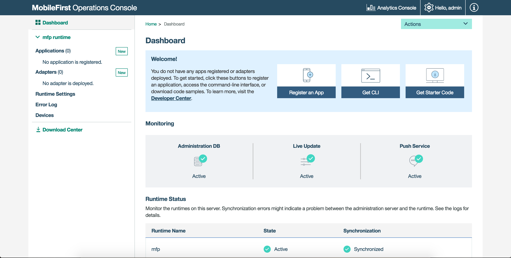
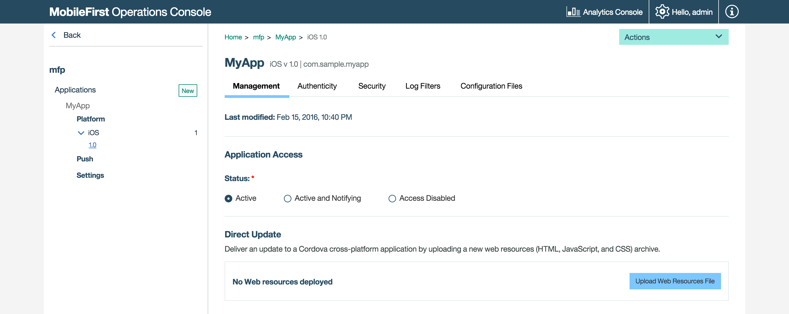
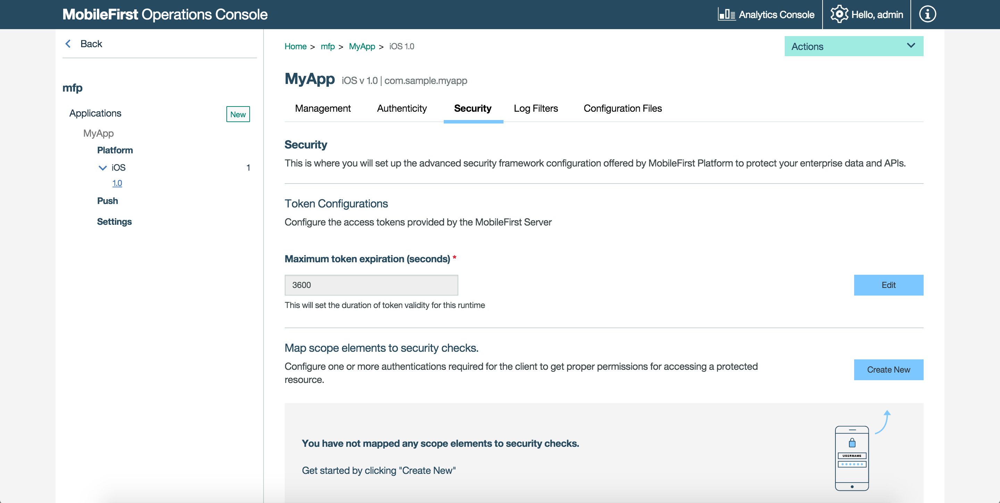
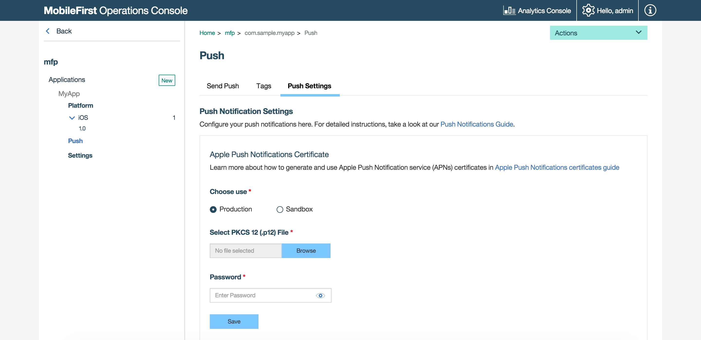
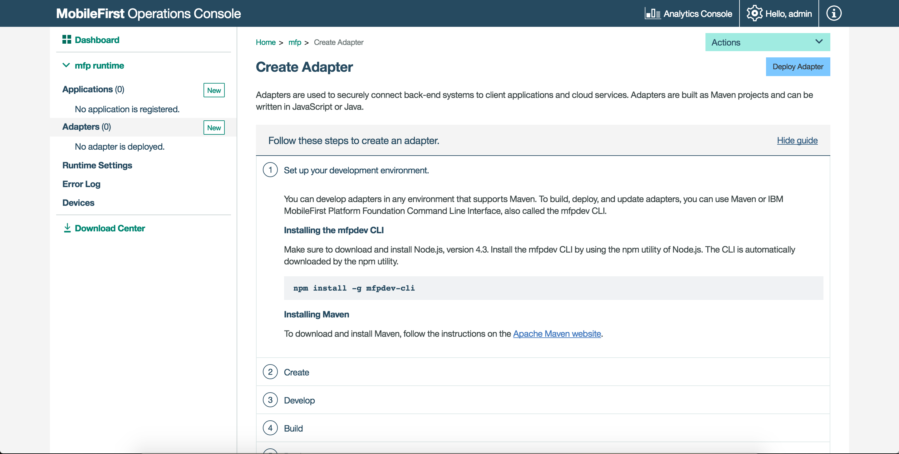
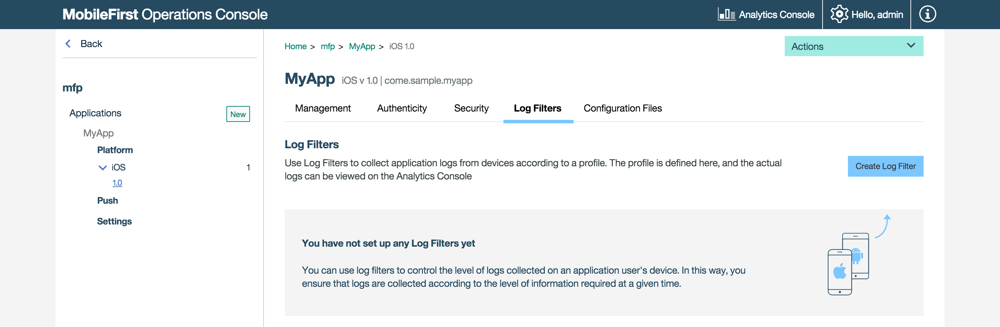

## Overview
The MobileFirst Platform Operations Console is a web-based UI which enables simplified work flows for both the developer and the administrator to create, monitor, secure and administer applications &amp; adapters.

#### Jump to:

* [Accessing the console](#accessing-the-console)
* [Navigating the console](#navigating-the-console)

## Accessing the console
The MobileFirst Operations Console can be accessed in the following ways:

### From a locally installed MobileFirst Server
#### Desktop Browser
From your browser of choice, load the URL [http://localhost:9080/mfpconsole](http://localhost:9080/mfpconsole). The username/password are *admin/admin*.

#### Command-line
From a **Command-line** window, with the MobileFirst CLI installed, run the command: `mfpdev server console`.

### From a remotely installed MobileFirst Server
#### Desktop Browser
From your browser of choice, load the URL `http://the-server-host:server-port-number/mfpconsole`  
The host server can be a customer-owner server, or running on a service such as Bluemix. The username/password are *admin/admin*.

#### Command-line
From a **Command-line** window, with the MobileFirst CLI installed, 

1. Add a remote server definition:

    *Interactive Mode*  
    Run the command: `mfpdev server add` and follow the on-screen instructions.

    *Direct Mode*  
    Run the command with the following structure: `mfpdev server add [server-name] --URL [remote-server-URL] --login [admin-username] --password [admin-password] --contextroot [admin-service-name]`. For example:

    ```bash
    mfpdev server add MyRemoteServer http://my-remote-host:9080/ --login TheAdmin --password ThePassword --contextroot mfpadmin
    ```

2. Run the command: `mfpdev server console MyRemoteServer`.

> Learn more about the various CLI commands in the [Using CLI to manage MobileFirst artifacts](../../using-the-mfpf-sdk/using-cli-to-manage-mobilefirst-artifacts/) tutorial.

## Navigating the console

### Dashboard
The Dashboard provides a glance view of the deployed projects.



### Runtime settings
Edit runtime properties such as Analytics server URL, global security variables, server keystore and confidential clients.


### Applications

#### Creating applications
Provide basic application values and download Starter Code. 


#### Managing applications
Manage and configure registered applications by use of [Direct Update](../../using-the-mfpf-sdk/direct-update/), Remote Disable, [Application Authenticity](../../authentication-and-security/application-authenticity/), and [setting security parameters](../../authentication-and-security/authorization-concepts/).



#### Authentication and Security
Configure application security paramteres, such as the default token expiration value, map scope elements to security checks, define, mandatory application scopes and configure security check options.



#### Notifications
Set-up [push notifications](../../notifications/push-notifications-overview/) and related parameters, such as certificates and GCM details, define tags, as well as send notifications to devices.



### Adapters

#### Creating adapters
Register an adapter and download Starter Code, as well as update an adapter on-the-fly by updating its properties without needing to re-build and re-deploy the adapter artifact.



#### Adapter properties
After an adapter is deployed, it can be configured in the console.


### Devices
Administrators can search for devices that access the MobileFirst Server and can manage access rights.  
Devices can be searched for using either user ID or using a friendly name. The user ID is the identifier that was used to log-in.  
A friendly name is a name that is associated with the device to distinguish it from other devices that share the user ID. 

> For more information, see the topic about device access management in the MobileFirst Operations Console in the user documentation.


### Client logs
Administrators can use log profiles to adjust client logger configurations, such as log level and log package filters, for any combination of operating system, operating system version, application, application version, and device model.

When an administrator creates a configuration profile, the log configuration is concatenated with responses API calls such as `WLResourceRequest`, and is applied automatically.</p>

> For more information, see the topic about client-side log capture configuration from MobileFirst Operations Console in the user documentation.



### Error log
The Error log shows a list of the failed management operations that were initiated from the MobileFirst Operations Console, or from the command line, on the current runtime environment. Use the log to see the effect of the failure on the servers.

> For more information, see the topic about error log of operations on runtime environments in the user documentation.


### License tracking
Accessible from the top Settings buttons.

License terms vary depending on which edition (Enterprise or Consumer) of MobileFirst Platform Foundation is being used.   License tracking is enabled by default and tracks metrics relevant to the licensing policy, such as active client devices and installed applications. This information helps determine whether the current usage of MobileFirst Platform is within the license entitlement levels and can prevent potential license violations.

By tracking the usage of client devices and determining whether the devices are active, administrators can decommission devices that should no longer be accessing the service. This situation might arise if an employee has left the company, for example.

> For more information, see the topic about license tracking in the user documentation.</p></blockquote>


### Downloads
For situtations where Internet connectivity is not available, you can download a snapshot of the various development artifacts of MobileFirst Platform Foundation from the Downloads page.


