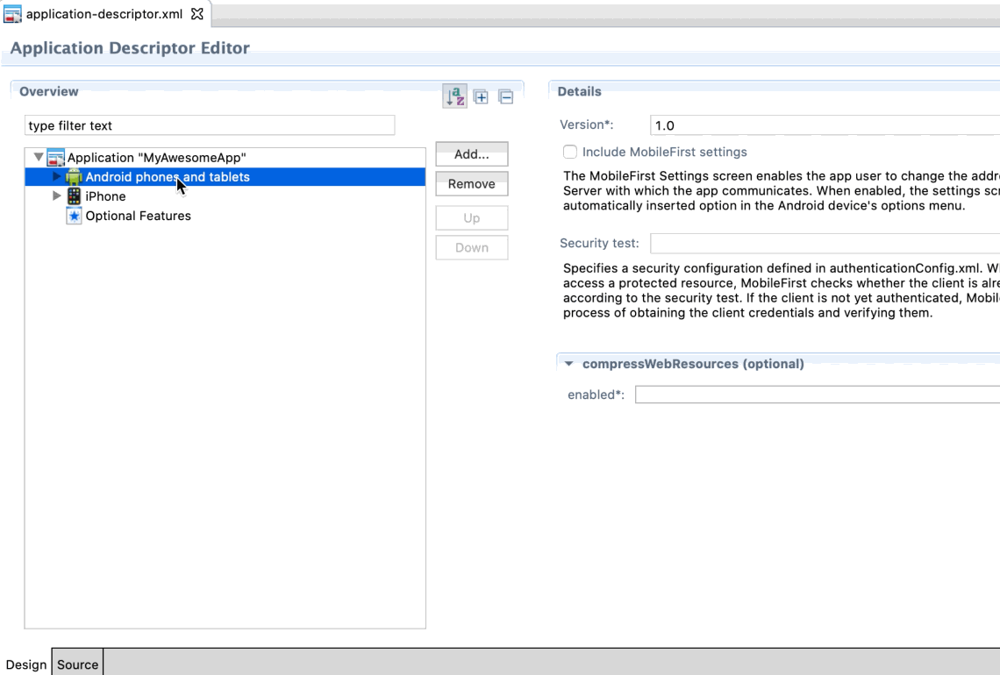

<!-- NLS_CHARSET=UTF-8 -->
# Mobile Foundation Migration Studio
{: #mf-migration-studio}

> Download the [Mobile Foundation Migration Studio](https://github.com/MobileFirst-Platform-Developer-Center/Mobile-Foundation-Migration-Studio/releases/download/20200421-1300/Mobile-Foundation-Migration-Studio-20200421-1300.zip).

## What is Migration Studio
{: #what-is-migration-studio}

Mobile Foundation Migration Studio plugin is an Eclipse plugin that does an in-place upgrade of hybrid projects on MobileFirst Platform Foundation v7.1, enabling them to connect to a Mobile Foundation v8 server. This plugin is similar to the MobileFirst v7.1 Studio plugin and can be installed on the same supported environments as MobileFirst Platform Foundation v7.1 Studio.

## Why use the Migration Studio
{: #why-use-migration-studio}

Mobile Foundation Migration Studio plugin provides a quick path for enabling the upgrade of existing MobileFirst Platform Foundation v7.1 hybrid apps, so that they work with Mobile Foundation v8.

> Mobile Foundation Migration Studio does a limited migration to Mobile Foundation v8, so the standard migration approach should be the preferred approach.

## Compare migration using the Migration Studio with the standard migration approach
{: #compare-with-standard-migration}

The standard migration approach on a MobileFirst Platform Foundation v7.1 hybrid app as described in the [Migration Cookbook]({{site.baseurl}}/tutorials/en/foundation/8.0/upgrading/migration-cookbook/) will result in a full fledged Cordova app that connects to a Mobile Foundation v8 server. The Migration Studio approach, however, will retain the legacy hybrid structure of the app (i.e. a MobileFirst project with an embedded Cordova plugin). Due to this reason, the apps that are migrated using the Migration Studio will not have the full spectrum of capabilities available to a traditional Mobile Foundation v8.0 app. See this [section](#known-limitations-of-migration-studio) for a full list of known limitations.   

## Get started with Migration Studio
{: #get-started-with-migration-studio}

To get started with Migration Studio, you need to carry out the following tasks.

* **Task 1**: Set up your project.

  Execute the following steps to complete this task.

  1. Install a version of Eclipse that is supported by MobileFirst Platform Foundation v7.1 Studio plugin.

  2. Download the [Migration Studio](https://github.com/MobileFirst-Platform-Developer-Center/Mobile-Foundation-Migration-Studio/releases/download/20200421-1300/Mobile-Foundation-Migration-Studio-20200421-1300.zip) and install the plugin on to your Eclipse IDE. This step is no different from installing MobileFirst Platform Foundation v7.1 Studio plugin.
     > **Important:** Do not do an in-place upgrade over an existing MobileFirst Studio installation.

  3. Import your MobileFirst Platform Foundation v7.1 project into the Mobile Foundation Migration Studio using the **File > Import > File System** option. Alternatively, if you have the project already exported and in your file system, you can import the exported `.zip` file.  You will notice that the Migration Studio interface is very similar to the MobileFirst Platform Foundation v7.1 Studio.

  4. Retain a backup of your environment folders (android, iphone, ipad). Open the `application-descriptor.xml` and delete the environments. Choose the option to delete all workspace resources.
  

  5. Add the environment(s) to your project again and wait for the build to complete. At this step, if your earlier project had any customizations (for example, adding a custom Cordova plugin) done to the native project, you will have to repeat them here.
  > The Migration Studio upgrades the version of Cordova within the project, and therefore, some existing third-party Cordova plugins may not be compatible with the new version of Cordova. If so, check for an update available to your plugin and update the Cordova plugin to the appropriate version.

* **Task 2**: Set up your application.

  Execute the following steps to complete this task.

  1. Custom Challenge handlers will be modified to work with the challenge handler framework of Mobile Foundation v8. However, you will have to modify the challenge handler's `createChallengeHandler` method and the response that is submitted for the challenge to suit the Mobile Foundation v8.0 security check.
      **7.1 app**
      ```JavaScript
      var loginChallengeHandler = WL.Client.createChallengeHandler("UserLoginRealm");
      options.parameters = {
              j_username : $('#AuthUsername').val(),
              j_password : $('#AuthPassword').val()
       };
      ```

      **Migrated app**
      ```JavaScript
      var loginChallengeHandler = WL.Client.createChallengeHandler("UserLoginSecurityCheck");
      options.parameters = {
              username : $('#AuthUsername').val(),
              password : $('#AuthPassword').val()
       };
      ```

      >**Note**: The parameters and the name depends on how you configure your security check.

  2. [**Optional**] If you have multiple html pages in your app, edit each html file and edit the path references to the JavaScript and CSS files to work with the new project.

* **Task 3**: Configure Mobile Foundation v8.0.

  Execute the following steps to complete this task.

  1. Start the Mobile Foundation v8 server (use either the Mobile Foundation v8 DevKit server or an OpenShift Container Platform installation of Mobile Foundation or a traditional on-premise installation of Mobile Foundation) and register your app on the Mobile Foundation v8 server. More details on registering the v8 Cordova apps is [here](https://mobilefirstplatform.ibmcloud.com/tutorials/en/foundation/8.0/quick-start/cordova/#2-creating-and-registering-an-application).

  2. Migrate your adapters and authentication or login modules and deploy them to your Mobile Foundation instance. For more information on migrating adapters, see this [section](../migrating-adapters/).

* **Task 4**: Run your application.

  Execute the following steps to complete this task.

  **Android**

  1. Open Android Studio (3.2 or higher).
  2. Click **Open an existing Android Studio Project** and navigate to the folder `Eclipse Workspace/<ProjectName>/apps/<AppName>/android/native`.
  3. Accept any prompts to recreate the gradle wrapper, upgrade or change the version of gradle wrapper and any prompts to clear the read-only status of the files.
  4. Navigate to the `mfpclient.properties` file in the **Project** view and modify the server connection parameters.
  5. Run the project. If required, change the version of the `compileSdk` and build tools in the `build.gradle` file.
  6. If you are using Push Notifications, you will have to generate a `google-services.json` file and replace it in the project. For more information, read this [blog post]({{site.baseurl}}/blog/2018/10/09/FCM-Support-in-MFP-7.1-Android/). 

  **iOS**

  1. Using XCode, open the iOS native project found in `Eclipse_Workspace/<ProjectName>/apps/<AppName>/iphone/native`.
  2. Navigate to the `mfpclient.plist` file in the **Project** view and modify the server connection parameters.
  3. If your application is using Push Notifications feature, enable Push Notifications capability in Xcode project settings and add a valid provisioning profile. See [here]({{site.baseurl}}/tutorials/en/foundation/8.0/notifications/handling-push-notifications/cordova/#ios-platform), for more details.
  4. No additional configuration is required for iOS, you can run the project from XCode.
  > Follow the same steps if you have an iPad environment.

  >**Note**: For all the environments(Android, iOS and iPad) the `static_app_props.js` (`www/default/plugins/cordova-plugin-mfp/worklight`) file has to be modified with the application details such as version, package name or bundle identifier before building and running the app.

## Known limitations of Migration Studio
{: #known-limitations-of-migration-studio}

* Migration Studio only upgrades Android, iPhone and iPad environments. Other environments are not upgraded. 
* Preview is not supported by this plugin.
* Migration Studio upgrades the embedded version of `cordova-android` to 8.1.0 and `cordova-ios` to 5.1.1. This version is fixed and cannot be modified.
* Only the default skin is supported.
* You will not be able to publish direct update packages to the MobileFirst server with this project.
* JSON Store APIs are not yet supported in this release.
  > **Note**: JSON Store can still be used by manually adding the files to the project i.e., adding `cordova-plugin-mfp-jsonstore` to the plugins folder, adding the plugin reference to the `cordova_plugins.js` file, and attaching the required JAR/Framework files.

* New capabilities of Mobile Foundation v8.0 are not supported.
* APIs that are [deprecated or discontinued]({{site.baseurl}}/tutorials/en/foundation/8.0/product-overview/release-notes/deprecated-discontinued/#client-side-api-changes) will have modified behaviour. See the following section for details on the change in behaviour.

## Migrating applications using JSONStore
{: #migrating-apps-using-jsonstore}

Migration of JSONStore plugin from applications using JSONStore is not automated in Migration Studio. Perform the following steps to manually migrate the JSONStore projects.

Download the `cordova-plugin-mfp-jsonstore` from [here](https://us-south.git.cloud.ibm.com/ibmmfpf/cordova-plugin-mfp-jsonstore/tree/master).

### For Android

1. Copy the following `cordova-plugin-mfp-jsonstore/bootstrap.js` file and `cordova-plugin-mfp-jsonstore/worklight`  folder to `<ProjectName>/apps/<AppName>/android/native/<ProjectName><AppName>android/src/main/assets/www/default/plugins/cordova-plugin-mfp-jsonstore` folder.

2. Open the `<ProjectName>/apps/<AppName>/android/native/<ProjectName><AppName>android/src/main/assets/www/default/cordova_plugins.js`  file and add the following entry for JSONStore in the `module.exports` array.
 ```json
 {
      "id": "cordova-plugin-mfp-jsonstore.jsonstore",
      "file": "plugins/cordova-plugin-mfp-jsonstore/bootstrap.js",
      "pluginId": "cordova-plugin-mfp-jsonstore",
      "runs": true
   }
 ```

3. Copy the dependencies(JAR files only) from the downloaded `cordova-plugin-mfp-jsonstore/src/android/libs` to the ``<ProjectName>/apps/<AppName>/android/native/<ProjectName><AppName>android/libs` folder and add these entries to the ``<ProjectName>/apps/<AppName>/android/native/<ProjectName><AppName>android/build.gradle` file dependencies section.
   ```text
   compile files('libs/commons-codec.jar')
   compile files('libs/guava.jar')
   compile files('libs/jackson-core-asl.jar')
   compile files('libs/jackson-mapper-asl.jar')
   compile files('libs/ibmmobilefirstplatformfoundationjsonstore.jar')
   compile files('libs/sqlcipher.jar')
   ```

4. Add the following entry to `<ProjectName>/apps/<AppName>/android/native/<ProjectName><AppName>android/src/main/res/config.xml` file.
   ```xml
   <feature name="StoragePlugin">        
   <param name="android-package" value="com.worklight.androidgap.jsonstore.dispatchers.StoragePlugin" />    
   </feature>
   ```

### For iOS

1. Copy the following `cordova-plugin-mfp-jsonstore/bootstrap.js` file and `cordova-plugin-mfp-jsonstore/worklight` folder to `<ProjectName>/apps/<AppName>/iphone/native/www/default/plugins/cordova-plugin-mfp-jsonstore` folder.

2. Open the `<ProjectName>/apps/<AppName>/iphone/native/www/default/cordova_plugins.js` file and add the following entry for JSON Store in the `module.exports` array.
  ```JSON
  {
      "id": "cordova-plugin-mfp-jsonstore.jsonstore",
      "file": "plugins/cordova-plugin-mfp-jsonstore/bootstrap.js",
      "pluginId": "cordova-plugin-mfp-jsonstore",
      "runs": true
      }
  ```
3. Copy the framework from the downloaded `cordova-plugin-mfp-jsonstore /src/ios/Frameworks/IBMMobileFirstPlatformFoundationHybridJSONStore.framework to<ProjectName>/apps/<AppName>/iphone/native/Frameworks` folder and add it to the XCode's **Frameworks, Libraries and Embedded Content** in the general tab.

   >**Note**: Don't replace the SQLCipher framework that is already present in the XCode project.


## Use of deprecated or discontinued APIs
{: #deprecated-n-discontinued-apis}

The following APIs have been discontinued and will have to be manually replaced with alternatives. 
Visit [this documentation]({{site.baseurl}}/tutorials/en/foundation/8.0/product-overview/release-notes/deprecated-discontinued/#client-side-api-changes) to learn about the replacements.

| API |
|-----------------------|
|WL.App.BackgroundHandler|
|WL.Badge|
|WL.EncryptedCache|
|WL.TabBar|
|WL.TabBarItem|
|WL.Trusteer|
|WL.Client.createProvisioningChallengeHandler|
|WL.Client.createWLChallengeHandler|
|WL.SecurityUtils.remoteRandomString|

The following APIs are no longer supported but an error message is displayed on the console when called.

| API |
|-----------------------|
|WL.Client.checkForDirectUpdate|
|WL.Client.close (android only)|
|WL.Client.getLoginName|
|WL.Client.getUserInfo|
|WL.Client.getUserName|
|WL.Client.getUserPref|
|WL.Client.getLoginName|
|WL.Client.isUserAuthenticated|
|WL.Client.getUserPref|
|WL.Client.setUserPrefs|
|WL.Client.hasUserPrefs|
|WL.Client.deleteUserPref|
|WL.Client.updateUserInfo|
|WL.Toast.show (android only)|
|WLAuthorizationManager.getUserIdentity|
|WLAuthorizationManager.getDeviceIdentity|
|WLAuthorizationManager.getAppIdentity|

## Support
{: #ms-support}

Mobile Foundation Migration Studio is an add-on made available for easy migration from MobileFirst Platform Foundation v7.1 to Mobile Foundation v8.0. The regular IBM support process of opening a case on the IBM Support portal does not apply for any issues related to the Migration Studio. For support, [raise a request to join our Slack channel]({{site.baseurl}}/blog/2017/05/26/come-chat-with-us/) or open a [GitHub issue](https://github.com/MobileFirst-Platform-Developer-Center/Mobile-Foundation-Migration-Studio/issues).
