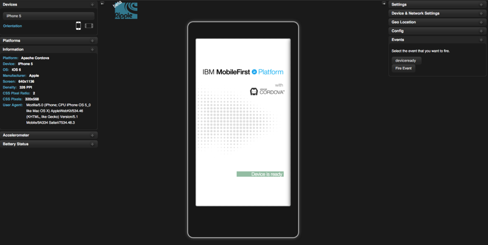
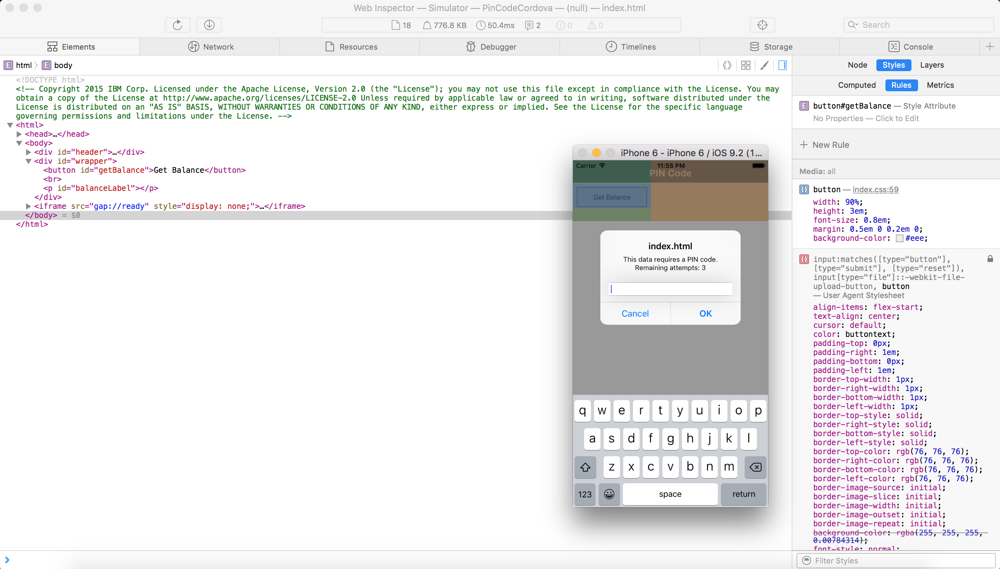
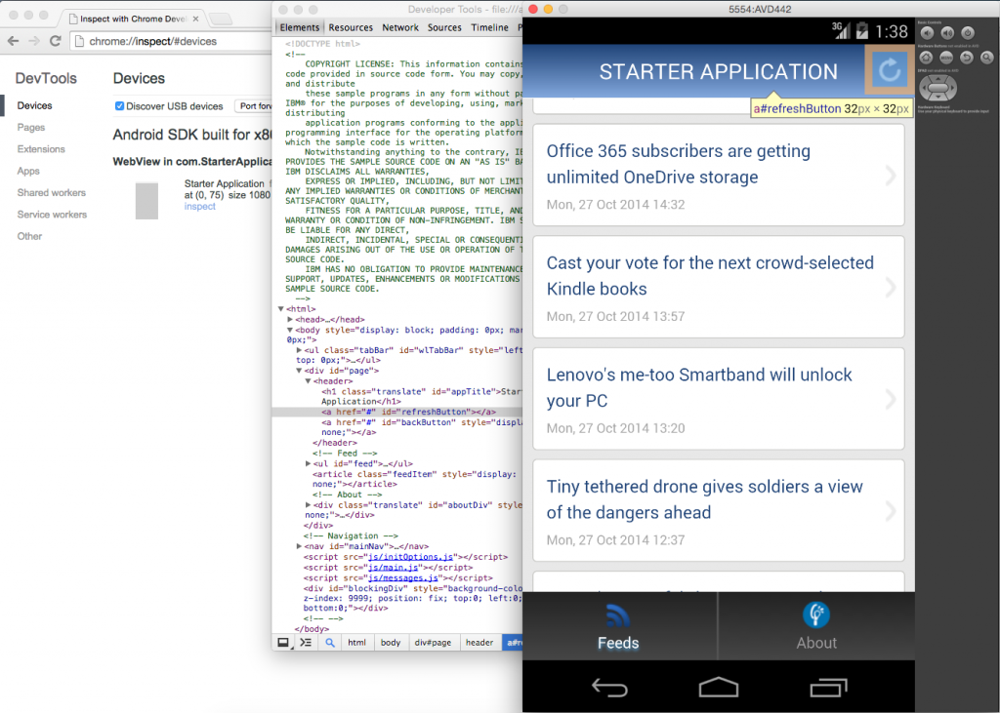
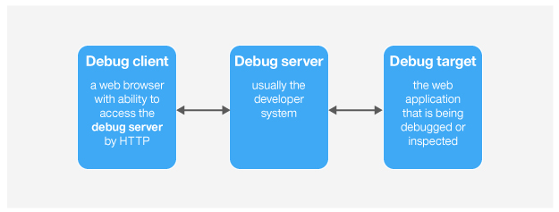
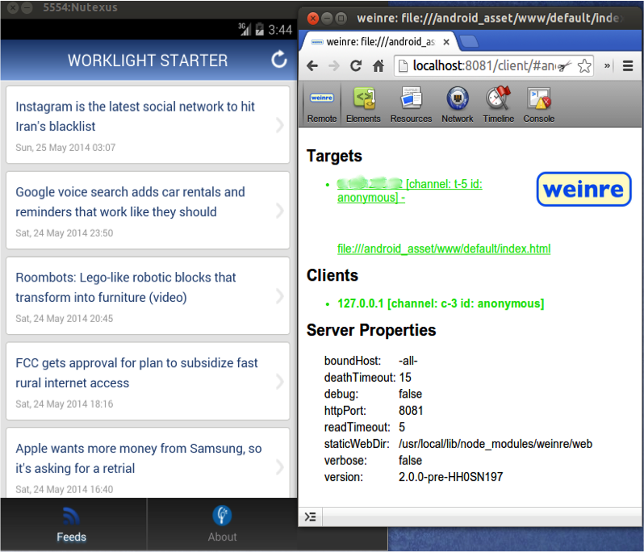

## Overview
Debugging is a process that consists of finding the cause of defects in applicative code and application user interface.

* Cordova applications consist of web-based resources such as HTML, JavaScript &amp; CSS, and optional native code (written in Java, Objective-C, Swift, C#, ...).
* Native code can be debugged by using standard tools that are provided by the platform SDK, such as XCode, Android LogCat, or Microsoft Visual Studio.

This tutorial explores various approaches to debugging a Cordova application, whether running locally via an Emulator or Simulator, or while running in a physical mobile device.

> Learn more about Cordova debugging and testing in the Cordova website: [Debugging applications](https://cordova.apache.org/docs/en/latest/guide/next/index.html#link-testing-on-a-simulator-vs-on-a-real-device).

#### Jump to:

* [Debugging with the IBM Mobile Browser Simulator](#debugging-with-the-ibm-mobile-browser-simulator)
* [Debugging with Ripple](#debugging-with-ripple)
* [Debugging with iOS Remote Web Inspector](#debugging-with-ios-remote-web-inspector)
* [Debugging with Chrome Remote Web Inspector](#debugging-with-chrome-remote-web-inspector)
* [Debugging with Weinre](#debugging-with-weinre)
* [Debugging with IBM MobileFirst Logger](#debugging-with-ibm-mobilefirst-logger)
* [Debugging with WireShark](#debugging-with-wireshark)

## Debugging with the IBM Mobile Browser Simulator
You can use IBM MobileFirst Platform Foundation's Mobile Browser Simulator (MBS) to preview and debug MobileFirst applications.  
To use the MBS, open a **Command-line** window and run the command:

```bash
mfpdev app preview
```

If your application consists of more than one platform - specify the platform to preview:

```bash
mfpdev app preview -p <platform>
```

> Learn more about the MobileFirst Developer CLI in the [Using MobileFirst Developer CLI to manage MobileFirst artifacts](../using-mobilefirst-developer-cli-to-manage-mobilefirst-artifacts) tutorial.

## Debugging with Ripple
Apache Ripple™ is a web based mobile environment simulator for debugging mobile web applications.  
It lets you run a Cordova application in your browser and fake various Cordova features. For example, it can fake the camera API by letting you select a picture locally from your computer.  

### Installing Ripple

1. Download and install the latest version of [Node.js](https://nodejs.org/en/) (v0.12.0 or later required).  
You can verify Node.js installation by typing `npm -v` in terminal.
2. Open terminal and type:

    ```bash
    npm install -g ripple-emulator
    ```

### Running application using Ripple
After Ripple is installed open terminal from your Cordova project location and type:

```bash
ripple emulate
```



> More information about Apache Ripple™ can be found on the [Apache Ripple page](http://ripple.incubator.apache.org/) or [npm ripple-emulator page](https://www.npmjs.com/package/ripple-emulator).

## Debugging with iOS Remote Web Inspector
Starting in iOS 6 Apple introduced a remote [Web Inspector](https://developer.apple.com/safari/tools/) for debugging web applications on iOS devices. To debug, make sure that the device (or simulator) has the **Private Browsing** option turned off.  
To enable Web Inspector on the device, Tap **Settings > Safari > Advanced > Web Inspector**.


1. To start debugging, connect the iOS device to a Mac, or start the simulator.
2. In Safari, go to **Preferences > Advanced**, and select the **Show Develop menu in menu bar** checkbox.

    
3. Now in Safari, select **Develop > [*your device ID*] > [*your application HTML file*]**.  
The DOM can now be inspected. It is also possible to alter the CSS and run JavaScript commands, just as in the desktop inspector.

    

## Debugging with Chrome Remote Web Inspector
Using Google Chrome it is possible to remotely inspect web applications on Android devices or the Android Emulator.  
This action requires Android 4.4 or later, Chrome 32 or later, and IBM Worklight Foundation V6.2.0 or IBM MobileFirst Platform Foundation 6.3 or later. Additionally, in the `AndroidManifest.xml` file, `targetSdkVersion = 19` or above is required. In the `project.properties` file, `target = 19` or above is required.

1. Start the application in the Android Emulator or a connected device.
2. In Chrome, enter the following URL in the address bar: `about:inspect`.
3. Press **Inspect** for the relevant application.

You can now use all the features of the Chrome Inspector to inspect the Android application.



## Debugging with Weinre
Weinre is a debugger for web pages, like Firebug or other Web Inspectors, except that **Weinre is designed to work remotely**.
Weinre can be used to inspect and debug web resources such as HTML, JavaScript, CSS, and network traffic on mobile handsets.
The Weinre architecture includes the following components:


The Weinre debug server requires a `node.js` runtime.
You can find instructions to install Weinre on the [Weinre installation page](http://people.apache.org/~pmuellr/weinre/docs/latest/Installing.html).

#### Debug server
When the Weinre server is installed, enter the following command to run it:  
`weinre --httpPort 8080 --boundHost -all-`  
This command starts a Weinre server.  
The default port is `8080` but you can change it.

#### Target
The Weinre server must be accessible from the device that will be used for debugging.  
To make it accessible, add the following code line to the web application:

```
<script src="http://a.b.c:8080/target/target-script-min.js"></script>
```

Where `a.b.c` is the hostname or IP of the Weinre server.

#### Client
Before you can start debugging, make sure that the application is open and loaded on the browser with this URL:


### Debugging with IBM MobileFirst Logger
IBM MobileFirst Platform Foundation provides a `WL.Logger` object which can be used to print log messages to the log for the environment used.  
Two of its methods are `WL.Logger.debug()` and `WL.Logger.error()`.  
These APIs are multiplatform. The output destination changes according to the platform on which that application runs:

* **Developer console** when it is running on a desktop browser
* **LogCat** when it is running on Android device
* **Visual Studio Output** when it is running on a Windows Phone 8 device and Windows 8.1 App
* **XCode Console** when it is running on an iOS device

`WL.Logger` contains more methods.
> For more information, see the documentation for `WL.Logger` in the API reference part of the user documentation.

### Debugging with WireShark
**Wireshark is a network protocol analyzer** that can be used to see what happens in the network.  
You can use filters to follow only what is required.  
For more information, see the [WireShark](http://www.wireshark.org) website.

