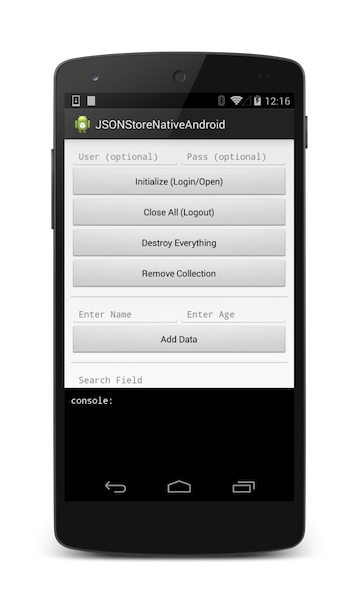

## Overview
IBM MobileFirst Platform Foundation's **JSONStore** is an optional client-side API providing a lightweight, document-oriented storage system. JSONStore enables persistent storage of **JSON documents**. Documents in an application are available in JSONStore even when the device that is running the application is offline. This persistent, always-available storage can be useful to give users access to documents when, for example, there is no network connection available in the device.

#### Key features

* Data indexing for efficient searching
* Data encryption in production environments
* Mechanism for tracking local-only changes to the stored data
* Support for multiple users

> **Note:** Some features such as data encryption are beyond the scope of this tutorial. All features are documented in detail in the IBM MobileFirst Platform Foundation user documentation website.

**Prerequisite**: Make sure the MobileFirst Native SDK was added to the Android Studio project. Follow the [Adding the MobileFirst Platform Foundation SDK to iOS applications](../../adding-the-mfpf-sdk/android/) tutorial.


#### Jump to:

* [Basic Usage](#basic-usage)
* [Advanced Usage](#advanced-usage)
* [Sample application](#sample-application)

## Basic Usage
### Open
Use `openCollections` to open one or more JSONStore collections.

Starting or provisioning a collections means creating the persistent storage that contains the collection and documents, if it does not exists. If the persistent storage is encrypted and a correct password is passed, the necessary security procedures to make the data accessible are run.

For optional features that you can enable at initialization time, see **Security, Multiple User Support** and **MobileFirst Adapter Integration** in the second part of this tutorial.

```java
Context context = getContext();
try {
  JSONStoreCollection people = new JSONStoreCollection("people");
  people.setSearchField("name", SearchFieldType.STRING);
  people.setSearchField("age", SearchFieldType.INTEGER);
  List<JSONStoreCollection> collections = new LinkedList<JSONStoreCollection>();
  collections.add(people);
  WLJSONStore.getInstance(context).openCollections(collections);
  // handle success
} catch(JSONStoreException e) {
  // handle failure
}
```

### Get
Use `getCollectionByName` to create an accessor to the collection. You must call `openCollections` before you call `getCollectionByName`.

```java
Context context = getContext();
try {
  String collectionName = "people";
  JSONStoreCollection collection = WLJSONStore.getInstance(context).getCollectionByName(collectionName);
  // handle success
} catch(JSONStoreException e) {
  // handle failure
}
```

The variable `collection` can now be used to perform operations on the `people` collection such as `add`, `find`, and `replace`

### Add
Use `addData` to store data as documents inside a collection

```java
Context context = getContext();
try {
  String collectionName = "people";
  JSONStoreCollection collection = WLJSONStore.getInstance(context).getCollectionByName(collectionName);
  //Add options.
  JSONStoreAddOptions options = new JSONStoreAddOptions();
  options.setMarkDirty(true);
  JSONObject data = new JSONObject("{age: 23, name: 'yoel'}")
  collection.addData(data, options);
  // handle success
} catch(JSONStoreException e) {
  // handle failure
}
```

### Find
Use `findDocuments` to locate a document inside a collection by using a query. Use `findAllDocuments` to retrieve all the documents inside a collection. Use `findDocumentById` to search by the document unique identifier.

```java
Context context = getContext();
try {
  String collectionName = "people";
  JSONStoreQueryPart queryPart = new JSONStoreQueryPart();
  // fuzzy search LIKE
  queryPart.addLike("name", name);
  JSONStoreQueryParts query = new JSONStoreQueryParts();
  query.addQueryPart(queryPart);
  JSONStoreFindOptions options = new JSONStoreFindOptions();
  // returns a maximum of 10 documents, default: returns every document
  options.setLimit(10);
  JSONStoreCollection collection = WLJSONStore.getInstance(context).getCollectionByName(collectionName);
  List<JSONObject> results = collection.findDocuments(query, options);
  // handle success
} catch(JSONStoreException e) {
  // handle failure
}
```

### Replace
Use `replaceDocument` to modify documents inside a collection. The field that you use to perform the replacement is `_id,` the document unique identifier.

```java
Context context = getContext();
try {
  String collectionName = "people";
  JSONStoreCollection collection = WLJSONStore.getInstance(context).getCollectionByName(collectionName);
  JSONStoreReplaceOptions options = new JSONStoreReplaceOptions();
  // mark data as dirty
  options.setMarkDirty(true);
  JSONStore replacement = new JSONObject("{_id: 1, json: {age: 23, name: 'chevy'}}");
  collection.replaceDocument(replacement, options);
  // handle success
} catch(JSONStoreException e) {
  // handle failure
}
```

This examples assumes that the document `{_id: 1, json: {name: 'yoel', age: 23} }` is in the collection.

### Remove
Use `removeDocumentById` to delete a document from a collection.
Documents are not erased from the collection until you call `markDocumentClean`. For more information, see the **MobileFirst Adapter Integration** section later in this tutorial.

```java
Context context = getContext();
try {
  String collectionName = "people";
  JSONStoreCollection collection = WLJSONStore.getInstance(context).getCollectionByName(collectionName);
  JSONStoreRemoveOptions options = new JSONStoreRemoveOptions();
  // Mark data as dirty
  options.setMarkDirty(true);
  collection.removeDocumentById(1, options);
  // handle success
} catch(JSONStoreException e) {
  // handle failure
}
```

### Remove Collection
Use `removeCollection` to delete all the documents that are stored inside a collection. This operation is similar to dropping a table in database terms.

```java
Context context = getContext();
try {
  String collectionName = "people";
  JSONStoreCollection collection = WLJSONStore.getInstance(context).getCollectionByName(collectionName);
  collection.removeCollection();
  // handle success
} catch(JSONStoreException e) {
  // handle failure
}
```

### Destroy
Use `destroy` to remove the following data:

* All documents
* All collections
* All Stores - See **Multiple User Support** later in this tutorial
* All JSONStore metadata and security artifacts - See **Security** later in this tutorial

```java
Context context = getContext();
try {
  WLJSONStore.getInstance(context).destroy();
  // handle success
} catch(JSONStoreException e) {
  // handle failure
}
```

## Advanced Usage
### Security
You can secure all the collections in a store by passing a `JSONStoreInitOptions` object with a password to the `openCollections` function. If no password is passed, the documents of all the collections in the store are not encrypted.

Some security metadata is stored in the shared preferences (Android).  
The store is encrypted with a 256-bit Advanced Encryption Standard (AES) key. All keys are strengthened with Password-Based Key Derivation Function 2 (PBKDF2).

Use `closeAll` to lock access to all the collections until you call `openCollections` again. If you think of `openCollections` as a login function you can think of `closeAll` as the corresponding logout function.

Use `changePassword` to change the password.

```java
Context context = getContext();
try {
  JSONStoreCollection people = new JSONStoreCollection("people");
  people.setSearchField("name", SearchFieldType.STRING);
  people.setSearchField("age", SearchFieldType.INTEGER);
  List<JSONStoreCollection> collections = new LinkedList<JSONStoreCollection>();
  collections.add(people);
  JSONStoreInitOptions options = new JSONStoreInitOptions();
  options.setPassword("123");
  WLJSONStore.getInstance(context).openCollections(collections, options);
  // handle success
} catch(JSONStoreException e) {
  // handle failure
}
```

#### Multiple User Support
You can create multiple stores that contain different collections in a single MobileFirst application. The `openCollections` function can take an options object with a username. If no username is given, the default username is ""**jsonstore**"".

```java
Context context = getContext();
try {
  JSONStoreCollection people = new JSONStoreCollection("people");
  people.setSearchField("name", SearchFieldType.STRING);
  people.setSearchField("age", SearchFieldType.INTEGER);
  List<JSONStoreCollection> collections = new LinkedList<JSONStoreCollection>();
  collections.add(people);
  JSONStoreInitOptions options = new JSONStoreInitOptions();
  options.setUsername("yoel");
  WLJSONStore.getInstance(context).openCollections(collections, options);
  // handle success
} catch(JSONStoreException e) {
  // handle failure
}
```

#### MobileFirst Adapter Integration
This section assumes that you are familiar with MobileFirst adapters. MobileFirst Adapter Integration is optional and provides ways to send data from a collection to an adapter and get data from an adapter into a collection.
You can achieve these goals by using functions such as `WLClient.invokeProcedure` or your own instance of an `HttpClient` if you need more flexibility.

#### Adapter Implementation
Create a MobileFirst adapter and name it "**People**". Define it's procedures `addPerson`, `getPeople`, `pushPeople`, `removePerson`, and `replacePerson`.

```javascript
function getPeople() {
	var data = { peopleList : [{name: 'chevy', age: 23}, {name: 'yoel', age: 23}] };
	WL.Logger.debug('Adapter: people, procedure: getPeople called.');
	WL.Logger.debug('Sending data: ' + JSON.stringify(data));
	return data;
}
function pushPeople(data) {
	WL.Logger.debug('Adapter: people, procedure: pushPeople called.');
	WL.Logger.debug('Got data from JSONStore to ADD: ' + data);
	return;
}
function addPerson(data) {
	WL.Logger.debug('Adapter: people, procedure: addPerson called.');
	WL.Logger.debug('Got data from JSONStore to ADD: ' + data);
	return;
}
function removePerson(data) {
	WL.Logger.debug('Adapter: people, procedure: removePerson called.');
	WL.Logger.debug('Got data from JSONStore to REMOVE: ' + data);
	return;
}
function replacePerson(data) {
	WL.Logger.debug('Adapter: people, procedure: replacePerson called.');
	WL.Logger.debug('Got data from JSONStore to REPLACE: ' + data);
	return;
}
```

#### Load data from MobileFirst Adapter
To load data from a MobileFirst Adapter use `WLClient.invokeProcedure`.

```java
WLResponseListener responseListener = new WLResponseListener() {
  @Override
  public void onFailure(final WLFailResponse response) {
    // handle failure
  }
  @Override
  public void onSuccess(WLResponse response) {
    try {
      JSONArray loadedDocuments = response.getResponseJSON().getJSONArray("peopleList");
    } catch(Exception e) {
      // error decoding JSON data
    }
  }
};

WLProcedureInvocationData invocationData = new WLProcedureInvocationData("People", "getPeople");
Context context = getContext();
WLClient client = WLClient.createInstance(context);
client.invokeProcedure(invocationData, responseListener);
```

#### Get Push Required (Dirty Documents)
Calling `findAllDirtyDocuments` returns and array of so called "dirty documents", which are documents that have local modifications that do not exist on the back-end system.

```java
Context  context = getContext();
try {
  String collectionName = "people";
  JSONStoreCollection collection = WLJSONStore.getInstance(context).getCollectionByName(collectionName);
  List<JSONObject> dirtyDocs = collection.findAllDirtyDocuments();
  // handle success
} catch(JSONStoreException e) {
  // handle failure
}
```

To prevent JSONStore from marking the documents as "dirty", pass the option `options.setMarkDirty(false)` to `add`, `replace`, and `remove`.

#### Push changes
To push changes to a MobileFirst adapter, call the `findAllDirtyDocuments` to get a list of documents with modifications and then use `WLClient.invokeProcedure`. After the data is sent and a successful response is received make sure you call `markDocumentsClean`.

```java
WLResponseListener responseListener = new WLResponseListener() {
  @Override
  public void onFailure(final WLFailResponse response) {
    // handle failure
  }
  @Override
  public void onSuccess(WLResponse response) {
    // handle success
  }
};
Context context = getContext();
WLClient client = WLClient.createInstance(context);
try {
  String collectionName = "people";
  JSONStoreCollection collection = WLJSONStore.getInstance(context).getCollectionByName(collectionName);
  List<JSONObject> dirtyDocuments = people.findAllDirtyDocuments();
  WLProcedureInvocationData invocationData = new WLProcedureInvocationData("People", "pushPeople");
  invocationData.setParameters(new Object[]{dirtyDocuments});
  client.invokeProcedure(invocationData, responseListener);
} catch(JSONStoreException e) {
  // handle failure
}
```


## Sample application
The JSONStoreAndroid project contains a native Android application that utilizes the JSONStore API set.  
Included is a JavaScript adapter Maven project.

[Click to download](https://github.com/MobileFirst-Platform-Developer-Center/JSONStoreAndroid) the Native Android project.  
[Click to download](https://github.com/MobileFirst-Platform-Developer-Center/JSONStoreAdapter/tree/release80) the adapter Maven project.  

### Sample usage
1. From the command line, navigate to the project's root folder.
2. Ensure the sample is registered in the MobileFirst Server by running the command: `mfpdev app register`.
3. The sample uses the `JSONStoreAdapter` contained in the Adapters Maven project. Use either Maven or MobileFirst Developer CLI to [build and deploy the adapter](../../adapters/creating-adapters/).
4. Import the project to Android Studio, and run the sample by clicking the **Run** button.


