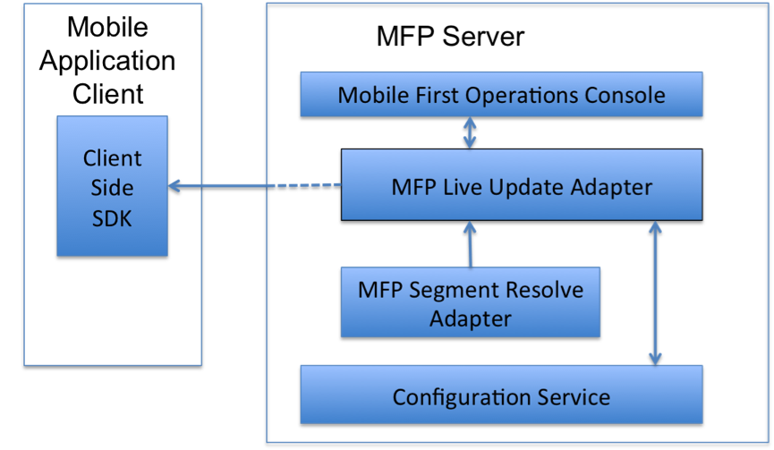
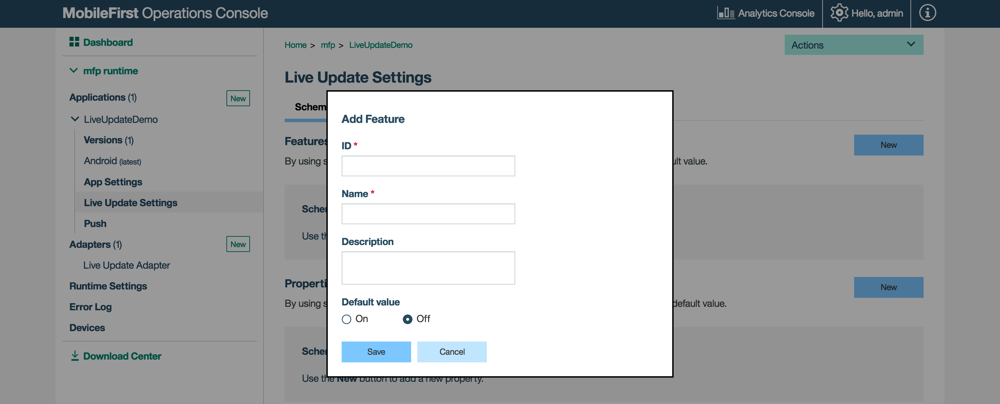
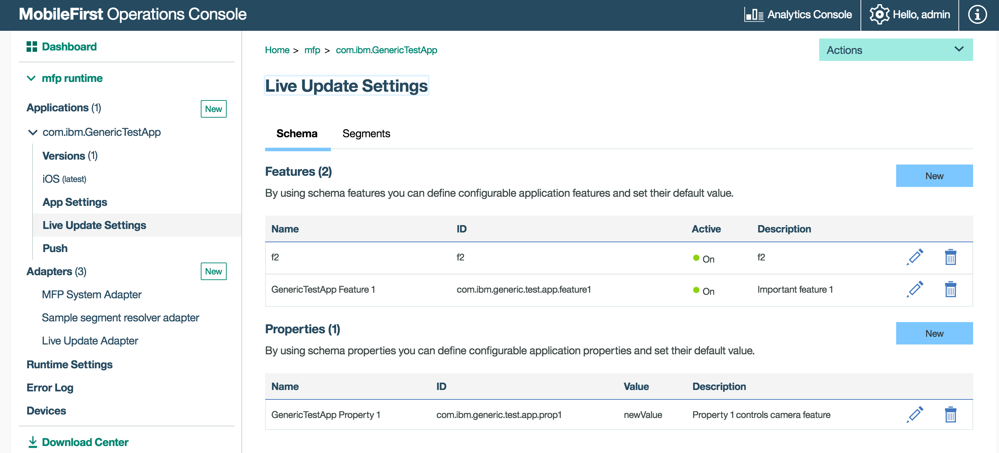
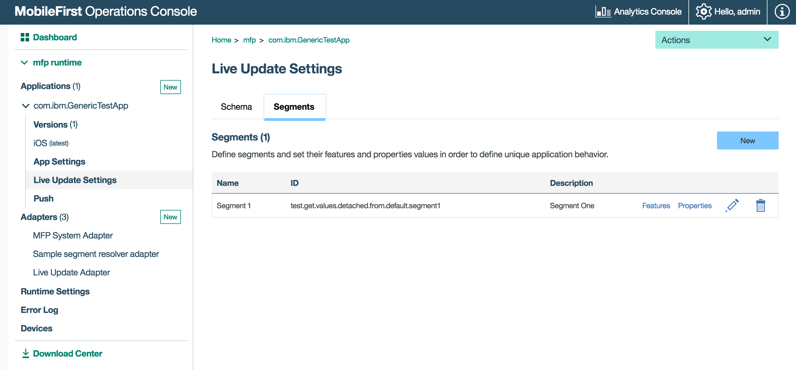

## Overview
User segmentation is the practice of dividing users into groups that reflect similarity among users in each group. A common example is geographical segmentation, that is, dividing users on a geographical basis. The goal of segmenting users is to decide how to relate to them in each segment in order to maximize value.

The Live Update feature in MobileFirst Foundation provides a simple way to define and serve different configurations for each segment of users of an application. It includes a component in the MobileFirst Operations Console for defining the structure of the configuration as well as the value of the configuration for each segment. In addition, a client SDK (available for Android and iOS *native* applications) is provided for consuming the configuration.

#### Common Use Cases
Live Update supports defining and consuming segment-based configurations, making it easy to make segment-based customizations to the application.  
Common use cases can be:

* Phased rollout of a feature
* A/B testing
* Adjustment of analytics
* Context-based customization of the application (e.g. geographic segmentation)

#### Jump to:
* [Live Update Architecture](#live-update-architecture)
* [Adding Live Update to MobileFirst Server](#adding-live-update-to-mobilefirst-server)
* [Configuring Application Security](#configuring-application-security)
* [Adding Schemas and Segments](#adding-schemas-and-segments)
* [Adding Live Update SDK to applications](#adding-live-update-sdk-to-applications)

## Live Update Architecture
<span style="color:red">
1. The diagram need sto be re-done by the design team  
2. The flow is missing an explanation (there are arrows so obviously there is some flow. What is the flow?)  
3. New diagram??
</span>

The following system components function together in order to provide the Live Update functionality.



* **Live Update adapter:** an adapter which provides:
 - Application schema and segments management
 - Serving configurations to applications
* **Segment Resolve Adapter:** an custom adapter that is implemented  by a developer. The adapter receives application context (such as device and user context, as well as custom parameters) and returns a name of a segment that corresponds to the context. 
* **Client-side SDK:** the Live Update SDK is used to retrieve and access configuration elements such as features and properties from the MobileFirst Server.
* **MobileFirst Operations Console:** used for configuring the Live Update adapter and settings.
* **Configuration Service:** Internal. Provides configuration management services for the Live Update Adapter.

## Adding Live Update to MobileFirst Server
By default the Live Update section in the MobileFirst Operations Console is hidden. To enable, the provided Live Update adapter needs to be deployed first.  

1. Open the MobileFirst Operations Console. From the sidebar navigation click on **Download Center → Tools tab**.
2. Download and deployed the Live Update adapter.

Once deployed, the **Live Update Settings** section is then revealed for each registered application.


### Schema
A schema is where features and properties are defined.  

* Using "features" you can define configurable application features and set their default value.  
* Using "properties" you can define configurable application properties and set their default value.

### Segments 
Segments enable to define unique application behaviors by customizing the default features and properties defined by the schema.

## Configuring Application Security
In order to allow integration with Live Update, a scope element is required. Without it, the adapter will reject requests from client applications.  

Load the MobileFirst Operations Console and click on **[your application] → Security tab → Scope-Elements Mapping**. Click **New** and enter the scope element **configuration-user-login**. Then, click **Add**.

You can also map the scope element to a security check in case you're using one in your application.

> [Learn more about the MobileFirst security framework](../../authentication-and-security/authorization-concepts)


## Adding Schemas and Segments
To add schema features and properties or segments, click on **New** and provide the requested values.

<div class="panel-group accordion" id="terminology" role="tablist" aria-multiselectable="false">
    <div class="panel panel-default">
        <div class="panel-heading" role="tab" id="schema">
            <h4 class="panel-title">
                <a class="preventScroll" role="button" data-toggle="collapse" data-parent="#terminology" data-target="#collapseSchema" aria-expanded="false" aria-controls="collapseSchema">Click to review schema terminology</a>
            </h4>
        </div>

        <div id="collapseSchema" class="panel-collapse collapse" role="tabpanel" aria-labelledby="schema">
            <div class="panel-body">
                <ul>
                    <li> <b>Feature:</b> A feature determines if some part of the application functionality is enabled or disabled. When defining a feature in the schema of an application the following elements should be provided:
                        <ul>
                            <li><i>id</i> – A unique feature identifier. String, Non-editable.</li>
                            <li><i>name</i> - A descriptive name of the feature. String, Editable.</li>
                            <li><i>description</i> – A short description of the feature. String, Editable.</li>
                            <li><i>defaultValue</i> – The default value of the feature that will be served unless it was overridden inside the segment (see Segment below). Boolean, Editable.</li>
                        </ul>
                    <li> <b>Property:</b> A property is a key:value entity that can be used to customize applications. When defining a property in the schema of an application the following elements should be provided:
                        <ul>
                            <li><i>id</i> – A unique property of the property. String, Non-editable.</li>
                            <li><i>name</i> - A descriptive name of a property. String, Editable.</li>
                            <li><i>description</i> – A short description of the property. String, Editable.</li>
                            <li><i>defaultValue</i> - The default value of the property that will be served unless it was overridden inside the segment (see Segment below). String, Editable.</li>
                        </ul>
                    </li>
                </ul>
            </div>
        </div>
    </div>
    
    <div class="panel panel-default">
        <div class="panel-heading" role="tab" id="segment">
            <h4 class="panel-title">
                <a class="preventScroll" role="button" data-toggle="collapse" data-parent="#terminology" data-target="#collapseSegment" aria-expanded="false" aria-controls="collapseSegment">Click to review segment terminology</a>
            </h4>
        </div>

        <div id="collapseSegment" class="panel-collapse collapse" role="tabpanel" aria-labelledby="segment">
            <div class="panel-body">
                <ul>
                    <li><b>Segment:</b> A segment is an entity that corresponds to a market segment. It contains the features and properties that were defined in the schema and potentially overriding values. When defining a Segment the  following elements should be provided:
                        <ul>
                            <li><i>id</i> - A unique segment identifier. String, Non-editable.</li>
                            <li><i>name</i> - A descriptive name of segment. String, Editable.</li>
                            <li><i>description</i> – A short description of segment. String, Editable.</li>
                            <li><i>Features</i>  - A the list of features as defined in the schema, the user can set a static value to a feature which is detached from the schema default.</li>
                            <li><i>Properties</i> - the list of properties as defined in the schema, the user can set a static value to a property which is detached from the schema default.</li>
                        </ul>
                    </li>
                </ul>
                
                <blockquote><b>Note:</b><br/>
                    <ul>
                        <li>When a feature or property is added to a schema, a corresponding feature or property is automatically added to all segments of an application (with the default value)</li>
                        <li>When a feature or property is removed from a schema, the corresponding feature or property is automatically removed from all the segments of an application.</li>
                    </ul>
                </blockquote>
            </div>
        </div>
    </div>
</div>

<span style="color:red">add a gif image showing how to add an example feature and property. segment too?</span>


## Adding Live Update SDK to applications
The Live Update SDK provides developers with API to query runtime configuration features and properties that were previously defined in the Live Update settings section of the registered application in the MobileFirst Operations Console.

You can find API example usage in the [iOS SDK documentation](https://github.com/mfpdev/mfp-live-update-ios-sdk) and [Android SDK documentation](https://github.com/mfpdev/mfp-live-update-android-sdk).

### Adding the iOS SDK

1. Edit your application's podfile by adding the `IBMMobileFirstPlatformFoundationLiveUpdate` pod.  
 For example:

    ```xml
    use_frameworks!

    target 'your-Xcode-project-target' do
     pod 'IBMMobileFirstPlatformFoundation'
     pod 'IBMMobileFirstPlatformFoundationLiveUpdate'
    end
    ```

2. From a **command-line** window, nagivate to the Xcode project's root folder and run the commmand: `pod install`.

### Adding the Android SDK

1. In Android Studio, select **Android → Gradle Scripts**, then select the **build.gradle (Module: app)** file.
2. Add the following lines inside `dependencies`:

    ```xml
    dependencies {
        compile group: 'com.ibm.mobile.foundation',
                name: 'ibmmobilefirstplatformfoundationliveupdate',
                version: '8.0.+',
                ext: 'aar',
                transitive: true
    }   
    ```

<span style="color:red">
explain adapter resolve adapter - why would one use it and when
</span>

## Segment resolver adapter
The purpose of the segment resolver adapter is to provide custom business logic for resolving segment base on the user context.  
For this reason it defines a very simple REST interface which processes single HTTP POST request. The request contains in its body all the required information that should be enough for customer business logic to “decide” what segment the end-user belongs to.


<br/><br/><br/>
<span style="color:red">need to figure out what to do with these</span>
## Configuration types
When an application is running it can use the Live Update runtime SDK to consume a JSON configuration that fits the segment it belongs to. The configuration consists of two sets, one of *features* and one of *properties*. Features are id/value pairs, which can have a true/false value, while properties are id/value pairs, which can have a string value. 

The feature ids and property ids are defined using the MFP Operational Console, along with default values. The definition of the segments and overriding values to these features and property ids is done using the MFP Operational console as well.

A sample JSON configuration:

```json
{  
    “features”: {  
        “com.sample.camera”: false,  
        “com.sample.searchBox”:true  
     },  
     “properties”: {  
        “com.sample.bgColor”: “blue”  
     }  
}
```

### REST interface:

**Request**

| ***Attribute*** |  ***Value***                                                                                      |  
|:----------------|:--------------------------------------------------------------------------------------------------| 
| *URL*           | /segment                                                                                          | 
| *Method*        | POST                                                                                              |               
| *Content-type*  | application/json                                                                                  |
| *Body*          | &lt;JSON object containing all required information for segment resolving&gt; (see example below) |
      
&nbsp;

**Response**

|  ***Attribute***   |  ***Value***                                |
|:-------------------|:--------------------------------------------| 
| *Content-type*     | text/plain                                  |                                                                          
| *Body*             |  &lt;string describing the segment name&gt; |

&nbsp;

**Request body (JAVA object):**

```java
public class ResolverAdapterData {  
 public AuthenticatedUser authenticatedUser;
 public RegistrationData registrationData;
 public Map<String, List<String>> queryArguments;
}
```

| ***Field name***    |  ***Description***                                        |
|:--------------------|:----------------------------------------------------------| 
| *authenticatedUser* | authenticated user info from security context             |
| *registrationData*  | end-user device’s registration data from security context |
| *queryArguments*    | query arguments of the request from end-user’s device     |  

&nbsp;

###  Segment resolver adapter invocation

LiveUpdateAdapter uses AdapterAPI framework in order to call SegmentResolverAdapter.

Example:

```java
ResolverAdapterData rad = new ResolverAdapterData(securityContext, uriInfo.getQueryParameters());
HttpPost post = new HttpPost("/" + resolverAdapterName + "/segment");

post.setEntity(new StringEntity(gson.toJson(rad), ContentType.APPLICATION_JSON));

HttpResponse response = adaptersAPI.executeAdapterRequest(post);

if (response.getStatusLine().getStatusCode() == HttpStatus.SC_OK) {
  String segmentName = EntityUtils.toString(response.getEntity());

  // use 'segmentName' to get configuration
}
```
&nbsp;
&nbsp;


# Live Update feature use guidelines

1.  Application developer and/or product management team decide about:

- Set of features in application to be enabled/disabled, and default state for every feature,
- Set of configurable string properties, and default value for every property,
- Set of market segments for application,
- For every market segment it should be decided:
 - What is a state of every feature, if and how this state can change during application lifetime?
 - What is a value of every property, if and how this value can change during application lifetime?


2.  Application developer or administrator creates ‘Live Update’ application schema and segments:

- Defines set of Schema Features and Schema Properties with default values, based on step 1.


- Defines Segments that correspond to market segments, based on step 1, for every Segment Feature and Segment Property sets states and values that correspond to market segment needs, based on step 1


3.  Application developer designs and implements client application code that:

- Uses platform-specific client-side SDK to retrieve configuration associated with relevant segment (see **'Client side SDKs download and use'** section for more details),
- Writes code logic that controls execution flow based on configuration feature states and property values.

4.  During application run time, configuration that corresponds to specific Segment, is fetched and used by client application.

5.  From time to time application developer or administrator could manage application schema, ex. add, remove Schema Feature/ Schema Property, change default value of Schema Feature/ Schema Property, or update or change Segment Feature/ Segment Property for segments.

&nbsp;
&nbsp;


## Advanced Topics

The developer determines the schema of the application according to the requirements of the application. Once the development process is done and the application is deployed in real production environment the system administrator should import this schema. In order to do so the developer can export the schema by using the following example:

Get schema:

curl --user admin:admin <http://localhost:9080/mfpadmin/management-apis/2.0/runtimes/mfp/admin-plugins/liveUpdateAdapter/com.ibm.GenericTestApp/schema> &gt; curl.get.txt

Similarly the system administrator should import the schema that was exported:

Post schema:

curl -X PUT -d @curl.get.txt --user admin:admin <http://localhost:9080/mfpadmin/management-apis/2.0/runtimes/mfp/admin-plugins/liveUpdateAdapter/com.ibm.GenericTestApp/schema> --header "Content-Type:application/json"

