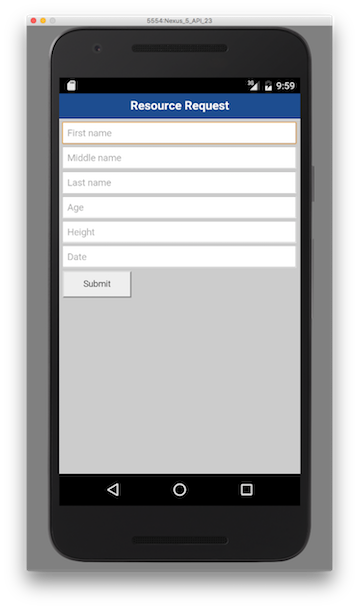

## Overview
MobileFirst applications can access resources using the `WLResourceRequest` REST API.  
The REST API works with all adapters and external resources.

**Prerequisites**:

- Ensure you have [added the MobileFirst Platform SDK](../../adding-the-mfpf-sdk/adding-the-mfpf-sdk-to-cordova-applications) to your Cordova application.
- Learn how to [create adapters](../../adapters/adapters-overview/).

## WLResourceRequest
The `WLResourceRequest` class handles resource requests to adapters or external resources.

Create a `WLResourceRequest` object and specify the path to the resource and the HTTP method.  
Available methods are: `WLHttpMethodGet`, `WLHttpMethodPost`, `WLHttpMethodPut` and `WLHttpMethodDelete`.

```javascript
var resourceRequest = new WLResourceRequest(
    "/adapters/JavaAdapter/users",
    WLResourceRequest.GET
);
```

* For **JavaScript adapters**, use `/adapters/{AdapterName}/{procedureName}`
* For **Java adapters**, use `/adapters/{AdapterName}/{path}`. The `path` depends on how you defined your `@Path` annotations in your Java code. This would also include any `@PathParam` you used.
* To access resources outside of the project, use the full URL as per the requirements of the external server.
* **timeout**: Optional, request timeout in milliseconds

## Sending the request
Request the resource by using the `send()` method.  
The `send()` method takes an optional parameter to set a body to the HTTP request, which could be a JSON object or a simple string.

```js
resourceRequest.send().then(
    onSuccess,
    onFailure
)
```

Using JavaScript **promises**, you can define `onSuccess` and `onFailure` functions.

### setQueryParameter
By using the `setQueryParameter` method, you can include query (URL) parameters in the REST request.

* In JavaScript adapters, which use ordered nameless parameters, pass an array of parameters with the name `params`:

    ```js
    resourceRequest.setQueryParameter("params", "['param1', 'param2']");
    ```
* In Java adapters or external resources, use `setQueryParameter` for each parameter:

    ```java
    resourceRequest.setQueryParameter("param1", "value1");
    resourceRequest.setQueryParameter("param2", "value2");
    ```

### setHeader
By using the `setHeader` method, you can set a new HTTP header or replace an existing header with the same name in the REST request.

```js
resourceRequest.setHeader("Header-Name","value");
```

### sendFormParameters(json)
To send URL-encoded form parameters, use the `sendFormParameters(json)` method instead. This method converts the JSON to a URL encoded string, sets the `content-type` to `application/x-www-form-urlencoded`, and sets it as the HTTP body.

> For more information about `WLResourceRequest`, see the API reference in the user documentation.

## The response
Both the `onSuccess` and `onFailure` callbacks receive a `response` object, which typically contains the following properties:

* **`status`**: The HTTP response status
* **`responseJSON`**: An object that contains the data that is returned by the called resource, and additional information about the resource call.

The `response` object is returned to the corresponding success/failure handler.

```json
{
  "errors": [],
  "info": [],
  "warnings": [],
  "isSuccessful": true,
  "responseHeaders": {
    "Cache-Control": "no-cache, must-revalidate, post-check=0, pre-check=0"
  },
  "responseTime": 491,
  "statusCode": 200,
  "statusReason": "OK",
  "totalTime": 592,
  "Items": [{
    "creator": "Jon Fingas",
    "link": "http:\/\/www.engadget.com\/2014\/11\/10\/harvard-used-cameras-to-check-attendance\/?ncid=rss_truncated",
    "pubDate": "Mon, 10 Nov 2014 02:21:00 -0500",
    "title": "Harvard used cameras to track attendance without telling students"
  }]
}
```

* `errors`, `info`, and `warnings` are optional arrays of strings that contain messages.
* The `isSuccessful` property is set to `true` if the resource call succeeded (even if no data was retrieved), or to `false` otherwise.
* The response can contain other metadata such as `responseHeaders`, `responseTime`, `statusCode`, `statusReason`, and `totalTime`.

### Handling the response
The rest of the resource call result depends on what was retrieved from the back-end system. In this example, the `Items` element is a JSON representation of the XML code that was received from the back end, after the rules in the XSL file were applied.

```js
function onSuccess(result){
    showResult(result.responseJSON);
}
```

## For more information
> For more information about WLResourceRequest, refer to the user documentation.


## Sample application
The ResourceRequestCordova project contains a Cordova application that makes a resource request using a Java adapter.  
The adapter Maven project contains the Java adapter to be used during the resource request call.

[Click to download](https://github.com/MobileFirst-Platform-Developer-Center/ResourceRequestCordova/tree/release80) the Cordova project.  
[Click to download](https://github.com/MobileFirst-Platform-Developer-Center/Adapters/tree/release80) the adapter Maven project.

### Sample usage
1. From the command line, navigate to the Cordova project.
2. Ensure the sample is registered in the MobileFirst Server by running the command:  
`mfpdev app register`.
3. Add a platform by running the `cordova platform add` command.
4. The sample uses the `JavaAdapter` contained in the Adapters Maven project. Use either Maven or MobileFirst Developer CLI to [build and deploy the adapter](../../adapters/creating-adapters/).
5. Run the Cordova application by running the `cordova run` command.


