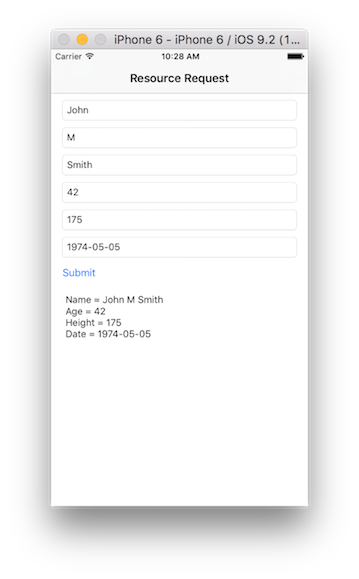

## Overview
MobileFirst applications can access resources using the `WLResourceRequest` REST API.  
The REST API works with all adapters and external resources.

**Prerequisites**:

- Ensure you have [added the MobileFirst Platform SDK](../../adding-the-mfpf-sdk/ios) to your Native iOS project.
- Learn how to [create adapters](../../adapters/adapters-overview/).

## WLResourceRequest
The `WLResourceRequest` class handles resource requests to adapters or external resources.

Create a `WLResourceRequest` object and specify the path to the resource and the HTTP method.  
Available methods are: `WLHttpMethodGet`, `WLHttpMethodPost`, `WLHttpMethodPut` and `WLHttpMethodDelete`.

```swift
let request = WLResourceRequest(
    URL: NSURL(string: "/adapters/JavaAdapter/users"),
    method: WLHttpMethodGet
)
```

* For **JavaScript adapters**, use `/adapters/{AdapterName}/{procedureName}`
* For **Java adapters**, use `/adapters/{AdapterName}/{path}`. The `path` depends on how you defined your `@Path` annotations in your Java code. This would also include any `@PathParam` you used.
* To access resources outside of the project, use the full URL as per the requirements of the external server.
* **timeout**: Optional, request timeout in milliseconds

## Sending the request
Request the resource by using the `sendWithCompletionHandler` method.  
Supply a completion handler to handle the retrieved data:

```swift
request.sendWithCompletionHandler { (WLResponse response, NSError error) -> Void in
    if(error == nil){
        NSLog(response.responseText)
    }
    else{
        NSLog(error.description)
    }
}
```

Alternatively, you can use `sendWithDelegate` and provide a delegate that conforms to both the `NSURLConnectionDataDelegate` and `NSURLConnectionDelegate` protocols. This will allow you to handle the response with more granularity, such as handling binary responses.   

## The response
The `response` object contains the response data and you can use its methods and properties to retrieve the required information. Commonly used properties are `responseText` (String), `responseJSON` (Dictionary) (if the response is in JSON) and `status` (Int) (the HTTP status of the response).

Use the `response` and `error` objects to get the data that is retrieved from the adapter.

## Parameters
Before sending your request, you may want to add parameters as needed.

### Path parameters
As explained above, **path** parameters (`/path/value1/value2`) are set during the creation of the `WLResourceRequest` object.

### Query parameters
To send **query** parameters (`/path?param1=value1...`) use the `setQueryParameter` method for each parameter:

```swift
request.setQueryParameterValue("value1", forName: "param1")
request.setQueryParameterValue("value2", forName: "param2")
```

#### JavaScript adapters
JavaScript adapters use ordered nameless parameters. To pass parameters to a Javascript adapter, set an array of parameters with the name `params`:

```swift
request.setQueryParameterValue("['value1', 'value2']", forName: "params")
```

### Form parameters
To send **form** parameters in the body, use `sendWithFormParameters` instead of `sendWithCompletionHandler`:

```swift
//@FormParam("height")
let formParams = ["height":"175"]

//Sending the request with Form parameters
request.sendWithFormParameters(formParams) { (response, error) -> Void in
    if(error == nil){
        NSLog(response.responseText)
    }
    else{
        NSLog(error.description)
    }
}
```

#### JavaScript adapters
JavaScript adapters use ordered nameless parameters. To pass parameters to a Javascript adapter, set an array of parameters with the name `params`:

```swift
let formParams = ["params":"['value1', 'value2']"]
```

### Header parameters
To send a parameter as an HTTP header use the `setHeaderValue` API:

```swift
//@HeaderParam("Date")
request.setHeaderValue("2015-06-06", forName: "birthdate")
```

### Other custom body parameters

- `sendWithBody` allows you to set an arbitrary String in the body.
- `sendWithJSON` allows you to set an arbitrary dictionary in the body.
- `sendWithData` allows you to set an arbitrary `NSData` in the body.

## For more information
> For more information about WLResourceRequest, refer to the user documentation.


## Sample application
The ResourceRequestSwift project contains a native iOS Swift application that makes a resource request using a Java adapter.  
The adapter Maven project contains the Java adapter used during the resource request call.

[Click to download](https://github.com/MobileFirst-Platform-Developer-Center/ResourceRequestSwift/tree/release80) the Native project.  
[Click to download](https://github.com/MobileFirst-Platform-Developer-Center/Adapters/tree/release80) the adapter Maven project.

### Sample usage
1. From the command line, navigate to the project's root folder.
2. Ensure the sample is registered in the MobileFirst Server by running the command: `mfpdev app register`.
3. The sample uses the `JavaAdapter` contained in the Adapters Maven project. Use either Maven or MobileFirst Developer CLI to [build and deploy the adapter](../../adapters/creating-adapters/).
4. To test or debug an adapter, see the [testing and debugging adapters](../../adapters/testing-and-debugging-adapters) tutorial.
5. Import the project to Xcode, and run the sample by clicking the **Run** button.
