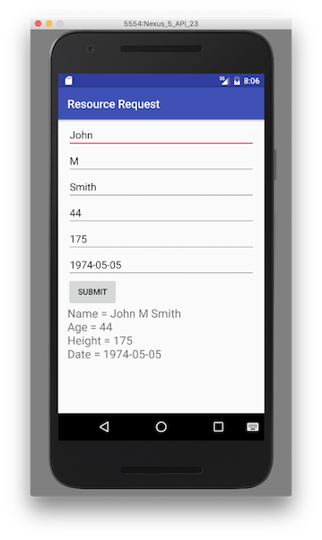

## Overview
MobileFirst applications can access resources using the `WLResourceRequest` REST API.  
The REST API works with all adapters and external resources.

**Prerequisites**:

- Ensure you have [added the MobileFirst Platform SDK](../../adding-the-mfpf-sdk/android) to your Native Android project.
- Learn how to [create adapters](../../adapters/adapters-overview/).

## WLResourceRequest
The `WLResourceRequest` class handles resource requests to adapters or external resources.

Create a `WLResourceRequest` object and specify the path to the resource and the HTTP method.  
Available methods are: `WLResourceRequest.GET`, `WLResourceRequest.POST`, `WLResourceRequest.PUT`, `WLResourceRequest.HEAD` and `WLResourceRequest.DELETE`.

```java
URI adapterPath = new URI("/adapters/RSSReader/getFeed");
WLResourceRequest request = new WLResourceRequest(adapterPath,WLResourceRequest.GET);
```

* For **JavaScript adapters**, use `/adapters/{AdapterName}/{procedureName}`
* For **Java adapters**, use `/adapters/{AdapterName}/{path}`. The `path` depends on how you defined your `@Path` annotations in your Java code. This would also include any `@PathParam` you used.
* To access resources outside of the project, use the full URL as per the requirements of the external server.
* **timeout**: Optional, request timeout in milliseconds
* **scope**: Optional, if you know which scope is protecting the resource - specifying this scope could make the request more efficient.

## Sending the request
Request the resource by using the `.send()` method. Specify a WLResponseListener class instance:

```java
request.send(new WLResponseListener(){
  public void onSuccess(WLResponse response) {
    Log.d("Success", response.getResponseText());
  }
  public void onFailure(WLFailResponse response) {
    Log.d("Failure", response.getResponseText());
  }
});
```

Use the `WLResponse response` and `WLFailResponse response` objects to get the data that is retrieved from the adapter.

The `response` object contains the response data and you can use its methods and properties to retrieve the required information. Commonly used properties are `responseText` (String), `responseJSON` (Dictionary) (if the response is in JSON) and `status` (Int) (the HTTP status of the response).

## Parameters
Before sending your request, you may want to add parameters as needed.

### Path parameters
As explained above, **path** parameters (`/path/value1/value2`) are set during the creation of the `WLResourceRequest` object:

```java
URI adapterPath = new URI("/adapters/JavaAdapter/users/value1/value2");
WLResourceRequest request = new WLResourceRequest(adapterPath,WLResourceRequest.GET);
```

### Query parameters
To send **query** parameters (`/path?param1=value1...`) use the `setQueryParameter` method for each parameter:

```java
request.setQueryParameter("param1","value1");
request.setQueryParameter("param2","value2");
```

### Form parameters
To send form parameters in the body, use `.send(HashMap<String, String> formParameters, WLResponseListener)` instead of `.send(WLResponseListener)`:  

```java
HashMap formParams = new HashMap();
formParams.put("height", height.getText().toString());
request.send(formParams, new MyInvokeListener());
```    

### Header parameters
To send a parameter as an HTTP header use `.addHeader()` API:

```java
request.addHeader("date", date.getText().toString());
```

### Other custom body parameters
- `.send(requestBody, WLResponseListener listener)` allows you to set an arbitrary String in the body.
- `.send(JSONStore json, WLResponseListener listener)` allows you to set an arbitrary dictionary in the body.
- `.send(byte[] data, WLResponseListener listener)` allows you to set an arbitrary byte array in the body.

### Javascript Adapters
JavaScript adapters use ordered nameless parameters. To pass parameters to a Javascript adapter, set an array of parameters with the name `params`:

```java
request.setQueryParameter("params","['param1', 'param2']");
```

## For more information
> For more information about WLResourceRequest, refer to the user documentation.


## Sample application
The ResourceRequestAndroid project contains a native Android application that makes a resource request using a Java adapter.  
The adapter Maven project contains the Java adapter to be used during the resource request call.

[Click to download](https://github.com/MobileFirst-Platform-Developer-Center/ResourceRequestAndroid/tree/release80) the Native project.  
[Click to download](https://github.com/MobileFirst-Platform-Developer-Center/Adapters/tree/release80) the adapter Maven project.

### Sample usage
1. From the command line, navigate to the Android project.
2. Ensure the sample is registered in the MobileFirst Server by running the command:  
`mfpdev app register`.
3. The sample uses the `JavaAdapter` contained in the Adapters Maven project. Use either Maven or MobileFirst Developer CLI to [build and deploy the adapter](../../adapters/creating-adapters/).
4. To test or debug an adapter, see the [testing and debugging adapters](../../adapters/testing-and-debugging-adapters) tutorial.
5. Import the project to Android Studio, and run the sample by clicking the **Run** button.
