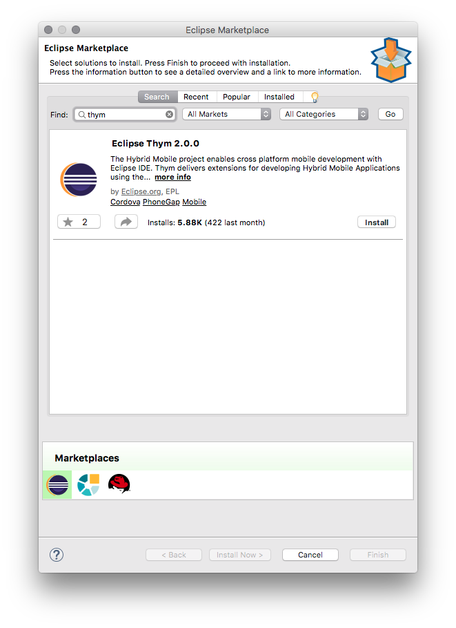
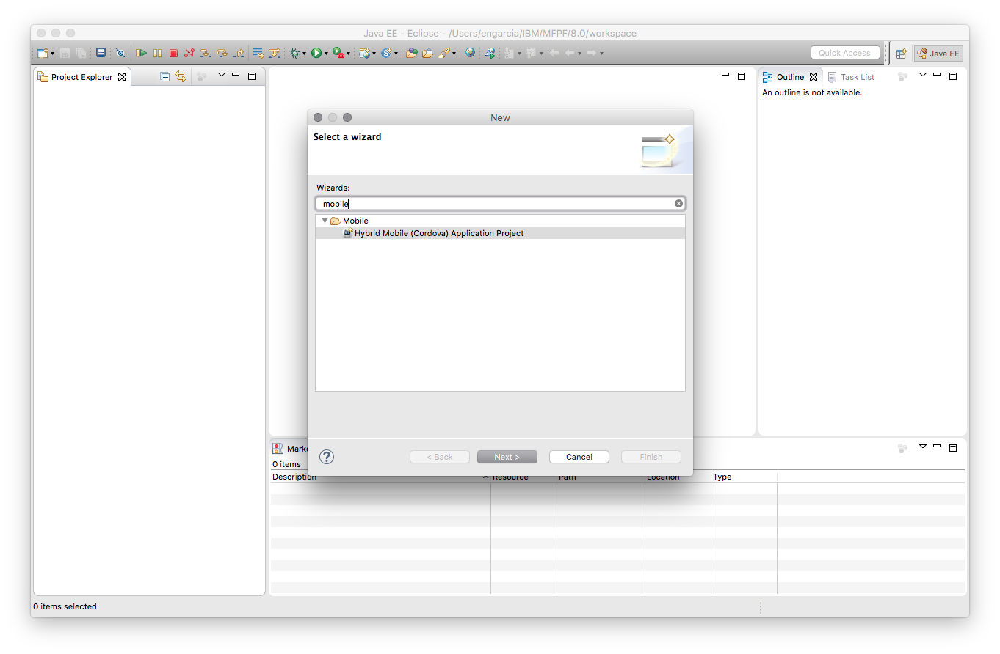
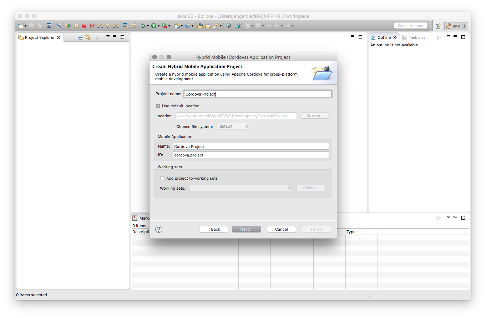
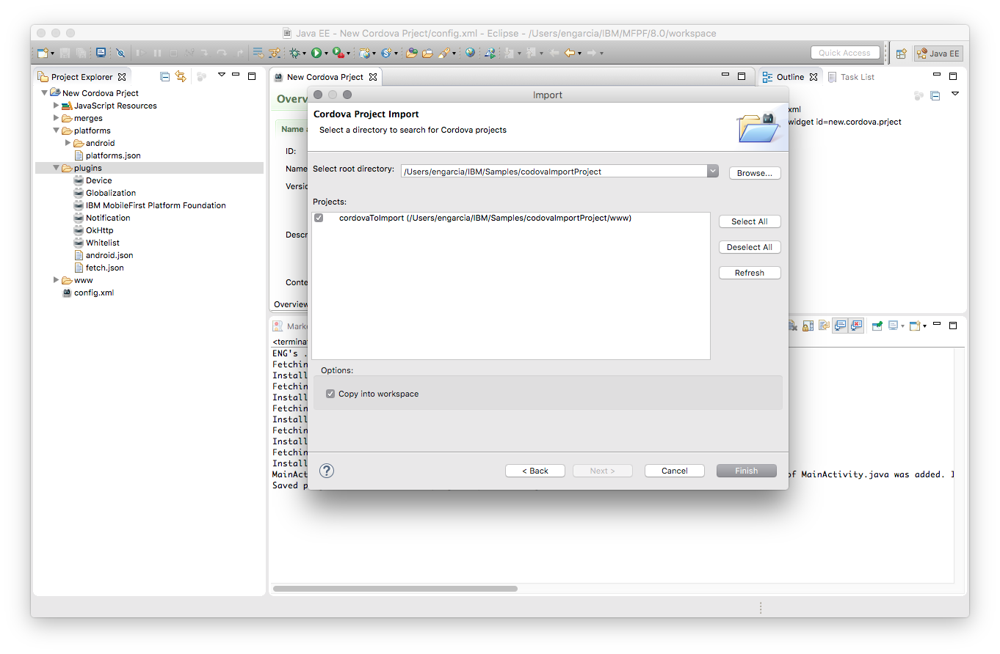
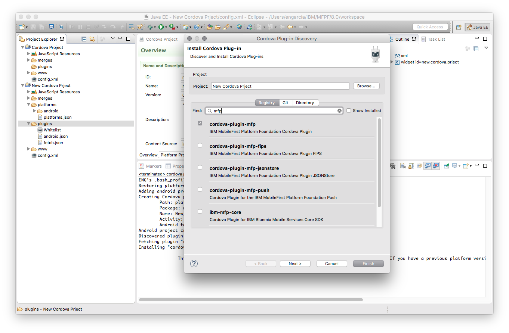

## Overview

Using the Cordova CLI you can create and manage your Cordova applications. You can also achieve the same in the Eclipse IDE by using the [THyM](https://www.eclipse.org/thym/) plug-in.

THyM provides support for importing and managing Cordova projects in Eclipse. You can create new Cordova projects, as well as import existing Cordova projects. You can also install Cordova plug-ins into your project through this plug-in.

Learn more about THyM in its [official website](https://www.eclipse.org/thym/).

The MobileFirst Studio plug-in for Eclipse exposes the various MobileFirst commands in the Eclipse IDE.  
Specifically, it provides the following commands: Open Server Console, Preview App, Register App, Encrypt App, Pull App, Push App, Update App.

This tutorial walks you through installing the THyM and MobileFirst Eclipse plug-ins.

**Prerequisites:**  

* MobileFirst Server to run locally, or a remotely running MobileFirst Server.
* MobileFirst CLI installed on the developer workstation

#### Jump to:

* [Installing the MobileFirst Studio plug-in](#installing-the-mobilefirst-studio-plug-in)
* [Installing the THyM plug-in](#installing-the-thym-plug-in)
* [Creating a Cordova project](#creating-a-cordova-project)
* [Importing an existing Cordova project](#importing-an-existing-cordova-project)
* [Adding the MobileFirst SDK to Cordova project](#adding-the-mobilefirst-sdk-to-cordova-project)
* [MobileFirst Commands](#mobilefirst-commands)
* [Tips and Tricks](#tips-and-tricks)

## Installing the MobileFirst Studio plug-in

1. While in Eclipse click **Help → Eclipse Marketplace...**
2. In the find field search "mobilefirst" then click "Go"
3. Click "Install" for IBM MobileFirst Platform Studio 

	

4. Complete the installation process
5. Restart Eclipse for the installation to take affect.

## Installing the THyM plug-in

**Note:** To run THyM you must be running Eclipse Mars or later

1. While in Eclipse click **Help → Eclipse Marketplace...**
2. In the find field search "thym" then click "Go"
3. Click "Install" for Eclipse Thym 

	

4. Complete the installation process
5. Restart Eclipse for the installation to take affect.

## Creating a Cordova project

In this section we will discuss how to create a new Cordova project using THyM.

1. While in Eclipse click **File → New → Other...**
2. Narrow options by searching for "Cordova" and select **Hybrid Mobile (Cordova) Application Project** in the **Mobile** directory and click **Next**

	

3. Name the project, and click **Next**

	

4. Add the desired platform for your project and click **Finish**

## Importing an existing Cordova project

In this section we will discuss how to import an existing Cordova project that has already been created using the Cordova CLI.

1. While in Eclipse click **File → Import...**
2. Select **Import Cordova Project** in the **Mobile** directory and click **Next >**
3. Click **Browse...** and select the root directory of the existing Cordova project.
4. Ensure the project is checked in the "Projects:" sections and click **Finish**
	

## Adding the MobileFirst SDK to Cordova project

Once you have [installed THyM](#installing-the-thym-plug-in) and the [MobileFirst CLI plugin](#installing-the-mobilefirst-studio-plug-in) into Eclipse and have either [created a Cordova project](#creating-a-cordova-project) or [imported a Cordova project](#importing-an-existing-cordova-project) you can then follow the below steps to install the MobileFirst SDK via Cordova plugin.

1. In the Project Explorer right click the **plugins** directory and select **Install Cordova Plug-in**
2. In the Registry tab of the presented dialog box search **mfp** and select **cordova-plugin-mfp** and click **Finish**

	

## MobileFirst Commands

To access MobileFirst Foundation's shortcuts right click the root project directory and navigate to **IBM MobileFirst Foundation**.  Here you will be able to select from the following commands:

| Menu option         | Action                                                                                                                                       | MobileFirst command-line interface equivalent |
|---------------------|----------------------------------------------------------------------------------------------------------------------------------------------|-----------------------------------------------|
| Open Server Console | When the server definition exists, opens the console so you can view the actions of the specified server.                                    | mfpdev server console                         |
| Preview App         | Opens the app in the browser preview mode.                                                                                                   | Opens the app in the browser preview mode.    |
| Register App        | Registers the app with the server that is specified in your server definitions.                                                              | mfpdev app register                           |
| Encrypt App         | Runs the web resource encryption tool on your app.                                                                                           | mfpdev app webencrypt                         |
| Pull App            | Retrieves the existing app configuration from the server that is specified in the server definition.                                         | mfpdev app pull                               |
| Push App            | Sends the app configuration of your current app to the server that is specified in the build definition so you can reuse it for another app. | mfpdev app push                               |
| Updated App         | Packages the contents of the www folder in a .zip file, and replaces the version on the server with the package.                             | mfpdev app webupdate                          |

## Tips and Tricks

### Debug mode

Enabling debug mode will show debug level logs in the Eclipse console, while previewing the application in a browser.  To enable debug mode do the following:  

1. Open Eclipse's Preferences.
2. Select **MobileFirst Studio Plugins** to show the plug-ins preferences page.
3. Ensure the **Enable debug mode** check bocks is selected, then click **Apply → OK**

### Live update

While previewing an application live update is available. You can make updates and save you changes and watch them auto refresh in the preview.

### Integrating MobileFirst Server into Eclipse

Using the MobileFirst Foundation Development Kit, You can couple together the above with [running the MobileFirst Server in Eclipse](../../installation-configuration/development/mobilefirst#adding-the-mobilefirst-server-to-eclipse) to create a more integrated development environment.

### Demo Video

	

   		<iframe src="https://www.youtube.com/embed/yRe2AprnUeg"></iframe>
	

