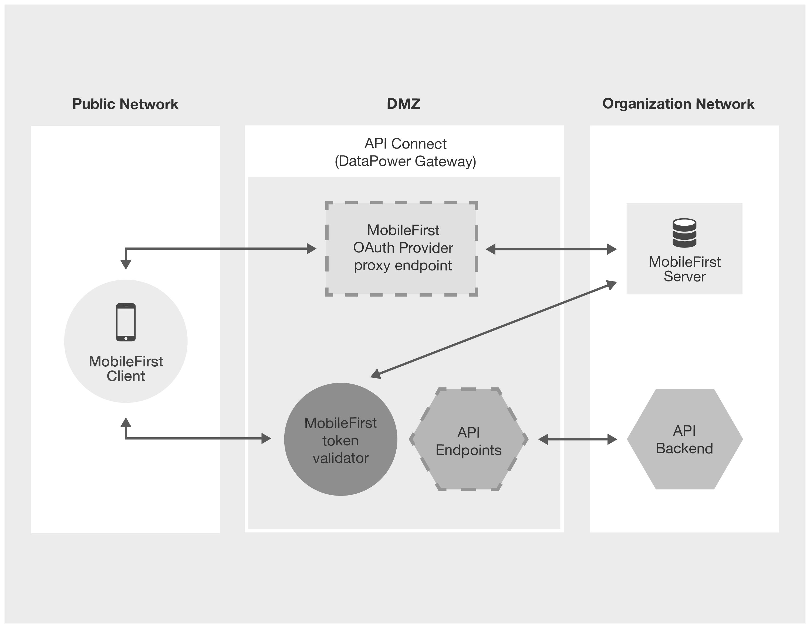
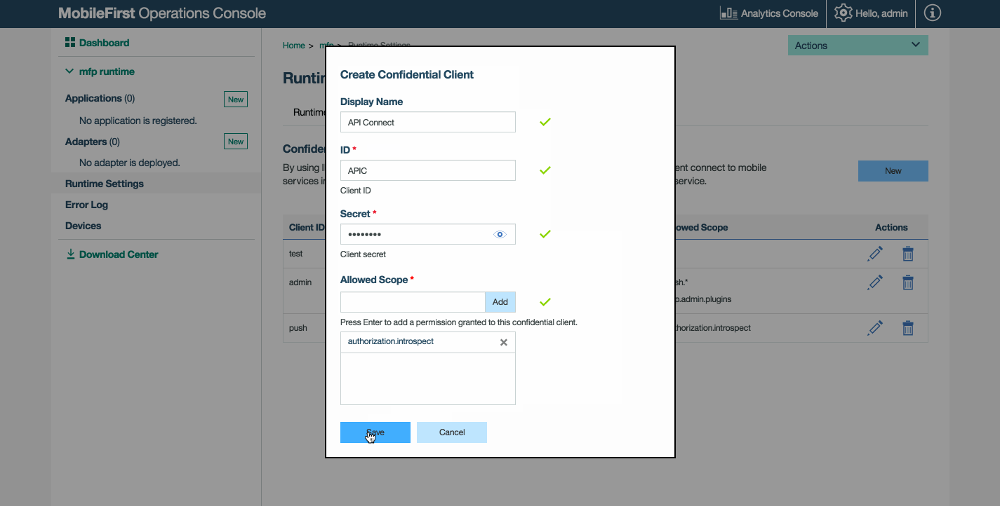
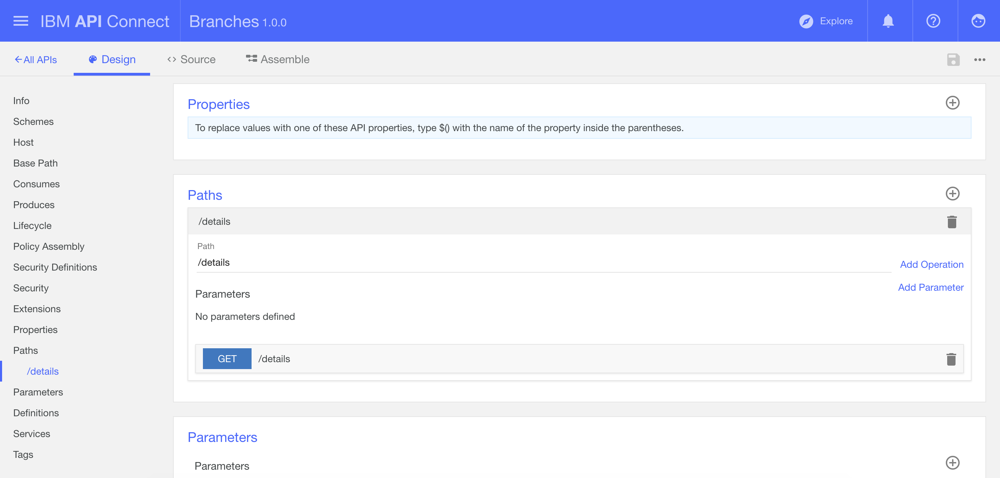
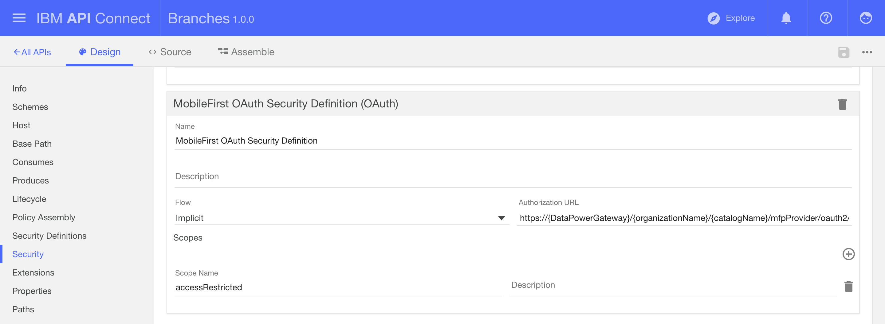
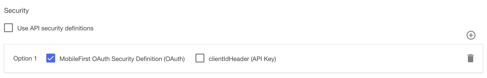
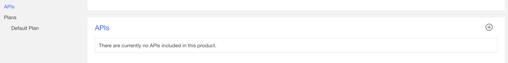
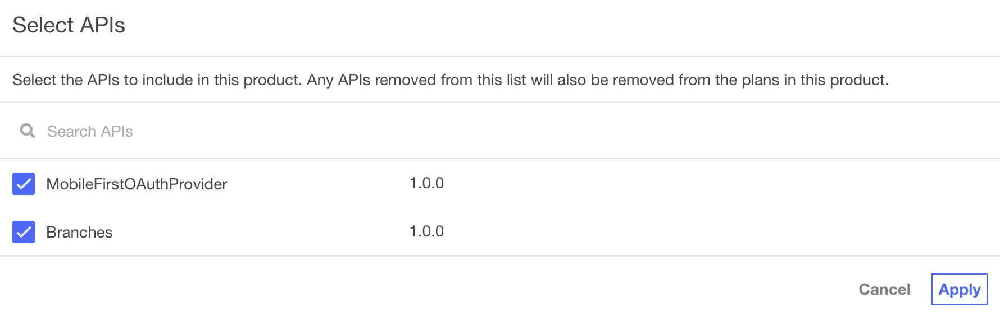
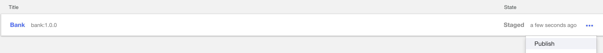

<!-- NLS_CHARSET=UTF-8 -->
## Overview
IBM API Connect is a cloud-based API Management solution that allows you to design, control, secure, publish, manage, analyze, and scale your API with its simple-to-use configuration and coding platform.
To learn more about IBM API Connect, visit the [IBM API Connect Developer Center](https://developer.ibm.com/apiconnect/).  

{{ site.data.keys.product_full }} integrates its security capabilities with IBM API Connect by using the {{ site.data.keys.product_adj }}  OAuth Provider API template, which allows you to:  

1. Protect API Connect endpoints with the {{ site.data.keys.mf_server }} as the authorization server.  
2. Proxy {{ site.data.keys.product_adj }} client non-resource requests and responses through DataPower to the {{ site.data.keys.mf_server }} that is located behind the DMZ.  



Currently the security integration of {{ site.data.keys.product_adj }} and API Connect is supported only when DataPower is used as the Gateway server ("Edge Gateway").  

The security integration is suppored for both [API Connect on-premise deployment](http://www.ibm.com/support/knowledgecenter/SSMNED_5.0.0/com.ibm.apic.install.doc/overview_installing_apimgmt.html) and [API Connect IBM Cloud Service](https://console.ng.bluemix.net/docs/services/apiconnect/index.html)

#### Jump to
* [Prerequisites](#prerequisites)
* [Protect the API Connect endpoint with {{ site.data.keys.product_adj }} as an authorization server](#protect-the-api-connect-endpoint-with-mobilefirst-as-an-authorization-server)
* [Update PinCodeAndroid sample client application](#update-pincodeandroid-sample-client-application)
* [Support for multiple {{ site.data.keys.product_adj }} OAuthProviders](#support-for-multiple-mobilefirst-oauthproviders)

## Prerequisites

* API Connect DataPower (Edge) version 5040 or later
* IBM® DataPower® Gateway 7.5.X or later
* {{ site.data.keys.product_adj }}
* Completing the [Implementing the challenge handler in Android applications](https://mobilefirstplatform.ibmcloud.com/tutorials/en/foundation/8.0/authentication-and-security/credentials-validation/android/) tutorial, which
uses the [PinCodeAndroid sample](https://github.com/MobileFirst-Platform-Developer-Center/PinCodeAndroid/tree/release80)

## Protect the API Connect endpoint with {{ site.data.keys.product_adj }} as an authorization server
After completing this tutorial and the PinCode sample you will have:  

1. An Android application with the `PinCodeChallengeHandler` for the  `PinCodeAttempts` security check adapter.  
2. A `ResourceAdapter` that protects the  `/balance` endpoint with the `accessRestricted` scope.  
3. A `PinCodeAttempts` security check adapter which is mapped to the `accessRestricted` scope for the Android application.  

### Define Confidential Client in {{ site.data.keys.mf_console }}
Go to {{ site.data.keys.mf_console }}:

1. In the **Runtime Settings** choose the **Confidential Clients** tab.
2. Click the **New** button.
3. Provide the following values and save:
    * **Display Name**: `API Connect`
    * **ID**: `apic`
    * **Secret**: YOUR-CLIENT-SECRET
    * **Allowed Scope**: `authorization.introspect`



### Add the API Connect TLS Profile for the MobileFirst HTTPS endpoint
This step is optional and necessary only if you want to send requests to the MobileFirst HTTPS endpoint from API Connect.
In order to create an API Connect TLS Profile, you should have your {{ site.data.keys.mf_server }} certificate (and its password).

> See [TLS profiles](http://www.ibm.com/support/knowledgecenter/SSMNED_5.0.0/com.ibm.apic.apionprem.doc/task_apionprem_ssl.html) for information on adding TLS profiles to API Connect in the API Manager.

### Import the MobileFirst OAuthProvider template
From the API Designer, create an OAuthProvider REST API by importing the [Swagger template YAML file](https://git.ng.bluemix.net/imfsdkt/console-tools-and-sdks/raw/master/mobilefirst-ouath-provider_1.0.0.yaml)   (`mobilefirst-ouath-provider_1.0.0.yaml`).

> For more information, see
[Adding a REST API by using an OpenAPI (Swagger 2.0) file](http://www.ibm.com/support/knowledgecenter/SSMNED_5.0.0/com.ibm.apic.apionprem.doc/create_api_swagger.html).

After importing, different configuration options are displayed and the **Design** tab is selected. Navigate to the **Assemble** tab.  
You will see the following components in the assembly flow for the MobileFirst OAuth Provider API:

* MobileFirst Configuration
* gatewayscript
* proxy
* gatewayscript


### Configure the MobileFirst OAuthProvider template
Using the API Designer, configure the imported API.  

1. From the **Assemble** tab choose the **MobileFirst Configuration** component.  
2. In the **MobileFirst Configuration** component, update the following variable values:  

* **mfp-oauth-type:** Leave the default value (**true**).  
* **mfp-server-url:** The {{ site.data.keys.mf_server }} URL in the format `protocol://server-host:port`. For example **http://myMobileFirstServer:9080**. You can find this value in the `mfpclient.properties` file (see the `wlServerProtocol`, `wlServerHost` and `wlServerPort` properties).  
* **mfp-server-context:** The {{ site.data.keys.mf_server }} context. Find this value in the `mfpclient.properties` file (see the `wlServerContext` property).  
* **mfp-client-id:** `apic`, as configured in the {{ site.data.keys.mf_console }}. **Runtime Settings → Confidential Clients** for the `authorization.introspect` scope.  
* **mfp-client-secret:** `YOUR-CLIENT-SECRET`, as configured in the {{ site.data.keys.mf_console }}. **Runtime Settings → Confidential Clients** for the `authorization.introspect` scope.  

> **Note:** If you configured HTTPS protocol in the previous step for `mfp-server-url`, configure API Connect with a TLS Profile in the **proxy** policy component. Go to the **proxy** policy component in the **Assemble** tab and select for the **TLS Profile** property the profile you previously created in **"Add API Connect TLS Profile for MobileFirst HTTPS endpoint"**.

### Get the full URL path of {{ site.data.keys.product_adj }} OAuthProvider for `/oauth2/authorize`
Choose and configure a Catalog for your product, and set the full path:

1. Open the **Dashboard**.
2. Choose a catalog (for example **Sandbox**) for your product.
3. Go to **Settings → Endpoints** and copy the **Base URL** which has the following format: `https://{DataPowerGateway}/{organizationName}/{catalogName}`
4. To determine full URL path of {{ site.data.keys.product_adj }} OAuthProvider for **/oauth2/authorize**, concatenate the `Base Path` value of the **{{ site.data.keys.product_adj }} OAuthProvider**  (`/mfpProvider`) and the `/oauth2/authorize` endpoint.

 The full URL of the {{ site.data.keys.product_adj }} OAuthProvider should look like this: `https://{DataPowerGateway}/{organizationName}/{catalogName}/mfpProvider/oauth2/authorize`

### Create a Simple REST API in API Connect
In this example we create an API called **Branches** and a Product called **Bank** (Based on API Connect's tutorial for [Creating an invoke REST API definition](http://www.ibm.com/support/knowledgecenter/SSMNED_5.0.0/com.ibm.apic.toolkit.doc/tutorial_apionprem_apiproxy.html)).

From the API Connect Designer **APIs** tab:

1. To create a REST API definition, click the  add button and then select **New OpenAPI from scratch**.
2. Configure the following parameters and click on **Add** button to create the API:

	**Title**: Branches      
    **Name**: branches  
	**Base Path**: /branches  
	**Version**: 1.0.0  

3. The **Design** tab of the REST API will be displayed.
4. In the **Base Path** section, verify the field is already populated with '/branches'.
5. Go to **Paths** section and create a path by clicking the **Add Path**  icon.
6. In the **Path** field enter **/details** (`GET` method is created by default).

    

7. Go to the **Assemble** tab and click the **invoke** policy component that appears in the **Assemble** pane.

    

8. In the properties sheet pane, populate the **URL** field with the back-end resource URL to be protected with {{ site.data.keys.product_adj }}. The other values are optional. For this tutorial use `https://apim-services.mybluemix.net/banka/v1/branches`.
    

9. Click the **Save** button  to save the API definition.

### Protect the API using the {{ site.data.keys.product_adj }} OAuth Security Definition  
Protect the API by defining a **Security Definition**.

1. In the newly created Branches API, choose **Security Definition** from the design list click the  button to add a defintion of the type **OAuth**.

    

2. Set the values:
   * **Flow:** Choose **Implicit**.
   * **Authorization URL:** Use the full URL path of {{ site.data.keys.product_adj }} OAuthProvider for `/oauth2/authorize`, which should be like `https://{DataPowerGateway}/{organizationName}/{catalogName}/mfpProvider/oauth2/authorize`.
   * **Scopes:** `accessRestricted`.

    

3. Go to the **Paths** section and choose the `/details` path.
4. Click on the **GET** method and expand it.
5. In the **Security** section, uncheck **Use API security definitions** and check the newly created **{{ site.data.keys.product_adj }} OAuth Security Definition** from the list.

    

6. Click the **Save** button  .

### Add the APIs to product and publish it
From the API Connect Designer **Products** tab:  

1. To create a Product definition, click the  add button and then select **New Product from scratch**.

2. Configure the following parameters:  

	**Title**: Bank  
    **Name**: bank  
	**Version**: 1.0.0  

3. Click the **Create product** button to create the API. The **Design** tab of the Product will be displayed.

4. Go to the **APIs** section click **Add**  .

    

5. Add the two newly created APIs: **{{ site.data.keys.product_adj }} OAuthProvider** and **Branches**.

    

6. Save the Product. 

7. Stage the Product. See [Staging a Product](http://www.ibm.com/support/knowledgecenter/en/SSMNED_5.0.0/com.ibm.apic.toolkit.doc/task_deploy_product_offline.html) for more details.

    
    

8. Publish the Product: Go to the Catalog **Dashboard** and choose **Bank** product to publish. See [Publish a Product](http://www.ibm.com/support/knowledgecenter/en/SSMNED_5.0.0/com.ibm.apic.apionprem.doc/publishing_a_product.html) for more details.

    
    

## Update PinCodeAndroid sample client application
### Update the `wlclient.properties` file
After setting up the **PinCodeAndroid** sample and completing the setup described in the `README` file, the `wclient.properties` is configured to send all {{ site.data.keys.product_adj }} requests directly to {{ site.data.keys.mf_server }}.  

However, when working with APIC Connect, the client application requests are proxied by the API Connect endpoints which is exposed by the {{ site.data.keys.product_adj }} OAuthProvider.

In order to enable the proxy, the following changes are required in the `wclient.properties` file:

* **wlServerProtocol:** Change to `https`.    
* **wlServerHost:** Change to DataPower Gateway hostname (or IP) as it appears in the base URL.  
* **wlServerPort:** Change to 443.  
* **wlServerContext:** Change to the relative base path of the {{ site.data.keys.product_adj }} OAuthProvider. For example `/{organizationName}/{catalogName}/mfpProvider/`.  

### Update the WLResourceRequest request
In the {{ site.data.keys.product_adj }} tutorial sample code, change the following in the `MainActivity.java` code.  
Replace this:

```java
    WLResourceRequest request = new WLResourceRequest(adapterPath, WLResourceRequest.GET);
```

with this:   

```java
    String apicPath = "YOUR_APIC_ENDPOINT_PATH_WHICH_IS_PROTECTED_BY_MOBILEFIRST";
    URI apicPathUri = new URI(apicPath);
    WLResourceRequest request = new WLResourceRequest(apicPathUri, WLResourceRequest.GET);
```

> **Note:** For the API Connect endpoint path (`apicPath`) you must supply the full URL, constructed as follows: `https://{DataPowerGateway}/{organizationName}/{catalogName}/branches/details`

### Add SSL certificate to client for API Connect HTTPS endpoint
If you use API Connect BlueMix Service, please skip this step.

API Connect supports HTTPS endpoints only, which may require adding self-signed SSL certificate to your device/emulator while developing your client application.
For example in Android, you may see the following Exception:

```java
javax.net.ssl.SSLHandshakeException: java.security.cert.CertPathValidatorException: Trust anchor for certification path not found
```

For on-premise deployement, API Connect uses by default its own self-signed SSL certificate, which currently isn't signed with v3\_ca extension.
Self-signed SSL certificate without v3\_ca extension can't be added to some of the mobile devices (like Android).  

In order to avoid the SSL exception, you can do one the following:  

1. **Replace the default API Connect SSL certificate with your own**:
    * Create self-signed certificate using OpenSSL:

    ```bash
        #!/bin/sh
        #
        # Replace DATAPOWER_GW_HOSTNAME with real hostname
        HOST=DATAPOWER_GW_HOSTNAME
        PRIVATEKEY=${HOST}_private.pem
        PUBLICKEY=${HOST}_public.pem
        P12FILE=$HOST.p12
        P12PWD=passw0rd
        P12LABEL=$HOST
        # This creates the public and private keys in PEM format
        openssl req -x509 -nodes -days 999 -newkey rsa:2048 -keyout "$PRIVATEKEY" -out "$PUBLICKEY" -reqexts v3_req -extensions v3_ca -subj /C=us/O=ibm/CN=$HOST
        # This creates a password-protected pkcs12 file so that the private key that can be imported into API Connect
        openssl pkcs12 -export -in "$PUBLICKEY" -inkey "$PRIVATEKEY" -out "$P12FILE" -passout pass:"$P12PWD" -name "$P12LABEL"
    ```
    * You should have three output files, however only the following will be used:
        * **DATAPOWER\_GW\_HOSTNAME.p12** – Password-protected pkcs12 file for importing it to API Connect TLS Profile.
        * **DATAPOWER\_GW\_HOSTNAME\_public.pem** – Public certificate to install into the device as a trusted CA.
    * Create TLS Profile for it in CMC (Use the password you set on `P12PWD`). See [TLS profiles](http://www.ibm.com/support/knowledgecenter/SSMNED_5.0.0/com.ibm.apic.apionprem.doc/task_apionprem_ssl.html)
    * Bind the TLS Profile you created with the gateway service. See [Binding a TLS profile to an existing gateway service](http://www.ibm.com/support/knowledgecenter/SSMNED_5.0.0/com.ibm.apic.cmc.doc/bind_ssl_existing_gateway.html)
    * Install the certifcae you created **DATAPOWER\_GW\_HOSTNAME\_public.pem** on the device. See [Installing the root CA on Android](http://www.ibm.com/support/knowledgecenter/SSHS8R_7.1.0/com.ibm.worklight.installconfig.doc/admin/t_installing_root_CA_android.html) or [Installing the root CA on iOS](http://www.ibm.com/support/knowledgecenter/en/SSHSCD_7.1.0/com.ibm.worklight.installconfig.doc/admin/t_installing_root_CA_iOS.html) for more details.

2. **Adding API Connect default certificate to TrustStore in the client application code (for development)**:
    * Fetch the default API Connect certificate using OpenSSL:

        `openssl s_client -connect {DATAPOWER_GW_HOSTNAME}:443 | openssl x509 > apic-certificate.crt`
    * Add relevant code to your client application to trust API Connect certficate and its hostname. You can follow [Security with HTTPS and SSL](https://developer.android.com/training/articles/security-ssl.html) for more details in Android.

> See [Configuring SSL by using untrusted certificates](http://www.ibm.com/support/knowledgecenter/SSHSCD_7.1.0/com.ibm.worklight.installconfig.doc/admin/c_ssl_config.html) for more details on how to add untrusted certificate to your client application.  

## Support for multiple {{ site.data.keys.product_adj }} OAuthProviders
To add additional OAuthProviders, alter the Swagger template each time before re-importing:

1. **x-ibm-name:** Change "mobilefirst-ouath-provider" to another unique name (using only lowercase).
2. **basePath:** Change "/mfpProvider" to another unique path.  
3. **title:** Change "MobileFirstOAuthProvider" to a unique title.
4. **description:** Change "MobileFirst OAuthProvider Template" to a unique description.  

For each additonal OAuthProvider, use the new base path value to replace the `/mfpProvider` value.
