IBM API Connect is a cloud-based API Management solution that allows you to design, control, secure, publish, manage, analyze, and scale your API with its simple-to-use configuration and coding platform. [Learn more about IBM API Connect](https://developer.ibm.com/apiconnect/).

{{ site.data.keys.product_full }} integrates its security capabilities with IBM API Connect by using the {{ site.data.keys.product_full }} OAuth Provider API template, which allows you to,

1.	Protect API Connect endpoints with the MobileFirst Server as the authorization server.
2.	Proxy MobileFirst client non-resource requests and responses through API Connect to the MobileFirst Server located behind the DMZ.

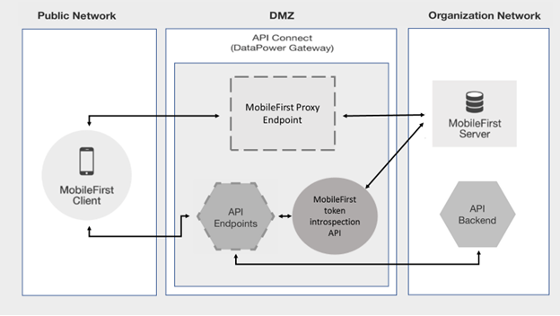

The Introspection endpoint of MobileFirst server (MFP) can validate and extract data from a MobileFirst OAuth token. The MobileFirst token introspection API provided with the MobileFirst OAuth Provider template can be used to protect API endpoints deployed to API Connect.

1.	Mobile client application invokes API endpoint using MobileFirst client SDK API `WLResourceRequest`.
2.	Since the API is protected, API Connect validates the incoming token by passing the token to MobileFirst Foundation token introspection API. If the token is active, the client is given access to the requested resource. If not, an error message is sent back to the client, which can be handled by the client to obtain a new token.
3.	MobileFirst Foundation adapters can also be exposed as APIs in API Connect. Client can use `WLResourceRequest`, MobileFirst client SDK API to consume these adapter APIs as well.
Currently, the security integration of MobileFirst and API Connect is supported only when DataPower is used as the Gateway server (*Edge Gateway*).

> The security integration is supported for both API Connect on-premise deployment and API Connect service on IBM Cloud. Steps in this tutorial have been verified with API Connect service and MobileFirst Foundation service on IBM Cloud.

## Prerequisites
{: #prerequisites}
* API Connect service on IBM Cloud.
* Mobile Foundation service on IBM Cloud.
* [Download](https://github.com/MobileFirst-Platform-Developer-Center/MobileFirstAPIConnectIntegration) the `MFPOAuthLoginApplication` sample and `MFPOAuthProvider` template yaml files.
* [Download](https://github.com/MobileFirst-Platform-Developer-Center/SecurityCheckAdapters) the `SecurityCheck` adapter sample.

## Define Confidential Client in MobileFirst Operations Console
{: #define-cc}
Follow the steps below to define the Confidential Client in MobileFirst Operations console.

1. Launch the MobileFirst Operations Console.
2. In the **Runtime Settings** choose the **Confidential Clients** tab.
3.	Click **New**.
4.	Provide the following values and save:
	 - 	*Display Name: API Connect*
	 - 	*ID: apic*
	 - 	*Secret: `<confidential-client-password>`*
	 - 	*Allowed Scope: authorization.introspect*

> **Note:** Please make a note of the confidential-client-password, which will be used later in the MobileFirst token introspection API configuration.

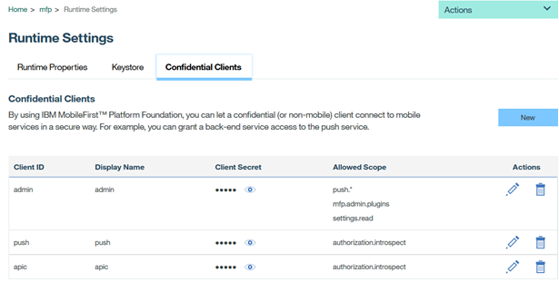


## Import the MFPOAuth REST API template in API Connect
{: #import-restapi-template}
In the API Designer, create `MFPOAuth` REST API by importing the Swagger template YAML file `mfpoauth_1.0.0.yaml` (see [Prerequisites](#prerequisites)).

After completing the import, you will see different configuration options are displayed and the **Design** tab selected. Navigate to the **Assemble** tab.
In the assembly flow, you will see the components as shown in the image below:

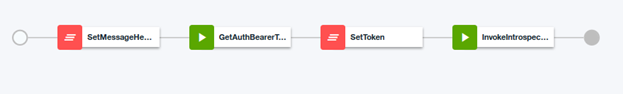

### Configure the MFPOAuth REST API template
{: #configure-restapi-template}
Use the API Designer to configure the imported API.

1.	From the **Assemble** tab choose the `GetAuthBearerToken` component.
2.	In the `GetAuthBearerToken` component, update the following variable values:

	- **URL**: The MobileFirst Server URL in the format `<protocol>://<server-host>:<port>/mfp/api/az/v1/token`.<br/>
    For example, `https://mobile-server.bluemix.net/mfp/api/az/v1/token`.

	- **username**: apic, as configured in the MobileFirst Operations Console.<br/>
    **Runtime Settings -> Confidential Clients** for the *authorization.introspect* scope.

	- **password**: `<confidential-client-password>`, as configured in the MobileFirst Operations Console.<br/> **Runtime Settings -> Confidential Clients** for the *authorization.introspect* scope.

	- **HTTPMethod**: POST

3.	In the `InvokeIntrospection` component, update the following variable values:

	- **URL**: The MobileFirst Server URL in the format `<protocol>://<server-host>:<port>/mfp/api/az/v1/introspection`.<br/>
    For example, `https://mobile-server.bluemix.net/mfp/api/az/v1/introspection`.

	- **HTTPMethod**: POST

## Import the MFPProxy REST API template in APIConnect
{: #import-mfpproxy-api}

In the API Designer, create `MFPProxy` REST API by importing the Swagger template YAML file `mfpproxy_1.0.0.yaml` (see [Prerequisites](#prerequisites)).


After completing the import, you will see different configuration options are displayed and the **Design** tab selected. Navigate to the **Assemble** tab.

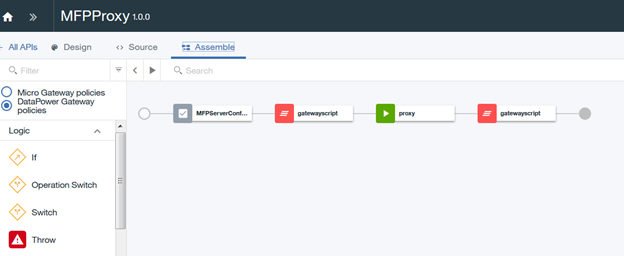

You will see the following components in the assembly flow for the MobileFirst OAuth Provider API:
* MobileFirst Configuration
* gatewayscript
* proxy
* gatewayscript


### Configure the MFPProxy REST API Template
{: #configure-mfpproxy-api}

Use the API Designer to configure the imported API.

1.	From the Assemble tab choose the MobileFirst Configuration component.
2.	In the MobileFirst Configuration component, update the following variable values:
	 - **mfp-server-url:** The MobileFirst Server URL in the format `<protocol>://<server-host>:<port>`.<br/>
     For example, `https://mobile-server.bluemix.net`.
	 - **mfp-server-context:** The MobileFirst Server context.<br/>
     For example, *mfp*

## Create a Simple REST API in API Connect
{: #create-simple-api}
In this example, we create an API called *InvokeBackend* and a product called *Bank* (Based on API Connect’s tutorial for [Creating an invoke REST API definition](https://www.ibm.com/support/knowledgecenter/SSMNED_5.0.0/com.ibm.apic.toolkit.doc/tutorial_apionprem_apiproxy.html)).

> **Note:** You can import this API by importing the Swagger template YAML file
`invokebackend_1.0.0.yaml` (see [Prerequisites](#prerequisites)).

You can also follow the steps below to create the API from scratch.

From the API Connect Designer **APIs** tab:

1.	Click **Add** and then select **New API** to create a REST API definition.

2.	Configure the following parameters and click **Add** to create the API:
	  - *Title: InvokeBackend*
	  - *Name: invokebackend*
	  - *Base Path: /invokebackend*
	  - *Version: 1.0.0*

3.	The **Design** tab of the REST API will be displayed.
4.	In the **Base Path** section, verify that the field has the value */invokebackend*.
5.	Go to the **Paths** section and create a path by clicking the **Add Path** icon.
6.	In the **Path** field provide */details* (GET method is created by default).
    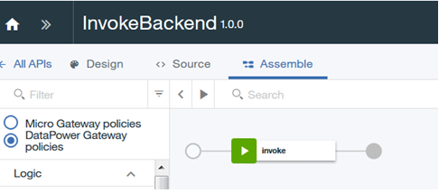

7.	Go to the **Assemble** tab and click the **invoke policy** component that appears in the **Assemble** pane.
8.	In the properties sheet pane, populate the **URL** field with the back-end resource URL to be protected with MobileFirst. The other values are optional. [Learn more](https://apim-services.mybluemix.net/banka/v1/branches).
9.	Click **Save** to save the API definition.

## Protect the API using the MobileFirst OAuth Security Definition
{: #protect-api-oauth}

Protect the newly created `InvokeBackend` API by defining a **Security Definition**.

1.  In the newly created `InvokeBackend` API, choose **Security Definition** from the design list, click the button to add a definition of the type **OAuth**.

	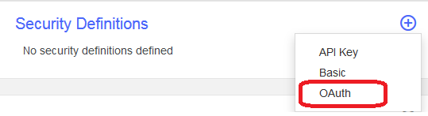

2.	Set the values:
	   - **Flow:** Choose *Implicit*.
	   - **Introspection URL:** Use the full URL path of the deployed `MFPOAuth` API, which should be like `https://{GatewayHostName}/{organizationName}/{catalogName}/mfpoauth/introspect`
	   - **Scopes:** *RegisteredClient* and *accessRestricted*
	> **Note:** *RegisteredClient* is the default scope of MFP server.

3.	Go to the **Paths** section and choose the */details* path.
4.  Click the **GET** method and expand it.
5.	In the **Security** section, uncheck **Use API security definitions** and check the newly created **MobileFirst OAuth Security Definition** from the list.
6.	Click **Save**.

	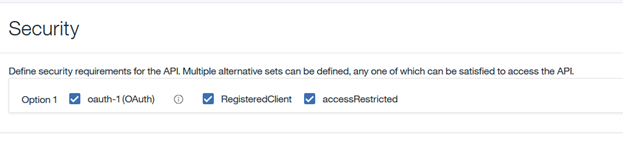


### Add the APIs to product and publish it
{: #publish-apis}
In the API Connect Designer **Products** tab, carry out the following steps:

1.	To create a Product definition, click **Add** and then select **New Product**.
2.	Configure the following parameters:
	   - *Title: Bank*
	   - *Name: bank*
	   - *Version: 1.0.0*
3.	Click **Create product** to create the API. The **Design** tab of the Product will be displayed.
4.	Go to the **APIs** section click **Add**.

	  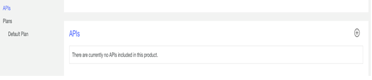
5.	Add all the three newly created APIs `MFPOAuth`, `MFPProxy`, and `InvokeBackend` to this Product.
6.	**Save** the Product.  
7.	Stage the Product. See [Staging a Product](www.ibm.com/support/knowledgecenter/en/SSMNED_5.0.0/com.ibm.apic.toolkit.doc/task_deploy_product_offline.html).
	  
8.	To publish the Product, go to the **Catalog** Dashboard and choose *Bank* product to publish. See [Publishing a Product](https://www.ibm.com/support/knowledgecenter/en/SSMNED_5.0.0/com.ibm.apic.apionprem.doc/publishing_a_product.html).
	  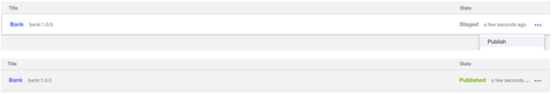


### Set up `MFPOAuthLoginApplication` sample
{: #setup-sample}
Follow the steps described below to set up the `MFPOAuthLoginApplication` sample.

#### 1.	Update the `mfpclient.properties` file

Open `MFPOAuthLoginApplication` sample (see [Prerequisites](#prerequisites)) in Android Studio, update the `mfpclient.properties` to send all MobileFirst requests directly to API Connect. The client application requests are proxied by the API Connect endpoints which are exposed by the MobileFirst OAuthProvider.

Make the following changes in `mfpclient.properties` file to enable the proxy:

- *wlServerProtocol:* Change to **https**.
- *wlServerHost:* Change to API Connect hostname (or IP) as it appears in the base URL.
- *wlServerPort:* Change to **443**.
- *wlServerContext:* Change to the relative base path of the MobileFirst OAuthProvider. For example, */{organizationName}/{catalogName}/mfp/*

Please note **/mfp** used in the context root is the base path where the `MFPProxy` API endpoint is deployed.

#### 2. Update the `WLResourceRequest` call

Change the following in the `ProtectedActivity.java` file:
  ```java
      apicPathUri = new
                   URI("https://<gateway-host-name>/<orgname>/<catalogname>/invokebackend/getdetails");
  ```
For **apicPathUri** supply the full URL, constructed as follows:
`https://{GatewayHostName}/{organizationName}/{catalogName}/invokebackend/getdetails`.

#### 3.	Update the APIC Client Id
  Replace **APIC-CLIENT-ID** in the `ProtectedActivity.java` file:

  ```java
      request.addHeader("X-IBM-Client-Id","APIC-CLIENT-ID");
  ```
The actual client Id is obtained from the APIC developer portal after registering the application, which subscribes to the APIs deployed (explained earlier in this tutorial). Read [how to register applications in APIC developer portal](https://www.ibm.com/support/knowledgecenter/en/SSFS6T/com.ibm.apic.devportal.doc/task_cmsportal_registerapps.html).

#### 4.	Register application

  Register the `MFPOAuthLoginApplication` sample with MFP server.

  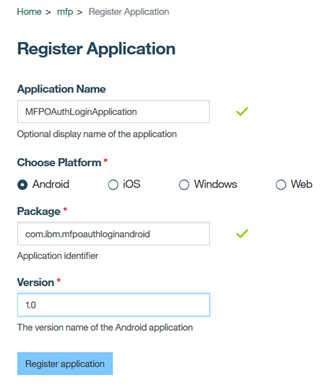


  Map the scope *accessRestricted* to *UserLogin* securitycheck in the **Scope-Elements Mapping** section of the deployed application in the MobileFirst Foundation console.

  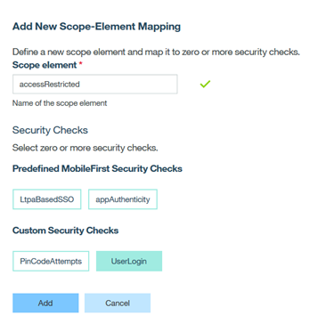

#### 5.	Deploy adapters

  Deploy the `SecurityCheck` sample adapters – *UserLogin* and *ResourceAdapter* to MobileFirst server. See  [here](https://github.com/MobileFirst-Platform-Developer-Center/SecurityCheckAdapters/tree/release80) for details.

### Execute the application
{: #execute-app}

Now execute `MFPOAuthLoginApplication`. Log in using *john/john* as the username/password.

1.	**Get Balance** invokes the */balance* endpoint of `ResourceAdapter` deployed to MobileFirst Server. This resource is protected by *accessRestricted* scope.
2.	**Invoke API** invokes `InvokeBackend` API deployed to API Connect. This resource is also protected by *accessRestricted* scope.
3.	The token obtained for one of the above invoke calls is used for the other as well and both are authorized by MobileFirst server.

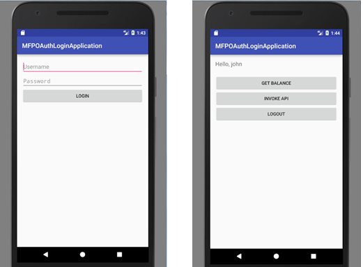


## Summary
{: #summary}
This tutorial described how to use MobileFirst as the OAuth server to protect the API Connect endpoints.
