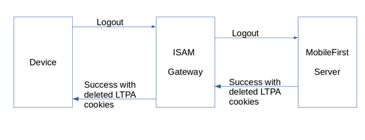
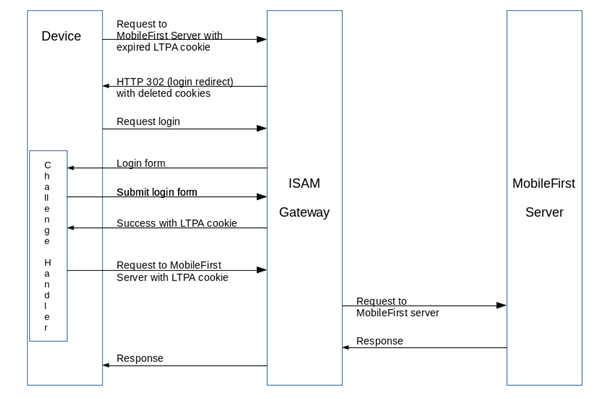

<!-- NLS_CHARSET=UTF-8 -->
## Overview
IBM Security Access Manager can be used in the DMZ to protect {{ site.data.keys.product_adj }} mobile application traffic.

It can be used as a security gateway to protect mobile application traffic initiated by {{ site.data.keys.product_adj }} application. Such traffic can be protected by preventing data from being altered, authenticating users and allowing only authorised users to access the enterprise applications.

IBM Security Access Manager can be used in different ways within an organisation's network to protect enterprise resources. It can be placed in the DMZ so that it acts as a front-end, reverse proxy and a security gateway.

> This article assumes prior knowledge of other {{ site.data.keys.product_adj }} features, such as challenge handlers. It also assumes that IBM Security Access Manager is installed and IBM Security Access Manager for Web configured and Reverse Proxy Instance created.

## Supported versions
This pattern and the samples are designed to work with {{ site.data.keys.product }} 8.0. The supported platforms currently are Android and iOS, both native and Cordova-based.  

This also requires {{ site.data.keys.product }} to run on an application server that supports LTPA tokens.

> NOTE: Cordova-based apps (iOS or Android) and native Android apps are supported on IBM Security Access Manager version 9.0.2 onwards. The older versions of Security Access Manager tokenise the authentication header, causing the {{ site.data.keys.product }}'s Cordova/Android SDK to fail. The iOS SDK is not affected by this. This issue has been rectified in IBM Security Access Manager 9.0.2.

## Flow
### Initial flow


### Logout flow


### Expired flow


## Setting up your MobileFirst application
Create your {{ site.data.keys.product_adj }} application without any security, to ensure that it works without IBM Security Access Manager.

> You can download the linked samples for Cordova, Android or iOS.

### Challenge Handler
The IBM Security Access Manager pattern provided here will send an HTML login form when the MobileFirst application tries to access any protected resource. To detect the incoming login form, `GatewayChallengeHandler` is used in conjunction with searching for the known login form string `pkmslogin.form`. IBM Security Access Manager expects that the login form is submitted with the login credentials of the user accessing protected resources.

#### Cordova and Android App:
- The form's action URL, relative to {{ site.data.keys.product_adj }} context is `../../../../../../../pkmslogin.form?token=Unknown`.

#### iOS App:
- The form's action URL, relative to {{ site.data.keys.product_adj }} context is `../../pkmslogin.form?token=Unknown`.

#### Common For All Mobile platforms
- The form submitted back to IBM Security Access Manager expects 3 elements as parameters.
  - `username`
  - `password`
  - `login-form-type = pwd` (This is the hard coded element of the login form).

Below is the example for Cordova applications.

Declare the challenge handler. The name of the security check parameter is not important:

```javascript
var isamAuthChallengeHandler = WL.Client.createGatewayChallengeHandler("LtpaBasedSSO");
```

`canHandleResponse` need to be implemented, which helps determine if the current HTTP response is relevant for the challenge handler. In this case, we look for `pkmslogin.form`.

```javascript
isamAuthChallengeHandler.canHandleResponse = function(response) {
  if (!response || response.responseText === null) {
    return false;
  }
  var indicatorIdx = response.responseText.search('pkmslogin.form');
  if (indicatorIdx >= 0) {
    return true;
  }
  return false;
};
```

`handleResponse` will be called when `canHandleResponse` returns `true`. We can put in the code to display the login form here.

Once the user fills in the login form, clicking **Submit** button should trigger `submitLoginForm`, passing the user credentials as parameters.

```javascript
document.getElementById("AuthSubmitButton").addEventListener("click", function() {
  var reqURL = '../../../../../../../pkmslogin.form?token=Unknown';
  var options = {};
  options.parameters = {
    'username' : document.getElementById('AuthUsername').value,
    'password' : document.getElementById('AuthPassword').value,
    'login-form-type' : 'pwd'
  };

  isamAuthChallengeHandler.submitLoginForm(reqURL, options,
     isamAuthChallengeHandler.submitLoginFormCallback);
});
```

MobileFirst framework will call `submitLoginFormCallback` when a response is received by the application. In the callback function, we check if the response is a valid response and call `submitSuccess` to complete the authentication process.

```javascript
isamAuthChallengeHandler.submitLoginFormCallback = function(response) {
  var isLoginFormResponse = isamAuthChallengeHandler.canHandleResponse(response);
  if (isLoginFormResponse) {
    isamAuthChallengeHandler.handleChallenge(response);
  } else {
    document.getElementById('result').style.display = 'block';
    document.getElementById('auth').style.display = 'none';
    isamAuthChallengeHandler.submitSuccess();
  }
};
```

Clicking the **Logout** button will log the user out of the {{ site.data.keys.mf_server }}, first, and then will logout the user from IBM Security Access Manager. For logging out of IBM Security Access Manager, the action URL is `../../../../../../../pkmslogout`.
> It will be `../../pkmslogout` for iOS applications.

```javascript
document.getElementById('logout').addEventListener('click', function() {
  WLAuthorizationManager.logout("LtpaBasedSSO").then(
    function() {
      var reqURL = '../../../../../../../pkmslogout';
      var options = {};
      options.parameters = {};

      isamAuthChallengeHandler.submitLoginForm(reqURL, options,
        isamAuthChallengeHandler.submitLoginFormCallback);
      alert ("Success logout");
    },
    function(response) {
      WL.Logger.debug("logout onFailure" + JSON.stringify(response));
    });
});
```

## Scope-Elements Mapping
IBM Security Access Manager is responsible for authentication and communicates the status with {{ site.data.keys.mf_server }} using LTPA tokens. To ensure requests with valid LTPA token access protected resources, such resources need to be protected by the security check `LtpaBasedSSO`.

One way to achieve this is to map the **Scope-Elements** on this application. This will ensure that each application trying to access the protected resource is subjected to LTPA validation first.

In the {{ site.data.keys.mf_console }}, select your application and then click **Security** tab. Look for **Scope-Elements Mapping**. Click **New** and enter `accessRestricted` for **Scope Element**. Choose `LtpaBasedSSO` as **Predefined {{ site.data.keys.product_adj }} Security Checks**.

>**Note:** `accessRestricted` is used in this example. It can be something else for your resource.


### server.xml
In the {{ site.data.keys.mf_server }} folder, look for a **ltpa.keys** file. Fill in the value for `com.ibm.websphere.ltpa.Realm` in the file.

In the **server.xml** file, look for `<basicRegistry>` or `<ldapRegsitry>` element. Create one, if it does not exist. Add `realm` attribute to that element. The value for the `realm` attribute should be the one that you had filled in **ltpa.keys** file above.

When using `<basicRegistry>`, ensure that the authorised users are also listed here.

```xml
<basicRegistry realm="worklightRealm">
  ...
  <user name="cn=JaneDoe,dc=iswga" password="Passw0rd1"/>
  <user name="cn=JohnDoe,dc=iswga" password="Passw0rd2"/>
</basicRegistry>
```

> NOTE: If application server is configured for `<ldapRegsitry>`, either the same or replica of same LDAP server need to be used that was configured with IBM Security Access Manager. This is because the DNs of the users need to match, for the SSO to work.

For more information about basic registry or configuring against LDAP server, refer your application server's documentation.

## IBM Security Access Manager configuration
The following was tested in IBM Security Access Manager 9.0.2.

Before you start configuring IBM Security Access Manager, export **ltpa.keys** file from {{ site.data.keys.product }}'s application server. This will be required in the following steps.

Ensure that IBM Security Access Manager is running and Reverse Proxy is configured before doing the following. Learn about configuring IBM Security Access Manager: [ISAM Online Help](http://www.ibm.com/support/knowledgecenter/SSPREK_9.0.2/com.ibm.isam.doc/welcome.html).

### Import LTPA keys

1. Go To **Secure Web Settings: Global Keys → LTPA Keys**.
2. Click **Manage → Import**.
3. Click **Browse** and select the appropriate key file exported before and click **Import**.
4. Deploy pending changes.

### Configuring Reverse Proxy Instance for LTPA Based SSO
1. Go to **Secure Web Settings: Manage → Reverse Proxy**.
2. Select the reverse proxy instance you want to configure and then click **Edit**.
3. Go to **SSO** tab.
4. Under **LTPA: Transport** dropdown menu, select **BOTH**.
5. Set the cookie name to **LtpaToken2**.
6. From **Key File** dropdown list, select the LTPA key file imported earlier.
7. Enter **Key File Password**, as configured when configuring the key file. The default value for Websphere application server is **WebAS**.
8. **Save** and **Deploy** the changes.
9. **Restart** the reverse proxy.

### Setting Up {{ site.data.keys.product_adj }} Junctions
1. Go to **Secure Web Settings: Manage → Reverse Proxy**.
2. Select the reverse proxy instance that you want to configure.
3. From the **Manage** dropdown list, select **Junction Management**.
4. Click **New -> Standard Junction**.
5. Enter `/mfp` as **Junction Point Name**.
6. Select **Create Transparent Path Junction**.
7. Select **TCP** (This integration was tested against non-SSL junction).
8. Go to **Server** tab and click **New**.
9. Enter the **Hostname** of {{ site.data.keys.mf_server }}.
10. Enter **TCP or SSL Port** of your {{ site.data.keys.mf_server }}.
11. Select the **Local Address** from the dropdown menu for the application interface.
12. Click **Save**.
13. Go to **Identity** tab.
14. For **HTTP Basic Authentication Header**, select **Ignore** from the dropdown menu.
15. Ensure **Cookie Junction** is checked and **Junction Cookie Javascript Block** is selected as **Inhead** from the dropdown menu.
16. Check **Insert Client IP Address**.
17. Go to **SSO and LTPA** tab.
18. Ensure **Enable LTPA Cookie Support** and **Use Version 2 Cookies** are checked.
19. Select the LTPA key file that was exported earlier in **LTPA Keyfile** dropdown menu.
20. Enter LTPA Keyfile Password that was set while creating this file. The default value for Websphere is **WebAS**.
22. Repeat steps 1 - 16 for junctions names `/mfpconsole` and `/mfpadmin`.

### ACL Settings for {{ site.data.keys.product }}
1. Go to **Secure Web Settings: Manage → Policy Administration**.
2. Enter **User Id** and **Password** and **Sign On**.
3. Under **Task List**, expand **ACL** and click **Search ACLs → Search**.
4. From the list returned, click on **favicon** and click **Clone**.
5. In the **Clone ACL** page, enter an **ACL Name** and **Description** for example: `MobileFirstManagement` and `This ACL is used for {{ site.data.keys.product_adj }} Management URLs to pass through ISAM`.
6. Click **Clone** and then **Done**.
7. Under **Task List**, expand **Object Space → Browse Object Space**.
8. Expand **default-root → WebSEAL → ISAMHostname-Reverse Proxy Instance Name**.
9. Click **mfpadmin**.
10. Under **General** tab, in **ACL Attached**, click **Attach...** and from the **ACL List** select **MobileFirstManagement** and click **Apply**.
11. Click **Apply** and then **Cancel** to go back.
12. Repeat all steps for **mfpconsole**.

### User Creation
>**NOTE**:: This step is necessary if your IBM Security Access Manager is not configured against an LDAP server.

1. Go to **Secure Web Settings: Manage → Policy Administration**.
2. Enter **User Id** and **Password** and **Sign On**.
3. Under **Task List**, expand **User → Create User**.
4. Enter the **User Id** of the user you want to create.
5. Enter **Common Name** and **Surname** of the user; For example: `JaneDoe` and `Doe`.
6. Enter **Password** for the user; For example: `Passw0rd1`.
7. Under **Registry UID**, enter **cn=UserId,dc=iswga**; For example: `cn=JaneDoe,dc=iswga`.
8. Click **Apply**.
9. Repeat the above steps for all the users you need to create.

>**Note**: Ensure that an entry is present for all the **Registry UID's** create above, in the **Basic Registry** section of the **server.xml** file of your {{ site.data.keys.product }}'s application server.

### Configuring {{ site.data.keys.mf_server }} to communicate with IBM Security Access Manager
To ensure all {{ site.data.keys.product_adj }} traffic is routed through IBM Security Access Manager, you need to update {{ site.data.keys.product_adj }} configuration.

1. Go to {{ site.data.keys.mf_server }}'s terminal console.
2. Execute the command **mfpdev server add**.
3. Enter the name of the server profile; for example: `mfpViaISAM`.
4. Enter the FQDN of the IBM Security Access Manager server; For example: `http://<ISAM Hostname>:80`.
5. Enter the {{ site.data.keys.product_adj }} admin name; For example: `admin`.
6. Enter the {{ site.data.keys.product_adj }} admin's password; For example: `password`.
7. Say `'y'` to save administrator password.
8. Leave the rest of the settings at default values and ensure that this server is made to be the default server.

## Samples
Download the [Cordova sample application](https://github.com/MobileFirst-Platform-Developer-Center/ISAMCordova/tree/release80).  
Download the [Android sample application](https://github.com/MobileFirst-Platform-Developer-Center/ISAMAndroid/tree/release80).
Download the [iOS sample application](https://github.com/MobileFirst-Platform-Developer-Center/ISAMiOS/tree/release80).

There are 3 samples available:
- **IsamCordova** contains a Cordova sample.
- **IsamSwift** contains a native Xcode project.
- **IsamAndroid** contains a native Android Studio project.

This sample uses `ResourceAdapter` adapter which can be found on GitHub [Security Check Adapters](https://github.com/MobileFirst-Platform-Developer-Center/SecurityCheckAdapters).

Ensure that **server.xml** file is configured and resources are deployed before running the sample app.
