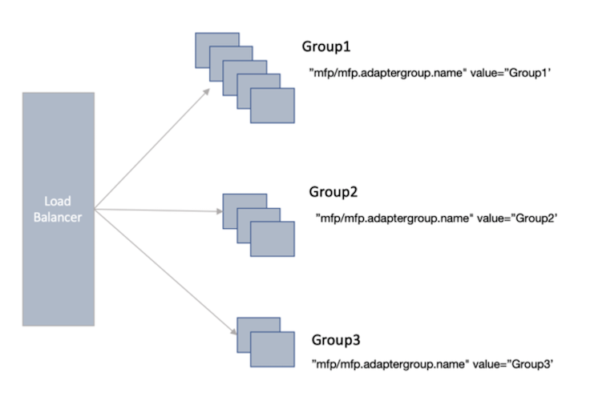

<!-- NLS_CHARSET=UTF-8 -->
## Visión general
{: #overview }
Los adaptadores de Mobile Foundation ejecutan la lógica del extremo del servidor y la transferencia o recuperación desde los sistemas de fondo. Los adaptadores se despliegan en todas las instancias de tiempo de ejecución de Mobile Foundation, los adaptadores consumen recursos del sistema independientemente de su uso. En una situación en la que la aplicación móvil utiliza algunos adaptadores con poca frecuencia, no existe ningún modo de escalar la instancia de Mobile Foundation con los adaptadores utilizados frecuentemente. Si se escala el entorno, se despliegan y ejecutan todos los adaptadores en todos los nodos añadidos recientemente. Este comportamiento hace que el arranque de la instancia de Mobile Foundation sea lento, ya que el tiempo de ejecución ha de desplegar y ejecutar todos los adaptadores. 

La función de agrupación de adaptadores le permite agrupar un grupo de adaptadores de recursos y ejecutarlos conjuntamente en un conjunto de datos de Mobile Foundation. Este conjunto de nodos se denomina un **grupo**. El grupo se puede escalar añadiendo más nodos, en función de la carga del adaptador. Los clientes deciden previamente el número de nodos de cada grupo, en función de la carga prevista que llega a los adaptadores que se ejecutan en este grupo. 

>La agrupación de adaptadores solo está soportada para los adaptadores de recursos y no para los adaptadores de comprobación de seguridad. 

### Configuración 
{: #configuration }

Un grupo de una agrupación de adaptadores es una colección de nodos de Mobile Foundation para ejecutar un grupo de adaptadores de recursos en él.
Por ejemplo, en una topología de granja con 10 nodos, los clientes pueden crear tres grupos, el Grupo 1 con 5 nodos (nodo 1, nodo 2, nodo 3, nodo 4, nodo 5), el Grupo 2 con 3 nodos (nodo 6, nodo 7, nodo 8) y el Grupo 3 con 2 nodos (nodo 9, nodo 10).

En una topología WAS (WebSphere Application Server) ND, para la agrupación de adaptadores, los clientes pueden crear clústeres WAS ND para correlacionar los grupos de la agrupación de adaptadores.
La sección siguiente describe cómo poner en funcionamiento la agrupación de adaptadores con Mobile Foundation definiendo una configuración de grupo de adaptadores y haciendo que los nodos formen parte de un grupo de adaptadores.
Se deben aplicar dos cambios de configuración a Mobile Foundation para que funcione la agrupación de adaptadores.

### Definir y desplegar la configuración de grupos de adaptadores 
{: #deploy-adapter-group-config }

La configuración de grupos de adaptadores define grupos y adaptadores de recursos que pertenecen al grupo. La configuración de grupos de adaptadores tiene la estructura siguiente y se debe desplegar utilizando la API de administración.

```json
{
  "groups": [
    {
      "id": "finance",
      "adapters": [
        {
          "name": "SavingAccountAdapter"
        },
        {
          "name": "LoanProcessingAdapter"
        }
      ]
    },
    {
      "id": "hr",
      "adapters": [
        {
          "name": "EmployeeInfoAdapter"
        },
        {
          "name": "OnboardingAdapter"
        }
      ]
    }
  ]
}
```

La configuración de arriba define los grupos y los adaptadores que deben formar parte de estos grupos. El nombre del grupo de adaptadores es el valor relacionado con la clave `id`. La clave `adapters` contiene un valor que es una lista de los adaptadores de recursos que se desplegarán en los grupos respectivos.
A continuación se listan las API de administración disponibles para la configuración del grupo de adaptadores.

#### Desplegar la configuración de adaptadores 
Para desplegar una configuración de grupo de adaptadores, utilice la API de administración de Mobile Foundation y proporcione los parámetros de configuración que se han descrito arriba como un carga útil json. 

**POST** `http://<host>:<port>/mfpadmin/management-apis/2.0/runtimes/<runtime>/adapterGroupConfig`

Por ejemplo, 

```bash
curl -X POST --user admin:admin --header 'Content-Type: application/json' -- header 'Accept: application/json' -d '{ "groups": [{ "id": "finance", "adapters":
[ {"name": "SavingAccountAdapter" }, {"name": "LoanProcessingAdapter"}] },{"id": "hr", "adapters": [ {"name": "EmployeeInfoAdapter"}, {"name": "OnboardingAdapter"}]}]}' "http://<host>:<port>/mfpadmin/management apis/2.0/ runtimes/mfp/adapterGroupConfig"
```

#### Recuperar la configuración del grupo adaptadores 
Para obtener una configuración de grupo de adaptadores ya desplegada, utilice la siguiente API de administración de Mobile Foundation.

**GET** `http://<host>:<port>/mfpadmin/management-apis/2.0/runtimes/<runtime>/adapterGroupConfig`

Por ejemplo, 

```bash
curl -X GET --user admin:admin --header 'Content-Type: application/json' "http://<host>:<port>/mfpadmin/management-apis/2.0/runtimes/mfp/adapterGroupConfig"
```

#### Suprimir la configuración del grupo adaptadores 
Para suprimir una configuración de grupo de adaptadores ya desplegada, utilice la siguiente API de administración de Mobile Foundation.

**DELETE** `http://<host>:<port>/mfpadmin/management-apis/2.0/runtimes/<runtime>/adapterGroupConfig`

Por ejemplo, 

```bash
curl -X DELETE --user admin:admin --header 'Content-Type: application/json' "http://<host>:<port>/mfpadmin/management-apis/2.0/runtimes/mfp/adapterGroupConfig"
```

### Definir grupos para la agrupación de adaptadores 
{: #define-groups }

Después de definir y desplegar la configuración del grupo de adaptadores, el paso siguiente es crear grupos. Añada una propiedad JNDI de tiempo de ejecución denominada `mfp.adaptergroup.name` con un valor como el nombre de grupo, para que los nodos de Mobile Foundation formen parte de un grupo. 

Por ejemplo, 
```xml
<jndiEntry jndiName="mfp/mfp.adaptergroup.name" value="finance"/>
```

En una topología de granja, si añade la propiedad JNDI `mfp.adaptergroup.name` en el `server.xml` de un nodo de granja, este nodo pasa a formar parte del grupo mencionado en el JNDI. Si la propiedad JNDI anterior no se menciona para un nodo, se utiliza el comportamiento predeterminado, lo que significa que todos los adaptadores se despliegan en dicho nodo.

Si el Group1 consta de node1, node2, node3, node4 y node5, se debe modificar el `server.xml` en todos los nodos para añadir la propiedad JNDI con un valor `Group1`.

Por ejemplo, Group1 = [node 1, node 2, node 3, node 4, node 5]
```xml
<jndiEntry jndiName="mfp/mfp.adaptergroup.name" value=”Group1”/>
```

Se pueden definir otros grupos de forma similar. Para cada clúster WAS ND, se puede definir la propiedad JNDI para convertir este clúster en un grupo de la agrupación de adaptadores.

### Despliegue de adaptadores 
{: #adapter-deployment }

Después de desplegar la configuración del grupo de adaptadores y de definir los grupos, los despliegues de adaptadores de recursos siguientes seguirán las reglas mencionadas en la configuración del grupo de adaptadores. Si un adaptador está en la lista de adaptadores de un grupo, el adaptador solo se despliega en los nodos del grupo identificados por la propiedad JNDI `mfp.adaptergroup.name`. 

Algunos cambios, tal como mover un adaptador de un grupo a otro, para una instancia de Mobile Foundation que está en ejecución, requieren que se reinicie la instancia de Mobile Foundation en todos los grupos. No obstante, añadir un nuevo adaptador a la lista de adaptadores no requiere el reinicio de los nodos. 

### Cambios en las llamadas de adaptador 
{: #adapter-call-changes }

Para obtener las ventajas de la agrupación de adaptadores, es necesario cambiar las llamadas del adaptador del extremo del cliente para que incluya la información del grupo en el URI de solicitud de recursos. El URI tendrá el formato
`/adaptergroups/<groupname>/adapters/<adaptername>/<method>`.

Por ejemplo, 

```java
adapterPath = new URI(“/adaptergroups/finance/adapters/SavingAccountAdapter/getBalance”);
WLResourceRequest request = new WLResourceRequest(adapterPath, WLResourceRequest.GET);
```

Cuando se incluye la información del grupo de adaptadores en el URI se informa al equilibrador de carga (como se describe a continuación) que se debe direccionar la llamada a los adaptadores que se ejecutan en el grupo especificado. 

### Cambios del equilibrador de carga 
{: #load-balancer-changes }

Para que funcione la agrupación de adaptadores, los cambios principales necesarios están en el equilibrador de carga. Se debe configurar el equilibrador de carga para que direccione las llamadas del adaptador al grupo adecuado en función de los patrones de URI. 



El siguiente es un ejemplo de configuración del equilibrador de carga HAProxy para una topología de granja. En esta configuración, los nodos de granja *host1* y *host2* se configuran como parte de group1, los nodos de granja *host3* y *host4* se configuran como parte de *group2* y el nodo de granja *host5* es el host predeterminado. Cuando la solicitud de llamada del adaptador llega al HAProxy y si el url contiene *group1*, la llamada se direcciona a *host1* y *host2*. Si el url de la solicitud contiene *group2*, la llamada se direcciona a *host3* y *host4*. El resto de las solicitudes se direccionan a *host5*.
```
frontend localnodes
  bind *:81
  mode http
  acl is_group1 url_sub group1
  use_backend group1_server if is_group1
  acl is_group2 url_sub group2
  use_backend group2_server if is_group2
  default_backend nodes

backend group1_server
  mode http
  balance roundrobin
  option forwardfor
  http-request set-header X-Forwarded-Port %[dst_port]
  http-request add-header X-Forwarded-Proto https if { ssl_fc }
  option httpchk HEAD / HTTP/1.1\r\nHost:localhost
  server group1_server1 <host1>:<port> check
  server group1_server2 <host2>:<port> check

backend group2_server
  mode http
  balance roundrobin
  option forwardfor
  http-request set-header X-Forwarded-Port %[dst_port]
  http-request add-header X-Forwarded-Proto https if { ssl_fc }
  option httpchk HEAD / HTTP/1.1\r\nHost:localhost
  server group2_server1 <host3>:<port> check
  server group2_server2 <host4>:<port> check

backend nodes
  mode http
  balance roundrobin
  option forwardfor
  http-request set-header X-Forwarded-Port %[dst_port]
  http-request add-header X-Forwarded-Proto https if { ssl_fc }
  option httpchk HEAD / HTTP/1.1\r\nHost:localhost
  server default_server <host5>:<port> check

```
>**Nota**: La característica de agrupación de adaptadores no se habilita mediante la consola de Mobile Foundation. El despliegue de la configuración del grupo de adaptadores solo se puede realizar mediante las API del servicio de administración de Mobile Foundation.
