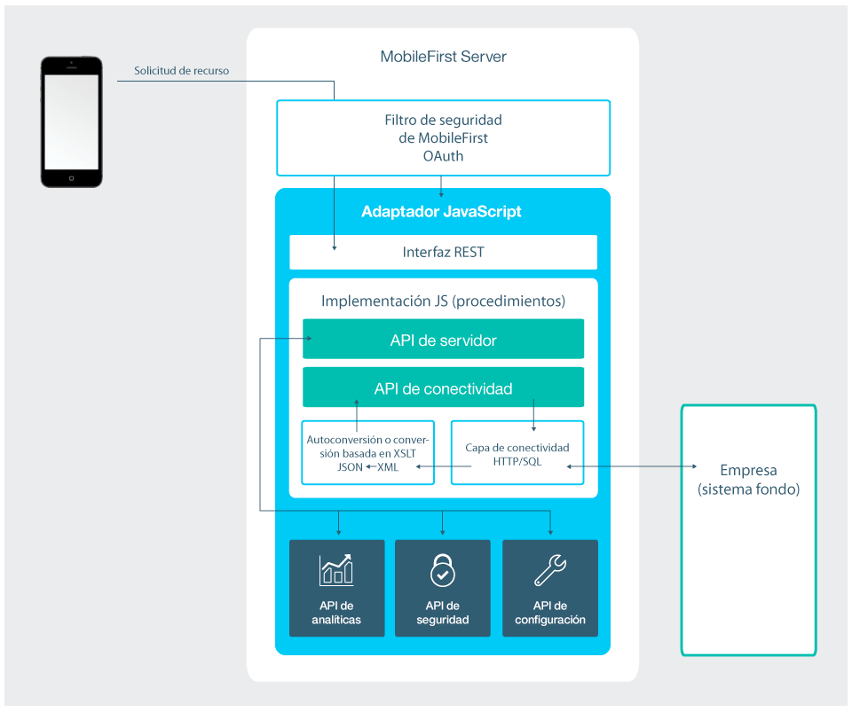
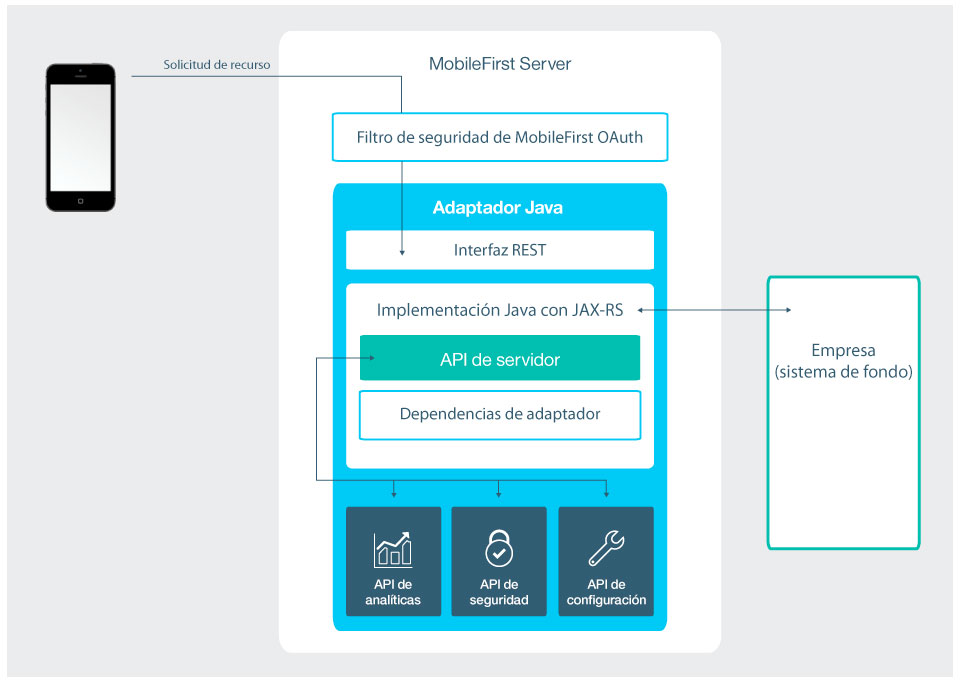

<!-- NLS_CHARSET=UTF-8 -->
## Visión general
{: #overview }
Los adaptadores son proyectos Maven que contienen código del lado del servidor implementado en Java o JavaScript.  
Los adaptadores se utilizan para realizar toda la lógica necesaria del lado del servidor y para transferir y recuperar información desde sistemas de fondo para los servicios de nube y las aplicaciones de cliente. 

Cada adaptador tiene su proprio recinto de pruebas aislado, que funciona independientemente de otros recintos ni se ve interrumpido por estos otros recintos. Dicho esto, sigue siendo posible que los adaptadores se comuniquen entre sí llamando a API hace posible un "[mashup de adaptadores](advanced-adapter-usage-mashup)".

Es posible incluir bibliotecas de terceros que el código del adaptador precise definiéndolas como dependencias Maven en el archivo **pom.xml** del adaptador. Para obtener más información, consulte la sección [Dependencias](creating-adapters/#dependencies) en la guía de aprendizaje [Creación de adaptadores Java y JavaScript](creating-adapters).

Los adaptadores también dan soporte a las necesidades de DevOps:

* Se pueden desplegar adaptadores de "despliegue en caliente", esto es, desplegarlos, retirarlos del despliegue y volverlos a desplegar en tiempo de ejecución. Esta capacidad ofrece una gran flexibilidad para procesos de desarrollo del lado del servidor.
* Un adaptador puede tener propiedades definidas por el usuario y se puede configurar mediante personal de administración, sin volver a desplegar el adaptador. Esta característica permite personalizar el comportamiento del adaptador para distintos entornos, por ejemplo, de desarrollo, pruebas y producción.

Continúe leyendo para obtener una visión general de los adaptadores Java y JavaScript. A continuación, siga las guías de aprendizaje en la navegación lateral para aprender a : crear, compilar, actualizar, desarrollar, probar y desplegar adaptadores Java y JavaScript, aprender a utilizar los entornos de desarrollo integrado (IDE) para el desarrollo de adaptadores, recopilar registros del lado del servidor, así como temas más avanzados como, por ejemplo, los relacionados con la integración de Cloudant y mashup de adaptadores.

### Ventajas del uso de adaptadores
{: #benefits-of-using-adapters }

#### Universalidad
{: #universality }

* Los adaptadores dan soporte a varias tecnologías de integración y a sistemas de información de fondo.

#### Funcionalidades transaccionales y de solo lectura
{: #read-only-and-transactional-capabilities }

* Los adaptadores dan soporte a modalidades de acceso transaccional y de solo lectura para los sistemas de fondo.

#### Desarrollo rápido
{: #fast-development }

* Los adaptadores utilizan una sintaxis XML simple y se configuran con facilidad con API de Java o API de JavaScript.

#### Seguridad
{: #security }

* Los adaptadores utilizan recursos de autenticación flexibles para crear conexiones con sistemas de fondo.
* Los adaptadores proporcionan control sobre la identidad del usuario conectado.

#### Transparencia
{: #transparency }

* Los datos que se recuperan de las aplicaciones de fondo se exponen de forma uniforme, independientemente del tipo de adaptador.  

### Ventajas específicas de los adaptadores Java
{: #benefits-specific-to-java-adapters }

* Posibilidad de un control completo de la estructura de los URL, los tipos de contenido, las cabeceras de solicitud y respuesta, el contenido y la codificación
* Posibilidad para probar el adaptador utilizando una herramienta de un tercero como, por ejemplo, Postman
* Desarrollo fácil y rápido para ejecutar una instancia de {{ site.data.keys.mf_server }} sin comprometer el rendimiento y sin periodos de inactividad
* Integración de seguridad con el modelo de seguridad de {{ site.data.keys.product }} sin que sea necesaria una personalización adicional, mediante la utilización de anotaciones simples en el código fuente

## Adaptadores de JavaScript
{: #javascript-adapters }

Los adaptadores de JavaScript proporcionan plantillas para la comunicación con sistemas de fondo SQL y HTTP. Estas plantillas contienen un conjunto de servicios denominados procedimientos. Las aplicaciones pueden llamar a estos procedimientos mediante solicitudes AJAX. El procedimiento recupera información de la aplicación de fondo y devuelve los datos a la aplicación. Mediante la utilización de una interfaz REST, podrá aprovechar de la [Infraestructura de seguridad basada en OAuth 2.0](../authentication-and-security) que {{ site.data.keys.product }} proporciona.

* Si el formato de los datos es JSON, {{ site.data.keys.mf_server }} no altera los datos. De lo contrario, {{ site.data.keys.mf_server }} los convierte de forma automática a JSON.  
* Como alternativa puede proporcionar una transformación XSL para convertir los datos a JSON. En este caso, el tipo de contenido devuelto del sistema de fondo debe ser XML. A continuación, se podrá utilizar XSLT para filtrar los datos en base a sus requisitos.
* Con un adaptador HTTP, puede enviar solicitudes GET o POST HTTP y recuperar datos del cuerpo y la cabecera de la respuesta. Los adaptadores HTTP funcionan con servicios basados en SOAP y RESTful, y pueden leer orígenes HTTP estructurados como, por ejemplo, canales de información RSS.
* Con un adaptador SQL, podrá comunicarse con cualquier origen de datos SQL. Utilice consultas SQL simples o procedimientos almacenados.

> * Aprenda a crear adaptadores en la guía de aprendizaje [Creación de adaptadores](creating-adapters).
> * Obtenga más información sobre los [Adaptadores JavaScript](javascript-adapters)

## Adaptadores Java
{: #java-adapters }

Los adaptadores Java se basan en la [Especificación JAX-RS 2.0](https://jax-rs-spec.java.net/nonav/2.0-rev-a/apidocs/index.html) y, por lo tanto, están escritos en Java exponiendo al cliente una API REST completa. En los adaptadores Java, es el desarrollador el quien define el contenido devuelto y su formato, así como la estructura de URL de cada recurso. La única excepción es cuando el cliente envía la solicitud soportando GZip, entonces la codificación del contenido devuelto del adaptador Java se comprime mediante GZip. Todas las operaciones del contenido devuelto las realiza y las posee el desarrollador.

El diagrama siguiente muestra cómo un dispositivo móvil pueden acceder a un adaptador Java desde su punto final REST. El filtro de seguridad OAuth de {{ site.data.keys.product }} protege la interfaz REST, lo que significa que el cliente necesita obtener una señal de acceso para acceder a los recursos del adaptador. Cada uno de los recursos del adaptador tiene su propio URL, de forma que es posible proteger los puntos finales de {{ site.data.keys.product }} utilizando un cortafuegos. La interfaz REST invoca al código JAVA (servicio JAX-RS) para manejar las solicitudes entrantes. El código Java puede realizar operaciones en el servidor mediante la API de {{ site.data.keys.mf_server }} Java. Además, el código Java puede conectarse al sistema empresarial para recuperar datos, actualizar datos o realizar cualquier otra operación que exponga el sistema empresarial.

> * Aprenda a crear adaptadores en la guía de aprendizaje [Creación de adaptadores](creating-adapters).
> * Obtenga más información sobre los [Adaptadores Java](java-adapters)

## Guías de aprendizaje con las que continuar
{: #tutorials-to-follow-next }
