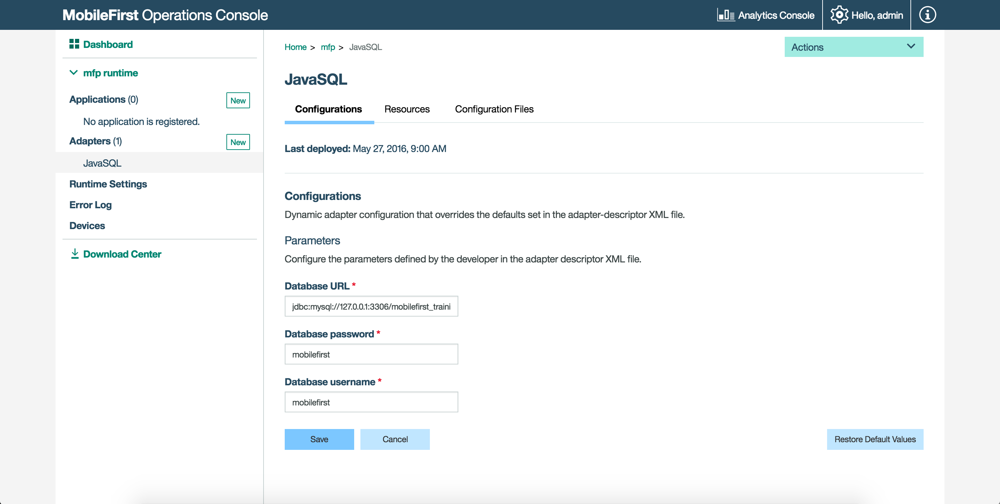

<!-- NLS_CHARSET=UTF-8 -->
## Visión general
{: #overview }

Los adaptadores Java se basan en la especificación JAX-RS 2.0. En otras palabras, un adaptador Java es un servicio JAX-RS 2.0 que se puede desplegar con facilidad en un instancia de {{ site.data.keys.mf_server }} y que tiene acceso a las API de {{ site.data.keys.mf_server }} así como a otras API de terceros.

**Requisito previo:** Asegúrese de leer primero la guía de aprendizaje [Creación de adaptadores Java y JavaScript](../creating-adapters).

#### Ir a
{: #jump-to }

* [Estructura de archivos](#file-structure)
* [Clase de aplicación JAX-RS 2.0](#jax-rs-20-application-class)
* [Implementación de un recurso JAX-RS 2.0](#implementing-a-jax-rs-20-resource)
* [Sesión HTTP](#http-session)
* [API del lado del servidor](#server-side-apis)

## Estructura de archivos
{: #file-structure }


### Carpeta adapter-resources  
{: #the-adapter-resources-folder }

La carpeta **adapter-resources** contiene un archivo de configuración XML (**adapter.xml**). En este archivo de configuración se configura el nombre de la clase de la aplicación JAX-RS 2.0 para este adaptador. Por ejemplo: `com.sample.JavaAdapterApplication`.

```xml
<?xml version="1.0" encoding="UTF-8"?>
<mfp:adapter name="JavaAdapter"
	xmlns:xsi="http://www.w3.org/2001/XMLSchema-instance"
	xmlns:mfp="http://www.ibm.com/mfp/integration"
	xmlns:http="http://www.ibm.com/mfp/integration/http">

	<displayName>JavaAdapter</displayName>
	<description>JavaAdapter</description>

	<JAXRSApplicationClass>com.sample.JavaAdapterApplication</JAXRSApplicationClass>

	<property name="DB_url" displayName="Database URL" defaultValue="jdbc:mysql://127.0.0.1:3306/mobilefirst_training"  />
	<property name="DB_username" displayName="Database username" defaultValue="mobilefirst"  />
	<property name="DB_password" displayName="Database password" defaultValue="mobilefirst"  />

	<securityCheckDefinition name="sample" class="com.sample.sampleSecurityCheck">
    	<property name="maxAttempts" defaultValue="3"/>
	</securityCheckDefinition>
</mfp:adapter>
```

<div class="panel-group accordion" id="terminology" role="tablist">
    <div class="panel panel-default">
        <div class="panel-heading" role="tab" id="adapter-xml">
            <h4 class="panel-title">
                <a class="preventScroll" role="button" data-toggle="collapse" data-parent="#adapter-xml" data-target="#collapse-adapter-xml" aria-expanded="false" aria-controls="collapse-adapter-xml"><b>Pulse para los subelementos y atributos de adapter.xml</b></a>
            </h4>
        </div>

        <div id="collapse-adapter-xml" class="panel-collapse collapse" role="tabpanel" aria-labelledby="adapter-xml">
            <div class="panel-body">
                <ul>
                    <li><b>name</b>: <i>Obligatorio.</i> Nombre del adaptador. Este nombre debe ser exclusivo dentro de {{ site.data.keys.mf_server }}. Puede contener caracteres alfanuméricos y subrayados, y debe comenzar con una letra. Después de definir y desplegar un adaptador, no puede modificar su nombre.</li>
					<li><b>displayName</b>: <i>Opcional.</i> Nombre del adaptador que se visualiza en {{ site.data.keys.mf_console }}. Si no se especifica este elemento, se utiliza en su lugar el valor del atributo name.</li>
					<li><b>description</b>: <i>Opcional.</i> Información adicional sobre el adaptador. Se visualiza en {{ site.data.keys.mf_console }}.</li>
					<li><b>JAXRSApplicationClass</b>: <i>Obligatorio para exponer un punto final de adaptador.
</i> Define el nombre de la clase de la aplicación JAX-RS de este adaptador. En el ejemplo, es <b>com.sample.JavaAdapterApplication</b>.</li>
					<li><b>securityCheckDefinition</b>: <i>Opcional.</i> Define un objeto de comprobación de seguridad. Obtenga más información sobre comprobaciones de seguridad en la guía de aprendizaje <a href="../../authentication-and-security/creating-a-security-check">Creación de comprobaciones de seguridad</a>.</li>
					<li><b>property</b>: <i>Opcional.</i> Declara una propiedad definida por el usuario. Obtenga más información a continuación en el tema de Propiedades personalizadas.</li>
                </ul>
				<br/>
                <a class="preventScroll" role="button" data-toggle="collapse" data-parent="#adapter-xml" data-target="#collapse-adapter-xml" aria-expanded="false" aria-controls="collapse-adapter-xml"><b>Sección de cierre</b></a>.
            </div>
        </div>
    </div>
</div>

#### Propiedades personalizadas
{: #custom-properties }

El archivo **adapter.xml** también puede contener propiedades personalizadas definidas por el usuario. Los valores que los desarrolladores les asignan durante la creación del adaptador se pueden modificar en el separador **{{ site.data.keys.mf_console }} → [su adaptador] → Configuraciones**, sin tener que volver a desplegar el adaptador. Las propiedades definidas por el usuario se pueden leer con la [interfaz ConfigurationAPI](#configuration-api) y, a continuación, personalizar adicionalmente en tiempo de ejecución.

> <span class="glyphicon glyphicon-info-sign" aria-hidden="true"></span> **Nota:**
Los elementos de propiedades de configuración se deben ubicar **bajo** el elemento `JAXRSApplicationClass`.  
En el ejemplo anterior hemos definido los valores de conexión y les hemos otorgado valores predeterminados, de forma que se puedan utilizar más tarde en la clase AdapterApplication.

El elemento `<property>` toma los siguientes atributos:

- **name**: Nombre de la propiedad, tal como se define en la clase de configuración.
- **defaultValue**: Modifica el valor predeterminado definido en la clase de configuración.
- **displayName**: *opcional*, nombre descriptivo a visualizar en la consola.
- **description**: *opcional*, descripción a visualizar en la consola.
- **type**: *opcional*, asegura que la propiedad es de un tipo específico como, por ejemplo, `integer`, `string`, `boolean` o una lista de valores válidos (por ejemplo `type="['1','2','3']"`).



#### Operaciones pull y push
{: #pull-and-push-configurations }

Las propiedades del adaptador personalizado se pueden compartir mediante el archivo de configuración que se encuentra en el separador de **Archivos de configuración**.  
Para ello, utilice los mandatos `pull` y `push` que se describen más abajo mediante Maven o mediante {{ site.data.keys.mf_cli }}. Para poder compartir las propiedades, es necesario *cambiar los valores predeterminados asignados a las propiedades*.

Ejecute los mandatos desde la carpeta raíz del proyecto Maven de adaptador:

**Maven**  

* Para hacer **pull** al archivo de configuraciones  
  ```bash
  mvn adapter:configpull -DmfpfConfigFile=config.json
  ```

* Para hacer **push** al archivo de configuraciones
  ```bash
  mvn adapter:configpush -DmfpfConfigFile=config.json
  ```

**{{ site.data.keys.mf_cli }}**  

* Para hacer **pull** al archivo de configuraciones
  ```bash
  mfpdev adapter pull
  ```

* Para hacer **push** al archivo de configuraciones
  ```bash
  mfpdev adapter push
  ```

#### Hacer push a configuraciones a varios servidores
{: #pushing-configurations-to-multiple-servers }

Los mandatos **pull** y **push** ayudan a crear varios flujos de DevOps, donde distintos valores son necesarios en los adaptadores según el entorno en que se encuentre (DEV, QA, UAT, PRODUCTION).

**Maven**  
Observe más arriba cómo de forma predeterminada especifica un archivo **config.json**. Cree archivos con nombre diferentes para dirigirse a distintos destinos.

**{{ site.data.keys.mf_cli }}**  
Utilice el distintivo **--configFile** o **-c** para especificar un archivo de configuración diferente que el predeterminado:

```bash
mfpdev adapter pull -c [adapterProject]/alternate_config.json
```

> Obtenga más información utilizando `mfpdev help adapter pull/push`.

### La carpeta java
{: #the-java-folder }

Los archivos fuente Java del servicio JAX-RS 2.0 se encuentran ubicados en esta carpeta. Los servicios JAX-RS 2.0 están formados por una clase de aplicación (que extiende `com.ibm.mfp.adapter.api.MFPJAXRSApplication`) y de clases de recurso.

Las clases de recursos y de aplicación JAX-RS 2.0 definen los métodos Java y sus correlaciones con URL.  
`com.sample.JavaAdapterApplication` es la clase de aplicación JAX-RS 2.0 y `com.sample.JavaAdapterResource` es una clase de recurso JAX-RS 2.0 incluida en la aplicación.

## Clase de aplicación JAX-RS 2.0
{: #jax-rs-20-application-class }

La clase de aplicación JAX-RS 2.0 indica a la infraestructura JAX-RS 2.0 los recursos incluidos en la aplicación.

```java
package com.sample.adapter;

import java.util.logging.Logger;
import com.ibm.mfp.adapter.api.MFPJAXRSApplication;

public class JavaAdapterApplication extends MFPJAXRSApplication{

    static Logger logger = Logger.getLogger(JavaAdapterApplication.class.getName());

    @Override
    protected void init() throws Exception {
        logger.info("Adapter initialized!");
    }

    @Override
    protected String getPackageToScan() {
        //The package of this class will be scanned (recursively) to find JAX-RS 2.0 resources.
        return getClass().getPackage().getName();
    }
}
```

La clase `MFPJAXRSApplication` explora en el paquete JAX-RS 2.0 recursos y crea de forma automática una lista. Además, {{ site.data.keys.mf_server }} llama a su método `init` tan pronto como se despliega el adaptador (antes de que empiece su servicio) y cuando arranca el tiempo de ejecución de {{ site.data.keys.product }}.

## Implementación de un recurso JAX-RS 2.0
{: #implementing-a-jax-rs-20-resource }

El recurso JAX-RS 2.0 es un POJO (Plain Old Java Object) que se correlaciona con un URL raíz y que tiene métodos Java para dar servicio a las solicitudes para este URL raíz y sus URL hijo. Los recursos pueden tener un conjunto independiente de URL.

```java
package com.sample.adapter;

import java.util.logging.Logger;

import javax.ws.rs.GET;
import javax.ws.rs.Path;
import javax.ws.rs.PathParam;

@Path("/")
public class JavaAdapterResource {

    //Define logger (Standard java.util.Logger)
    static Logger logger = Logger.getLogger(JavaAdapterResource.class.getName());

    //Path for method: "<server address>/Adapters/adapters/JavaAdapter/{username}"
    @GET
    @Path("/{username}")
    public String helloUser(@PathParam("username") String name){
        return "Hello " + name;
    }
}
```

* `@Path("/")` antes de la definición de la clase, determina la vía de acceso raíz de este recurso. Si tiene varias clases de recursos, debería asignar a cada recurso una vía de acceso distinta.  

	Por ejemplo, si tiene `UserResource` con `@Path("/users")` para gestionar usuarios de un blog, dicho recurso sería accesible a través de `http(s)://host:port/ProjectName/adapters/AdapterName/users/`.

	El mismo adaptador podría contener otro recurso `PostResource` con `@Path("/posts")` para gestionar los artículos que se publican en el blog. Sería accesible a través del URL `http(s)://host:port/ProjectName/adapters/AdapterName/posts/`.  

	En el ejemplo anterior, puesto que solo hay una clase de recurso, se establece en `@Path("/")` de forma que es accesible a través de `http(s)://host:port/Adapters/adapters/JavaAdapter/`.  

* Cata método viene precedido por una o varias anotaciones JAX-RS 2.0, por ejemplo una anotación del tipo "solicitud HTTP" como, por ejemplo, `@GET`, `@PUT`, `@POST`, `@DELETE` o `@HEAD`. Estas anotaciones definen la forma en la que se puede acceder al método.  

* Otro ejemplo es `@Path("/{username}")`, que define la vía de acceso a este procedimiento (además de la vía de acceso a nivel de recurso). Como puede ver, esta vía de acceso puede incluir una parte variable. Esta variable se utilizan entonces como un parámetro del método, tal como se define en `@PathParam("username") String name`.  

> Puede utilizar muchas otras anotaciones. Consulte aquí el **Resumen de tipos de anotación**:
[https://jax-rs-spec.java.net/nonav/2.0-rev-a/apidocs/javax/ws/rs/package-summary.html](https://jax-rs-spec.java.net/nonav/2.0-rev-a/apidocs/javax/ws/rs/package-summary.html)

>**Importante:** Cuando utiliza referencias estáticas a clases desde `javax.ws.rs.*` o `javax.servlet.*`, dentro de su implementación de adaptador, debería asegurarse de configurar **RuntimeDelegate** mediante una se las siguientes opciones:
*	Establecer `-Djavax.ws.rs.ext.RuntimeDelegate=org.apache.cxf.jaxrs.impl.RuntimeDelegateImpl` en las `jvm.options` de Liberty
O BIEN
*	Establecer la propiedad de sistema o propiedad personalizada JVM
`javax.ws.rs.ext.RuntimeDelegate=org.apache.cxf.jaxrs.impl.RuntimeDelegateImpl`


## Sesión HTTP
{: #http-session }

{{ site.data.keys.mf_server }} no se basa en sesiones HTTP y cada solicitud puede dirigirse a un nodo diferente. No se debería basar en sesiones HTTP para mantener datos desde una solicitud a la siguiente.

## API del lado del servidor
{: #server-side-apis}

Los adaptadores Java pueden utilizar API de Java del lado del servidor para realizar operaciones relacionadas con {{ site.data.keys.mf_server }} como, por ejemplo, llamar a otros adaptadores, crear registros de servidor, obtener valores de las propiedades de configuración, crear informes de actividades para las analíticas u obtener la identidad del emisor de solicitudes.  

### API de configuración
{: #configuration-api }

La clase `ConfigurationAPI` proporciona una API para recuperar propiedades definidas en **adapter.xml** o en {{ site.data.keys.mf_console }}.

Dentro de su clase Java, añada lo siguiente a nivel de clase:

```java
@Context
ConfigurationAPI configurationAPI;
```

A continuación puede utilizar la instancia `configurationAPI` para obtener propiedades:

```java
configurationAPI.getPropertyValue("DB_url");
```

Cuando se modifica la configuración del adaptador desde {{ site.data.keys.mf_console }}, se vuelve a cargar la clase de la aplicación JAX-RS y se llama de nuevo a su método `init`.

El método `getServerJNDIProperty` también se puede utilizar para recuperar una propiedad JNDI desde la configuración del servidor.

Puede ver ejemplos de uso en la guía de aprendizaje [Adaptador Java SQL](java-sql-adapter).

### API de adaptadores
{: #adapters-api }

La clase `AdaptersAPI` proporciona una API para recuperar información sobre el adaptador actual y enviar solicitudes REST a otros adaptadores.

Dentro de su clase Java, añada lo siguiente a nivel de clase:

```java
@Context
AdaptersAPI adaptersAPI;
```

`Puede ver ejemplos de uso en la guía de aprendizaje de [Mashup y utilización de adaptador avanzada](../advanced-adapter-usage-mashup).

### API de analíticas
{: #analytics-api }

La clase `AnalyticsAPI` proporciona una API para la creación de informes con información para las analíticas.

Dentro de su clase Java, añada lo siguiente a nivel de clase:

```java
@Context
AnalyticsAPI analyticsAPI;
```

Puede ver ejemplos de uso en la guía de aprendizaje de [API de analíticas](../../analytics/analytics-api).

### API de seguridad
{: #security-api }

La clase `AdapterSecurityContext` proporciona contexto de seguridad de una llama REST de adaptador.

Dentro de su clase Java, añada lo siguiente a nivel de clase:

```java
@Context
AdapterSecurityContext securityContext;
```

Puede entonces, por ejemplo, obtener el `AuthenticatedUser` actual mediante:

```java
AuthenticatedUser currentUser = securityContext.getAuthenticatedUser();
```

## Ejemplo de adaptador de Java
{: #java-adapter-examples }

Para obtener ejemplos de adaptadores Java que se comunican con un sistema de fondo SQL o HTTP, consulte:
