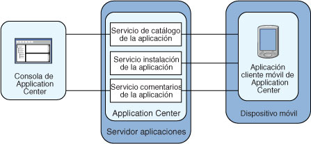

<!-- NLS_CHARSET=UTF-8 -->
## Visión general
{: #overview }
Obtenga más información sobre el {{ site.data.keys.mf_app_center_full }}: para qué es, los distintos componentes y características, y cómo utilizar la consola y el cliente.

Ahora, se venden más dispositivos móviles que sistemas personales. Por esta razón, las aplicaciones móviles se han convertido en algo fundamental para los negocios.  
Application Center es una herramienta para compartir aplicaciones móviles más fácilmente con una organización.

Puede utilizar Application Center como un almacén de aplicaciones de empresa. Con Application Center, puede dirigir algunas aplicaciones móviles a determinados grupos de usuarios de la empresa.

El equipo de desarrollo también puede utilizar Application Center durante la fase de desarrollo de una aplicación para compartir aplicaciones con los probadores, diseñadores o ejecutivos de la empresa. En este caso, es más fácil la colaboración entre las personas que están implicadas en el proceso de desarrollo.

> También puede consultar [la guía de aprendizaje de Application Center](app-center-tutorial).

#### Ir a
{: #jump-to }
* [Concepto de Application Center](#concept-of-application-center)
* [Requisitos específicos de la plataforma](#specific-platform-requirements)
* [Arquitectura general](#general-architecture)
* [Información preliminar](#preliminary-information)
* [A continuación](#whats-next)

## Concepto de Application Center
{: #concept-of-application-center }
Application Center se puede utilizar como un almacén de aplicaciones empresariales y es una forma de compartir información entre distintos miembros del equipo dentro de una empresa.

El concepto de Application Center es similar al concepto de la App Store pública de Apple o del Android Market, a excepción de que se dirige únicamente al uso privado dentro de una empresa.

Mediante Application Center, los usuarios de la misma empresa u organización descargan aplicaciones a teléfonos móviles o tabletas desde un único lugar que sirve como repositorio de aplicaciones móviles.

Application Center está destinado a aplicaciones móviles instaladas en el propio dispositivo. Dichas aplicaciones pueden ser nativas que se hayan creado utilizando el SDK del dispositivo o las aplicaciones híbridas que mezclan contenido nativo y web. Application Center no está destinado a aplicaciones web móviles; tales aplicaciones se entregan en el navegador web del dispositivo móvil mediante un URL como un sitio web.

En la versión actual, Application Center admite aplicaciones creadas para las plataformas Google Android, Apple iOS, Windows Phone 8, y la plataforma Windows 8.

Para Windows Phone, sólo se admite en este momento el formato de archivo del paquete de aplicaciones de Windows Phone (.xap), no el formato de archivos del paquete de aplicaciones (.appx) (formato de aplicaciones universales). Para Windows Store (aplicaciones de escritorio), se admite el formato de archivo del paquete de aplicaciones (.appx).

Windows Phone 7 y Windows RT, y BlackBerry OS no están admitidos por la versión actual del Application Center.

Application Center gestiona aplicaciones móviles. Admite cualquier tipo de aplicaciones de Android, iOS, Windows Phone 8, o Windows 8, incluidas aplicaciones creadas encima del {{ site.data.keys.product }}.

Puede utilizar Application Center como parte del proceso de desarrollo de una aplicación. Un escenario típico de Application Center es un equipo que crea una aplicación móvil; el equipo de desarrollo crea una versión nueva de una aplicación de Android, iOS, Windows Phone, o Windows 8. El equipo de desarrollo desea que el equipo ampliado revise y pruebe esta versión nueva. Un desarrollador va a la consola de Application Center y carga la versión nueva de la aplicación en Application Center. Como parte de este proceso, el desarrollador puede especificar una descripción de la versión de la aplicación. Por ejemplo, la descripción podría mencionar los elementos que el equipo de desarrollo ha añadido o solucionado desde la versión anterior. La nueva versión de la aplicación estará entonces disponible para el resto de los miembros del equipo.

Otra persona, como un probador beta, puede iniciar la aplicación del instalador del Application Center, el cliente móvil, para ubicar esta nueva versión de una aplicación móvil en la lista de aplicaciones disponibles e instalarla en su dispositivo móvil. Después de probar la versión nueva, el probador beta puede puntuar la aplicación y enviar comentarios. Los comentarios estarán visibles para el desarrollador desde la consola de Application Center.

Application Center es una forma conveniente de compartir aplicaciones móviles dentro de una empresa o un grupo. Es una forma de compartir información entre los miembros del equipo.

## Requisitos específicos de la plataforma
{: #specific-platform-requirements }
Los distintos sistemas operativos imponen requisitos específicos para desplegar, instalar o utilizar aplicaciones en los dispositivos móviles adecuados.

### Android
{: #android }
El dispositivo móvil debe estar configurado para la instalación desde fuentes desconocidas. El conmutador correspondiente se puede encontrar en la Configuración de Android. Consulte [Opt-in de los usuarios para aplicaciones desde fuentes desconocidas para obtener detalles](http://developer.android.com/distribute/open.html#unknown-sources).  

En Application Center, las aplicaciones tienen un número de versión interno y uno comercial. El número de versión interno se utiliza para distinguir qué versión es más reciente, mientras que la versión comercial sólo se utiliza como una serie de visualización informativa. Para aplicaciones Android, la versión interna es el [versionCode](http://developer.android.com/guide/topics/manifest/manifest-element.html#vcode) de Android desde el manifiesto de aplicación, y debe ser un entero.

### iOS
{: #ios }
Todas las aplicaciones que se gestionan mediante Application Center se deben empaquetar para "Ad Hoc Distribution". Con una cuenta de desarrollador de iOS, puede compartir su aplicación con un máximo de 100 dispositivos de iOS. Con una cuenta de empresa de iOS, puede compartir su aplicación interna con un número ilimitado de dispositivos de iOS. Consulte [iOS Developer Program](https://developer.apple.com/programs/ios/distribute.html) e [iOS Enterprise Program](https://developer.apple.com/programs/ios/enterprise/) para obtener detalles.
En Application Center, las aplicaciones tienen un número de versión interno y uno comercial. El número de versión interno se utiliza para distinguir qué versión es más reciente, mientras que la versión comercial sólo se utiliza como una serie de visualización informativa. Para aplicaciones iOS, la versión interna es la CFBundleVersion del **Info.plist** del manifiesto de aplicación. El número de versión debe tener el formato siguiente: `a`, o `a.b`, o `a.b.c`, donde `a`, `b`, `c` son enteros no negativos, y `a` no es `0`.

### Windows Phone 8
{: #windows-phone-8 }
Las aplicaciones no están instaladas desde Windows Store, sino desde Application Center, que actúa como lo que la documentación de Microsoft llama un **Hub de empresa**. Consulte [Distribución de aplicaciones de la empresa para Windows Phone](http://msdn.microsoft.com/en-us/library/windowsphone/develop/jj206943%28v=vs.105%29.aspx) para obtener detalles.
Para utilizar un hub de empresa, Windows Phone requiere que registre una cuenta de empresa con Microsoft y que firme todas las aplicaciones, incluido el cliente de Application Center, con el certificado de empresa. Sólo se pueden gestionar las aplicaciones firmadas mediante Application Center.

Debe inscribirse en todos los dispositivos móviles mediante una señal de inscripción de aplicación asociada con su cuenta de empresa.

Application Center le ayuda a inscribir dispositivos mediante recursos para distribuir la señal de inscripción de aplicación. [Consulte Señales de inscripción de aplicación en Windows 8 Universal para obtener más detalles](appcenter-console/#application-enrollment-tokens-in-windows-8-universal).

Application Center da soporte a la distribución de aplicaciones como archivos de paquete de aplicaciones de Windows Phone (.xap) para Microsoft Windows Phone 8.0 y Microsoft Windows Phone 8.1. Con Microsoft Windows Phone 8.1, Microsoft presentó un nuevo formato universal de archivos de paquete de aplicaciones (.appx) para Windows Phone. En este momento, Application Center no da soporte a la distribución de los archivos de paquete de aplicaciones (.appx) para Microsoft Windows Phone 8.1, sino que se limita sólo a los archivos de paquete de aplicaciones de Windows Phone (.xap).

En Application Center, las aplicaciones sólo tienen un número de versión. El número de versión se utiliza para distinguir qué versión es más reciente. Para aplicaciones de Windows Phone 8, el número de versión se encuentra en el campo **Versión** del archivo **WMAppManifest.xml**. Este número de versión debe tener el formato siguiente: `a.b.c.d`, donde `a`, `b`, `c`, `d` son enteros no negativos.

### Windows 8
{: #windows-8 }
El cliente móvil de Application Center se proporciona como un archivo ejecutable de escritorio normal (.exe). Utilícelo para instalar en las aplicaciones de Windows Store del dispositivo, que están empaquetadas como archivos .appx.
La instalación de un archivo de tipo appx en el dispositivo sin utilizar Windows Store se denomina instalación de prueba de una aplicación. Para realizar una instalación de prueba de una aplicación, debe cumplir con los requisitos previos de [Prepararse para realizar una instalación de prueba de aplicaciones](http://technet.microsoft.com/fr-fr/library/dn613842.aspx). La actualización de Windows 8.1 simplifica los requisitos previos para realizar una instalación de prueba. Para obtener más información, consulte [Instalación de prueba de aplicaciones del almacén en dispositivos Windows 8.1](http://blogs.msdn.com/b/micham/archive/2014/05/30/sideloading-store-apps-to-windows-8-1-devices.aspx).

Los archivos de tipo .exe no se pueden ejecutar en tabletas basadas en ARM, por lo que Application Center no da soporte a Windows RT; sólo están soportados Windows 8 y Windows 8.1.

El usuario del dispositivo necesita derechos de administrador en el dispositivo para ejecutar el cliente de Application Center.

Application Center no proporciona ninguna forma predefinida de distribuir el cliente móvil.

En Application Center, las aplicaciones sólo tienen un número de versión. El número de versión se utiliza para distinguir qué versión es más reciente. Para aplicaciones de Windows 8, el número de versión se encuentra en el campo Versión del archivo AppxManifest.xml. Este número de versión debe tener el formato siguiente: a.b.c.d, donde a, b, c, d son enteros no negativos.

## Arquitectura general
{: #general-architecture }
Application Center está formado por estos elementos principales: un componente de lado del servidor, un repositorio, una consola de administración y una aplicación de cliente móvil.

### Componente del lado del servidor
{: #server-side-component }
El componente de lado del servidor es una aplicación de Java Enterprise que debe desplegarse en un servidor de aplicaciones web como por ejemplo IBM WebSphere o Apache Tomcat.

El componente de lado del servidor consta de una consola de administración y de una aplicación móvil. Esta aplicación móvil instala las aplicaciones móviles disponibles en el componente del lado del cliente.

La consola web y la aplicación del instalador se comunican mediante servicios REST con el componente de servidor.

El componente de lado del servidor de Application Center está formado por varios servicios; por ejemplo, un servicio que lista aplicaciones disponibles, un servicio que proporciona los archivos binarios de la aplicación al dispositivo móvil, o un servicio que registra comentarios y puntuaciones.

### Repositorio
{: #repository }
Una base de datos que almacena información como por ejemplo qué aplicación está instalada en qué dispositivo, los comentarios sobre aplicaciones, y los archivos binarios de la aplicación móvil. La aplicación Application Center está asociada con la base de datos al configurar el Application Center para un servidor de aplicaciones web concreto y una base de datos soportada.

### Consola de administración
{: #administration-console }
Una consola web mediante la que los administradores pueden gestionar aplicaciones, derechos de acceso de usuarios para instalar aplicaciones, comentarios de usuarios sobre aplicaciones móviles y detalles sobre aplicaciones instaladas en dispositivos. Consulte la [consola de Application Center](appcenter-console).

### Aplicación del cliente móvil
{: #mobile-client-application }
Utilice el cliente móvil para instalar aplicaciones en un dispositivo móvil y para enviar comentarios sobre una aplicación al servidor. Consulte el [cliente móvil](mobile-client).

La figura siguiente muestra una visión general de la arquitectura.



Desde la consola de Application Center, puede realizar las acciones siguientes:

* Subir versiones distintas de aplicaciones móviles.
* Eliminar aplicaciones no deseadas.
* Controlar el acceso a las aplicaciones: Cada aplicación está asociada con la lista de personas que pueden instalar la aplicación.
* Ver comentarios que los usuarios móviles han enviado sobre una aplicación.
* Obtener información sobre aplicaciones instaladas en un dispositivo.
* Hacer que una aplicación esté inactiva para que no sea visible en las aplicaciones disponibles para su descarga.

Desde el cliente móvil, puede realizar las acciones siguientes:

* Listar las aplicaciones móviles disponibles.
* Instalar una aplicación nueva en un dispositivo.
* Enviar comentarios sobre una aplicación.

Application Center da soporte a aplicaciones para dispositivos Android, iOS, Windows Phone 8 y Windows 8. Por lo tanto, el cliente móvil se proporciona en versiones independientes para Android, iOS, Windows Phone 8 y Windows 8.

Los clientes móviles de Android, iOS, y Windows Phone 8 están creados en el {{ site.data.keys.product }}. Para obtener más información sobre cómo configurar el componente de lado del servidor de Application Center en varios servidores de aplicaciones de Java una vez que el producto haya instalado y creado aplicaciones de {{ site.data.keys.product_adj }} para el cliente de Application Center, consulte [Configuración de Application Center tras la instalación](../installation-configuration/production/appcenter).

## Información preliminar
{: #preliminary-information }
Para utilizar Application Center, debe configurar valores de seguridad, iniciar el servidor de aplicaciones web donde esté instalado {{ site.data.keys.product }}, iniciar la consola de Application Center e iniciar sesión.

Cuando instale {{ site.data.keys.product }}, se instalará automáticamente Application Center en el servidor de aplicaciones especificado.

Si instala el Application Center en el perfil de Liberty de WebSphere Application Server, el servidor se creará en **installation-directory/server**.

Una vez que termine la instalación, debe configurar los valores de seguridad para las aplicaciones. Consulte [Configuración de la autenticación de usuario para Application Center](../installation-configuration/production/appcenter#configuring-user-authentication-for-application-center) o, si está utilizando la autenticación LDAP, [Gestión de usuarios con LDAP](../installation-configuration/production/appcenter/#managing-users-with-ldap).

### Ejemplo: inicio del servidor y de la consola de Application Center en el perfil de Liberty
{: #example-starting-the-server-and-the-application-center-console-on-liberty-profile}

1. Inicie el servidor Liberty utilizando el mandato **server** que se encuentra en **installation-directory/server/wlp/bin directory**.

   ```bash
   server start worklightServer
   ```
    
2. Cuando el servidor esté en ejecución, inicie la consola de Application Center especificando esta dirección en su navegador: `http://localhost:9080/appcenterconsole/`
3. Inicie sesión. De forma predeterminada, hay definidos dos usuarios para la instalación del Application Center en Apache Tomcat o en el perfil Liberty de WebSphere Application Server:
    * **demo** con la contraseña **demo**
    * **appcenteradmin** con la contraseña **admin**

### Para obtener más información
{: #for-more-information }
Para utilizar la consola de Application Center, consulte la [consola de Application Center](appcenter-console).

Para instalar y ejecutar el cliente móvil en los sistemas operativos siguientes, consulte:

* Android: Consulte [Instalación del cliente en un dispositivo móvil Android](mobile-client/#installing-an-application-on-an-android-device).
* Sistema operativo iOS: Consulte [Instalación del cliente en un dispositivo móvil iOS](mobile-client/#installing-an-application-on-an-ios-device).
* Windows Phone 8: Consulte [Instalación del cliente en Windows 8 Universal](mobile-client/#installing-the-client-on-a-windows-phone-8-universal-mobile-device).
* Windows 8: El cliente móvil para Windows 8 no está pensado para desplegarse en Application Center para su posterior distribución. Consulte [Microsoft Windows 8: Creación del proyecto](preparations/#microsoft-windows-8-building-the-project).

## A continuación
{: #whats-next }
Siga estos temas para utilizar el cliente móvil de appcenter; envíe notificaciones a las aplicaciones instaladas; obtenga más información sobre la consola de appcenter, la herramienta de línea de mandatos, el cliente móvil; y el establecimiento de los niveles de registro.


