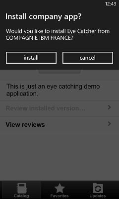
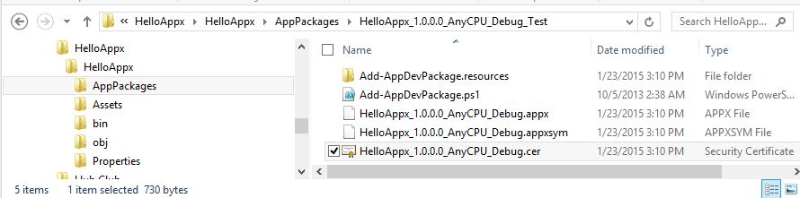

<!-- NLS_CHARSET=UTF-8 -->
## Visión general
{: #overview }
Puede instalar aplicaciones en el dispositivo móvil con el cliente móvil de Application Center.

El cliente móvil de Application Center es la aplicación que se ejecuta en el dispositivo Android, iOS, Windows Phone, o Windows. Sólo Windows Phone 8 está soportado por la versión actual del Application Center. Utilice el cliente móvil para listar el catálogo de aplicaciones disponibles en el Application Center. Puede instalar estas aplicaciones en el dispositivo. Se hace a veces referencia al cliente móvil como el instalador de Application Center. Esta aplicación debe estar presente en el dispositivo si desea instalar en el dispositivo aplicaciones desde el repositorio de aplicaciones privado.

### Requisitos previos
{: #prerequisites }
El administrador del sistema debe darle un nombre de usuario y una contraseña antes de descargar e instalar el cliente móvil. Son necesarios el nombre de usuario y la contraseña siempre que inicie el cliente móvil en el dispositivo. Para aplicaciones de Windows Store, el nombre de usuario y la contraseña son necesarios para el cliente móvil sólo en el tiempo de ejecución. Por motivos de seguridad, no difunda estas credenciales. Las credenciales son las mismas que se utilizan para iniciar sesión en la consola de Application Center.

#### Ir a
{: #jump-to }
* [Instalación del cliente en un dispositivo móvil Android](#installing-the-client-on-an-android-mobile-device)
* [Instalación del cliente en un dispositivo móvil iOS](#installing-the-client-on-an-ios-mobile-device)
* [Instalación del cliente en un dispositivo móvil Windows Phone 8 Universal](#installing-the-client-on-a-windows-phone-8-universal-mobile-device)
* [Instalación del cliente Windows 10 UWP en un dispositivo Windows 10 ](#installing-windows-10-uwp-client-on-windows-10-device)
* [Instalación de una aplicación Windows 10 UWP y adición de comentarios de opinión](#installing-a-windows-10-uwp-application-and-adding-review-comments)
* [La vista Inicio de sesión](#the-login-view)
* [Vistas en el cliente de Application Center](#views-in-the-application-center-client)
* [Instalación de una aplicación en un dispositivo Android](#installing-an-application-on-an-android-device)
* [Instalación de una aplicación en un dispositivo iOS](#installing-an-application-on-an-ios-device)
* [Instalación de una aplicación en un dispositivo Windows Phone](#installing-an-application-on-a-windows-phone-device)
* [Instalación de una aplicación Windows Store en un dispositivo Windows](#installing-a-windows-store-application-on-a-windows-device)
* [Instalación de aplicaciones a través de almacenamientos de aplicaciones públicas](#installing-applications-through-public-app-stores)
* [Eliminación de una aplicación instalada](#removing-an-installed-application)
* [Mostrar detalles de una versión de aplicación específica](#showing-details-of-a-specific-application-version)
* [Actualización de una aplicación](#updating-an-application)
* [Actualización del cliente de Application Center automáticamente](#upgrading-the-application-center-client-automatically)
* [Reversión de una aplicación instalada](#reverting-an-installed-application)
* [Marcación o desmarcación de una aplicación favorita](#marking-or-unmarking-a-favorite-app)
* [Envío de una opinión para una aplicación instalada](#submitting-a-review-for-an-installed-application)
* [Visualización de opiniones](#viewing-reviews)

## Instalación del cliente en un dispositivo móvil Android
{: #installing-the-client-on-an-android-mobile-device }
Puede instalar el cliente móvil, o cualquier aplicación firmada marcada con el indicador de programa de instalación, en el dispositivo móvil Android especificando el URL de acceso en el navegador, especificando las credenciales, y completando los pasos necesarios.

1. Inicie el navegador en el dispositivo móvil.
2. Especifique la siguiente URL de acceso en el campo de texto de dirección: `http://hostname:portnumber/applicationcenter/installers.html`

    Donde hostname es la dirección del servidor y portnumber es el número de puerto donde está instalado el Application Center. El administrador del sistema puede proporcionar esta información.

    Application Center también proporciona una URL alternativa para instalar el cliente en un dispositivo móvil: `http://hostname:portnumber/applicationcenter/inst.html`. La página de esta URL funciona mejor con algunos navegadores web para móvil más antiguos o algunos no estándares. Si la página installers.html no funciona en el dispositivo móvil, puede utilizar inst.html. Esta página sólo se proporciona en inglés y no está traducida en ningún otro idioma.

    Si intenta abrir la página con HTTPS y utiliza certificados autofirmados, los navegadores Android más antiguos no podrán abrir la página. En este caso, debe utilizar un certificado no autofirmado o utilizar otro navegador en el dispositivo Android, como Firefox, Chrome, u Opera. En Android 4 y posterior, el navegador Android muestra una advertencia de seguridad sobre el certificado SSL, pero le permite continuar hasta el sitio web tras la confirmación de que da su consentimiento a una conexión no segura.

3. Escriba el nombre de usuario y la contraseña. Cuando su nombre de usuario y contraseña estén validados, se mostrará la lista de aplicaciones de programa de instalación compatibles para el dispositivo en el navegador. Normalmente, sólo una aplicación, el cliente móvil, aparecerá en esta lista.

4. Si el servidor web utiliza un certificado de autoridad emisora de certificados autofirmado, instale el certificado al menos una vez en el dispositivo. El administrador del Application Center debe proporcionar el certificado; consulte [Gestión e instalación de los certificados de autoridad emisora de certificados autofirmados en un entorno de pruebas de Application Center](../../installation-configuration/production/appcenter/#managing-and-installing-self-signed-ca-certificates-in-an-application-center-test-environment) para obtener más detalles.
    * Toque el separador **Certificado SSL** y seleccione el certificado.
    * Toque **Instalar**. Sólo debe realizar esta acción una vez para el dispositivo. Puede verificar si el certificado está instalado buscando en **Configuración → Seguridad → Credenciales de confianza → Usuario del dispositivo**. Esta vista muestra los certificados SSL que el usuario ha instalado en el dispositivo. Si el certificado de autoridad emisora de certificados autofirmado no está instalado en el dispositivo, el sistema operativo Android le impedirá descargar el cliente móvil en los pasos siguientes.

    Para poder ver el cliente móvil en la lista de aplicaciones disponibles, el administrador del Application Center debe instalar la aplicación del cliente móvil. El administrador carga el cliente móvil en el Application Center y establece la propiedad **Instalador** en **true**. Consulte [Propiedades de aplicación](../appcenter-console/#application-properties).

    

5. Seleccione un elemento de la lista para mostrar los detalles de la aplicación. Normalmente, estos detalles incluyen el nombre de aplicación y su número de versión.

    

6. Toque **Instalar ahora** para descargar el cliente móvil. En dispositivos Android más recientes, es posible que obtenga una pregunta para solicitar permiso para que Chrome acceda archivos multimedia en el dispositivo. Seleccione SÍ. Puede que se muestre una advertencia sobre archivos potencialmente peligrosos. Seleccione la opción para conservar el archivo APK de todas formas.

7. Inicie la aplicación **Android Download**. Seleccione el instalador de cliente de Application Center.
8. Seleccione el instalador de cliente de Application Center. Podrá ver el acceso concedido a la aplicación cuando seleccione instalarla.

    

9. Seleccione **Instalar** para instalar el cliente móvil.
10. Cuando la aplicación esté instalada, seleccione **Abrir** para abrir el cliente móvil o **Listo** para cerrar la aplicación Downloads.

Es posible que el archivo APK falle por uno de los siguientes motivos:

* El dispositivo no tiene suficiente memoria libre.
* El dispositivo desconoce el certificado SSL del servidor.

La primera vez que instale una aplicación mediante la aplicación Downloads, es posible que reciba una solicitud para confirmar si Google debería comprobar regularmente la actividad del dispositivo en busca de problemas de seguridad. Puede aceptar o rechazar según lo prefiera. El cliente de Application Center no se verá afectado por su elección.

La instalación se podría bloquear por uno de los motivos siguientes:

* El dispositivo no permite la instalación de fuentes desconocidas. Vaya a **Configuración → Seguridad** en el dispositivo y habilite **Fuentes desconocidas (Permitir la instalación desde fuentes desconocidas)**.
* El dispositivo tiene la misma aplicación ya instalada, pero no la ha firmado un certificado distinto. En este caso, debe eliminar la aplicación para poder instalarla en el dispositivo con otro certificado firmado.

## Instalación del cliente en un dispositivo móvil iOS
{: #installing-the-client-on-an-ios-mobile-device }
Puede instalar el cliente móvil, o cualquier aplicación firmada marcada con el indicador de programa de instalación, en el dispositivo móvil iOS especificando el URL de acceso en el navegador, especificando las credenciales, y completando los pasos necesarios.

> **Importante:** Para instalar aplicaciones en dispositivos iOS, primero debe configurar el servidor de Application Center con SSL. Consulte [Configuración de Secure Sockets Layer (SSL)](../../installation-configuration/production/appcenter/#configuring-secure-sockets-layer-ssl).

La propiedad JNDI **ibm.appcenter.ios.plist.onetimeurl** del IBM Application Center Services controla si se utilizan URL de un solo uso cuando el cliente móvil esté instalado en un dispositivo móvil iOS. Establezca esta propiedad en false para obtener máxima seguridad. Cuando establezca esta propiedad en false, los usuarios deben especificar sus credenciales varias veces al instalar el cliente móvil: una vez al seleccionar el cliente y otra vez al instalarlo.

Al configurar la propiedad en true, los usuarios escribirán sus credenciales sólo una vez. Se generará una URL de descarga temporal con un hash criptográfico cuando el usuario escriba las credenciales. Esta URL de descarga temporal es válida para 1 hora y no necesita más autenticaciones. Esta solución es un compromiso entre seguridad y ergonomía.

Los pasos para especificar la propiedad JNDI **ibm.appcenter.ios.plist.onetimeurl** son similares a los pasos para la **propiedad ibm.appcenter.proxy.host**. Consulte [Definición del punto final de los recursos de aplicación](../../installation-configuration/production/appcenter/#defining-the-endpoint-of-the-application-resources).

La instalación del cliente móvil en un dispositivo iOS es similar a su instalación en Android, pero con algunas diferencias. El instalador se iniciará de forma automática directamente tras su descarga. Se solicitarán sus credenciales de nombre de usuario y de contraseña para casi todos los pasos de instalación.

1. Inicie el navegador en el dispositivo móvil.
2. Especifique la siguiente URL de acceso en el campo de dirección: `http://hostname:portnumber/applicationcenter/installers.html`

    Donde hostname es la dirección del servidor y portnumber es el número de puerto donde está instalado el Application Center. El administrador del sistema puede proporcionar esta información.

    Application Center también proporciona una URL alternativa para instalar el cliente en un dispositivo móvil: `http://hostname:portnumber/applicationcenter/inst.html`. La página de esta URL funciona mejor con algunos navegadores web para móvil más antiguos o algunos no estándares. Si la página **installers.html** no funciona en el dispositivo móvil, puede utilizar **inst.html**. La página sólo se proporciona en inglés y no está traducida en ningún otro idioma.

    Si abre la página con HTTPS y utiliza certificados autofirmados, el navegador mostrará una advertencia de seguridad sobre el certificado SSL, pero puede continuar hasta el sitio web tras la confirmación de que da su consentimiento a una conexión no segura.

3. Escriba el nombre de usuario y la contraseña. Consulte los [requisitos previos en El cliente móvil](../preparations).

    Cuando su nombre de usuario y contraseña estén validados, se mostrará la lista de aplicaciones de programa de instalación compatibles para el dispositivo en el navegador. Normalmente, sólo una aplicación, el cliente móvil, aparecerá en esta lista.

    Si abre la página con https:
    * Si el servidor web utiliza un certificado SSL real que proporciona una autoridad de certificado de confianza, siga hasta el paso 5.
    * Si el servidor web utiliza un certificado de autoridad emisora de certificados autofirmado, siga hasta el paso 4.

4. Si el servidor web utiliza un certificado de autoridad emisora de certificados autofirmado, instale el certificado al menos una vez en el dispositivo.

    El administrador de Application Center proporcionará el certificado. Consulte [Gestión e instalación de certificados de autoridades emisoras de certificados autofirmados en un entorno de pruebas de Application Center](../../installation-configuration/production/appcenter/#managing-and-installing-self-signed-ca-certificates-in-an-application-center-test-environment) para obtener más detalles.

    * Toque el separador Certificado SSL y seleccione el certificado.
    * Toque Instalar. Haga esto sólo una vez para el dispositivo. Puede verificar si el certificado está instalado mirando en **Configuración → General → Perfiles del dispositivo**. Esta vista muestra los certificados SSL que el usuario ha instalado en el dispositivo. Si el certificado de autoridad emisora de certificados autofirmado no está instalado en el dispositivo, el sistema operativo iOS le impedirá descargar el cliente móvil en los pasos siguientes.

    Para poder ver el cliente móvil en la lista de aplicaciones disponibles, el administrador del Application Center debe instalar la aplicación del cliente móvil. El administrador carga el cliente móvil en el Application Center y establece la propiedad Instalador en true. Consulte [Propiedades de aplicación](../appcenter-console/#application-properties).

5. Toque el separador **Instaladores** y seleccione un elemento de la lista para mostrar los detalles de la aplicación.
6. Toque **Instalar** para descargar el cliente móvil.
7. Escriba las credenciales para autorizar la transacción del descargador.
8. Para autorizar la descarga, toque **Instalar**.

    

9. Escriba las credenciales para autorizar la instalación.
10. Cierre el navegador.

    El icono de la aplicación aparecerá en la pantalla de inicio y podrá ver el progreso de la descarga en la pantalla de inicio.

> **Nota:** La instalación de una aplicación en un dispositivo necesita de un perfil de suministro que permita a la aplicación instalarse en el dispositivo seleccionado. Si intenta instalar por accidente una aplicación que no sea válida para el dispositivo, es posible que algunas versiones de iOS intenten instalar la aplicación en un bucle infinito sin conseguirlo ni indicar ningún error. El icono de aplicación que muestra el progreso de la instalación aparece en la pantalla de inicio pero, debido al bucle infinito, es difícil suprimir este icono de aplicación para detener el bucle infinito. Un método alternativo es colocar el dispositivo en Modo avión. En este modo, se detendrá el bucle infinito y podrá suprimir el icono de aplicación siguiendo los pasos normales para suprimir aplicaciones en dispositivos iOS.

La instalación se podría bloquear por uno de los motivos siguientes:

* El perfil de suministro de la aplicación no es válido para el dispositivo. La aplicación debe estar firmada con un perfil de suministro distinto.
* El dispositivo no tiene acceso a los servidores Apple para confirmar la validez del perfil de suministro.
* El dispositivo desconoce el certificado SSL del servidor.

En general, las aplicaciones iOS se pueden instalar en el dispositivo sólo si están firmadas con un perfil de suministro. Consulte [Importación y creación del proyecto (Android, iOS, Windows Phone)](../preparations/#importing-and-building-the-project-android-ios-windows-phone).

A partir de iOS 9, cuando se abre una aplicación de empresa, en función del tipo de perfil de suministro, es posible que se muestre un mensaje Untrusted Enterprise Developer. Este mensaje explica que todavía no se confía en el perfil de suministro en este dispositivo. En este caso, la aplicación no se abrirá, a menos que se establezca confianza para este perfil de suministro. El establecimiento de confianza sólo debe realizarse una vez por perfil de suministro.

Para establecer confianza para un perfil de suministro una vez que se instale la aplicación:

#### Hasta iOS 9.1
{: #until-ios-91 }
1. Vaya a **Configuración → General → Perfiles**. Bajo la cabecera **Aplicaciones de la empresa**, verá el perfil de suministro de la aplicación.
2. Toque en el perfil y confirme la confianza.

#### Desde iOS 9.2
{: #since-ios-92 }
1. Vaya a **Configuración → General → Perfiles → Gestión de dispositivos o Gestión de perfiles y dispositivos**. Bajo la cabecera **Aplicaciones de la empresa**, verá el perfil de suministro de la aplicación.
2. Toque en el perfil y confirme la confianza.

Una vez que se confirme la confianza, ninguna aplicación que utilice dicho perfil de suministro mostrará el mensaje Untrusted Enterprise Developer. Para obtener más información, consulte el sitio web de Apple en [https://support.apple.com/en-us/HT204460](https://support.apple.com/en-us/HT204460).

## Instalación del cliente en un dispositivo móvil Windows Phone 8 Universal
{: #installing-the-client-on-a-windows-phone-8-universal-mobile-device }
Puede instalar el cliente móvil, o cualquier aplicación firmada marcada con el indicador de programa de instalación, en Windows 8 Universal especificando la URL de acceso en el navegador, especificando las credenciales, y completando los pasos necesarios. Se debe preinstalar la cuenta de la empresa en el dispositivo móvil.

Para poder instalar aplicaciones publicadas por su empresa, debe añadir la cuenta de la empresa al dispositivo móvil. Debe descargar una señal de inscripción de aplicación (AET) en el dispositivo Windows Phone. Esta AET ya debe estar presente en el {{ site.data.keys.mf_server }}. Se carga en el {{ site.data.keys.mf_server }} mediante la consola de Application Center. Consulte [Señales de inscripción de aplicación en Windows 8 Universal](../appcenter-console/#application-enrollment-tokens-in-windows-8-universal) para obtener más detalles.

1. Inicie el navegador en el dispositivo móvil.
2. Especifique la siguiente URL de acceso en el campo de texto de dirección: `http://hostname:portnumber/applicationcenter/installers.html`.

    Donde **hostname** es la dirección del servidor y **portnumber** es el número de puerto donde está instalado el Application Center. El administrador del sistema puede proporcionar esta información.

    Application Center también proporciona una URL alternativa para instalar el cliente en un dispositivo móvil: `http://hostname:portnumber/applicationcenter/inst.html`. La página de esta URL funciona mejor con algunos navegadores web para móvil más antiguos o algunos no estándares. Si la página **installers.html** no funciona en el dispositivo móvil, puede utilizar **inst.html**. Esta página sólo se proporciona en inglés y no está traducida en ningún otro idioma.

3. Escriba las credenciales para autorizar el acceso al servidor. En la parte inferior de la pantalla, una barra de herramientas contiene un separador **Instaladores** y un separador **Señales**.

    

4. Toque **Señales** y seleccione una señal de inscripción de aplicación en la lista de señales disponibles para mostrar los detalles de la señal.

    

5. Toque **Añadir** para descargar la señal de inscripción de aplicación.
6. Toque **Añadir** para añadir la cuenta de empresa.

    

    Windows Phone 8 no proporciona ningún comentario sobre la adición de la cuenta de empresa.

7. Toque el icono Atrás para volver a los detalles de las señales de inscripción de aplicación.
8. Toque **Instaladores** y seleccione la aplicación de cliente móvil en la lista de aplicaciones disponibles. Se mostrarán los detalles de la aplicación.
9. Toque **Instalar** para descargar la aplicación seleccionada.

    

10. Toque **Instalar** para instalar la aplicación.

    

    Windows 8 Universal no proporciona ningún comentario sobre la instalación de la aplicación.

> **Sugerencia:** Al instalar una aplicación de empresa en un dispositivo, éste debe conectarse al servidor Microsoft para verificar la firma de la aplicación. En ocasiones, el servidor Microsoft no responderá. En este caso, puede probar la instalación de nuevo tras unos minutos. Consulte Instalación de una aplicación en un dispositivo Windows Phone para los posibles mensajes de error.

Cuando la instalación haya finalizado, la aplicación del cliente móvil debería estar disponible en la lista de aplicaciones en Windows Phone.

## Instalación del cliente Windows 10 UWP en un dispositivo Windows 10
{: #installing-windows-10-uwp-client-on-windows-10-device }

Puede instalar el cliente móvil, o cualquier aplicación firmada marcada con el indicador de programa de instalación, en Windows 10 especificando el URL de acceso en el navegador, especificando las credenciales y completando los pasos necesarios.

1. Inicie el navegador en el dispositivo móvil.

2. Especifique el siguiente URL de acceso en el campo de texto de dirección: `http://hostname:portnumber/applicationcenter/installers.html?os=Windows`. Donde `hostname` es la dirección del servidor y `portnumber` es el número de puerto donde está instalado el Application Center. El administrador del sistema puede proporcionar esta información.

    Application Center también proporciona una URL alternativa para instalar el cliente en un dispositivo móvil: `http://hostname:portnumber/applicationcenter/inst.html?os=Windows`. La página de esta URL funciona mejor con algunos navegadores web para móvil más antiguos o algunos no estándares. Si la página *installers.html* no funciona en el dispositivo móvil, puede utilizar *inst.html*. Esta página sólo se proporciona en inglés y no está traducida en ningún otro idioma.

3.  Escriba las credenciales para autorizar el acceso al servidor.

    

4.  Seleccione un elemento de la lista de aplicaciones disponibles para mostrar los detalles de la aplicación.

    

5.  Toque **Instalar** para descargar e instalar el cliente móvil.

    

> **Nota:** Para listar las aplicaciones de Windows 10 UWP necesitará pasar la serie de consulta `os=Windows`

## Instalación de una aplicación Windows 10 UWP y adición de comentarios de opinión
{:  #installing-a-windows-10-uwp-application-and-adding-review-comments}

1. Inicie una sesión en Application Center.

    

2. Seleccione la aplicación a instalar de la lista de aplicaciones disponibles en el catálogo.

    

3. Toque **Instalar** para descargar e instalar la aplicación.

    

4. Revise la aplicación proporcionando una valoración y añadiendo comentarios de opinión.

    

## La vista Inicio de sesión
{: #the-login-view }
En la vista Inicio de sesión, puede acceder a los campos necesarios para conectarse al servidor para ver la lista de aplicaciones disponibles para el dispositivo.  
Utilice la vista Inicio de sesión para introducir sus credenciales para conectarse al servidor de Application Center para ver la lista de aplicaciones disponibles para el dispositivo.

La vista Inicio de sesión presenta todos los campos obligatorios para la información necesaria para conectar al servidor.  
Cuando se inicie la aplicación, se mostrará la página Inicio de sesión. Las credenciales de inicio de sesión son necesarias para conectarse al servidor.

En dispositivos iOS, las credenciales se guardarán en la cadena de claves. Una vez que inicie sesión correctamente en el servidor de Application Center, cuando posteriormente intente iniciar la aplicación, no se mostrará la página de inicio de sesión y se utilizarán las credenciales anteriores. Si el inicio de sesión falla, se mostrará la vista de inicio de sesión.

#### Nombre de usuario y contraseña
{: #user-name-and-password }
Escriba las credenciales para acceder al servidor. Son el mismo nombre de usuario y contraseña que concedió el administrador del sistema para descargar e instalar el cliente móvil.

#### Dirección de servidor del Application Center
{: #application-center-server-address }
La dirección de servidor del Application Center está formada por los elementos siguientes:

* Nombre de host o dirección IP.
* Puerto, que es opcional si se utiliza el puerto predeterminado.
* Contexto, que es opcional si el Application Center está instalado en la raíz del servidor.

En un teléfono, habrá un campo disponible para cada parte de la dirección.

En una tableta, se mostrará un único campo que contiene una dirección de ejemplo preformateada. Utilícela como modelo para introducir la dirección de servidor correcta para evitar errores de formato. Consulte [Preparaciones para utilizar el cliente móvil](../preparations) para obtener información sobre cómo rellenar partes de la dirección por adelantado, o proteger la dirección y ocultar los campos asociados.

#### Secure Socket Layer (SSL)
{: #secure-socket-layer-ssl }
SSL es obligatorio en dispositivos iOS. Por lo tanto, esta opción no se mostrará en la vista de inicio de sesión.
En el resto de los sistemas operativos soportados, seleccione SSL para activar el protocolo SSL para comunicaciones en la red. Si toca este campo de nuevo cuando se seleccione SSL, SSL se desactivará.

La selección de SSL está disponible para casos en los que el servidor de Application Center esté configurado para ejecutarse en una conexión SSL. La selección de SSL cuando el servidor no está configurado para manejar una capa SSL le impide conectarse al servidor. El administrador del sistema puede informarle de si el Application Center se ejecuta en una conexión SSL.

### Conexión con el servidor
{: #connecting-to-the-server }
Para conectarse con el servidor:

1.Escriba el nombre de usuario y la contraseña.
2. Escriba la dirección de servidor del Application Center.
3. Si su configuración del Application Center se ejecuta en el protocolo SSL, seleccione **SSL**.
4. Toque **Iniciar sesión** para conectarse al servidor.

Si este inicio de sesión es correcto, el nombre de usuario y la dirección de servidor se guardarán para rellenar los campos cuando inicie el cliente más tarde.

## Vistas en el cliente de Application Center
{: #views-in-the-application-center-client }
El cliente proporciona vistas que se adaptan a las diversas tareas que desea realizar.  
Tras un inicio de sesión correcto, puede elegir entre estas vistas.

Utilice estas vistas para comunicarse con un servidor para enviar o recuperar información sobre aplicaciones o para gestionar las aplicaciones ubicadas en el dispositivo.

La pantalla de inicio del cliente de Windows 8 muestra un máximo de seis aplicaciones en cada categoría. En el cliente de Windows 8, si desea la lista completa de aplicaciones de una categoría, pulse el título de la categoría.

A continuación se muestran las descripciones de las distintas vistas:

* **Catálogo**. Esta vista muestra las aplicaciones que se pueden instalar en un dispositivo.
* **Favoritos**. Esta vista muestra la lista de aplicaciones marcadas como favoritas.
* **Actualizaciones**. Esta vista muestra todas las aplicaciones marcadas como aplicaciones favoritas y que tienen una versión posterior disponible en Application Center que la versión, si la hay, instalada en el dispositivo.

Cuando inicie por primera vez el cliente móvil, abrirá la vista Inicio de sesión para que escriba el nombre de usuario, la contraseña y la dirección del servidor del Application Center. Esta información es obligatoria.

### Visualizaciones en distintos tipos de dispositivos
{: #displays-on-different-device-types }
El diseño de las vistas es específico del entorno Android, iOS, Windows Phone, o Windows 8, incluso si las funciones comunes que pueda realizar en las vistas son las mismas para todos los sistemas operativos. Distintos tipos de dispositivos pueden tener distintas visualizaciones de página. En el teléfono, se mostrará una lista. En una tableta, se utilizará una cuadrícula de aplicaciones.

### Características de las vistas
{: #features-of-the-views }
En una tableta Android o iOS, puede ordenar las listas tocando uno de los criterios de ordenación.  
En un teléfono Windows Phone, Android o iOS, los criterios de ordenación están disponibles mediante el botón de ordenación.  
En el cliente de Windows 8, puede ordenar la lista de aplicaciones dentro de una categoría. Para ordenar las aplicaciones, seleccione desde la lista de criterios de ordenación en el campo **Ordenar por**.

Las aplicaciones marcadas como favoritas están indicadas mediante una estrella que está superpuesta en el icono de aplicación.

La valoración media de la versión más reciente de una aplicación se muestra mediante un número de estrellas y el número de valoraciones recibidas. [Consulte Preparaciones para utilizar el cliente móvil](../preparations) para ver cómo mostrar la valoración de todas las versiones de la aplicación en lugar de únicamente la versión más reciente.

Tocar una aplicación de la lista abre la vista Detalles de la versión instalada más recientemente de esta aplicación.

Para renovar la vista, toque el botón de actualización: . O bien, en Windows 8, .

Para volver a la página de inicio de sesión:

* En aplicaciones de Android, iOS, y Windows Phone, toque el botón de cierre de sesión: 
* En la versión Windows 8 del cliente, toque el botón de cierre de sesión: 

### La vista Detalles
{: #the-details-view }
Tocar una aplicación en la vista Catálogo, Favoritos, o Actualizaciones abrirá la vista Detalles, donde podrá ver detalles de las propiedades de la aplicación. Los detalles de la versión de la aplicación se mostrarán en esta vista.

En cliente de Android, iOS, y Windows Phone, se mostrarán los detalles siguientes de la versión de la aplicación:

* El nombre de la aplicación.
* Versión comercial: la versión publicada de la aplicación.
* Versión interna: en Android, la identificación de la versión interna de la aplicación; en iOS, el número de compilación de la aplicación. Consulte [Propiedades de la aplicación](../appcenter-console/#application-properties) para obtener detalles técnicos sobre esta propiedad en todos los sistemas operativos.
* Fecha de actualización.
* Tamaño aproximado del archivo de aplicación.
* Valoración de la versión y del número de puntuaciones recibidas.
* Descripción de la aplicación.

En el cliente de Windows 8, se mostrarán los detalles siguientes de la versión de la aplicación:

* Nombre de aplicación.
* Versión.
* Nombre de proveedor.
* Fecha de actualización.
* Valoración de la versión y del número de puntuaciones recibidas.
* Opiniones existentes de la versión actual o de todas las versiones de la aplicación actual.

Puede realizar las siguientes acciones en esta vista.

* Instalar, actualizar, degradar o desinstalar la versión de una aplicación.
* Cancelar la operación actual en curso (si está disponible).
* Valorar la versión de la aplicación si está instalada en el dispositivo.
* Listar las opiniones de esta versión o de todas las versiones de la aplicación.
* Mostrar detalles de una versión anterior.
* Marcar o desmarcar la aplicación como aplicación favorita.
* Renovar la vista con los cambios más recientes desde el servidor de Application Center.

## Instalación de una aplicación en un dispositivo Android
{: #installing-an-application-on-an-android-device }
Desde la vista **Detalles**, puede instalar una aplicación en el dispositivo Android.  
En la vista Detalles, si no hay instalada ninguna versión anterior de la aplicación, puede instalar esta versión de la aplicación en el dispositivo Android.

1. En la vista **Detalles**, toque **Instalar**.

    Se descargará la aplicación. Puede tocar **Cancelar** en la vista **Detalles** en cualquier momento durante la descarga para cancelarla. (El botón **Cancelar** sólo aparecerá durante los pasos de instalación). Si permite la descarga completa, verá los derechos otorgados a la aplicación.

    

2. Toque **Instalar** para confirmar la instalación de la aplicación o **Cancelar** para cancelar la instalación.

    En función de la acción realizada, la aplicación se instalará o no. Cuando la aplicación se haya instalado correctamente, también se marcará como una aplicación favorita.

    Si ha seleccionado **Cancelar**, en el panel de confirmación de los derechos de las aplicaciones, puede tocar **Cancelar** en la vista **Detalles** en cualquier momento para notificar a la aplicación que se ha cancelado la instalación. El botón **Cancelar** aparecerá en la vista Detalles sólo durante los pasos de instalación.

## Instalación de una aplicación en un dispositivo iOS
{: #installing-an-application-on-an-ios-device }
Desde la vista **Detalles**, puede instalar la versión de una aplicación en su dispositivo móvil iOS.

> **Importante:** Para instalar aplicaciones en dispositivos iOS, primero debe configurar el servidor de Application Center con SSL. Consulte [Configuración de Secure Sockets Layer (SSL)](../../installation-configuration/production/appcenter/#configuring-secure-sockets-layer-ssl).

1. En la vista **Detalles**, toque **Instalar**. Se le solicitará que confirme la descarga e instalación de la versión de la aplicación.
2. Toque **Instalar** para confirmar la descarga e instalación de la versión de la aplicación o **Cancelar** para cancelar la instalación.

    

    En función de la acción que se realice, la aplicación se instalará o no. Cuando la aplicación se haya instalado correctamente, también se marcará como una aplicación favorita.

    La instalación de una aplicación en un dispositivo necesita de un perfil de suministro que permita a la aplicación instalarse en el dispositivo seleccionado. Si intenta instalar por accidente una aplicación que no sea válida para el dispositivo, iOS 6 (en desuso) o anterior dará un mensaje de error.

A diferencia del cliente de Android, una vez que finalice la instalación, el botón **Instalar** en la vista **Detalles** no cambiará su etiqueta a **Desinstalar**. En iOS, no habrá disponible ningún botón **Desinstalar**. Sólo es posible desinstalar aplicaciones mediante la pantalla de inicio.

Algunas versiones de iOS 7 pueden intentar instalar la aplicación en un bucle infinito sin conseguirlo ni indicar ningún error. El icono de aplicación que muestra el progreso de la instalación aparece en la pantalla de inicio pero, debido al bucle infinito, es difícil suprimir este icono de aplicación para detener el bucle infinito. Un método alternativo es colocar el dispositivo en Modo avión. En este modo, se detendrá el bucle infinito y podrá suprimir el icono de aplicación siguiendo los pasos normales para suprimir aplicaciones en dispositivos iOS.

Una vez que la aplicación se haya instalado en el dispositivo, podrá abrirla.

En general, las aplicaciones iOS se pueden instalar en el dispositivo sólo si están firmadas con un perfil de suministro. Consulte [Importación y creación del proyecto (Android, iOS, Windows Phone)](../preparations/#importing-and-building-the-project-android-ios-windows-phone).

A partir de iOS 9, cuando se abre una aplicación de empresa, en función del tipo de perfil de suministro, es posible que se muestre un mensaje Untrusted Enterprise Developer. Este mensaje explica que todavía no se confía en el perfil de suministro en este dispositivo. En este caso, la aplicación no se abrirá, a menos que se establezca confianza para este perfil de suministro. El establecimiento de confianza sólo debe realizarse una vez por perfil de suministro.

Para establecer confianza para un perfil de suministro una vez que se instale la aplicación:

#### Hasta iOS 9.1
{: #until-ios-91-app }
1. Vaya a **Configuración → General → Perfiles**. Bajo la cabecera **Aplicaciones de la empresa**, verá el perfil de suministro de la aplicación.
2. Toque en el perfil y confirme la confianza.

#### Desde iOS 9.2
{: #since-ios-92-app }
1. Vaya a **Configuración → General → Perfiles → Gestión de dispositivos o Gestión de perfiles y dispositivos**. Bajo la cabecera **Aplicaciones de la empresa**, verá el perfil de suministro de la aplicación.
2. Toque en el perfil y confirme la confianza.

Una vez que se confirme la confianza, ninguna aplicación que utilice dicho perfil de suministro mostrará el mensaje Untrusted Enterprise Developer. Para obtener más información, consulte el sitio web de Apple en [https://support.apple.com/en-us/HT204460](https://support.apple.com/en-us/HT204460).

## Instalación de una aplicación en un dispositivo Windows Phone
{: #installing-an-application-on-a-windows-phone-device }
Desde la vista **Detalles**, puede instalar una aplicación de empresa en el dispositivo de Windows Phone.  
La vista **Detalles** de la aplicación seleccionada muestra información sobre la aplicación que desea instalar.

1. En la vista **Detalles**, toque **Instalar**. La aplicación se descargará e instalará. Puede tocar **Cancelar** en cualquier momento durante la descarga de la aplicación para cancelar la actividad. **Cancelar** sólo aparece durante el paso de descarga del proceso de instalación.

    Al principio del proceso de instalación, se le solicitará que confirme si desea añadir la aplicación de empresa a las aplicaciones instaladas en el dispositivo móvil.

2. Toque **Instalar** para confirmar la instalación de la aplicación o **Cancelar** para cancelar la instalación. La aplicación está marcada como una aplicación favorita.

    

> **Sugerencia:** Al instalar una aplicación de empresa en un dispositivo, éste debe conectarse al servidor Microsoft para verificar la firma de la aplicación. En ocasiones, el servidor Microsoft no responderá. En este caso, puede probar la instalación de nuevo tras unos minutos.

Los posibles mensajes de error son:

* **Hay un problema con la aplicación de esta empresa. Póngase en contacto con la persona de soporte de su empresa para obtener ayuda.**

    Probablemente está utilizando un archivo de paquete de aplicaciones de Windows Phone (.xap) no firmado. Debe firmar archivos del paquete de aplicaciones (.xap) antes de utilizarlos en el Application Center. Este mensaje también se puede dar si el servidor de Microsoft no responde y no se puede validar la firma de la aplicación de empresa. En este caso, intente la instalación de nuevo tras unos minutos.

* **Antes de instalar esta aplicación, debe añadir ... cuenta de empresa.**

    El archivo de paquete de aplicaciones de Windows Phone (.xap) está firmado, pero el dispositivo no está inscrito para las aplicaciones de empresa. En primer lugar, debe instalar en el dispositivo la señal de inscripción de aplicación de la empresa.

* **No hemos podido ponernos en contacto con la cuenta de empresa para asegurarnos de que pueda instalar esta aplicación. ...**

    Bien la cuenta de la empresa ha caducado o se ha bloqueado, o el servidor de Microsoft no está respondiendo temporalmente. Asegúrese de que el dispositivo esté conectado a Internet y conectado al servidor de Microsoft, e inténtelo de nuevo.

> **Nota:** Si un dispositivo está registrado con varias cuentas de empresa, es posible que el sistema operativo Windows Phone muestre la cuenta de empresa incorrecta en el mensaje **¿Desea instalar la aplicación desde el nombre de empresa?**. Este mensaje está fuera del control del Application Center. Esta situación es sólo un problema de visualización y no afecta a la funcionalidad.

En función de la acción que realice, la aplicación se instalará o no.

> **Sugerencia:** El proceso de instalación no funcionará si el certificado PFX utilizado para firmar el código del archivo del paquete de aplicaciones (.xap) de la aplicación que desea instalar ha caducado. El sistema operativo Windows Phone devuelve un error con **HRESULT 0x81030110**. Al renovar el certificado PFX, debe firmar el código de nuevo con este nuevo certificado de todas las aplicaciones desplegadas que tenga en su catálogo de Application Center.
>
Al renovar el certificado de firma de código PFX, también debe renovar la señal de inscripción y desplegarla en la consola de Application Center. Los dispositivos también se deben volver a inscribir en la cuenta de la empresa con esta nueva señal. Los usuarios de dispositivos inscritos con una señal caducada no pueden instalar ninguna aplicación.

En Windows Phone 8.1, si el cliente de Application Center no tiene firmado el código (por ejemplo, al depurarlo en Visual Studio), no podrá instalar ninguna aplicación mediante este cliente sin firmar. En este caso, el sistema operativo Windows Phone devolverá un error con **HRESULT 0x800703F0**. Antes de instalar aplicaciones en Windows Phone 8.1, debe firmar el código del archivo de paquete de aplicaciones (.xap) del cliente.

## Instalación de una aplicación de Windows Store en un dispositivo Windows
{: #installing-a-windows-store-application-on-a-windows-device }
Utilice la instalación de prueba para instalar aplicaciones de Windows Store mediante Application Center.

Debe comprobar que su configuración satisface los requisitos previos de instalación de prueba de la aplicación descritos en Prepararse para realizar una instalación de prueba de aplicaciones.  
El usuario del dispositivo necesita derechos de administrador en el dispositivo para ejecutar el cliente de Application Center.

La instalación de paquetes de APPX mediante Application Center se realiza mediante un proceso denominado instalación de prueba. Como parte de Windows 8.1 Update, la instalación de prueba estará habilitada para todos los dispositivos Windows 8.1 Pro que forman parte de un dominio de Active Directory, que coincide con el comportamiento actual de Windows 8.1 Enterprise. Si utiliza alguna de estas versiones de productos y el dispositivo forma parte de un dominio de Active Directory, no tendrá problemas a la hora de realizar la instalación de prueba de claves o de activar la instalación de prueba.

Al desarrollar una aplicación de Windows Store, Microsoft Visual Studio generará automáticamente un certificado firmado automáticamente y lo utilizará para firmar el código del paquete de aplicaciones. Para poder instalar la aplicación más tarde mediante Application Center, debe importar este certificado en el almacén "Trusted Root Certification Authorities" de la "Local Machine". La importación del certificado es un procedimiento manual.

> **Nota:** La instalación manual de un certificado sólo es necesaria para la fase de desarrollo, dado que la firma de código de APPX se basa en un certificado firmado automáticamente generado por Microsoft Visual Studio. En producción, el archivo APPX debe estar firmado por un certificado genuino obtenido de una entidad emisora de certificados raíz reconocida.

El primer paso de este procedimiento le indica cómo instalar el certificado para poder instalar la aplicación mediante Application Center.

1. Importe este certificado en el almacén "Trusted Root Certification Authorities" de la "Local Machine".
    * Una vez que haya generado un archivo APPX mediante Visual Studio, coloque este archivo en su sistema de archivos. En la carpeta del archivo APPX, podrá ver un archivo de certificado (.cer) que contiene el certificado firmado automáticamente que debe importar.
    
    * Para abrir el certificado, realice una doble pulsación en el archivo CER.
    * Pulse Instalar certificado.
        
    * Seleccione "Local Machine" y pulse **Siguiente**.
        
    * Seleccione "Colocar todos los certificados en el almacén siguiente" y, a continuación, navegue para seleccionar "Trusted Root Certification Authorities".
        
    * Pulse **Siguiente** y, a continuación, **Finalizar**. Se debe confirmar la importación correcta del certificado.

Los pasos siguientes describen cómo realizar la instalación de una aplicación de Windows Store en un dispositivo Windows utilizando Application Center.

1. Inicie sesión en el cliente móvil de Application Center para aplicaciones de Windows Store.
2. Seleccione la aplicación que desee instalar para acceder a sus detalles.

    

3. Para instalar la aplicación, toque **Instalar**. Si la aplicación ya está instalada y hay disponibles otras versiones, puede decidir actualizar a una versión posterior o revertir a una versión anterior.

## Instalación de aplicaciones mediante almacenamientos de aplicaciones públicos
{: #installing-applications-through-public-app-stores }
Puede enlazar desde el cliente móvil a las aplicaciones almacenadas en almacenamientos de aplicaciones públicos soportados e instalar estas aplicaciones en el dispositivo compatible siguiendo el procedimiento normal del almacenamiento de aplicaciones público.

El administrador del Application Center puede crear enlaces a aplicaciones seleccionadas almacenadas en almacenamientos de aplicaciones públicos soportados y ponerlas a disposición de los usuarios del cliente móvil de Application Center en los sistemas operativos que coincidan con estas aplicaciones. Consulte [Cómo añadir una aplicación desde un almacenamiento de aplicaciones público](../appcenter-console/#adding-an-application-from-a-public-app-store). Puede instalar estas aplicaciones mediante el cliente móvil en el dispositivo compatible.

Los enlaces a aplicaciones Android almacenadas en Google play y a aplicaciones iOS almacenadas en Apple iTunes están listados en la lista de aplicaciones del dispositivo junto con los archivos binarios de aplicaciones privadas creados en su empresa.

1. Seleccione una aplicación almacenada en un almacén de aplicaciones público desde la lista de aplicaciones para ver los detalles de la aplicación. En lugar de Instalar, verá Ir al almacén.
2. Toque **Ir al almacén** para abrir Google play o Apple iTunes.

    **Android**
    

    **iOS**
    

3. Siga el procedimiento normal del almacén de aplicaciones público para instalar la aplicación.

## Eliminación de una aplicación instalada
{: #removing-an-installed-application }
Puede eliminar una aplicación instalada en el dispositivo móvil.

1. Inicie el procedimiento de eliminación válido para el sistema operativo de su dispositivo.
    * **Android**: Consulte el procedimiento del paso 2.
    * **iOS**: Puede eliminar aplicaciones sólo desde la pantalla de inicio de iOS, y no mediante el cliente de Application Center. Utilice el procedimiento normal de iOS para eliminar una aplicación.
    * **Windows Phone**: Puede eliminar aplicaciones sólo desde la pantalla de inicio de Windows Phone, y no mediante el cliente de Application Center. Utilice el procedimiento normal de Windows Phone para eliminar una aplicación.
    * **Windows Store**: Puede eliminar aplicaciones desde el cliente móvil de Application Center o desde la pantalla de inicio de Windows.
2. **Sólo en Android**: Elimine una aplicación desde un dispositivo Android.
    * En la vista **Detalles** de cualquier versión de la aplicación, toque **Desinstalar**. El botón **Desinstalar** aparecerá en la vista **Detalles** sólo cuando se instale una versión de la aplicación. Se le solicitará que confirme que se desinstalará la versión de la aplicación.
        * Toque **Desinstalar** para desinstalar la versión de la aplicación o **Cancelar** para notificar la aplicación que el mandato de desinstalación ha sido cancelado.

## Mostrar detalles de una versión de aplicación específica
{: #showing-details-of-a-specific-application-version }
Puede mostrar los detalles de la versión seleccionada de una aplicación siguiendo el procedimiento apropiado para un teléfono o tableta Android o iOS, un dispositivo Windows Phone, o un dispositivo Windows.

1. Mostrar los detalles de una versión de aplicación específica en un dispositivo móvil seleccionando el procedimiento apropiado para el dispositivo.
    * Un teléfono Windows Phone, Android, o iOS phoneA; consulte el paso 2.
    * Un dispositivo Windows; consulte el paso 3
    * Una tableta; consulte el paso 4.
2. **Sólo Windows Phone, Android, iOS**: Mostrar detalles de una versión de aplicación específica en un teléfono Windows Phone, Android, o iOS.
    * Toque **Seleccionar una versión** para navegar a la vista de lista de versiones.
    
    * Toque la versión apropiada de la aplicación. La vista **Detalles** se ha actualizado y muestra los detalles de la versión de aplicación seleccionada.
3. Sólo Windows: Mostrar los detalles de una versión de aplicación específica de Windows Store en un dispositivo Windows. Si hay más de una versión disponible para la aplicación de Windows Store, podrá seleccionar qué versión desea instalar.
    * Toque la versión apropiada de la aplicación. La vista **Detalles** se ha actualizado y muestra los detalles de la versión de aplicación seleccionada.
4. Sólo dispositivos para tableta: Mostrar los detalles de una versión de aplicación específica en una tableta.
    * Toque **Seleccionar versión**.
    * En el menú, seleccione la versión apropiada de la aplicación. La vista **Detalles** se ha actualizado y muestra los detalles de la versión de aplicación seleccionada.

## Actualización de una aplicación
{: #updating-an-application }
Siga este procedimiento para que las versiones más recientes de aplicaciones favoritas y recomendadas estén disponibles en el dispositivo. Las aplicaciones marcadas como favoritas y que tengan una versión actualizada están listadas en la vista **Actualizaciones**. Las aplicaciones marcadas como recomendadas por el administrador del servidor del Application Center también están listadas en la vista **Actualizaciones**, aunque no sean favoritas.

Si hay más de una versión actualizada de una aplicación instalada en el servidor, se listará en **Actualizar o recomendar**.

1. En la vista **Actualizaciones**, navegue hasta la vista **Detalles**.
2. En la vista **Detalles**, seleccione una versión más reciente de la aplicación o tome la versión más reciente disponible.
3. **Android y Windows 8 Universal**: En dispositivos Android y Windows 8 Universal, toque **Actualizar**.
4. **Sólo iOS**: En dispositivos iOS, toque **Instalar más reciente**.
5. Siga el procedimiento de instalación de aplicaciones adecuado.
    * [Instalación de una aplicación en un dispositivo Android](#installing-an-application-on-an-android-device)
    * [Instalación de una aplicación en un dispositivo iOS](#installing-an-application-on-an-ios-device)
    * [Instalación de una aplicación en un dispositivo Windows Phone](#installing-an-application-on-a-windows-phone-device)
    * [Instalación de una aplicación Windows Store en un dispositivo Windows](#installing-a-windows-store-application-on-a-windows-device)

## Actualización del cliente de Application Center automáticamente
{: #upgrading-the-application-center-client-automatically }
Puede habilitar la detección automática de versiones nuevas de la aplicación cliente. A continuación, puede elegir si desea descargar e instalar la versión nueva en el dispositivo móvil. Esta característica está soportada para iOS, Android, y Windows Phone.

Las versiones nuevas de la aplicación del cliente móvil que están disponibles en el servidor de Application Center pueden ser detectadas automáticamente. Cuando esta característica esté habilitada, se podrá detectar una versión más reciente de la aplicación, si existe, al iniciar o cada vez que se renueve la vista de Aplicaciones disponibles.

Si se ha detectado una versión posterior de la aplicación, se le solicitará que descargue e instale la versión posterior.

La actualización automática de la aplicación cliente de Application Center está habilitada de forma predeterminada con la propiedad **appCenterAutoUpgrade** establecida en **true**. Esta propiedad está ubicada en el proyecto {{ site.data.keys.product_full }} para el Application Center: **IBMAppCenter/apps/AppCenter/common/js/appcenter/config.json**.

Si desea inhabilitar la actualización automática, debe establecer esta propiedad en false y volver a crear el proyecto para las plataformas necesarias.

1. Cuando se detecte una versión posterior del cliente, toque **Aceptar** para iniciar la descarga y la secuencia de instalación.

    

2. Toque **Instalar** para instalar la versión posterior de la aplicación.

    

3. Toque **Abrir** para iniciar la aplicación actualizada.

    

Debe iniciar sesión en la versión actualizada de la aplicación para ejecutarla.

**Nota:** Para actualizar el cliente de Application Center, se aplicarán las siguientes condiciones:

1. El cliente nuevo de Application Center debe utilizar el mismo nombre de paquete o identificador de paquete que el cliente antiguo.
2. En iOS, el cliente nuevo de Application Center debe estar firmado con el mismo perfil de suministro que el cliente antiguo.
3. En Android, el cliente nuevo de Application Center debe tener la misma firma que el cliente antiguo.
4. En Windows Phone, el cliente nuevo de Application Center debe estar firmado con la misma cuenta de empresa que el cliente antiguo.

## Reversión de una aplicación instalada
{: #reverting-an-installed-application }
Puede revertir la versión de una aplicación instalada si existe una versión anterior en el servidor.

Para sustituir la versión instalada actualmente de una aplicación con una versión anterior, desde la vista **Catálogo**, **Actualizaciones**, o **Favoritos**, navegue a la vista Detalles. En la vista **Detalles**, seleccione una versión anterior. Consulte [Mostrar detalles de una versión de aplicación específica](#showing-details-of-a-specific-application-version) para obtener más información sobre cómo mostrar detalles de una versión de aplicación específica en un dispositivo móvil.

### En Android
{: #on-android }
Si la versión instalada del sistema operativo Android es anterior a la 4.2.2, toque **Revertir**.  
Si la versión instalada del sistema operativo Android es 4.2.2 o posterior, debe desinstalar la versión actual para poder instalar la versión anterior.

A continuación, siga el procedimiento documentado en [Instalación de una aplicación en un dispositivo Android](#installing-an-application-on-an-android-device).

### En iOS
{: #on-ios }
Utilice el procedimiento normal del sistema operativo para eliminar la aplicación.  
Toque **Instalar** para instalar la versión anterior de la aplicación. Siga el procedimiento documentado en [Instalación de una aplicación en un dispositivo iOS](#installing-an-application-on-an-ios-device).

### En Windows Phone
{: #on-windows-phone }
Toque **Revertir**. Siga el procedimiento documentado en [Instalación de una aplicación en un dispositivo Windows Phone](#installing-an-application-on-a-windows-phone-device).

## Marcación o desmarcación de una aplicación favorita
{: #marking-or-unmarking-a-favorite-app }
Marque sus aplicaciones favoritas o desmarque una aplicación para que se elimine de la lista de favoritos.

Una aplicación marcada como favorita en su dispositivo indica que está interesado en esta aplicación. Esta aplicación se encontrará entonces listada en la lista de aplicaciones favoritas para que la localización sea más sencilla. Esta aplicación se muestra en todos los dispositivos que le pertenecen que sean compatibles con la aplicación. Si hay una versión posterior de la aplicación disponible en el Application Center, la aplicación se listará en la vista **Actualizaciones**.

Para marcar o desmarcar una aplicación como aplicación favorita, toque el icono Favoritos . En la cabecera de la vista **Detalles**.  

Una aplicación instalada se marcará automáticamente como una aplicación favorita.

## Envío de una opinión para una aplicación instalada
{: #submitting-a-review-for-an-installed-application }
Puede opinar sobre la versión de una aplicación instalada en su dispositivo móvil; la opinión debe incluir una calificación y un comentario. Puede enviar una opinión de la versión de una aplicación sólo si dicha versión está instalada en su dispositivo móvil.

1. En la vista **Detalles**, comience su opinión.
    * En teléfonos y tabletas iOS, toque **Revisar versión X**.
    * En teléfonos y tabletas Android, toque **Revisar versión X**.
2. Escriba una valoración que no sea de cero estrellas.

    En dispositivos móviles con pantallas táctiles, toque de 1 a 5 estrellas para representar su valoración de aprobación de la versión de la aplicación. Una estrella representa el nivel más bajo de valoración y cinco estrellas representan el nivel más alto de valoración.

3. Escriba un comentario sobre esta versión de la aplicación.
4. Toque **Enviar** para enviar su opinión al Application Center.

## Visualización de opiniones
{: #viewing-reviews }
Puede ver opiniones de una versión específica de una aplicación o de todas las versiones de una aplicación.  

Las opiniones se muestran en orden descendente desde la opinión más reciente. Si el número de opiniones llena más de una pantalla, toque **Cargar más** para mostrar más opiniones. En dispositivos Android, iOS, y Windows Phone, los detalles de las opiniones estarán visibles en la lista.

### Visualización de opiniones de una versión específica
{: #viewing-reviews-of-a-specific-version }
La vista **Detalles** muestra siempre los detalles de una versión específica. En un teléfono, las opiniones son para dicha versión.  
En la vista **Detalles** de la versión de una aplicación:

* En un teléfono Windows Phone, Android, o iOS, toque **Ver opiniones** para navegar a la vista Opiniones.
* En una tableta, toque **Opiniones** xx, donde xx es la versión que se muestra de la aplicación.

### Visualización de opiniones de todas las versiones de una aplicación
{: #viewing-reviews-of-all-versions-of-an-application }
En la vista **Detalles** de la versión de una aplicación:

* En un teléfono Windows Phone, Android, o iOS, toque **Ver opiniones** para navegar a la vista **Opiniones**. A continuación, toque el icono de configuración. Toque **Todas las versiones**, y confirme la selección.
* En una tableta, toque **Todas las opiniones**.
