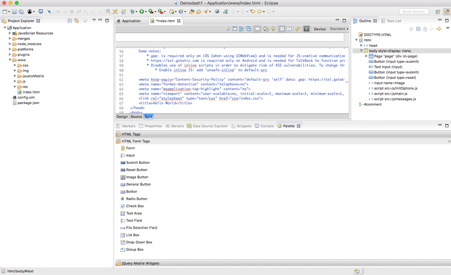

<!-- NLS_CHARSET=UTF-8 -->
## Visión general
{: #overview }
El diseño y la implementación de la interfaz de usuario de una aplicación es una parte importante del proceso de desarrollo. {{ site.data.keys.product_adj }} El plugin de Eclipse junto al plugin de Thym ayuda al desarrollo de aplicaciones cordova.
Escribir un estilo CSS personalizado para cada componente desde cero puede proporcionar un alto nivel de personalización, pero esto requiere también una gran cantidad de recursos. A veces es mejor utilizar las infraestructuras de interfaz de usuario JavaScript existentes.
Este tema describe cómo desarrollar aplicaciones {{ site.data.keys.product_adj }} con dos infraestructuras de interfaz de usuario jQuery Mobile y un editor WYSIWYG proporcionados en {{ site.data.keys.product_adj }} Studio Eclipse.

Para desarrollar la interfaz de usuario para una aplicación Cordova mediante el plugin de MobileFirst Eclipse, lleve a cabo los pasos siguientes:

1. Descargue Eclipse.
2. Instale el plugin [Thym](http://marketplace.eclipse.org/content/eclipse-thym) desde Eclipse Marketplace.
3. Instale el [plugin de MobileFirst Platform](http://marketplace.eclipse.org/content/ibm-mobilefirst-foundation-studio) desde Eclipse Marketplace.


## Editor WYSIWYG
{: #wysiwyg-editor }
Se proporciona un editor WYSIWYG con el plugin de Eclipse MobileFirst Platform para widgets de interfaz de usuario HTML, para la comodidad del desarrollador.
Este editor proporciona la paleta básica para que el usuario pueda arrastrar y soltar widgets de interfaz de usuario como un botón o un recuadro de texto y otros widgets HTML. Se trata de una herramienta rápida de desarrollo de aplicaciones móviles que permite al usuario desarrollar una aplicación Cordova con rapidez.



## jQuery Mobile
{: #jquery-mobile }
jQuery es una infraestructura JavaScript rápida y concisa que simplifica el flujo de documentos HTML, la gestión de sucesos, las animaciones y las interacciones Ajax para un desarrollo web rápido. jQuery Mobile es una infraestructura web táctil optimizada para smartphones y tabletas. jQuery Mobile requiere jQuery para poder ejecutarse.

Para añadir jQuery mobile a su aplicación, lleve a cabo los pasos siguientes:

1. Cree un proyecto Thym en eclipse pulsando **Archivo -> Nuevo -> nuevo proyecto de aplicación (Cordova) Móvil híbrido**.
2. [Descargue el paquete jQuery mobile](http://jquerymobile.com/download/).
3. Copie el paquete jQuery Mobile que ha descargado en el directorio `www` de su aplicación híbrida, tal como se muestra en la imagen siguiente 
4. Abra el archivo principal `index.html` tal como se muestra en la captura de pantalla y añada las referencias jQuery (como se muestra en el fragmento de código) al proyecto:
    

    ```html
      <!DOCTYPE HTML>
      <html>
          	<head>
          		<meta charset="UTF-8">
          		<title>appName</title>
          		<meta name="viewport" content="width=device-width, initial-scale=1.0, maximum-scale=1.0, minimum-scale=1.0, user-scalable=0">
          		<!--
          			<link rel="shortcut icon" href="images/favicon.png">
          			<link rel="apple-touch-icon" href="images/apple-touch-icon.png">
          		-->
          		<link href="jqueryMobile/jquery.mobile.structure-1.4.5.min.css" rel="stylesheet">
          		<link href="jqueryMobile/demos/css/jquery.mobile.structure-1.4.5.min.css" rel="stylesheet">
          		<link href="jqueryMobile/jquery.mobile-1.4.5.min.css" rel="stylesheet">
          		<link href="jqueryMobile/jquery.mobile.theme-1.4.5.css" rel="stylesheet">
          		<link href="jqueryMobile/jquery.mobile.theme-1.4.5.min.css" rel="stylesheet">
          		<link href="jqueryMobile/jquery.mobile.external-png-1.4.5.min.css" rel="stylesheet">
          		<link href="jqueryMobile/jquery.mobile.inline-png-1.4.5.css" rel="stylesheet">
          		<link href="jqueryMobile/demos/css/jquery.mobile.inline-svg-1.4.5.min.css" rel="stylesheet">
          		<link href="jqueryMobile/jquery.mobile-1.4.5.css" rel="stylesheet">
          		<link href="jqueryMobile/jquery.mobile.inline-png-1.4.5.min.css" rel="stylesheet">
          		<link href="jqueryMobile/jquery.mobile.external-png-1.4.5.css" rel="stylesheet">
          		<link href="jqueryMobile/demos/css/jquery.mobile.inline-png-1.4.5.min.css" rel="stylesheet">
          		<link href="jqueryMobile/demos/theme-classic.css" rel="stylesheet">
          		<link href="jqueryMobile/jquery.mobile.inline-svg-1.4.5.css" rel="stylesheet">
          		<link href="jqueryMobile/jquery.mobile.structure-1.4.5.css" rel="stylesheet">
          		<link href="jqueryMobile/demos/css/jquery.mobile-1.4.5.min.css" rel="stylesheet">
          		<link href="jqueryMobile/jquery.mobile.inline-svg-1.4.5.min.css" rel="stylesheet">
          		<link href="jqueryMobile/demos/css/jquery.mobile.theme-1.4.5.min.css" rel="stylesheet">
          		<link href="jqueryMobile/demos/css/jquery.mobile.external-png-1.4.5.min.css" rel="stylesheet">
          		<link rel="stylesheet" href="css/main.css">
          		<script>window.$ = window.jQuery = WLJQ;</script>
          		<script src="jqueryMobile/demos/jquery.js"></script>
          		<script src="jqueryMobile/demos/jquery.mobile-1.4.5.js"></script>
          	</head>
          	<body style="display: none;">
          		<div data-role="page" id="page">
          			<div data-role="content" style="padding: 15px">
          				<!--application UI goes here-->
          				Hello MobileFirst
          			</div>
          		</div>
          		<script src="js/initOptions.js"></script>
          		<script src="js/main.js"></script>
          		<script src="js/messages.js"></script>
          	</body>
      </html>
    ```
Una vez haya añadido las referencias a jQuery Mobile en el archivo HTML, cierre y vuelva a abrir el archivo en Eclipse. Ahora verá widgets jQuery Mobile en la vista de paleta que puede arrastrar y soltar en el lienzo HTML.
