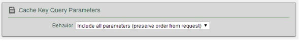

## Visión general
{: #overview }
Las solicitudes de Direct Update se pueden configurar para ser servidas desde una CDN (Content Delivery Network (red de entrega de contenidos)) en lugar de hacerlo desde {{ site.data.keys.mf_server }}.   

#### Ventajas de utilizar una CDN
{: #advantages-of-using-a-cdn }
La utilización de una CDN en lugar de {{ site.data.keys.mf_server }} para servir solicitudes de Direct Update tiene las siguientes ventajas:

* Elimina la carga de red desde {{ site.data.keys.mf_server }}.
* Incrementa las velocidades de transferencia a más del límite de 250 MB/segundo al servir solicitudes desde {{ site.data.keys.mf_server }}.
* Asegura una experiencia de Direct Update más uniforme a todos los usuarios independientemente de su ubicación geográfica.

#### Requisitos generales
{: #general-requirements }
Para dar servicio a las solicitudes de Direct Update desde una CDN, asegúrese de que la configuración cumple las siguientes condiciones:

* La CDN debe ser un proxy inverso en frente de {{ site.data.keys.mf_server }} (o en frente de otro proxy inverso si es necesario).

* Al compilar la aplicación desde su entorno de desarrollo, configure el servidor de destino para el host y puerto de la CDN en lugar del host y puerto de {{ site.data.keys.mf_server }}.
Por ejemplo, al ejecutar el mandato {{ site.data.keys.mf_cli }} command mfpdev server add, proporcione el host y puerto de CDN.

* En el panel de administración de CDN, necesita marcar los siguientes URL de Direct Update para el almacenamiento en caché para asegurarse de que la CDN pasa todas las solicitudes a {{ site.data.keys.mf_server }} excepto las solicitudes de Direct Update.
Para las solicitudes de Direct Update, la CDN determina si obtuvo el contenido.
Si lo hizo, lo devuelve sin ir a {{ site.data.keys.mf_server }}; si no, va a {{ site.data.keys.mf_server }}, obtiene el archivador de Direct Update (un archivo .zip) y lo almacena para las siguientes solicitudes para dicho URL específico.  Para aplicaciones compiladas con la v8.0 de {{ site.data.keys.product_full }}, el URL de Direct Update es: `PROTOCOLO://DOMINIO:PUERTO/VÍA_CONTEXTO/api/directupdate/VERSIÓN/SUMA_COMPROBACIÓN/TIPO`.
El prefijo `PROTOCOLO://DOMINIO:PUERTO/VÍA_CONTEXTO` es el mismo para todas las solicitudes de tiempo de ejecución.
Por ejemplo:http://my.cdn.com:9080/mfp/api/directupdate/0.0.1/742914155/full?appId=com.ibm.DirectUpdateTestApp&clientPlatform=android

En el ejemplo, hay parámetros de solicitud adicionales que también son parte de la solicitud.

* La CDN debe permitir almacenar en caché los parámetros de solicitud.
Dos archivadores de Direct Update podrían diferir únicamente por los parámetros de la solicitud.

* La CDN debe dar soporte a TTL en la respuesta de Direct Update.
El soporte es necesario para permitir varias actualizaciones directas para la misma versión.

* La CDN no puede cambiar ni eliminar las cabeceras HTTP que se utilizan en el protocolo de cliente/servidor.

## Configuración de ejemplo
{: #example-configuration }
Este ejemplo se basa en la utilización de la configuración de la CDN de Akamai que almacena en caché el archivador de Direct Update.
Las siguientes tareas las completan el administrador de red, el administrador de {{ site.data.keys.product_adj }} y el administrador de Akamai:

#### Administrador de red
{: #network-administrator }
Debe crear otro dominio en el DNS para su instancia de {{ site.data.keys.mf_server }}.
Por ejemplo, si el dominio del servidor es yourcompany.com necesitará crear un dominio como, por ejemplo, `cdn.yourcompany.com`.
En el DNS para el nuevo dominio `cdn.yourcompany.com`, establecerá un `CNAME` al nombre de dominio que Akamai proporcione.
Por ejemplo, `yourcompany.com.akamai.net`.

#### Administrador de {{ site.data.keys.product_adj }}
{: #mobilefirst-administrator }
Establecerá el dominio nuevo cdn.yourcompany.com como el URL de {{ site.data.keys.mf_server }} para las aplicaciones de {{ site.data.keys.product_adj }}.
Por ejemplo, para la tarea de compilación de Ant, la propiedad es: `<property name="wl.server" value="http://cdn.yourcompany.com/${contextPath}/"/>`.

#### Administrador de Akamai
{: #akamai-administrator }
1. Debería abrir el gestor de propiedades de Akamai y establecer la propiedad de **nombre de host** con el valor del nuevo dominio.

    
    
2. En el separador de Regla predeterminada, debería configurar el host y el puerto de {{ site.data.keys.mf_server }} original y establecer el valor de **Cabecera de host de reenvío personalizado** con el dominio recién creado.

    
    
3. En la lista de **Opción de almacenamiento en caché**, seleccionar **No almacenar**.

    

4. En el separador **Configuración de contenido estático**, configurar el criterio coincidente de acuerdo al URL de Direct Update de la aplicación.
Por ejemplo, debería crear una condición que indique `Si la vía de acceso coincide con un URL_de_direct_update`.

    
    
5. Debería establecer valores similares a los siguientes para configurar el comportamiento del almacenamiento en caché para el URL de Direct Update y para configurar TTL.

    |Campo|Valor|
    |-------|-------|
    |Opción de almacenamiento en caché|Caché|
    |Forzar la reevaluación de objetos obsoletos |Servir obsoleto si no es posible validar|
    |Edad máxima |3 minutos |

    

6. Configuración del comportamiento de clave de caché para utilizar todos los parámetros de solicitud en la clave de caché (es necesario hacerlo para almacenar en caché archivadores de Direct Update diferentes para distintas aplicaciones o versiones).
Por ejemplo, desde la lista **Comportamiento**, seleccione `Incluir todos los parámetros (conservar el orden de la solicitud)`.

    

