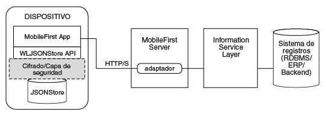

<!-- NLS_CHARSET=UTF-8 -->
## Visión general
{: #overview }
{{ site.data.keys.product_full }} **JSONStore** es una API del lado del cliente opcional que proporciona un sistema ligero de almacenamiento orientado a documentos.
JSONStore ofrece un almacenamiento persistente de **documentos JSON**.
Los documentos en una aplicación están disponibles en JSONStore incluso cuando el dispositivo que ejecuta la aplicación está fuera de línea.
Este almacenamiento persistente que siempre está disponible puede ser útil para que los usuarios accedan a documentos cuando, por ejemplo, no hay ninguna conexión de red disponible en el dispositivo.




Puesto que es familiar para los desarrolladores, a veces en esta documentación se utiliza terminología de bases de datos relacionales para explicar JSONStore.
Sin embargo, hay muchas diferencias entre una base de datos relacional y JSONStore.
Por ejemplo, el esquema estricto que se utiliza para almacenar datos en las bases de datos relacionales es distinto de la aproximación con JSONStore.
Con JSONStore, se puede almacenar cualquier contenido JSON e indexar el contenido que se necesita buscar.


#### Características clave
{: #key-features }
* Indexación de datos para una búsqueda eficiente

* Mecanismo de seguimiento cambios únicamente locales en los datos almacenados

* Soporte a múltiples usuarios
* El cifrado AES 256 de los datos almacenados proporciona seguridad y confidencialidad.
Existe la posibilidad de segmentar la protección por usuario con protección de contraseña en el caso de que haya más de un usuario en un único dispositivo.


Un único almacén puede tener muchas recopilaciones y cada recopilación puede tener muchos documentos.
También es posible tener una aplicación {{ site.data.keys.product_adj }} con varios almacenes.
Consulte el soporte de múltiples usuarios de JSONStore para obtener más información.


#### Nivel de soporte
{: #support-level }
* JSONStore está soportado en aplicaciones Android e iOS nativas (no hay soporte para Windows nativo (Universal y UWP)).
* JSONStore está soportado en aplicaciones Cordova iOS, Android y Windows (Universal y UWP).


#### Ir a 
{: #jump-to }
* [Terminología general de JSONStore ](#general-jsonstore-terminology)
* [Tabla de características](#features-table)
* [Soporte a múltiples usuarios](#multiple-user-support)
* [Seguridad](#security)
* [Rendimiento](#performance)
* [Simultaneidad](#concurrency)
* [Analíticas](#analytics)
* [Cómo trabajar con datos externos](#working-with-external-data)
* [Resolución de problemas](#troubleshooting)
* [Uso de API](#api-usage)

## Terminología general de JSONStore 
{: #general-jsonstore-terminology }
### Documento
{: #document }
Un documento es el bloque constructivo básico de JSONStore.

Un documento JSONStore es un objeto JSON con un identificador que se genera de forma automática (`_id`) y con unos datos JSON.
Es similar a un registro o a una fila en la terminología de base de datos.
El valor de `_id` siempre es un entero exclusivo dentro de una recopilación específica.
Algunas operaciones como, por ejemplo, `add`, `replace` y `remove` en la clase `JSONStoreInstance` utilizan una matriz de objetos/documentos.
Estos métodos son útiles para realizar operaciones con diversos documentos/objetos al mismo tiempo.


**Documento individual**  

```javascript
var doc = { _id: 1, json: {name: 'carlos', age: 99} };
```

**Matriz de documentos**

```javascript
var docs = [
  { _id: 1, json: {name: 'carlos', age: 99} },
  { _id: 2, json: {name: 'tim', age: 100} }
]
```

### Recopilación
{: #collection }
Una recopilación JSONStore es parecido a una tabla en la terminología de base de datos.
  
El siguiente ejemplo de código no corresponde a la forma en la que se almacenan los documentos en el disco, pero son una manera fácil de visualizar una recopilación a un alto nivel.


```javascript
[
    { _id: 1, json: {name: 'carlos', age: 99} },
    { _id: 2, json: {name: 'tim', age: 100} }
]
```

### Almacén
{: #store }
Un almacén es un archivo JSONStore persistente que contiene una o varias recopilaciones.
  
Un almacén es similar a una base de datos relacional en la terminología de base de datos.
También se hace referencia al almacén como JSONStore.

### Campos de búsqueda
{: #search-fields }
Un campo de búsqueda es una pareja de clave/valor.
  
Los campos de búsqueda son claves que se indexan para disminuir los tiempos de búsqueda, de forma parecida a los atributos o campos de columna en la terminología de base de datos.


Los campos de búsqueda adicionales son claves indexadas que no son parte de los datos JSON almacenados.
Estos campos definen la clave cuyos valores (en la recopilación JSON) están indexados y que se utilizan para realizar las búsquedas con mayor rapidez.


Los tipos de datos válidos son: string, boolean, number e integer.
Estos tipos son únicamente sugerencias de tipo, no hay una validación de tipo.
Es más, estos tipos determinan cómo se almacenan los campos indexables.
Por ejemplo, `{age: 'number'}` indexará 1 como 1,0 y `{age: 'integer'}` indexará 1 como 1.


**Campos de búsqueda y campos de búsqueda adicional**

```javascript
var searchField = {name: 'string', age: 'integer'};
var additionalSearchField = {key: 'string'};
```

Sólo es posible indexar claves dentro de un objeto, no el objeto en sí mismo.
En las matrices no es posible indexar una matriz o un índice específico de la matriz (matriz[n]), pero puede indexar objetos dentro de una matriz.


**Indexación de valores dentro de una matriz**

```javascript

var searchFields = {
    'people.name' : 'string', // matches carlos and tim on myObject
    'people.age' : 'integer' // matches 99 and 100 on myObject
};

var myObject = { 
    people : [ 
        {name: 'carlos', age: 99}, 
        {name: 'tim', age: 100}
    ] 
};
```

### Consultas
{: #queries }
Las consultas son objetos que utilizan campos de búsqueda o campos de búsqueda adicionales para buscar documentos.
  
En estos ejemplos se presupone que el campo de búsqueda del nombre es de tipo serie y que el campo de búsqueda de edad es de tipo entero.


**Encontrar documentos donde `name` coincida con `carlos`** 

```javascript
var query1 = {name: 'carlos'};
```

**Encontrar documentos con `name` que coincida con `carlos` y `age` coincida con `99`**

```javascript
var query2 = {name: 'carlos', age: 99};
```

### Partes de consulta
{: #query-parts }
Las partes de consulta se utilizan para crear búsquedas más avanzadas.
Algunas operaciones de JSONStore como, por ejemplo, algunas versiones de `find` o `count` utilizan partes de consulta.
La información dentro de la parte de consulta está unida mediante sentencias `AND` y `OR`.
El criterio de búsqueda solo devuelve una coincidencia si todos elementos de la parte de consulta se evalúan como **true**.
Utilice una o varias partes de consulta para buscar coincidencias que satisfagan una o varias de las partes de consulta.


Las búsquedas con partes de consulta solo funcionan con campos de búsqueda de nivel superior.
Por ejemplo: `name` y no `name.first`.
Utilice varias recopilaciones donde todos los campos de búsqueda sean de nivel superior para resolver esta situación.
Las operaciones de partes de consulta que funcionan con campos de búsqueda de nivel superior son:
`equal`, `notEqual`, `like`, `notLike`, `rightLike`, `notRightLike`, `leftLike` y `notLeftLike`.
El comportamiento es indeterminado si utiliza campos de búsqueda que no sean de un nivel superior.


## Tabla de características
{: #features-table }
Compare las características de JSONStore con aquellas otras características de otros formatos y tecnologías de almacenamiento de datos.


JSONStore es una API de JavaScript para almacenar datos dentro de aplicaciones Cordova que utilizan el plugin {{ site.data.keys.product_adj }}, una API Objective-C para aplicaciones iOS nativas, y una API Java para aplicaciones Android nativas.
Como referencia, se proporciona una comparación entre las distintas tecnologías de almacenamiento JavaScript para ver como JSONStore se compara frente a las mismas.


JSONStore es similar a otras tecnologías como, por ejemplo, LocalStorage, Indexed DB, Cordova Storage API y Cordova File API.
En la tabla se muestra como algunas de las características que JSONStore proporciona frente a otras tecnologías.
La característica JSONStore solo está disponible en simuladores y dispositivos iOS y Android.


|Característica                                     |JSONStore      |LocalStorage |IndexedDB |Cordova storage API |Cordova file API |
|----------------------------------------------------|----------------|--------------|-----------|---------------------|------------------|
|Soporte Android (aplicaciones nativas y Cordova)|	     ✔ 	      |✔	     |✔	           |✔	    |✔	    |
|Soporte iOS (aplicaciones nativas y Cordova)	     |	     ✔ 	      |✔	     |✔	           |✔	    |✔	    |
|Windows 8.1 Universal y Windows 10 UWP (aplicaciones Cordova)          |	     ✔ 	      |✔	     |✔	     |        -	           |✔	      |
|Cifrado de datos                                 |	     ✔ 	      |      -	    |     -	     |        -	           |         -	      |
|Máximo almacenamiento                                 |Espacio disponible |~5MB     |~5MB 	 |Espacio disponible |Espacio disponible |
|Almacenamiento fiable (ver nota)              |	     ✔ 	      |      -	    |     -	     |✔	      |✔	      |
|Mantener seguimiento de cambios locales         |	     ✔ 	      |      -	    |     -	     |        -	           |         -	      |
|Soporte a varios usuarios                   |	     ✔ 	      |      -	    |     -	     |        -	           |         -	      |
|Indexación   |	     ✔ 	      |      -	    |✔	           |✔	           |         -	      |
|Tipo de almacenamiento                   |Documentos JSON|Parejas clave/valor |Documentos JSON|Relacional (SQL) |Series |

**Nota:** Almacenamiento fiable significa que no se suprimen los datos a no ser que se produzca una de las siguientes situaciones:


* La aplicación se elimina del dispositivo. 
* Se llama a uno de los métodos que eliminan los datos. 

## Soporte a múltiples usuarios	
{: #multiple-user-support }
Con JSONStore, es posible crear varios almacenes con varias recopilaciones en una única aplicación de {{ site.data.keys.product_adj }}.


La API init (JavaScript) u open (iOS nativo y Android nativo) pueden tomar un objeto de opciones con un nombre de usuario.
Los distintos almacenes son archivos diferentes en el sistema de archivos.
El nombre de usuario se utiliza como el nombre de archivo del almacén.
Estos distintos almacenes se pueden cifrar con distintas contraseñas por razones de seguridad y privacidad.
Al llamar a la API closeAll se elimina el acceso a todas las recopilaciones.
También es posible cambiar la contraseña de un almacén de cifrado llamando a la API changePassword.


Un caso de uso de ejemplo sería el de varios usuarios que comparten un dispositivo físico (por ejemplo, una tableta iPad o Android) y una aplicación de {{ site.data.keys.product_adj }}.
Además, si los empleados trabajasen en distintos turnos y manejasen datos de distintos clientes al utilizar la aplicación de {{ site.data.keys.product_adj }}, el soporte de múltiples usuarios sería útil.


## Seguridad
{: #security }
Todas las recopilaciones se pueden cifrar en un almacén para protegerlas.


Para cifrar todas las recopilaciones en un almacén, pase una contraseña a la API `init` (JavaScript) o `open` (iOS nativo y Android nativo).
Si no se pasa una contraseña, no se cifrará ningún documento en las recopilaciones del almacén.


Algunos artefactos de seguridad (por ejemplo los de sal) se almacenan en la cadena de claves (iOS), las preferencias compartidas (Android) y en la caja de seguridad de credenciales (Windows Universal 8.1 y Windows 10 UWP).
El almacén se cifra con una clave AES (Advanced Encryption Standard) de 256 bits.
Todas las claves están reforzadas mediante PBKDF2 (Password-Based Key Derivation Function 2).
Puede decidir cifrar las recopilaciones de datos de una aplicación, sin embargo, no puede conmutar entre los formatos cifrados y sin cifrar ni utilizar ambos formatos dentro de un almacén.


La clave que protege los datos en el almacén se basa en la contraseña de usuario que proporcione.
La clave no caduca y puede cambiarla llamando a la API changePassword.

La clave de protección de datos (DPK) es la clave que se utiliza para descifrar el contenido del almacén.
La DPK se mantiene en la cadena de claves de iOS incluso si la aplicación está desinstalada.
Para eliminar tanto la clave la cadena de herramientas como todo lo demás que JSONStore coloca en la aplicación, utilice la API destroy.
Este proceso no se aplica a Android porque la DPK cifrada se almacena en las preferencias compartidas y se borra de las mismas al desinstalar la aplicación.


La primera vez que JSONStore abre una recopilación con una contraseña, lo que significa que el desarrollador desea cifrar los datos dentro del almacén, JSONStore necesita una señal aleatoria.
Dicha señal se puede obtener desde el cliente o desde el servidor.


Cuando la clave localKeyGen está presente en la implementación JavaScript de la API JSONStore, y tiene un valor true, se genera localmente una señal criptográfica segura.
De lo contrario, la señal se genera poniéndose en contacto con el servidor, con lo que se necesita conectividad a {{ site.data.keys.mf_server }}.
Esta señal solamente es necesaria la primera vez que se abre un almacén con una contraseña.
Con las implementaciones nativas (Objective-C y Java) se puede genera una señal criptográficamente segura de forma predeterminada, o el usuario puede pasar una mediante la opción secureRandom.


Deberá valorar si es más conveniente abrir un almacén fuera de línea y confiar en el cliente para generar esta señal aleatoria (menos seguro) o abrir el almacén con acceso a {{ site.data.keys.mf_server }} (es necesaria conectividad) y confiar en el servidor (más seguro).


### Programa de utilidad de seguridad
{: #security-utilities }
La API del lado del cliente de {{ site.data.keys.product_adj }} proporciona algunos programas de utilidad de seguridad para proteger los datos del usuario.
Las características como JSONStore son de gran utilidad si desea proteger objetos JSON.
Sin embargo, no se recomienda almacenar blobs binarios en una recopilación de JSONStore.


En su lugar, almacene los datos binarios en el sistema de archivos, y almacene las vías de acceso de archivos y otros metadatos dentro de una recopilación JSONStore.
Si desea proteger los archivos como, por ejemplo, imágenes, puede codificarlas como series base64, cifrarlas, y grabar la salida en el disco.
Cuando llegue el momento de descifrar los datos, podrá buscar en los metadatos en una recopilación JSONStore, leer los datos cifrados del disco, y descifrarlos mediante los metadatos almacenados.
Estos metadatos pueden incluir la clave, la sal, el vector de inicialización (IV), el tipo de archivo o la vía de acceso al archivo, entre otros.


> Aprenda más sobre los [Programas de utilidad de JSONStore](security-utilities).

### Cifrado de Windows 8.1 Universal y Windows 10 UWP 
{: #windows-81-universal-and-windows-10-uwp-encryption }
Todas las recopilaciones se pueden cifrar en un almacén para protegerlas.


JSONStore utiliza [SQLCipher](http://sqlcipher.net/) como su tecnología de base de datos subyacente.
SQLCipher es una compilación de SQLite creada por Zetetic, LLC que añade una capa de cifrado a la base de datos.


JSONStore utiliza SQLCipher en todas las plataformas.
En Android e iOS existe una versión de código abierto de SQLCipher, denominada Community Edition que se incorpora a las versiones de JSONStore que se incluyen en {{ site.data.keys.product }}.
Las versiones de Windows de SQLCipher únicamente están disponibles a través de una licencia comercial y {{ site.data.keys.product }} no las puede distribuir directamente.


En lugar de ello, JSONStore para Windows 8 Universal incluye SQLite como la base de datos subyacente.
Si necesita cifrar datos para alguna de estas plataformas, necesita adquirir su propia versión de SQLCipher y cambiar la versión de SQLite que se incluye en {{ site.data.keys.product }}.


Si no necesita cifrado, JSONStore es funcionalmente completo (excepto por el cifrado) al utilizar la versión de SQLite en {{ site.data.keys.product }}.


#### Sustitución de SQLite con SQLCipher para Windows Universal y Windows UWP
{: #replacing-sqlite-with-sqlcipher-for-windows-universal-and-windows-uwp }
1. Ejecute SQLCipher para la extensión de Windows Runtime 8.1/10 que viene con SQLCipher for Windows Runtime Commercial Edition.

2. Una vez haya finalizado de la extensión, ubique la versión de SQLCipher del archivo **sqlite3.dll** que se acaba de crear.
Hay uno para x86, uno para x64 y uno para ARM.


   ```bash
   C:\Program Files (x86)\Microsoft SDKs\Windows\v8.1\ExtensionSDKs\SQLCipher.WinRT81\3.0.1\Redist\Retail\<platform>
   ```
    
3. Copie y sustituya este archivo con su aplicación de {{ site.data.keys.product_adj }}.


   ```bash
   <Worklight project name>\apps\<application name>\windows8\native\buildtarget\<platform>
   ```

## Rendimiento
{: #performance }
Los siguientes factores pueden afectar al rendimiento de JSONStore.


### Red
{: #network }
* Compruebe la conectividad de red antes de realizar operaciones como, por ejemplo, enviar todos los documentos "sucios" a un adaptador.

* La cantidad de datos que se envían a través de la red a un cliente afectan en gran medida al rendimiento.
Envíe solo los datos que sean necesarios para la aplicación, en lugar de copiar todo dentro de su base de datos de fondo.

* Si está utilizando un adaptador, considere establecer el distintivo compressResponse en true.
De este modo, las respuestas se comprimen, lo que generalmente supone utilizar menos ancho de banda y tiene un tiempo de transferencia más bajo que sin compresión.


### Memoria
{: #memory }
* Cuando se utiliza la API de JavaScript, los documentos JSONStore se serializan y deserializan como series entre la capa nativa (Objective-C, Java o C#) y la capa de JavaScript.
Una forma para mitigar posibles problemas de memoria es utilizar limit y offset al utilizar la API find.
De esta forma, limita la cantidad de memoria asignada a los resultados y puede implementar funcionalidades como la paginación (mostrar x números de resultados por página).

* En lugar de utilizar nombres de clave largos que al final se serializan y deserializan como series, considere el correlacionar estos nombres de clave largos con otros más cortos (por ejemplo: `myVeryVeryVerLongKeyName` en `k` o `key`).
Lo ideal sería correlacionarlos con nombres de clave cortos al enviarlos desde el adaptador al cliente, y correlacionarlos con los nombres de clave largos al enviar datos de nuevo a los sistemas de fondo.

* Considere dividir los datos dentro de un almacén en varias recopilaciones.
Es mejor utilizar varios documentos pequeños en distintas recopilaciones en lugar de utilizar documentos monolíticos en una única recopilación.
Este aspecto depende de cómo están relacionados los datos y los casos de uso para dichos datos.

* Cuando utiliza la API add con una matriz de objetos, es posible que aparezcan problemas de memoria.
Para mitigar este problema, llame a estos métodos con menos objetos JSON al mismo tiempo.

* JavaScript y Java tienen recopiladores de basura, mientras que Objective-C utiliza ARC (Automatic Reference Counting). Deje que funcionen, pero no dependa de ellos en su totalidad.
Intente asignar a null las referencias que no utilice y utilice la herramienta de creación de perfiles para comprobar que la utilización de memoria disminuye cuando espere que así ocurra.


### CPU
{: #cpu }
* La cantidad de campos de búsqueda y campos de búsqueda adicionales que se utilizan afectan al rendimiento cuando se llama al método add, que realiza la indexación.
Indexe únicamente los valores que utilice en las consultas para el método find.

* De forma predeterminada, JSONStore realiza un seguimiento de los cambios locales a sus documentos.
Este comportamiento se puede inhabilitar, ahorrando por lo tanto ciclos, estableciendo el distintivo `markDirty` en **false** al utilizar las API add, remove y replace.

* La habilitación de la seguridad añade algo de sobrecarga a las API `init` o `open`, así como a otras operaciones, que funcionan con documentos dentro de la recopilación.
Considere si la seguridad está realmente justificada.
Por ejemplo, la API open es mucho más lenta con cifrado puesto que debe generar las claves de cifrado que se utilizarán para el cifrado y el descifrado.

* Las API `replace` y `remove` dependen del tamaño de la recopilación puesto que deben recorrerla en su totalidad para sustituir o eliminar todas las apariciones.
Puesto que debe recorrer cada registro, desde descifrarlos uno a uno, lo que hace que sea más lento cuando se utiliza el cifrado.
Este coste en el rendimiento es más evidente en recopilaciones grandes.

* La API `count` es relativamente costosa.
Sin embargo, puede mantener una variable que mantenga el recuento de dicha recopilación.
Actualícela cada vez que almacene o elimine elementos en la recopilación.

* Las API `find` (`find`, `findAll` y `findById`) se ven afectadas por el cifrado, puesto que deben descifrar cada documento para ver si hay una coincidencia.
Para una búsqueda mediante una consulta, si se pasa un límite, podría ser más rápido al detenerse la consulta al alcanzar el límite de los resultados.
JSONStore no necesita descifrar el resto de los documentos para averiguar si quedan otros resultados de búsqueda.


## Simultaneidad
{: #concurrency }
### JavaScript
{: #javascript }
La mayoría de las operaciones que se pueden realizar en una recopilación, como son las de añadir o buscar, son asíncronas.
Estas operaciones devuelven una promesa de jQuery que se resuelve cuando la operación se completa de forma satisfactoria y se rechaza cuando se da una anomalía.
Estas promesas son similares a las devoluciones de llamada de éxito y anomalías.


Un deferred de JQuery es una promesa que se puede resolver o rechazar.
Los siguientes ejemplos no son específicos para JSONStore, están pensados para ayudar a entender su uso en general.


En lugar de promesas y devoluciones de llamadas, también se pueden escuchar los sucesos `success` y `failure` de JSONStore.
Ejecute acciones basadas en los argumentos que se pasan al escucha de sucesos.


**Ejemplo de definición de promesa**

```javascript
var asyncOperation = function () {
  // Assumes that you have jQuery defined via $ in the environment
  var deferred = $.Deferred();

  setTimeout(function() {
    deferred.resolve('Hello');
  }, 1000);

  return deferred.promise();
};
```

**Ejemplo de uso de promesa**

```javascript
// The function that is passed to .then is executed after 1000 ms.
asyncOperation.then(function (response) {
  // response = 'Hello'
});
```

**Ejemplo de definición de devolución de llamada**

```javascript
var asyncOperation = function (callback) {
  setTimeout(function() {
    callback('Hello');
  }, 1000);
};
```

**Ejemplo de uso de devolución de llamada**

```javascript
// The function that is passed to asyncOperation is executed after 1000 ms.
asyncOperation(function (response) {
  // response = 'Hello'
});
```

**Sucesos de ejemplo**

```javascript
$(document.body).on('WL/JSONSTORE/SUCCESS', function (evt, data, src, collectionName) {

  // evt - Contains information about the event
  // data - Data that is sent ater the operation (add, find, etc.) finished
  // src - Name of the operation (add, find, push, etc.)
  // collectionName - Name of the collection
});
```

### Objective-C
{: #objective-c }
Cuando se utiliza la API iOS nativa para JSONStore, todas las operaciones se añaden a la cola de asignación asíncrona.
Este comportamiento asegura que las operaciones que afectan al almacén se ejecutan en orden en una hebra que no es la hebra principal.
Para obtener más información, consulte la documentación de Apple en [Grand Central Dispatch (GCD)](https://developer.apple.com/library/ios/documentation/Performance/Reference/GCD_libdispatch_Ref/Reference/reference.html#//apple_ref/c/func/dispatch_sync        ).

### Java
{: #java }
Cuando se utiliza la API Android nativa para JSONStore, todas las operaciones se ejecutan en la hebra principal.
Debe crear hebras o utilizar agrupaciones de hebras para obtener un comportamiento asíncrono.
Todas las operaciones de almacenamiento son de proceso múltiple.


## Analíticas 
{: #analytics }
Recopile elementos clave de información analítica relacionados con JSONStore 

### Información de archivo
{: #file-information }
La información de archivo se recopila una vez por sesión de aplicación si se llama a la API JSONStore con el distintivo de analíticas establecido en **true**.
Una sesión de aplicación se define al cargar la aplicación en memoria hasta que se elimina de la memoria.
Utilice esta información para determinar el espacio que el contenido de JSONStore está utilizando en la aplicación.


### Métricas de rendimiento
{: #performance-metrics }
Las métricas de rendimiento se recopilan cada vez que se llama a una API JSONStore con información sobre los tiempos de inicio y finalización de una operación.
Utilice esta información para determinar lo que pueden tardar las distintas operaciones en milisegundos.


### Ejemplos
{: #examples }
#### iOS
{: #ios-example}
```objc
JSONStoreOpenOptions* options = [JSONStoreOpenOptions new];
[options setAnalytics:YES];

[[JSONStore sharedInstance] openCollections:@[...] withOptions:options error:nil];
```

#### Android
{: #android-example }
```java
JSONStoreInitOptions initOptions = new JSONStoreInitOptions();
initOptions.setAnalytics(true);

WLJSONStore.getInstance(...).openCollections(..., initOptions);
```

#### JavaScript
{: #java-script-example }
```javascript
var options = {
  analytics : true
};

WL.JSONStore.init(..., options);
```

## Cómo trabajar con datos externos
{: #working-with-external-data }
Se puede trabajar con los datos externos en diferentes conceptos: **Pull** y **Push**.

### Pull
{: #pull }
Muchos sistemas utilizan el término pull para hacer referencia a la obtención de datos de una origen externo.   
Los tres elementos más importantes son:


#### Origen de datos externo
{: #external-data-source }
Este origen puede ser una base de datos, una API SOAP o REST, o muchos otros.
El único requisito es que debe ser accesible desde {{ site.data.keys.mf_server }} o directamente desde la aplicación de cliente.
Lo más conveniente es que este origen de datos devuelva datos en formato JSON.


#### Capa de transporte
{: #transport-layer }
Este origen es cómo obtiene datos desde el origen externo en su origen interno, una recopilación de JSONStore dentro del almacén.
Una alternativa es un adaptador.


#### API de origen de datos interno
{: #internal-data-source-api }
Este origen son las API de JSONStore que se pueden utilizar para añadir datos JSON a una recopilación.


**Nota:** El almacén interno se puede cumplimentar con datos que se leen desde un archivo, un campo de entrada o datos codificados mediante programación para una variable.
No tienen que venir de una forma exclusiva desde un origen externo que precisa comunicación de red.


Todos los siguientes ejemplos de código están escritos en un pseudocódigo similar a JavaScript. 

**Nota:** Utilice adaptadores para la capa de transporte.
Algunas de las ventajas de utilizar adaptadores son conversión XML a JSON, seguridad, filtrado, desacoplamiento de código del lado del cliente y de código del lado del servidor.


**Origen de datos externos: punto final REST de fondo**  
Imagine que tiene un punto final REST que lee datos de una base de datos y devuelve una matriz de objetos JSON.


```javascript
app.get('/people', function (req, res) {

  var people = database.getAll('people');

  res.json(people);
});
```

Los datos que se devuelven pueden ser similares a los del siguiente ejemplo:


```xml
[{id: 0, name: 'carlos', ssn: '111-22-3333'},
 {id: 1, name: 'mike', ssn: '111-44-3333'},
 {id: 2, name: 'dgonz' ssn: '111-55-3333')]
```

**Capa de transporte: adaptador**  
Imagine que ha creado un adaptador que se denomina people y que ha definido un procedimiento que se denomina getPeople.
El procedimiento llama al punto final REST y devuelve la matriz de objetos JSON al cliente.
Es posible que aquí desee realizar más tareas, por ejemplo, devolver un subconjunto de datos al cliente.


```javascript
function getPeople () {

  var input = {
    method : 'get',
    path : '/people'
  };

  return MFP.Server.invokeHttp(input);
}
```

En el cliente, puede utilizar la API WLResourceRequest para obtener datos.
Además, podría desear pasar parámetros desde el cliente al adaptador.
Un ejemplo es una fecha con la última vez que el cliente obtuvo nuevos datos del origen externo a través del adaptador.


```javascript
var adapter = 'people';
var procedure = 'getPeople';
 
var resource = new WLResourceRequest('/adapters' + '/' + adapter + '/' + procedure, WLResourceRequest.GET);
resource.send()
.then(function (responseFromAdapter) {
  // ...
});
```

**Nota:** Podría desear aprovecharse de `compressResponse`, `timeout` y de otros parámetros que se pueden pasar a la API `WLResourceRequest`.
  
Otra posibilidad es omitir el adaptador y utilizar algo como jQuery.ajax para contactar directamente al punto final REST con los datos almacenados.


```javascript
$.ajax({
  type: 'GET',
  url: 'http://example.org/people',
})
.then(function (responseFromEndpoint) {
  // ...
});
```

**API de origen de datos internos: JSONStore**
Después de tener una respuesta del sistema de fondo, puede trabajar con los datos mediante JSONStore.
JSONStore proporciona una forma de realizar un seguimiento de los cambios locales.
Habilita algunas API para marcar documentos como "sucios".
La API graba la última operación que se realizó en el documento, y cuándo el documento se marcó como "sucio". Puede utilizar esta información para implementar características como la sincronización de datos.


La API change toma los datos y algunas opciones:


**replaceCriteria**  
Estos campos de búsqueda son parte de los datos de entrada.
Se utilizan para encontrar documentos que ya existen dentro de una recopilación.
Por ejemplo, si selecciona: 

```javascript
['id', 'ssn']
```

como criterio de sustitución, pase la siguiente matriz como los datos de entrada:


```javascript
[{id: 1, ssn: '111-22-3333', name: 'Carlos'}]
```

y la recopilación `people` ya contiene el siguiente documento:


```javascript
{_id: 1,json: {id: 1, ssn: '111-22-3333', name: 'Carlitos'}}
```

La operación `change` busca un documento que coincida exactamente con la siguiente consulta:


```javascript
{id: 1, ssn: '111-22-3333'}
```

A continuación, la operación `change` realiza una sustitución con los datos de entrada y la recopilación contendrá:


```javascript
{_id: 1, json: {id:1, ssn: '111-22-3333', name: 'Carlos'}}
```

El nombre se ha cambiado de `Carlitos` a `Carlos`.
Si más de un documento coincide con el criterio de sustitución, todos los documentos que coincidan son sustituidos con los respectivos datos de entrada.


**addNew**  
Cuando no hay documentos que coincidan con el criterio de sustitución, la API change busca los valores de este distintivo.
Si el distintivo se establece en **true**, la API change crea un nuevo documento y lo añade al almacén.
De lo contrario, no se realiza ninguna acción.


**markDirty**  
Determina si la API change marca documentos sustituidos o añadidos como "sucios".


Se devuelve una matriz de datos desde el adaptador:


```javascript
.then(function (responseFromAdapter) {

  var accessor = WL.JSONStore.get('people');

  var data = responseFromAdapter.responseJSON;

  var changeOptions = {
    replaceCriteria : ['id', 'ssn'],
    addNew : true,
    markDirty : false
  };

  return accessor.change(data, changeOptions);
})

.then(function() {
  // ...
})
```

Puede utilizar otras API para realizar cambios en los documentos locales que se almacenan.
Obtenga siempre un accesor para la recopilación en la que desea realizar operaciones.


```javascript
var accessor = WL.JSONStore.get('people')
```

A continuación, puede añadir datos (una matriz de objetos JSON) y decidir si desea marcarlos como "sucios".
Normalmente, establecerá el distintivo markDirty en false cuando quiera obtener cambios del origen externo.
Establezca el distintivo en true cuando quiera añadir datos de forma local.


```javascript
accessor.add(data, {markDirty: true})
```

También puede sustituir un documento, y opcionalmente marcar el documento con las sustituciones como "sucio".


```javascript
accessor.replace(doc, {markDirty: true})
```

De forma parecida, puede eliminar un documento y opcionalmente marcar la eliminación como "sucia".
Los documentos que se eliminan y marcan como sucios no aparecerán al utilizar la API find.
Sin embargo, continuarán dentro de la recopilación a no ser que utilice la API `markClean`, que físicamente elimina los documentos de la recopilación.
Si el documento no se marca como sucio, se elimina físicamente de la recopilación.


```javascript
accessor.remove(doc, {markDirty: true})
```


### Sincronización automática con CloudantDB
A partir de Mobile Foundation [CD Update 2](https://mobilefirstplatform.ibmcloud.com/blog/2018/07/24/8-0-cd-update-release), el SDK de MFP JSONStore se puede utilizar para automatizar la sincronización de datos entre una recopilación de JSONStore en un dispositivo con cualquier base de datos CouchDB incluida Cloudant. Esta característica está disponible en iOS, android, cordova-android y cordova-ios.

#### Configuración de la sincronización entre JSONStore y Cloudant
Para configurar la sincronización automática entre JSONStore y Cloudant, complete los pasos siguientes:

1. Defina la política de sincronización en la aplicación móvil.
2. Despliegue el adaptador de sincronización en IBM Mobile Foundation.

#### Definición de la política de sincronización
El método de sincronización entre una recopilación de JSONStore y una base de datos Cloudant está definido por la política de sincronización. Puede especificar la política de sincronización en la aplicación para cada recopilación.

Se puede inicializar una recopilación de JSONStore con una política de sincronización. La política de sincronización puede ser una de las tres siguientes políticas:

<b>SYNC_DOWNSTREAM:</b>
Utilice esta política cuando desee descargar datos desde Cloudant en la recopilación de JSONStore. Esto se suele utilizar para datos estáticos que son necesarios para el almacenamiento fuera de línea. Por ejemplo, la lista de precios de elementos de un catálogo. Cada vez que se inicialice la recopilación en el dispositivo, los datos se renuevan desde la base de datos Cloudant remota. Mientras que se descarga toda la base de datos por primera vez, las renovaciones siguientes descargarán solo delta, que se compone de los cambios realizados en la base de datos remota.


Android:
```
initOptions.setSyncPolicy(JSONStoreSyncPolicy.SYNC_DOWNSTREAM);
```

iOS:
```
openOptions.syncPolicy = SYNC_DOWNSTREAM;
```

Cordova:
```
collection.sync = {
	syncPolicy:WL.JSONStore.syncOptions.SYNC_DOWNSTREAM
}
```

<b>SYNC_UPSTREAM:</b>
Utilice esta política cuando desee enviar por push datos locales a una base de datos Cloudant. Por ejemplo, la carga de datos de ventas capturados fuera de línea a una base de datos Cloudant. Cuando una recopilación está definida con la política SYNC_UPSTREAM, cualquier registro nuevo añadido a la recopilación crea un registro nuevo en Cloudant. De forma similar, cualquier documento modificado en la recopilación en el dispositivo modificará el documento en Cloudant, y los documentos suprimidos en la recopilación también se suprimirán de la base de datos Cloudant.


Android:
```
initOptions.setSyncPolicy(JSONStoreSyncPolicy.SYNC_UPSTREAM);
```

iOS:
```
openOptions.syncPolicy = SYNC_UPSTREAM;
```

Cordova:
```
collection.sync = {
	syncPolicy:WL.JSONStore.syncOptions.SYNC_UPSTREAM
}
```

<b>SYNC_NONE:</b>
Esta es la política predeterminada. Seleccione esta política para que no tenga lugar la sincronización.

<b><i>Importante:</i></b> La política de sincronización se atribuye a una recopilación JSONStore. Una vez que se inicialice una recopilación con una política de sincronización en concreto, no se debería modificar. La modificación de la política de sincronización puede dar lugar a resultados indeseables.

<b>syncAdapterPath</b>

Este es el nombre del adaptador desplegado.


Android:
```
//Here "JSONStoreCloudantSync" is the name of the sync adapter deployed on MFP server.
initOptions.syncAdapterPath = "JSONStoreCloudantSync"; 
```

iOS:
```
openOptions.syncAdapterPath = "JSONStoreCloudantSync"; 
```

Cordova:
```
collection.sync = {
	syncPolicy://One of the three sync policies,
	syncAdapterPath : 'JSONStoreCloudantSync'
}
```

#### Despliegue del adaptador de sincronización
Descargue el adaptador de JSONStoreSync desde <a href="https://github.com/MobileFirst-Platform-Developer-Center/JSONStoreCloudantSync/">aquí</a>, configure las credenciales de cloudant en la vía de acceso ‘src/main/adapter-resources/adapter.xml’ y despliéguelo en el servidor de MobileFirst.
Configure las credenciales en la base de datos de Cloudant de fondo también mediante la mfpconsole, como se muestra a continuación:

|---------------------------|-------------------------|
|    |   |

#### Algunos puntos a tener en cuenta antes de utilizar esta característica
Esta característica solo está disponible para Android, iOS, cordova-android y cordova-ios.

El nombre de la recopilación de JSONStore y el nombre de la base de datos CouchDB debe ser el mismo. Con cuidado, consulte la sintaxis de denominación de la base de datos CouchDB antes de poner nombre a la recopilación de JSONStore.

En Android, defina la escucha de devolución de llamada de sincronización como parte de las opciones *init*, como se indica a continuación: 

```
//import com.worklight.jsonstore.api.JSONStoreSyncListener;
JSONStoreSyncListener syncListener = new JSONStoreSyncListener() {
	@Override
	public void onSuccess(JSONObject json) {
		//Implement success action
	}

	@Override
	public void onFailure(JSONStoreException ex) {
		//Implement failure action
	}

};
initOptions.setSyncListener(syncListener);
```

En iOS, utilice la API `opencollections` sobrecargada que tiene un manejador de terminación para habilitar la sincronización, incluidas las devoluciones de llamada, como se indica a continuación:

```
JSONStore.sharedInstance().openCollections([collections], with: options, completionHandler: { (success, msg) in
	self.logMessage("msg is : " + msg!);
	//success flag is true if the sync succeeds, else on failure it is false and the message from the SDK is available through 'msg' argument.
})
```

En Cordova, defina las devoluciones de llamadas de éxito y de error como parte de los objetos de sincronización, como se indica a continuación:

```
function onsuccess(msg) {
//Implement success action
}

function onfailure(msg) {
//Implement failure action
}

collection.sync = {
	syncPolicy : WL.JSONStore.syncOptions.SYNC_UPSTREAM, 
	syncAdapterPath : 'JSONStoreCloudantSync',
	onSyncSuccess : onsuccess,
	onSyncFailure : onfailure
};
```

Una JSONStoreCollection se puede definir con solo una de las políticas de sincronización permitidas, por ejemplo, SYNC_DOWNSTREAM, SYNC_UPSTREAM o SYNC_NONE.

Si tiene que realizarse una sincronización en sentido ascendente o en sentido descendente en cualquier momento después de la inicialización explícitamente, se puede utilizar la siguiente API:

`sync()`

Esto realiza una sincronización en sentido descendente si la recopilación de llamadas tiene una política de sincronización establecida en ‘SYNC_ DOWNSTREAM’. De lo contrario, si la política de sincronización está establecida en ‘SYNC_ UPSTREAM’, se realizará una sincronización en sentido ascendente para documentos añadidos, suprimidos y sustituidos desde jsonstore a la base de datos Cloudant. 


Android:   
```
WLJSONStore.getInstance(context).getCollectionByName(collection_name).sync();
```

iOS:
```
collection.sync(); //Here collection is the JSONStore collection object that was initialized
```

Cordova:
```
WL.JSONStore.get(collectionName).sync();
```
>**Nota:** Las devoluciones de llamada de éxito y de error para la API de sincronización se activarán en la escucha de sincronización (en Android), el manejador de terminación (en IOS) y las devoluciones de llamada definidas (en Cordova) que se han declarado durante la inicialización de la recopilación.

### Push
{: #push }
Muchos sistemas utilizan el término push para hacer referencia al envío de datos a un origen externo.


Los tres elementos más importantes son:


#### API de origen de datos interno
{: #internal-data-source-api-push }
Este origen de datos es la API JSONStore que devuelve documentos únicamente con cambios locales ("sucios").


#### Capa de transporte
{: #transport-layer-push }
Este origen permitirá contactar con el origen de datos externo para enviar los cambios.


#### Origen de datos externo
{: #external-data-source-push }
Este origen de datos es habitualmente una base de datos, un punto final REST o SOAP, entre otros, que recibe las actualizaciones que el cliente realiza a los datos.


Todos los siguientes ejemplos de código están escritos en un pseudocódigo similar a JavaScript. 

>**Nota:** Utilice adaptadores para la capa de transporte.
Algunas de las ventajas de utilizar adaptadores son conversión XML a JSON, seguridad, filtrado, desacoplamiento de código del lado del cliente y de código del lado del servidor.


**API de origen de datos interno: JSONStore**  
Después de que tenga un accesor para la recopilación, llame a la API `getAllDirty` para obtener todos los elementos marcados como "sucios".
Estos documentos tienen cambios únicamente locales que desea enviar al origen de datos externo a través de una capa de transporte.


```javascript
var accessor = WL.JSONStore.get('people');

accessor.getAllDirty()

.then(function (dirtyDocs) {
  // ...
});
```

El argumento `dirtyDocs` es similar a: 

```javascript
[{_id: 1,
  json: {id: 1, ssn: '111-22-3333', name: 'Carlos'},
  _operation: 'add',
  _dirty: '1395774961,12902'}]
```

Los campos son:

* `_id`: Campo interno que utiliza JSONStore.
A cada documento se le asigna un identificador único.

* `json`: Los datos que se almacenan. 
* `_operation`: La última operación realizada en el documento.
Los valores posibles son add, store, replace y remove.

* `_dirty`: Indicación de fecha y hora que se almacena como un valor numérico que representa el momento en que el documento se marcó como "sucio".


**Capa de transporte: adaptador de MobileFirst**  
Puede elegir enviar documentos "sucios" a un adaptador.
Se presupone que tiene el adaptador `people` definido con un procedimiento `updatePeople`.


```javascript
.then(function (dirtyDocs) {
  var adapter = 'people',
  procedure = 'updatePeople';
 
  var resource = new WLResourceRequest('/adapters/' + adapter + '/' + procedure, WLResourceRequest.GET)
  resource.setQueryParameter('params', [dirtyDocs]);
  return resource.send();
})
 
.then(function (responseFromAdapter) {
  // ...
})
```

>**Nota:** Podría desear aprovecharse de `compressResponse`, `timeout` y de otros parámetros que se pueden pasar a la API `WLResourceRequest`.


En {{ site.data.keys.mf_server }}, el adaptador tiene el procedimiento `updatePeople`, que podría ser como el del siguiente ejemplo:


```javascript
function updatePeople (dirtyDocs) {

  var input = {
    method : 'post',
    path : '/people',
    body: {
      contentType : 'application/json',
      content : JSON.stringify(dirtyDocs)
    }
  };

  return MFP.Server.invokeHttp(input);
}
```

En lugar de basarse en la salida de la API `getAllDirty` en el cliente, podría tener que actualizar la carga útil para encontrar un formato que fuese el esperado por el proceso de fondo.
Podría tener que dividir las sustituciones, las eliminaciones e inclusiones en llamadas de API de fondo diferentes.


Otra posibilidad sería iterar a través de la matriz `dirtyDocs` y comprobar el campo `_operation`.
A continuación, enviar sustituciones a un procedimiento, las eliminaciones a otro procedimiento y las inclusiones a otro procedimiento.
El ejemplo anterior envía todos los documentos "sucios" de forma general al adaptador.


```javascript
var len = dirtyDocs.length;
var arrayOfPromises = [];
var adapter = 'people';
var procedure = 'addPerson';
var resource;
 
while (len--) {
 
  var currentDirtyDoc = dirtyDocs[len];
 
  switch (currentDirtyDoc._operation) {
 
    case 'add':
    case 'store':
 
    resource = new WLResourceRequest('/adapters/people/addPerson', WLResourceRequest.GET);
    resource.setQueryParameter('params', [currentDirtyDoc]);
 
      arrayOfPromises.push(resource.send());
 
    break;
 
    case 'replace':
    case 'refresh':
 
    resource = new WLResourceRequest('/adapters/people/replacePerson', WLResourceRequest.GET);
    resource.setQueryParameter('params', [currentDirtyDoc]);
 
 
      arrayOfPromises.push(resource.send());
 
    break;
 
    case 'remove':
    case 'erase':
 
    resource = new WLResourceRequest('/adapters/people/removePerson', WLResourceRequest.GET);
    resource.setQueryParameter('params', [currentDirtyDoc]);
 
      arrayOfPromises.push(resource.send());
  }
}
 
$.when.apply(this, arrayOfPromises)
.then(function () {
  var len = arguments.length;
 
  while (len--) {
    // Look at the responses in arguments[len]
  }
});
```

De forma alternativa, puede omitir el adaptador y ponerse directamente en contacto con el punto final REST.


```javascript
.then(function (dirtyDocs) {

  return $.ajax({
    type: 'POST',
    url: 'http://example.org/updatePeople',
    data: dirtyDocs
  });
})

.then(function (responseFromEndpoint) {
  // ...
});
```

**Origen de datos externos: punto final REST de fondo**  
El sistema de fondo acepta o rechaza los cambios y, a continuación, retransmite de vuelta una respuesta al cliente.
Después de que el cliente inspeccione la respuesta, puede pasar a la API markClean documentos que se actualizaron.


```javascript
.then(function (responseFromAdapter) {

  if (responseFromAdapter is successful) {
    WL.JSONStore.get('people').markClean(dirtyDocs);
  }
})

.then(function () {
  // ...
})
```

Después de que los documentos se marquen como "limpios", no aparecerán en la salida de la API `getAllDirty`.


## Resolución de problemas
{: #troubleshooting }
Para obtener más información, consulte la sección [Resolución de problemas de JSONStore](../../troubleshooting/jsonstore).


## Uso de API
{: #api-usage }
Seleccione una plataforma:  
