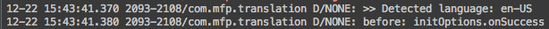

<!-- NLS_CHARSET=UTF-8 -->
## Visión general
{: #overview }
Utilice la infraestructura de {{ site.data.keys.product_full }} para añadir traducción multilingüe en aplicaciones JavaScript (Cordova, Web) en otros idiomas.  
Los elementos que se pueden traducir son mensajes del sistema y series de texto de la aplicación. 

#### Ir a:
{: #jump-to }
* [Traducción de series de la aplicación](#translating-application-strings)
* [Traducción de mensajes del sistema](#translating-system-messages)
* [Traducción multilingüe
](#multilanguage-translation)
* [Detección del idioma y entorno local del dispositivo](#detecting-the-device-locale-and-language)
* [Aplicación de ejemplo](#sample-application)

## Traducción de series de la aplicación
{: #translating-application-strings }
Las series destinadas a ser traducidas se almacenan en un objeto `JSON` denominado "Messages". 

- En aplicaciones de Cordova que utilizan {{ site.data.keys.product_adj }} SDK,
podrá encontrarlo en el archivo **index.js** de la aplicación Cordova: **[directorio-raíz-proyecto-cordova]/www/js/index.js**.
- En aplicaciones web, necesita añadirlo.

### Ejemplo de estructura de objeto JSON
{: #json-object-structure-example }

```javascript
var Messages = {
    headerText: "Default header",
    actionsLabel: "Default action label",
    sampleText: "Default sample text",
};
```

Se puede hacer referencia a las series almacenadas en el objeto `JSON` de dos formas en la lógica de la aplicación:

**Como una propiedad de objeto JavaScript:**

```javascript
Messages.headerText
```

**Como un ID de un elemento HTML con `class="translate"`:**

```html
<h1 id="headerText" class="translate"></h1>
```

## Traducción de mensajes del sistema
{: #translating-system-messages }
También es posible traducir los mensajes del sistema que la aplicación muestra, por ejemplo "La conexión de internet no está disponible" o "Nombre de usuario o contraseña no válidos". Los mensajes del sistema se almacenan en el objeto `WL.ClientMessages`.

**Nota:** Modifique los mensajes del sistema a un nivel de JavaScript global porque algunas partes del código se ejecutan únicamente después de que la aplicación se haya inicializado de forma satisfactoria.

### Aplicaciones web
{: #web-applications }
Encontrará una lista completa de mensajes del sistema en el archivo `messages.json`,
ubicado en la carpeta **[carpeta raíz proyecto]\node_modules\ibm-mfp-web-sdk\lib\messages\**.

### Aplicaciones de Cordova
{: #cordova-applications }
Encontrará una lista completa de mensajes del sistema en el archivo `messages.json`, que se encuentra dentro del proyecto generado.

- Android: `[Proyecto-cordova]\platforms\android\assets\www\plugins\cordova-plugin-mfp\worklight\messages`
- iOS, Windows: `[Proyecto-cordova]\platforms\[ios o windows]\www\plugins\cordova-plugin-mfp\worklight\messages`

Para traducir un mensaje de sistema, modifíquelo en el código de la aplicación.

```javascript
WL.ClienMessages.loading = "Application HelloWorld is loading... please wait.";
```

## Traducción multilingüe
{: #multilanguage-translation }
Con la ayuda de JavaScript es posible implementar una traducción multilingüe a su aplicación.  
En los siguientes pasos se explica la implementación de esta aplicación de ejemplo de esta guía de aprendizaje.

1. Configure las series de aplicación predeterminadas en el archivo `index.js`.

   ```javascript
   var Messages = {
        headerText: "Default header",
        actionsLabel: "Default action label",
        sampleText: "Default sample text",
        englishLanguage: "English",
        frenchLanguage: "French",
        russianLanguage: "Russian",
        hebrewLanguage: "Hebrew"
   };
   ```

2. Modifique las series específicas si es necesario.

   ```javascript
   function setFrench(){
        Messages.headerText = "Traduction";
        Messages.actionsLabel = "Sélectionnez une langue:";
        Messages.sampleText = "Ceci est un exemple de texte en français.";
   }
   ```

3. Actualice los componentes de la interfaz gráfica de usuario (GUI) con las nuevas series. Podrá realizar más tareas como, por ejemplo, obtener la dirección de escritura en los idiomas en los que se escribe de derecha a izquierda como, por ejemplo, el hebreo o el árabe. Cada vez que se actualiza un elemento, se actualiza con diferentes series de acuerdo al idioma activo.

   ```javascript
   function languageChanged(lang) {
        if (typeof(lang)!="string") 
            lang = $("#languages").val();
        
        switch (lang) {
            case "english":
                setEnglish();
                break;
            case "french":
                setFrench();
                break;
            case "russian":
                setRussian();
                break;
            case "hebrew":
                setHebrew();
                break;
        }
               
        if ($("#languages").val()=="hebrew")
            $("#wrapper").css({direction: 'rtl'});
        else
            $("#wrapper").css({direction: 'ltr'});
      
        $("#sampleText").html(Messages.sampleText);
        $("#headerText").html(Messages.headerText);
        $("#actionsLabel").html(Messages.actionsLabel);
   }
   ```

## Detección del idioma y entorno local del dispositivo
{: #detecting-the-device-locale-and-language }
Para detectar el idioma que utiliza el dispositivo o el navegador:

### Aplicaciones web
{: #web-applications-locale}
Detecte el idioma del navegador mediante `navigator.language` o con cualquiera de las soluciones e infraestructuras disponibles.

### Aplicaciones de Cordova
{: #cordova-applications-locale }
Detecte el entorno local y el idioma del dispositivo utilizando el plugin de globalización de Cordova:`cordova-plugin-globalization`.  
El plugin de globalización se instala de forma automática al añadir una plataforma a la aplicación Cordova.

Utilice las funciones `navigator.globalization.getLocaleName` y `navigator.globalization.getPreferredLanguage` para detectar el entorno local y el idioma respectivamente.

```javascript
navigator.globalization.getLocaleName(
	function (localeValue) {
		WL.Logger.debug(">> Detected locale: " + localeValue);
		
        ...
        ...
        ...
	},
	function() {
		WL.Logger.debug(">> Unable to detect locale.");
	}
);

navigator.globalization.getPreferredLanguage(
	function (langValue) {
		lang = langValue.value;
		WL.Logger.debug(">> Detected language: " + lang);
	},
	function() {
		WL.Logger.debug(">> Unable to detect language.");
	}
);
```

El resultado se puede ver en el registro del dispositivo, por ejemplo desde LogCat de Android Studio:  


## Aplicación de ejemplo
{: #sample-application }
[
Pulse para descargar](https://github.com/MobileFirst-Platform-Developer-Center/Translation) el proyecto de Cordova.

### Uso de ejemplo
{: #sample-usage }
Siga el archivo README.md de ejemplo para obtener instrucciones.

> <span class="glyphicon glyphicon-info-sign" aria-hidden="true"></span> **Sugerencia:** Puede inspeccionar el LogCat de Android desde la consola de LogCat de Android Studio mientras la aplicación está en ejecución.
