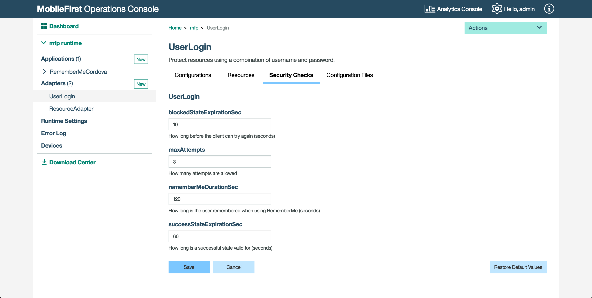

<!-- NLS_CHARSET=UTF-8 -->
## Visión general
{: #overview }

Las comprobaciones de seguridad constituyen el bloque de construcción de lado del servidor básico de la infraestructura de seguridad de {{ site.data.keys.product_adj }}. Una comprobación de seguridad es una entidad de lado del servidor que implementa una lógica de autorización, por ejemplo la obtención y validación de las credenciales del cliente. Proteja un recurso asignándole un ámbito que correlacione cero o más comprobaciones de seguridad. La infraestructura de seguridad asegura que solo se concede acceso al recurso a los clientes que superan todas las comprobaciones de seguridad del ámbito de protección. Puede utilizar comprobaciones de seguridad para autorizar acceso a los recursos alojados en {{ site.data.keys.mf_server }} y a los recursos de un servidor de recursos externo.

Un adaptador puede ser un adaptador de *recursos* (lo que significa que presenta recursos y contenido para enviar al cliente), un adaptador *SecurityCheck*, o **ambos**.

> <b>Nota:</b> Cuando las comprobaciones de seguridad se implementan en adaptadores, la infraestructura de seguridad {{ site.data.keys.product_adj }} y las API de adaptador se separan y no pueden mezclarse. Por lo tanto, no puede utilizar un API de adaptador, como la interfaz `AdpatersAPI` en el código de comprobación de seguridad, ni API de comprobación de seguridad en el código de recursos de adaptador.

La arquitectura de la infraestructura de seguridad es modular y flexible y, por lo tanto, la implementación de la comprobación de seguridad no es intrínsecamente independiente de cualquier recurso o aplicación. Puede reutilizar la misma comprobación de seguridad para proteger diferentes recursos y utilizar combinaciones de comprobación de seguridad diferentes para varios flujos de autorización. Para ampliar la flexibilidad, una clase de comprobación de seguridad expone las propiedades de configuración que pueden personalizarse al nivel de adaptador en la definición de comprobación de seguridad y durante el tiempo de ejecución de {{ site.data.keys.mf_console }}.

Para facilitar y acelerar el proceso de desarrollo, {{ site.data.keys.product }} proporciona implementaciones abstractas base de la interfaz de `SecurityCheck`. Se proporciona una implementación abstracta base de la interfaz de `SecurityCheckConfiguration` (`SecurityCheckConfigurationBase`), además de clases de configuración de comprobación de seguridad de muestras complementarias para cada una de las clases de comprobación de seguridad base proporcionadas. Empiece con la implementación de comprobación de seguridad base (y la configuración de muestra relacionada) que mejor se ajuste a sus necesidades de desarrollo y amplíe y modifique la implementación según proceda.

> Obtenga más información acerca del [contrato de comprobación de seguridad](contract).

**Requisitos previos:**

* Leer el tutorial [Conceptos de autorización](../).
* Aprenda a [crear adaptadores](../../adapters/creating-adapters).

**Uso:**  
Las clases base de comprobación de seguridad que se describen a continuación están disponibles como parte de la biblioteca Java Maven de {{ site.data.keys.product_adj }} `com.ibm.mfp.security.checks.base`, y se descargan al crear un adaptador del [repositorio central de Maven](http://search.maven.org/#search|ga|1|a%3A%22mfp-security-checks-base%22). Si está desarrollando fuera de línea, puede descargarlas en **{{ site.data.keys.mf_console }} → Centro de descargas → Separador Herramientas → Comprobaciones de seguridad**.

#### Ir a:
{: #jump-to }
* [Definición de comprobaciones de seguridad](#defining-a-security-check)
* [Implementación de comprobaciones de seguridad](#security-check-implementation)
* [Configuración de comprobaciones de seguridad](#security-check-configuration)
* [Comprobaciones de seguridad predefinidas](#predefined-security-checks)
* [A continuación](#what-s-next)

## Definición de comprobaciones de seguridad
{: #defining-a-security-check }

[Crear un adaptador Java o JavaScript](../../adapters/creating-adapters/) o utilizar uno existente.

> Al crear un adaptador Java, la plantilla predeterminada supone que el adaptador presentará **recursos**. Es elección del usuario empaquetar comprobaciones de seguridad y recursos en el mismo adaptador o separarlos en adaptadores distintos.

Para eliminar la implementación de **recursos** predeterminada, suprima los archivos **[NombreAdaptador]Application.java** y **[NombreAdaptador]Resource.java**. Elimine también el `<JAXRSApplicationClass>`elemento de **adapter.xml**.

En el archivo del adaptador Java **adapter.xml**, añada un elemento XML llamado `securityCheckDefinition`. Por ejemplo:

```xml
<securityCheckDefinition name="sample" class="com.sample.sampleSecurityCheck">
    <property name="successStateExpirationSec" defaultValue="60"/>
    <property name="blockedStateExpirationSec" defaultValue="60"/>
    <property name="maxAttempts" defaultValue="3"/>
</securityCheckDefinition>
```

* El atributo `name` es el nombre de la comprobación de seguridad.
* El atributo `class` especifica la clase de implementación Java de la comprobación de seguridad. Tiene que crear esta clase.
* Las comprobaciones de seguridad pueden [configurarse aún más](#security-check-configuration) con una lista de elementos `property`.
* Para definir propiedades personalizadas, consulte [Configuración de comprobaciones de seguridad](#security-check-configuration).

Después de desplegar correctamente un adaptador con una definición de comprobación de seguridad en {{ site.data.keys.mf_server }}, también puede ver la comprobación de seguridad y la información de configuración y realizar modificaciones de tiempo de ejecución, en **{{ site.data.keys.mf_console }} → Adaptadores → [su adaptador]**:

* En el separador **Archivos de configuración** puede ver la copia en servidor del descriptor de adaptador, incluido el `<securityCheckDefinition>` elemento que define la comprobación de seguridad personalizada y sus propiedades configurables. También puede [extraer la configuración de adaptador ](../../adapters/java-adapters/#custom-properties) y enviarla a distintos servidores.
* En el separador **Comprobaciones de seguridad** puede visualizar una lista de todas las propiedades de configuración que ha expuesto en la definición comprobación de seguridad. El valor del atributo `displayName` configurado o el valor del nombre de atributo cuando no se ha configurado ningún nombre hacen referencia a las propiedades. Si establece el atributo de descripción de la propiedad en la definición, también se muestra esta descripción. 
Para cada propiedad, el valor que se configura en el atributo `defaultValue` se muestra en el valor actual. Puede modificar el valor para sustituir el valor predeterminado de la definición de comprobación de seguridad. Puede restaurar los valores predeterminados de la definición de comprobación de seguridad en cualquier momento.
* También puede seleccionar la versión de aplicación de la sección **Aplicaciones** de {{ site.data.keys.mf_console }}.

## Implementación de comprobaciones de seguridad
{: #security-check-implementation }

Cree la **clase Java** para la comprobación de seguridad. La implementación debería ampliar una de las clases base proporcionadas, tal y como se muestra a continuación. La clase padre que escoja determinará el equilibrio entre la personalización y la simplicidad.

### Comprobación de seguridad
{: #security-check }
`SecurityCheck` es una **interfaz ** Java que define los métodos necesarios mínimos para representar la comprobación de seguridad.  
Es responsabilidad del desarrollador que implementa la verificación de seguridad para manejar cada escenario.

### ExternalizableSecurityCheck
{: #externalizablesecuritycheck }
Esta clase abstracta implementa una versión básica de la interfaz de comprobación de seguridad.  
Proporciona, entre otras opciones: externalización como JSON, tiempo de espera de inactividad, tiempo hasta el vencimiento, etc.

La subclase de esta clase proporciona flexibilidad en la implementación de la comprobación de seguridad.

> Obtenga más información en el tutorial [ExternalizableSecurityCheck](../externalizable-security-check).

### CredentialsValidationSecurityCheck
{: #credentialsvalidationsecurityCheck }
Esta clase amplia `ExternalizableSecurityCheck` e implementa gran parte de sus métodos para facilitar el uso. Deben implementarse dos métodos: `validateCredentials` y `createChallenge`. La implementación permite un número limitado de intentos de inicio de sesión durante un intervalo determinado, después del cual se bloquea la comprobación de seguridad para un período configurado. En caso de que se inicie sesión correctamente, el estado de la comprobación de seguridad sigue siendo satisfactorio para el periodo configurado, durante el cual el usuario puede acceder al recurso solicitado.

La clase `CredentialsValidationSecurityCheck` está pensada para que los flujos simples validen credenciales arbitrarias, para garantizar el acceso a un recurso. También se proporciona una capacidad incorporada para bloquear el acceso después de que también se proporcione un determinado número de intentos.

> Obtenga más información en los tutoriales [CredentialsValidationSecurityCheck](../credentials-validation/).

### UserAuthenticationSecurityCheck
{: #userauthenticationsecuritycheck}
Esta clase amplia `CredentialsValidationSecurityCheck` y, por lo tanto, hereda todas sus funciones. La clase le añade una implementación que crea un objeto de identidad de usuario `AuthenticatedUser` que puede utilizarse para identificar el usuario que ha iniciado sesión. Una capacidad incorporada para permitir que se proporcione, de forma opcional, un comportamiento de inicio de sesión "Recuérdame". Deben implementarse tres métodos: `createUser`, `validateCredentials`, y `createChallenge`.

> Obtenga más información en los tutoriales [Comprobación de seguridad UserAuthentication](../user-authentication/).

## Configuración de las comprobaciones de seguridad
{: #security-check-configuration }

Cada clase de implementación de comprobación de seguridad puede utilizar una clase `SecurityCheckConfiguration` que define las propiedades disponibles para esa comprobación de seguridad. Cada clase base `SecurityCheck` proporciona una clase `SecurityCheckConfiguration` correspondiente. Puede crear su propia implementación que amplia una de las clases base `SecurityCheckConfiguration` y la utiliza para su comprobación de seguridad personalizada.

Por ejemplo, el método `createConfiguration` de `UserAuthenticationSecurityCheck` devuelve una instancia de `UserAuthenticationSecurityCheckConfig`.

```java
public abstract class UserAuthenticationSecurityCheck extends CredentialsValidationSecurityCheck {
  @Override
  public SecurityCheckConfiguration createConfiguration(Properties properties) {
      return new UserAuthenticationSecurityCheckConfig(properties);
  }
}
```

`UserAuthenticationSecurityCheckConfig` habilita una propiedad denominada `rememberMeDurationSec` con un `0` como valor predeterminado.

```java
public class UserAuthenticationSecurityCheckConfig extends CredentialsValidationSecurityCheckConfig {

    public int rememberMeDurationSec;

    public UserAuthenticationSecurityCheckConfig(Properties properties) {
        super(properties);
        rememberMeDurationSec = getIntProperty("rememberMeDurationSec", properties, 0);
    }

}
```

<br/>
Estas propiedades pueden configurarse en varios niveles:

### adapter.xml
{: #adapterxml }
En el archivo de adaptador Java **adapter.xml**, en `<securityCheckDefinition>`, puede añadir uno o más `<property>` elementos.  
El `<property>` elemento tiene los atributos siguientes:

- **name**: El nombre de la propiedad como se define en la clase de configuración.
- **defaultValue**: Sustituye el valor predeterminado definido en la clase de configuración.
- **displayName**: *opcional*, un nombre descriptivo que se debe visualizar en la consola.
- **description**: *opcional*, una descripción que se debe visualizar en la consola.
- **type**: *opcional*, asegura que la propiedad es de un tipo específico como, por ejemplo, `integer`, `string`, `boolean`, o una lista de valores válidos (por ejemplo `type="['1','2','3']"`).

Ejemplo:

```xml
<property name="maxAttempts" defaultValue="3" displayName="How many attempts are allowed?" type="integer"/>
```

> Para ver un ejemplo real, consulte la [sección Configuración de una comprobación de seguridad](../credentials-validation/security-check/#configuring-the-security-check) del tutorial de comprobación de seguridad CredentialsValidation.

### {{ site.data.keys.mf_console }} - Adaptador
{: #mobilefirst-operations-console-adapter }
En {{ site.data.keys.mf_console }} → **[su adaptador] → separador Comprobación de seguridad**, puede modificar el valor de una propiedad definida en el archivo **adapter.xml**.  
Tenga en cuenta que en esta pantalla **solo** aparecen las propiedades definidas en el archivo **adapter.xml**; las propiedades definidas en la clase de configuración no aparecen aquí de forma automática.



También puede editar de forma manual el archivo JSON de configuración del adaptador con la configuración necesaria y enviar los cambios a {{ site.data.keys.mf_server }}.

1. Desde una **ventana de línea de mandatos**, navegue a la carpeta de raíz de proyecto y ejecute la `extracción del adaptador mfpdev`.
2. Abra el archivo de configuración ubicado en la carpeta **project-folder\mobilefirst**.
3. Edite el archivo y busque el objeto `securityCheckDefinitions`. En este objeto, busque o cree un objeto que se llame como la comprobación de seguridad que ha seleccionado. En el objeto de comprobaciones de seguridad, busque o añada un objeto de propiedades. Para cada propiedad de configuración disponible que quiera configurar, añada una pareja de propiedad de configuración nombre y valor en el objeto de propiedades. Por ejemplo:

   ```xml
   "securityCheckDefinitions": {
        "UserAuthentication": {
            "properties": {
                "maxAttempts": "4",
                "failureExpirationSec: "90"
            }
        }
   }
   ```

4. Despliegue el archivo JSON de configuración actualizando ejecutando el mandato: `envío de adaptador mfpdev`.

### {{ site.data.keys.mf_console }} - Aplicación
{: #mobilefirst-operations-console-application }
Los valores de propiedad también pueden sustituirse a nivel de aplicación.

En {{ site.data.keys.mf_console }} → **[su aplicación] → separador Seguridad**, en la sección **Configuraciones de comprobación de seguridad**, puede modificar los valores definidos en cada comprobación de seguridad disponible.


También puede editar de forma manual el archivo JSON de configuración del adaptador con la configuración necesaria y enviar los cambios a {{ site.data.keys.mf_server }}.

1. Desde una **ventana de línea de mandatos**, navegue a la carpeta de raíz de proyecto y ejecute `mfpdev app pull`.
2. Abra el archivo de configuración ubicado en la carpeta **project-folder\mobilefirst**.
3. Edite el archivo y busque el objeto `securityCheckConfigurations`. En este objeto, busque o cree un objeto que se llame como la comprobación de seguridad que ha seleccionado. En el objeto de comprobación de seguridad, añada una pareja de propiedad de configuración nombre valor para cada propiedad de configuración disponible que desee configurar. Por ejemplo:

   ```xml
   "SecurityCheckConfigurations": {
        "UserAuthentication": {
            "properties": {
                "maxAttempts": "2",
                "failureExpirationSec: "60"
            }
        }
   }
   ```

4. Despliegue el archivo JSON de configuración actualizando ejecutando el mandato: `mfpdev app push`.

## Comprobaciones de seguridad predefinidas
{: #predefined-security-checks }

Estas comprobaciones de seguridad predefinidas también están disponibles:

- [Autenticidad de aplicación](../application-authenticity/)
- [Actualización directa](../../application-development/direct-update)
- LTPA

## A continuación
{: #what-s-next }

Obtenga más información acerca de las comprobaciones de seguridad en los siguientes tutoriales.  
Recuerde que debe desplegar el adaptador cuando haya terminado de desarrollar o de realizar cambios.

* [Implementación de CredentialsValidationSecurityCheck](../credentials-validation/).
* [Implementación de UserAuthenticationSecurityCheck](../user-authentication/).
* Obtenga información adicional sobre {{ site.data.keys.product }} [las características de autenticación y seguridad](../).
