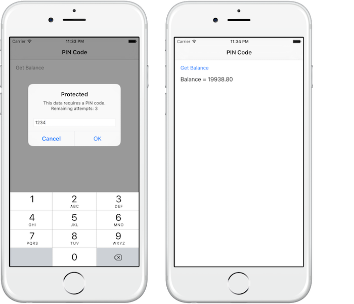

<!-- NLS_CHARSET=UTF-8 -->
## Visión general
{: #overview }
Al intentar acceder al recurso protegido, el servidor (la comprobación de seguridad) devuelve al cliente una lista que contiene uno o más **desafíos** que debe gestionar el cliente.  
Esta lista se recibe como un objeto `JSON`, listando el nombre de la comprobación de seguridad con un `JSON` opcional de datos adicionales:

```json
{
  "challenges": {
    "SomeSecurityCheck1":null,
    "SomeSecurityCheck2":{
      "some property": "some value"
    }
  }
}
```

A continuación, el cliente debe registrar un **manejador de desafíos** para cada comprobación de seguridad.  
El manejador de desafíos define el comportamiento del lado de cliente que es específico de la comprobación de seguridad.

## Creación del manejador de desafíos
{: #creating-the-challenge-handler }
Un manejador de desafíos es una clase que maneja desafíos enviados por {{ site.data.keys.mf_server }} como, por ejemplo, la visualización de una pantalla de inicio de sesión, la recopilación de credenciales y la devolución a la comprobación de seguridad.

En este ejemplo, la comprobación de seguridad es `PinCodeAttempts`, que se definió en [Implementación de CredentialsValidationSecurityCheck](../security-check). El desafío que ha enviado la comprobación de seguridad contiene el número de intentos restantes para iniciar sesión (`remainingAttempts`), y un `errorMsg` opcional.

Cree una clase Swift que amplíe `SecurityCheckChallengeHandler`:

```swift
open class PinCodeChallengeHandler : SecurityCheckChallengeHandlerSwift {

}
```

## Manejo de un desafío
{: #handling-the-challenge }
El requisito mínimo del protocolo `SecurityCheckChallengeHandler` es implementar el método `handleChallenge` que le solicite al usuario las credenciales. El método `handleChallenge` recibe el desafío `JSON` como `Dictionary`.

En este ejemplo, una alerta le solicita al usuario que introduzca el código PIN:

```swift
override open func handleChallenge(challengeResponse: [AnyHashable: Any]!) {
  var errorMsg : String
  if challengeResponse!["errorMsg"] is NSNull {
      errorMsg = "This data requires a PIN code."
    }
    else{
      errorMsg = challengeResponse!["errorMsg"] as! String
  }
  let remainingAttempts = challengeResponse!["remainingAttempts"] as! Int + 2;

  showPopup(errorMsg,remainingAttempts: remainingAttempts);
}
```

> La implementación de `showPopup` está incluida en la aplicación de ejemplo.

Si las credenciales son incorrectas, puede esperar que la infraestructura llame a `handleChallenge` de nuevo.

## Envío de la respuesta de comprobación
{: #submitting-the-challenges-answer }
Cuando se hayan recopilado las credenciales de la IU, utilice el método `submitChallengeAnswer(answer: [NSObject : AnyObject]!)` de `WLChallengeHandler` para devolver una respuesta a la comprobación de seguridad. En este ejemplo, `PinCodeAttempts` espera una propiedad denominada `pin` que contiene el código PIN enviado:

```swift
self.submitChallengeAnswer(["pin": pinTextField.text!])
```

## Cancelación del desafío
{: #cancelling-the-challenge }
En algunos casos, como cuando se pulsa el botón **Cancelar** en la IU, desea indicarle a la infraestructura que descarte este desafío por completo.

Para ello, llame:

```swift
self.cancel()
```

## Manejo de errores
{: #handling-failures }
Es posible que en algunos escenarios se produzca un error (por ejemplo, el número de intentos máximos alcanzado). Para manejar esta situación, implemente el método `handleFailure` de `SecurityCheckChallengeHandler`.
La estructura de `Dictionary` pasada como parámetro depende de la naturaleza del error.

```swift
override open func handleFailure(failureResponse: [AnyHashable: Any]!) {
    if let errorMsg = failureResponse["failure"] as? String {
        showError(errorMsg)
    }
    else{
        showError("Unknown error")
    }
}
```

> La implementación de `showError` se incluye en la aplicación de ejemplo.

## Manejador de logros
{: #handling-successes }

Opcionalmente, también puede optar por realizar otras tareas antes de que la infraestructura cierre el flujo del manejador de desafíos implementando `handleSuccess(successResponse: [AnyHashable: Any]!)` de SecurityCheckChallengeHandler. Una vez más, el contenido y la estructura del diccionario de logros depende de lo que envíe la comprobación de seguridad.

## Registro del manejador de desafíos
{: #registering-the-challenge-handler }
Para que el manejador de desafíos escuche los desafíos adecuados, debe pedirle a la infraestructura que se asocie con el manejador de desafíos con un nombre de comprobación de seguridad específico.

Para ello, inicialice el manejador de desafíos con la comprobación de seguridad de la siguiente manera:

```swift
var someChallengeHandler = SomeChallengeHandler(securityCheck: "securityCheckName”);
```

A continuación, debe **registrar** la instancia del manejador de desafíos:

```swift
WLClientSwift.sharedInstance().registerChallengeHandler(challengeHandler: someChallengeHandler);
```

En este ejemplo, en una línea:

```swift
WLClientSwift.sharedInstance().registerChallengeHandler(challengeHandler: PinCodeChallengeHandler(securityCheck: securityCheck));
```

**Nota:** Solo debería registrar el manejador de registros una vez en todo el ciclo de vida de aplicación. Se recomienda utilizar la clase de iOS AppDelegate para hacerlo.

## Aplicación de ejemplo
{: #sample-application }
El ejemplo **PinCodeSwift** es una aplicación iOS Swift que utiliza `WLResourceRequest` para obtener un saldo de banco.  
El método está protegido con un código PIN y un máximo de 3 intentos.

[Haga clic para descarga](https://github.com/MobileFirst-Platform-Developer-Center/SecurityCheckAdapters/tree/release80) el proyecto Maven SecurityAdapters.  
[Haga clic para descarga](https://github.com/MobileFirst-Platform-Developer-Center/PinCodeSwift/tree/release80) el proyecto nativo de iOS Swift.

### Uso de ejemplo
{: #sample-usage }
Siga el archivo README.md del ejemplo para obtener instrucciones.


