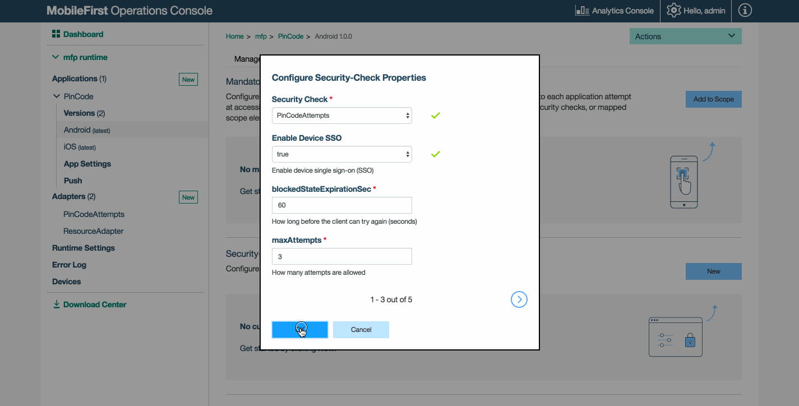

<!-- NLS_CHARSET=UTF-8 -->
## Visión general
{: #overview }
{{ site.data.keys.product_full }} ofrece una característica de inicio de sesión único que habilita la compartición del estado de  cualquier comprobación de seguridad personalizada entre varias aplicaciones en el mismo dispositivo.Por ejemplo, al utilizar el inicio de sesión único de dispositivo, los usuarios pueden iniciar sesión correctamente en una aplicación en su dispositivo y también autenticarse en otras aplicaciones del mismo dispositivo que utilizan la misma implementación. 

**Requisitos previos**: Asegúrese de leer los tutoriales [Autenticación y seguridad](../).

## Configuración del inicio de sesión único
{: #configuring-sso }
En {{ site.data.keys.mf_console }}:

1. Navegue a **[su aplicación] → Separador de seguridad →  Sección Configuraciones de comprobación de seguridad**.
2. Pulse el botón **Nuevo** para crear una comprobación de seguridad nueva, o el icono **Editar** si ya existe una configuración de comprobación de seguridad.
3. En el diálogo **Configurar propiedades de comprobación de seguridad**, establezca el valor **Habilitar inicio de sesión único de dispositivo** en **verdadero** y pulse `Aceptar`.

Repita estos pasos para cada una de las aplicaciones para las que desea habilitar el inicio de sesión único de dispositivo.



También puede editar el archivo JSON de configuración de la aplicación de forma manual con la configuración necesaria y enviar los cambios a {{ site.data.keys.mf_server }}.

1. Desde una **ventana de línea de mandatos**, navegue a la carpeta de raíz de proyecto y ejecute `mfpdev app pull`.
2. Abra el archivo de configuración ubicado en la carpeta **[project-folder]\mobilefirst**.
3. Edite el archivo para habilitar el inicio de sesión único de dispositivo de la comprobación de seguridad personalizada que ha seleccionado: inicio de sesión único de dispositivo se habilita estableciendo la propiedad `enableSSO` de una comprobación de seguridad personalizada en `true`. La configuración de propiedad se contiene en el objeto de comprobación de seguridad que se anida en un objeto de `securityCheckConfigurations`. Ubique estos objetos en el archivo descriptor de la aplicación o créelos si no los encuentra. Por ejemplo: 

   ```xml
   "securityCheckConfigurations": {
        "UserAuthentication": {
            ...
            ...
            "enableSSO": true
        }
   }
   ```
   
4. Despliegue el archivo JSON de configuración actualizando ejecutando el mandato: `mfpdev app push`.

## Utilización de un inicio de sesión único de dispositivo con un ejemplo preexistente
{: #using-device-sso-with-a-pre-existing-sample }
Lea el tutorial [Validación de credenciales](../credentials-validation/) ya que el ejemplo se utiliza para configurar el inicio de sesión único de dispositivo.   
Para esta demostración, se utiliza la aplicación de ejemplo de Cordova, aunque también puede hacerlo con las aplicaciones de ejemplo de iOS, Android y Windows.

1. Siga las [instrucciones de uso de ejemplo](../credentials-validation/javascript/#sample-usage).
2. Repita los pasos con un nombre de ejemplo y un identificador de aplicación diferentes.
3. Ejecute las dos aplicaciones en el mismo dispositivo. Tenga en cuenta que en cada aplicación se le solicitará el código PIN ("1234"). 
4. En {{ site.data.keys.mf_console }}, establezca `Enable Device SSO` en `true` para cada una  de las aplicaciones, tal y como se ha indicado anteriormente.
5. Salga de las aplicaciones y vuelva a intentarlo. En la primera aplicación que abra, se le solicitará que introduzca el código PIN pulsando el botón **Obtener saldo**. Cuando haya abierto la segunda aplicación y haya pulsado el botón **Obtener saldo**, no será necesario volver a introducir el código PIN para obtener el saldo.
Tenga en cuenta que la comprobación de seguridad `PinCodeAttempts` tiene una señal de vencimiento de 60 segundos. Por lo tanto, después de más de un intento pasados 60 segundos, la segunda aplicación le pedirá el código PIN.


