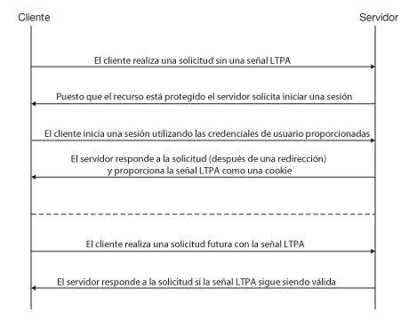
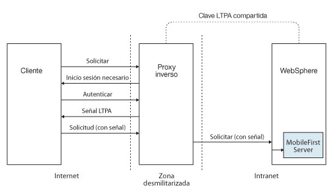
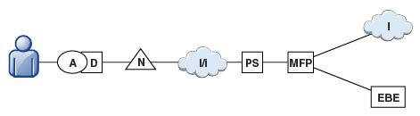
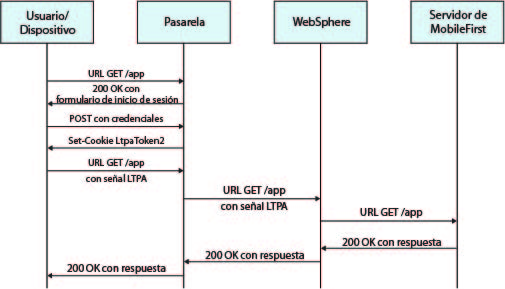

<!-- NLS_CHARSET=UTF-8 -->
## Visión general
{: #overview }
Una señal de LTPA (Lightweight Third Party Authentication) es un tipo de señal de seguridad que utilizan IBM WebSphere Application Server y otro tipo de productos IBM. La LTPA puede utilizarse para enviar las credenciales de un usuario autenticado a los servicios de fondo. También puede utilizarse en una señal de acceso de inicio de sesión único (SSO) entre el usuario y varios servidores. 

Cliente simple < - > flujo de servidor con LTPA:

Cuando un usuario inicia sesión en el servidor, este genera una señal LTPA, que es un hash cifrado que contiene información de usuario autenticada. La señal la firma una clave privada que se comparte entre todos los servidores que desean descodificarla. Normalmente, la señal tiene forma de cookie en los servicios HTTP. Al enviar la señal como una cookie, no es necesaria una interacción de usuario posterior.

Las señales LTPA tienen una hora de caducidad configurable para recudir la posibilidad de apropiación de sesión.

## Proxy inverso con LTPA
{: #reverse-proxy-with-ltpa }
La infraestructura también puede utilizar la señal LTPA para comunicarse con un servidor de fondo que actúe en nombre del usuario. En una topología de proxy inverso, el usuario no puede acceder directamente al servidor de fondo. El proxy inverso puede utilizarse para autenticar la identidad del usuario y luego enviar la señal LTPA del usuario autenticado a los servidores de fondo.Esta configuración asegura que no se puede obtener acceso a {{ site.data.keys.mf_server }}hasta que se autentique un usuario. Es útil, por ejemplo, cuando no quiere utilizar {{ site.data.keys.product }} para manejar credenciales de usuario vitales, o cuando desea utilizar una configuración de autenticación existente. Los entornos de empresa deberían utilizar un proxy inverso, como IBM WebSphere DataPower o IBM Security Access Manager, en la zona desmilitarizada y situar {{ site.data.keys.mf_server }} en la intranet.

En una implementación de proxy inverso, {{ site.data.keys.mf_server }} debe configurarse para que la autenticación LTPA obtenga la identidad de usuario.

Flujo LTPA entre el cliente y un servidor de fondo mediante un proxy inverso:

## Integración {{ site.data.keys.product_adj }} con un proxy inverso
{: #mobilefirst-integration-with-a-reverse-proxy }
Puede utilizar un proxy inverso para habilitar la conectividad empresarial en un entorno {{ site.data.keys.product_adj }} y proporcionar servicios de autenticación a {{ site.data.keys.product }}.

### Arquitectura general
{: #general-architecture }
Los proxies inversos presentan las instancias de {{ site.data.keys.mf_server }} como parte de un despliegue, tal y como se muestra en la siguiente figura, y siguen el patrón de pasarela. 

El icono **MFP** representa una instancia de {{ site.data.keys.mf_server }}. El icono **GW** representa una pasarela de proxy inverso, como WebSphere DataPower. Además de proteger los recursos de {{ site.data.keys.product_adj }} de internet, el proxy inverso concluye la autenticación y las conexiones HTTPS (SSL).El proxy inverso también puede actuar como punto de aplicación de políticas (PEP).

Cuando se utiliza una pasarela, una aplicación (**A**), en un dispositivo (**D**), utiliza el identificador uniforme de recursos (URI) público que la pasarela anuncia en lugar del URI de {{ site.data.keys.mf_server }}. El URI público puede exponerse como un valor de la aplicación o puede generarse cuando la aplicación pasa a producción, antes de que se publique en almacenes de aplicación públicos o privados. 

### Autenticación en la pasarela
{: #authentication-at-the-gateway }
Si la autenticación finaliza en la pasarela, un contexto compartido como, por ejemplo, una cabecera HTTP personalizada o una cookie, puede informar a {{ site.data.keys.product }} del usuario autenticado. Con la infraestructura de autenticación extensible, puede configurar {{ site.data.keys.product }} para que utilice la identidad de usuario de uno de estos mecanismos y establecer un inicio de sesión correcto. La figura que hay a continuación muestra un flujo de autenticación típico para esta topología de pasarela. 

Esta configuración se ha probado correctamente con WebSphere DataPower para la autenticación basada en LTPA. Si la autenticación se realiza correctamente, la pasarela envía una señal LPTA (en forma de cookie HTTP) a WebSphere Application Server, que valida la señal LTPA y crea un interlocutor principal. {{ site.data.keys.product }} puede utilizar este interlocutor principal cuando lo necesite.

## La comprobación de seguridad SSO basada en LTPA de {{ site.data.keys.product_adj }}
{: #the-mobilefirst-ltpa-based-sso-security-check }
La comprobación de seguridad de inicio de sesión único (SSO) basado en LTPA de {{ site.data.keys.product_adj }} predefinida (**LtpaBasedSSO**) habilita la integración de {{ site.data.keys.product }} con el protocolo de LTPA WebSphare Application Server. Esta comprobación de seguridad permite integrar instancias de {{ site.data.keys.mf_server }} en una topología de pasarela basada en LTPA, tal y como se describe en las secciones anteriores, y utilizar un servicio de fondo para autenticar los usuarios utilizando una señal LTPA SSO.

Esta comprobación de seguridad predefinida puede utilizarse como cualquier otra comprobación de seguridad en la infraestructura de seguridad de {{ site.data.keys.product_adj }}; puede correlacionar un elemento de ámbito personalizado a esta comprobación y utilizar dicha comprobación (o un elemento de ámbito que la contenga) en un ámbito de recurso de protección o en un ámbito de aplicación obligatorio. 

También puede configurar el comportamiento de la comprobación de seguridad de su aplicación.

## Configuración de una comprobación de seguridad SSO basada en LTPA
{: #configuring-the-ltpa-based-sso-security-check }
La comprobación de seguridad de inicio de sesión único (SSO) basada en LTPA (**LtpaBasedSSO**) tiene una propiedad configurable única: **expirationSec**. Esta propiedad establece el período de caducidad de un estado de comprobación de seguridad correcto. El período de caducidad determina el intervalo mínimo de invocación de una comprobación después de haberse ejecutado correctamente. 

> **Nota:** El procedimiento explica cómo utilizar {{ site.data.keys.mf_console }} para configurar el valor de propiedad.De forma alternativa, también puede establecer el valor de propiedad directamente en el archivo **application-descriptor**. Para obtener información detallada, consulte Configuración de las propiedades de comprobación de seguridad de aplicación.
1. Abra una ventana de {{ site.data.keys.mf_console }}. Seleccione la versión de aplicación en la **barra lateral de navegación**, y luego pulse el separador **Seguridad**.
2. En la sección **Configuración de la comprobación de seguridad**, pulse **Nueva**.
3. En la ventana **Configurar propiedades de comprobación de seguridad**, configure la comprobación de seguridad **SSO basada en LTPA**:
    * En el campo **Comprobación de seguridad**, seleccione **LtpaBasedSSO** de la lista.
    * En el campo **Estado correcto del período de caducidad(en segundos)**, establezca el período de caducidad preferido (en segundos) para que el estado de la comprobación de seguridad sea correcto. 

Cuando haya terminado, podrá ver y editar la configuración de la comprobación de seguridad LtpaBasedSSO en la tabla Configuración de la comprobación de seguridad del separador Seguridad de la aplicación. 
