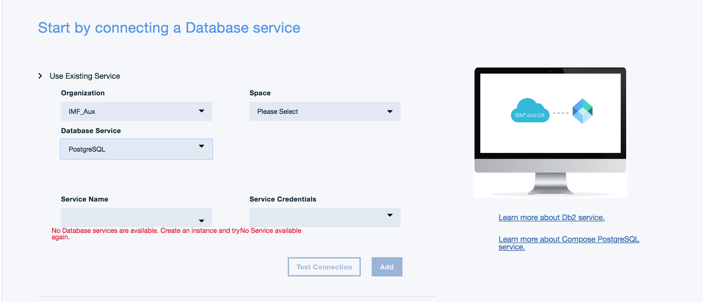
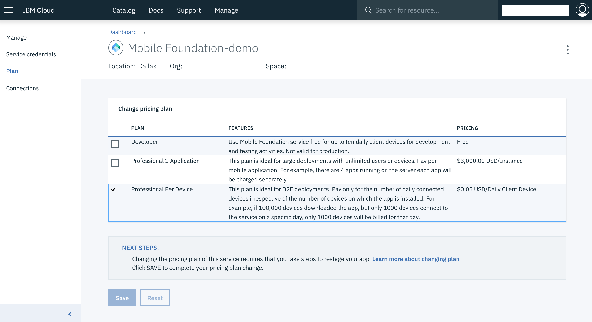

<!-- NLS_CHARSET=UTF-8 -->
## Visión general
{: #overview }
Esta guía de aprendizaje proporciona instrucciones paso a paso para configurar una instancia de  {{ site.data.keys.mfound_server }} en IBM Cloud utilizando el servicio {{ site.data.keys.mf_bm_full }} (**{{ site.data.keys.mf_bm_short }}**).  
{{ site.data.keys.mf_bm_short }} es un servicio de IBM Cloud que permite crear de forma rápida y fácil entornos de desarrollador o producción escalables de Mobile Foundation v8.0 en el **tiempo de ejecución de Liberty for Java**.

El servicio de {{ site.data.keys.mf_bm_short }} ofrece las siguientes opciones de planes:

1. **Desarrollador**: Este plan proporciona un {{ site.data.keys.mfound_server }} como una aplicación Cloud Foundry en un tiempo de ejecución de Liberty for Java. Los cargos relacionados con Liberty for Java se facturan aparte y no se incluyen en este plan. El plan no permite utilizar las bases de datos externas y está restringido para fines de desarrollo y prueba. Mobile Analytics se ofrece sin cargo adicional y los sucesos se conservan durante 6 meses. La instancia del *plan de desarrollador* del servidor de {{ site.data.keys.mf_bm_short }} le permite registrar cualquier número de aplicaciones móviles para desarrollo y pruebas, pero limita el número de dispositivos conectados a 10 al día. <!--This plan also includes {{ site.data.keys.mf_analytics_service }} service instance. If your usage exceeds the Mobile Analytics free tier entitlements, then charges apply as per Mobile Analytics basic plan.-->

    > **Nota:** El plan del desarrollador no ofrece una base de datos persistente, por lo tanto, asegúrese de que realiza una copia de seguridad, como se describe en la sección [Resolución de problemas](#troubleshooting).

2. **Profesional por dispositivo**: Este plan permite a los usuarios crear, probar y ejecutar hasta 5 aplicaciones en producción. Mobile Analytics se ofrece sin cargo adicional y los sucesos se conservan durante 6 meses. Este plan da soporte a despliegues de gran tamaño y a la alta disponibilidad. Este plan requiere que tenga una instancia de servicio de IBM Db2 (cualquier plan que no sea el plan **Lite**) o Compose for PostgreSQL, que se crea y se factura por separado. Este plan crea un servidor de Mobile Foundation en *Liberty for Java*, empezando con un mínimo de 2 nodos de 1 GB. Los cargos relacionados con *Liberty for Java* se facturan aparte y no se incluyen como parte de este plan. <!--Optionally, you can add  Mobile Analytics service instance. The Mobile Analytics service is billed separately.-->

3. **Profesional 1 aplicación**: Este plan permite a los usuarios crear, probar y ejecutar aplicaciones móviles en Mobile Foundation en producción. Mobile Analytics se ofrece sin cargo adicional y los sucesos se conservan durante 6 meses. Se factura en función del número de dispositivos cliente conectados al día. Este plan da soporte a despliegues de gran tamaño y a la alta disponibilidad. Este plan requiere que tenga una instancia de servicio de IBM Db2 (cualquier plan que no sea el plan **Lite**) o Compose for PostgreSQL, que se crea y se factura por separado. Este plan crea un servidor de Mobile Foundation en *Liberty for Java*, empezando con un mínimo de 2 nodos de 1 GB. Los cargos relacionados con *Liberty for Java* se facturan aparte y no se incluyen como parte de este plan. <!--Optionally, you can add {{ site.data.keys.mf_analytics_service }} service instance by clicking the **Add Analytics** button. The Mobile Analytics service is billed separately.-->

4. **Desarrollador Pro**: Este plan proporciona un {{ site.data.keys.mfound_server }} como una aplicación Cloud Foundry en un tiempo de ejecución de  Liberty for Java y permite a los usuarios desarrollar y probar cualquier número de aplicaciones móviles. Este plan requiere que tenga una instancia de servicio de **Db2** (cualquier plan que no sea el plan **Lite**). La instancia de servicio de Db2 se crea y se factura por separado. Este plan está limitado por tamaño y está pensado para ser utilizado en actividades de desarrollo y prueba y no en producción. Los cargos dependen del tamaño total del entorno. <!--Optionally, you can add a {{ site.data.keys.mf_analytics_service }} service by clicking the **Add Analytics** button.-->
>_El plan **Desarrollador Pro** está ahora en desuso._

5. **Profesional por capacidad:** Este plan permite a los usuarios crear, probar y ejecutar cualquier número de aplicaciones en producción, independientemente del número de usuarios móviles o dispositivos. Da soporte a despliegues de gran tamaño y a la alta disponibilidad. El plan requiere que tenga una instancia de servicio de **Db2** (cualquier plan que no sea el plan **Lite**). La instancia de servicio de Db2 se crea y se factura por separado. Los cargos dependen del tamaño total del entorno. <!--Optionally, you can add a {{ site.data.keys.mf_analytics_service }} service by clicking the **Add Analytics** button.-->
>_El plan **Profesional por capacidad** está ahora en desuso._

> [Consulte los detalles de servicio](https://console.bluemix.net/catalog/services/mobile-foundation/) para obtener más información acerca de los planes disponibles y su facturación.

#### Ir a:
{: #jump-to}
- [Configuración del servicio Mobile Foundation](#setting-up-the-mobile-foundation-service)
  - [Configuración del plan de *desarrollador*](#setting-up-the-developer-plan)
  - [Configuración del plan *Profesional de una aplicación* y *Profesional por dispositivo*](#setting-up-the-professional-1-application-and-professional-per-device-plan)
- [Utilización del servicio Mobile Foundation](#using-the-mobile-foundation-service)
  - [Configuración del servidor](#server-configuration)
  - [Configuración avanzada del servidor](#advanced-server-configuration)
- [Migración del plan de servicio de Mobile Foundation](#migrating-mobile-foundation-service-plan)  
- [Aplicación de arreglos en el servidor de Mobile Foundation](#applying-mobile-foundation-server-fixes)
- [Acceso a los registros del servidor](#accessing-server-logs)
    - [Rastreo](#tracing)
- [Resolución de problemas](#troubleshooting)
- [Lectura adicional](#further-reading)

## Configuración del servicio {{ site.data.keys.mf_bm_short }}
{: #setting-up-the-mobile-foundation-service }
Para configurar los planes disponibles, en primer lugar siga estos pasos:

1. Vaya a [bluemix.net](http://bluemix.net), inicie sesión y pulse **Catálogo**.
2. Busque **Mobile Foundation** y pulse la opción de mosaico resultante.
3. *Opcional*. Escriba un nombre personalizado para la instancia de servicio o utilice el nombre predeterminado que se proporciona.
4. Seleccione el plan de precios que desea y, a continuación, pulse **Crear**.

    

### Configuración del plan de *desarrollador*
{: #setting-up-the-developer-plan }

La creación del servicio {{ site.data.keys.mf_bm_short }} crea   {{ site.data.keys.mfound_server }}.
  * Puede acceder y trabajar de forma instantánea con {{ site.data.keys.mfound_server }}.
  * Para acceder a {{ site.data.keys.mfound_server }} con CLI necesita las credenciales que están disponibles cuando pulsa **Credenciales de servicio** en el panel de navegación de la consola de IBM Cloud.

  

### Configuración de los planes *Profesional de una aplicación* y *Profesional por dispositivo*
{: #setting-up-the-professional-1-application-n-professional-per-device-plan }
1. Estos planes requieren una instancia de base de datos externa de [Db2 (cualquier plan que no sea el plan **Lite**)](https://console.bluemix.net/catalog/services/db2/).

    * Si ya tiene una instancia de servicio de Db2, seleccione la opción **Utilizar servicio existente** y proporcione sus credenciales:

        

    * Si ya tiene una instancia de servicio de Compose for PostgreSQL, seleccione la opción **Utilizar servicio existente** y proporcione sus credenciales:

        


    * Si aún no tiene una instancia de servicio de Db2 ni de Compose for PostgreSQL, seleccione la opción **Crear nuevo servicio** y siga las instrucciones de la pantalla:

       

2. Inicie {{ site.data.keys.mfound_server }}.
    - Puede conservar la configuración del servidor en su nivel básico y pulsar **Iniciar servidor básico**, o
    - Actualizar la configuración del servidor en el separador [Valores](#advanced-server-configuration) y pulsar **Iniciar el servidor avanzado**.

    Durante este paso se genera una aplicación Cloud Foundry para el servicio {{ site.data.keys.mf_bm_short }} y se inicializa el entorno Mobile Foundation. Este paso puede tardar entre 5 y 10 minutos.

3. Con la instancia preparada, puede [utilizar el servicio](#using-the-mobile-foundation-service).

    

## Utilización del servicio Mobile Foundation
{: #using-the-mobile-foundation-service }

Cuando se ejecuta {{ site.data.keys.mfound_server }} verá el panel de control siguiente:


<!--Click on **Add Analytics** to add {{ site.data.keys.mf_analytics_service }} support to your server instance.
Learn more in the [Adding Analytics support](#adding-analytics-support) section.-->

* Pulse **Iniciar consola** para abrir {{ site.data.keys.mf_console }}. El nombre de usuario predeterminado es *admin* y se puede detectar la contraseña pulsando el icono de ojo en el campo de contraseña.

  

* Pulse en **Analytics Console** desde la {{ site.data.keys.mf_console }} para abrir la consola de Mobile Analytics y ver los datos analíticos, como se muestra a continuación.

  


### Configuración del servidor
{: #server-configuration }
La instancia de servidor básica consta de:

* Un nodo único (tamaño de servidor: "pequeño")
* 1 GB de memoria
* 2 GB de capacidad de almacenamiento

### Configuración de servidor avanzada
{: #advanced-server-configuration }
Con el separador **Valores**, puede personalizar adicionalmente la instancia del servidor con

* Combinaciones de nodos, memoria y almacenamiento variables
* Contraseña admin de {{ site.data.keys.mf_console }}
* Claves LTPA
* Configuración JNDI
* Registro de usuarios
* Almacén de confianza

  *Creación del certificado de almacén de confianza para el servicio Mobile Foundation:*

  * Utilice *cacerts* del JDK Java 8 del fixpack más reciente de IBM Java u Oracle Java.

  * Importe el certificado adicional en el almacén de confianza mediante el mandato siguiente:
    ```
    keytool -import -file firstCA.cert -alias firstCA -keystore truststore.jks
    ```

  >**Nota**: puede optar por crear su propio almacén de confianza, pero el certificado predeterminado debe estar disponible para que el servicio Mobile Foundation funcione correctamente

<!--* {{ site.data.keys.mf_analytics_service }} configuration-->
* VPN


<!--
## Adding {{ site.data.keys.mf_analytics_service }} support
{: #adding-analytics-support }
You can add {{ site.data.keys.mf_analytics_service }} support to your {{ site.data.keys.mf_bm_short }} service instance by clicking on **Add Analytics** from the service's Dashboard page. This action provisions a {{ site.data.keys.mf_analytics_service }} service instance.

>When you create or recreate the **Developer** plan instance of {{ site.data.keys.mf_bm_short }} service, the {{ site.data.keys.mf_analytics_service }} service instance is added by default.
-->
<!--* When using the **Developer** plan this action will also automatically hook the {{ site.data.keys.mf_analytics_service }} service instance to your {{ site.data.keys.mf_server }} instance.  
* When using the **Developer Pro**, **Professional Per Capacity** or **Professional 1 Application** plans, this action will require additional input from you to select: amount of available Nodes, available Memory and a storage volume. -->
<!--
Once the operation finishes, reload the {{ site.data.keys.mf_console }} page in your browser to access the {{ site.data.keys.mf_analytics_service_console }}.  

> Learn more about {{ site.data.keys.mf_analytics_service }} in the [{{ site.data.keys.mf_analytics_service }} category](../../analytics).

##  Removing {{ site.data.keys.mf_analytics_service }} support
{: #removing-analytics-support}

You can remove the {{ site.data.keys.mf_analytics_service }} support for your {{ site.data.keys.mf_bm_short }} service instance by clicking on **Delete Analytics**  from the service’s Dashboard page. This action deletes the {{ site.data.keys.mf_analytics_service }} service instance.

Once the operation finishes, reload the {{ site.data.keys.mf_console }} page in your browser.
-->
<!--
##  Switching from Analytics deployed with IBM Containers to Analytics service
{: #switching-from-analytics-container-to-analytics-service}

>**Note**: Deleting {{ site.data.keys.mf_analytics_service }} will remove all available analytics data. This data will not be available in the new {{ site.data.keys.mf_analytics_service }} instance.

User can delete current container by clicking on **Delete Analytics** button from service dashboard. This will remove the analytics instance and enable the **Add Analytics** button, which the user can click to add a new {{ site.data.keys.mf_analytics_service }} service instance.
-->

## Migración del plan de servicio de Mobile Foundation
{: #migrating-mobile-foundation-service-plan }

Las instancias de Mobile Foundation creadas utilizando los planes en desuso deben actualizarse a los nuevos planes. Es posible que la actualización del plan también sea necesaria en función del uso de la instancia.

### Caso de ejemplo de muestra: Migrar del plan Profesional por dispositivo al plan Profesional 1 aplicación

1. En el panel de control de IBM Cloud, seleccione la instancia de servicio de IBM Mobile Foundation que desee migrar.
2. Seleccione **Plan** en la navegación de la izquierda.
   
3. En los planes de tarifas de la lista, seleccione Professional 1 Application.

4. Pulse en el botón **Guardar** y confirme la migración del plan.
     La migración a Professional 1 Application ya se ha completado y todos los datos existentes se conservan. La facturación se ha modificado y no hay tiempo de inactividad.
5. Tras la migración del plan, es necesario volver a crear la instancia de Mobile Foundation desde el panel de control de servicio para que la configuración correcta entre en vigor. Esta actualización requiere un tiempo de inactividad breve. Deberá realizar una planificación para el tiempo de inactividad. Seleccione **Gestionar** desde la navegación de la izquierda y pulse **Volver a crear**.

>**Nota:** Si está en uno de los planes en desuso, deberá migrar a un plan nuevo.

### Migraciones de plan soportadas

* El plan *Developer* en desuso solo se puede actualizar al nuevo plan *Developer*.
* El plan *Developer Pro* (en desuso) solo se puede actualizar a los planes *Profesional por dispositivo* o *Profesional 1 aplicación*.
* El plan *Profesional por capacidad* (en desuso) solo se puede actualizar a los planes *Profesional por dispositivo* o *Profesional 1 aplicación*.
* El plan *Profesional por dispositivo* solo se puede actualizar al plan *Profesional 1 aplicación*.
* El plan *Profesional 1 aplicación* solo se puede actualizar al plan *Profesional por dispositivo*.
* No se ofrece soporte a la actualización del plan para el plan *Desarrollador* nuevo.

## Aplicación de arreglos en el servidor de Mobile Foundation
{: #applying-mobile-foundation-server-fixes }
Las actualizaciones de los servicios de {{ site.data.keys.mf_bm }} se aplican de forma automática sin intervención humana, salvo aceptar que se lleve a cabo la actualización. Cuando está disponible una actualización, en la página Panel de control del servicio se muestra un banner con las instrucciones y los botones de acción.

## Acceso a los registros del servidor
{: #accessing-server-logs }
Para acceder a los registros del servidor, siga los pasos siguientes.

**Escenario 1:**

1. Configure su máquina host.<br/>
   Para gestionar la app IBM Cloud Cloud Foundry, debe instalar Cloud Foundry CLI.<br/>
   Instale [Cloud Foundry CLI](https://github.com/cloudfoundry/cli/releases).
2. Abra el terminal e inicie sesión en su *Organización* y *Espacio* mediante `cf login`.
3. Ejecute el mandato siguiente en CLI:
```bash
  cf ssh <mfp_Appname> -c "/bin/cat logs/messages.log" > messages.log
```
4. Solo si está habilitado el rastreo, ejecute el mandato siguiente:
```bash
cf ssh <mfp_Appname> -c "/bin/cat logs/trace.log" > trace.log
 ```

**Escenario 2:**      

* Para acceder a los registros del servidor, abra la barra de navegación lateral y pulse **Aplicaciones → Panel de control → Cloud Foundry Apps**.
* Seleccione su aplicación y pulse **Registros → Ver en Kibana**.
* Seleccione y copie los mensajes de registro.


#### Rastreo
{: #tracing }
Para habilitar el rastreo de modo que puedan verse los mensajes de nivel DEBUG del archivo **trace.log**:

1. En **Tiempo de ejecución → SSH**, seleccione su instancia de servicio en el recuadro combinado (los ID de instancia comienzan por **0**).
2. Vaya a cada instancia de la consola y abra el archivo `/home/vcap/app/wlp/usr/servers/mfp/configDropins/overrides/tracespec.xml` con el editor vi.
3. Actualice la siguiente sentencia de rastreo: `traceSpecification="=info:com.ibm.mfp.*=all"` y guarde el archivo.

Ahora el archivo **trace.log** está disponible en la ubicación especificada arriba.


## Resolución de problemas
{: #troubleshooting }
El plan Desarrollador no ofrece una base de datos persistente, lo que puede provocar que se pierdan datos. Para solucionar rápidamente estos casos, asegúrese de que sigue los métodos recomendados:

* Cada vez que realiza cualquiera de las acciones siguientes en el extremo del servidor:
    * Despliegue un adaptador o actualizar cualquier configuración de adaptador o valor de propiedad
    * Realice cualquier configuración de seguridad, tal como la correlación de ámbitos o similar

    Ejecute el mandato siguiente en la línea de mandatos para descargar su configuración en un archivo .zip:

  ```bash
  $curl -X GET -u admin:admin -o export.zip http://<App Name>.mybluemix.net/mfpadmin/management-apis/2.0/runtimes/mfp/export/all
  ```

* En el caso de que vuelva a crear su servidor o pierda su configuración, ejecute lo siguiente en la línea de mandatos para importar la configuración al servidor:

  ```bash
  $curl -X POST -u admin:admin -F file=@./export.zip http://<App Name>.mybluemix.net/mfpadmin/management-apis/2.0/runtimes/mfp/deploy/multi
  ```

## Lectura adicional
{: #further-reading }
Ahora que la instancia de {{ site.data.keys.mfound_server }} está activa y en ejecución,

* Familiarícese con  [{{ site.data.keys.mf_console }}](../../product-overview/components/console).
* Obtenga experiencia con Mobile Foundation con estas [Guías de aprendizaje de inicio rápido](../../quick-start).
* Lea todas las [guías de aprendizaje disponibles](../../all-tutorials/).
