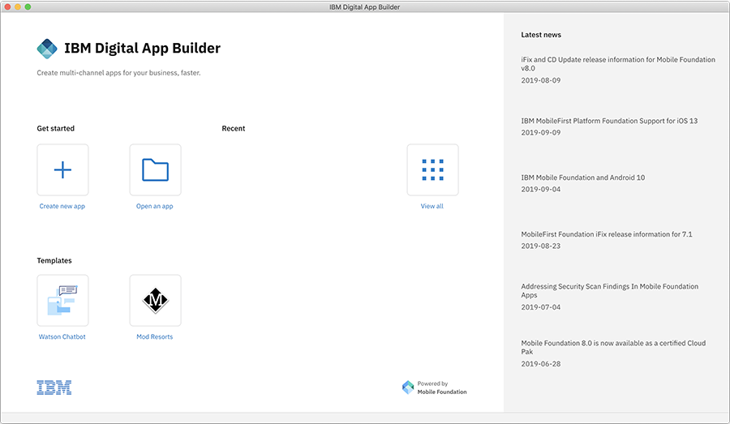
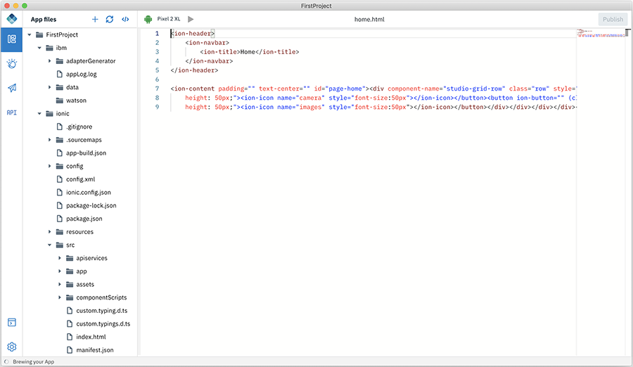

<!-- NLS_CHARSET=UTF-8 -->
## Visión general
{: #getting-started }

Iniciar Digital App Builder desde:

* En **MacOS**, efectúe una doble pulsación en el **icono de IBM Digital App Builder** para abrir Digital App Builder. 
* En **Windows**, inicie Digital App Builder seleccionando **Inicio > Programas > IBM Digital App Builder**.

>**Nota**: Si se abre Digital App Builder por primera vez, **Acepte** la **Licencia para utilizar IBM Digital App Builder** en la pantalla para continuar. Después de aceptar el acuerdo de licencia, la **Comprobación de requisitos previos** se ejecuta automáticamente por primera vez. Pulse **Aceptar** para continuar, si no se han encontrado errores, de lo contrario, corrija los errores y, a continuación, reinicie Digital App Builder. 

Puede **Crear aplicación** o **Abrir aplicación** o utilizar las plantillas disponibles para continuar trabajando con su aplicación. 
>**Nota**: Las aplicaciones recién creadas se mostrarán bajo la sección **Reciente**. Para la nueva instalación, no se mostrará la sección **Reciente**. 

### Creación de una aplicación
{: #create-new-app }

>**Nota**: Cree la nueva aplicación en dos modalidades: La modalidad **Diseño** - que ayuda a diseñar la aplicación mediante el método de arrastrar y soltar y la modalidad **Código** - que ayuda a diseñar la aplicación en la modalidad del editor de código. 

Cree una nueva aplicación pulsando el icono **Crear aplicación** desde el panel de control del constructor. 

1. Pulse el icono **Crear aplicación**. Se visualizará la ventana **Seleccionar canal**. 

    

2. Seleccione el canal para el que desea desarrollar la aplicación, pulsando en el icono correspondiente. Más adelante, puede añadir más canales a la misma aplicación. 

    * **Android**: Seleccione esta opción si está creando una aplicación android.
    * **iOS**: Seleccione esta opción si está creando una aplicación iOS.
        >**Nota**: Puede crear y ejecutar aplicaciones de iOS sólo en MacOS.
    * **Web**: Seleccione esta opción si está creando la aplicación para la web.
    * **PWA**: Seleccione esta opción si está creando una aplicación PWA (Progressive Web App). 

3. Cuando el servidor de desarrollo integrado está activo y en ejecución, se capturan automáticamente los detalles del servidor. Si el servidor de desarrollo no se está ejecutando, puede conectar con su propia instancia de IBM Mobile Foundation creada en IBM Cloud o localmente. 

    En la ventana **Configurar la instancia de IBM Mobile Foundation**, seleccione un servidor existente o cree un nuevo servidor.

    >**Nota**: para obtener fácilmente una instancia de Mobile Foundation Server, puede suministrarla en IBM Cloud. Consulte la documentación sobre cómo se suministra y se utiliza Mobile Foundation Server en IBM Cloud [aquí](https://cloud.ibm.com/docs/services/mobilefoundation?topic=mobilefoundation-getting-started).

    
 
    La ventana **Configurar la instancia de IBM Mobile Foundation** muestra la lista de instancias de servidor de Mobile Foundation que ha definido anteriormente. Cuando selecciona el servidor, se muestran el **URL de servidor**, el **Nombre de usuario administrador** y la **Contraseña de administrador**. Para definir un nuevo servidor, puede pulsar el enlace **Crear nuevo servidor**. Esto mostrará la nueva ventana **Configurar la instancia de IBM Mobile Foundation**. 

    

    * Especifique los nuevos detalles de la instancia de IBM Mobile Foundation como, por ejemplo, **Nombre de servidor**, **URL de servidor**, **Nombre de usuario administrador** y **Contraseña de administrador**.
        >**Nota**: Puede obtener el URL de servidor y las credenciales de inicio de sesión desde el panel de control del servidor de Mobile Foundation para la instancia de servidor seleccionada. 
    * Opcionalmente, proporcione un **Nombre de usuario** (nombre de usuario de cliente confidencial) y una **Contraseña de administrador**, para obtener una vista previa de los datos en el visor de datos. 
    * Pulse **Conectar**.

4. Al iniciar sesión/conectarse correctamente, se visualiza la ventana **Crear aplicación** donde puede seleccionar una definición de aplicación existente que puede haber creado o crear una nueva especificando los detalles.  
    * Para una nueva aplicación:  
        * Proporcione el **Nombre** de la aplicación, la **Ubicación** en la que se almacenarán los archivos del proyecto, **Proyecto/ID de paquete** y la **Versión** de la aplicación.  
 
            

        * Pulse **Crear** para crear la aplicación. Esto muestra las ventanas **Modalidad de selección**. 

            

        * Seleccione la modalidad Diseño o Código y pulse **Cómo empezar**.
            * Modalidad Diseño - le permite crear la aplicación arrastrando y soltando los controles a un lienzo. 
            * Modalidad Código - le permite crear la aplicación escribiendo código o utilizando fragmentos de código. 
        * Si ha seleccionado la modalidad de diseño, cuando pulsa **Cómo empezar** se muestra la pantalla emergente **Bienvenido al entorno de trabajo**.
            
        * Pulse **Empecemos** para visualizar el espacio de trabajo de Digital App Builder para crear una nueva aplicación en la modalidad de diseño. 

            

        * Si ha seleccionado la modalidad de código, cuando pulsa **Empecemos** se muestra el espacio de trabajo de Digital App Builder para crear una nueva aplicación en la modalidad de código. 

            

### Cómo abrir una aplicación existente
{: #open-an-existing-app }
 
>**Nota**: Puede abrir una aplicación existente que únicamente se haya desarrollado con Digital App Builder. De forma predeterminada, la aplicación se abre en modalidad de diseño. 

Puede abrir una aplicación existente de una de las siguientes maneras: 

* Pulsar **Abrir una aplicación** desde la página de inicio abre el explorador de archivos. Vaya hasta la carpeta del proyecto de su aplicación y pulse **Aceptar** para abrir la aplicación para editarla. 
* Opcionalmente, puede abrir la aplicación desde la lista de aplicaciones recientes, si se lista, realizando una doble pulsación en el nombre de dicha aplicación. 

    >**Nota**: Si ha seleccionado un proyecto existente desarrollado en modalidad de diseño, se abrirá en modalidad de diseño. Si ha desarrollado el proyecto en modalidad de código, el proyecto se abrirá en modalidad de código.  

* Seleccione una aplicación existente y especifique la **Ubicación** en la que se almacenarán los archivos, el **ID de proyecto/paquete** y la **Versión** de la aplicación.
* Pulse **Abrir**. Esto muestra las ventanas **Modalidad de selección**. 

    

* Seleccione la modalidad Diseño o Código y pulse **Cómo empezar**.
    * Modalidad Diseño - le permite crear la aplicación arrastrando y soltando los controles a un lienzo. 
    * Modalidad Código - le permite crear la aplicación escribiendo código o utilizando fragmentos de código. 
* Si ha seleccionado la modalidad de diseño, cuando pulsa **Empecemos** se muestra el espacio de trabajo de Digital App Builder para actualizar una aplicación existente. 

    

* Si ha seleccionado la modalidad de código, cuando pulsa **Empecemos** se muestra el espacio de trabajo de Digital App Builder para actualizar una aplicación existente. 

    
