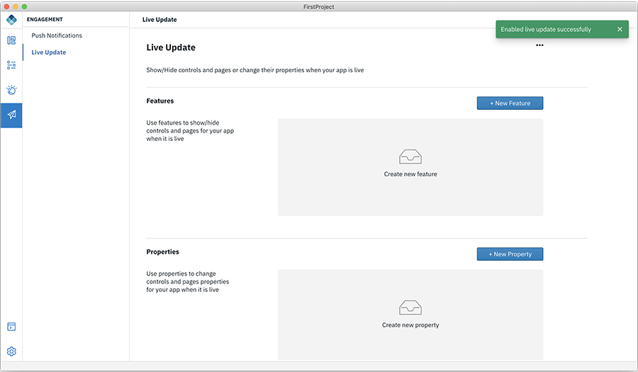

<!-- NLS_CHARSET=UTF-8 -->
## Conmutar características utilizando Live Update
{: #dab-feature-toggle-live-update }

Utilice Live Update para que los diferentes aspectos de su aplicación sean configurables, para activar o desactivar características de forma remota. Asimismo, controle dinámicamente las propiedades de la aplicación cambiando los valores de las variables directamente desde
MobileFirst Operations Console. 

* La **característica ** es un valor binario on/off que se utiliza para activar o desactivar una característica de aplicación. 
* Las **propiedades** son los pares de nombre y valor que se pueden utilizar para controlar el comportamiento de la aplicación. 

>**Nota**: Live Update solo estará disponible cuando la aplicación esté lista. 

### Habilitación de Live Update

Puede habilitar la característica Live Update utilizan el método siguiente:

1. Seleccione **Compromiso**. Esto mostrará la lista de servicios disponibles. 

    

2. Seleccione **Live Update** y pulse **Habilitar**. Esto configurará Live Update en el servidor de Mobile Foundation. Una vez se ha habilitado correctamente Live Update, se muestra una ventana emergente. 

    

3. Pulse **+ Nueva característica** para definir una nueva característica en el servidor de Mobile Foundation. Esto muestra la pantalla siguiente. 

    

4. Escriba el **ID de característica** y el **Nombre de característica**, y establece la **Visibilidad** predeterminada.

    * **ID de característica** - Un identificador único para su característica. 
    * **Nombre de característica** - Asigne un nombre para describir su característica  

5. Pulse **Crear**.

6. Del mismo modo, defina la propiedad de Update proporcionando los detalles siguientes: 

    * **ID de propiedad**
    * **Nombre de propiedad**
    * **Valor de propiedad**

### Trabajar con Live Update en modalidad de diseño 

En la modalidad de diseño, después de habilitar la opción Live Update, puede modificar **Valor de texto**, **Color de texto** o **Color de fondo** para el control seleccionado y actualizar los cambios de Live Update definiendo una nueva propiedad o puede crear y editar una propiedad existente. Puede modificar el valor de propiedad en la tabla de Live Updates que incluye la lista de características y propiedades asociadas. 

#### Asociar un control a una característica 

Para asociar un control a una característica: 

1. Pulse un control para seleccionarlo.  
2. Defina una nueva característica pulsando el signo **+** para la opción **Seleccionar una característica** en la sección **Mostrar/ocultar controles**.  
3. En el caso de la nueva característica, proporcione valores para **ID de característica** y **Nombre de característica** y habilite o inhabilite la visibilidad utilizando el conmutador de **activar/desactivar**. 

#### Modifique la propiedad de un control 

Para modificar la propiedad de un control: 

Seleccione un control y escriba **${nombre_propiedad}** o seleccione la propiedad que se ha de asociar en la lista, o cree una nueva propiedad seleccionando **Añadir nueva propiedad** y proporcione valores para **ID de propiedad**, **Nombre de propiedad**, **Valor de propiedad**.
 
Puede utilizar los siguientes controles y propiedades con Live Update:

* **Botón** - Valor de texto, Color de texto, Color de fondo
* **Cabecera** - Valor de texto, Color de texto 
* **Etiqueta** - Valor de texto, Color de texto 

### Añadir Live Update en modalidad de código 

Para añadir Live Update a su aplicación: 

**Método 1**

1. Abra la aplicación en modalidad de código 
2. Vaya a `projectname/ionic/src/app/app.component.ts`

    

3. Vaya al método inicializar live update. 
4. Edite el código para mostrar/ocultar un control y propiedad para establecer la propiedad del control. 

**Método 2**

1. Abra la aplicación en modalidad de código. 
2. Vaya al fragmento de código y púlselo **</>**.
3. En **Live Update**, arrastre y suelte el fragmento de código **Característica Live Update** o **Propiedad de Live Update**. 

    

4. Edite el código para mostrar/ocultar un control y propiedad para establecer la propiedad del control. 
