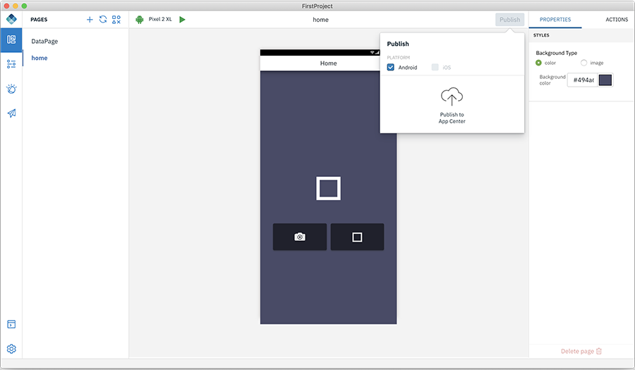

<!-- NLS_CHARSET=UTF-8 -->

## Publicación de una aplicación en App Center
{: #dab-app-publish }

IBM MobileFirst Foundation Application Center es un repositorio de aplicaciones móviles similar a los almacenes de aplicaciones públicos pero enfocado en las necesidades de una organización o equipo. Es un almacén de aplicaciones privado. Para obtener más información acerca de APP Center, consulte [aquí](http://mobilefirstplatform.ibmcloud.com/tutorials/en/foundation/8.0/appcenter/app-center-tutorial/). 

Puede añadir su aplicación al repositorio en el servidor utilizando la función **Publicar** en Digital App Builder.

>**Nota**: Asegúrese de que se aplicación se ha compilado sin ningún error antes de publicarla en App Center.

1. En su proyecto de aplicación, pulse **Publicar**. Se abrirá una ventana emergente con las plataformas seleccionadas. 

    

2. Pulse **Publicar en App Center**.

    

3. Seleccione un App Center existente o pulse **Conectar nuevo**. Pulse **Conectar**.
4. Esto creará el paquete para la plataforma seleccionada. 
5. *Solo para iOS*: Edite el archivo *app-build.json* y actualice el campo `developmentTeam` con su ID de equipo de desarrolladores de Apple. Para obtener el ID de equipo, inicie sesión en la [Cuenta de desarrollador de Apple](https://developer.apple.com/account/#/membership). 

    

6. Pulse **Publicar** cuando los paquetes estén listos. 
7. Una vez publicados correctamente, se genera el código QR. 

    

8. Puede verificar si la aplicación está disponible en App Center iniciando sesión en **App Center** > **Gestión de aplicaciones**.

>**Nota**: Puede volver a seleccionar la plataforma necesaria y compilar y publicar la aplicación en **App Center**.

