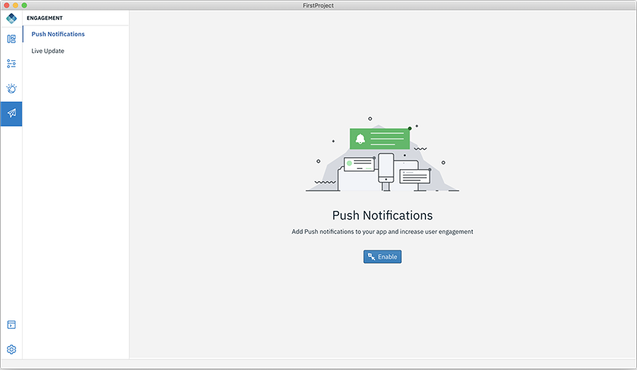

<!-- NLS_CHARSET=UTF-8 -->
## Añadir notificaciones push a una aplicación 
{: #dab-engagement-push }

Puede añadir notificaciones push a la aplicación y aumentar el compromiso de los usuarios. 

Para añadir notificaciones push a la aplicación:

1. Seleccione **Compromiso**. Esto mostrará la lista de servicios disponibles. 

    

2. Seleccione **Notificaciones push** y pulse **Habilitar**. Se mostrará la página de configuración de notificaciones push. 

3. Configure la notificación push para Android proporcionando la **Clave de secreto de API** y el **ID de remitente** y pulse **Guardar configuración**. 

    

4. Vaya al separador de iOS y proporcione detalles de configuración de push: seleccione el **Entorno**, proporcione el archivo .p12 con la vía de acceso y especifique la **Contraseña** y pulse **Guardar configuración**. 

    

5. Realice el paso adicional siguiente para iOS:
    * Abra el proyecto xcode `<path_to_app>/ionic/platforms/ios/<app>.xcodeproj` y habilite la función de notificaciones push. Para obtener más detalles, consulte [https://help.apple.com/xcode/mac/current/#/devdfd3d04a1](https://help.apple.com/xcode/mac/current/#/devdfd3d04a1).

6. En el lado del servidor, 
 
    * Siga [http://mobilefirstplatform.ibmcloud.com/tutorials/en/foundation/8.0/notifications/sending-notifications/#setting-up-notifications](http://mobilefirstplatform.ibmcloud.com/tutorials/en/foundation/8.0/notifications/sending-notifications/#setting-up-notifications) para habilitar las notificaciones push en el lado del servidor.

    * Siga [http://mobilefirstplatform.ibmcloud.com/tutorials/en/foundation/8.0/notifications/sending-notifications/#sending-notifications](http://mobilefirstplatform.ibmcloud.com/tutorials/en/foundation/8.0/notifications/sending-notifications/#sending-notifications) para enviar notificaciones desde el servidor

**Nota**:
las notificaciones push desde el servidor MFP se utilizan para habilitar el servicio de notificaciones. Por lo tanto, si antes se ha utilizado el servicio de notificaciones push de IBM Cloud, siga el enlace para configurar las notificaciones en el servidor MFP [http://mobilefirstplatform.ibmcloud.com/tutorials/en/foundation/8.0/notifications/sending-notifications/#setting-up-notifications](http://mobilefirstplatform.ibmcloud.com/tutorials/en/foundation/8.0/notifications/sending-notifications/#setting-up-notifications).

