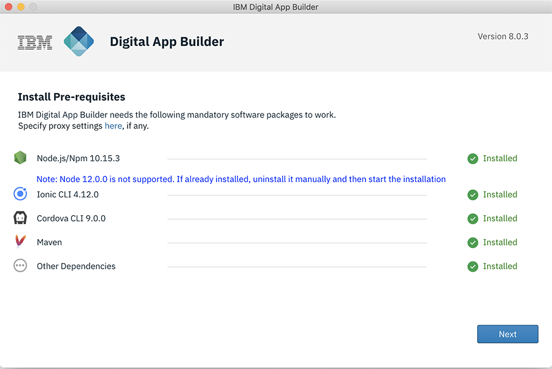

<!-- NLS_CHARSET=UTF-8 -->
## Visión general
{: #installation-and-configuration }

Ahora puede instalar Digital App Builder en las plataformas MacOS y Windows. La instalación también incluye el software de requisito previo que se instala y se verifica durante la primera instalación. Puede instalar Java, Xcode y Android Studio para la generación de adaptadores y para realizar una vista previa de la app durante el desarrollo.

### Instalación en MacOS
{: #installing-on-macos }

1. Descargue el archivo .dmg (**IBM.Digital.App.Builder-n.n.n.dmg**, donde `n.n.n` es el número de versión) desde [IBM Passport Advantage](https://www.ibm.com/software/passportadvantage/) o desde [aquí](https://github.com/MobileFirst-Platform-Developer-Center/Digital-App-Builder/releases).
2. Efectúe una doble pulsación en el archivo .dmg para montar el instalador.
3. En la ventana que abre el instalador, arrastre y suelte IBM Digital App Builder en la carpeta **Aplicaciones**.
4. Efectúe una doble pulsación en el icono IBM Digital App Builder para abrirlo.
    >**Nota**: cuando se instala Digital App Builder por primera ver, Digital App Builder abre la interfaz para instalar el software de requisito previo.
    
    

5. Pulse **Iniciar instalación**. Se mostrará la pantalla de acuerdo de licencia.

    

6. Acepte el acuerdo de licencia y pulse **Siguiente**. Se mostrará la pantalla **Instalar requisitos previos**.
    >**Nota**: se realiza una comprobación para ver si el software de requisito previo ya está instalado y se muestra el estado de cada elemento de software.

    

7. Pulse **Instalar** para configurar el software de requisito previo, si alguno de los requisitos previos está en estado **Pendiente de instalar**.

    

8. Después de instalar el software de requisito previo, se muestra la pantalla de inicio de Digital App Builder. Pulse **Iniciar compilación**.

    

9. *Opcional*: después de instalar el software de requisito previo, el instalador comprueba si está instalado JAVA, ya que Digital App Builder necesita JAVA para trabajar con los conjuntos de datos. 
    >**Nota**: tiene que instalar JAVA manualmente si aún no está instalado. Para instalar Java, consulte el apartado sobre [Instalación de Java](https://www.java.com/en/download/help/download_options.xml).
10. *Opcional*: el instalador también comprueba la instalación opcional de Xcode (para realizar una vista previa de una app en el simulador de iOS durante el desarrollo, solo para MacOS) y de Android Studio (para realizar una vista previa de una app Android, para MacOS y Windows).
    >**Nota**: tiene que instalar Xcode y Android Studio manualmente si aún no están instalados. Para una instalación de Cocoapods, consulte [Utilización de CocoaPods](https://guides.cocoapods.org/using/using-cocoapods). Para una instalación de Android Studio, consulte [Instalación de Android Studio](https://developer.android.com/studio/). 

>**Nota**: en cualquier momento puede realizar una [comprobación de requisitos previos](#prerequisites-check) para verificar que la instalación resulta adecuada para desarrollar su app. En caso de que se produzca algún error, rectifique el error y reinicie Digital App Builder antes de crear una aplicación.

### Instalación en Windows
{: #installing-on-windows }

Ejecute los siguientes mandatos desde el indicador de mandatos abierto en la modalidad administrativa:

1. Descargue el archivo .exe (**IBM.Digital.App.Builder.Setup.n.n.n.exe**, donde `n.n.n` es el número de versión)) desde [IBM Passport Advantage](https://www.ibm.com/software/passportadvantage/) o desde [aquí](https://github.com/MobileFirst-Platform-Developer-Center/Digital-App-Builder/releases).
2. Efectúe una doble pulsación en el ejecutable de Digital App Builder para realizar la instalación.

    

3. Pulse **Iniciar instalación**. Se mostrará la pantalla de acuerdo de licencia.

    

4. Acepte el acuerdo de licencia y pulse **Siguiente**. Se mostrará la pantalla **Instalar requisitos previos**.
    >**Nota**: se realiza una comprobación para ver si el software de requisito previo ya está instalado y se muestra el estado de cada elemento de software.

    

5. Pulse **Instalar** para configurar el software de requisito previo, si alguno de los requisitos previos está en estado **Pendiente de instalar**.

    

6. Después de instalar el software de requisito previo, se muestra la pantalla de inicio de Digital App Builder. Pulse **Iniciar compilación**.

    

    >**Nota**: también se crea un atajo en **Inicio > Programas** en el escritorio. La carpeta de instalación predeterminada es `<AppData>\Local\IBMDigitalAppBuilder\app-8.0.2`.

7. *Opcional*: después de instalar el software de requisito previo, el instalador comprueba si está instalado JAVA, ya que Digital App Builder necesita JAVA para trabajar con los conjuntos de datos. 
    >**Nota**: tiene que instalar JAVA manualmente si aún no está instalado. Para instalar Java, consulte el apartado sobre [Instalación de Java](https://www.java.com/en/download/help/download_options.xml).
8. *Opcional*: el instalador también comprueba la instalación opcional de Xcode (para realizar una vista previa de una app en el simulador de iOS durante el desarrollo, solo para MacOS) y de Android Studio (para realizar una vista previa de una app Android, para MacOS y Windows).
    >**Nota**: tiene que instalar Android Studio manualmente. Para una instalación de Android Studio, consulte [Instalación de Android Studio](https://developer.android.com/studio/). 

>**Nota**: en cualquier momento puede realizar una [comprobación de requisitos previos](#prerequisites-check) para verificar que la instalación resulta adecuada para desarrollar su app. En caso de que se produzca algún error, rectifique el error y reinicie Digital App Builder antes de crear una aplicación.

### Comprobación de requisitos previos
{: #prerequisites-check }

Puede realizar una comprobación de requisitos previos seleccionando **Ayuda > Comprobación de requisitos previos** antes de desarrollar una aplicación.

En caso de que se produzca algún error, rectifique el error y reinicie Digital App Builder antes de crear una aplicación.

>**Nota**: Únicamente con MacOS se requiere [CocoaPods](https://guides.cocoapods.org/using/using-cocoapods).

