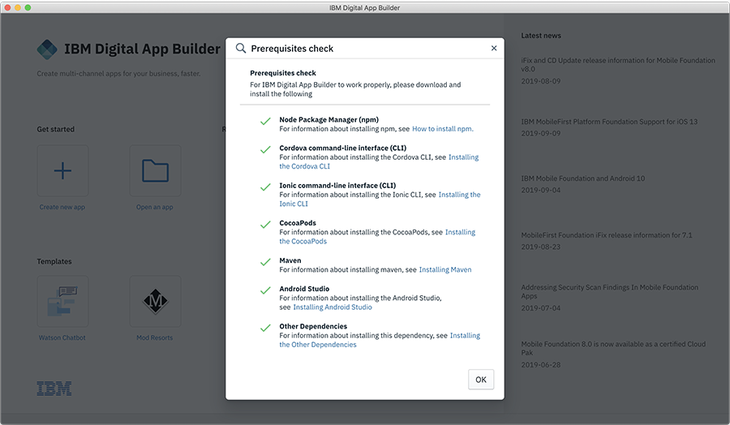

<!-- NLS_CHARSET=UTF-8 -->
## Visión general
{: #installation-and-configuration }

Puede instalar Digital App Builder en las plataformas MacOS y Windows.

### Instalación en MacOS
{: #installing-on-macos }

1. Instale **Node.js** y **npm** descargando la configuración desde [https://nodejs.org/en/download](https://nodejs.org/en/download) (Node.js 8.x o superior). Para obtener más información sobre las instrucciones de instalación, consulte [aquí](https://nodejs.org/en/download/package-manager/). Compruebe la versión de nodo y npm tal como se muestra a continuación:
    ```java
    $node -v
    v8.10.0
    $npm -v
    6.4.1
    ```
2. Instale **Cordova**. Puede descargar e instalar el paquete desde [Cordova](https://cordova.apache.org/docs/en/latest/guide/cli/index.html).
    ```java
    $ npm install -g cordova
    $ cordova –version
    7.0.1
    ```

    >**Nota**: Si se encuentra con problemas de permisos ejecutando el mandato `$ npm install -g cordova`, eleve sus privilegios para realizar la instalación (`$ sudo npm install -g cordova`).

3. Instale **ionic**. Puede descargar e instalar el paquete desde [ionic](https://ionicframework.com/docs/cli/).
    ```java
    $ npm install -g ionic
    $ ionic –version
    4.2.0
    ```

    >**Nota**: Si se encuentra con problemas de permisos ejecutando el mandato `$ npm install -g ionic`, eleve sus privilegios para realizar la instalación (`$ sudo npm install -g ionic`).

4. Descargue el archivo .dmg (**IBM.Digital.App.Builder-8.0.0.dmg**) desde [IBM Passport Advantage](https://www.ibm.com/software/passportadvantage/) o desde [aquí](https://github.com/MobileFirst-Platform-Developer-Center/Digital-App-Builder/releases). 
5. Efectúe una doble pulsación en el archivo .dmg para montar el instalador.
6. En la ventana que abre el instalador, arrastre y suelte IBM Digital App Builder en la carpeta **Aplicaciones**. 
7. Efectúe una doble pulsación en el icono IBM Digital App Builder para abrirlo. 
>**Nota**: Cuando Digital App Builder se instala por primera vez, abre la interfaz y realiza una [Comprobación de requisitos previos](#prerequisites-check). En caso de que se produzca algún error, rectifique el error y reinicie Digital App Builder antes de crear una aplicación.  

### Instalación en Windows
{: #installing-on-windows }

Ejecute los siguientes mandatos desde el indicador de mandatos abierto en la modalidad administrativa: 

1. Instale **Node.js** y **npm** descargando la configuración desde [https://nodejs.org/en/download](https://nodejs.org/en/download) (Node.js 8.x o superior). Para obtener más información sobre las instrucciones de instalación, consulte [aquí](https://nodejs.org/en/download/package-manager/). Compruebe la versión de nodo y npm tal como se muestra a continuación:       

    ```java
    C:\>node -v
    v8.10.0
    C:\>npm -v
    6.4.1
    ```

2. Instale **Cordova**. Puede descargar e instalar el paquete desde [Cordova](https://cordova.apache.org/docs/en/latest/guide/cli/index.html).
    

    ```java
    C:\>npm install -g cordova
    C:\>cordova –v
    7.0.1
    ```

3. Instale **ionic**. Puede descargar e instalar el paquete desde [ionic](https://ionicframework.com/docs/cli/).
    

    ```java
    C:\>npm install -g ionic
    C:\> ionic –version
    4.2.0
    ``` 

4. Descargue el archivo .exe (**IBM.Digital.App.Builder.Setup.8.0.0.exe**) desde [IBM Passport Advantage](https://www.ibm.com/software/passportadvantage/) o desde [aquí](https://github.com/MobileFirst-Platform-Developer-Center/Digital-App-Builder/releases).
5. Efectúe una doble pulsación en el ejecutable de Digital App Builder para realizar la instalación. También se crea un atajo en **Inicio > Programas** en el escritorio. La carpeta de instalación predeterminada es `<AppData>\Local\IBMDigitalAppBuilder\app-8.0.0`.
>**Nota**: Cuando Digital App Builder se instala por primera vez, abre la interfaz y realiza una [Comprobación de requisitos previos](#prerequisites-check). En caso de que se produzca algún error, rectifique el error y reinicie Digital App Builder antes de crear una aplicación.  

### Comprobación de requisitos previos
{: #prerequisites-check }

Puede realizar una comprobación de requisitos previos seleccionando **Ayuda > Comprobación de requisitos previos** antes de desarrollar una aplicación. 



En caso de que se produzca algún error, rectifique el error y reinicie Digital App Builder antes de crear una aplicación.  

>**Nota**: Únicamente con MacOS se requiere [CocoaPods](https://guides.cocoapods.org/using/using-cocoapods). 

