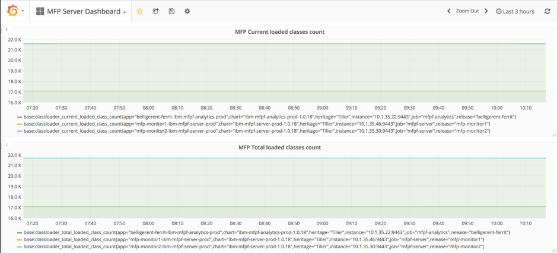

<!-- NLS_CHARSET=UTF-8 -->
## Visión general
{: #overview }

Esta guía de aprendizaje describe cómo integrar **Prometheus** para supervisar Mobile Foundation en ejecución en IBM Cloud Private.

IBM Mobile Foundation proporciona capacidad de supervisión mediante la habilitación de la característica `mpMetrics-1.0` para supervisar Mobile Foundation Server, Analytics y Application Center que se instrumentan con la API de *métricas de MicroProfile*. Esto ayuda a supervisar las métricas en el nivel de JVM y del sistema de sus contenedores Mobile Foundation desplegados en ICP.

El formato de respuesta predeterminado para la API `/metrics` es un formato de texto, compatible con **Prometheus**.


## Procedimiento
{: #procedure}

Realice los pasos siguientes para configurar la supervisión de Mobile Foundation en {{ site.data.keys.prod_icp }}.

### Paso 1: Desplegar el servicio IBM Monitoring
a.  Despliegue el servicio Monitoring desde el catálogo de {{ site.data.keys.prod_icp }}.<br/>
b.  Vaya a **Catálogo**, seleccione el gráfico Helm **ibm-icpmonitoring** e instálelo. El gráfico Helm se instalará en su {{ site.data.keys.prod_icp }}.<br/>
    

### Paso 2: Actualizar la configuración *configmap* de **Prometheus**

Ejecute el mandato siguiente desde un terminal de origen adecuado, que es una instancia de CLI que tiene la información de configuración contextual del clúster de ICP:<br/>
```bash
kubectl get svc | grep prometheus
```
<br/>
Verá que el gráfico `ibm-icpmonitoring` despliega una serie de servicios. En esta guía de aprendizaje nos centraremos en el servicio `<name used for the helm release>-promethues` (mfp-prometheus-prometheus) y lo utilizaremos, tal como se muestra en la captura de pantalla siguiente:<br/>


<br/>
Cada uno de estos servicios tiene un objeto *configmap* asociado. Para obtener los datos de métricas de los pods de Mobile Foundation, debe modificar el objeto *configmap* asociado con el servicio **mfp-prometheus-prometheus** añadiendo la anotación `mfpfserver` para Mobile Foundation Server, la anotación `mfpfanalytics` para Analytics y la anotación `mfpfappcenter` para Application Center al despliegue de servicios, junto con algunos otros atributos.<br/>
La manera más sencilla de hacerlo es editar el objeto *configmap* que se desea desde un terminal de origen mediante el mandato siguiente:<br/>
```bash
  kubectl edit configmap mfp-prometheus-prometheus
  ```
<br/>
Este mandato mostrará el archivo YAML solicitada en el editor vi.  Desplácese hasta el final del archivo e inserte el texto siguiente, inmediatamente antes de la línea `kind: ConfigMap`.

Configuración de métricas de Mobile Foundation Server, fragmento de código YAML siguiente:<br/>

```yaml
# Configuration for MFP Server Monitoring
- job_name: 'mfpf-server'
scheme: 'https'
basic_auth:
  username: 'mfpRESTUser'
  password: 'mfpadmin'
tls_config:
  insecure_skip_verify: true
kubernetes_sd_configs:
  - role: endpoints
relabel_configs:
  - source_labels: [__meta_kubernetes_service_annotation_mfpfserver]
    action: keep
    regex: true
  - source_labels: [__address__, __meta_kubernetes_service_annotation_prometheus_io_port]
    action: replace
    target_label: __address__
    regex: (.+)(?::\d+);(\d+)
    replacement: $1:$2
  - action: labelmap
    regex: __meta_kubernetes_service_label_(.+)
```    
<br/>

Configuración de la supervisión de comprobación de estado de Mobile Foundation Server, fragmento de código YAML siguiente:<br/>

```yaml
# Configuration for MFP Health check  Monitoring<br/>
- job_name: 'mfp-healthcheck'
metrics_path: /mfpadmin/management-apis/2.0/diagnostic/healthCheck
scheme: 'https'
basic_auth:
  username: 'admin'
  password: 'admin'
tls_config:
  insecure_skip_verify: true
kubernetes_sd_configs:
  - role: endpoints
relabel_configs:
  - source_labels: [__meta_kubernetes_service_annotation_mfpfserver]
    action: keep
    regex: true
  - source_labels: [__address__, __meta_kubernetes_service_annotation_prometheus_io_port]
    action: replace
    target_label: __address__
    regex: (.+)(?::\d+);(\d+)
    replacement: $1:$2
  - action: labelmap
    regex: __meta_kubernetes_service_label_(.+)
```
<br/>
> **Nota:** Los despliegues de Analytics y Application Center de Mobile Foundation siguen la configuración similar de métricas.

Valor de los cambios de *job_name* y *source_labels* tal como se han descrito anteriormente.
  
### Paso 3: Volver a cargar la configuración de **Prometheus** tras actualizar los trabajos
Ejecute el mandato curl siguiente:<br/>
```cURL
curl -s -XPOST http://<dirección ip del nodo de proxy>:31271/-/reload
```
<br/>


### Paso 4: Supervisión de las estadísticas de Mobile Foundation

a. Vaya a la consola de **Prometheus** desde un navegador utilizando el URL: <br/>
```
http://<dirección IP del nodo de proxy>:31271
```
b. En la consola de **Prometheus**, pulse primero en **Estado** y a continuación seleccione **Destinos** en el menú desplegable, tal como se muestra en la captura de pantalla siguiente:<br/>
  
c. Debería ver todos los **Destinos** cuyas estadísticas obtiene Prometheus.<br/>
  <br/>
  
<br/>
  Esta captura de pantalla muestra claramente los **Destinos** Mobile Foundation Server, Analytics y Application Center. Consulte el valor del atributo *job_name* del archivo YAML *configmap* que se muestra en el paso 2.<br/>
  Hemos ampliado nuestro despliegue de ejemplo a dos réplicas, y es por esto que **Prometheus** muestra que el servidor reúne dos puntos finales.<br/>

  Si pulsa en **Gráfico** en la consola de **Prometheus** y en el panel subsiguiente, pulse **insertar métrica en el cursor** tal como se muestra en la siguiente captura de pantalla:<br/>
  

  Verá una serie de métricas que puede supervisar la configuración actual de **Prometheus**. Entre las métricas de la larga lista, los nombres de métrica que empiezan por **base:** son los contenedores de Mobile Foundation con los que ha contribuido la característica `mpMetrics-1.0`.<br/>
  

  Si selecciona alguna métrica de Liberty (por ejemplo, **base:thread_count**), puede ver los valores de ambos pods de Mobile foundation Server en el gráfico de Prometheus, tal como se muestra en la captura de pantalla siguiente:<br/>
  

  Puede explorar otras métricas relevantes en **Prometheus** en formato gráfico así como en formato numérico pulsando **Consola**.<br/>
  También puede ampliar sus despliegues. En un breve periodo de tiempo, el número de puntos finales en la consola de Prometheus coincidirá con el número de réplicas.  <br/>

  >**Nota:** Aunque hemos utilizado texto sin cifrar para las contraseñas en el archivo *configmap* de Prometheus, Prometheus no mostrará la contraseña cuando se visualice su configuración en el panel de Prometheus.

### Paso 5: Ver métricas en el panel **Grafana**
Los gráficos Helm de Mobile Foundation contiene archivos jason de panel Grafana de ejemplo. El servicio de supervisión desplegado en el paso 1 tiene Grafana aplicado.<br/>

La importación de un panel Grafana desde un archivo JSON se realiza de la forma siguiente:<br/>

* Inicie Grafana desde el servicio de supervisión desplegado.<br/>
  <b>Cargas de trabajo -> Versiones de Helm -> `<name used for the helm release>`(ej.: mfp-prometheus) -> Iniciar)</b>

* Descargue el archivo de panel JSON desde [GitHub](https://github.ibm.com/IBMPrivateCloud/charts/tree/master/stable/ibm-mfpf-server-prod/additionalFiles/ibm-mfpf-server-prod-grafanadashboard.json) en su estación de trabajo local.   <br/>

* Pulse el botón *Inicio* en la interfaz de Grafana y a continuación pulse **Importar panel**.<br/>

* Pulse el botón **Cargar archivo .json** y seleccione el archivo JSON del panel Grafana de su sistema de archivos local.<br/>

* Seleccione **prometheus** en el menú **Seleccionar un origen de datos**, si no está seleccionado aún.<br/>

* Pulse **Importar**.<br/>

Un ejemplo de panel de supervisión par Mobile Foundation Server se muestra en la captura de pantalla siguiente:<br/>



