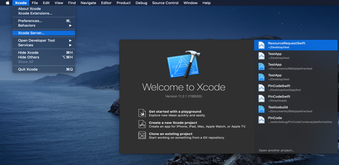

<!-- NLS_CHARSET=UTF-8 -->

Mobile Foundation in Cloud Pak for Apps está empaquetado con las interconexiones Tekton para automatizar las tareas DevOps comunes relacionadas con Mobile Foundation.

>Los pasos para desplegar Mobile Foundation on OpenShift Container Platform (OCP) son los mismos independientemente de cómo haya obtenido la titularidad de OCP.

## Requisitos previos
{: #prereqs}

A continuación se muestran los requisitos previos antes de iniciar el proceso de instalación de la instancia de Mobile Foundation Operator. 

- La instancia de [Cloud Pak For Apps](https://cloud.ibm.com/catalog/content/ibm-cp-applications) con Mobile Foundation instalado.
- [CLI de OpenShift](https://docs.openshift.com/enterprise/3.1/cli_reference/get_started_cli.html#installing-the-cli) (`oc`).
- Tekton (disponible como parte de Cloud Pak for Apps)


## Interconexiones Tekton 
{: #tekton-pipelines}

Las siguientes interconexiones Tekton están disponibles con Mobile Foundation on Cloud Pak for Apps.

1.	Mobile App Configuration Pipeline (*mobile-app-registration-pipeline*)
2.	Mobile App Build Pipeline for Android (*mobile-app-build-android-pipeline*)
3.	Mobile App Build Pipeline for iOS (*mobile-app-build-ios-pipeline*)
4.	Mobile App Distribution Pipeline (*application-center-deploy*)


### Pasos para ejecutar las interconexiones 
{: #steps-for-running-the-pipelines}

* [Descargue](https://www.ibm.com/software/passportadvantage/pao_customer.html) el proyecto PPA for Mobile Foundation.
* Extraiga el archivo `IBM-MobileFoundation-Openshift-Pak-<version>.tar.gz`.
* Utilice `cd` para ir a la ubicación de la carpeta extraída 
* Inicie sesión en la instancia de Cloud Pak For Apps utilizando el mandato siguiente.
  ```bash
  oc login --token=<señal_acceso> --server=<instancia_servicio>
  ```


#### Mobile App Configuration Pipeline
{: #mobile-app-configuration-pipeline}

Ejecute el siguiente mandato.
```bash
oc apply -f pipeline/mobile-app-registration -n <projectname>
```

Se genera la salida siguiente. 

```text
pipelineresource.tekton.dev/mobile-app-registration-git-resource created
pipelineresource.tekton.dev/mobile-app-registration-image-resource created
pipeline.tekton.dev/mobile-app-registration-pipeline created
task.tekton.dev/mobile-app-registration-task created
```

#### Mobile App Build Pipeline for Android
{: #mobile-app-build-pipeline-android}

**Requisitos previos**
Antes de utilizar interconexiones para android es necesario añadir una *github-token* generada a las tareas generadas. Vaya al archivo `pipeline/mobile-app-build-android/buildandroidapptask.yaml` y editar el marcador con *{GITHUB_TOKEN}* con una *github-token* válida en el paso **create-release**.

```yaml
  - name: create-release
    image: jimdo/github-release
    env:
      - name: "GITHUB_TOKEN"
        value: "{GITHUB_TOKEN}"
    command: ['/bin/bash']
```

Ejecute el mandato siguiente cuando haya cubierto el requisito previo.
```bash
oc apply -f pipeline/mobile-app-build-android -n <projectname>
```

Se genera la salida siguiente. 

```text
pipelineresource.tekton.dev/mobile-app-build-android-git-sresource created
pipeline.tekton.dev/mobile-app-build-android-pipeline created
task.tekton.dev/mobile-app-build-android-task created
pipelineresource.tekton.dev/mobile-app-build-android-image-resource created
```

#### Mobile App Build Pipeline for iOS
{: #mobile-app-build-pipeline-ios}

**Requisitos previos**
1. Del mismo modo que en android, se ha de añadir una señal GitHub al paso *create-release* en el archivo `pipeline/mobile-app-build-ios/buildiosapptask.yaml`.
2. Necesita tener una configuración de Xcode Server en una máquina Mac accesible públicamente. Consulte la sección *Configuración del servidor Xcode para crear aplicaciones iOS*.

Ejecute el mandato siguiente cuando haya cubierto el requisito previo.
```bash
oc apply -f pipeline/mobile-app-build-ios -n <projectname>
```

Se genera la salida siguiente. 

```text
pipeline.tekton.dev/mobile-app-build-ios-pipeline created
task.tekton.dev/mobile-app-build-ios-task created
pipelineresource.tekton.dev/mobile-app-build-ios-git-resource created
pipelineresource.tekton.dev/mobile-app-build-ios-image-resource created
```

#### Mobile App Distribution Pipeline
{: #mobile-app-dist-pipeline}

Ejecute el siguiente mandato.
```bash
oc apply -f pipeline/mobile-app-publish -n <projectname>
```

Se genera la salida siguiente. 

```text
pipelineresource.tekton.dev/appcenter-git-resource created
pipelineresource.tekton.dev/appcenter-image-resource created
pipeline.tekton.dev/application-center-deploy created
task.tekton.dev/application-center-upload created
```

Los mandatos anteriores crean tareas, interconexiones y recursos.
Puede ver las tareas, los recursos y las interconexiones en el panel de control de Tekton 


### Ejecución de la interconexión con los recursos adecuados desde el panel de control de Tekton
{: #running-tekton-pipelines}

Edite el archivo de recursos con el URL de repositorio git adecuado de la aplicación. 

```text
pipeline/mobile-app-registration/appregistrationgitresource.yaml
pipeline/mobile-app-build-android/ buildandoridgitresource.yaml
pipeline/mobile-app-build-ios/ buildiosgitresource.yaml
pipeline/mobile-app-publish/mobileapppublishgitresource.yaml
```

Ejecute el mandato para actualizar los recursos de la interconexión Tekton. 

```bash
oc apply -f pipeline/mobile-app-registration/appregistrationgitresource.yaml -n <projectname>
```
Se genera la salida siguiente. 

```text
pipelineresource.tekton.dev/mobile-app-registration-git-resource configured
```

Ejecute el mandato para actualizar los recursos de la interconexión Tekton. 

```bash
oc apply -f pipeline/mobile-app-build-andorid/buildandoridgitresource -n <projectname>
```
Se genera la salida siguiente. 

```text
pipelineresource.tekton.dev/mobile-app-build-android-git-resource configured
```

Ejecute el mandato para actualizar los recursos de la interconexión Tekton. 

```bash
oc apply -f pipleline/mobile-app-build-ios/buildiosgitresource -n <projectname>
```
Se genera la salida siguiente. 

```text
pipelineresource.tekton.dev/mobile-app-build-ios-git-resource configured
```

Ejecute el mandato para actualizar los recursos de la interconexión Tekton. 

```bash
oc apply -f pipeline/mobile-app-publish/mobileapppublishgitresource.yaml -n <projectname>
```

Se genera la salida siguiente. 

```text
pipelineresource.tekton.dev/appcenter-git-resource configured
```

### Ejecute las interconexiones utilizando PipelineRun
{: #running-pipelines-pipelinerun}

Vaya al repositorio Git de aplicaciones y edite el archivo de configuración de interconexión, por ejemplo el archivo p`ipelineconfig.json` en la carpeta raíz del proyecto. Si no existe, cree un archivo json `pipelineconfig.json` (en el directorio raíz del repositorio GitHub) que contenga el nombre de host, puerto, opción de entorno, detalles del servidor XCode y detalles de GitHub. 

El archivo de configuración de interconexión deberá ser similar al siguiente 

```json
{
	  "env_choice": "default",
	  "development": {
	    "hostname": "184.173.5.44",
	    "port": "30989",
	    "servercred": "admin:admin"
	  },
	  "production": {
	    "hostname": "184.173.5.44",
	    "port": "30989",
	    "servercred": "admin:admin"
	  },
	  "default": {
	    "hostname": "184.173.5.44",
	    "port": "30989",
	    "servercred": "admin:admin"
	  },
	  "userName":"github_user_name",
	  "repoName": "github_repo_name",
	  "ios": {
	     "host": "9.109.199.108",
	     "botId": "1f4a17d56578a822a49567af88000ead"
	  }
	}
```

Abra el panel de control de Tekton y pulse la sección **Interconexiones**.

1. Pulse la interconexión que se ha de ejecutar.
   

2. Pulse **Crear PipelineRun**.
   

3. Seleccione el git-source **PipelineResources** que ha creado anteriormente.
4. Seleccione la docker-image **PipelineResources** que ha creado anteriormente. 
5. Pulse **Crear PipelineRun**.
   
6. Para ver los registros y el estado de PipelineRun. Vaya al panel de control Tekton y seleccione **PipelineRuns**.
   

### Desencadenamiento de interconexiones utilizando webhook
{: #trigger-pipelines-webhook}

Ejecute la interconexión con webhook para desencadenar automáticamente *PipelineRun* cuando haya cambios en el repositorio git de la aplicación.

#### Creación de Webhooks
{: #creation-of-webhooks}

1. Vaya al panel de control de Tekton y pulse **Webhooks** en la navegación izquierda. 
2. Pulse **Añadir Webhook**.
  
3. Escriba el **Nombre** del webhook y un nombre aleatorio para visualizarlo en el panel de control de Tekton. 
4. Escriba el **URL del repositorio**.
5. Proporcione la **Señal de acceso** del repositorio Git.
6. Seleccione el **Espacio de nombres** donde se crean todas las interconexiones. 
7. Seleccione la **Interconexión** que se ha de desencadenar. 
8. Seleccione la **Cuenta de servicio** como valor predeterminado si no utiliza ninguna otra.
9. Proporcione los detalles del **Registro de docker** del clúster.
  
10. Pulse **Crear**.

Cualquier solicitud de pull para el repositorio git desencadenará la creación de una PipelineRun de la interconexión registrada.
Para ver los registros y el estado de PipelineRun. Vaya al panel de control de Tekton y seleccione **PipelineRuns**.

### Configuración del servidor XCode para crear aplicaciones iOS
{: #xcode-setup-ios-apps}

1. En una máquina Mac, configure Xcode.
2. Abra Xcode.
3. En el menú superior seleccione **Xcode Server**.

4. Active Xcode Server para ejecutar las integraciones.

5. Una vez activado el servidor, vaya a la sección **Permisos** y cambie la opción **Crear y ver bots** a `todos los usuarios`.

6. Vaya a la sección **Cuentas** y añada una nueva cuenta con el tipo de cuenta `Xcode Server` y, a continuación, seleccione el servidor que está disponible.
  
  
7. Una vez configurado Xcode Server, se ha de configurar el bot para ejecutar las integraciones y generar un `ipa`. Abra el proyecto iOS que desea crear en Xcode.
8. Vaya al registro de compilación del proyecto y seleccione la opción **Por grupo**. El servidor configurado deberá estar visible.

9. Pulse el servidor con el botón derecho y pulse **Crear Bot**.

10. Asigne un nombre al bot y pulse **Siguiente**. Asegúrese de que el nombre de bot no contenga ningún espacio. Configure el control de origen para el bot y pulse **Siguiente**.

11. En la configuración de compilación, bajo **Acciones**, asegúrese de que la opción **Archive** esté seleccionada. Bajo la opción **Exportar**, seleccione *Utilizar plist de opciones de exportación personalizadas*. Asegúrese de que tiene un archivo `plist` con el formato siguiente.

12. En la sección **Planificar integraciones de bot**, seleccione que las integraciones se ejecuten *Manualmente* y luego pulse **Siguiente**.

13. Seleccione las opciones de compilación relevantes para el proyecto y pulse **Siguiente**.
14. En las secciones **Certificados y perfiles**, asegúrese de que los certificados y perfiles relevantes para generar el `ipa` se añaden al servidor y pulse **Siguiente**.
15. Pulse **Siguiente** en la sección **Argumentos y variables de entorno**. En la sección **Desencadenantes**, pulse **Añadir** y seleccione *Script previo a la integración*, asígnele un nombre y añada el script siguiente a la sección del script que descarga las dependencias CocoaPod para la aplicación (si existen) y, a continuación, pulse **Crear**.
    ```bash
    #!/bin/sh
    cd $XCS_PRIMARY_REPO_DIR
    PATH="/usr/local/bin:/usr/bin:/bin:/usr/sbin:/sbin:/opt/X11/bin:/Library/Frameworks/Mono.framework/Versions/Current/Commands"
    . ~/.bash_profile
    bundle install
    pod install --repo-update
    ```

16. Una vez creado correctamente el bot, espere a que se ejecute la integración. Cuando la integración se haya ejecutado correctamente, vaya a la integración y vaya a **Registros**. En los registros deberá ver el *botId*. El *botId* es necesario para ejecutar las integraciones desde las interconexiones de Tekton.


   
17. Ahora la configuración de Xcode Server se ha realizado correctamente. Actualice el archivo de configuración de interconexiones de la aplicación `pipelineconfig.json` con el *botId* y el *host* de Xcode Server en la parte de iOS de la infraestructura json. Ahora podrá generar `ipa` desde las interconexiones de Tekton.   
    ```json
    "ios": {
      "host": "9.109.199.108",
      "botId": "1f4a17d56578a822a49567af88000ead"
    }
    ```
