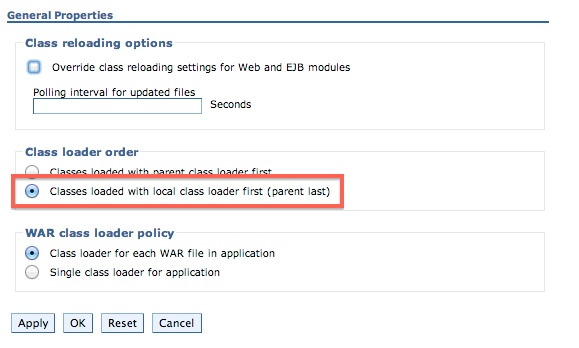

<!-- NLS_CHARSET=UTF-8 -->
## Visión general
{: #overview }
{{ site.data.keys.mf_analytics_server }} se implementa y se suministra como un conjunto de dos archivos WAR (archivo de aplicaciones web estándares de Java EE), o un archivo EAR (enterprise application archive). Por lo tanto, se puede instalar en uno de los siguientes servidores de aplicaciones soportados: WebSphere Application Server, WebSphere Application Server Liberty o Apache Tomcat (sólo archivos WAR).

{{ site.data.keys.mf_analytics_server }} utiliza una biblioteca Elasticsearch incorporada para el almacenamiento de datos y la gestión de clústeres. Puesto que pretende ser un motor de consulta y una búsqueda en memoria muy eficiente, que requiere la E/S de disco rápido, debe seguir algunos requisitos del sistema de producción. En general, es más probable que se quede sin memoria y sin disco (o que descubra que la E/S del disco es el cuello de botella de rendimiento) antes de que CPU se convierta en un problema. En un entorno en clúster, desea un clúster de nodos rápido, fiable y coubicado.

#### Ir a
{: #jump-to }

* [Requisitos del sistema](#system-requirements)
* [Consideraciones de capacidad](#capacity-considerations)
* [Instalación de {{ site.data.keys.mf_analytics }} en WebSphere Application Server Liberty](#installing-mobilefirst-analytics-on-websphere-application-server-liberty)
* [Instalación de {{ site.data.keys.mf_analytics }} en Tomcat](#installing-mobilefirst-analytics-on-tomcat)
* [Instalación de {{ site.data.keys.mf_analytics }} en WebSphere Application Server](#installing-mobilefirst-analytics-on-websphere-application-server)
* [Instalación de {{ site.data.keys.mf_analytics }} con tareas Ant](#installing-mobilefirst-analytics-with-ant-tasks)
* [Instalación de {{ site.data.keys.mf_analytics_server }} en servidores que ejecutan versiones anteriores](#installing-mobilefirst-analytics-server-on-servers-running-previous-versions)

## Requisitos del sistema
{: #system-requirements }

### Sistemas operativos
{: #operating-systems }
* CentOS/RHEL 6.x/7.x
* Oracle Enterprise Linux 6/7 sólo con Kernel RHEL
* Ubuntu 12.04/14.04
* SLES 11/12
* OpenSuSE 13.2
* Windows Server 2012/R2
* Debian 7

### JVM
{: #jvm }
* Oracle JVM 1.7u55+
* Oracle JVM 1.8u20+
* IcedTea OpenJDK 1.7.0.55+

### Hardware
{: #hardware }
* RAM: Más RAM es mejor, pero no más de 64 GB por nodo. 32 GB y 16 GB también son aceptables. Menos que 8 GB requiere muchos nodos pequeños en el clúster, y 64 GB es un derroche y es problemático debido a la forma en que Java utiliza la memoria para punteros.
* Disco: Utilice SSD cuando sea posible, o girar rápidamente discos tradicionales en la configuración de RAID 0 si los SSD no son posibles.
* CPU: CPU tiende a no ser el cuello de botella de rendimiento. Utilice sistemas con 2 a 8 núcleos.
* Red: Cuando tenga la necesidad de escalar horizontalmente, necesita un centro de datos rápido y fiable con velocidades soportadas de 1 GbE a 10 GbE.

### Configuración de hardware
{: #hardware-configuration }
* Dé a su JVM la mitad de la RAM disponible, pero no sobrepase los 32 GB
    * Establecimiento de la variable de entorno **ES\_HEAP\_SIZE** a 32g.
    * Establecimiento de los distintivos de JVM utilizando -Xmx32g -Xms32g.
* Desactive el intercambio de discos. Permitir al sistema operativo intercambiar la activación o desactivación del almacenamiento dinámico del disco degrada significativamente el rendimiento.
    * Temporalmente: `sudo swapoff -a`
    * Permanentemente: Edite **/etc/fstab** según la documentación del sistema operativo.
    * Si no es posible ninguna opción, establezca la opción de Elasticsearch **bootstrap.mlockall: true** (este valor es el valor predeterminado en la instancia incluida de Elasticsearch).
* Aumente los descriptores de archivos abiertos permitidos.
    * Linux limita normalmente un número por proceso de descriptores de archivos abiertos a un pequeño 1024.
    * Consulte la documentación de su sistema operativo para ver cómo aumentar permanentemente este valor en algo mucho mayor, como 64.000.
* Elasticsearch también utiliza una combinación de NioFS y MMapFS para los diversos archivos. Aumente el recuento de correlaciones máximo para que haya disponible mucha memoria virtual para los archivos correlacionados.
    * Temporalmente: `sysctl -w vm.max_map_count=262144`
    * Permanentemente: Modifique el valor **vm.max\_map\_count** en su **/etc/sysctl.conf**.
* Si utiliza BSD y Linux, asegúrese de que el planificador de E/S del sistema operativo esté establecido en **deadline** o **noop**, no en **cfq**.

## Consideraciones de capacidad
{: #capacity-considerations }
La capacidad es la pregunta única más común. ¿Cuánta RAM necesita? ¿Cuánto espacio de disco? ¿Cuántos nodos? La respuesta siempre es: depende.

IBM {{ site.data.keys.mf_analytics }} Analytics le proporciona la oportunidad de recopilar muchos tipos de sucesos heterogéneos, incluidos registros de depuración de SDK de clientes sin formato, sucesos de red de los que ha informado el servidor, datos personalizados, etc. Es un sistema con un elevado número de datos con unos requisitos del sistema de datos elevados.

El tipo y la cantidad de datos que elija recopilar, y por cuánto tiempo desee conservarlos, tiene un impacto drástico en los requisitos de almacenamiento y en el rendimiento global. Como ejemplo, tenga en cuenta las preguntas siguientes.

* ¿Son los registros de cliente de depuración sin formato útiles tras un mes?
* ¿Está utilizando la característica **Alertas** en {{ site.data.keys.mf_analytics }}? Si es así, ¿está consultando sucesos que se han producido en los últimos minutos o a lo largo de un rango mayor?
* ¿Está utilizando gráficos personalizados? Si es así, ¿está creando estos gráficos para los datos incorporados o los pares clave/valor instrumentados personalizados? ¿Cuánto tiempo desea conservar los datos?

Los gráficos incorporados en {{ site.data.keys.mf_analytics_console }} se representan consultando datos que {{ site.data.keys.mf_analytics_server }} ya ha resumido y optimizado específicamente para la experiencia de usuario de consola lo más rápida posible. Dado que se prerresumen y se optimizan para los gráficos incorporados, no es adecuado utilizarlos en alertas ni gráficos personalizados donde el usuario de la consola define las consultas.

Cuando consulte documentos sin formato, aplique filtros, realice agregaciones y pida al motor de consulta subyacente que calcule los promedios y los porcentajes, el rendimiento de consultas sufrirá necesariamente. Es este caso de uso lo que requiere consideraciones de capacidad cuidadosas. Una vez que sufra el rendimiento de la consulta, será el momento de decidir si debe realmente conservar datos antiguos para la visibilidad de la consola en tiempo real o depurarlos del {{ site.data.keys.mf_analytics_server }}. ¿Es la visibilidad de la consola en tiempo real realmente útil para los datos de hace cuatro meses?

### Índices, fragmentos y nodos
{: #indicies-shards-and-nodes }
El almacén de datos subyacente es Elasticsearch. Debe saber un poco sobre índices, fragmentos y nodos, y cómo afecta la configuración al rendimiento. Aproximadamente, puede pensar en un índice como una unidad lógica de datos. Un índice se correlaciona de forma simple y múltiple en fragmentos donde la clave de configuración son los fragmentos. {{ site.data.keys.mf_analytics_server }} crea un índice independiente por tipo de documento. Si su configuración no descarta ningún tipo de documento, tiene un número de índices creados que es equivalente al número de tipos de documentos ofrecidos por {{ site.data.keys.mf_analytics_server }}.

Si configura los fragmentos en 1, cada índice sólo tendrá un fragmento primario en el que se escriben los datos. Si ha establecido los fragmentos en 10, cada índice puede equilibrarse en 10 fragmentos. Sin embargo, más fragmentos tienen un coste de rendimiento cuando sólo tiene un nodo. Dicho nodo está ahora equilibrando cada índice a 10 fragmentos en el mismo disco físico. Establezca los fragmentos únicamente en 10 si tiene pensado escalar de forma inmediata (o casi inmediata) a 10 nodos físicos del clúster.

El mismo principio se aplica a **réplicas**. Establezca únicamente **réplicas** a un valor mayor que 0 si pretende escalar de forma inmediata (o casi inmediata) al número de nodos para que coincidan.  
Por ejemplo, si establece **fragmentos** en 4 y **réplicas** en 2, podrá escalar a 8 nodos, lo que es 4 * 2.

## Instalación de {{ site.data.keys.mf_analytics }} en WebSphere Application Server Liberty
{: #installing-mobilefirst-analytics-on-websphere-application-server-liberty }
Asegúrese de que ya tenga el archivo EAR de {{ site.data.keys.mf_analytics }}. Para obtener más información sobre la instalación de artefactos, consulte [Instalación de {{ site.data.keys.mf_server }} en un servidor de aplicaciones](../../appserver). El archivo **analytics.ear** se encuentra en la carpeta `<mf_server_install_dir>\analytics`. Para obtener más información sobre cómo descargar e instalar WebSphere Application Server Liberty, consulte el artículo [Acerca de WebSphere Liberty](https://developer.ibm.com/wasdev/websphere-liberty/) en IBM developerWorks .

1. Cree un servidor ejecutando el siguiente mandato en su carpeta **./wlp/bin**.

   ```bash
   ./server create <serverName>
   ```

2. Instale las características siguientes ejecutando el siguiente mandato en la carpeta **./bin**.

   ```bash
   ./featureManager install jsp-2.2 ssl-1.0 appSecurity-1.0 localConnector-1.0
   ```

3. Añada el archivo **analytics.ear** a la carpeta `./usr/servers/<serverName>/apps` del servidor de Liberty.
4. Sustituya el contenido de la etiqueta `<featureManager>` del archivo `./usr/servers/<serverName>/server.xml` por el contenido siguiente:

   ```xml
   <featureManager>
        <feature>jsp-2.2</feature>
        <feature>ssl-1.0</feature>
        <feature>appSecurity-1.0</feature>
        <feature>localConnector-1.0</feature>
   </featureManager>
   ```

5. Configure **analytics.ear** como una aplicación con seguridad basada en roles en el archivo **server.xml**. En el ejemplo siguiente se crea un registro de usuarios codificado básico, y se asigna un usuario a cada uno de los roles de análisis distintos.

   ```xml
   <application location="analytics.ear" name="analytics-ear" type="ear">
        <application-bnd>
            <security-role name="analytics_administrator">
                <user name="admin"/>
            </security-role>
            <security-role name="analytics_infrastructure">
                <user name="infrastructure"/>
            </security-role>
            <security-role name="analytics_support">
                <user name="support"/>
            </security-role>
            <security-role name="analytics_developer">
                <user name="developer"/>
            </security-role>
            <security-role name="analytics_business">
                <user name="business"/>
            </security-role>
        </application-bnd>
   </application>

   <basicRegistry id="worklight" realm="worklightRealm">
        <user name="business" password="demo"/>
        <user name="developer" password="demo"/>
        <user name="support" password="demo"/>
        <user name="infrastructure" password="demo"/>
        <user name="admin" password="admin"/>
   </basicRegistry>
   ```

   > Para obtener más información sobre cómo configurar otros tipos de registro de usuarios, como por ejemplo LDAP, consulte el tema [Configuración de un registro de usuarios para Liberty](http://ibm.biz/knowctr#SSAW57_8.5.5/com.ibm.websphere.wlp.nd.iseries.doc/ae/twlp_sec_registries.html) en la documentación del producto WebSphere Application Server.

6. Inicie el servidor de Liberty ejecutando el siguiente mandato dentro de su carpeta **bin**

   ```bash
   ./server start <serverName>
   ```

7. Vaya a {{ site.data.keys.mf_analytics_console }}.

   ```bash
   http://localhost:9080/analytics/console
   ```

Para obtener más información sobre la administración de WebSphere Application Server Liberty, consulte el tema [Administración de Liberty desde la línea de mandatos](http://ibm.biz/knowctr#SSAW57_8.5.5/com.ibm.websphere.wlp.nd.multiplatform.doc/ae/twlp_admin_script.html) en la documentación del producto WebSphere Application Server.

## Instalación de {{ site.data.keys.mf_analytics }} en Tomcat
{: #installing-mobilefirst-analytics-on-tomcat }
Asegúrese de que ya disponga de los archivos WAR de {{ site.data.keys.mf_analytics }}. Para obtener más información sobre la instalación de artefactos, consulte [Instalación de {{ site.data.keys.mf_server }} en un servidor de aplicaciones](../../appserver). Los archivos **analytics-ui.war** y **analytics-service.war** se encuentran en la carpeta **<dir_instalación_servidor_mf>\analytics**. Para obtener más información sobre cómo descargar e instalar Tomcat, consulte [Apache Tomcat](http://tomcat.apache.org/). Asegúrese de que descarga la versión que da soporte a Java 7 o superior. Para obtener más información sobre qué versión de Tomcat da soporte a Java 7, consulte [Versiones de Apache Tomcat](http://tomcat.apache.org/whichversion.html).

1. Añada los archivos **analytics-service.war** y **analytics-ui.war** a la carpeta **webapps** de Tomcat.
2. Descomente la sección siguiente en el archivo **conf/server.xml**, que está presente, pero comentado, en un archivado de Tomcat recién descargado.

   ```xml
   <Valve className ="org.apache.catalina.authenticator.SingleSignOn"/>
   ```

3. Declare los dos archivos war al archivo **conf/server.xml** y defina un registro de usuarios.

   ```xml
   <Context docBase ="analytics-service" path ="/analytics-service"></Context>
   <Context docBase ="analytics" path ="/analytics"></Context>
   <Realm className ="org.apache.catalina.realm.MemoryRealm"/>
   ```

   **MemoryRealm** reconoce los usuarios definidos en el archivo **conf/tomcat-users.xml**. Para obtener más información sobre otras opciones, consulte [Apache Tomcat Realm Configuration HOW-TO](http://tomcat.apache.org/tomcat-7.0-doc/realm-howto.html).

4. Añada las secciones siguientes al archivo **conf/tomcat-users.xml** para configurar un **MemoryRealm**.
    * Añada los roles de seguridad.

      ```xml
      <role rolename="analytics_administrator"/>
      <role rolename="analytics_infrastructure"/>
      <role rolename="analytics_support"/>
      <role rolename="analytics_developer"/>
      <role rolename="analytics_business"/>
      ```
    * Añada algunos usuarios con los roles que desee.

      ```xml
      <user name="admin" password="admin" roles="analytics_administrator"/>
      <user name="support" password="demo" roles="analytics_support"/>
      <user name="business" password="demo" roles="analytics_business"/>
      <user name="developer" password="demo" roles="analytics_developer"/>
      <user name="infrastructure" password="demo" roles="analytics_infrastructure"/>
      ```    
    * Inicie el servidor de Tomcat y vaya a {{ site.data.keys.mf_analytics_console }}.

      ```xml
      http://localhost:8080/analytics/console
      ```

    Para obtener más información sobre cómo iniciar el servidor de Tomcat, consulte el sitio oficial de Tomcat. Por ejemplo, [Apache Tomcat 7](http://tomcat.apache.org/tomcat-7.0-doc/introduction.html), para Tomcat 7.0.

## Instalación de {{ site.data.keys.mf_analytics }} en WebSphere Application Server
{: #installing-mobilefirst-analytics-on-websphere-application-server }
Para obtener más información sobre los pasos de instalación iniciales para adquirir los artefactos de instalación (archivos JAR y EAR), consulte [Instalación de {{ site.data.keys.mf_server }} en un servidor de aplicaciones](../../appserver). Los archivos **analytics.ear**, **analytics-ui.war** y **analytics-service.war** se encuentran en la carpeta **<dir_instalación_servidor_mf>\analytics**.

Los pasos siguientes describen cómo instalar y ejecutar el archivo EAR de Analytics en WebSphere Application Server. Si está instalando los archivos WAR individuales en WebSphere Application Server, siga sólo los pasos del 2 al 7 en el archivo WAR de **analytics-service** una vez que haya desplegado los archivos WAR. El orden de carga de clases no se debe modificar en el archivo WAR de analytics-ui.

1. Despliegue el archivo EAR en el servidor de aplicaciones, pero no lo inicie . Para obtener más información sobre cómo instalar un archivo EAR en WebSphere Application Server, consulte el tema [Instalación de los archivos de la aplicación empresarial con la consola](http://ibm.biz/knowctr#SSAW57_8.5.5/com.ibm.websphere.nd.multiplatform.doc/ae/trun_app_instwiz.html) en la documentación del producto WebSphere Application Server.

2. Seleccione la aplicación **MobileFirst Analytics** desde la lista **Enterprise Applications**.

    

3. Pulse **Carga de clase y detección de actualización**.

    

4. Establezca el orden de carga de clase en **último padre**.

    

5. Pulse **Rol de seguridad para correlación de usuario/grupo** para correlacionar el usuario administrativo.

    

6. Pulse **Gestionar módulos**.

    

7. Seleccione el módulo de **análisis** y cambie el orden de cargador de clases a **último padre**.

    

8. Habilite **Seguridad administrativa** y **seguridad de la aplicación** en la consola de administración de WebSphere Application Server:
    * Inicie sesión en la consola de administración de WebSphere Application Server.
    * En el menú **Seguridad > Seguridad global**, asegúrese de que **Habilitar seguridad administrativa** y **Habilitar seguridad de aplicación** estén seleccionados. Nota: La seguridad de aplicación sólo se puede seleccionar una vez que **Seguridad administrativa** esté habilitado.
    * Pulse **Aceptar** y guarde los cambios.
9. Inicie la aplicación {{ site.data.keys.mf_analytics }} y vaya al enlace del navegador: `http://<hostname>:<port>/analytics/console`.

## Instalación de {{ site.data.keys.mf_analytics }} con tareas Ant
{: #installing-mobilefirst-analytics-with-ant-tasks }
Asegúrese de que tenga los archivos WAR y de configuración necesarios: **analytics-ui.war** y **analytics-service.war**. Para obtener más información sobre la instalación de artefactos, consulte [Instalación de {{ site.data.keys.mf_server }} en un servidor de aplicaciones](../../appserver). Los archivos **analytics-ui.war** y **analytics-service.war** se encuentran en **MobileFirst_Platform_Server\analytics**.

Debe ejecutar la tarea Ant en el sistema donde está instalado el servidor de aplicaciones, o el Network Deployment Manager para WebSphere Application Server Network Deployment. Si desea iniciar la tarea Ant desde un sistema en el que {{ site.data.keys.mf_server }} no está instalado, debe copiar el archivo **<dir_instalación_servidor_mf>/MobileFirstServer/mfp-ant-deployer.jar** en ese sistema.

> Nota: El marcador de posición **dir_instalación_servidor_mf** es el directorio en el que ha instalado {{ site.data.keys.mf_server }}.

1. Edite el script Ant que utilizará más adelante para desplegar archivos WAR de {{ site.data.keys.mf_analytics }}.
    * Revise los archivos de configuración de ejemplo en [Archivos de configuración de ejemplo para {{ site.data.keys.mf_analytics }}](../../installation-reference/#sample-configuration-files-for-mobilefirst-analytics).
    * Sustituya los valores de marcador por las propiedades al principio del archivo.

    > Nota: Los siguientes caracteres especiales deben escaparse cuando se utilizan en los valores de los scripts Ant XML:
    >
    > * El signo de dólar ($) se debe escribir como $$, a no ser que desee explícitamente hacer referencia a una variable Ant a través de la sintaxis ${variable}, tal como se describe en la sección [Propiedades](http://ant.apache.org/manual/properties.html) de Apache Ant Manual.
    > * El carácter ampersand (&) se debe escribir como &amp;, a no ser que desee explícitamente hacer referencia a una entidad XML.
    > * Las comillas dobles (") se deben escribir como &quot;, excepto cuando estén dentro de una serie que esté entre comillas simples.

2. Si instala un clúster de nodos en varios servidores:
    * Debe descomentar la propiedad **wl.analytics.masters.list**, y establecer su valor en la lista de nombre de host y puerto de transporte de los nodos maestro. Por ejemplo: `node1.mycompany.com:96000,node2.mycompany.com:96000`
    * Añada el atributo **mastersList** a los elementos **elasticsearch** de las tareas **installanalytics**, **updateanalytics** y **uninstallanalytics**.

    **Nota:** Si instala en un clúster en WebSphere Application Server Network Deployment, y no establece la propiedad, la tarea Ant calcula los puntos finales de datos para todos los miembros del clúster en el momento de la instalación, y establece la propiedad JNDI **masternodes** en dicho valor.

3. Para desplegar los archivos WAR, ejecute el mandato siguiente: `ant -f configure-appServer-analytics.xml install`
    Puede encontrar el mandato Ant en **mf_server_install_dir/shortcuts**. Esto instala un nodo de {{ site.data.keys.mf_analytics }}, con el maestro de tipo predeterminado y los datos, en el servidor, o en cada miembro de un clúster si instala en WebSphere Application Server Network Deployment.
4. Guarde el archivo Ant. Es posible que lo necesite más adelante para aplicar un fixpack o para realizar una actualización.
    Si no desea guardar las contraseñas, puede sustituirlas por "************" (12 estrellas) para la solicitud interactiva.

    **Nota:** Si añade un nodo a un clúster de {{ site.data.keys.mf_analytics }}, debe actualizar la propiedad JNDI analytics/masternodes, de modo que contenga los puertos de todos los nodos maestro del clúster.

## Instalación de {{ site.data.keys.mf_analytics_server }} en servidores que ejecutan versiones anteriores
{: #installing-mobilefirst-analytics-server-on-servers-running-previous-versions }
Aunque no hay ninguna opción para actualizar las versiones anteriores del {{ site.data.keys.mf_analytics_server }}, al instalar {{ site.data.keys.mf_analytics_server }} V8.0.0 en un servidor que aloja una versión anterior, deben migrarse algunas propiedades y datos de análisis.

Para los servidores anteriormente en ejecución anteriores a las versiones de {{ site.data.keys.mf_analytics_server }}, actualice los datos de análisis y las propiedades JNDI.

### Migración de propiedades de servidor utilizadas por versiones anteriores de {{ site.data.keys.mf_analytics_server }}
{: #migration-of-server-properties-used-by-previous-versions-of-mobilefirst-analytics-server }
Si instala {{ site.data.keys.mf_analytics_server }} V8.0.0 en un servidor que estaba ejecutando anteriormente una versión anterior de {{ site.data.keys.mf_analytics_server }}, debe actualizar los valores de las propiedades JNDI en el servidor que aloja.

Algunos tipos de sucesos se han cambiado entre versiones anteriores de {{ site.data.keys.mf_analytics_server }} y V8.0.0. Debido a este cambio, cualquier propiedad JNDI que se haya configurado previamente en el archivo de configuración del servidor debe convertirse en el nuevo tipo de suceso.

La tabla siguiente muestra la correlación entre tipos de sucesos antiguos y nuevos. Algunos tipos de sucesos no han cambiado.

| Tipo de suceso antiguo            | Tipo de suceso nuevo         |
|---------------------------|------------------------|
| AlertDefinition	        | AlertDefinition        |
| AlertNotification	        | AlertNotification      |
| AlertRunnerNode	        | AlertRunnerNode        |
| AnalyticsConfiguration    | AnalyticsConfiguration |
| CustomCharts	            | CustomChart            |
| CustomData	            | CustomData             |
| Devices	                | Device                 |
| MfpAppLogs                | AppLog                 |
| MfpAppPushAction          | AppPushAction          |
| MfpAppSession	            | AppSession             |
| ServerLogs	            | ServerLog              |
| ServerNetworkTransactions | NetworkTransaction     |
| ServerPushNotifications   | PushNotification       |
| ServerPushSubscriptions   | PushSubscription       |
| Users	                    | User                   |
| inboundRequestURL	        | resourceURL            |
| mfpAppName	            | appName                |
| mfpAppVersion	            | appVersion             |

### Migración de datos analíticos
{: #analytics-data-migration }
Los componentes internos de {{ site.data.keys.mf_analytics_console }} se han mejorado, lo que requiere cambiar el formato en el que se almacenan los datos. Para continuar interactuando con los datos analíticos que ya se han recopilado, los datos deben migrarse al nuevo formato de datos.

Cuando se visualice por primera vez {{ site.data.keys.mf_analytics_console }} después de realizar la actualización a V8.0.0, no se representarán estadísticas en {{ site.data.keys.mf_analytics_console }}. Sus datos no se han perdido, pero deben migrarse al nuevo formato de datos.

Se mostrará una alerta en cada una de las páginas de {{ site.data.keys.mf_analytics_console }} que le recuerdan que se deben migrar los documentos. El texto de alerta incluye un enlace a la página **Migración**.

La imagen siguiente muestra una alerta de ejemplo de la página **Visión general** de la sección **Panel de control**:


### Página de migración
{: #migration-page }
Puede acceder a la página Migración desde el icono de llave inglesa en {{ site.data.keys.mf_analytics_console }}. Desde la página **Migración**, puede ver cuántos documentos deben migrarse, y en qué índices están almacenados. Sólo está disponible una acción: **Realizar migración**.

La imagen siguiente muestra la página **Migración** cuando tiene documentos que deban migrarse:


> **Nota:** Este proceso puede tardar mucho tiempo, en función de la cantidad de datos que tenga, y no se puede detener durante la migración.

La migración puede tardar aproximadamente 3 minutos para migrar un millón de documentos en un único nodo con 32 G de RAM, con 16 G asignados en la JVM, con un procesador de 4 núcleos. Los documentos que no se han migrado no se consultan, por lo que no se representan en {{ site.data.keys.mf_analytics_console }}.

Si la migración falla mientras está en curso, vuelva a intentar la migración. Reintentar la migración no vuelve a migrar documentos que ya estaban migrados, y se mantendrá la integridad de datos.
