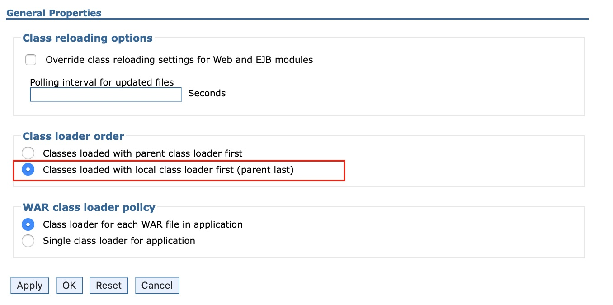
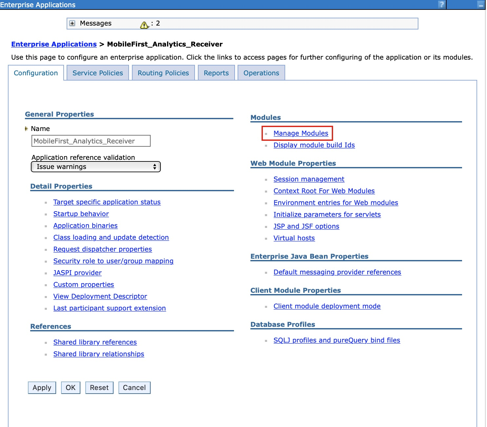

<!-- NLS_CHARSET=UTF-8 -->
## Visión general
{: #overview }
{{ site.data.keys.mf_analytics_receiver_server }} se implementa y se suministra como un archivo WAR (Web Application Archive) estándar de Java EE. Por lo tanto, se puede instalar en cualquiera de los siguientes  servidores de aplicaciones soportados: WebSphere Application Server, WebSphere Application Server Liberty o Apache Tomcat (sólo archivos WAR).

#### Ir a
{: #jump-to }

* [Requisitos del sistema](#system-requirements)
* [Consideraciones de capacidad](#capacity-considerations)
* [Instalación de {{ site.data.keys.mf_analytics_receiver }} en WebSphere Application Server Liberty](#installing-mobilefirst-analytics-receiver-on-websphere-application-server-liberty)
* [Instalación de {{ site.data.keys.mf_analytics_receiver }} en Tomcat](#installing-mobilefirst-analytics-receiver-on-tomcat)
* [Instalación de {{ site.data.keys.mf_analytics_receiver }} en WebSphere Application Server](#installing-mobilefirst-analytics-receiver-on-websphere-application-server)
* [Instalación de {{ site.data.keys.mf_analytics_receiver }} con tareas Ant](#installing-mobilefirst-analytics-receiver-with-ant-tasks)

## Requisitos del sistema
{: #system-requirements }

### Sistemas operativos
{: #operating-systems }
* CentOS/RHEL 6.x/7.x
* Oracle Enterprise Linux 6/7 sólo con Kernel RHEL
* Ubuntu 12.04/14.04
* SLES 11/12
* OpenSuSE 13.2
* Windows Server 2012/R2
* Debian 7

### JVM
{: #jvm }
* Oracle JVM 1.7u55+
* Oracle JVM 1.8u20+
* IcedTea OpenJDK 1.7.0.55+

### Hardware
{: #hardware }
* RAM: Más RAM es mejor, pero no más de 64 GB por nodo. 32 GB y 16 GB también son aceptables. Menos que 8 GB requiere muchos nodos pequeños en el clúster, y 64 GB es un derroche y es problemático debido a la forma en que Java utiliza la memoria para punteros.
* Disco: Utilice SSD cuando sea posible, o girar rápidamente discos tradicionales en la configuración de RAID 0 si los SSD no son posibles.
* CPU: CPU tiende a no ser el cuello de botella de rendimiento. Utilice sistemas con 2 a 8 núcleos.
* Red: Cuando necesite un escalado horizontal, necesitará un centro de datos rápido y fiable con velocidades soportadas de 1 GbE a 10 GbE.

### Configuración de hardware
{: #hardware-configuration }
* Proporcione a su JVM una dimensión amplia para escalar la cola de memoria interna con un tamaño 10000 (por ejemplo, Xmx mínimo como 6 GB).
* Si utiliza BSD y Linux, asegúrese de que el planificador de E/S del sistema operativo esté establecido en **deadline** o **noop**, no en **cfq**.

## Consideraciones de capacidad
{: #capacity-considerations }
La capacidad es la pregunta única más común. ¿Cuánta RAM necesita? ¿Cuánto espacio de disco? ¿Cuántos nodos? La respuesta es siempre subjetiva. 

IBM {{ site.data.keys.mf_analytics_receiver }} no requiere espacio de disco ya que simplemente recibe registros de las aplicaciones móviles y los envía al servidor de analíticas, no hay ningún almacenamiento de datos de sucesos. 

## Instalación de {{ site.data.keys.mf_analytics_receiver }} en WebSphere Application Server Liberty
{: #installing-mobilefirst-analytics-receiver-on-websphere-application-server-liberty }
Asegúrese de que ya tiene el archivo WAR de {{ site.data.keys.mf_analytics_receiver }}. Para obtener más información sobre la instalación de artefactos, consulte [Instalación de {{ site.data.keys.mf_server }} en un servidor de aplicaciones](../../prod-env/appserver). El archivo **analytics-receiver.war** se encuentra en la carpeta `<mf_server_install_dir>\analyticsreceiver`. Para obtener más información sobre cómo descargar e instalar WebSphere Application Server Liberty, consulte el artículo [Acerca de WebSphere Liberty](https://developer.ibm.com/wasdev/websphere-liberty/) en IBM developerWorks .

1. Cree un servidor ejecutando el siguiente mandato en su carpeta `./wlp/bin`.

   ```bash
   ./server create <serverName>
   ```

2. Instale las características ejecutando el siguiente mandato desde la carpeta `./bin`.

   ```bash
   ./featureManager install jsp-2.2 ssl-1.0 appSecurity-1.0 localConnector-1.0
   ```

3. Añada el archivo **analytics-receiver.war** a la carpeta `./usr/servers/<serverName>/apps` de Liberty Server.
4. Sustituya el contenido de la etiqueta **<featureManager>** del archivo `./usr/servers/<serverName>/server.xml` por el contenido siguiente: 

   ```xml
   <featureManager>
        <feature>jsp-2.2</feature>
        <feature>ssl-1.0</feature>
        <feature>appSecurity-1.0</feature>
        <feature>localConnector-1.0</feature>
   </featureManager>
   ```

5. Configure **analytics-receiver.war** como una aplicación con seguridad basada en roles en el archivo `server.xml`. En el ejemplo siguiente se crea un registro de usuarios codificado básico, y se asigna un usuario a cada uno de los diferentes roles de análisis. 

   ```xml
   <application id="analytics-receiver" name="analytics-receiver" location="analytics-receiver.war" type="war">
        <application-bnd>
            <security-role name="analytics_administrator">
                <user name="admin"/>
            </security-role>
            <security-role name="analytics_infrastructure">
                <user name="infrastructure"/>
            </security-role>
            <security-role name="analytics_support">
                <user name="support"/>
            </security-role>
            <security-role name="analytics_developer">
                <user name="developer"/>
            </security-role>
            <security-role name="analytics_business">
                <user name="business"/>
            </security-role>
        </application-bnd>
   </application>

   <basicRegistry id="worklight" realm="worklightRealm">
        <user name="business" password="demo"/>
        <user name="developer" password="demo"/>
        <user name="support" password="demo"/>
        <user name="infrastructure" password="demo"/>
        <user name="admin" password="admin"/>
   </basicRegistry>
   ```

   > Para obtener más información sobre cómo configurar otros tipos de registro de usuarios, como por ejemplo LDAP, consulte el tema [Configuración de un registro de usuarios para Liberty](http://ibm.biz/knowctr#SSAW57_8.5.5/com.ibm.websphere.wlp.nd.iseries.doc/ae/twlp_sec_registries.html) en la documentación del producto WebSphere Application Server.

6. Inicie el servidor de Liberty ejecutando el siguiente mandato dentro de su carpeta **bin**

   ```bash
   ./server start <serverName>
   ```

7. Verifique el servicio invocando el url de health 

   ```bash
   http://localhost:9080/analytics-receiver/rest/data/health
   ```

Para obtener más información sobre la administración de WebSphere Application Server Liberty, consulte el tema [Administración de Liberty desde la línea de mandatos](http://ibm.biz/knowctr#SSAW57_8.5.5/com.ibm.websphere.wlp.nd.multiplatform.doc/ae/twlp_admin_script.html) en la documentación del producto WebSphere Application Server.

## Instalación de {{ site.data.keys.mf_analytics_receiver }} en Tomcat
{: #installing-mobilefirst-analytics-receiver-on-tomcat }
Asegúrese de que ya disponga de los archivos WAR de {{ site.data.keys.mf_analytics_receiver }}. Para obtener más información sobre la instalación de artefactos, consulte [Instalación de {{ site.data.keys.mf_server }} en un servidor de aplicaciones](../../prod-env/appserver). El archivo **analytics-receiver.war** se encuentra en la carpeta `<mf_server_install_dir>\analyticsreceiver`. Para obtener más información sobre cómo descargar e instalar Tomcat, consulte [Apache Tomcat](http://tomcat.apache.org/). Asegúrese de que descarga la versión que da soporte a Java 7 o superior. Para obtener más información sobre qué versión de Tomcat da soporte a Java 7, consulte [Versiones de Apache Tomcat](http://tomcat.apache.org/whichversion.html).

1. Añada el archivo **analytics-receiver.war** a la carpeta `webapps` de Tomcat. 
2. Descomente la sección siguiente del archivo `conf/server.xml`, que está descomentado, en un archivo Tomcat de archivado descargado recientemente.

   ```xml
   <Valve className ="org.apache.catalina.authenticator.SingleSignOn"/>
   ```

3. Declare los dos archivos war al archivo `conf/server.xml` y defina un registro de usuarios.

   ```xml
   <Context docBase ="analytics-receiver-service" path ="/analytics-receiver"></Context>
   <Realm className ="org.apache.catalina.realm.MemoryRealm"/>
   ```

   **MemoryRealm** reconoce los usuarios definidos en el archivo `conf/tomcat-users.xml`. Para obtener más información sobre las opciones disponibles, consulte [Apache Tomcat Realm Configuration HOW-TO](http://tomcat.apache.org/tomcat-7.0-doc/realm-howto.html).

4. Añada las secciones siguientes al archivo `conf/tomcat-users.xml` para configurar un **MemoryRealm**.
    * Añada los roles de seguridad.

      ```xml
      <role rolename="analytics_administrator"/>
      <role rolename="analytics_infrastructure"/>
      <role rolename="analytics_support"/>
      <role rolename="analytics_developer"/>
      <role rolename="analytics_business"/>
      ```
    * Añada algunos usuarios con los roles que desee.

      ```xml
      <user name="admin" password="admin" roles="analytics_administrator"/>
      <user name="support" password="demo" roles="analytics_support"/>
      <user name="business" password="demo" roles="analytics_business"/>
      <user name="developer" password="demo" roles="analytics_developer"/>
      <user name="infrastructure" password="demo" roles="analytics_infrastructure"/>
      ```    
    * Inicie Tomcat Server y verifique el servicio invocando el url de health. 

      ```text
      http://localhost:8080/analytics-receiver/rest/data/health
      ```

    Para obtener más información sobre cómo iniciar el servidor de Tomcat, consulte el sitio oficial de Tomcat. Por ejemplo, [Apache Tomcat 7](http://tomcat.apache.org/tomcat-7.0-doc/introduction.html), para Tomcat 7.0.

## Instalación de {{ site.data.keys.mf_analytics_receiver }} en WebSphere Application Server
{: #installing-mobilefirst-analytics-receiver-on-websphere-application-server }
Para obtener más información sobre los pasos de instalación iniciales para adquirir los artefactos de instalación (archivos JAR y EAR), consulte [Instalación de {{ site.data.keys.mf_server }} en un servidor de aplicaciones](../../prod-env/appserver). El archivo **analytics-receiver.war** se encuentra en la carpeta `<mf_server_install_dir>\analyticsreceiver`. 

Los pasos siguientes describen cómo instalar y ejecutar el archivo EAR de Analytics en WebSphere Application Server. Si está instalando archivos WAR individuales en WebSphere Application Server, siga solo los pasos 2 a 7 en el archivo WAR **analytics-receiver** después del despliegue. 

1. Despliegue el archivo WAR en el servidor de aplicaciones, pero no lo inicie. Para obtener información sobre cómo instalar un archivo EAR en WebSphere Application Server, consulte el tema [Instalación de los archivos de la aplicación empresarial con la consola](http://ibm.biz/knowctr#SSAW57_8.5.5/com.ibm.websphere.nd.multiplatform.doc/ae/trun_app_instwiz.html) en la documentación del producto WebSphere Application Server.

2. Seleccione la aplicación **MobileFirst Analytics Receiver** en la lista **Aplicaciones empresariales**.

    

3. Pulse **Carga de clase y detección de actualización**.

    

4. Establezca el orden de carga de clase en **último padre**.

    

5. Pulse **Rol de seguridad para correlación de usuario/grupo** para correlacionar el usuario administrativo.

    

6. Pulse **Gestionar módulos**.

    

7. Seleccione el módulo de **analytics-receiver** y cambie el orden de cargador de clases a **último padre**.

    

8. Habilite **Seguridad administrativa** y **seguridad de la aplicación** en la consola de administración de WebSphere Application Server:
    * Inicie sesión en la consola de administración de WebSphere Application Server.
    * En el menú **Seguridad > Seguridad global**, asegúrese de que **Habilitar seguridad administrativa** y **Habilitar seguridad de aplicación** estén ambas seleccionadas.
    > **Nota**: La seguridad de aplicación solo se puede seleccionar después de que esté habilitada la **Seguridad administrativa**. 
    * Pulse **Aceptar** y guarde los cambios.

9. Para habilitar el acceso al servicio de analíticas a través de la documentación de Swagger, complete los pasos siguientes:
    * Pulse **Servidores > Tipos de servidores > Servidores de aplicaciones de WebSphere** y elija el servidor en el que está desplegado el servicio de Analytics, en la lista de servidores.
    * En **Infraestructura del servidor**, pulse **Java** y vaya a **Gestión de procesos > Definición de procesos > Máquina virtual Java > Propiedades personalizadas**.
      - Establezca la propiedad personalizada siguiente<br/>
        **Nombre de propiedad:** *com.ibm.ws.classloader.strict*<br/>
        **Valor:** *true*

10. Inicie la aplicación {{ site.data.keys.mf_analytics_receiver }} y verifique que el url de health esté accesible en el navegador: `http://<hostname>:<port>/analytics-receiver/rest/data/health`.

## Instalación de {{ site.data.keys.mf_analytics_receiver }} con tareas Ant
{: #installing-mobilefirst-analytics-receiver-with-ant-tasks }
Asegúrese de que tiene los archivos WAR y de configuración necesarios. **analytics-receiver.war**. Para obtener más información sobre la instalación de artefactos, consulte [Instalación de {{ site.data.keys.mf_server }} en un servidor de aplicaciones](../../prod-env/appserver). El archivo **analytics-receiver.war** se encuentra en `MobileFirst_Platform_Server\AnalyticsReceiver`.

Debe ejecutar la tarea Ant en el sistema donde está instalado el servidor de aplicaciones, o el Network Deployment Manager para WebSphere Application Server Network Deployment. Si desea iniciar la tarea Ant desde un sistema en el que {{ site.data.keys.mf_server }} no está instalado, debe copiar el archivo `\<mf_server_install_dir\>/MobileFirstServer/mfp-ant-deployer.jar` en ese sistema.

> **Nota**: **mf_server_install_dir** es el directorio donde ha instalado {{ site.data.keys.mf_server }}. 

1. Edite el script Ant que utilizará más adelante para desplegar los archivos WAR de {{ site.data.keys.mf_analytics_receiver }}. 
    * Revise los archivos de configuración de ejemplo en [Archivos de configuración de ejemplo para {{ site.data.keys.mf_analytics_receiver }}](../../installation-reference/#sample-configuration-files-for-mobilefirst-analytics).
    * Sustituya los valores de marcador por las propiedades al principio del archivo.

    > **Nota**: Los siguientes caracteres especiales deben escaparse cuando se utilizan en los valores de los scripts Ant XML:
    >
    > * El signo de dólar ($) se debe escribir como $$, a no ser que desee explícitamente hacer referencia a una variable Ant a través de la sintaxis ${variable}, tal como se describe en la sección [Propiedades](http://ant.apache.org/manual/properties.html) de Apache Ant Manual.
    > * El carácter ampersand (&) se debe escribir como &amp;, a no ser que desee explícitamente hacer referencia a una entidad XML.
    > * Las comillas dobles (") se deben escribir como &quot;, excepto cuando estén dentro de una serie que esté entre comillas simples.

2. Para desplegar el archivo WAR, ejecute el mandato siguiente: 
   ```bash
   ant -f configure-appServer-analytics-receiver.xml install
   ```
    Puede encontrar el mandato Ant en `mf_server_install_dir/shortcuts`. Esto instala un nodo de {{ site.data.keys.mf_analytics_receiver }} en el servidor, en cada miembro de un clúster, si realiza la instalación en WebSphere Application Server Network Deployment.
3. Guarde el archivo Ant. Es posible que lo necesite más adelante para aplicar un fixpack o para realizar una actualización.
    Si no desea guardar las contraseñas, puede sustituirlas por `************` (12 asteriscos) para la solicitud interactiva. 
