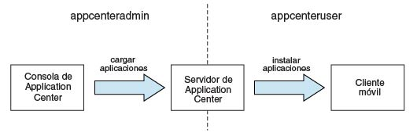
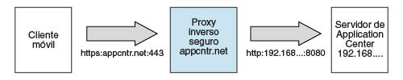

<!-- NLS_CHARSET=UTF-8 -->
## Visión general
{: #overview }
Instale Application Center como parte de la instalación de {{ site.data.keys.mf_server }}.
Puede instalarlo con uno de los métodos siguientes:

* Instalación con IBM Installation Manager
* Instalación con tareas Ant
* Instalación manual

Opcionalmente, puede crear la base de datos de su elección antes de instalar {{ site.data.keys.mf_server }} con Application Center.  
Una vez que haya instalado Application Center en el servidor de aplicaciones web de su elección, tiene una configuración adicional que realizar. Para obtener más información, consulte Configuración de Application Center tras la instalación que aparece a continuación. Si elige una configuración manual en el instalador, consulte la documentación del servidor de su elección.

> **Nota:** Si va a realizar la instalación de aplicaciones en dispositivos iOS a través de Application Center, debe configurar en primer lugar el servidor de Application Center con SSL.

Para obtener una lista de archivos y herramientas instalados, consulte [Estructura de distribución de {{ site.data.keys.mf_server }}](../installation-manager/#distribution-structure-of-mobilefirst-server).

#### Ir a
{: #jump-to }

* [Instalación de Application Center con IBM Installation Manager](#installing-application-center-with-ibm-installation-manager)
* [Instalación de Application Center con tareas Ant](#installing-the-application-center-with-ant-tasks)
* [Instalación manual de Application Center](#manually-installing-application-center)
* [Configuración de Application Center tras la instalación](#configuring-application-center-after-installation)

## Instalación de Application Center con IBM Installation Manager
{: #installing-application-center-with-ibm-installation-manager }
Con IBM Installation Manager, puede instalar Application Center, crear su base de datos y desplegarlo en un Application Server.  
Antes de empezar, verifique que el usuario que ejecuta IBM Installation Manager tiene los privilegios descritos en [Requisitos previos del sistema de archivos](../appserver/#file-system-prerequisites).

Para instalar IBM Application Center con IBM Installation Manager, siga estos pasos:

1. Opcional: Puede crear manualmente bases de datos para Application Center, tal como se describe en [Creación opcional de bases de datos](#optional-creation-of-databases) a continuación. IBM Installation Manager puede crear las bases de datos de Application Center con valores predeterminados.
2. Ejecute IBM Installation Manager, tal como se describe en [Ejecución de IBM Installation Manager](../installation-manager).
3. Seleccione **Sí** en la pregunta **Instalar IBM Application Center**.

#### Ir a
{: #jump-to-1 }
* [Creación opcional de bases de datos](#optional-creation-of-databases)
* [Instalación de Application Center en WebSphere Application Server Network Deployment](#installing-application-center-in-websphere-application-server-network-deployment)
* [Finalización de la instalación](#completing-the-installation)
* [Inicios de sesión predeterminados y contraseñas creadas por IBM Installation Manager para Application Center](#default-logins-and-passwords-created-by-ibm-installation-manager-for-the-application-center)

### Creación opcional de bases de datos
{: #optional-creation-of-databases }
Si desea activar la opción para instalar Application Center cuando ejecute el instalador de {{ site.data.keys.mf_server }}, debe tener determinados derechos de acceso de base de datos que le autoricen para crear las tablas necesarias por el Application Center.

Si tiene suficientes credenciales de administración de bases de datos, y si especifica el nombre de usuario y la contraseña del administrador en el instalador cuando se le solicite, el instalador puede crear las bases de datos. De lo contrario, debe solicitar a su administrador de bases de datos que cree la base de datos necesaria. La base de datos debe crearse antes de iniciar el instalador de {{ site.data.keys.mf_server }}.

En los temas siguientes se describe el procedimiento para los sistemas de gestión de bases de datos soportadas.

#### Ir a
{: #jump-to-2 }

* [Creación de la base de datos de DB2 para Application Center](#creating-the-db2-database-for-application-center)
* [Creación de la base de datos de MySQL para Application Center](#creating-the-mysql-database-for-application-center)
* [Creación de la base de datos de Oracle para Application Center](#creating-the-oracle-database-for-application-center)

#### Creación de la base de datos de DB2 para Application Center
{: #creating-the-db2-database-for-application-center }
Durante la instalación de IBM MobileFirst Foundation, el instalador puede crear la base de datos de Application Center.

El instalador puede crear la base de datos de Application Center si especifica el nombre y la contraseña de una cuenta de usuario en el servidor de base de datos que tiene el privilegio DB2 SYSADM o SYSCTRL, y se puede acceder a la cuenta a través de SSH. De lo contrario, el administrador de base de datos puede crear la base de datos de Application Center. Para obtener más información, consulte la documentación de usuario de [DB2 Solution](http://ibm.biz/knowctr#SSEPGG_9.7.0/com.ibm.db2.luw.admin.sec.doc/doc/c0055206.html).

Cuando cree manualmente la base de datos, puede sustituir el nombre de la base de datos (aquí APPCNTR) y la contraseña por un nombre y contraseña de base de datos de su elección.

> **Importante:** Puede poner un nombre distinto a su base de datos y usuario, o establecer una contraseña distinta, pero asegúrese de que especifica el nombre de base de datos adecuado, el nombre de usuario y la contraseña correctamente en la configuración de la base de datos de DB2. DB2 tiene un límite de nombre de base de datos de 8 caracteres en todas las plataformas, y tiene un límite de longitud de nombre de usuario y de contraseña de 8 caracteres para sistemas UNIX y Linux, y de 30 caracteres para Windows.
1. Cree un usuario del sistema, por ejemplo, con el nombre **wluser** en un grupo de administración de DB2 como por ejemplo **DB2USERS**, utilizando los mandatos adecuados para su sistema operativo. Otórguele una contraseña, por ejemplo, **wluser**. Si desea que varias instancias de IBM {{ site.data.keys.mf_server }} se conecten a la misma base de datos, utilice un nombre de usuario distinto para cada conexión. Cada usuario de base de datos tiene un esquema predeterminado independiente. Para obtener más información acerca de los usuarios de base de datos, consulte la documentación de DB2 y la documentación para su sistema operativo.

2. Abra un procesador de línea de mandatos de DB2, con un usuario que tenga permisos **SYSADM** o **SYSCTRL**:

    * En sistemas Windows, pulse **Inicio → IBM DB2 → Procesador de línea de mandatos**
    * En sistemas Linux o UNIX, vaya a **~/sqllib/bin** y especifique `./db2`.
    * Especifique el gestor de bases de datos y las sentencias SQL similares al siguiente ejemplo para crear la base de datos de Application Center, sustituyendo el nombre de usuario **wluser** por sus nombres de usuario elegidos:

      ```bash
      CREATE DATABASE APPCNTR COLLATE USING SYSTEM PAGESIZE 32768
      CONNECT TO APPCNTR
      GRANT CONNECT ON DATABASE TO USER wluser
      DISCONNECT APPCNTR
      QUIT
      ```

3. El instalador puede crear las tablas y los objetos de la base de datos para Application Center en un esquema específico. Esto le permite utilizar la misma base de datos para Application Center y para un proyecto de MobileFirst. Si se otorga la autoridad de IMPLICIT\_SCHEMA al usuario creado en el paso 1 (el valor predeterminado en el script de creación de bases de datos en el paso 2), no es necesaria ninguna otra acción. Si el usuario no tiene la autoridad IMPLICIT\_SCHEMA, debe crear un SCHEMA para las tablas y los objetos de bases de datos de Application Center.

#### Creación de la base de datos de MySQL para Application Center
{: #creating-the-mysql-database-for-application-center }
Durante la instalación de MobileFirst, el instalador puede crear la base de datos de Application Center.

El instalador puede crear la base de datos automáticamente si especifica el nombre y la contraseña de la cuenta de superusuario. Para obtener más información, consulte [Protección de cuentas iniciales de MySQL](http://dev.mysql.com/doc/refman/5.1/en/default-privileges.html) en el servidor de bases de datos MySQL. El administrador de bases de datos también puede crear las bases de datos automáticamente. Cuando cree manualmente la base de datos, puede sustituir el nombre de la base de datos (aquí APPCNTR) y la contraseña por un nombre de base de datos y una contraseña de su elección. Tenga en cuenta que los nombres de bases de datos de MySQL distinguen entre mayúsculas y minúsculas en UNIX.

1. Inicie la herramienta de línea de mandatos de MySQL.
2. Especifique los mandatos siguientes:

   ```bash
   CREATE DATABASE APPCNTR CHARACTER SET utf8 COLLATE utf8_general_ci;
   GRANT ALL PRIVILEGES ON APPCNTR.* TO 'worklight'@'Worklight-host' IDENTIFIED BY 'password';
   GRANT ALL PRIVILEGES ON APPCNTR.* TO 'worklight'@'localhost' IDENTIFIED BY 'password';
   FLUSH PRIVILEGES;
   ```

   Aquí, tendrá que sustituir **Worklight-host** por el nombre del host en el que se ejecuta IBM MobileFirst Foundation.

#### Creación de la base de datos de Oracle para Application Center
{: #creating-the-oracle-database-for-application-center }
Durante la instalación, el instalador puede crear la base de datos de Application Center, excepto para el tipo de base de datos Oracle 12c, o el usuario y el esquema que hay en una base de datos existente.

El instalador puede crear la base de datos, excepto para el tipo de base de datos Oracle 12c, o el usuario y el esquema que hay dentro de una base de datos existente si especifica el nombre y la contraseña del administrador de Oracle en el servidor de bases de datos, y la cuenta a la que se puede acceder mediante SSH. De lo contrario, el administrador de bases de datos puede crear la base de datos o el usuario y el esquema automáticamente. Cuando cree manualmente la base de datos o el usuario, puede utilizar los nombres de la base de datos, los nombres de usuario y una contraseña de su elección. Tenga en cuenta que los caracteres en minúscula en los nombres de usuario de Oracle pueden llevar a problemas.

1. Si todavía no tiene una base de datos con nombre **ORCL**, utilice Oracle Database Configuration Assistant (DBCA) y siga los pasos del asistente para crear una nueva base de datos de finalidad general denominada **ORCL**:
    * Utilice el nombre de base de datos global **ORCL\_su\_dominio**, y el identificador de sistema (SID) **ORCL**.
    * En el separador **Scripts personalizados** del paso **Contenido de base de datos**, no ejecute los scripts de SQL, porque primero debe crear una cuenta de usuario.
    * En el separador **Juegos de caracteres** del paso **Parámetros de inicialización**, seleccione **Utilizar juego de caracteres Unicode (AL32UTF8) y UTF8 - Juego de caracteres nacional Unicode 3.0 UTF-8**.
    * Complete el procedimiento, aceptando los valores predeterminados.
2. Cree un usuario de base de datos mediante **Oracle Database Control**, o mediante el intérprete de línea de mandatos **Oracle SQLPlu**.
    * Utilización de **Oracle Database Control**:
        * Conéctese como **SYSDBA**.
        * Vaya a la página **Usuarios**: pulse **Servidor**, luego **Usuarios** en la sección **Seguridad**.
        * Cree un usuario, por ejemplo, denominado **APPCENTER**. Si desea que varias instancias de IBM {{ site.data.keys.mf_server }} se conecten a la misma base de datos de finalidad general que ha creado en el paso 1, utilice un nombre de usuario distinto para cada conexión. Cada usuario de base de datos tiene un esquema predeterminado independiente. 
        * Asigne los atributos siguientes:
            * Perfil: **DEFAULT**
            * Autenticación: **password**
            * Espacio de tabla predeterminado: **USERS**
            * Espacio de tabla temporal: **TEMP**
            * Estado: **Unlocked**
            * Añadir privilegio de sistema: **CREATE SESSION**
            * Añadir privilegio de sistema: **CREATE SEQUENCE**
            * Añadir privilegio de sistema: **CREATE TABLE**
            * Añadir cuota: **Unlimited for tablespace USERS**
    * Utilización del intérprete de línea de mandatos **Oracle SQLPlus**:  
    Los mandatos del ejemplo siguiente crean un usuario denominado APPCENTER para la base de datos:

        ```bash
        CONNECT SYSTEM/<SYSTEM_password>@ORCL
        CREATE USER APPCENTER IDENTIFIED BY password DEFAULT TABLESPACE USERS QUOTA UNLIMITED ON USERS;
        GRANT CREATE SESSION, CREATE SEQUENCE, CREATE TABLE TO APPCENTER;
        DISCONNECT;
        ```

### Instalación de Application Center en WebSphere Application Server Network Deployment
{: #installing-application-center-in-websphere-application-server-network-deployment }
Para instalar Application Center en una granja de servidores de WebSphere Application Server Network Deployment, ejecute IBM Installation Manager en la máquina donde se está ejecutando el gestor de despliegue.

1. Cuando IBM Installation Manager le solicita que especifique el tipo de base de datos, seleccione cualquier opción distinta de **Apache Derby**. IBM MobileFirst Foundation sólo da soporte a Apache Derby en modo incrustado, y esta elección es incompatible con el despliegue a través de WebSphere Application Server Network Deployment.
2. En el panel de instalador en el que especifique el directorio de instalación de WebSphere Application Server, seleccione el perfil de gestor de despliegue.

    > **Atención:** No seleccione un perfil de servidor de aplicaciones y a continuación un único servidor gestionado: hacerlo hace que el gestor de despliegue sobrescriba la configuración del servidor independientemente de si se instala en la máquina en la que el gestor de despliegue se está ejecutando o en una máquina distinta.
3. Seleccione el ámbito necesario dependiendo de dónde desee que se instale Application Center. En la tabla siguiente se listan los ámbitos disponibles:

    | Ámbito	 | Explicación |
    |--------|-------------|
    | Celda	 | Instala Application Center en todos los servidores de aplicaciones de la célula. |
    | Clúster| Instala Application Center en todos los servidores de aplicaciones del clúster especificado. |
    | Nodo   | (excluidos los clústers)	Instala Application Center en todos los servidores de aplicaciones del nodo especificado que no están en un clúster. |
    | Servidor | Instala Application Center en el servidor especificado, que no está en un clúster. |

4. Reinicie los servidores de destino siguiendo el procedimiento que se describe en [Finalización de la instalación](#completing-the-installation) más abajo.

La instalación no tiene ningún efecto fuera de la granja de servidores en el ámbito especificado. Los proveedores de JDBC y los orígenes de datos JDBC están definidos con el ámbito especificado. Las entidades que tienen un ámbito de toda la célula (las aplicaciones y, para DB2, el alias de autenticación) tienen un sufijo en su nombre que los hace exclusivos. Por lo tanto, puede instalar Application Center en distintas configuraciones o incluso en versiones distintas de Application Center, en clústeres distintos de la misma célula.

> **Nota:** Puesto que el controlador de JDBC sólo está instalado en el conjunto especificado de servidores de aplicaciones, es posible que no funcione el botón Probar conexión para los orígenes de datos de JDBC en la consola de administración de WebSphere Application Server del gestor de despliegue.
Si utiliza un servidor HTTP frontal, también debe configurar el URL público.

### Finalización de la instalación
{: #completing-the-installation }
Cuando se complete la instalación, debe reiniciar el servidor de aplicaciones web en determinados casos.  
Debe reiniciar el servidor de aplicaciones web en las siguientes circunstancias:

* Cuando esté utilizando WebSphere Application Server con DB2 como tipo de base de datos.
* Cuando esté utilizando WebSphere Application Server y lo haya abierto sin la seguridad de aplicación habilitada antes de que haya instalado IBM MobileFirst Application Center o {{ site.data.keys.mf_server }}.

El instalador de MobileFirst debe activar la seguridad de aplicación de WebSphere Application Server (si todavía no está activo) para instalar Application Center. A continuación, para que tenga lugar esta activación, reinicie el servidor de aplicaciones una vez que haya finalizado la instalación de {{ site.data.keys.mf_server }}.

* Cuando esté utilizando WebSphere Application Server Liberty o Apache Tomcat.
* Una vez que haya actualizado desde una versión anterior de {{ site.data.keys.mf_server }}.

Si está utilizando WebSphere Application Server Network Deployment y elige una instalación a través del gestor de despliegue:

* Debe reiniciar los servidores que se estaban ejecutando durante la instalación y en los que están instaladas las aplicaciones web de {{ site.data.keys.mf_server }}.

Para reiniciar estos servidores con la consola del gestor de despliegue, seleccione **Aplicaciones → Tipos de aplicaciones → Aplicaciones empresariales de WebSphere → IBM_Application\_Center\_Services → Estado de aplicaciones específico del destino**.

* No es necesario reiniciar el gestor de despliegue ni los agentes de nodo.

> **Nota:** Sólo está instalado Application Center en el servidor de aplicaciones.

### Inicios de sesión y contraseñas predeterminados creados por IBM Installation Manager para el Application Center
{: #default-logins-and-passwords-created-by-ibm-installation-manager-for-the-application-center }
IBM Installation Manager crea los inicios de sesión de forma predeterminada para el Application Center, de acuerdo con el servidor de aplicaciones. Puede utilizar estos inicios de sesión para probar el Application Center.

#### Perfil completo de WebSphere Application Server
{: #websphere-application-server-full-profile }
El inicio de sesión **appcenteradmin** se crea con una contraseña generada y mostrada durante la instalación.

Todos los usuarios autenticados en el dominio de la aplicación también tienen autorización para acceder al rol **appcenteradmin**. Esto no está pensado para un entorno de producción, especialmente si WebSphere Application Server está configurado con un único dominio de seguridad.

Para obtener más información sobre cómo modificar estos inicios de sesión, consulte [Configuración de los roles de seguridad de Java EE en el perfil completo de WebSphere Application Server](#configuring-the-java-ee-security-roles-on-websphere-application-server-full-profile).

#### Perfil de Liberty de WebSphere Application Server
{: #websphere-application-server-liberty-profile }
* El inicio de sesión demo está creado en el basicRegistry con la contraseña demo.
* El inicio de sesión appcenteradmin está creado en el basicRegistry con la contraseña admin.

Para obtener más información sobre cómo modificar estos inicios de sesión, consulte [Configuración de los roles de seguridad de Java EE en el perfil de Liberty de WebSphere Application Server](#configuring-the-java-ee-security-roles-on-websphere-application-server-liberty-profile).

#### Apache Tomcat
{: #apache-tomcat }
* El inicio de sesión demo está creado con la contraseña demo.
* El inicio de sesión guest está creado con la contraseña guest.
* El inicio de sesión appcenteradmin está creado con la contraseña admin.

Para obtener más información sobre cómo modificar estos inicios de sesión, consulte [Configuración de los roles de seguridad de Java EE en Apache Tomcat](#configuring-the-java-ee-security-roles-on-apache-tomcat).

## Instalación del Application Center con tareas Ant
{: #installing-the-application-center-with-ant-tasks }
Obtenga más información acerca de las tareas Ant que puede utilizar para instalar Application Center.

#### Ir a
{: #jump-to-3 }

* [Creación y configuración de la base de datos para Application Center con tareas Ant](#creating-and-configuring-the-database-for-application-center-with-ant-tasks)
* [Despliegue de la Application Center Console and Services con tareas Ant](#deploying-the-application-center-console-and-services-with-ant-tasks)

### Creación y configuración de la base de datos para Application Center con tareas Ant
{: #creating-and-configuring-the-database-for-application-center-with-ant-tasks }
Si no ha creado manualmente la base de datos, puede utilizar tareas Ant para crear y configurar la base de datos para Application Center. Si su base de datos ya existe, sólo podrá realizar los pasos de configuración con tareas Ant.

Antes de empezar, asegúrese de que haya instalado un sistema de gestión de bases de datos (DBMS) y que esté en ejecución en un servidor de bases de datos, que puede estar en el mismo sistema o en otro distinto.

Las tareas Ant para Application Center están en el directorio **ApplicationCenter/configuration-samples** de la distribución de {{ site.data.keys.mf_server }}.

Si desea iniciar la tarea Ant desde un sistema donde {{ site.data.keys.mf_server }} no está instalado, debe copiar los archivos siguientes en ese sistema:

* La biblioteca **mf\_server\_install\_dir/MobileFirstServer/mfp-ant-deployer.jar**
* El directorio que contiene archivos binarios del programa aapt, desde el paquete de herramientas de la plataforma SDK de Android: **mf\_server\_install\_dir/ApplicationCenter/tools/android-sdk**
* Los archivos de ejemplo Ant que se encuentran en **mf\_server\_install\_dir/ApplicationCenter/configuration-samples**

> **Nota:** El marcador de posición **mf\_server\_install\_dir** representa el directorio donde ha instalado {{ site.data.keys.mf_server }}.

Si no ha creado la base de datos manualmente, como se describe en [Creación opcional de bases de datos](#optional-creation-of-databases), siga los pasos del 1 al 3 que figuran más abajo.
Si su base de datos ya existe, debe crear sólo las tablas de la base de datos. Siga los pasos del 4 al 7 siguientes.

1. Copie el archivo Ant de ejemplo que se corresponde con su DBMS. Los archivos para crear una base de datos se denominan con el siguiente patrón:

    ```bash
    create-appcenter-database-<dbms>.xml
    ```

2. Edite el archivo Ant y sustituya los valores de marcador con las propiedades al principio del archivo.
3. Ejecute los mandatos siguientes para crear la base de datos de Application Center:

    ```bash
    ant -f create-appcenter-database-<dbms>.xml databases
    ```

    Puede encontrar el mandato Ant en **mf\_server\_install\_dir/shortcuts**.

    Si la base de datos ya existe, sólo deberá crear las tablas de base de datos realizando los pasos siguientes:

4. Copie el archivo Ant de ejemplo que se corresponde con el servidor de aplicaciones y el DBMS. Los archivos para configurar una base de datos existente se denominan con este patrón:

    ```bash
    configure-appcenter-<appServer>-<dbms>.xml
    ```

5. Edite el archivo Ant y sustituya los valores de marcador con las propiedades al principio del archivo.
6. Ejecute los mandatos siguientes para configurar la base de datos:

    ```bash
    ant -f configure-appcenter-<appServer>-<dbms>.xml databases
    ```

    Puede encontrar el mandato Ant en **mf\_server\_install\_dir/shortcuts**.

7. Guarde el archivo Ant. Es posible que lo necesite más adelante para aplicar un fixpack, o para realizar una actualización.

Si no desea guardar las contraseñas, puede sustituirlas por "************" (12 estrellas) para la solicitud interactiva.

### Despliegue de Application Center Console and Services con tareas Ant
{: #deploying-the-application-center-console-and-services-with-ant-tasks }
Utilice tareas Ant para desplegar Application Center Console and Services en un servidor de aplicaciones, y para configurar orígenes de datos, propiedades y controladores de base de datos que utiliza Application Center.

Antes de empezar,

* Complete el procedimiento en [Creación y configuración de la base de datos para Application Center con tareas Ant](#creating-and-configuring-the-database-for-application-center-with-ant-tasks).
* Debe ejecutar la tarea Ant en el sistema donde está instalado el servidor de aplicaciones, o el Network Deployment Manager para WebSphere Application Server Network Deployment. Si desea iniciar la tarea Ant desde un sistema donde {{ site.data.keys.mf_server }} no está instalado, debe copiar los archivos y directorios siguientes en ese sistema:

    * La biblioteca **mf\_server\_install\_dir/MobileFirstServer/mfp-ant-deployer.jar**
    * Las aplicaciones web (archivos WAR y EAR) en **mf_server\_install\_dir/ApplicationCenter/console**
    * El directorio que contiene los archivos binarios del programa aapt, del paquete de plataforma-herramientas de Android SDK: **mf\_server\_install\_dir/ApplicationCenter/tools/android-sdk**
    * Los archivos de ejemplo Ant que se encuentran en **mf\_server\_install\_dir/ApplicationCenter/configuration-samples**

> **Nota:** El marcador de posición mf_server_install_dir representa el directorio en el que ha instalado {{ site.data.keys.mf_server }}.

1. Copie el archivo Ant que se corresponde con el servidor de aplicaciones y con DBMS. Los archivos para la configuración de Application Center se denominan según el siguiente patrón:

    ```bash
    configure-appcenter-<appserver>-<dbms>.xml
    ```

2. Edite el archivo Ant y sustituya los valores de marcador con las propiedades al principio del archivo.
3. Ejecute el mandato siguiente para desplegar Application Center Console and Services en un servidor de aplicaciones:

    ```bash
    ant -f configure-appcenter-<appserver>-<dbms>.xml install
    ```

    Puede encontrar el mandato Ant en **mf\_server\_install\_dir/shortcuts**.

    > **Nota:** Con estos archivos Ant, también puede realizar las siguientes acciones:
    >
    > * Desinstalar Application Center, con el destino **uninstall**.
    > * Actualizar Application Center con el destino **minimal-update**, para aplicar un fixpack.

4. Guarde el archivo Ant. Es posible que lo necesite más adelante para aplicar un fixpack o para realizar una actualización. Si no desea guardar las contraseñas, puede sustituirlas por "************" (12 estrellas) para la solicitud interactiva.
5. Si ha instalado en el perfil de Liberty de WebSphere Application Server, o en Apache Tomcat, compruebe que el programa aapt sea ejecutable para todos los usuarios. Si es necesario, debe establecer los derechos de usuario adecuados. Por ejemplo, en sistemas UNIX / Linux:

    ```bash
    chmod a+x mf_server_install_dir/ApplicationCenter/tools/android-sdk/*/aapt*
    ```

## Instalación manual de Application Center
{: #manually-installing-application-center }
Es necesaria una reconfiguración para que {{ site.data.keys.mf_server }} utilice una base de datos o un esquema distinto del que se especificó durante su instalación. Esta reconfiguración depende del tipo de base de datos y de servidor de aplicaciones.

En servidores de aplicaciones que no sean Apache Tomcat, puede desplegar Application Center desde dos archivos WAR o un archivo EAR.

> **Restricción:** Si instala Application Center con IBM Installation Manager como parte de la instalación de {{ site.data.keys.mf_server }} o manualmente, recuerde que las "actualizaciones continuas" de Application Center no están soportadas. Es decir, no se pueden instalar dos versiones de Application Center (por ejemplo, V5.0.6 y V6.0.0) que operan en la misma base de datos.

#### Ir a
{: #jump-to-4 }

* [Configuración de la base de datos DB2 manualmente para Application Center](#configuring-the-db2-database-manually-for-application-center)
* [Configuración de la base de datos de Apache Derby manualmente para Application Center](#configuring-the-apache-derby-database-manually-for-application-center)
* [Configuración de la base de datos de MySQL manualmente para Application Center](#configuring-the-mysql-database-manually-for-application-center)
* [Configuración de la base de datos de Oracle manualmente para Application Center](#configuring-the-oracle-database-manually-for-application-center)
* [Despliegue de los archivos WAR de Application Center y configuración del servidor de aplicaciones manualmente](#deploying-the-application-center-war-files-and-configuring-the-application-server-manually)
* [Despliegue del archivo EAR de Application Center y configuración del servidor de aplicaciones manualmente](#deploying-the-application-center-ear-file-and-configuring-the-application-server-manually)

### Configuración de la base de datos de DB2 manualmente para Application Center
{: #configuring-the-db2-database-manually-for-application-center }
Configure la base de datos de DB2 manualmente creando la base de datos y las tablas de base de datos y, a continuación, configurando el servidor de aplicaciones relevante para que utilice esta configuración de base de datos.

1. Cree la base de datos. Este paso se describe en [Creación de la base de datos de DB2 para Application Center](#creating-the-db2-database-for-application-center).
2. Cree las tablas de la base de datos. Este paso se describe en [Configuración de la base de datos de DB2 manualmente para Application Center](#setting-up-your-db2-database-manually-for-application-center).
3. Realice la configuración específica del servidor de aplicaciones como se muestra en la lista siguiente.

#### Ir a
{: #jump-to-5 }

* [Configuración de la base de datos de DB2 manualmente para Application Center](#setting-up-your-db2-database-manually-for-application-center)
* [Configuración del perfil de Liberty para DB2 manualmente para Application Center](#configuring-liberty-profile-for-db2-manually-for-application-center)
* [Configuración de WebSphere Application Server for DB2 manualmente para Application Center](#configuring-websphere-application-server-for-db2-manually-for-application-center)
* [Configuración de Apache Tomcat for DB2 manualmente para Application Center](#configuring-apache-tomcat-for-db2-manually-for-application-center)

##### Configuración de la base de datos de DB2 manualmente para Application Center
{: #setting-up-your-db2-database-manually-for-application-center }
Configure la base de datos de DB2 para Application Center creando el esquema de base de datos.

1. Cree un usuario del sistema, **worklight**, en un grupo de administración de DB2, como por ejemplo **DB2USERS**, utilizando los mandatos adecuados para su sistema operativo. Otórguele la contraseña **worklight**. Para obtener más información, consulte la documentación de DB2 y la del sistema operativo.

> **Importante:** Puede poner un nombre distinto al usuario, o establecer una contraseña distinta, pero asegúrese de que especifica el nombre de usuario y la contraseña apropiados correctamente en la configuración de la base de datos de DB2. DB2 tiene un límite de longitud de nombre de usuario y de contraseña de 8 caracteres para sistemas UNIX y Linux, y de 30 caracteres para Windows.

2. Abra un procesador de línea de mandatos de DB2, con un usuario que tenga permisos **SYSADM** o **SYSCTRL**:
    * En sistemas Windows, pulse **Inicio → IBM DB2 → Procesador de línea de mandatos**.
    * En sistemas Linux o UNIX, vaya a **~/sqllib/bin** y especifique `./db2`.

3. Especifique el siguiente gestor de base de datos y sentencias SQL para crear una base de datos denominada **APPCNTR**:

   ```bash
   CREATE DATABASE APPCNTR COLLATE USING SYSTEM PAGESIZE 32768
   CONNECT TO APPCNTR
   GRANT CONNECT ON DATABASE TO USER worklight
   QUIT
   ```

4. Ejecute DB2 con los siguientes mandatos para crear las tablas **APPCNTR**, en un esquema denominado **APPSCHM** (el nombre del esquema se puede cambiar). Este mandato se puede ejecutar en una base de datos existente que tenga un tamaño de página compatible con el definido en el paso 3.

   ```bash
   db2 CONNECT TO APPCNTR
   db2 SET CURRENT SCHEMA = 'APPSCHM'
   db2 -vf product_install_dir/ApplicationCenter/databases/create-appcenter-db2.sql -t
   ```

##### Configuración del perfil de Liberty para DB2 manualmente para Application Center
{: #configuring-liberty-profile-for-db2-manually-for-application-center }
Puede establecer y configurar la base de datos de DB2 manualmente para Application Center con el perfil de Liberty de WebSphere Application Server.  
Complete el procedimiento de DB2 Database Setup antes de continuar.

1. Añada el archivo JAR del controlador JDBC de DB2 a **$LIBERTY\_HOME/wlp/usr/shared/resources/db2**.

    Si dicho directorio no existe, créelo. Puede recuperar el archivo de una de estas dos formas:
    * Descárguelo de [DB2 JDBC Driver Versions](http://www.ibm.com/support/docview.wss?uid=swg21363866).
    * Obténgalo desde **db2\_install\_dir/java** en el directorio del servidor de DB2.

2. Configure el origen de datos en el archivo **$LIBERTY_HOME/wlp/usr/servers/worklightServer/server.xml**, como se indica a continuación:

   En esta vía de acceso, puede sustituir **worklightServer** por el nombre de su servidor.

   ```xml
   <library id="DB2Lib">
        <fileset dir="${shared.resource.dir}/db2" includes="*.jar"/>
   </library>

   <!-- Declare the IBM Application Center database. -->
   <dataSource jndiName="jdbc/AppCenterDS" transactional="false">
      <jdbcDriver libraryRef="DB2Lib"/>
      <properties.db2.jcc databaseName="APPCNTR"  currentSchema="APPSCHM"
            serverName="db2server" portNumber="50000"
            user="worklight" password="worklight"/>
   </dataSource>
   ```

   El marcador **worklight** después de **user=** es el nombre del usuario del sistema con acceso **CONNECT** a la base de datos **APPCNTR** que ha creado previamente.  

   El marcador **worklight** después de **password=** es la contraseña de usuario. Si ha definido un nombre de usuario o una contraseña distintos, o ambos, sustituya **worklight** según corresponda. Además, sustituya **db2server** por el nombre de host de su servidor de DB2 (por ejemplo, **localhost**, si se encuentra en el mismo sistema).

   DB2 tiene un límite de longitud de nombre de usuario y de contraseña de 8 caracteres para sistemas UNIX y Linux, y de 30 caracteres para Windows.

3. Puede cifrar la contraseña de base de datos con el programa securityUtility en **liberty\_install\_dir/bin**.

##### Configuración de WebSphere Application Server for DB2 manualmente para Application Center
{: #configuring-websphere-application-server-for-db2-manually-for-application-center }
Puede establecer y configurar la base de datos de DB2 manualmente para Application Center con WebSphere Application Server.

1. Determine un directorio adecuado para el archivo JAR del controlador de JDBC en el directorio de instalación de WebSphere Application Server.
    * Para un servidor autónomo, puede utilizar un directorio como por ejemplo **was\_install\_dir/optionalLibraries/IBM/Worklight/db2**.
    * Para el despliegue a una célula ND de WebSphere Application Server, utilice **was\_install\_dir/profiles/profile-name/config/cells/cell-name/Worklight/db2**.
    * Para el despliegue a un clúster ND de WebSphere Application Server, utilice **was\_install\_dir/profiles/profile-name/config/cells/cell-name/clusters/cluster-name/Worklight/db2**.
    * Para el despliegue a un nodo ND de WebSphere Application Server, utilice **was\_install\_dir/profiles/profile-name/config/cells/cell-name/nodes/node-name/Worklight/db2**.
    * Para el despliegue a un servidor ND de WebSphere Application Server, utilice **was\_install\_dir/profiles/profile-name/config/cells/cell-name/nodes/node-name/servers/server-name/Worklight/db2**.

    Si este directorio no existe, créelo.

2. Añada el archivo JAR del controlador JDBC de DB2 y sus archivos de licencia asociados, si los hay, al directorio que ha determinado en el paso 1.  
    Puede recuperar el archivo de controlador de una de estas dos formas:
    * Descárguelo de [DB2 JDBC Driver Versions](http://www.ibm.com/support/docview.wss?uid=swg21363866).
    * Obténgalo del directorio **db2\_install\_dir/java** en el servidor de DB2.

3. En la consola de WebSphere Application Server, pulse **Recursos → JDBC → Proveedores de JDBC**.  
    * Seleccione el ámbito adecuado desde el recuadro combinado **Ámbito**.
    * Pulse **Nuevo**.
    * Establezca **Tipo de base de datos** en **DB2**.
    * Establezca **Tipo de proveedor** en **DB2 Using IBM JCC Driver**.
    * Establezca **Tipo de implementación** en **Origen de datos de agrupación de conexiones**.
    * Establezca **Nombre** en **DB2 Using IBM JCC Driver**.
    * Pulse **Siguiente**.
    * Establezca la vía de acceso de clase en el conjunto de archivos JAR del directorio que ha determinado en el paso 1, sustituyendo **was\_install\_dir/profiles/profile-name** por la referencia de variable de WebSphere Application Server `${USER_INSTALL_ROOT}`.
    * No establezca **Vía de acceso de biblioteca nativa**.
    * Pulse **Siguiente**.
    * Pulse **Finalizar**.
    * El proveedor JDBC se ha creado.
    * Pulse **Guardar**.

4. Cree un origen de datos para la base de datos de Application Center:
    * Pulse **Recursos → JDBC → Orígenes de datos**.
    * Seleccione el ámbito adecuado desde el recuadro combinado **Ámbito**.
    * Pulse **Nuevo** para crear un origen de datos.
    * Establezca el **Nombre de origen de datos** en **Application Center Database**.
    * Establezca **Nombre de JNDI** en **jdbc/AppCenterDS**.
    * Pulse **Siguiente**.
    * Especifique las propiedades para el origen de datos, por ejemplo:
        * **Tipo de controlador**: 4
        * **Nombre de base de datos**: APPCNTR
        * **Nombre de servidor**: localhost
        * **Número de puerto**: 50000 (predeterminado)
    * Pulse **Siguiente**.
    * Cree datos de autenticación de JAAS-J2C, especificando el nombre de usuario y la contraseña de DB2 y sus propiedades. Si es necesario, vuelva al asistente de creación de origen de datos, repitiendo los pasos del 4.a al 4.h.
    * Seleccione el alias de autenticación que ha creado en el recuadro combinado **Alias de autenticación gestionada por componente** (no en el recuadro combinado **Alias de autenticación gestionada por contenedor**).
    * Pulse **Siguiente** y **Finalizar**.
    * Pulse **Guardar**.
    * En **Recursos → JDBC → Orígenes de datos**, seleccione el nuevo origen de datos.
    * Pulse **Propiedades de origen de datos de WebSphere Application Server**.
    * Marque el recuadro de selección **Origen de datos no transaccional**.
    * Pulse **Aceptar**.
    * Pulse **Guardar**.
    * Pulse **Propiedades personalizadas para el origen de datos**, seleccione la propiedad **currentSchema**, y establezca el valor en el esquema utilizado para crear las tablas de Application Center (APPSCHM en este ejemplo).
5. Pruebe la conexión de origen de datos seleccionando **Origen de datos** y pulsando **Probar conexión**.

Deje seleccionado **Utilizar este origen de datos en (CMP)**.

##### Configuración de Apache Tomcat for DB2 manualmente para Application Center
{: #configuring-apache-tomcat-for-db2-manually-for-application-center }
Si desea establecer y configurar de forma manual la base de datos de DB2 para Application Center con el servidor de Apache Tomcat, utilice el procedimiento siguiente.  
Antes de continuar, complete el procedimiento de configuración de la base de datos de DB2.

1. Añada el archivo JAR del controlador de DB2 JDBC.

    Puede recuperar este archivo JAR de una de las siguientes maneras:
    * Descárguelo de [DB2 JDBC Driver Versions](http://www.ibm.com/support/docview.wss?uid=swg21363866).
    * U obténgalo desde el directorio **db2\_install\_dir/java** en el servidor de DB2) en **$TOMCAT_HOME/lib**.

2. Prepare una sentencia XML que define el origen de datos, tal como se muestra en el siguiente ejemplo de código.

   ```xml
   <Resource auth="Container"
            driverClassName="com.ibm.db2.jcc.DB2Driver"
            name="jdbc/AppCenterDS"
            username="worklight"
            password="password"
            type="javax.sql.DataSource"
            url="jdbc:db2://server:50000/APPCNTR:currentSchema=APPSCHM;"/>
   ```

   El parámetro **worklight** después de **username=** es el nombre del usuario del sistema con acceso "CONNECT" a la base de datos de **APPCNTR** que ha creado anteriormente. El parámetro **password** después de **password=** es la contraseña de usuario. Si ha definido un nombre de usuario o una contraseña distintos, o ambos, sustituya estas entradas según corresponda.

   DB2 impone límites en la longitud de nombres de usuario y contraseñas.
    * Para sistemas UNIX y Linux: 8 caracteres
    * Para Windows: 30 caracteres

3. Inserte esta sentencia en el archivo server.xml, tal como se indica en [Configuración de Apache Tomcat for Application Center manualmente](#configuring-apache-tomcat-for-application-center-manually).

### Configuración de la base de datos de Apache Derby manualmente para Application Center
{: #configuring-the-apache-derby-database-manually-for-application-center }
Configure la base de datos de Apache Derby manualmente creando la base de datos y sus tablas y, a continuación, configurando el servidor de aplicaciones relevante para que utilice esta configuración de base de datos.

1. Cree la base de datos y sus tablas. Este paso se describe en [Configuración de la base de datos de Apache Derby manualmente para Application Center](#setting-up-your-apache-derby-database-manually-for-application-center).
2. Configure el servidor de aplicaciones para que utilice esta configuración de base de datos. Vaya a uno de los temas siguientes.

#### Ir a
{: #jump-to-6 }

* [Configuración de la base de datos de Apache Derby manualmente para Application Center](#setting-up-your-apache-derby-database-manually-for-application-center)
* [Configuración del perfil de Liberty para Derby manualmente para Application Center](#configuring-liberty-profile-for-derby-manually-for-application-center)
* [Configuración de WebSphere Application Server for Derby manualmente para Application Center](#configuring-websphere-application-server-for-derby-manually-for-application-center)
* [Configuración de Apache Tomcat for Derby manualmente para Application Center](#configuring-apache-tomcat-for-derby-manually-for-application-center)

##### Configuración de la base de datos de Apache Derby manualmente para Application Center
{: #setting-up-your-apache-derby-database-manually-for-application-center }
Configure la base de datos de Apache Derby para Application Center creando el esquema de base de datos.

1. En la ubicación en la que desea que se cree la base de datos, ejecute **ij.bat** en sistemas Windows o **ij.sh** en sistemas UNIX y Linux.

   > **Nota:** El programa ij forma parte de Apache Derby. Si todavía no lo ha instalado, puede descargarlo de [Apache Derby: Descargas](http://db.apache.org/derby/derby_downloads).

   Para ver las versiones soportadas de Apache Derby, consulte [Requisitos del sistema](../../../product-overview/requirements).  
   El script muestra el número de versión de ij.

2. En el indicador de mandatos, especifique los mandatos siguientes:

   ```bash
   connect 'jdbc:derby:APPCNTR;user=APPCENTER;create=true';
   run '<product_install_dir>/ApplicationCenter/databases/create-appcenter-derby.sql';
   quit;
   ```

##### Configuración del perfil de Liberty para Derby manualmente para Application Center
{: #configuring-liberty-profile-for-derby-manually-for-application-center }
Si desea establecer y configurar manualmente su base de datos Apache Derby para Application Center con el perfil de Liberty de WebSphere Application Server, utilice el procedimiento siguiente. Complete el procedimiento de configuración de base de datos de Apache Derby antes de continuar.

Configure el origen de datos en el archivo $LIBERTY_HOME/usr/servers/worklightServer/server.xml (worklightServer se puede sustituir en esta vía de acceso por el nombre del servidor) de la siguiente manera:

```xml
<!-- Declare the jar files for Derby access through JDBC. -->
<library id="derbyLib">
  <fileset dir="C:/Drivers/derby" includes="derby.jar" />
</library>

<!-- Declare the IBM Application Center database. -->
<dataSource jndiName="jdbc/AppCenterDS" transactional="false" statementCacheSize="10">
  <jdbcDriver libraryRef="derbyLib"
              javax.sql.ConnectionPoolDataSource="org.apache.derby.jdbc.EmbeddedConnectionPoolDataSource40"/>
  <properties.derby.embedded databaseName="DERBY_DATABASES_DIR/APPCNTR" user="APPCENTER"
                             shutdownDatabase="false" connectionAttributes="upgrade=true"/>
  <connectionManager connectionTimeout="180"
                     maxPoolSize="10" minPoolSize="1"
                     reapTime="180" maxIdleTime="1800"
                     agedTimeout="7200" purgePolicy="EntirePool"/>
</dataSource>
```

##### Configuración de WebSphere Application Server for Derby manualmente para Application Center
{: #configuring-websphere-application-server-for-derby-manually-for-application-center }
Puede establecer y configurar la base de datos de Apache Derby manualmente para Application Center con WebSphere Application Server. Complete el procedimiento de configuración de base de datos de Apache Derby antes de continuar.

1. Determine un directorio adecuado para el archivo JAR del controlador de JDBC en el directorio de instalación de WebSphere Application Server. Si este directorio no existe, créelo.
    * Para un servidor autónomo, puede utilizar un directorio como por ejemplo **was\_install\_dir/optionalLibraries/IBM/Worklight/derby**.
    * Para el despliegue a una célula ND de WebSphere Application Server, utilice **was\_install\_dir/profiles/profile-name/config/cells/cell-name/Worklight/derby**.
    * Para el despliegue a un clúster ND de WebSphere Application Server, utilice **was\_install\_dir/profiles/profile-name/config/cells/cell-name/clusters/cluster-name/Worklight/derby**.
    * Para el despliegue a un nodo ND de WebSphere Application Server, utilice **was\_install\_dir/profiles/profile-name/config/cells/cell-name/nodes/node-name/Worklight/derby**.
    * Para el despliegue a un servidor ND de WebSphere Application Server, utilice **was\_install\_dir/profiles/profile-name/config/cells/cell-name/nodes/node-name/servers/server-name/Worklight/derby**.
2. Añada el archivo JAR de **Derby** desde **product\_install\_dir/ApplicationCenter/tools/lib/derby.jar** al directorio determinado en el paso 1.
3. Configure el proveedor de JDBC.
    * En la consola de WebSphere Application Server, pulse **Recursos → JDBC → Proveedores de JDBC**.
    * Seleccione el ámbito adecuado desde el recuadro combinado **Ámbito**.
    * Pulse **Nuevo**.
    * Establezca **Tipo de base de datos** en **Definido por el usuario**.
    * Establezca **Nombre de implementación de clase** en **org.apache.derby.jdbc.EmbeddedConnectionPoolDataSource40**.
    * Establezca **Nombre** en **Worklight - Derby JDBC Provider**.
    * Establezca **Descripción** en **Derby JDBC provider for Worklight**.
    * Pulse **Siguiente**.
    * Establezca la **Vía de acceso de clases** en el archivo JAR del directorio determinado en el paso 1, sustituyendo **was\_install\_dir/profiles/profile-name** por la referencia de variable de WebSphere Application Server **${USER\_INSTALL\_ROOT}**.
    * Pulse **Finalizar**.
4. Cree el origen de datos para la base de datos de **Worklight**.
    * En la consola de WebSphere Application Server, pulse **Recursos → JDBC → Orígenes de datos**.
    * Seleccione el ámbito adecuado desde el recuadro combinado **Ámbito**.
    * Pulse **Nuevo**.
    * Establezca **Nombre de origen de datos** en **Application Center Database**.
    * Establezca el nombre de **JNDI** en **jdbc/AppCenterDS**.
    * Pulse **Siguiente**.
    * Seleccione el JDBC Provider existente que se denomina **Worklight - Derby JDBC Provider**.
    * Pulse **Siguiente**.
    * Pulse **Siguiente**.
    * Pulse **Finalizar**.
    * Pulse **Guardar**.
    * En la tabla, pulse el origen de datos de **Application Center Database** que ha creado.
    * En **Propiedades adicionales**, pulse **Propiedades personalizadas**.
    * Pulse **databaseName**.
    * Establezca **Valor** en la vía de acceso a la base de datos de **APPCNTR** que se ha creado en [Configuración de la base de datos de Apache Derby manualmente para Application Center](#setting-up-your-apache-derby-database-manually-for-application-center).
    * Pulse **Aceptar**.
    * Pulse **Guardar**.
    * En la parte superior de la página, pulse **Application Center Database**.
    * En **Propiedades adicionales**, pulse **Propiedades de origen de datos de WebSphere Application Server**.
    * Seleccione **Origen de datos no transaccional**.
    * Pulse **Aceptar**.
    * Pulse **Guardar**.
    * En la tabla, seleccione el origen de datos de **Application Center Database** que ha creado.
    * Opcional: Sólo si no se encuentra en la consola de un WebSphere Application Server Deployment Manager, pulse **Conexión de prueba**.

##### Configuración de Apache Tomcat for Derby manualmente para Application Center
{: #configuring-apache-tomcat-for-derby-manually-for-application-center }
Puede establecer y configurar su base de datos de Apache Derby manualmente para Application Center con el servidor de aplicaciones de Apache Tomcat. Complete el procedimiento de configuración de base de datos de Apache Derby antes de continuar.

1. Añada el archivo JAR de **Derby** desde **product\_install\_dir/ApplicationCenter/tools/lib/derby.jar** al directorio **$TOMCAT\_HOME/lib**.
2. Prepare una sentencia XML que define el origen de datos, tal como se muestra en el siguiente ejemplo de código.

   ```xml
   <Resource auth="Container"
            driverClassName="org.apache.derby.jdbc.EmbeddedDriver"
            name="jdbc/AppCenterDS"
            username="APPCENTER"
            password=""
            type="javax.sql.DataSource"
            url="jdbc:derby:DERBY_DATABASES_DIR/APPCNTR"/>
   ```

3. Inserte esta sentencia en el archivo **server.xml**, tal como se indica en [Configuración de Apache Tomcat for Application Center manualmente](#configuring-apache-tomcat-for-application-center-manually).

### Configuración de la base de datos de MySQL manualmente para Application Center
{: #configuring-the-mysql-database-manually-for-application-center }
Configure la base de datos de MySQL manualmente creando la base de datos y sus tablas, y, a continuación, configurando el servidor de aplicaciones relevante para utilizar esta configuración de base de datos.

1. Cree la base de datos. Este paso se describe en [Creación de la base de datos de MySQL para Application Center](#creating-the-mysql-database-for-application-center).
2. Cree las tablas de la base de datos. Este paso se describe en [Configuración de la base de datos de MySQL manualmente para Application Center](#setting-up-your-mysql-database-manually-for-application-center).
3. Realice la configuración específica del servidor de aplicaciones como se muestra en la lista siguiente.

#### Ir a
{: #jump-to-7 }

* [Configuración de la base de datos de MySQL manualmente para Application Center](#setting-up-your-mysql-database-manually-for-application-center)
* [Configuración del perfil de Liberty for MySQL manualmente para Application Center](#configuring-liberty-profile-for-mysql-manually-for-application-center)
* [Configuración de WebSphere Application Server for MySQL manualmente para Application Center](#configuring-websphere-application-server-for-mysql-manually-for-application-center)
* [Configuración de Apache Tomcat for MySQL manualmente para Application Center](#configuring-apache-tomcat-for-mysql-manually-for-application-center)

##### Configuración de la base de datos de MySQL manualmente para Application Center
{: #setting-up-your-mysql-database-manually-for-application-center }
Complete el procedimiento siguiente para configurar la base de datos de MySQL.

1. Cree el esquema de base de datos.
    * Ejecute un cliente de línea de mandatos de MySQL con la opción `-u root`.
    * Especifique los mandatos siguientes:

   ```bash
   CREATE DATABASE APPCNTR CHARACTER SET utf8 COLLATE utf8_general_ci;
   GRANT ALL PRIVILEGES ON APPCNTR.* TO 'worklight'@'Worklight-host'IDENTIFIED BY 'worklight';
   GRANT ALL PRIVILEGES ON APPCNTR.* TO 'worklight'@'localhost' IDENTIFIED BY 'worklight';
   FLUSH PRIVILEGES;

   USE APPCNTR;
   SOURCE product_install_dir/ApplicationCenter/databases/create-appcenter-mysql.sql;
   ```

   Donde **worklight** antes del signo "arroba" (@) es el nombre de usuario, **worklight** después de `IDENTIFIED BY` es su contraseña, y **Worklight-host** es el nombre del host en el que se ejecuta IBM MobileFirst Foundation.

2. Añada la propiedad siguiente a su archivo de opciones de MySQL: max_allowed_packet=256M.  
    Para obtener más información sobre los archivos de opciones, consulte la documentación de MySQL en MySQL.

3. Añada la propiedad siguiente a su archivo de opciones de MySQL: innodb_log_file_size = 250M  
    Para obtener más información sobre la propiedad innodb_log_file_size, consulte la documentación de MySQL, sección innodb_log_file_size.

##### Configuración del perfil de Liberty para MySQL manualmente para Application Center
{: #configuring-liberty-profile-for-mysql-manually-for-application-center }
Si desea establecer y configurar manualmente la base de datos de MySQL para Application Center con el perfil de Liberty de WebSphere Application Server, utilice el procedimiento siguiente. Complete el procedimiento de configuración de la base de datos de MySQL antes de continuar.

> **Nota:** MySQL junto con el perfil de Liberty de WebSphere Application Server o el perfil completo de WebSphere Application Server no está clasificado como una configuración soportada. Para obtener más información, consulte [WebSphere Application Server Support Statement](http://www.ibm.com/support/docview.wss?uid=swg27004311). Puede utilizar IBM DB2 u otra base de datos soportada por WebSphere Application Server para que se beneficie de una configuración que está totalmente soportada por IBM Support.
1. Añada el archivo JAR del controlador de MySQL JDBC en **$LIBERTY_HOME/wlp/usr/shared/resources/mysql**. Si dicho directorio no existe, créelo.
2. Configure el origen de datos en el archivo **$LIBERTY_HOME/usr/servers/worklightServer/server.xml** (**worklightServer** se puede sustituir en esta vía de acceso por el nombre del servidor) de la siguiente manera:

   ```xml
   <!-- Declare the jar files for MySQL access through JDBC. -->
   <library id="MySQLLib">
      <fileset dir="${shared.resource.dir}/mysql" includes="*.jar"/>
   </library>

   <!-- Declare the IBM Application Center database. -->
   <dataSource jndiName="jdbc/AppCenterDS" transactional="false">
      <jdbcDriver libraryRef="MySQLLib"/>
   <properties databaseName="APPCNTR"
              serverName="mysqlserver" portNumber="3306"
              user="worklight" password="worklight"/>
   </dataSource>
   ```

   Donde **worklight** después de **user=** es el nombre de usuario, **worklight** después de **password=** es la contraseña del usuario y **mysqlserver** es el nombre de host del servidor de MySQL (por ejemplo, localhost, si se encuentra en la misma máquina).

3. Puede cifrar la contraseña de base de datos con el programa securityUtility en `<liberty_install_dir>/bin`.

##### Configuración de WebSphere Application Server for MySQL manualmente para Application Center
{: #configuring-websphere-application-server-for-mysql-manually-for-application-center }
Si desea establecer y configurar manualmente la base de datos de MySQL para Application Center con WebSphere Application Server, utilice el procedimiento centro de aplicaciones. Complete el procedimiento de configuración de la base de datos de MySQL antes de continuar.

> **Nota:** MySQL junto con el perfil de Liberty de WebSphere Application Server o el perfil completo de WebSphere Application Server no está clasificado como una configuración soportada. Para obtener más información, consulte [WebSphere Application Server Support Statement](http://www.ibm.com/support/docview.wss?uid=swg27004311). Le sugerimos que utilice IBM DB2 u otra base de datos soportada por WebSphere Application Server para beneficiarse de una configuración que está totalmente soportada por IBM Support.
1. Determine un directorio adecuado para el archivo JAR del controlador de JDBC en el directorio de instalación de WebSphere Application Server.
    * Para un servidor autónomo, puede utilizar un directorio como por ejemplo **WAS\_INSTALL\_DIR/optionalLibraries/IBM/Worklight/mysql**.
    * Para el despliegue a una célula ND de WebSphere Application Server, utilice **WAS\_INSTALL\_DIR/profiles/profile-name/config/cells/cell-name/Worklight/mysql**.
    * Para el despliegue a un clúster ND de WebSphere Application Server, utilice **WAS\_INSTALL\_DIR/profiles/profile-name/config/cells/cell-name/clusters/cluster-name/Worklight/mysql**.
    * Para el despliegue a un nodo ND de WebSphere Application Server, utilice **WAS\_INSTALL\_DIR/profiles/profile-name/config/cells/cell-name/nodes/node-name/Worklight/mysql**.
    * Para el despliegue a un servidor ND de WebSphere Application Server, utilice **WAS\_INSTALL\_DIR/profiles/profile-name/config/cells/cell-name/nodes/node-name/servers/server-name/Worklight/mysql**.

    Si este directorio no existe, créelo.

2. Añada el archivo JAR del controlador JDBC de MySQL descargado desde [Descargar conector/J](http://dev.mysql.com/downloads/connector/j/) al directorio determinado en el paso 1.
3. Configure el proveedor JDBC:
    * En la consola de WebSphere Application Server, pulse **Recursos → JDBC → Proveedores de JDBC**.
    * Seleccione el ámbito adecuado desde el recuadro combinado **Ámbito**.
    * Pulse **Nuevo**.
    * Cree un **Proveedor de JDBC** denominado **MySQL**.
    * Establezca **Tipo de base de datos** en **Definido por el usuario**.
    * Establezca **Ámbito** en **Celda**.
    * Establezca **Clase de implementación** en **com.mysql.jdbc.jdbc2.optional.MysqlConnectionPoolDataSource**.
    * Establezca **Vía de acceso de clases de base de datos** en el **Archivo JAR** en el directorio determinado en el paso 1, sustituyendo **WAS\_INSTALL\_DIR/profiles/profile-name** con la referencia de variable de WebSphere Application Server **${USER_INSTALL_ROOT}**.
    * Guarde los cambios.
4. Cree un origen de datos para la base de datos de IBM Application Center:
    * Pulse **Recursos → JDBC → Orígenes de datos**.
    * Seleccione el ámbito adecuado desde el recuadro combinado **Ámbito**.
    * Pulse **Nuevo** para crear un origen de datos.
    * Escriba cualquier nombre (por ejemplo, Application Center Database).
    * Establezca **Nombre de JNDI** en **jdbc/AppCenterDS**.
    * Utilice el JDBC Provider MySQL existente, definido en el paso anterior.
    * Establezca **Ámbito** en **Nuevo**.
    * En el separador **Configuración**, seleccione **Origen de datos no transaccional**.
    * Pulse **Siguiente** varias veces, dejando el resto de los valores como valores predeterminados.
    * Guarde los cambios.
5. Establezca las propiedades personalizadas del nuevo origen de datos.
    * Seleccione el nuevo origen de datos.
    * Pulse **Propiedades personalizadas**.
    Establezca las siguientes propiedades:

    ```xml
    portNumber = 3306
    relaxAutoCommit=true
    databaseName = APPCNTR
    serverName = the host name of the MySQL server
    user = the user name of the MySQL server
    password = the password associated with the user name
    ```

6. Establezca las propiedades personalizadas de WebSphere Application Server del nuevo origen de datos.
    * En **Recursos → JDBC → Orígenes de datos**, seleccione el **nuevo origen de datos**.
    * Pulse **Propiedades de origen de datos de WebSphere Application Server**.
    * Seleccione **Origen de datos no transaccional**.
    * Pulse **Aceptar**.
    * Pulse **Guardar**.

##### Configuración de Apache Tomcat for MySQL manualmente para Application Center
{: #configuring-apache-tomcat-for-mysql-manually-for-application-center }
Si desea establecer y configurar manualmente la base de datos de MySQL para Application Center con el servidor de Apache Tomcat, utilice el procedimiento siguiente. Complete el procedimiento de configuración de la base de datos de MySQL antes de continuar.

1. Añada el archivo JAR de MySQL Connector/J al directorio **$TOMCAT_HOME/lib**.
2. Prepare una sentencia XML que define el origen de datos, tal como se muestra en el siguiente ejemplo de código. Inserte esta sentencia en el archivo server.xml, tal como se indica en [Configuración de Apache Tomcat for Application Center manualmente](#configuring-apache-tomcat-for-application-center-manually).

```xml
<Resource name="jdbc/AppCenterDS"
            auth="Container"
            type="javax.sql.DataSource"
            maxActive="100"
            maxIdle="30"
            maxWait="10000"
            username="worklight"
            password="worklight"
            driverClassName="com.mysql.jdbc.Driver"
            url="jdbc:mysql://server:3306/APPCNTR"/>
```

### Configuración de la base de datos de Oracle manualmente para Application Center
{: #configuring-the-oracle-database-manually-for-application-center }
Configure la base de datos de Oracle manualmente creando la base de datos, creando las tablas de bases de datos y, a continuación, configurando el servidor de aplicaciones relevante para utilizar esta configuración de base de datos.

1. Cree la base de datos. Este paso se describe en [Creación de la base de datos de Oracle para Application Center](#creating-the-oracle-database-for-application-center).
2. Cree las tablas de la base de datos. Este paso se describe en [Configuración de la base de datos de Oracle manualmente para Application Center](#setting-up-your-oracle-database-manually-for-application-center).
3. Realice la configuración específica del servidor de aplicaciones como se muestra en la lista siguiente.

#### Ir a
{: #jump-to-8 }

* [Configuración de la base de datos de Oracle manualmente para Application Center](#setting-up-your-oracle-database-manually-for-application-center)
* [Configuración del perfil de Liberty para Oracle manualmente para Application Center](#configuring-liberty-profile-for-oracle-manually-for-application-center)
* [Configuración de WebSphere Application Server for Oracle manualmente para Application Center](#configuring-websphere-application-server-for-oracle-manually-for-application-center)
* [Configuración de Apache Tomcat for Oracle manualmente para Application Center](#configuring-apache-tomcat-for-oracle-manually-for-application-center)

##### Configuración de la base de datos de Oracle manualmente para Application Center
{: #setting-up-your-oracle-database-manually-for-application-center }
Complete el procedimiento siguiente para configurar la base de datos de Oracle.

1. Asegúrese de que disponga de al menos una base de datos de Oracle.

    En muchas instalaciones de Oracle, la base de datos predeterminada tiene el SID (nombre) ORCL. Para obtener los mejores resultados, especifique **Unicode (AL32UTF8)** como el juego de caracteres de la base de datos.

    Si la instalación de Oracle es en un sistema UNIX o Linux, asegúrese de que la base de datos se inicie la próxima vez que se reinicie la instalación de Oracle. Para este efecto, asegúrese de que la línea en /etc/oratab que se corresponde con la base de datos termina con una Y, no con una N.

2. Cree el usuario APPCENTER, ya sea utilizando Oracle Database Control, o utilizando el intérprete de línea de mandatos Oracle SQLPlus.
    * Para crear el usuario para la base de datos/esquema de Application Center, utilizando Oracle Database Control, haga lo siguiente:
        * Conéctese como **SYSDBA**.
        * Vaya a la página Usuarios.
        * Pulse **Servidor** y, a continuación, **Usuarios** en la sección Seguridad.
        * Cree un usuario, denominado **APPCENTER** con los siguientes atributos:

      ```bash
      Perfil: DEFAULT
      Autenticación: contraseña
      Espacio de tabla predeterminado: USERS
      Espacio de tabla temporal: TEMP
      Estado: Desbloqueado
      Añadir privilegio del sistema: CREATE SESSION
      Añadir privilegio del sistema: CREATE SEQUENCE
      Añadir privilegio del sistema: CREATE TABLE
      Añadir cuota: Ilimitada para el espacio de tabla USERS
      ```
    * Para crear el usuario utilizando Oracle SQLPlus, escriba los mandatos siguientes:

      ```bash
      CONNECT SYSTEM/<SYSTEM_password>@ORCL
      CREATE USER APPCENTER IDENTIFIED BY password DEFAULT TABLESPACE USERS QUOTA UNLIMITED ON USERS;
      GRANT CREATE SESSION, CREATE SEQUENCE, CREATE TABLE TO APPCENTER;
      DISCONNECT;
      ```

3. Cree las tablas para la base de datos de Application Center:
    * Utilizando el intérprete de línea de mandatos de Oracle SQLPlus, cree las tablas para la base de datos de Application Center ejecutando el archivo **create-appcenter-oracle.sql**:

   ```bash
   CONNECT APPCENTER/APPCENTER_password@ORCL
   @product_install_dir/ApplicationCenter/databases/create-appcenter-oracle.sql
   DISCONNECT;
   ```

4. Descargue y configure el controlador JDBC de Oracle:
    * Descargue el controlador JDBC desde el sitio web de Oracle en [Oracle: JDBC, SQLJ, Oracle JPublisher y Universal Connection Pool (UCP)](http://www.oracle.com/technetwork/database/features/jdbc/index-091264.html).
    * Asegúrese de que el controlador JDBC de Oracle esté en la vía de acceso del sistema. El archivo de controlador es **ojdbc6.jar**.

##### Configuración del perfil de Liberty para Oracle manualmente para Application Center
{: #configuring-liberty-profile-for-oracle-manually-for-application-center }
Puede establecer y configurar la base de datos de Oracle manualmente para Application Center con el perfil de Liberty de WebSphere Application Server añadiendo el archivo JAR del controlador JDBC de Oracle. Antes de continuar, configure la base de datos de Oracle.

1. Añada el archivo JAR del controlador JDBC de Oracle a **$LIBERTY_HOME/wlp/usr/shared/resources/oracle**. Si dicho directorio no existe, créelo.
2. Si está utilizando JNDI, configure los orígenes de datos en el archivo **$LIBERTY_HOME/wlp/usr/servers/mobileFirstServer/server.xml**, como se muestra en el siguiente ejemplo de código JNDI:

   **Nota:** En esta vía de acceso, puede sustituir mobileFirstServer por el nombre del servidor.

   ```xml
   <!-- Declare the jar files for Oracle access through JDBC. -->
   <library id="OracleLib">
      <fileset dir="${shared.resource.dir}/oracle" includes="*.jar"/>
   </library>

   <!-- Declare the IBM Application Center database. -->
   <dataSource jndiName="jdbc/AppCenterDS" transactional="false">
      <jdbcDriver libraryRef="OracleLib"/>
      <properties.oracle driverType="thin"
                         serverName="oserver" portNumber="1521"
                         databaseName="ORCL"
                         user="APPCENTER" password="APPCENTER_password"/>
   </dataSource>
   ```

   Donde:
    * **APPCENTER** después de **user=** es el nombre de usuario,
    * **APPCENTER_password** después de **password=** es la contraseña de este usuario, y
    * **oserver** es el nombre de host del servidor de Oracle (por ejemplo, localhost si se encuentra en la misma máquina).

    > **Nota:** Para obtener más información sobre cómo conectar el servidor de Liberty a la base de datos de Oracle con un nombre de servicio, o con un URL, consulte la [documentación de WebSphere Application Server Liberty Core 8.5.5](http://www-01.ibm.com/support/knowledgecenter/SSD28V_8.5.5/com.ibm.websphere.wlp.core.doc/autodita/rwlp_metatype_core.html?cp=SSD28V_8.5.5%2F1-5-0), sección **properties.oracle**.

3. Puede cifrar la contraseña de base de datos con el programa securityUtility en **liberty\_install\_dir/bin**.

##### Configuración de WebSphere Application Server for Oracle manualmente para Application Center
{: #configuring-websphere-application-server-for-oracle-manually-for-application-center }
Si desea establecer y configurar manualmente la base de datos de Oracle para Application Center con WebSphere Application Server, utilice el procedimiento siguiente. Complete el procedimiento de configuración de la base de datos de Oracle antes de continuar.

1. Determine un directorio adecuado para el archivo JAR del controlador de JDBC en el directorio de instalación de WebSphere Application Server.
    * Para un servidor autónomo, puede utilizar un directorio como por ejemplo WAS_INSTALL_DIR/optionalLibraries/IBM/Worklight/oracle.
    * Para el despliegue a una célula ND de WebSphere Application Server, utilice **WAS\_INSTALL\_DIR/profiles/profile-name/config/cells/cell-name/Worklight/oracle**.
    * Para el despliegue a un clúster ND de WebSphere Application Server, utilice **WAS\_INSTALL\_DIR/profiles/profile-name/config/cells/cell-name/clusters/cluster-name/Worklight/oracle**.
    * Para el despliegue a un nodo ND de WebSphere Application Server, utilice **WAS\_INSTALL\_DIR/profiles/profile-name/config/cells/cell-name/nodes/node-name/Worklight/oracle**.
    * Para el despliegue a un servidor ND de WebSphere Application Server, utilice **WAS\_INSTALL\_DIR/profiles/profile-name/config/cells/cell-name/nodes/node-name/servers/server-name/Worklight/oracle**.

    Si este directorio no existe, créelo.

2. Añada el archivo **ojdbc6.jar** de Oracle descargado desde [JDBC y Universal Connection Pool (UCP)](http://www.oracle.com/technetwork/database/features/jdbc/index-091264.html) al directorio determinado en el paso 1.
3. Configure el proveedor JDBC:
    * En la consola de WebSphere Application Server, pulse **Recursos → JDBC → Proveedores de JDBC**.
    * Seleccione el ámbito adecuado desde el recuadro combinado **Ámbito**.
    * Pulse **Nuevo**.
    * Complete los campos **Proveedor de JDBC** tal como se indica en la tabla siguiente:

        | Campo | Valor |
        |-------|-------|
        | Databasetype | Oracle |
        | Tipo de proveedor | Controlador JDBC de Oracle |
        | Tipo de implementación | Origen de datos de la agrupación de conexiones |
        | Nombre | Controlador JDBC de Oracle |
    * Pulse **Siguiente**.
    * Establezca la **vía de acceso de clases** en el archivo JAR del directorio determinado en el paso 1, sustituyendo **WAS\_INSTALL\_DIR/profiles/profile-name** por la referencia de variable de WebSphere Application Server **${USER_INSTALL_ROOT}**
    * Pulse **Siguiente**.

    El proveedor JDBC se ha creado.

4. Cree un origen de datos para la base de datos de Worklight:
    * Pulse **Recursos → JDBC → Orígenes de datos**.
    * Seleccione el ámbito adecuado desde el recuadro combinado **Ámbito**.
    * Pulse **Nuevo**.
    * Establezca **Nombre de origen de datos** en **Oracle JDBC Driver DataSource**.
    * Establezca **Nombre de JNDI** en **jdbc/AppCenterDS**.
    * Pulse **Siguiente**.
    * Pulse **Seleccionar un proveedor JDBC existente** y seleccione **Controlador JDBC de Oracle** en la lista.
    * Pulse **Siguiente**.
    * Establezca el valor **URL** en **jdbc:oracle:thin:@oserver:1521:ORCL**, donde **oserver** es el nombre de host del servidor de Oracle (por ejemplo, **localhost**, si se encuentra en la misma máquina).
    * Pulse **Siguiente** dos veces.
    * Pulse **Recursos → JDBC → Orígenes de datos → Oracle JDBC Driver DataSource → Propiedades personalizadas**.
    * Establezca **oracleLogPackageName** en **oracle.jdbc.driver**.
    * Establezca **user = APPCENTER**.
    * Establezca **password = APPCENTER_password**.
    * Pulse **Aceptar** y guarde los cambios.
    * En **Recursos → JDBC → Orígenes de datos**, seleccione el nuevo origen de datos.
    * Pulse **Propiedades de origen de datos de WebSphere Application Server**.
    * Marque el recuadro de selección **Origen de datos no transaccional**.
    * Pulse **Aceptar**.
    * Pulse **Guardar**.

##### Configuración de Apache Tomcat for Oracle manualmente para Application Center
{: #configuring-apache-tomcat-for-oracle-manually-for-application-center }
Si desea establecer y configurar manualmente la base de datos de Oracle para Application Center con el servidor de Apache Tomcat, utilice el siguiente procedimiento. Complete el procedimiento de configuración de la base de datos de Oracle antes de continuar.

1. Añada el archivo JAR del controlador JDBC de Oracle en el directorio **$TOMCAT_HOME/lib**.
2. Prepare una sentencia XML que define el origen de datos, tal como se muestra en el siguiente ejemplo de código. Inserte esta sentencia en el archivo server.xml, tal como se indica en [Configuración de Apache Tomcat for Application Center manualmente](#configuring-apache-tomcat-for-application-center-manually)

```xml
<Resource name="jdbc/AppCenterDS"
        auth="Container"
        type="javax.sql.DataSource"
        driverClassName="oracle.jdbc.driver.OracleDriver"
        url="jdbc:oracle:thin:@oserver:1521:ORCL"
        username="APPCENTER"
        password="APPCENTER_password"/>
```

Donde **APPCENTER** después de **username=** es el nombre del usuario del sistema con acceso "CONNECT" a la base de datos de **APPCNTR** que ha creado previamente, y **APPCENTER_password** después de password= es la contraseña de este usuario. Si ha definido un nombre de usuario distinto, o una contraseña distinta, o ambos, sustituya estos valores según corresponda.

### Despliegue de los archivos WAR de Application Center y configuración del servidor de aplicaciones manualmente
{: #deploying-the-application-center-war-files-and-configuring-the-application-server-manually }
El procedimiento para desplegar manualmente los archivos WAR de Application Center manualmente en un servidor de aplicaciones depende del tipo de aplicación que se vaya a configurar.  
Estas instrucciones manuales presuponen que está familiarizado con el servidor de aplicaciones.

> **Nota:** El uso del instalador de {{ site.data.keys.mf_server }} para instalar Application Center es más fiable que instalarlo manualmente, y debería utilizarse siempre que fuera posible.

Si prefiere utilizar el proceso manual, siga estos pasos para configurar el servidor de aplicaciones para Application Center. Debe desplegar los archivos appcenterconsole.war y applicationcenter.war en su Application Center. Los archivos se encuentran en **product\_install\_dir/ApplicationCenter/console**.

#### Ir a
{: #jump-to-9 }

* [Configuración del perfil de Liberty para Application Center manualmente](#configuring-the-liberty-profile-for-application-center-manually)
* [Configuración de WebSphere Application Server for Application Center manualmente](#configuring-websphere-application-server-for-application-center-manually)
* [Configuración de Apache Tomcat for Application Center manualmente](#configuring-apache-tomcat-for-application-center-manually)

##### Configuración del perfil de Liberty para Application Center manualmente
{: #configuring-the-liberty-profile-for-application-center-manually }
Para configurar el perfil de Liberty de WebSphere Application Server manualmente para Application Center, debe modificar el archivo **server.xml**.  
Además de modificaciones para las bases de datos que se describen en [Instalación manual de Application Center](#manually-installing-application-center), debe realizar las siguientes modificaciones en el archivo **server.xml**.

1. Asegúrese de que el elemento `<featureManager>` contenga al menos los elementos `<feature>` siguientes:

   ```xml
   <feature>jdbc-4.0</feature>
   <feature>appSecurity-2.0</feature>
   <feature>servlet-3.0</feature>
   <feature>usr:MFPDecoderFeature-1.0</feature>
   ```

2. Añada las siguientes declaraciones para Application Center:

   ```xml
   <!-- The directory with binaries of the 'aapt' program, from the Android SDK's
         platform-tools package. -->
   <jndiEntry jndiName="android.aapt.dir" value="product_install_dir/ApplicationCenter/tools/android-sdk"/>
   <!-- Declare the Application Center Console application. -->
   <application id="appcenterconsole"
                 name="appcenterconsole"
                 location="appcenterconsole.war"
                 type="war">
      <application-bnd>
        <security-role name="appcenteradmin">
          <group name="appcentergroup"/>
        </security-role>
      </application-bnd>
      <classloader delegation="parentLast">
      </classloader>
   </application>

   <!-- Declare the IBM Application Center Services application. -->
   <application id="applicationcenter"
                 name="applicationcenter"
                 location="applicationcenter.war"
                 type="war">
      <application-bnd>
        <security-role name="appcenteradmin">
          <group name="appcentergroup"/>
        </security-role>
      </application-bnd>
      <classloader delegation="parentLast">           
      </classloader>
   </application>

   <!-- Declare the user registry for the IBM Application Center. -->
   <basicRegistry id="applicationcenter-registry"
                   realm="ApplicationCenter">
      <!-- The users defined here are members of group "appcentergroup",
           thus have role "appcenteradmin", and can therefore perform
           administrative tasks through the Application Center Console. -->
      <user name="appcenteradmin" password="admin"/>
      <user name="demo" password="demo"/>
      <group name="appcentergroup">
        <member name="appcenteradmin"/>
        <member name="demo"/>
      </group>
   </basicRegistry>
   ```

   Los grupos y usuarios definidos en `basicRegistry` son inicios de sesión de ejemplo que puede utilizar para probar Application Center. Asimismo, los grupos definidos en el elemento `<security-role name="appcenteradmin">` para la consola de Application Center y el servicio de Application Center son ejemplos. Para obtener más información sobre cómo modificar estos grupos, consulte [Configuración de los roles de seguridad de Java EE en el perfil de Liberty de WebSphere Application Server](#configuring-the-java-ee-security-roles-on-websphere-application-server-liberty-profile).

3. Si la base de datos es Oracle, añada el atributo **commonLibraryRef** al cargador de clases de la aplicación de servicio de Application Center.

   ```xml
   ...
   <classloader delegation="parentLast"  commonLibraryRef="OracleLib">
   ...
   ```

   El nombre de la referencia de biblioteca (`OracleLib` en este ejemplo) debe ser el ID de la biblioteca que contiene el archivo JAR de JDBC. Este ID está declarado en el procedimiento documentado en [Configuración del perfil de Liberty para Oracle manualmente para Application Center](#configuring-liberty-profile-for-oracle-manually-for-application-center).

4. Copie los archivos WAR de Application Center a su servidor de Liberty.
    * En sistemas UNIX y Linux:

      ```bash
      mkdir -p LIBERTY_HOME/wlp/usr/servers/server_name/apps
      cp product_install_dir/ApplicationCenter/console/*.war LIBERTY_HOME/wlp/usr/servers/server_name/apps/
      ```
    * En sistemas Windows:

      ```bash
      mmkdir LIBERTY_HOME\wlp\usr\servers\server_name\apps
      copy /B product_install_dir\ApplicationCenter\console\appcenterconsole.war
      LIBERTY_HOME\wlp\usr\servers\server_name\apps\appcenterconsole.war
      copy /B product_install_dir\ApplicationCenter\console\applicationcenter.war
      LIBERTY_HOME\wlp\usr\servers\server_name\apps\applicationcenter.war
      ```

5. Copie la característica de usuario de decodificador de contraseñas.
    * En sistemas UNIX y Linux:

      ```bash
      mkdir -p LIBERTY_HOME/wlp/usr/extension/lib/features
      cp product_install_dir/features/com.ibm.websphere.crypto_1.0.0.jar LIBERTY_HOME/wlp/usr/extension/lib/
      cp product_install_dir/features/MFPDecoderFeature-1.0.mf LIBERTY_HOME/wlp/usr/extension/lib/features/
      ```
    * En sistemas Windows:

      ```bash
      mkdir LIBERTY_HOME\wlp\usr\extension\lib
      copy /B product_install_dir\features\com.ibm.websphere.crypto_1.0.0.jar  
      LIBERTY_HOME\wlp\usr\extension\lib\com.ibm.websphere.crypto_1.0.0.jar
      mkdir LIBERTY_HOME\wlp\usr\extension\lib\features
      copy /B product_install_dir\features\MFPDecoderFeature-1.0.mf  
      LIBERTY_HOME\wlp\usr\extension\lib\features\MFPDecoderFeature-1.0.mf
      ```

6. Inicie el servidor de Liberty.

##### Configuración de WebSphere Application Server for Application Center manualmente
{: #configuring-websphere-application-server-for-application-center-manually }
Para configurar WebSphere Application Server for Application Center manualmente, debe configurar variables, propiedades personalizadas, y políticas de carga de clases. Asegúrese de que exista un perfil de WebSphere Application Server.

1. Inicie la sesión en la consola de administración de WebSphere Application Server para IBM MobileFirst Server.
2. Habilite la seguridad de aplicaciones.
    * Pulse **Seguridad → Seguridad global**.
    * Asegúrese de que **Habilitar seguridad administrativa** esté seleccionado. La seguridad de aplicaciones sólo se puede habilitar si está habilitada la seguridad administrativa.
    * Asegúrese de que **Habilitar seguridad de aplicación** esté seleccionado.
    * Pulse **Aceptar**.
    * Guarde los cambios.

    Para obtener más información, consulte [Habilitación de seguridad](http://ibm.biz/knowctr#SSEQTP_7.0.0/com.ibm.websphere.base.doc/info/aes/ae/tsec_csec2.html).

3. Cree el origen de datos JDBC y el proveedor de Application Center. Consulte la sección apropiada en [Instalación manual de Application Center](#manually-installing-application-center).
4. Instale el archivo WAR de la consola de Application Center.
    * En función de la versión de WebSphere Application Server, pulse una de las siguientes opciones:
        * **Aplicaciones → Nuevo → Nueva aplicación empresarial**
        * **Aplicaciones → Nueva aplicación → Nueva aplicación empresarial**
    * Vaya al directorio de instalación de {{ site.data.keys.mf_server }} **mfserver\_install\_dir/ApplicationCenter/console**.
    * Seleccione **appcenterconsole.war** y pulse **Siguiente**.
    * En la página **¿Cómo desea instalar la aplicación?**, pulse **Detallado** y, a continuación, pulse **Siguiente**.
    * En la página **Advertencias de seguridad de la aplicación**, pulse **Continuar**.
    * Pulse **Siguiente** hasta que llegue a la página "Correlacionar raíces de contexto para módulos web".
    * En el campo **Raíz de contexto**, escriba **/appcenterconsole**.
    * Pulse **Siguiente** hasta que llegue a la página "Correlacionar roles de seguridad para usuarios o grupos".
    * Seleccione todos los roles, pulse **Correlacionar asuntos especiales** y seleccione **Todo lo autenticado en el dominio de la aplicación**.
    * Pulse **Siguiente** hasta que llegue a la página Resumen.
    * Pulse **Finalizar** y guarde la configuración.

5. Configure las políticas de cargador de clases y, a continuación, inicie la aplicación:
    * Pulse **Aplicaciones → Tipos de aplicaciones → Aplicaciones empresariales de WebSphere**.
    * Desde la lista de aplicaciones, pulse **appcenterconsole\_war**.
    * En la sección **Propiedades detalladas**, pulse el enlace **Carga de clase y detección de actualización**.
    * En el panel **Orden de cargador de clases**, pulse **Clases cargadas con el cargador de clases locales en primer lugar (último padre)**.
    * Pulse **Aceptar**.
    * En la **sección Módulos**, pulse **Gestionar módulos**.
    * En la lista de módulos, pulse **ApplicationCenterConsole**.
    * En el panel **Orden de cargador de clases**, pulse **Clases cargadas con el cargador de clases locales en primer lugar (último padre)**.
    * Pulse **Aceptar** dos veces.
    * Pulse **Guardar**.
    * Seleccione **appcenterconsole_war** y pulse (Inicio).

6. Instale el archivo WAR para los servicios de Application Center.
    * En función de la versión de WebSphere Application Server, pulse una de las siguientes opciones:
        * **Aplicaciones → Nuevo → Nueva aplicación empresarial**
        * **Aplicaciones → Nueva aplicación → Nueva aplicación empresarial**
    * Vaya al directorio de instalación de {{ site.data.keys.mf_server }} **mfserver\_install\_dir/ApplicationCenter/console**.
    * Seleccione **applicationcenter.war** y pulse **Siguiente**.
    * En la página **¿Cómo desea instalar la aplicación?**, pulse **Detallado** y, a continuación, pulse **Siguiente**.
    * En la página **Advertencias de seguridad de la aplicación**, pulse **Continuar**.
    * Pulse **Siguiente** hasta que llegue a la página "Correlacionar referencias de recursos a recursos".
    * Pulse **Navegador** y seleccione el origen de datos con el nombre JNDI **jdbc/AppCenterDS**.
    * Pulse **Aplicar**.
    * En el campo **Raíz de contexto**, escriba **/applicationcenter**.
    * Pulse **Siguiente** hasta que llegue a la página "Correlacionar roles de seguridad para usuarios o grupos".
    * Seleccione **todos los roles**, pulse **Correlacionar asuntos especiales**, y seleccione **Todo lo autenticado en el dominio de la aplicación**.
    * Pulse **Siguiente** hasta que llegue a la página **Resumen**.
    * Pulse **Finalizar** y guarde la configuración.

7. Repita el paso 5.
    * Seleccione **applicationcenter.war** desde la lista de aplicaciones en los subpasos b y k.
    * Seleccione **ApplicationCenterServices** en el subpaso g.

8. Revise la política de cargador de clases del servidor: Dependiendo de la versión de WebSphere Application Server, pulse **Servidores → Tipos de servidores → Servidores de aplicaciones o servidores → Tipos de servidores → Servidores de aplicaciones de WebSphere** y, a continuación, seleccione el servidor.
    * Si la política de cargador de clases se establece en **Varios**, no haga nada.
    * Si la política de cargador de clases se establece en **Única** y **Modalidad de carga de clases** se establece en **Clases cargadas con el cargador de clases locales en primer lugar (último padre)**, no haga nada.
    * Si **Política de cargador de clases** se establece en **Única** y **Modalidad de carga de clases** se establece en **Clases cargadas con el cargador de clases padre en primer lugar**, establezca **Política de cargador de clases** en **Varios** y establezca la **política de cargador de clases** de todas las aplicaciones que no sean las aplicaciones MobileFirst en **Clases cargadas con el cargador de clases padre en primer lugar**.

9. Guarde la configuración.

10. Configure una entrada de entorno JNDI para indicar el directorio con archivos binarios del programa aapt, desde el paquete de herramientas de la plataforma SDK de Android.
    * Determine un directorio apropiado para los archivos binarios aapt en el directorio de instalación de WebSphere Application Server.
        * Para un servidor autónomo, puede utilizar un directorio como **WAS\_INSTALL\_DIR/optionalLibraries/IBM/mobilefirst/android-sdk**.
        * Para el despliegue en una célula de WebSphere Application Server Network Deployment, utilice **WAS\_INSTALL\_DIR/profiles/profile-name/config/cells/cell-name/mobilefirst/android-sdk**.
        * Para el despliegue en un clúster de WebSphere Application Server Network Deployment, utilice **WAS\_INSTALL\_DIR/profiles/profile-name/config/cells/cell-name/clusters/cluster-name/mobilefirst/android-sdk**.
        * Para el despliegue en un nodo de WebSphere Application Server Network Deployment, utilice **WAS\_INSTALL\_DIR/profiles/profile-name/config/cells/cell-name/nodes/node-name/mobilefirst/android-sdk**.
        * Para el despliegue en un servidor de WebSphere Application Server Network Deployment, utilice **WAS\_INSTALL\_DIR/profiles/profile-name/config/cells/cell-name/nodes/node-name/servers/server-name/mobilefirst/android-sdk**.
    * Copie el directorio **product\_install\_dir/ApplicationCenter/tools/android-sdk** en el directorio que ha determinado en el Subpaso a.
    * Para WebSphere Application Server Network Deployment, pulse **Administración del sistema → Nodos**, seleccione los nodos y pulse **Sincronización completa**.
    * Configure la entrada de entorno (propiedad JNDI) android.aapt.dir, y establezca su valor en el directorio que ha determinado en el Subpaso a. El perfil **WAS\_INSTALL\_DIR/profiles/profile-name** se sustituye por la referencia de variable de WebSphere Application Server **${USER\_INSTALL\_ROOT}**.

Ahora puede acceder al Application Center en `http://<server>:<port>/appcenterconsole`, donde el servidor es el nombre de host del servidor y el puerto es el número de puerto (de forma predeterminada, 9080).

##### Configuración de Apache Tomcat for Application Center manualmente
{: #configuring-apache-tomcat-for-application-center-manually }
Para configurar Apache Tomcat for Application Center manualmente, debe copiar los archivos JAR y WAR en Tomcat, añadir controladores de base de datos, editar el archivo **server.xml** y, a continuación, iniciar Tomcat.

1. Añada los controladores de base de datos al directorio lib de Tomcat. Consulte las instrucciones para DBMS apropiado en [Instalación manual de Application Center](#manually-installing-application-center).
2. Edite **tomcat\_install\_dir/conf/server.xml**.
    * Descomente el elemento siguiente, que está inicialmente comentado: `<Valve className="org.apache.catalina.authenticator.SingleSignOn" />`.
    * Declare la consola de Application Center y las aplicaciones de servicios y un registro de usuarios:

      ```xml
      <!-- Declare the IBM Application Center Console application. -->
      <Context path="/appcenterconsole" docBase="appcenterconsole">

          <!-- Define the AppCenter services endpoint in order for the AppCenter
               console to be able to invoke the REST service.
               You need to enable this property if the server is behind a reverse
               proxy or if the context root of the Application Center Services
               application is different from '/applicationcenter'. -->
          <!-- <Environment name="ibm.appcenter.services.endpoint"
                            value="http://proxy-host:proxy-port/applicationcenter"
                            type="java.lang.String" override="false"/>
          -->

      </Context>

      <!-- Declare the IBM Application Center Services application. -->
      <Context path="/applicationcenter" docBase="applicationcenter">
          <!-- The directory with binaries of the 'aapt' program, from
               the Android SDK's platform-tools package. -->
          <Environment name="android.aapt.dir"
                       value="product_install_dir/ApplicationCenter/tools/android-sdk"
                       type="java.lang.String" override="false"/>
          <!-- The protocol of the application resources URI.
               This property is optional. It is only needed if the protocol
               of the external and internal URI are different. -->
          <!-- <Environment name="ibm.appcenter.proxy.protocol"
                            value="http" type="java.lang.String" override="false"/>
          -->

          <!-- The host name of the application resources URI. -->
          <!-- <Environment name="ibm.appcenter.proxy.host"
                            value="proxy-host"
                            type="java.lang.String" override="false"/>
          -->

          <!-- The port of the application resources URI.
               This property is optional. -->
          <!-- <Environment name="ibm.appcenter.proxy.port"
                            value="proxy-port"
                            type="java.lang.Integer" override="false"/> -->

          <!-- Declare the IBM Application Center Services database. -->
          <!-- <Resource name="jdbc/AppCenterDS" type="javax.sql.DataSource" ... -->

      </Context>

      <!-- Declare the user registry for the IBM Application Center.
             The MemoryRealm recognizes the users defined in conf/tomcat-users.xml.
             For other choices, see Apache Tomcat's "Realm Configuration HOW-TO"
             http://tomcat.apache.org/tomcat-7.0-doc/realm-howto.html . -->
      <Realm className="org.apache.catalina.realm.MemoryRealm"/>
      ```

    Donde rellene el elemento `<Resource>` tal como se describe en una de las secciones:

    * [Configuración de Apache Tomcat for DB2 manualmente para Application Center](#configuring-apache-tomcat-for-db2-manually-for-application-center)
    * [Configuración de Apache Tomcat for Derby manualmente para Application Center](#configuring-apache-tomcat-for-derby-manually-for-application-center)
    * [Configuración de Apache Tomcat for MySQL manualmente para Application Center](#configuring-apache-tomcat-for-mysql-manually-for-application-center)
    * [Configuración de Apache Tomcat for Oracle manualmente para Application Center](#configuring-apache-tomcat-for-oracle-manually-for-application-center)

3. Copie los archivos WAR de Application Center en Tomcat.
    * En sistemas UNIX y Linux:

      ```bash
      cp product_install_dir/ApplicationCenter/console/*.war TOMCAT_HOME/webapps/
      ```
    * En sistemas Windows:

      ```bash
      copy /B product_install_dir\ApplicationCenter\console\appcenterconsole.war tomcat_install_dir\webapps\appcenterconsole.war
      copy /B product_install_dir\ApplicationCenter\console\applicationcenter.war tomcat_install_dir\webapps\applicationcenter.war
      ```

4. Inicie Tomcat.

### Despliegue del archivo EAR de Application Center y configuración del servidor de aplicaciones manualmente
{: #deploying-the-application-center-ear-file-and-configuring-the-application-server-manually }
Como alternativa al programa de instalador de {{ site.data.keys.mf_server }}, puede utilizar un procedimiento manual para desplegar el archivo EAR de Application Center y configurar el servidor de aplicaciones de WebSphere manualmente. Estas instrucciones manuales presuponen que está familiarizado con el servidor de aplicaciones.

El procedimiento para desplegar el archivo EAR de Application Center manualmente en un servidor de aplicaciones depende del tipo de servidor de aplicaciones. El despliegue manual sólo está soportado para el perfil de Liberty de WebSphere Application Server y WebSphere Application Server.

> **Consejo:** Es más fiable instalar Application Center a través del instalador de {{ site.data.keys.mf_server }} en lugar de manualmente. Por lo tanto, siempre que sea posible, utilice el instalador de {{ site.data.keys.mf_server }}. Si, sin embargo, prefiere el procedimiento manual, despliegue el archivo **appcentercenter.ear**, que puede encontrar en el directorio **product\_install\_dir/ApplicationCenter/console**.

#### Configuración del perfil de Liberty para Application Center manualmente
{: #configuring-the-liberty-profile-for-application-center-manually-1 }
Una vez que despliegue el archivo EAR de Application Center, para configurar el perfil de Liberty de WebSphere Application Server manualmente para Application Center, debe modificar el archivo server.xml.

Además de modificaciones para las bases de datos que se describen en [Instalación manual de Application Center](#manually-installing-application-center), debe realizar las siguientes modificaciones en el archivo **server.xml**.

1. Asegúrese de que el elemento `<featureManager>` contenga al menos los elementos `<feature>` siguientes:

   ```xml
   <feature>jdbc-4.0</feature>
   <feature>appSecurity-2.0</feature>
   <feature>servlet-3.0</feature>
   <feature>usr:MFPDecoderFeature-1.0</feature>
   ```

2. Añada las siguientes declaraciones para Application Center:

   ```xml
   <!-- The directory with binaries of the 'aapt' program, from the Android SDK's platform-tools package. -->
   <jndiEntry jndiName="android.aapt.dir" value="product_install_dir/ApplicationCenter/tools/android-sdk"/>

   <!-- Declare the IBM Application Center application. -->
   <application id="applicationcenter"
                 name="applicationcenter"
                 location="applicationcenter.ear"
                 type="ear">
      <application-bnd>
        <security-role name="appcenteradmin">
          <group name="appcentergroup"/>
        </security-role>
      </application-bnd>
      <classloader delegation="parentLast">           
      </classloader>
   </application>

   <!-- Declare the user registry for the IBM Application Center. -->
   <basicRegistry id="applicationcenter-registry"
                   realm="ApplicationCenter">
      <!-- The users defined here are members of group "appcentergroup",
           thus have role "appcenteradmin", and can therefore perform
           administrative tasks through the Application Center Console. -->
      <user name="appcenteradmin" password="admin"/>
      <user name="demo" password="demo"/>
      <group name="appcentergroup">
        <member name="appcenteradmin"/>
        <member name="demo"/>
      </group>
   </basicRegistry>
   ```

   Los grupos y usuarios definidos en el elemento **basicRegistry** son inicios de sesión de ejemplo, que puede utilizar para probar Application Center. Asimismo, los grupos definidos en el elemento `<security-role name="appcenteradmin">` son ejemplos. Para obtener más información sobre cómo modificar estos grupos, consulte [Configuración de los roles de seguridad de Java EE en el perfil de Liberty de WebSphere Application Server](#configuring-the-java-ee-security-roles-on-websphere-application-server-liberty-profile).

3. Si la base de datos es Oracle, añada el atributo **commonLibraryRef** al cargador de clases de la aplicación Application Center.

   ```xml
   ...
   <classloader delegation="parentLast"  commonLibraryRef="OracleLib">
   ...
   ```

   El nombre de la referencia de biblioteca (**OracleLib** en este ejemplo) debe ser el ID de la biblioteca que contiene el archivo JAR de JDBC. Este ID está declarado en el procedimiento documentado en [Configuración del perfil de Liberty para Oracle manualmente para Application Center](#configuring-liberty-profile-for-oracle-manually-for-application-center).

4. Copie los archivos EAR de Application Center a su servidor de Liberty.
    * En sistemas UNIX y Linux:

       ```bash
       mkdir -p LIBERTY_HOME/wlp/usr/servers/server_name/apps
       cp product_install_dir/ApplicationCenter/console/*.ear LIBERTY_HOME/wlp/usr/servers/server_name/apps/
       ```

    * En sistemas Windows:

       ```bash
       mkdir LIBERTY_HOME\wlp\usr\servers\server_name\apps
       copy /B product_install_dir\ApplicationCenter\console\applicationcenter.ear
       LIBERTY_HOME\wlp\usr\servers\server_name\apps\applicationcenter.ear
       ```

5. Copie la característica de usuario de decodificador de contraseñas.
    * En sistemas UNIX y Linux:

      ```bash
      mkdir -p LIBERTY_HOME/wlp/usr/extension/lib/features
      cp product_install_dir/features/com.ibm.websphere.crypto_1.0.0.jar LIBERTY_HOME/wlp/usr/extension/lib/
      cp product_install_dir/features/MFPDecoderFeature-1.0.mf LIBERTY_HOME/wlp/usr/extension/lib/features/
      ```
    * En sistemas Windows:

      ```bash
      mkdir LIBERTY_HOME\wlp\usr\extension\lib
      copy /B product_install_dir\features\com.ibm.websphere.crypto_1.0.0.jar  
      LIBERTY_HOME\wlp\usr\extension\lib\com.ibm.websphere.crypto_1.0.0.jar
      mkdir LIBERTY_HOME\wlp\usr\extension\lib\features
      copy /B product_install_dir\features\MFPDecoderFeature-1.0.mf  
      LIBERTY_HOME\wlp\usr\extension\lib\features\MFPDecoderFeature-1.0.mf
      ```

6. Inicie el servidor de Liberty.

#### Configuración de WebSphere Application Server for Application Center manualmente
{: #configuring-websphere-application-server-for-application-center-manually-1 }
Después de desplegar el archivo EAR de Application Center, para configurar el perfil de WebSphere Application Server manualmente para Application Center, debe configurar variables, propiedades personalizadas y políticas de cargador de clases. Asegúrese de que exista un perfil de WebSphere Application Server.

1. Inicie la sesión en la consola de administración de WebSphere Application Server para IBM MobileFirst Server.
2. Habilite la seguridad de aplicaciones.
    * Pulse **Seguridad → Seguridad global**.
    * Asegúrese de que **Habilitar seguridad administrativa** esté seleccionado. La seguridad de aplicaciones sólo se puede habilitar si está habilitada la seguridad administrativa.
    * Asegúrese de que **Habilitar seguridad de aplicación** esté seleccionado.
    * Pulse **Aceptar**.
    * Guarde los cambios.

    Para obtener más información, consulte [Habilitación de seguridad](http://ibm.biz/knowctr#SSEQTP_7.0.0/com.ibm.websphere.base.doc/info/aes/ae/tsec_csec2.html).

3. Cree el origen de datos JDBC y el proveedor de Application Center. Consulte la sección apropiada en [Instalación manual de Application Center](#manually-installing-application-center).
4. Instale el archivo WAR de la consola de Application Center.
    * En función de la versión de WebSphere Application Server, pulse una de las siguientes opciones:
        * **Aplicaciones → Nuevo → Nueva aplicación empresarial**
        * **Aplicaciones → Nueva aplicación → Nueva aplicación empresarial**
    * Vaya al directorio de instalación de {{ site.data.keys.mf_server }} **mfserver\_install\_dir/ApplicationCenter/console**.
    * Seleccione **appcenterconsole.war** y pulse **Siguiente**.
    * En la página **¿Cómo desea instalar la aplicación?**, pulse **Detallado** y, a continuación, pulse **Siguiente**.
    * En la página **Advertencias de seguridad de la aplicación**, pulse **Continuar**.
    * Pulse **Siguiente** hasta que llegue a la página "Correlacionar raíces de contexto para módulos web".
    * En el campo **Raíz de contexto**, escriba **/appcenterconsole**.
    * Pulse **Siguiente** hasta que llegue a la página "Correlacionar roles de seguridad para usuarios o grupos".
    * Seleccione todos los roles, pulse **Correlacionar asuntos especiales** y seleccione **Todo lo autenticado en el dominio de la aplicación**.
    * Pulse **Siguiente** hasta que llegue a la página Resumen.
    * Pulse **Finalizar** y guarde la configuración.

5. Configure las políticas de cargador de clases y, a continuación, inicie la aplicación:
    * Pulse **Aplicaciones → Tipos de aplicaciones → Aplicaciones empresariales de WebSphere**.
    * Desde la lista de aplicaciones, pulse **AppCenterEAR**.
    * En la sección **Propiedades detalladas**, pulse el enlace **Carga de clase y detección de actualización**.
    * En el panel **Orden de cargador de clases**, pulse **Clases cargadas con el cargador de clases locales en primer lugar (último padre)**.
    * Pulse **Aceptar**.
    * En la **sección Módulos**, pulse **Gestionar módulos**.
    * En la lista de módulos, pulse **ApplicationCenterConsole**.
    * En el panel **Orden de cargador de clases**, pulse **Clases cargadas con el cargador de clases locales en primer lugar (último padre)**.
    * Pulse **Aceptar**.
    * En la lista de módulos, pulse **ApplicationCenterServices**.
    * En el panel **Orden de cargador de clases**, pulse **Clases cargadas con el cargador de clases locales en primer lugar (último padre)**.
    * Pulse **Aceptar** dos veces.
    * Pulse **Guardar**.
    * Seleccione **appcenterconsoleEAR** y pulse **Iniciar**.
6. Revise la política de cargador de clases del servidor:

    Dependiendo de la versión de WebSphere Application Server, pulse **Servidores → Tipos de servidores → Servidores de aplicaciones o servidores → Tipos de servidores → Servidores de aplicaciones de WebSphere** y, a continuación, seleccione el servidor.
        * Si la política de cargador de clases se establece en **Varios**, no haga nada.
        * Si la política de cargador de clases se establece en **Única** y **Modalidad de carga de clases** se establece en **Clases cargadas con el cargador de clases locales en primer lugar (último padre)**, no haga nada.
        * Si **Política de cargador de clases** se establece en **Única** y **Modalidad de carga de clases** se establece en **Clases cargadas con el cargador de clases padre en primer lugar**, establezca **Política de cargador de clases** en **Varios** y establezca la **política de cargador de clases** de todas las aplicaciones que no sean las aplicaciones MobileFirst en **Clases cargadas con el cargador de clases padre en primer lugar**.

7. Guarde la configuración.
8. Configure una entrada de entorno JNDI para indicar el directorio con archivos binarios del programa **aapt**, desde el paquete **platform-tools** SDK de Android.
    * Determine un directorio apropiado para los archivos binarios aapt en el directorio de instalación de WebSphere Application Server.
        * Para un servidor autónomo, puede utilizar un directorio como **WAS\_INSTALL\_DIR/optionalLibraries/IBM/mobilefirst/android-sdk**.
        * Para el despliegue en una célula de WebSphere Application Server Network Deployment, utilice **WAS\_INSTALL\_DIR/profiles/profile-name/config/cells/cell-name/mobilefirst/android-sdk**.
        * Para el despliegue en un clúster de WebSphere Application Server Network Deployment, utilice **WAS\_INSTALL\_DIR/profiles/profile-name/config/cells/cell-name/clusters/cluster-name/mobilefirst/android-sdk**.
        * Para el despliegue en un nodo de WebSphere Application Server Network Deployment, utilice **WAS\_INSTALL\_DIR/profiles/profile-name/config/cells/cell-name/nodes/node-name/mobilefirst/android-sdk**.
        * Para el despliegue en un servidor de WebSphere Application Server Network Deployment, utilice **WAS\_INSTALL\_DIR/profiles/profile-name/config/cells/cell-name/nodes/node-name/servers/server-name/mobilefirst/android-sdk**.
    * Copie el directorio **product\_install\_dir/ApplicationCenter/tools/android-sdk** en el directorio que ha determinado en el Subpaso a.
    * Para WebSphere Application Server Network Deployment, pulse **Administración del sistema → Nodos**, seleccione los nodos y pulse **Sincronización completa**.
    * Configure la entrada de entorno (propiedad JNDI) **android.aapt.dir** y establézcalo como valor del directorio que ha determinado en el Subpaso a. El perfil **WAS\_INSTALL\_DIR/profiles/profile-name** se sustituirá por la referencia de la variable de WebSphere Application Server **${USER\_INSTALL\_ROOT}**.

    Ahora puede acceder al Application Center en `http://<server>:<port>/appcenterconsole`, donde el servidor es el nombre de host del servidor y el puerto es el número de puerto (de forma predeterminada, 9080).

## Configuración de Application Center tras la instalación
{: #configuring-application-center-after-installation }
Una vez que haya instalado Application Center en el servidor de aplicaciones web que haya designado, tiene una configuración adicional que realizar.

#### Ir a
{: #jump-to-10 }
* [Configuración de la autenticación de usuarios para Application Center](#configuring-user-authentication-for-application-center)
* [Gestión de usuarios con LDAP](#managing-users-with-ldap)
* [Configuración de propiedades de controlador JDBC de DB2 en WebSphere Application Server](#configuring-properties-of-db2-jdbc-driver-in-websphere-application-server)
* [Gestión del tamaño del registro de transacciones de DB2](#managing-the-db2-transaction-log-size)
* [Definición del punto final de los recursos de aplicaciones](#defining-the-endpoint-of-the-application-resources)
* [Configuración de Secure Sockets Layer (SSL)](#configuring-secure-sockets-layer-ssl)
* [Propiedades de JNDI para Application Center](#jndi-properties-for-application-center)
* [Configuración de WebSphere Application Server para dar soporte a aplicaciones en almacenes de aplicaciones públicos](#configuring-websphere-application-server-to-support-applications-in-public-app-stores)

### Configuración de la autenticación de usuario para Application Center
{: #configuring-user-authentication-for-application-center }
Configure la autenticación de usuario y elija un método de autenticación. El procedimiento de configuración depende del servidor de aplicaciones web que utilice. **Application Center necesita autenticación de usuario**.

Debe realizar alguna configuración una vez que el instalador despliegue aplicaciones web de Application Center en el servidor de aplicaciones web.
Application Center tiene dos roles de seguridad Java™ Platform, Enterprise Edition (Java EE) definidos:  

* El rol **appcenteruser** que representa un usuario ordinario de Application Center que puede instalar aplicaciones móviles desde el catálogo a un dispositivo móvil que pertenece a dicho usuario.
* El rol **appcenteradmin** que representa a un usuario que puede realizar tareas administrativas a través de la consola de Application Center.

Debe correlacionar los roles en los correspondientes conjuntos de usuarios.



Si elige utilizar un método de autenticación a través de un repositorio de usuarios como LDAP, puede configurar Application Center de modo que pueda utilizar usuarios y grupos con el repositorio de usuarios para definir la lista de control de acceso (ACL) de Application Center. Este procedimiento está condicionado por el tipo y la versión del servidor de aplicaciones web que utilice. Consulte [Gestión de usuarios con LDAP](#managing-users-with-ldap) para obtener información sobre LDAP utilizado con Application Center.

Después de configurar la autenticación de los usuarios de Application Center, que incluye la configuración de LDAP si piensa utilizarlo, puede, si es necesario, definir el punto final de los recursos de la aplicación. A continuación, debe compilar el cliente móvil de Application Center. El cliente móvil se utiliza para instalar aplicaciones en dispositivos móviles. Consulte [Preparaciones para utilizar el cliente móvil](../../../appcenter/preparations/) para cómo crear el cliente móvil de Application Center.

#### Ir a
{: #jump-to-11 }
* [Configuración de los roles de seguridad de Java EE en el perfil completo de WebSphere Application Server](#configuring-the-java-ee-security-roles-on-websphere-application-server-full-profile)
* [Configuración de los roles de seguridad de Java EE en el perfil de Liberty de WebSphere Application Server](#configuring-the-java-ee-security-roles-on-websphere-application-server-liberty-profile)
* [Configuración de los roles de seguridad de Java EE en Apache Tomcat](#configuring-the-java-ee-security-roles-on-apache-tomcat)

##### Configuración de los roles de seguridad de Java EE en el perfil completo de WebSphere Application Server
{: #configuring-the-java-ee-security-roles-on-websphere-application-server-full-profile }
Configure la seguridad correlacionando los roles de Java™ EE de Application Center en un conjunto de usuarios para las aplicaciones web.

Defina los aspectos básicos de la configuración de usuario en la consola de WebSphere Application Server. El acceso a la consola se realiza normalmente mediante esta dirección: `https://localhost:9043/ibm/console/`.

1. Seleccione **Seguridad → Seguridad global**.
2. Seleccione **Asistente de configuración de seguridad** para configurar usuarios.  
    Puede gestionar cuentas de usuarios individuales seleccionando **Usuarios y grupos → Gestionar usuarios**.

3. Si ha desplegado archivos WAR, correlacione los roles **appcenteruser** y **appcenteradmin** a un conjunto de usuarios tal como se indica a continuación:
    * Seleccione **Servidores → Tipos de servidores → Servidores de aplicaciones de WebSphere**.
    * Seleccione el servidor.
    * En el separador Configuración, seleccione **Aplicaciones → Aplicaciones empresariales**.

        
    * Seleccione **IBM\_Application\_Center\_Services**.
    * En el separador Configuración, seleccione **Detalles → Rol de seguridad para la correlación de usuario/grupo**.
            
    * Realice la personalización necesaria.
    * Pulse **Aceptar**.
    * Repita los pasos para correlacionar los roles para la aplicación web de consola; seleccione **IBM\_Application\_Center\_Console**.
    * Pulse **Guardar** para guardar los cambios.

4. Si ha desplegado un archivo EAR, correlacione los roles appcenteruser y appcenteradmin con un conjunto de usuarios tal como se indica a continuación:
    * Seleccione **Aplicaciones → Tipos de aplicaciones → Servidores de aplicaciones de WebSphere**.
    * Pulse **AppCenterEAR**.
    * En la sección **Propiedades detalladas**, pulse **Rol de seguridad para la correlación de usuario/grupo**.
    * Personalice si es necesario.
    * Pulse **Aceptar**.
    * Pulse **Guardar**.    

##### Configuración de los roles de seguridad de Java EE en el perfil de Liberty de WebSphere Application Server
{: #configuring-the-java-ee-security-roles-on-websphere-application-server-liberty-profile }
Configure los roles de seguridad de Java™ EE del Application Center y el origen de datos del archivo **server.xml**.

Para configurar los roles de seguridad, debe editar el archivo **server.xml**. En el elemento `<application-bnd>` de cada elemento `<application>`, cree dos elementos `<security-role>`. Un elemento `<security-role>` es para el rol **appcenteruser** y el otro es para el rol **appcenteradmin**. Correlacione los roles con el nombre de grupo de usuarios apropiado **appcenterusergroup** o **appcenteradmingroup**. Estos grupos se definen mediante el elemento `<basicRegistry>`. Puede personalizar este elemento o sustituirlo por completo por un elemento `<ldapRegistry>` o un elemento `<safRegistry>`.

A continuación, para mantener buenos tiempos de respuesta con un gran número de aplicaciones instaladas, por ejemplo con 80 aplicaciones, debe configurar una agrupación de conexiones para la base de datos de Application Center.

1. Edite el archivo **server.xml**. Por ejemplo:

   ```xml
   <security-role name="appcenteradmin">
      <group name="appcenteradmingroup"/>
   </security-role>
   <security-role name="appcenteruser">
      <group name="appcenterusergroup"/>
   </security-role>
   ```

   Debe incluir este ejemplo en la siguiente ubicación:  

   * Si ha desplegado archivos WAR, en el elemento `<application-bnd>` de cada elemento `<application>`: las aplicaciones **appcenterconsole** y **applicationcenter**.
   * Si ha desplegado un archivo EAR, en el elemento `<application-bnd>` de la aplicación **applicationcenter**.

   Sustituya los elementos `<security-role>` que se han creado durante la instalación para fines de prueba.

   ```xml
   <basicRegistry id="appcenter">
      <user name="admin" password="admin"/>
      <user name="guest" password="guest"/>
      <user name="demo" password="demo"/>
      <group name="appcenterusergroup">
        <member name="guest"/>
        <member name="demo"/>
      </group>
      <group name="appcenteradmingroup">
        <member name="admin" id="admin"/>
      </group>
   </basicRegistry>
   ```

   Este ejemplo muestra una definición de usuarios y grupos en el `basicRegistry` de Liberty de WebSphere Application Server. Para obtener más información sobre la configuración de un registro de usuarios para el perfil de Liberty de WebSphere Application Server, consulte [Configuración de un registro de usuarios para el perfil de Liberty](http://www-01.ibm.com/support/knowledgecenter/SSD28V_8.5.5/com.ibm.websphere.wlp.core.doc/ae/twlp_sec_registries.html).

2. Edite el archivo **server.xml** para definir el tamaño de `AppCenterPool`.

   ```xml
   <connectionManager id="AppCenterPool" minPoolSize="10" maxPoolSize="40"/>
   ```

3. En el elemento `<dataSource>`, defina una referencia para el gestor de conexiones:

   ```xml
   <dataSource id="APPCNTR" jndiName="jdbc/AppCenterDS" connectionManagerRef="AppCenterPool">
   ...
   </dataSource>
   ```

##### Configuración de los roles de seguridad de Java EE en Apache Tomcat
{: #configuring-the-java-ee-security-roles-on-apache-tomcat }
Debe configurar los roles de seguridad de Java™ EE para el Application Center en el servidor de aplicaciones web de Apache Tomcat.

1. En el servidor de aplicaciones web de Apache Tomcat, configure los roles de **appcenteruser** y **appcenteradmin** en el archivo **conf/tomcat-users.xml**. La instalación crea los siguientes usuarios:

   ```xml
   <user username="appcenteradmin" password="admin" roles="appcenteradmin"/>
   <user username="demo" password="demo" roles="appcenteradmin"/>
   <user username="guest" password="guest" roles="appcenteradmin"/>
   ```

2. Puede definir el conjunto de usuarios tal como se describe en la documentación de Apache Tomcat, [Realm Configuration HOW-TO](http://tomcat.apache.org/tomcat-7.0-doc/realm-howto.html).

### Gestión de usuarios con LDAP
{: #managing-users-with-ldap }
Utilice el registro de LDAP (Lightweight Directory Access Protocol) para gestionar usuarios.

LDAP es una forma de centralizar la gestión de usuarios para varias aplicaciones web en un servidor LDAP que mantiene un registro de usuarios. Puede utilizarse en lugar de especificar los usuarios uno por uno para los roles de seguridad **appcenteradmin** y **appcenteruser**.

Si tiene la intención de utilizar un registro LDAP con Application Center, debe configurar el servidor de WebSphere Application Server o el de Apache Tomcat para utilizar un registro de LDAP para autenticar usuarios.

Además de realizar la autenticación de usuarios, la configuración del Application Center for LDAP también le permite utilizar LDAP para definir los usuarios y grupos que pueden instalar aplicaciones móviles mediante el Application Center. El medio de definición de estos usuarios y grupos es la ACL (Access Control List).

Desde IBM Worklight V6.0, utilice las entradas de entorno de JNDI para definir las propiedades de configuración de LDAP.

Los usuarios expertos podrían configurar los servidores de aplicaciones para utilizar la autenticación LDAP utilizando los métodos documentados en releases antes de IBM Worklight V6.0.

#### Ir a
{: #jump-to-12 }
* [LDAP con WebSphere Application Server V8.x](#ldap-with-websphere-application-server-v8x)
* [LDAP con el perfil de Liberty](#ldap-with-liberty-profile)
* [LDAP con Apache Tomcat](#ldap-with-apache-tomcat)

##### LDAP con WebSphere Application Server V8.x
{: #ldap-with-websphere-application-server-v8x }
La autenticación LDAP se basa en la configuración de repositorio federado. La configuración de gestión de ACL del Application Center utiliza la API de Virtual Member Manager.

Debe configurar LDAP basándose en la configuración del repositorio federado. El registro LDAP autónomo no está soportado.

Varios repositorios distintos, LDAP y no LDAP, se pueden configurar en el repositorio federado.

Para obtener información sobre la configuración de repositorios federados, consulte la documentación de usuario de [WebSphere Application Server V8.0](http://ibm.biz/knowctr#/SSEQTP_8.0.0/as_ditamaps/welcome_base.html) o la de [WebSphere Application Server V8.5](http://ibm.biz/knowctr#SSEQTP_8.5.5/as_ditamaps/was855_welcome_base_dist_iseries.html), dependiendo de su versión.

##### Configuración del Application Center para la gestión de ACL con LDAP
{: #configuration-of-the-application-center-for-acl-management-with-ldap }
Algunos detalles de configuración de la gestión de ACL son específicos para el Application Center, porque utiliza la API de Virtual Member Manager (VMM).

Application Center hace referencia a estos atributos VMM para los usuarios:

* **uid** representa el nombre de inicio de sesión de usuarios.
* **sn** representa el nombre completo del usuario.
* Para grupos, Application Center sólo hace referencia al atributo VMM **cn**.

Si los atributos VMM no son idénticos en LDAP, debe correlacionar los atributos VMM en los atributos LDAP correspondientes.

* [Configuración de la autenticación LDAP para WebSphere Application Server V8.x](#configuring-ldap-authentication-for-websphere-application-server-v8x)
* [Configuración de la gestión ACL de LDAP para WebSphere Application Server V8.x](#configuring-ldap-acl-management-for-websphere-application-server-v8x)

##### Configuración de la autenticación LDAP para WebSphere Application Server V8.x
{: #configuring-ldap-authentication-for-websphere-application-server-v8x }
Puede configurar LDAP basándose sólo en la configuración de repositorio federado. Este procedimiento le muestra cómo utilizar LDAP para definir los roles appcenteradmin y appcenteruser en WebSphere Application Server V8.x.

1. Inicie sesión en la consola de WebSphere Application Server.
2. Seleccione **Seguridad → Seguridad global** y verifique que esté habilitada la seguridad administrativa y de aplicaciones.
3. En la sección "Repositorio de cuenta de usuario", seleccione **Repositorios federados**.
4. Pulse **Configurar**.
5. Añada un repositorio y configúrelo.
    * Pulse **Añadir entrada base al dominio**.
    * Especifique el valor de **Nombre distinguido de una entrada base que identifica exclusivamente entradas en el dominio** y pulse **Añadir repositorio**.
    * Seleccione **Repositorio LDAP**.
    * Dé un nombre a este repositorio y especifique los valores necesarios para conectar con el servidor LDAP.
    * En **Propiedades adicionales**, pulse **Tipos de entidades LDAP**.
    * Configure las propiedades **Grupo**, **OrgContainer**, y **PersonAccount**. Estos detalles de configuración dependen de su servidor LDAP.
6. Guarde la configuración, finalice la sesión y reinicie el servidor.
7. Si ha desplegado archivos WAR, en la consola de WebSphere Application Server, correlacione los roles de seguridad con usuarios y grupos.
    * En el separador **Configuración**, seleccione **Aplicaciones → Aplicaciones empresariales de WebSphere**.
    * Seleccione **IBM_Application_Center_Services**.
    * En el separador **Configuración**, seleccione **Detalles → Rol de seguridad para correlación de usuario/grupo**.
    * Para los roles **appcenteradmin** y **appcenteruser**, seleccione **Correlacionar grupos**. Esta selección le permite seleccionar usuarios y grupos dentro del repositorio de usuarios de WebSphere, incluidos los usuarios y grupos de LDAP. Los usuarios seleccionados pueden acceder al Application Center como **appcenteradmin** o **appcenteruser**. También puede correlacionar los roles en **Asuntos especiales** “Todo lo autenticado en el dominio de aplicaciones” para dar acceso a todos los usuarios del repositorio de usuarios de WebSphere, incluidos todos los usuarios registrados en el registro de LDAP, al Application Center.
8. Repita el paso 7 para **IBM_Application_Center_Console**.

    Asegúrese de seleccionar **IBM_Application_Center_Console** en el paso 7.b, en lugar de **IBM_Application_Center_Services**.

9. Si ha desplegado un archivo EAR, en la consola de WebSphere Application Server, correlacione los roles de seguridad para usuarios y grupos.
    * Pulse **Aplicaciones → Tipos de aplicaciones → Aplicaciones empresariales de WebSphere**.
    * Desde la lista de aplicaciones, pulse **AppCenterEAR**.
    * En la sección **Propiedades detalladas**, pulse **Rol de seguridad para la correlación de usuario/grupo**.
    * Para los roles **appcenteradmin** y **appcenteruser**, seleccione **Correlacionar grupos** o **Correlacionar usuarios** para seleccionar usuarios o grupos que estén dentro del repositorio de usuarios WebSphere, incluidos los usuarios y grupos de LDAP.

    Los usuarios seleccionados pueden acceder al Application Center como **appcenteradmin** o **appcenteruser**. También puede correlacionar los roles a **Asuntos especiales** “Todo lo autenticado en el dominio de aplicaciones” para dar acceso a Application Center a todos los usuarios del repositorio de usuarios de WebSphere, incluidos los usuarios registrados en el registro LDAP.

10. Pulse **Guardar** para guardar los cambios.

##### Configuración de la gestión ACL de LDAP para WebSphere Application Server V8.x
{: #configuring-ldap-acl-management-for-websphere-application-server-v8x }
Para configurar ACL con LDAP, defina tres propiedades: **uid**, **sn** y **cn**. Estas propiedades permiten el nombre de inicio de sesión y el nombre completo de los usuarios y el nombre de grupos de usuarios que se identificarán en el Application Center. A continuación, habilite la gestión ACL con VMM. Puede configurar LDAP basándose sólo en la configuración de repositorio federado. 

1. Inicie sesión en la consola de WebSphere Application Server.
2. Seleccione **Seguridad → Seguridad global**.
3. En la sección **Repositorio de cuentas de usuarios**, seleccione **Configurar**.
4. Seleccione la entrada de repositorio LDAP.
5. En **Propiedades adicionales**, seleccione **Atributos LDAP** (WebSphere Application Server V8.0) o **Nombres de propiedades de repositorios federados para correlación de atributos LDAP** (WebSphere Application Server V8.5).
6. Seleccione **Añadir → Soportado**.
7. Especifique estos valores de propiedades:
    * Para **Nombre**, escriba el atributo de inicio de sesión de LDAP.
    * Para el nombre de **Propiedad**, escriba **uid**.
    * Para **Tipos de entidades**, escriba el tipo de entidad de LDAP.
    * Pulse **Aceptar**.

    

8. Seleccione **Añadir → Soportado**.
    * Para **Nombre**, escriba el atributo LDAP para el nombre de usuario completo.
    * Para el nombre de **Propiedad**, escriba **sn**.
    * Para **Tipos de entidades**, escriba el tipo de entidad de LDAP.
    * Pulse **Aceptar**.

    

9. Seleccione **Añadir → Soportado** para configurar un nombre de grupo:
    * Para **Nombre**, especifique el atributo LDAP para el nombre de grupo.
    * Para el nombre de **Propiedad**, escriba **cn**.
    * Para **Tipos de entidades**, escriba el tipo de entidad de LDAP.
    * Pulse **Aceptar**.

10. Habilite la gestión de ACL con LDAP:
    * Seleccione **Servidores → Tipos de servidores → Servidores de aplicaciones de WebSphere**.
    * Seleccione el servidor de aplicaciones apropiado.  
        En un entorno en clúster, debe configurar todos los servidores del clúster de la misma forma.
    * En el separador **Configuración**, en **Infraestructura del servidor**, pulse el separador **Java y gestión de procesos** y seleccione **Definición de proceso**.
    * En el separador **Configuración**, en **Propiedades adicionales**, seleccione **Máquina virtual Java**,
    * En el separador **Configuración**, en **Propiedades adicionales**, seleccione **Propiedades personalizadas**.
    * Especifique los pares propiedad-valor necesarios del formulario. Para especificar cada par, pulse **Nuevo**, escriba la propiedad y su valor, y pulse **Aceptar**.  
        Pares de propiedad-valor:
        * ibm.appcenter.ldap.vmm.active = true
        * ibm.appcenter.ldap.active = true
        * ibm.appcenter.ldap.cache.expiration.seconds = delay_in_seconds
    * Especifique el retardo en segundos antes de que caduque la memoria caché de LDAP. Si no especifica un valor, el valor predeterminado será 86400, que es igual a 24 horas.

    Los cambios a los usuarios y a los grupos del servidor LDAP pasarán a ser visibles en el Application Center tras un retardo, que se especifica mediante **ibm.appcenter.ldap.cache.expiration.seconds**. Application Center mantiene una memoria caché de datos LDAP y los cambios estarán visibles sólo después de que haya caducado la memoria caché. De forma predeterminada, el retardo es de 24 horas. Si no desea esperar a que caduque este retardo después de los cambios a los usuarios o grupos, puede invocar este mandato para borrar la memoria caché de datos LDAP:

    ```xml
    acdeploytool.sh -clearLdapCache -s serverurl -c context -u user -p password
    ```

    Consulte [Uso de la herramienta autónoma para borrar la memoria caché de LDAP](../../../appcenter/command-line/#using-the-stand-alone-tool-to-clear-the-ldap-cache) para obtener detalles.

La figura siguiente muestra un ejemplo de propiedades personalizadas con los valores correctos.


**Qué hacer a continuación**  

1. Guarde la configuración y reinicie el servidor.
2. Para utilizar la API de VMM, debe asignar el rol **IdMgrReader** a los usuarios que ejecutan el código VMM, o a los propietarios de grupos de estos usuarios. Debe asignar este rol a todos los usuarios y grupos que tienen los roles **appcenteruser** o **appcenteradminroles**.
3. En el directorio **was\_home\bin**, donde **was_home** es el directorio de inicio del WebSphere Application Server, ejecute el mandato **wsadmin**.
4. Tras conectarse con el usuario administrativo de WebSphere Application Server, ejecute el mandato siguiente:

    ```bash
    $AdminTask mapIdMgrGroupToRole {-roleName IdMgrReader -groupId your_LDAP_group_id}
    ```

5. Ejecute el mismo mandato para todos los grupos correlacionados con **appcenteruser** y **appcenteradminroles**. Para usuarios individuales que no son miembros de grupos, ejecute el mandato siguiente:

    ```bash
    $AdminTask mapIdMgrUserToRole {-roleName IdMgrReader -userId your_LDAP_user_id}
    ```

    Puede asignar el asunto especial "Todo lo autenticado en el dominio de la aplicación" como roles para appcenteruser y appcenteradmin. Si elige asignar este asunto especial, IdMgrReader debe configurarse de la forma siguiente:

    ```bash
    $AdminTask mapIdMgrGroupToRole {-roleName IdMgrReader -groupId ALLAUTHENTICATED}
    ```

6. Especifique **exit** para finalizar **wsadmin**.

##### LDAP con el perfil de Liberty
{: #ldap-with-liberty-profile }
Utilice LDAP para autenticar a los usuarios y para definir los usuarios y grupos que pueden instalar aplicaciones móviles con el Application Center utilizando el entorno de JNDI.

El uso de LDAP con el perfil de Liberty requiere que configure la autenticación LDAP y la gestión ACL de LDAP.

* [Configuración de la autenticación LDAP para el perfil de Liberty](#configuring-ldap-authentication-for-the-liberty-profile)
* [Configuración de la gestión ACL de LDAP (perfil de Liberty)](#configuring-ldap-acl-management-liberty-profile)

##### Configuración de la autenticación LDAP para el perfil de Liberty
{: #configuring-ldap-authentication-for-the-liberty-profile }
Puede configurar la autenticación LDAP de usuarios y grupos en el archivo **server.xml** definiendo un registro LDAP o, desde el perfil de Liberty de WebSphere Application Server V8.5.5, un registro federado que utiliza varios registros LDAP. A continuación, correlacione usuarios y grupos en los roles de Application Center. La configuración de correlación es la misma para la autenticación LDAP que para la autenticación básica.

1. Para abrir el archivo de descriptor **server.xml**, escriba **{server.config.dir}/server.xml**
2. Inserte una o varias definiciones de registro de LDAP después del elemento `<httpEndpoint>`. Ejemplo para el registro de LDAP:

   ```xml
   <ldapRegistry baseDN="o=ibm.com" host="employees.com" id="Employees"
                  ldapType="IBM Tivoli Directory Server" port="389" realm="AppCenterLdap"
                  recursiveSearch="true">
      <idsFilters
          groupFilter="(&amp;(cn=%v)(|(objectclass=groupOfNames)(objectclass=groupOfUniqueNames))) " id="Employees"
          userFilter="(&amp;(emailAddress=%v)(objectclass=ibmPerson))"
          groupMemberIdMap="ibm-allGroups:member;ibm-allGroups:uniqueMember"
          userIdMap="*:emailAddress"/>
   </ldapRegistry>
   ```

   Para obtener información sobre los parámetros que se utilizan en este ejemplo, consulte la documentación de usuario de [WebSphere Application Server V8.5](http://ibm.biz/knowctr#SSEQTP_8.5.5/as_ditamaps/was855_welcome_base_dist_iseries.html).

3. Inserte una definición de rol de seguridad tras cada definición de aplicación de Application Center.

   * Si ha desplegado archivos WAR: **applicationcenter** y **appcenterconsole**
   * Si ha desplegado un archivo EAR: **applicationcenter**

   **Nombres de grupos exclusivos dentro de LDAP**  
   Este código de ejemplo muestra cómo utilizar los nombres de grupos **ldapGroupForAppcenteruser** y **ldapGroupForAppcenteradmin** cuando existen y son exclusivos dentro de LDAP.

   ```xml
   <application-bnd>
         <security-role name="appcenteruser" id="appcenteruser">
           <group name="ldapGroupForAppcenteruser" />
         </security-role>
         <security-role name="appcenteradmin" id="appcenteradmin">
           <group name="ldapGroupForAppcenteradmin" />
         </security-role>
   </application-bnd>
   ```

   **Nombres de grupos no exclusivos dentro de LDAP**  
   Este código de ejemplo muestra cómo codificar la correlación cuando los nombres de grupo no son exclusivos dentro de LDAP. Los grupos deben especificarse con el atributo **access-id**. El atributo **access-id** debe hacer referencia al nombre de dominio utilizado para especificar el dominio de LDAP. En este código de ejemplo, el nombre de dominio es **AppCenterLdap**. El resto del atributo **access-id** especifica uno de los grupos LDAP denominados **ldapGroup** de una forma que los convierte en exclusivos.

   ```xml
   <application-bnd>
         <security-role name="appcenteruser" id="appcenteruser">
           <group name="ldapGroup"
                  id="ldapGroup"
                  access-id="group:AppCenterLdap/CN=ldapGroup,OU=myorg,
                             DC=mydomain,DC=AD,DC=myco,DC=com"/>
         </security-role>
         ...
   </application-bnd>
   ```

   Si es aplicable, utilice código similar para correlacionar el rol **appcenteradmin**.

##### Configuración de la gestión ACL de LDAP (perfil de Liberty)
{: #configuring-ldap-acl-management-liberty-profile }
Habilite la gestión de ACL después de configurar LDAP y correlacionar usuarios y grupos en los roles de Application Center. Sólo se da soporte al tipo simple de autenticación LDAP.

Para poder definir entradas JNDI, la característica siguiente debe estar definida en el archivo **server.xml**:

```xml
<feature>jndi-1.0</feature>
```

Añada una entrada para cada propiedad en la sección `<server>` del archivo **server.xml**. Esta entrada debe tener la sintaxis siguiente:

```xml
<jndiEntry jndiName="JNDI_property_name" value="property_value"/>
```

Donde:

* **JNDI\_property\_name** es el nombre de la propiedad que está añadiendo.
* **property\_value** es el valor de la propiedad que está añadiendo.

| Propiedad | Descripción |
|----------|-------------|
| ibm.appcenter.ldap.active | Establézcala en true para habilitar LDAP; establézcala en false para inhabilitar LDAP. |
| ibm.appcenter.ldap.federated.active | Desde el perfil de Liberty de WebSphere Application Server V8.5.5: establézcala en true para permitir el uso del registro federado; establézcala en false para inhabilitar el uso del registro federado, que es el valor predeterminado. |
| ibm.appcenter.ldap.connectionURL | URL de conexión LDAP. |
| ibm.appcenter.ldap.user.base | Base de búsqueda de usuarios. |
| ibm.appcenter.ldap.user.loginName | Atributo de inicio de sesión de LDAP. |
| ibm.appcenter.ldap.user.displayName | Atributo LDAP para el nombre de usuario que se mostrará, por ejemplo, el nombre completo de una persona. |
| ibm.appcenter.ldap.group.base | Base de búsqueda de grupos. |
| ibm.appcenter.ldap.group.name | Atributo LDAP para el nombre de grupo. |
| ibm.appcenter.ldap.group.uniquemember | Atributo LDAP que identifica a los miembros de un grupo. |
| ibm.appcenter.ldap.user.groupmembership | Atributo LDAP que identifica los grupos a los que pertenece un usuario. |
| ibm.appcenter.ldap.group.nesting | Gestión de grupos anidados: si los grupos anidados no están gestionados, establezca el valor en false. |
| ibm.appcenter.ldap.user.filter |  Filtro de búsqueda de usuarios de LDAP para el atributo user login name. Utilice %v como marcador para el atributo login name. Esta propiedad sólo es necesaria cuando los usuarios y los grupos de LDAP están definidos en el mismo subárbol; es decir, cuando las propiedades **ibm.appcenter.ldap.user.base** e **ibm.appcenter.ldap.group.base** tienen el mismo valor. |
| ibm.appcenter.ldap.displayName.filter | Filtro de búsqueda de usuarios de LDAP para el atributo user display name. Utilice %v como marcador para la visualización del atributo name. Esta propiedad sólo es necesaria cuando los usuarios y los grupos de LDAP están definidos en el mismo subárbol; es decir, cuando las propiedades **ibm.appcenter.ldap.user.base** e **ibm.appcenter.ldap.group.base** tienen el mismo valor. |
| ibm.appcenter.ldap.group.filter | Filtro de búsqueda de grupo LDAP. Utilice %v como marcador para el atributo group. Esta propiedad sólo es necesaria cuando los usuarios y los grupos de LDAP están definidos en el mismo subárbol; es decir, cuando las propiedades **ibm.appcenter.ldap.user.base** e **ibm.appcenter.ldap.group.base** tienen el mismo valor. |
| ibm.appcenter.ldap.security.sasl | El valor del mecanismo de autenticación de seguridad cuando el mecanismo de autenticación de SASL externo de LDAP es necesario para enlazarlo con el servidor LDAP. El valor depende del servidor LDAP; normalmente, se establece en "EXTERNAL". |
| ibm.appcenter.ldap.security.binddn | Propiedad que identifica el nombre distinguido del usuario permitido para buscar el directorio LDAP. Utilice esta propiedad sólo si es necesario el enlace de seguridad. |
| ibm.appcenter.ldap.security.bindpwd | Propiedad que identifica la contraseña del usuario que tiene autorización para buscar el directorio LDAP. Utilice esta propiedad sólo si es necesario el enlace de seguridad. La contraseña puede estar codificada con la herramienta "Liberty profile securityUtility". Ejecute la herramienta y, a continuación, establezca el valor de esta propiedad en la contraseña codificada generada por la herramienta. Los tipos de codificación soportados son xor y aes. Edite el archivo server.xml del perfil de Liberty para comprobar si el cargador de clases está habilitado para subir el archivo JAR que descodifica la contraseña. |
| ibm.appcenter.ldap.cache.expiration.seconds | Retardo en segundos antes de que caduque la memoria caché LDAP. Si no se especifica ningún valor, el valor predeterminado será 86400, que es igual a 24 horas. Los cambios a los usuarios y a los grupos del servidor LDAP pasarán a ser visibles en el Application Center tras un retardo, que se especifica mediante **ibm.appcenter.ldap.cache.expiration.seconds**. Application Center mantiene una memoria caché de datos LDAP y los cambios sólo serán visibles una vez que caduque la memoria caché. De forma predeterminada, el retardo es de 24 horas. Si no desea esperar a que caduque este retardo tras los cambios a los usuarios o a los grupos, puede invocar este mandato para borrar la memoria caché de datos LDAP: `acdeploytool.sh -clearLdapCache -s serverurl -c context -u user -p password` Consulte [Uso de la herramienta autónoma para borrar la memoria caché de LDAP](../../../appcenter/command-line/#using-the-stand-alone-tool-to-clear-the-ldap-cache) para obtener información más detallada. |
| ibm.appcenter.ldap.referral | Propiedad que indica si las referencias están soportadas por la API de JNDI. Si no se proporciona ningún valor, la API de JNDI no manejará las referencias de LDAP. Los valores posibles son: {::nomarkdown}<ul><li>ignore: ignora las referencias encontradas en el servidor LDAP.</li><li>follow: sigue automáticamente cualquier referencia encontrada en el servidor LDAP.</li><li>throw: provoca una excepción para cada referencia encontrada en el servidor LDAP.</li></ul>{:/} |

Consulte [Propiedades JNDI para Application Center](#jndi-properties-for-application-center) para obtener una lista completa de las propiedades LDAP que puede establecer.

**Ejemplo de establecimiento de propiedades para la gestión de ACL con LDAP**  
Este ejemplo muestra los valores de las propiedades del archivo server.xml necesarios para la gestión de ACL con LDAP.

```xml
<jndiEntry jndiName="ibm.appcenter.ldap.active" value="true"/>
<jndiEntry jndiName="ibm.appcenter.ldap.connectionURL" value="ldap://employees.com:636"/>
<jndiEntry jndiName="ibm.appcenter.ldap.user.loginName" value="uid"/>
<jndiEntry jndiName="ibm.appcenter.ldap.user.base" value="dc=ibm,dc=com"/>
<jndiEntry jndiName="ibm.appcenter.ldap.group.base" value="dc=ibm,dc=com"/>
<jndiEntry jndiName="ibm.appcenter.ldap.user.displayName" value="sn"/>
<jndiEntry jndiName="ibm.appcenter.ldap.group.name" value="cn"/>
<jndiEntry jndiName="ibm.appcenter.ldap.group.uniquemember" value="uniqueMember"/>
<jndiEntry jndiName="ibm.appcenter.ldap.user.groupmembership" value="ibm-allGroups"/>
<jndiEntry jndiName="ibm.appcenter.ldap.cache.expiration.seconds" value="43200"/>
<jndiEntry jndiName="ibm.appcenter.ldap.security.sasl" value='"EXTERNAL"'/>
<jndiEntry jndiName="ibm.appcenter.ldap.referral" value='"follow"'/>
<jndiEntry jndiName="ibm.appcenter.ldap.user.filter" value='"(&amp;(uid=%v)(objectclass=inetOrgPerson))"'/>
<jndiEntry jndiName="ibm.appcenter.ldap.user.displayName.filter" value='"(&amp;(cn=%v)(objectclass=inetOrgPerson))"'/>
<jndiEntry jndiName="ibm.appcenter.ldap.group.filter" value='"(&amp;(cn=%v)(|(objectclass=groupOfNames)(objectclass=groupOfUniqueNames)))"'/>
```

#### LDAP con Apache Tomcat
{: #ldap-with-apache-tomcat }
Configure el servidor de aplicaciones de Apache Tomcat para la autenticación LDAP y configure la seguridad (Java™ Platform, Enterprise Edition) en el archivo web.xml del Application Center.

Para configurar la gestión de ACL del Application Center, configure LDAP para la autenticación de usuarios, correlacione los roles de Java™ EE del Application Center a los roles de LDAP, y configure las propiedades del Application Center para la autenticación LDAP. Sólo se da soporte al tipo simple de autenticación LDAP.

* [Configuración de la autenticación LDAP (Apache Tomcat)](#configuration-of-ldap-authentication-apache-tomcat)
* [Configuración de la gestión ACL de LDAP (Apache Tomcat)](#configuring-ldap-acl-management-apache-tomcat)

##### Configuración de la autenticación LDAP (Apache Tomcat)
{: #configuration-of-ldap-authentication-apache-tomcat }
Defina los usuarios que pueden acceder a la consola de Application Center y los usuarios que pueden iniciar sesión con el cliente móvil correlacionando los roles de Java™ Platform, Enterprise Edition en roles de LDAP.

Para configurar la gestión de ACL del Application Center, siga este proceso:

* Configure LDAP para la autenticación de usuarios.
* Correlacione los roles de Java Platform, Enterprise Edition (Java EE) del Application Center en roles de LDAP.
* Configure las propiedades de Application Center para la autenticación LDAP.

**Restricción:** Sólo se da soporte al tipo sencillo de autenticación LDAP.

Configure el servidor de Apache Tomcat para la autenticación LDAP y configure la seguridad (Java™ Platform, Enterprise Edition) en el archivo web.xml de la aplicación web de Application Center Services (**applicationcenter.war**) y de la aplicación web de Application Center Console (**appcenterconsole.war**).

**Autenticación de usuario de LDAP**  
Debe configurar un **JNDIRealm** en el archivo **server.xml** en el elemento `<Host>`. Para obtener más información sobre la configuración de un dominio, consulte el Componente de dominio en el sitio web de Apache Tomcat.

**Ejemplo de configuración en Apache Tomcat para autenticarse en un servidor LDAP**  
Este ejemplo muestra cómo configurar la autenticación de usuarios en un servidor de Apache Tomcat comparando con la autorización de estos usuarios en un servidor habilitado para la autenticación LDAP.

```xml
<Host appBase="webapps" autoDeploy="true" name="localhost" unpackWARs="true">
 ...
<Realm className="org.apache.catalina.realm.JNDIRealm"
       connectionURL="ldap://bluepages.ibm.com:389"
       userSubtree="true"
       userBase="ou=bluepages,o=ibm.com"
       userSearch="(emailAddress={0})"
       roleBase="ou=ibmgroups,o=ibm.com"
       roleName="cn"
       roleSubtree="true"
       roleSearch="(uniqueMember={0})"
       allRolesMode="authOnly"
       commonRole="appcenter"/>
 ...
</Host>
```

El valor de **connectionURL** es el URL LDAP del servidor LDAP.

Los atributos **userSubtree**, **userBase** y **userSearch** definen cómo se utiliza el nombre otorgado al Application Center en el formulario de inicio de sesión (en el recuadro de mensaje del navegador) para que coincida con una entrada de usuario de LDAP.

En el ejemplo, la definición de **userSearch** especifica que el nombre de usuario se utiliza para que coincida con la dirección de correo electrónico de una entrada de usuario LDAP.

La base o el ámbito de la búsqueda se define mediante el valor del atributo **userBase**. En LDAP, está definido un árbol de información; la base de usuario indica un nodo en dicho árbol.

Establezca el valor de **userSubtree** en true; si está establecido en **false**, la búsqueda sólo se ejecutará en los nodos hijo directos de la base de usuarios. Es importante que la búsqueda penetre en el subárbol y que no se detenga en el primer nivel.

Para la autenticación, defina solamente los atributos **userSubtree**, **userBase** y **userSearch**. Application Center también utiliza los roles de seguridad de Java EE. Por lo tanto, debe correlacionar los atributos de LDAP con algunos roles de Java EE. Estos atributos se utilizan para correlacionar atributos LDAP con roles de seguridad:

* **roleBase**
* **roleName**
* **roleSubtree**
* **roleSearch**

En este ejemplo, el valor del atributo **roleSearch** coincide con todas las entradas de LDAP con un atributo **uniqueMember** cuyo valor es el **Nombre distinguido (DN)** del usuario autenticado.

* El atributo **roleBase** especifica un nodo en el árbol LDAP por debajo del cual se definen los roles.
* El atributo **roleSubtree** indica si la búsqueda de LDAP debería buscar en todo el subárbol, cuya raíz está definida por el valor de **roleBase**, o sólo los nodos hijo directos.
* El atributo **roleName** define el nombre del atributo LDAP.
* El atributo **allRolesMode** especifica que puede utilizar el carácter de asterisco (\*) como valor del **role-name** en el archivo **web.xml**. Este atributo es opcional.
* El atributo **commonRole** añade un rol compartido por todos los usuarios autenticados. Este atributo es opcional.

**Correlación de los roles de Java EE del Application Center con los roles de LDAP**  
Tras definir la solicitud LDAP para los roles de Java EE, debe cambiar el archivo **web.xml** de la aplicación web de Application Center Services (**applicationcenter.war**) y de la aplicación web de Application Center Console (**appcenterconsole.war**) para correlacionar los roles de Java EE de **appcenteradmin** y **appcenteruser** en los roles de LDAP.

Estos ejemplos, donde los usuarios de LDAP tienen roles de LDAP, llamados **MyLdapAdmin** y **MyLdapUser**, muestran dónde y cómo cambiar el archivo web.xml. Sustituya los nombres **MyLdapAdmin** y **MyLdapUser** por los roles definidos en el LDAP. Modifique los archivos siguientes:

* **tomcat\_install\_dir/webapps/appcenterconsole/WEB-INF/web.xml**
* **tomcat\_install\_dir/webapps/applicationcenter/WEB-INF/web.xml**

**El elemento security-role-ref del servlet JAX_RS**  

```xml
<servlet>
    <servlet-name>...</servlet-name>
    <servlet-class>...</servlet-class>
        <init-param>
            ...		
        </init-param>
       <load-on-startup>1</load-on-startup>
       <security-role-ref>
           <role-name>appcenteradmin</role-name>
           <role-link>MyLdapAdmin</role-link>
       </security-role-ref>
       <security-role-ref>
           <role-name>appcenteruser</role-name>
           <role-link>MyLdapUser</role-link>
       </security-role-ref>
</servlet>
```

**El elemento security-role**  

```xml
<security-role>
    <role-name>MyLdapAdmin</role-name>
</security-role>
<security-role>
    <role-name>MyLdapUser</role-name>
</security-role>
```

**El elemento auth-constraint**  
Después de editar los elementos **security-role-ref** y **security-role**, puede utilizar los roles definidos en los elementos **auth-constraint** para proteger los recursos web. Edite estos roles para el elemento **appcenteradminConstraint** en el archivo **web.xml** de **appcenterconsole** y **applicationcenter**, y para el elemento **appcenteruserConstraint** del archivo **appcenterconsole** **web.xml**.

```xml
<security-constraint>
        <display-name>appcenteradminConstraint</display-name>
        <web-resource-collection>
            ...
        </web-resource-collection>
        <auth-constraint>
            <role-name>MyLdapAdmin</role-name>
        </auth-constraint>
        <user-data-constraint>
            ...
        </user-data-constraint>
</security-constraint>
```

and

```xml
<security-constraint>
        <display-name>appcenteruserConstraint</display-name>
        <web-resource-collection>
            ...
        </web-resource-collection>
        <auth-constraint>
            <role-name>MyLdapUser</role-name>
        </auth-constraint>
        <user-data-constraint>
            ...
        </user-data-constraint>
</security-constraint>
```

#### Configuración de la gestión de ACL de LDAP (Apache Tomcat)
{: #configuring-ldap-acl-management-apache-tomcat }
Utilice LDAP para definir los usuarios y grupos que pueden instalar aplicaciones móviles con el Application Center definiendo las propiedades LDAP de Application Center mediante JNDI.

Para configurar la gestión de ACL de LDAP del Application Center, añada una entrada para cada propiedad de la sección `<context>` de la aplicación IBM Application Center Services del archivo server.xml. Esta entrada debe tener la sintaxis siguiente:

```xml
<Environment name="JNDI_property_name" value="property_value" type="java.lang.String" override="false"/>
```

Donde:

* **JNDI\_property\_name** es el nombre de la propiedad que está añadiendo.
* **property\_value** es el valor de la propiedad que está añadiendo.

| Propiedad | Descripción |
|----------|-------------|
| ibm.appcenter.ldap.active | Establézcala en true para habilitar LDAP; establézcala en false para inhabilitar LDAP. |
| ibm.appcenter.ldap.federated.active | Desde el perfil de Liberty de WebSphere Application Server V8.5.5: establézcala en true para permitir el uso del registro federado; establézcala en false para inhabilitar el uso del registro federado, que es el valor predeterminado. |
| ibm.appcenter.ldap.connectionURL | URL de conexión LDAP. |
| ibm.appcenter.ldap.user.base | Base de búsqueda de usuarios. |
| ibm.appcenter.ldap.user.loginName | Atributo de inicio de sesión de LDAP. |
| ibm.appcenter.ldap.user.displayName | Atributo LDAP para el nombre de usuario que se mostrará, por ejemplo, el nombre completo de una persona. |
| ibm.appcenter.ldap.group.base | Base de búsqueda de grupos. |
| ibm.appcenter.ldap.group.name | Atributo LDAP para el nombre de grupo. |
| ibm.appcenter.ldap.group.uniquemember | Atributo LDAP que identifica a los miembros de un grupo. |
| ibm.appcenter.ldap.user.groupmembership | Atributo LDAP que identifica los grupos a los que pertenece un usuario. |
| ibm.appcenter.ldap.group.nesting | Gestión de grupos anidados: si los grupos anidados no están gestionados, establezca el valor en false. |
| ibm.appcenter.ldap.user.filter |  Filtro de búsqueda de usuarios de LDAP para el atributo user login name. Utilice %v como marcador para el atributo login name. Esta propiedad sólo es necesaria cuando los usuarios y los grupos de LDAP están definidos en el mismo subárbol; es decir, cuando las propiedades **ibm.appcenter.ldap.user.base** e **ibm.appcenter.ldap.group.base** tienen el mismo valor. |
| ibm.appcenter.ldap.displayName.filter | Filtro de búsqueda de usuarios de LDAP para el atributo user display name. Utilice %v como marcador para la visualización del atributo name. Esta propiedad sólo es necesaria cuando los usuarios y los grupos de LDAP están definidos en el mismo subárbol; es decir, cuando las propiedades **ibm.appcenter.ldap.user.base** e **ibm.appcenter.ldap.group.base** tienen el mismo valor. |
| ibm.appcenter.ldap.group.filter | Filtro de búsqueda de grupo LDAP. Utilice %v como marcador para el atributo group. Esta propiedad sólo es necesaria cuando los usuarios y los grupos de LDAP están definidos en el mismo subárbol; es decir, cuando las propiedades **ibm.appcenter.ldap.user.base** e **ibm.appcenter.ldap.group.base** tienen el mismo valor. |
| ibm.appcenter.ldap.security.sasl | El valor del mecanismo de autenticación de seguridad cuando el mecanismo de autenticación de SASL externo de LDAP es necesario para enlazarlo con el servidor LDAP. El valor depende del servidor LDAP; normalmente, se establece en "EXTERNAL". |
| ibm.appcenter.ldap.security.binddn | Propiedad que identifica el nombre distinguido del usuario permitido para buscar el directorio LDAP. Utilice esta propiedad sólo si es necesario el enlace de seguridad. |
| ibm.appcenter.ldap.security.bindpwd | Propiedad que identifica la contraseña del usuario que tiene autorización para buscar el directorio LDAP. Utilice esta propiedad sólo si es necesario el enlace de seguridad. La contraseña puede estar codificada con la herramienta "Liberty profile securityUtility". Ejecute la herramienta y, a continuación, establezca el valor de esta propiedad en la contraseña codificada generada por la herramienta. Los tipos de codificación soportados son xor y aes. Edite el archivo server.xml del perfil de Liberty para comprobar si el cargador de clases está habilitado para subir el archivo JAR que descodifica la contraseña. |
| ibm.appcenter.ldap.cache.expiration.seconds | Retardo en segundos antes de que caduque la memoria caché LDAP. Si no se especifica ningún valor, el valor predeterminado será 86400, que es igual a 24 horas. Los cambios a los usuarios y a los grupos del servidor LDAP pasarán a ser visibles en el Application Center tras un retardo, que se especifica mediante **ibm.appcenter.ldap.cache.expiration.seconds**. Application Center mantiene una memoria caché de datos LDAP y los cambios sólo serán visibles una vez que caduque la memoria caché. De forma predeterminada, el retardo es de 24 horas. Si no desea esperar a que caduque este retardo tras los cambios a los usuarios o a los grupos, puede invocar este mandato para borrar la memoria caché de datos LDAP: `acdeploytool.sh -clearLdapCache -s serverurl -c context -u user -p password` Consulte [Uso de la herramienta autónoma para borrar la memoria caché de LDAP](../../../appcenter/command-line/#using-the-stand-alone-tool-to-clear-the-ldap-cache) para obtener información más detallada. |
| ibm.appcenter.ldap.referral | Propiedad que indica si las referencias están soportadas por la API de JNDI. Si no se proporciona ningún valor, la API de JNDI no manejará las referencias de LDAP. Los valores posibles son: {::nomarkdown}<ul><li>ignore: ignora las referencias encontradas en el servidor LDAP.</li><li>follow: sigue automáticamente cualquier referencia encontrada en el servidor LDAP.</li><li>throw: provoca una excepción para cada referencia encontrada en el servidor LDAP.</li></ul>{:/} |

Consulte [Propiedades JNDI para Application Center](#jndi-properties-for-application-center) para obtener una lista completa de las propiedades LDAP que puede establecer.

El ejemplo muestra propiedades definidas en el archivo **server.xml**.

```xml
<Environment name="ibm.appcenter.ldap.active" value="true" type="java.lang.String" override="false"/>
<Environment name="ibm.appcenter.ldap.connectionURL" value="ldaps://employees.com:636" type="java.lang.String" override="false"/>
<Environment name="ibm.appcenter.ldap.user.base" value="dc=ibm,dc=com" type="java.lang.String" override="false"/>
<Environment name="ibm.appcenter.ldap.user.loginName" value="uid" type="java.lang.String" override="false"/>
<Environment name="ibm.appcenter.ldap.user.displayName" value="cn" type="java.lang.String" override="false"/>
<Environment name="ibm.appcenter.ldap.user.groupmembership" value="ibm-allGroups" type="java.lang.String" override="false"/>
<Environment name="ibm.appcenter.ldap.group.base" value="dc=ibm,dc=com" type="java.lang.String" override="false"/>
<Environment name="ibm.appcenter.ldap.group.name" value="cn" type="java.lang.String" override="false"/>
<Environment name="ibm.appcenter.ldap.group.uniquemember" value="uniquemember" type="java.lang.String" override="false"/>
<Environment name="ibm.appcenter.ldap.cache.expiration.seconds" value="43200" type="java.lang.String" override="false"/>
<Environment name="ibm.appcenter.ldap.security.sasl" value="EXTERNAL" type="java.lang.String" override="false"/>
<Environment name="ibm.appcenter.ldap.security.referral" value="follow" type="java.lang.String" override="false"/>
<Environment name="ibm.appcenter.ldap.user.filter" value="(&amp;(uid=%v)(objectclass=inetOrgPerson))" type="java.lang.String" override="false"/>
<Environment name="ibm.appcenter.ldap.user.displayName.filter" value="(&amp;(cn=%v)(objectclass=inetOrgPerson))" type="java.lang.String" override="false"/>
<Environment name="ibm.appcenter.ldap.group.filter" value="(&amp;(cn=%v)(|(objectclass=groupOfNames)(objectclass=groupOfUniqueNames)))" type="java.lang.String" override="false"/>
```

### Configuración de propiedades del controlador JDBC de DB2 en WebSphere Application Server
{: #configuring-properties-of-db2-jdbc-driver-in-websphere-application-server }
Añada algunas propiedades personalizadas de JDBC para evitar excepciones de DB2 de un WebSphere Application Server que utiliza la base de datos de IBM DB2.

Cuando utilice WebSphere Application Server con una base de datos IBM DB2, se podría producir esta excepción:

```bash
Invalid operation: result set is closed. ERRORCODE=-4470, SQLSTATE=null
```

Para evitar tales excepciones, debe añadir propiedades personalizadas en WebSphere Application Server en el nivel de origen de datos de Application Center.

1. Inicie sesión en la consola de administración de WebSphere Application Server.
2. Seleccione **Recursos → JDBC → Orígenes de datos → Nombre de Application Center DataSource → Propiedades personalizadas** y pulse **Nuevo**.
3. En el campo **Nombre**, especifique **allowNextOnExhaustedResultSet**.
4. En el campo **Valor**, escriba **1**.
5. Cambie el tipo a **java.lang.Integer**.
6. Pulse **Aceptar**.
7. Pulse **Nuevo**.
8. En el campo **Nombre**, escriba **resultSetHoldability**.
9. En el campo **Valor**, escriba **1**.
10. Cambie el tipo a **java.lang.Integer**.
11. Pulse **Aceptar** y guarde los cambios.

### Gestión del tamaño del registro de transacciones de DB2
{: #managing-the-db2-transaction-log-size }
Al subir una aplicación que tenga al menos 40 MB con la consola de IBM MobileFirst Foundation Application Center, es posible que reciba un error transaction log full.

La salida del sistema siguiente es un ejemplo del código de error **transaction log full**.

```bash
DB2 SQL Error: SQLCODE=-964, SQLSTATE=57011
```

El contenido de cada aplicación se almacena en la base de datos de Application Center.

Los archivos de registro activos están definidos en número por los parámetros de configuración de base de datos **LOGPRIMARY** y **LOGSECOND**, y en tamaño por el parámetro de configuración de base de datos de LOGFILSIZ. Una sola transacción no puede utilizar más espacio de registro que **LOGFILSZ * (LOGPRIMARY + LOGSECOND) * 4096 KB**.

El mandato `DB2 GET DATABASE CONFIGURATION` incluye información sobre el tamaño de archivo de registro, y el número de archivos de registro primarios y secundarios.

Según el tamaño más grande de la aplicación MobileFirst que esté desplegada, es posible que tenga que aumentar el espacio de registro de DB2.

Utilizando el mandato `DB2 update db cfg`, aumente el parámetro **LOGSECOND**. El espacio no está asignado cuando la base de datos está activada. En su lugar, el espacio se asigna sólo cuando es necesario.

### Definición del punto final de los recursos de aplicación
{: #defining-the-endpoint-of-the-application-resources }
Al añadir una aplicación móvil desde la consola de Application Center, el componente de lado del servidor creará URI (Uniform Resource Identifiers) para los recursos de aplicación (paquete e iconos). El cliente móvil utiliza estos URI para gestionar las aplicaciones en el dispositivo.

Para gestionar las aplicaciones en el dispositivo, la consola de Application Center debe poder ubicar los servicios REST de Application Center y generar el número necesario de URI que permiten al cliente móvil encontrar los servicios REST de Application Center.

De forma predeterminada, el protocolo de URI, el nombre de host y el puerto son los mismos que los definidos en el servidor de aplicaciones web utilizado para acceder a la consola de Application Center. La raíz de contexto de los servicios REST de Application Center es **applicationcenter**. Cuando la raíz de contexto de los servicios REST de Application Center se modifica o cuando el URI interno del servidor de aplicaciones web es distinto del URI externo que puede utilizar el cliente móvil, debe definirse el punto final accesible de forma externa (protocolo, nombre de host y puerto) de los recursos de aplicaciones configurando el servidor de aplicaciones web. (Los motivos para separar URI internos y externos podrían ser, por ejemplo, un cortafuegos o un proxy inverso protegido que utiliza la redirección de HTTP).

La figura siguiente muestra una configuración con un proxy inverso protegido que oculta la dirección interna (192.168...). El cliente móvil debe utilizar la dirección externa (**appcntr.net**).



#### Propiedades de punto final
{: #endpoint-properties }

| Nombre de propiedad | Finalidad | Ejemplo |
|---------------|---------|---------|
| ibm.appcenter.services.endpoint | Esta propiedad permite a la consola de Application Center ubicar los servicios REST de Application Center. El valor de esta propiedad debe especificarse como la dirección externa y la raíz de contexto de la aplicación web applicationcenter.war. Puede utilizar el carácter de asterisco (\*) como comodín para especificar que los servicios REST de Application Center utilicen el mismo valor que la consola de Application Center. Por ejemplo: *://*:*/appcenter significa utilizar el mismo protocolo, host y puerto que la consola de Application Center, pero utilizar appcenter como raíz de contexto. Esta propiedad debe especificarse para la aplicación de consola de Application Center. | https://appcntr.net:443/applicationcenter |
| ibm.appcenter.proxy.protocol | Esta propiedad especifica el protocolo necesario para que las aplicaciones externas se conecten al Application Center. | https |
| ibm.appcenter.proxy.host | Esta propiedad especifica el nombre de host necesario para que las aplicaciones externas se conecten al Application Center. | appcntr.net |
| ibm.appcenter.proxy.port | Esta propiedad especifica el puerto necesario para que las aplicaciones externas se conecten al Application Center. | 443 |

#### Ir a
{: #jump-to-13 }
* [Configuración del punto final de los recursos de aplicaciones (perfil completo)](#configuring-the-endpoint-of-application-resources-full-profile)
* [Configuración del punto final de los recursos de aplicación (perfil de Liberty)](#configuring-the-endpoint-of-the-application-resources-liberty-profile)
* [Configuración del punto final de los recursos de aplicaciones (Apache Tomcat)](#configuring-the-endpoint-of-the-application-resources-apache-tomcat)

#### Configuración del punto final de los recursos de aplicaciones (perfil completo)
{: #configuring-the-endpoint-of-application-resources-full-profile }
Para el perfil completo de WebSphere Application Server, configure el punto final de los recursos de aplicaciones en las entradas de entorno de los servicios de Application Center y las aplicaciones de consola de Application Center. El procedimiento difiere dependiendo de si ha desplegado los archivos WAR o un archivo EAR.

##### Si ha desplegado archivos WAR
{: #if-you-deployed-war-files }
Siga este procedimiento cuando deba cambiar el protocolo de URI, el nombre de host y el puerto utilizados por el cliente móvil para gestionar las aplicaciones en el dispositivo. Desde IBM Worklight V6.0, utilice las entradas de entorno JNDI.

Para obtener una lista completa de propiedades JNDI, consulte [Propiedades JNDI para Application Center](#jndi-properties-for-application-center).

1. Inicie sesión en la consola de WebSphere Application Server.
2. Seleccione **Aplicaciones → Tipos de aplicaciones → Aplicaciones empresariales de WebSphere**.
3. Pulse **IBM Application Center Services**.
4. En la sección **Propiedades de módulo web**, seleccione **Entradas de entorno para módulos web**.
5. Asigne los valores apropiados para las siguientes entradas de entorno:
    * Para **ibm.appcenter.proxy.host**, asigne el nombre de host.
    * Para **ibm.appcenter.proxy.port**, asigne el número de puerto.
    * Para **ibm.appcenter.proxy.protocol**, asigne el protocolo externo.
    * Pulse **Aceptar** y guarde la configuración.
6. Seleccione **Aplicaciones → Tipos de aplicaciones → Aplicaciones empresariales de WebSphere**.
7. Pulse **IBM Application Center Console**.
8. En la sección **Propiedades de módulo web**, seleccione **Entradas de entorno para módulos web**.
9. Para **ibm.appcenter.services.endpoint**, asigne el URI completo de los servicios REST de Application Center (el URI del archivo **applicationcenter.war**).
    * En un escenario con un cortafuegos o un proxy inverso protegido, este URI debe ser el URI externo y no el URI interno que se encuentra dentro del LAN local.
    * Puede utilizar el carácter de asterisco (\*) como comodín para especificar que los servicios REST de Application Center utilicen el mismo valor que la consola de Application Center. 

    Por ejemplo: `*://*:*/appcenter` significa utilizar el mismo protocolo, host y puerto que la consola de Application Center, pero utilizar appcenter como raíz de contexto.
10. Pulse **Aceptar** y guarde la configuración.

##### Si ha desplegado un archivo EAR
{: #if-you-deployed-an-ear-file }

1. Inicie sesión en la consola de WebSphere Application Server.
2. Seleccione **Aplicaciones → Tipos de aplicaciones → Aplicaciones empresariales de WebSphere**.
3. Pulse **AppCenterEAR**.
4. En la sección **Propiedades de módulo web**, seleccione **Entradas de entorno para módulos web**.
5. Asigne los valores apropiados para las siguientes entradas de entorno:
    * Para **ibm.appcenter.proxy.host**, asigne el nombre de host.
    * Para **ibm.appcenter.proxy.port**, asigne el número de puerto.
    * Para **ibm.appcenter.proxy.protocol**, asigne el protocolo externo.
6. Para **ibm.appcenter.services.endpoint**, asigne el URI completo de los servicios REST de Application Center (el URI del archivo **applicationcenter.war**).
    * En un escenario con un cortafuegos o un proxy inverso protegido, este URI debe ser el URI externo y no el URI interno que se encuentra dentro del LAN local.
    * Puede utilizar el carácter de asterisco (\*) como comodín para especificar que los servicios REST de Application Center utilicen el mismo valor que la consola de Application Center. 

    Por ejemplo: `*://*:*/appcenter` significa utilizar el mismo protocolo, host y puerto que la consola de Application Center, pero utilizar appcenter como raíz de contexto.
7. Pulse Aceptar y guarde la configuración.

#### Configuración del punto final de los recursos de aplicación (perfil de Liberty)
{: #configuring-the-endpoint-of-the-application-resources-liberty-profile }
Para el perfil de Liberty, configure el punto final de los recursos de aplicaciones mediante el entorno de JNDI.

Desde IBM Worklight V6.0, siga este procedimiento cuando deba cambiar el protocolo de URI, el nombre de host y el puerto utilizados por el cliente de Application Center para gestionar las aplicaciones en el dispositivo.

Edite el archivo **server.xml**. Para poder definir entradas de JNDI, el elemento `<feature>` debe estar definido correctamente en el archivo **server.xml**:

```xml
<feature>jndi-1.0</feature>
```

Añada una entrada para cada propiedad en la sección `<server>` del archivo **server.xml**. Esta entrada debe tener la sintaxis siguiente:

```xml
<jndiEntry jndiName="JNDI_property_name" value="property_value"/>
```

Donde:

* **JNDI\_property\_name** es el nombre de la propiedad que está añadiendo.
* **property\_value** es el valor de la propiedad que está añadiendo.

| Propiedad | Descripción |
|----------|-------------|
| ibm.appcenter.services.endpoint | El URI de los servicios REST de Application Center. En un escenario con un cortafuegos o un proxy inverso protegido, este URI debe ser el URI externo y no el URI interno que se encuentra dentro del LAN local.|
| ibm.appcenter.proxy.protocol	El protocolo del URI de recursos de aplicaciones. Esta propiedad es opcional. Sólo es necesaria si los protocolos del URI externo e interno son distintos. |
| ibm.appcenter.proxy.host | El nombre de host del URI de recursos de aplicaciones. |
| ibm.appcenter.proxy.port | El puerto del URI de recursos de aplicaciones. Esta propiedad es opcional. Sólo es necesaria si los protocolos del URI externo e interno son distintos. |

Para obtener una lista completa de propiedades LAPD que puede establecer, consulte [Propiedades JNDI para Application Center](#jndi-properties-for-application-center).

##### Ejemplo de establecimiento de propiedades para la configuración del punto final
{: #example-of-setting-properties-for-configuring-the-endpoint }
Este ejemplo muestra los valores de las propiedades del archivo **server.xml** necesarios para configurar el punto final de los recursos de aplicaciones.

```xml
<jndiEntry jndiName="ibm.appcenter.services.endpoint" value=" https://appcntr.net:443/applicationcenter" />
<jndiEntry jndiName="ibm.appcenter.proxy.protocol" value="https" />
<jndiEntry jndiName="ibm.appcenter.proxy.host" value="appcntr.net" />
<jndiEntry jndiName="ibm.appcenter.proxy.port"  value=" 443"/>
```

Puede utilizar el carácter de asterisco (\*) como comodín para especificar que los servicios REST de Application Center utilicen el mismo valor que la consola de Application Center. Por ejemplo: `*://*:*/appcenter` significa utilizar el mismo protocolo, host y puerto que la consola de Application Center, pero utilizar **appcenter** como raíz de contexto.

#### Configuración del punto final de los recursos de aplicaciones (Apache Tomcat)
{: #configuring-the-endpoint-of-the-application-resources-apache-tomcat }
Para el servidor de Apache Tomcat, configure el punto final de los recursos de aplicaciones en el archivo **server.xml**.

Desde IBM Worklight V6.0, siga este procedimiento cuando deba cambiar el protocolo de URI, el nombre de host y el puerto utilizados por el cliente de Application Center para gestionar las aplicaciones en el dispositivo.

Edite el archivo **server.xml** en el directorio conf de la instalación de Apache Tomcat.  
Añada una entrada para cada propiedad en la sección `<context>` de la aplicación correspondiente. Esta entrada debe tener la sintaxis siguiente:

```xml
<Environment name="JNDI_property_name" value="property_value" type="property_type" override="false"/>
```

Donde:

* **JNDI\_property\_name** es el nombre de la propiedad que está añadiendo.
* **property\_value** es el valor de la propiedad que está añadiendo.
* **property\_type** es el tipo de la propiedad que está añadiendo.

| Propiedad | Tipo | Descripción |
|----------|------|-------------|
| ibm.appcenter.services.endpoint | java.lang.String | El URI de los servicios REST de Application Center (applicationcenter.war). En un escenario con un cortafuegos o un proxy inverso protegido, este URI debe ser el URI externo y no el URI interno que se encuentra dentro del LAN local.|
| ibm.appcenter.proxy.protocol | java.lang.String | El protocolo del URI de recursos de aplicaciones. Esta propiedad es opcional. Sólo es necesaria si los protocolos del URI externo e interno son distintos. |
| ibm.appcenter.proxy.host | java.lang.String | El nombre de host del URI de recursos de aplicaciones. |
| ibm.appcenter.proxy.port | java.lang.Integer | El puerto del URI de recursos de aplicaciones. Esta propiedad es opcional. Sólo es necesaria si los protocolos del URI externo e interno son distintos. |

Para obtener una lista completa de las propiedades JNDI que puede establecer, consulte [Propiedades JNDI para Application Center](#jndi-properties-for-application-center).

##### Ejemplo de establecimiento de propiedades server.xml para configurar el punto final
{: #example-of-setting-serverxml-properties-for-configuring-the-endpoint }
Este ejemplo muestra los valores de las propiedades del archivo **server.xml** necesarios para configurar el punto final de los recursos de aplicaciones.

En la sección `<context>` de la aplicación de consola de Application Center:

```xml
<Environment name="ibm.appcenter.services.endpoint" value="https://appcntr.net:443/applicationcenter" type="java.lang.String" override="false"/>
```

Puede utilizar el carácter de asterisco (\*) como comodín para especificar que los servicios REST de Application Center utilicen el mismo valor que la consola de Application Center. Por ejemplo: `*://*:*/appcenter` significa utilizar el mismo protocolo, host y puerto que la consola de Application Center, pero utilizar appcenter como raíz de contexto.

En la sección `<context>` de la aplicación de servicios de Application Center:

```xml
<Environment name="ibm.appcenter.services.endpoint" value="https://appcntr.net:443/applicationcenter" type="java.lang.String" override="false"/>
<Environment name="ibm.appcenter.proxy.protocol" value="https" type="java.lang.String" override="false"/>
<Environment name="ibm.appcenter.proxy.host" value="appcntr.net" type="java.lang.String" override="false"/>
<Environment name="ibm.appcenter.proxy.port"  value="443" type="java.lang.Integer" override="false"/>
```

### Configuración de Secure Sockets Layer (SSL)
{: #configuring-secure-sockets-layer-ssl }
Obtenga más información sobre la configuración de SSL para el Application Center en servidores de aplicaciones soportados y las limitaciones de verificación de certificados en sistema operativos móviles.

Puede configurar Application Center con SSL o sin SSL, **a menos que** tenga la intención de instalar aplicaciones en dispositivos iOS. Para aplicaciones de iOS, debe configurar el servidor de Application Center con SSL.

SSL transmite datos a través de la red en un canal protegido. Debe adquirir un certificado SSL oficial de una entidad emisora de certificados SSL. El certificado SSL debe ser compatible con Android e iOS. Los certificados firmados automáticamente no funcionan con el Application Center.

Cuando el cliente accede al servidor a través de SSL, el cliente verifica el servidor a través del certificado SSL. Si la dirección de servidor coincide con la dirección archivada en el certificado SSL, el cliente aceptará la conexión. Para que la verificación sea satisfactoria, el cliente debe conocer el certificado raíz de la entidad emisora de certificados. Hay muchos certificados raíz preinstalados en dispositivos Android e iOS. La lista exacta de certificados raíz preinstalados varía entre versiones de sistemas operativos móviles.

Para obtener más información sobre los certificados soportados en versiones de sistemas operativos móviles, consulte la entidad emisora de certificados SSL.

Si falla la verificación del certificado SSL, un navegador web normal solicitará confirmación para ponerse en contacto con un sitio que no es de confianza. El mismo comportamiento se produce cuando se utiliza un certificado firmado automáticamente que no se ha adquirido de una entidad emisora de certificados. Cuando las aplicaciones móviles están instaladas, este control no lo realizará un navegador web normal, sino las llamadas al sistema operativo.

Algunas versiones de los sistemas operativos de Android, iOS y Windows Phone no dan soporte a este diálogo de confirmación en llamadas al sistema. Esta limitación es un motivo para evitar los certificados firmados automáticamente o los certificados SSL que no son aptos para sistemas operativos móviles. En los sistemas operativos Android, iOS y Windows Phone, puede instalar un certificado de autoridad emisora de certificados firmado automáticamente en el dispositivo para permitir que este maneje llamadas del sistema relacionadas con este certificado firmado automáticamente. Esta práctica no es apropiada para Application Center en un entorno de producción, pero puede ser adecuada durante el periodo de prueba. Para obtener detalles, consulte [Gestión e instalación de certificados de autoridades emisoras de certificados autofirmados en un entorno de pruebas de Application Center](#managing-and-installing-self-signed-ca-certificates-in-an-application-center-test-environment) a continuación.

#### Ir a
{: #jump-to-14 }
* [Configuración del perfil completo de SSL for WebSphere Application Server](#configuring-ssl-for-websphere-application-server-full-profile)
* [Configuración de SSL para el perfil de Liberty](#configuring-ssl-for-liberty-profile)
* [Configuración de SSL for Apache Tomcat](#configuring-ssl-for-apache-tomcat)
* [Gestión e instalación de certificados de autoridades emisoras de certificados autofirmados en un entorno de pruebas de Application Center](#managing-and-installing-self-signed-ca-certificates-in-an-application-center-test-environment)

##### Configuración del perfil completo de SSL for WebSphere Application Server
{: #configuring-ssl-for-websphere-application-server-full-profile }
Solicite un certificado SSL (Secure Sockets Layer) y procese los documentos recibidos para importarlos al almacén de claves.  
Este procedimiento indica cómo solicitar un certificado SSL e importarlo y el certificado de cadena del almacén de claves.

1. Cree una solicitud para una entidad emisora de certificados; en la consola de administración de WebSphere, seleccione **Seguridad → Certificado SSL y gestión de claves → Almacenes de claves y certificados → keystore → Solicitudes de certificados personales → Nuevo**, donde **keystore** identifica al almacén de claves.

    La solicitud se envía a la entidad emisora de certificados.

2. Cuando reciba el certificado SSL, impórtelo y el certificado de cadena correspondiente en el almacén de claves siguiendo las instrucciones proporcionadas por la entidad emisora de certificados. En la consola de administración de WebSphere, puede encontrar la opción correspondiente en **Seguridad → Certificado SSL y gestión de claves → Gestionar configuraciones de seguridad del punto final → node SSL settings → Almacenes de claves y certificados → keystore → Certificados personales → certificate → Recibir un certificado de una entidad emisora de certificados**.

    Donde:  
    * **node SSL settings** muestra los valores de SSL de los nodos en su configuración.
    * **keystore** identifica el almacén de claves.
    * **certificate** identifica el certificado que ha recibido.

3. Cree una configuración SSL. Consulte las instrucciones en la documentación de usuario que se corresponde con la versión del perfil completo de WebSphere Application Server que da soporte a sus aplicaciones.

Puede encontrar los detalles de configuración en la consola de administración de WebSphere en **Seguridad → Certificado SSL y gestión de claves → Gestionar configuraciones de seguridad de punto final → Configuraciones SSL**.

##### Configuración de SSL para el perfil de Liberty
{: #configuring-ssl-for-liberty-profile }
Cree un almacén de claves, importe el certificado Secure Socket Layer (SSL) y edite el archivo server.xml para configurar SSL en el perfil de Liberty.  
Siga los pasos de este procedimiento para configurar SSL en el perfil de Liberty.

1. Cree un almacén de claves para el servidor web; utilice **securityUtility** con la opción **createSSLCertificate**. Consulte [Habilitación de la comunicación SSL para el perfil de Liberty](http://www-01.ibm.com/support/knowledgecenter/SSAW57_8.5.5/com.ibm.websphere.wlp.nd.doc/ae/twlp_sec_ssl.html?cp=SSAW57_8.5.5%2F1-3-11-0-4-1-0) para obtener más información.
2. Importe el certificado SSL y el certificado de cadena correspondiente en el almacén de claves siguiendo las instrucciones proporcionadas por la entidad emisora de certificados.
3. Habilite la característica de Liberty ssl-1.0 en el archivo **server.xml**.

   ```xml
   <featureManager>
      <feature>ssl-1.0</feature>
   </featureManager>
   ```

4. Añada la entrada de objeto de servicio del almacén de claves al archivo server.xml. El elemento **keyStore** se denomina **defaultKeyStore** y contiene la contraseña de almacén de claves. Por ejemplo:

   ```xml
   <keyStore id="defaultKeyStore" location="/path/to/myKeyStore.p12"
          password="myPassword" type="PKCS12"/>
   ```

5. Asegúrese de que el valor del elemento **httpEndpoint** del archivo **server.xml** defina el atributo httpsPort. Por ejemplo:

   ```xml
   <httpEndpoint id="defaultHttpEndpoint” host="*" httpPort="9080” httpsPort="9443" >
   ```

6. Reinicie el servidor web. Ahora puede acceder al servidor web mediante `https://myserver:9443/...`

##### Configuración de SSL for Apache Tomcat
{: #configuring-ssl-for-apache-tomcat }
Cree un almacén de claves, importe el certificado SSL (Secure Socket Layer), y edite el archivo **conf/server.xml** para definir un conector para SSL on Apache Tomcat.
Siga los pasos de este procedimiento para configurar SSL on Apache Tomcat. Consulte [SSL Configuration HOW-TO](http://tomcat.apache.org/tomcat-7.0-doc/ssl-howto.html) para obtener más detalles y ejemplos de la configuración de SSL for Apache Tomcat.

1. Cree un almacén de claves para el servidor web. Puede utilizar el mandato **keytool** de Java™ para crear un almacén de claves.

   ```bash
   keytool -genkey -alias tomcat -keyalg RSA -keystore /path/to/keystore.jks
   ```

2. Importe el certificado SSL y el certificado de cadena correspondiente en el almacén de claves siguiendo las instrucciones proporcionadas por la entidad emisora de certificados.
3. Edite el archivo **conf/server.xml** para definir un conector para utilizar SSL. Este conector debe apuntar a su almacén de claves.

   ```xml
   <Connector port="8443" protocol="HTTP/1.1" SSLEnabled="true"
               maxThreads="150" scheme="https" secure="true"
               clientAuth="false" sslProtocol="TLS"
               keystoreFile="/path/to/keystore.jks"
               keystorePass="mypassword" />
   ```

4. Reinicie el servidor web. Ahora puede acceder al servidor web mediante `https://myserver:8443/...`

##### Gestión e instalación de certificados de autoridades emisoras de certificados autofirmados en un entorno de pruebas de Application Center
{: #managing-and-installing-self-signed-ca-certificates-in-an-application-center-test-environment }
Utilice los certificados de CA (entidad emisora de certificados) firmados automáticamente en los entornos de prueba para instalar aplicaciones con Application Center en un dispositivo móvil desde un servidor protegido.

**Carga o supresión de un certificado**  
Al instalar el cliente móvil de Application Center desde OTA (la página de programa de arranque), el usuario del dispositivo debe subir e instalar el archivo de la entidad emisora de certificados firmado automáticamente antes de instalar el cliente móvil de Application Center.

Al utilizar Application Center para una instalación de prueba, el administrador podría no tener un certificado SSL (Secure Sockets Layer) real disponible. Es posible que desee utilizar un certificado de autoridad emisora de certificados firmado automáticamente. Tales certificados funcionan si se instalan en el dispositivo como certificado raíz.
Como administrador, puede distribuir fácilmente certificados de autoridad emisora de certificados firmados automáticamente a dispositivos.

El procedimiento siguiente se centra principalmente en los entornos iOS y Android. El soporte para certificados X.509 proviene de plataformas móviles individuales, no de IBM MobileFirst Foundation. Para obtener más información sobre los requisitos específicos para certificados X.509, consulte la documentación para cada plataforma móvil.

Gestión de certificados firmados automáticamente: en su rol de administrador de Application Center, puede acceder a la lista de certificados de autoridad emisora de certificados firmados automáticamente registrados para subir o suprimir certificados.

1. Para visualizar los valores de Application Center, pulse el icono de engranaje Icono para acceder a los valores de Application Center.
2. Para visualizar la lista de certificados registrados, seleccione **Certificados firmados automáticamente**.
3. Subir o suprimir un certificado.
    * Para subir un certificado de autoridad emisora de certificados firmado automáticamente, en la consola de Application Center, pulse **Subir un certificado** y seleccione un archivo de certificado.

    **Nota:** El archivo de certificado debe estar en el formato de archivo PEM. Los sufijos del nombre de archivo típicos para este tipo de archivos son **.pem, .key, .cer, .cert**. El certificado debe ser firmado automáticamente, es decir, los valores de los campos **Emisor** y **Asunto** deben ser los mismos. Y el certificado debe ser un certificado de autoridad emisora de certificados, es decir, debe tener la extensión X509 denominada **BasicConstraint** establecida en **CA:TRUE**.

* Para suprimir un certificado, pulse el icono de papelera a la derecha del nombre de archivo del certificado en la lista.

**Instalación de un certificado de autoridad emisora de certificados firmado automáticamente en un dispositivo**  
Los certificados de autoridad emisora de certificados firmados automáticamente registrados están disponibles mediante la página de arranque en `http://hostname:portnumber/appcenterconsole/installers.html`.

Donde:

* **hostname** es el nombre del servidor que aloja la consola de Application Center.
* **portnumber** es el número de puerto correspondiente.

1. Pulse el separador **Certificados SSL**.
2. Para visualizar los detalles de un certificado, seleccione el certificado registrado apropiado.
3. Para descargar e instalar el certificado en el dispositivo, pulse **Instalar**.

### Propiedades JNDI para Application Center
{: #jndi-properties-for-application-center }
Puede configurar algunas propiedades JNDI para Application Center.

| Propiedad | Descripción |
|----------|-------------|
| appcenter.database.type | El tipo de base de datos, necesario sólo cuando la base de datos no se especifica en appcenter.jndi.name. |
| appcenter.jndi.name | El nombre JNDI de la base de datos. Este parámetro es el mecanismo normal para especificar la base de datos. El valor predeterminado es java:comp/env/jdbc/AppCenterDS. |
| appcenter.openjpa.ConnectionDriverName | El nombre de clase totalmente cualificado de la clase de controlador de conexión de base de datos. Esta propiedad sólo es necesaria cuando la base de datos no se especifica en appcenter.jndi.name. |
| appcenter.openjpa.ConnectionPassword | La contraseña para la conexión de base de datos. Establezca esta propiedad sólo cuando la base de datos no esté especificada en appcenter.jndi.name. |
| appcenter.openjpa.ConnectionURL | El URL para la clase de controlador de la conexión de base de datos. Establezca esta propiedad sólo cuando la base de datos no esté especificada en appcenter.jndi.name. |
| appcenter.openjpa.ConnectionUserName | El nombre de usuario para la conexión de base de datos. Establezca esta propiedad sólo cuando la base de datos no esté especificada en appcenter.jndi.name. |
| ibm.appcenter.apns.p12.certificate.isDevelopmentCertificate | Establezca esta propiedad en true para especificar si el certificado que permite a Application Center enviar notificaciones push sobre actualizaciones de aplicaciones de iOS es un certificado de desarrollo. Establezca la propiedad en **false** si no es un certificado de desarrollo. Consulte [Configuración del servidor de Application Center para la conexión con Apple Push Notification Services](../../../appcenter/push-notifications/#apns). |
| ibm.appcenter.apns.p12.certificate.location | La vía de acceso al archivo del certificado de desarrollo que permite a Application Center enviar notificaciones push sobre actualizaciones de aplicaciones iOS. Por ejemplo, **/Users/someUser/someDirectory/apache-tomcat/conf/AppCenter_apns_dev_cert.p12**. Consulte [Configuración del servidor de Application Center para la conexión con Apple Push Notification Services](../../../appcenter/push-notifications/#apns). |
| ibm.appcenter.apns.p12.certificate.password | La contraseña del certificado que permite a Application Center enviar notificaciones push sobre actualizaciones de aplicaciones iOS. Consulte [Configuración del servidor de Application Center para la conexión con Apple Push Notification Services](../../../appcenter/push-notifications/#apns). |
| ibm.appcenter.forceUpgradeDBTo60 | El diseño de base de datos se ha cambiado a partir de IBM Worklight versión 6.0. La base de datos se actualiza automáticamente cuando se inicia la aplicación web de Application Center. Si desea repetir esta actualización, puede establecer este parámetro en **true** e iniciar la aplicación web de nuevo. Posteriormente puede restablecer este parámetro a **false**. |
| ibm.appcenter.gcm.signature.googleapikey | La clave de API de Google que permite a Application Center enviar notificaciones push sobre las actualizaciones para aplicaciones Android. Por ejemplo, AIxaScCHg0VSGdgfOZKtzDJ44-oi0muUasMZvAs. Consulte [Configuración del servidor de Application Center para la conexión a Google Cloud Messaging](../../../appcenter/push-notifications/#gcm). |
| ibm.appcenter.ios.plist.onetimeur | Especifica si los URL almacenados en los manifiestos plist de iOS utilizan el mecanismo de URL de un solo uso sin credenciales. Si establece esta propiedad en true, el nivel de seguridad será medium, ya que los URL de un solo uso se generan con un mecanismo criptográfico para que nadie pueda adivinar el URL, pero no requieren que el usuario inicie sesión. El establecimiento de esta propiedad en false proporciona seguridad máxima, ya que se requiere que el usuario inicie sesión para cada URL. Sin embargo, la solicitud del inicio de sesión al usuario varias veces al instalar una aplicación de iOS puede degradar la experiencia del usuario. Consulte [Instalación del cliente en un dispositivo móvil iOS](../../../appcenter/mobile-client/#installing-the-client-on-an-ios-mobile-device). |
| ibm.appcenter.ldap.active | Especifica si Application Center está configurado para LDAP. Establezca esta propiedad en true para habilitar LDAP o en false para inhabilitar LDAP. Consulte [Gestión de usuarios con LDAP](#managing-users-with-ldap). |
| ibm.appcenter.ldap.cache.expiration.seconds | Application Center mantiene una memoria caché de datos LDAP y los cambios estarán visibles sólo después de que haya caducado la memoria caché. Especifique el número de segundos durante los que es válida una entrada de la memoria caché de LDAP. Establezca esta propiedad en un valor mayor de 3600 (1 hora) para reducir la cantidad de solicitudes LDAP. Si no se especifica ningún valor, el valor predeterminado será 86400, que es igual a 24 horas. Si necesita borrar la memoria caché de los datos LDAP manualmente, escriba este mandato: `acdeploytool.sh -clearLdapCache -s serverurl -c context -u user -p password`. Consulte [Uso de la herramienta autónoma para borrar la memoria caché de LDAP](../../../appcenter/command-line/#using-the-stand-alone-tool-to-clear-the-ldap-cache). |
| ibm.appcenter.ldap.connectionURL | El URL de acceso al servidor LDAP cuando no se utiliza ningún Virtual Member Manager (VMM). Consulte [Configuración de la gestión ACL de LDAP (perfil de Liberty)](#configuring-ldap-acl-management-liberty-profile) y [Configuración de la gestión ACL de LDAP (Apache Tomcat)](#configuring-ldap-acl-management-apache-tomcat). |
| ibm.appcenter.ldap.federated.active | Especifica si Application Center está configurado para LDAP con repositorios federados. Desde el perfil de Liberty de WebSphere Application Server V8.5.5., establezca esta propiedad en true para permitir el uso del registro federado. Establezca esta propiedad en false para no permitir el uso del registro federado, que es el valor predeterminado. Consulte [Gestión de usuarios con LDAP](#managing-users-with-ldap). |
| ibm.appcenter.ldap.group.base | La base de búsqueda para encontrar grupos al utilizar LDAP sin Virtual Member Manager (VMM). Consulte [Configuración de la gestión ACL de LDAP (perfil de Liberty)](#configuring-ldap-acl-management-liberty-profile) y [Configuración de la gestión ACL de LDAP (Apache Tomcat)](#configuring-ldap-acl-management-apache-tomcat). |
| ibm.appcenter.ldap.group.filter | Filtro de búsqueda de grupo LDAP. Utilice **%v** como marcador para el atributo group. Esta propiedad sólo es necesaria cuando los usuarios y los grupos de LDAP están definidos en el mismo subárbol; es decir, cuando las propiedades **ibm.appcenter.ldap.user.base** e **ibm.appcenter.ldap.group.base** tienen el mismo valor. |
| ibm.appcenter.ldap.group.name | El atributo de nombre de grupo al utilizar LDAP sin Virtual Member Manager (VMM). Consulte [Configuración de la gestión ACL de LDAP (perfil de Liberty)](#configuring-ldap-acl-management-liberty-profile) y [Configuración de la gestión ACL de LDAP (Apache Tomcat)](#configuring-ldap-acl-management-apache-tomcat). |
| ibm.appcenter.ldap.group.nesting | Especifica si el LDAP contiene grupos anidados (es decir, grupos en grupos) cuando se utiliza LDAP sin Virtual Member Manager (VMM). Establecer esta propiedad en false acelera el acceso de LDAP, ya que los grupos no se buscan de forma recursiva. Consulte [Configuración de la gestión ACL de LDAP (perfil de Liberty)](#configuring-ldap-acl-management-liberty-profile) y [Configuración de la gestión ACL de LDAP (Apache Tomcat)](#configuring-ldap-acl-management-apache-tomcat). |
| ibm.appcenter.ldap.group.uniquemember | Especifica los miembros de un grupo al utilizar LDAP sin Virtual Member Manager (VMM). Esta propiedad es la inversa de ibm.appcenter.ldap.user.groupmembership. Consulte [Configuración de la gestión ACL de LDAP (perfil de Liberty)](#configuring-ldap-acl-management-liberty-profile) y [Configuración de la gestión ACL de LDAP (Apache Tomcat)](#configuring-ldap-acl-management-apache-tomcat). |
| ibm.appcenter.ldap.referral | Especifica si las referencias están soportadas por la API de JNDI. Si no se especifica ningún valor, la API de JNDI no manejará referencias de LDAP. Estos son los valores posibles:{::nomarkdown}<ul><li>ignore: Ignora las referencias que se encuentran en el servidor de LDAP.</li><li>follow: Sigue automáticamente cualquier referencia encontrada en el servidor LDAP.</li><li>throw: Provoca una excepción para cada referencia encontrada en el servidor LDAP.</li></ul>{:/} |
| ibm.appcenter.ldap.security.binddn | El nombre distinguido del usuario permitido para buscar el directorio LDAP. Utilice esta propiedad sólo si es necesario el enlace de seguridad. |
| ibm.appcenter.ldap.security.bindpwd | La contraseña del usuario permitida para buscar el directorio LDAP. Utilice esta propiedad sólo si es necesario el enlace de seguridad. <br><br>La contraseña puede estar codificada con el perfil Liberty de securityUtility tool. Ejecute la herramienta y, a continuación, establezca el valor de esta propiedad en la contraseña codificada generada por la herramienta.<br><br>Edite el archivo server.xml del perfil de Liberty para comprobar si el cargador de clases está habilitado para subir el archivo JAR que descodifica la contraseña. <br><br>Consulte [Configuración de la gestión ACL de LDAP (Apache Tomcat)](#configuring-ldap-acl-management-apache-tomcat). |
| ibm.appcenter.ldap.security.sasl | Especifica el mecanismo de autenticación de seguridad cuando se necesita el mecanismo de autenticación SASL externo de LDAP para enlazar al servidor LDAP. El valor depende del servidor LDAP y se establece normalmente en EXTERNAL. Cuando se establece esta propiedad, es necesario que se conecte la autenticación de seguridad con LDAP sin Virtual Member Manager (VMM). Consulte [Configuración de la gestión ACL de LDAP (perfil de Liberty)](#configuring-ldap-acl-management-liberty-profile) y [Configuración de la gestión ACL de LDAP (Apache Tomcat)](#configuring-ldap-acl-management-apache-tomcat). |
| ibm.appcenter.ldap.user.base | La base de búsqueda para encontrar usuarios cuando se utiliza LDAP sin Virtual Member Manager (VMM). Consulte [Configuración de la gestión ACL de LDAP (perfil de Liberty)](#configuring-ldap-acl-management-liberty-profile) y [Configuración de la gestión ACL de LDAP (Apache Tomcat)](#configuring-ldap-acl-management-apache-tomcat). |
| ibm.appcenter.ldap.user.displayName | El atributo display name, como por ejemplo el nombre real del usuario, cuando utiliza LDAP sin Virtual Member Manager (VMM). Consulte [Configuración de la gestión ACL de LDAP (perfil de Liberty)](#configuring-ldap-acl-management-liberty-profile) y [Configuración de la gestión ACL de LDAP (Apache Tomcat)](#configuring-ldap-acl-management-apache-tomcat). |
| ibm.appcenter.ldap.displayName.filter | Filtro de búsqueda de usuarios LDAP para el atributo de ibm.appcenter.ldap.user.displayName. Utilice %v como marcador para la visualización del atributo name. <br><br>Esta propiedad sólo es necesaria cuando los usuarios y los grupos de LDAP están definidos en el mismo subárbol; es decir, cuando las propiedades ibm.appcenter.ldap.user.base e ibm.appcenter.ldap.group.base tienen el mismo valor. |
| ibm.appcenter.ldap.user.filter | Filtro de búsqueda de usuarios de LDAP para el atributo de ibm.appcenter.ldap.user.loginName. Utilice **%v** como marcador para el atributo login name. <br><br>Esta propiedad sólo es necesaria cuando los usuarios y los grupos de LDAP están definidos en el mismo subárbol; es decir, cuando las propiedades ibm.appcenter.ldap.user.base e ibm.appcenter.ldap.group.base tienen el mismo valor. |
| ibm.appcenter.ldap.user.groupmembership | Especifica los grupos de un miembro cuando se utiliza LDAP sin Virtual Member Manager (VMM). Esta propiedad es la inversa de ibm.appcenter.ldap.group.uniquemember. Esta propiedad es opcional, pero si se especifica, el acceso de LDAP es más rápido. Consulte [Configuración de la gestión ACL de LDAP (perfil de Liberty)](#configuring-ldap-acl-management-liberty-profile) y [Configuración de la gestión ACL de LDAP (Apache Tomcat)](#configuring-ldap-acl-management-apache-tomcat). |
| ibm.appcenter.ldap.user.loginName | El atributo login name cuando se utiliza LDAP sin Virtual Member Manager (VMM). Consulte [Configuración de la gestión ACL de LDAP (perfil de Liberty)](#configuring-ldap-acl-management-liberty-profile) y [Configuración de la gestión ACL de LDAP (Apache Tomcat)](#configuring-ldap-acl-management-apache-tomcat). |
| ibm.appcenter.ldap.vmm.active | Establezca esta propiedad en true para especificar que LDAP se realiza a través de Virtual Member Manager (VMM), o en false para lo contrario. Consulte [Configuración de la gestión ACL de LDAP para WebSphere Application Server V8.x](#configuring-ldap-acl-management-for-websphere-application-server-v8x). |
| ibm.appcenter.ldap.vmm.adminpwd | La contraseña cuando LDAP se realiza a través de Virtual Member Manager (VMM). Consulte [Configuración de la gestión ACL de LDAP para WebSphere Application Server V8.x](#configuring-ldap-acl-management-for-websphere-application-server-v8x). |
| ibm.appcenter.ldap.vmm.adminuser | El usuario cuando LDAP se realiza a través de Virtual Member Manager (VMM). Consulte [Configuración de la gestión ACL de LDAP para WebSphere Application Server V8.x](#configuring-ldap-acl-management-for-websphere-application-server-v8x). |
| ibm.appcenter.logging.formatjson | Esta propiedad tiene un efecto sólo cuando ibm.appcenter.logging.tosystemerror se establece en true. Si esta propiedad está habilitada, formatea respuestas de JSON en los mensajes de registro dirigidos a System.Error. Establecer esta propiedad es útil cuando depura el servidor. |
| ibm.appcenter.logging.tosystemerror | Especifica si todos los mensajes de registro están también dirigidos a System.Error. Establecer esta propiedad es útil cuando depura el servidor. |
| ibm.appcenter.openjpa.Log | Esta propiedad se pasa a OpenJPA y permite el registro de JPA. Para obtener detalles, consulte la [Apache OpenJPA User's Guide](http://openjpa.apache.org/builds/1.2.2/apache-openjpa-1.2.2/docs/manual/manual.html). |
| ibm.appcenter.proxy.host | Si el servidor de Application Center está detrás de un cortafuegos o un proxy inverso, esta propiedad especifica la dirección del host. Establecer esta propiedad permite que un usuario que está fuera del cortafuegos llegue al servidor de Application Center. Normalmente, esta propiedad es la dirección del proxy. Consulte [Definición del punto final de los recursos de aplicaciones](#defining-the-endpoint-of-the-application-resources). |
| ibm.appcenter.proxy.port | Si el servidor de Application Center está detrás de un cortafuegos o un proxy inverso, esta propiedad especifica la dirección del host. Establecer esta propiedad permite que un usuario que está fuera del cortafuegos llegue al servidor de Application Center. Normalmente, esta propiedad es el puerto del proxy, por ejemplo 443. Sólo es necesario si el protocolo del URI externo y el protocolo del URI interno son distintos. Consulte [Definición del punto final de los recursos de aplicaciones](#defining-the-endpoint-of-the-application-resources). |
| ibm.appcenter.proxy.protocol | Si el servidor de Application Center está detrás de un cortafuegos o proxy inverso, esta propiedad especifica el protocolo (http o https). Establecer esta propiedad permite que un usuario que está fuera del cortafuegos llegue al servidor de Application Center. Normalmente, esta propiedad se establece en el protocolo del proxy. Por ejemplo, appcntr.net. Esta propiedad sólo es necesaria si el protocolo del URI externo e interno son distintos. Consulte [Definición del punto final de los recursos de aplicaciones](#defining-the-endpoint-of-the-application-resources). |
| ibm.appcenter.proxy.scheme | Esta propiedad es tan sólo un nombre alternativo para ibm.appcenter.proxy.protocol. |
| ibm.appcenter.push.schedule.period.amount | Especifica la planificación de tiempo al enviar notificaciones push de actualizaciones de aplicaciones. Cuando las aplicaciones se cambien frecuentemente en el servidor, establezca esta propiedad para enviar lotes de notificaciones. Por ejemplo, envíe todas las notificaciones que han tenido lugar dentro de la hora anterior, en lugar de enviar cada notificación individual. |
| ibm.appcenter.push.schedule.period.unit | Especifica la unidad para la planificación de tiempo al enviar notificaciones push de actualizaciones de aplicaciones. |
| ibm.appcenter.services.endpoint | Permite a la consola de Application Center ubicar los servicios REST de Application Center. Especifique la dirección externa y la raíz de contexto de la aplicación web applicationcenter.war. En un escenario con un cortafuegos o un proxy inverso protegido, este URI debe ser el URI externo y no el URI interno que se encuentra dentro del LAN local. Por ejemplo, https://appcntr.net:443/applicationcenter. Consulte [Definición del punto final de los recursos de aplicaciones](#defining-the-endpoint-of-the-application-resources). |
| ibm.appcenter.services.iconCacheMaxAge | Especifica el número de segundos durante los que los iconos almacenados en memoria caché siguen siendo válidos para la consola y el cliente de Application Center. Los iconos de aplicaciones raramente cambian, por lo que se almacenan en la memoria caché. Especifique valores mayores de 600 (10 min) para reducir la cantidad de transferencia de datos para los iconos. |
| mfp.jndi.configuration | Opcional. Si la configuración de JNDI se inyecta en los archivos WAR o se proporciona como una biblioteca compartida, el valor de esta propiedad será el nombre de la configuración JNDI. También puede especificar este valor como una propiedad del sistema. |
| mfp.jndi.file | Opcional. Si la configuración JNDI se almacena como un archivo externo, el valor de esta propiedad será la vía de acceso de un archivo que describe la configuración JNDI. También puede especificar este valor como una propiedad del sistema. |

### Configuración de WebSphere Application Server para dar soporte a aplicaciones en almacenes de aplicaciones públicos
{: #configuring-websphere-application-server-to-support-applications-in-public-app-stores }
Configure el perfil completo de WebSphere Application Server y el perfil de Liberty antes de acceder a almacenes de aplicaciones públicos mediante los enlaces de las aplicaciones, debido al uso de las conexiones SSL.

La restricción impuesta por el uso de conexiones SSL requiere que los certificados raíz de los almacenes de aplicaciones públicos existan en el almacén de confianza de WebSphere para poder utilizar los enlaces de aplicaciones para acceder a estos almacenes públicos. El requisito de configuración se aplica al perfil completo de WebSphere Application Server y al perfil de Liberty.

El certificado raíz de Google Play debe importarse en el almacén de confianza de WebSphere para poder utilizar enlaces de aplicaciones en Google Play.  
El certificado raíz de Apple iTunes debe importarse en el almacén de confianza de WebSphere para poder utilizar enlaces de aplicaciones en iTunes.

#### Ir a
{: #jump-to-15 }
* [Configuración de WebSphere Application Server para dar soporte a aplicaciones de Google Play](#configuring-websphere-application-server-to-support-applications-in-google-play)
* [Configuración de WebSphere Application Server para dar soporte a aplicaciones de Apple iTunes](#configuring-websphere-application-server-to-support-applications-in-apple-itunes)
* [Configuración del perfil de Liberty cuando se utiliza IBM JDK](#configuring-liberty-profile-when-ibm-jdk-is-used)

#### Configuración de WebSphere Application Server para dar soporte a aplicaciones de Google Play
{: #configuring-websphere-application-server-to-support-applications-in-google-play }
Configure WebSphere Application Server para habilitar los enlaces en la consola de Application Center para acceder a aplicaciones de Google Play.

Siga este procedimiento para importar el certificado raíz de Google Play en el almacén de confianza de WebSphere. Debe importar este certificado para que Application Center pueda dar soporte a enlaces a aplicaciones almacenadas en Google Play.

1. Inicie la sesión en la consola de WebSphere Application Server y vaya a **Seguridad → Certificado SSL y gestión de claves → Almacenes de claves y certificados → NodeDefaultTrustStore → Certificados de firmante**.
2. Pulse **Recuperar de puerto**.
3. En el campo **Host**, escriba **play.google.com**.
4. En el campo **Puerto**, escriba **443**.
5. En el campo **Alias**, escriba **play.google.com**.
6. Pulse **Recuperar información de firmante**.
7. Pulse **Aceptar** y guarde la configuración.

#### Configuración de WebSphere Application Server para dar soporte a aplicaciones de Apple iTunes
{: #configuring-websphere-application-server-to-support-applications-in-apple-itunes }
Configure WebSphere Application Server para habilitar los enlaces en la consola de Application Center para acceder a las aplicaciones de Apple iTunes.

Siga este procedimiento para importar el certificado raíz de Apple iTunes en el almacén de confianza de WebSphere. Debe importar este certificado para que Application Center pueda dar soporte a enlaces a aplicaciones almacenadas en iTunes.

1. Inicie la sesión en la consola de WebSphere Application Server y vaya a **Seguridad → Certificado SSL y gestión de claves → Almacenes de claves y certificados → NodeDefaultTrustStore → Certificados de firmante**.
2. Pulse **Recuperar de puerto**.
3. En el campo **Host**, escriba **itunes.apple.com**.
4. En el campo **Puerto**, escriba 443.
5. En el campo **Alias**, escriba **itunes.apple.com**.
6. Pulse **Recuperar información de firmante**.
7. Pulse **Aceptar** y guarde la configuración.

#### Configuración del perfil de Liberty cuando se utiliza IBM JDK
{: #configuring-liberty-profile-when-ibm-jdk-is-used }
Configure el perfil de Liberty para utilizar fábricas de sockets JSSE predeterminadas en lugar de fábricas de sockets SSL de WebSphere  Application Server cuando se utiliza IBM JDK.

La finalidad es configurar las fábricas SSL de IBM JDK para que sean compatibles con el perfil de Liberty. Esta configuración sólo es necesaria cuando se utiliza IBM JDK. La configuración no se aplica para utilizar Oracle JDK. De forma predeterminada, IBM JDK utiliza las fábricas de sockets SSL de WebSphere Application Server. Estas fábricas no están soportadas por el perfil de Liberty.

##### Excepción al utilizar las fábricas de sockets SSL de WebSphere Application Server
{: #exception-when-websphere-application-server-ssl-socket-factories-are-used }
Si utiliza IBM JDK de WebSphere Application Server, esta excepción podría producirse porque este JDK utiliza fábricas de sockets SSL no soportadas por el perfil de Liberty. En este caso, siga los requisitos documentados en [Consejos de resolución de problemas](http://www.ibm.com/support/knowledgecenter/SSD28V_8.5.5/com.ibm.websphere.wlp.core.doc/ae/rwlp_trouble.html?view=kc).

```bash
java.net.SocketException: java.lang.ClassNotFoundException: Cannot find the specified class com.ibm.websphere.ssl.protocol.SSLSocketFactory
      at javax.net.ssl.DefaultSSLSocketFactory.a(SSLSocketFactory.java:11)
      at javax.net.ssl.DefaultSSLSocketFactory.createSocket(SSLSocketFactory.java:6)
      at com.ibm.net.ssl.www2.protocol.https.c.afterConnect(c.java:161)
      at com.ibm.net.ssl.www2.protocol.https.d.connect(d.java:36)
      at sun.net.www.protocol.http.HttpURLConnection.getInputStream(HttpURLConnection.java:1184)
      at java.net.HttpURLConnection.getResponseCode(HttpURLConnection.java:390)
      at com.ibm.net.ssl.www2.protocol.https.b.getResponseCode(b.java:75)
      at com.ibm.ws.jmx.connector.client.rest.internal.RESTMBeanServerConnection.loadJMXServerInfo(RESTMBeanServerConnection.java:142)
      at com.ibm.ws.jmx.connector.client.rest.internal.RESTMBeanServerConnection.<init>(RESTMBeanServerConnection.java:114)
      at com.ibm.ws.jmx.connector.client.rest.internal.Connector.connect(Connector.java:315)
      at com.ibm.ws.jmx.connector.client.rest.internal.Connector.connect(Connector.java:103)
```
