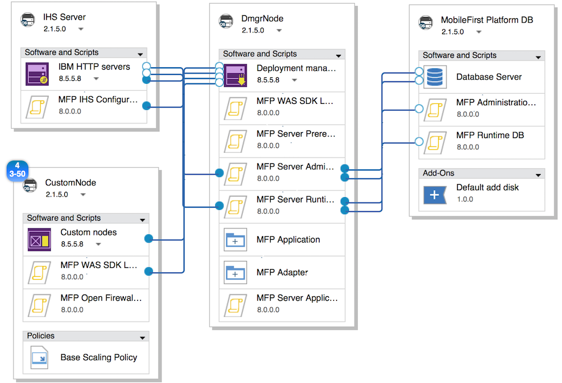

<!-- NLS_CHARSET=UTF-8 -->
## Visión general
{: #overview }
{{ site.data.keys.product_full }} proporciona la funcionalidad de desplegar y gestionar aplicaciones {{ site.data.keys.mf_server }} y {{ site.data.keys.product_adj }} en IBM PureApplication System e IBM PureApplication Service en SoftLayer.

{{ site.data.keys.product }} en combinación con IBM PureApplication System e IBM PureApplication Service en SoftLayer proporciona un entorno simple e intuitivo para desarrolladores y administradores, para desarrollar aplicaciones móvil, probarlas y desplegarlas en la nube. Esta versión de {{ site.data.keys.mf_system_pattern_full }} proporciona el soporte de tiempo de ejecución y artefactos de {{ site.data.keys.product }} para las tecnologías de patrones de sistema virtual de PureApplication incluidas en las versiones más recientes de IBM PureApplication System e IBM PureApplication Service en SoftLayer. El patrón de sistema virtual clásico estaba soportado en versiones anteriores de IBM PureApplication System.

#### Ir a
{: #jump-to }
* [Instalación de {{ site.data.keys.mf_system_pattern }}](#installing-mobilefirst-system-pattern)
* [Requisitos de licencia de señal para {{ site.data.keys.mf_system_pattern }}](#token-licensing-requirements-for-mobilefirst-system-pattern)
* [Despliegue de {{ site.data.keys.mf_server }} en un servidor de perfil de WebSphere Application Server Liberty de nodo único](#deploying-mobilefirst-server-on-a-single-node-websphere-application-server-liberty-profile-server)
* [Despliegue de {{ site.data.keys.mf_server }} en un servidor de perfil de WebSphere Application Server Liberty de varios nodos](#deploying-mobilefirst-server-on-a-multiple-node-websphere-application-server-liberty-profile-server)
* [Despliegue de {{ site.data.keys.mf_server }} en un servidor de perfil completo de WebSphere Application Server de nodo único](#deploying-mobilefirst-server-on-a-single-node-websphere-application-server-full-profile-server)
* [Despliegue de {{ site.data.keys.mf_server }} en un servidor de perfil completo de WebSphere Application Server de varios nodos](#deploying-mobilefirst-server-on-a-multiple-node-websphere-application-server-full-profile-server)
* [Despliegue de {{ site.data.keys.mf_server }} en clústeres de servidores de WebSphere Application Server Network Deployment](#deploying-mobilefirst-server-on-clusters-of-websphere-application-server-network-deployment-servers)
* [Despliegue de {{ site.data.keys.mf_app_center }} en un servidor de perfil de WebSphere Application Server Liberty de nodo único](#deploying-mobilefirst-application-center-on-a-single-node-websphere-application-server-liberty-profile-server)
* [Despliegue de {{ site.data.keys.mf_app_center }} en un servidor de perfil completo de WebSphere Application Server de nodo único](#deploying-mobilefirst-application-center-on-a-single-node-websphere-application-server-full-profile-server)
* [Configuración de la seguridad de administración de {{ site.data.keys.product_adj }} con un repositorio LDAP externo](#configuring-mobilefirst-administration-security-with-an-external-ldap-repository)
* [Configuración de una base de datos externa con {{ site.data.keys.mf_system_pattern }}](#configuring-an-external-database-with-a-mobilefirst-system-pattern)
* [Despliegue y configuración de {{ site.data.keys.mf_analytics }}](#deploying-and-configuring-mobilefirst-analytics)
* [Plantillas predefinidas para {{ site.data.keys.mf_system_pattern }}](#predefined-templates-for-mobilefirst-system-pattern)
* [Paquetes script para {{ site.data.keys.mf_server }}](#script-packages-for-mobilefirst-server)
* [Actualización de {{ site.data.keys.mf_system_pattern }}](#upgrading-mobilefirst-system-pattern)

### Beneficios clave
{: #key-benefits }
{{ site.data.keys.mf_system_pattern }} proporciona los siguientes beneficios:

* Las plantillas predefinidas le permiten construir patrones de forma simple para la mayoría de las topologías de despliegue más típicas de {{ site.data.keys.mf_server }}. Algunos ejemplos de topologías son  
    * Nodo único de perfil de Liberty de IBM WebSphere Application Server
    * Varios nodos de perfil de Liberty de IBM WebSphere Application Server
    * Nodo único de perfil completo de IBM WebSphere Application Server
    * Varios nodos de perfil completo de IBM WebSphere Application Server
    * Clústeres de servidores de WebSphere Application Server Network Deployment
    * Topologías de despliegue de {{ site.data.keys.mf_app_center }} como
        * Nodo único de perfil de Liberty de IBM WebSphere Application Server
        * Nodo único de perfil completo de IBM WebSphere Application Server
* Los paquetes script actúan como bloques para componer topologías de despliegue extendidas como automatizar la inclusión de un servidor de análisis en un patrón y opciones de despliegue DB VM flexible. WebSphere Application Server y los paquetes script DB2 están disponibles a través de la inclusión de los tipos de patrón WebSphere Application Server y DB2.
* Las propiedades JNDI opcionales en el paquete script de despliegue de tiempo de ejecución permiten el ajuste preciso en las topologías de despliegue. Además, las topologías de despliegue generadas con el perfil completo de IBM WebSphere Application Server ahora soportan el acceso a la consola de administración de WebSphere Application Server, que le proporciona control completo sobre la configuración del servidor de aplicaciones.

### Restricciones importantes
{: #important-restrictions }
Según la plantilla de patrón que utilice, no cambie algunos de los atributos de componente. Si cambia alguno de estos atributos de componente, el despliegue de patrones basado en estas plantillas fallará.

#### {{ site.data.keys.product }} (Nodo único Liberty de Application Center)
{: #mobilefirst-foundation-application-center-liberty-single-node }
No cambie los valores de los siguientes atributos en el servidor de perfil de Liberty:

* Directorio de instalación del producto WebSphere
* Ubicación de los datos de configuración
* Nombre del servidor de perfil de Liberty
* En Instalar un Java SDK de IBM, seleccione solo Java SDK V7.0 o Java SDK V7.1
* Seleccione Instalar características adicionales y deseleccione IBM WebSphere eXtreme Scale.

#### {{ site.data.keys.product }} (Nodo único de WebSphere Application Server de Application Center)
{: #mobilefirst-foundation-application-center-websphere-application-server-single-node }
No cambie los valores de los siguientes atributos en el servidor de perfil de Liberty:

* Directorio de instalación del producto WebSphere
* Ubicación de los datos de configuración
* Nombre de celda
* Nombre de nodo
* Nombre de perfil
* En Instalar un Java SDK de IBM, seleccione solo Java SDK V7.0 o Java SDK V7.1
* Seleccione Instalar características adicionales y deseleccione IBM WebSphere eXtreme Scale.

#### {{ site.data.keys.product }} (Nodo único Liberty)
{: #mobilefirst-foundation-liberty-single-node }
No cambie los valores de los siguientes atributos en el servidor de perfil de Liberty:

* Directorio de instalación del producto WebSphere
* Ubicación de los datos de configuración
* Nombre del servidor de perfil de Liberty
* En Instalar un Java SDK de IBM, seleccione solo Java SDK V7.0 o Java SDK V7.1
* Seleccione Instalar características adicionales y deseleccione IBM WebSphere eXtreme Scale.

#### {{ site.data.keys.product }} (granja de servidores Liberty)
{: #mobilefirst-foundation-liberty-server-farm }
No cambie los valores de los siguientes atributos en el servidor de perfil de Liberty:

* Directorio de instalación del producto WebSphere
* Ubicación de los datos de configuración
* Nombre del servidor de perfil de Liberty
* En Instalar un Java SDK de IBM, seleccione solo Java SDK V7.0 o Java SDK V7.1
* Seleccione Instalar características adicionales y deseleccione IBM WebSphere eXtreme Scale.

#### Plantilla de {{ site.data.keys.product }} (Nodo único de WebSphere Application Server)
{: #mobilefirst-foundation-websphere-application-server-single-node-template }
En el **componente de servidor autónomo** del nodo de MobileFirst Platform Server, no desbloquee o cambie los valores de ninguno de los siguientes atributos:

* Nombre de celda
* Nombre de nodo
* Nombre de perfil
* Si cambia alguno de estos atributos, su despliegue de patrón fallará.

#### Plantilla de {{ site.data.keys.product }} (granja de servidores de WebSphere Application Server)
{: #mobilefirst-foundation-websphere-application-server-server-farm-template }
En el **componente de servidor autónomo** del nodo de MobileFirst Platform Server, no desbloquee o cambie los valores de ninguno de los siguientes atributos:

* Nombre de celda
* Nombre de nodo
* Nombre de perfil
* Si cambia alguno de estos atributos, su despliegue de patrón fallará.

#### Plantilla de {{ site.data.keys.product }} (WebSphere Application Server Network Deployment)
{: #mobilefirst-foundation-websphere-application-server-network-deployment-template }
En el **componente del gestor de despliegue** del **nodo DmgrNode** o el **componente de nodos personalizados** del **nodo CustomNode**, no desbloquee o cambie los valores de ninguno de los siguientes atributos:

* Nombre de celda
* Nombre de nodo
* Nombre de perfil

Si cambia alguno de estos atributos, su despliegue de patrón fallará.

### Limitaciones
{: #limitations }
Se aplican las siguientes limitaciones:

* No está soportado el escalado dinámico para las granjas de servidores de perfil de Liberty de WebSphere Application Server y las granjas de servidores de perfil completo de WebSphere Application Server. El número de nodos de granja de servidores se puede especificar en el patrón estableciendo la política de escalado pero no se puede cambiar durante el tiempo de ejecución.
* La ampliación de patrón de sistema de {{ site.data.keys.v63_to_80prerebrand_product_full }} para la interfaz de línea de mandatos {{ site.data.keys.mf_studio }} y Ant que estaba soportada en versiones anteriores a la V7.0, no están disponibles para la versión actual de {{ site.data.keys.mf_system_pattern }}.
* {{ site.data.keys.mf_system_pattern }} depende de los patrones de WebSphere Application Server, que tiene sus propias restricciones. Para obtener más información, consulte [Restricciones de patrones de WebSphere Application Server](http://ibm.biz/knowctr#SSAJ7T_1.0.0/com.ibm.websphere.waspatt20base.doc/ae/rins_patternsB_restrictions.html).
* Debido a las restricciones en la desinstalación de patrones de sistema virtual, debe suprimir los paquetes script de forma manual después de suprimir el tipo de patrón. En IBM PureApplication System, vaya a **Catálogo → Paquetes script** para suprimir los paquetes script listados en la sección **Componentes**.
* La plantilla de patrón de MobileFirst (WebSphere Application Server Network Deployment) no soporta las licencias de señales. Si desea utilizar este patrón debe utilizar una licencia perpetua. Todos los otros patrones soportan licencias de señales.

### Composición
{: #composition }
{{ site.data.keys.mf_system_pattern }} está compuesto de los siguientes patrones:

* IBM WebSphere Application Server Network Deployment Patterns 2.2.0.0.
* [PureApplication Service] WebSphere 8558 para el repositorio IM de móvil no permite el funcionamiento de WebSphere Application Server Network Deployment Patterns. Contacte con el administrador de IBM PureApplication System para confirmar que el repositorio IM de WebSphere 8558 está instalado.
* IBM DB2 con patrón de aceleración BLU 1.2.4.0.
* {{ site.data.keys.mf_system_pattern }}.

### Componentes
{: #components }
Además de los componentes proporcionados por los patrones de IBM WebSphere Application Server e IBM DB2 con patrón de aceleración BLU, {{ site.data.keys.mf_system_pattern }} proporciona los siguientes paquetes script:

* MFP Administration DB
* MFP Runtime DB
* MFP Server Prerequisite
* MFP Server Administration
* MFP Server Runtime Deployment
* MFP Server Application Adapter Deployment
* MFP IHS Configuration
* MFP Analytics
* MFP Open Firewall Ports for WAS
* MFP WAS SDK Level
* MFP Server Application Center

### Compatibilidad entre tipos de patrón y artefactos creados con diferentes versiones de producto
{: #compatibility-between-pattern-types-and-artifacts-created-with-different-product-versions }
Si utiliza MobileFirst Studio V6.3.0 o anterior para desarrollar sus aplicaciones, puede subir el tiempo de ejecución, la aplicación y los artefactos de adaptador asociados en los patrones asociados con {{ site.data.keys.v63_to_80prerebrand_product_full }} V7.0.0 y posterior.

Los tipos de patrón asociados con {{ site.data.keys.v63_to_80prerebrand_product_full }} V6.3.0 o anterior no son compatibles con los tiempos de ejecución, aplicaciones y artefactos de adaptador creados con MobileFirst Studio V7.0.0 y posterior.

Para las versiones V6.0.0 y anteriores, solo son compatibles las mismas versiones de servidor, archivo **.war**, aplicación (archivo **.wlapp**) y adaptadores.

## Instalación de {{ site.data.keys.mf_system_pattern }}
{: #installing-mobilefirst-system-pattern }
Puede encontrar el archivo **{{ site.data.keys.mf_system_pattern_file }}**. Asegúrese de extraer el archivo antes de iniciar este procedimiento.

1. Inicie sesión en IBM PureApplication System con una cuenta que tenga permisos para crear nuevos tipos de patrón.
2. Vaya a **Catálogo → Tipos de patrón**.
3. Suba el archivo **.tgz** de {{ site.data.keys.mf_system_pattern }}:
    * En la barra de herramientas, pulse **+**. Se abrirá la ventana "Instalar un tipo de patrón".
    * En el separador Local, pulse **Examinar**, seleccione el archivo **.tgz** de {{ site.data.keys.mf_system_pattern }} y, a continuación, espere a que se complete el proceso de carga. Se muestra el tipo de patrón en la lista y está marcado como no habilitado.
4. En la lista de tipos de patrón, pulse el tipo de patrón subido. Se muestran los detalles del tipo de patrón.
5. En la fila Acuerdo de licencia, pulse **Licencia**. Se muestra la ventana de licencia que indica los términos del acuerdo de licencia.
6. Para aceptar la licencia, pulse **Aceptar**. Los detalles del tipo de patrón ahora muestran que la licencia está aceptada.
7. En la fila Estado, pulse **Habilitar**. El tipo de patrón se muestra ahora como habilitado.
8. Obligatorio para PureApplication Service: Después de habilitar el tipo de patrón de forma satisfactoria, vaya a **Catálogo → Paquetes script** y seleccione los paquetes script con nombres similares a "MFP \*\*\*". En la página de detalles, a la derecha, acepte la licencia en el campo **Acuerdo de licencia**. Repita el proceso para los once paquetes script listados en la sección Componentes.

## Requisitos de licencia de señal para {{ site.data.keys.mf_system_pattern }}
{: #token-licensing-requirements-for-mobilefirst-system-pattern }
Si utiliza licencias de señales para licenciar {{ site.data.keys.product }}, debe instalar IBM Rational License Key Server y configurarlo con sus licencias antes de desplegar {{ site.data.keys.mf_system_pattern_full }}.

> **Importante:** La plantilla de patrón de {{ site.data.keys.product }} (WAS ND) no soporta licencias de señales. Debe utilizar licencias perpetuas para desplegar patrones basados en la plantilla de patrón {{ site.data.keys.product }} (WAS ND). Todas las otras plantillas de patrón dan soporte a las licencias de señales.

Su IBM Rational License Key Server debe ser externo a su PureApplication System. {{ site.data.keys.system_pattern }} no soporta el servicio compartido de PureApplication System para IBM Rational License Key Server.

Además, debe saber la siguiente información sobre su Rational License Key Server para añadir la información del servidor de clave de licencia a sus atributos de patrón:

* Nombre completo de host o dirección IP de su Rational License Key Server
* Puerto daemon de gestor de licencias (**lmgrd**)
* Puerto daemon de proveedor (**ibmratl**)

Si tiene un cortafuegos entre su Rational License Key Server y su PureApplication System, asegúrese de que ambos puertos daemon están abiertos en su cortafuegos.
El despliegue de {{ site.data.keys.system_pattern }} falla si no se puede contactar con el servidor de clave de licencia o si no hay suficientes tokens de licencia disponibles.

Para obtener detalles sobre cómo instalar y configurar Rational License Key Server, consulte [IBM Support - Rational licensing start page](http://www.ibm.com/software/rational/support/licensing/).

## Despliegue de {{ site.data.keys.mf_server }} en un servidor de perfil de WebSphere Application Server Liberty de nodo único
{: #deploying-mobilefirst-server-on-a-single-node-websphere-application-server-liberty-profile-server }
Utilice una plantilla predefinida para desplegar {{ site.data.keys.mf_server }} en un servidor de perfil de WebSphere Application Server Liberty de nodo único.

Este procedimiento implica subir ciertos artefactos a IBM PureApplication System como la aplicación y el adaptador necesarios. Antes de empezar, asegúrese de que los artefactos están disponibles para subir.

**Requisitos de licencias de señales:** Si utiliza licencias de señales para licenciar {{ site.data.keys.product }}, revise los requisitos indicados en [Requisitos de licencia de señal para {{ site.data.keys.mf_system_pattern }}](#token-licensing-requirements-for-mobilefirst-system-pattern) antes de continuar. El despliegue de este patrón falla si no se puede contactar con el servidor de clave de licencia o si no hay suficientes tokens de licencia disponibles.

Algunos parámetros de los paquetes script en la plantilla se han configurado con los valores recomendados y no se mencionan en esta sección. Para fines de buen ajuste, consulte más información sobre todos los parámetros de los paquetes script en [Paquetes script para {{ site.data.keys.mf_server }}](#script-packages-for-mobilefirst-server).

Para obtener más información sobre las opciones de composición y configuración de la plantilla predefinida utilizada en este procedimiento, consulte [Plantilla de {{ site.data.keys.product }} (Nodo único Liberty)](#mobilefirst-foundation-liberty-single-node-template).

1. Cree un patrón con la plantilla predefinida:
    * En el panel de control de IBM PureApplication System, pulse **Patrones → Patrones de sistema virtual**. Se abre la página de Patrones de sistema virtual.
    * En la página **Patrones de sistema virtual**, pulse **Crear nuevo** y, a continuación, en la ventana emergente, seleccione **MobileFirst Platform (Nodo único Liberty)** en la lista de plantillas predefinidas. Si el nombre solo es visible parcialmente debido a su longitud, puede confirmar si la plantilla seleccionada es la correcta viendo su descripción en el separador **Más información**.
    * En el campo **Nombre**, proporcione un nombre para el patrón.
    * En el campo **Versión**, especifique en número de versión del patrón.
    * Pulse **Iniciar construcción**.
2. Obligatorio para AIX : En IBM PureApplication System que se ejecuta en Power, el nodo DB de MobileFirst Platform debe utilizar el complemento de componente específico de AIX "Default AIX add disk" para reemplazar el componente "Default add disk" en la plantilla para soportar el sistema de archivo jfs2:
    * En el creador de patrones, seleccione el nodo **MobileFirst Platform DB**.
    * Pulse el botón **Añadir un complemento de componente** (el botón está disponible encima del recuadro de componentes cuando pasa el cursor por encima del nodo **MobileFirst Platform DB**).
    * En la lista **Añadir complemento**, seleccione **Default AIX add disk**. El componente se añade como el último componente del nodo MobileFirst Platform DB.
    * Seleccione el componente **Default AIX add disk** y especifique los siguientes atributos:
        * **DISK_SIZE_GB:** Tamaño de almacenamiento (medido en GB) a ampliar en el servidor DB. Valor de ejemplo: **10**.
        * **FILESYSTEM_TYPE:** Sistema de archivos soportado en AIX. Valor predeterminado: **jfs2**.
        * **MOUNT_POINT:** Se alinea con el atributo **Mount point for instance owner** en el componente de servidor de base de datos en el nodo MobileFirst Platform DB. Valor de ejemplo: **/dbinst**.
        * **VOLUME_GROUP:** Valor de ejemplo: **group1**. Contacte con su administrador de IBM PureApplication System para obtener el valor correcto.
    * En el nodo MobileFirst Platform DB, seleccione el componente **Default add disk** y, a continuación, pulse el icono de papelera para suprimirlo.
    * Guarde el patrón.
3. Opcional: Configure la administración de {{ site.data.keys.mf_server }}. Puede saltarse este paso si desea especificar la credencial de usuario con privilegio de administración de {{ site.data.keys.mf_server }} más tarde durante la fase de configuración del despliegue del patrón en el paso 9. Para especificarlo ahora, complete estos pasos:

    > **Nota:** Si desea configurar la seguridad de administración con un servidor LDAP, debe proporcionar información LDAP adicional. Para obtener más información, consulte [Configuración de la seguridad de administración de {{ site.data.keys.product_adj }} con un repositorio LDAP externo](#configuring-mobilefirst-administration-security-with-an-external-ldap-repository).
    * En el nodo MobileFirst Platform Server, pulse el componente **MFP Server Administration**. Las propiedades del componente seleccionado se muestran al lado del lienzo.
    * Junto a los campos **admin_user** y **admin_password**, pulse el botón Suprimir para borrar los valores de parámetros a nivel de patrón.
    * En los campos **admin_user** y **admin\_password**, especifique el nombre de usuario de administración y la contraseña.
    * Si utiliza licencias de señales para licenciar {{ site.data.keys.product }}, complete los campos siguientes. Si no utiliza licencias de señales, deje estos campos en blanco.

    **ACTIVATE\_TOKEN\_LICENSE**: Seleccione este campo para licenciar su patrón con licencias de señales.  
    **LICENSE\_SERVER\_HOSTNAME**: Introduzca el nombre completo de host o la dirección IP de su Rational License Key Server.  
    **LMGRD\_PORT**: Introduzca el número de puerto al que escucha el daemon gestor de licencias (**lmrgd**) para conexiones. El puerto daemon gestor de licencias predeterminado es 27000.  
    **IBMRATL\_PORT**: Introduzca el número de puerto al que escucha el daemon de proveedor (**ibmratl**) para conexiones. El puerto daemon proveedor predeterminado es normalmente el 27001.  

    Durante el despliegue de patrón se crea una cuenta de administración predeterminada para {{ site.data.keys.mf_server }}.

4. Opcional: Configure el despliegue de tiempo de ejecución de {{ site.data.keys.mf_server }}. Puede saltarse este paso si desea especificar el nombre de raíz de contexto para el tiempo de ejecución más adelante durante el patrón fase de configuración de despliegue en el paso 9. Para especificarlo ahora, complete estos pasos:
    * En el nodo MobileFirst Platform Server, pulse el componente **MFP Server Runtime Deployment**. Las propiedades del componente seleccionado se muestran al lado del lienzo.
    * Junto al campo **runtime\_contextRoot**, pulse el botón **Suprimir** para borrar el valor de parámetro a nivel de patrón.
    * En el campo **runtime\_contextRoot**, especifique el nombre de raíz de contexto de tiempo de ejecución. Tenga en cuenta que el nombre de raíz de contexto de tiempo de ejecución debe empezar con una barra inclinada, /; por ejemplo, `/HelloWorld`.

5. Subir una aplicación y artefactos de adaptador:

    > **Importante:** Al especificar la vía de acceso de destino de las aplicaciones y adaptadores, asegúrese de que todas las aplicaciones y adaptadores están ubicados en el mismo directorio. Por ejemplo, si una vía de acceso de destino es **/opt/tmp/deploy/HelloWorld-common.json**, las demás vías de destino deben ser `/opt/tmp/deploy/*`.
    * En el nodo de MobileFirst Platform Server, pulse el componente **MFP Server Application** o **MFP Server Adapter**. Las propiedades del componente seleccionado se muestran al lado del lienzo.
    * En el campo **Archivo adicional**, pulse el botón **Examinar** para localizar y subir la aplicación o artefacto de adaptador.
    * En el campo **Target path**, especifique la vía de acceso completa para almacenar el artefacto, incluyendo su nombre de archivo. Por ejemplo, **/opt/tmp/deploy/HelloWorld-common.json**.
    * Si no hay ninguna aplicación o adaptador para desplegar en el patrón, elimine el componente relevante pulsando el botón **X** dentro de él. Para obtener un {{ site.data.keys.mf_console }} vacío desplegado sin ninguna aplicación o adaptador instalado, elimine el componente MFP Server Application Adapter Deployment pulsando el botón X dentro de él.

6. Opcional: Añada más aplicaciones o artefactos de adaptador para el despliegue:
    * En la barra de herramientas **Activos**, expanda **Componentes de software** y, a continuación arrastre y suelte un componente de **Archivo adicional** en el lienzo del nodo MobileFirst Platform Server. Cambie el nombre a **{{ site.data.keys.product_adj }} App\_X** o **{{ site.data.keys.product_adj }} Adatper\_X** (donde la **X** es un número único para la diferenciación).
    * Pase el cursor por encima de la nueva aplicación o del componente de adaptador y, a continuación, pulse los botones **Mover hacia arriba** y **Mover hacia abajo** para ajustar su secuencia en el nodo. Asegúrese de que está colocado después del componente MFP Runtime Deployment pero antes del componente MFP Server Application Adapter Deployment.
    * Pulse en la nueva aplicación o en el componente de adaptador. Las propiedades del componente seleccionado se muestran al lado del lienzo. Suba la aplicación o el artefacto de adaptador y especifique su vía de acceso de destino utilizando los pasos del paso 6.
    * Repita el paso 7 para añadir más aplicaciones y adaptadores para el despliegue.

7. Opcional: Configure el despliegue de aplicación y adaptador en {{ site.data.keys.mf_server }}. Puede saltarse este paso si desea especificar la credencial de usuario con privilegio de despliegue más adelante durante la fase de configuración del despliegue de patrón en el paso 9. Si ha especificado la credencial de usuario administrativo predeterminada en el paso 3, ahora puede especificar el usuario desplegador, que debe alinearse con la credencial de usuario administrativo:
    * En el nodo MobileFirst Platform Server, seleccione el componente **MFP Server Application Adapter Deployment**. Las propiedades del componente seleccionado se muestran al lado del lienzo.
    * Localice los parámetros **deployer_user** y **deployer_password** y, a continuación, pulse los botones Suprimir situados al lado para borrar el valor de parámetro a nivel de patrón.
    * En los campos **deployer\_user** y **deployer\_password**, especifique el nombre de usuario y la contraseña.

8. Configure e inicie el despliegue de patrón:
    * En el panel de control de IBM PureApplication System, pulse **Patrones → Patrones de sistema virtual**.
    * En la página **Patrones de sistema virtual**, utilice el campo de **Búsqueda** para encontrar el patrón que ha creado y, a continuación, seleccione el patrón.
    * En la barra de herramientas sobre el panel que muestra la información detallada sobre el patrón, pulse el botón Desplegar.
    * En la ventana Desplegar patrón, en el panel Configurar, seleccione el perfil de entorno correcto en la lista de **Perfil de entorno** y proporcione otros parámetros de entorno de IBM PureApplication System. Para obtener la información correcta, consulte a su administrador de IBM PureApplication System.
    * En la columna del medio, pulse **Atributos de patrón** para mostrar atributos como nombres de usuario y contraseñas.

        Proporcione la siguiente información en los campos suministrados:

        > **Nota:** Realice los cambios necesarios en los valores predeterminados de los parámetros a nivel de patrón incluso si hay un servidor LDAP externo configurado. Si configura seguridad de administración utilizando un servidor LDAP, debe proporcionar información LDAP adicional. Para obtener más información, consulte [Configuración de la seguridad de administración de {{ site.data.keys.product_adj }} con un repositorio LDAP externo](#configuring-mobilefirst-administration-security-with-an-external-ldap-repository).
        
        **admin\_user**  
        No es visible si se ha configurado en el paso 3. Cree una cuenta de administrador de {{ site.data.keys.mf_server }} predeterminada. Valor predeterminado: demo.
        
        **admin\_password**  
        No es visible si se ha configurado en el paso 3. Contraseña de cuenta de administrador predeterminada. Valor predeterminado: demo.
        
        **ACTIVATE\_TOKEN\_LICENSE**  
        No es visible si se ha configurado en el paso 3. Seleccione este campo para licenciar su patrón con licencias de señales. Deje este campo vacío si utiliza licencias perpetuas.
        
        **LICENSE\_SERVER\_HOSTNAME**  
        No es visible si se ha configurado en el paso 3. Si utiliza licencias de señales para licenciar {{ site.data.keys.product }}, introduzca el nombre completo de host o dirección IP de su dirección IP de Rational License Key Server. De lo contrario, deje este campo en blanco.
        
        **LMGRD\_PORT**   
        No es visible si se ha configurado en el paso 3. Si utiliza licencias de señales para licenciar {{ site.data.keys.product }}, introduzca el número de puerto que escucha el daemon gestor de licencias (lmrgd) para conexiones. De lo contrario, deje este campo en blanco.
        El puerto daemon gestor de licencias predeterminado es 27000.

        **IBMRATL\_PORT**  
        No es visible si se ha configurado en el paso 3. Si utiliza licencias de señales para licenciar {{ site.data.keys.product }}, introduzca el número de puerto que escucha el daemon proveedor (ibmratl) para conexiones. De lo contrario, deje este campo en blanco.
        El puerto daemon proveedor predeterminado es normalmente el 27001.

        **runtime\_contextRoot**  
        No es visible si se ha configurado en el paso 5. Nombre de raíz de contexto para el tiempo de ejecución de {{ site.data.keys.mf_server }}. El nombre debe empezar con "/".
        
        **deployer\_user**  
        No es visible si se ha configurado en el paso 8. Nombre de usuario para la cuenta con privilegio de despliegue. Si no se ha configurado un servidor LDAP externo, debe introducir el mismo valor que se especificó al crear el usuario administrativo predeterminado para el servicio de administración, porque en este caso, el único usuario autorizado para el despliegue de aplicaciones y adaptadores es el usuario administrativo predeterminado.
        
        **deployer\_password**  
        No es visible si se ha configurado en el paso 8. Contraseña de usuario para el usuario con privilegio de despliegue.
        
        **MFP Vms Password(raíz)**  
        Contraseña raíz para los nodos de base de datos de {{ site.data.keys.mf_server }} y {{ site.data.keys.product }}. Valor predeterminado: passw0rd.
        
        **MFP DB Password(Propietario de instancia)**  
        Contraseña de propietario de instancia para el nodo MobileFirst Platform DB. Valor predeterminado: **passw0rd**.    
    * Pulse **Despliegue rápido** para iniciar el despliegue de su patrón. Tras unos pocos segundos, se muestra un mensaje que indica que se ha iniciado el patrón. Puede pulsar el URL proporcionado en el mensaje para realizar el seguimiento del estado de despliegue de su patrón o ir a **Patrones → Instancias de sistema virtual** para abrir la página de Instancias de sistema virtual y buscar su patrón.

    Si utiliza licencias de señales para licenciar {{ site.data.keys.product }}, su patrón fallará al desplegarse si no hay suficientes tokens de licencia disponibles o si la dirección IP del servidor de claves de licencia y el puerto introducidos no son correctos.

9. Acceda a {{ site.data.keys.mf_console }}:
    * Pulse **Patrones → Instancias de sistema virtual** para abrir la página de Instancias de sistema virtual y buscar su patrón. Asegúrese de que esté en estado de ejecución.
    * Seleccione el nombre de patrón y expanda la opción **Perspectiva de máquina virtual** en el panel que muestra detalles de la instancia seleccionada.
    * Busque la máquina virtual de {{ site.data.keys.mf_server }} con un nombre similar a **MobileFirst\_Platform\_Server.** y anote la dirección IP pública; necesitará esta información en el paso siguiente.
    * En el explorador, abra {{ site.data.keys.mf_console }} componiendo su URL con uno de los formatos siguientes:
        * `http://{IP pública de la máquina virtual de MFP Server}:9080/mfpconsole`
        * `https://{IP pública de la máquina virtual de MFP Server}:9443/mfpconsole`
    * Inicie sesión en la consola con el usuario administrado y la contraseña especificados en el paso 3 o el paso 9.

## Despliegue de {{ site.data.keys.mf_server }} en un servidor de perfil de WebSphere Application Server Liberty de varios nodos
{: #deploying-mobilefirst-server-on-a-multiple-node-websphere-application-server-liberty-profile-server }
Utilice una plantilla predefinida para desplegar {{ site.data.keys.mf_server }} en un servidor de perfil de WebSphere Application Server Liberty de varios nodos.

Este procedimiento implica subir ciertos artefactos a IBM PureApplication System como la aplicación y el adaptador necesarios. Antes de empezar, asegúrese de que los artefactos están disponibles para subir.

**Requisitos de licencias de señales:** Si utiliza licencias de señales para licenciar {{ site.data.keys.product }}, revise los requisitos indicados en [Requisitos de licencia de señal para {{ site.data.keys.mf_system_pattern }}](#token-licensing-requirements-for-mobilefirst-system-pattern) antes de continuar. El despliegue de este patrón falla si no se puede contactar con el servidor de clave de licencia o si no hay suficientes tokens de licencia disponibles.

Algunos parámetros de los paquetes script en la plantilla se han configurado con los valores recomendados y no se mencionan en esta sección. Para fines de buen ajuste, consulte más información sobre todos los parámetros de los paquetes script en [Paquetes script para {{ site.data.keys.mf_server }}](#script-packages-for-mobilefirst-server).

Para obtener más información sobre las opciones de composición y configuración de la plantilla predefinida utilizada en este procedimiento, consulte [Plantilla de {{ site.data.keys.product }} (granja de servidores Liberty)](#mobilefirst-foundation-liberty-server-farm-template).

1. Cree un patrón con la plantilla predefinida:
    * En el panel de control de IBM PureApplication System, pulse **Patrones → Patrones de sistema virtual**. Se abre la página de **Patrones de sistema virtual**.
    * En la página **Patrones de sistema virtual**, pulse **Crear nuevo** y, a continuación, en la ventana emergente, seleccione **MobileFirst Platform (varios nodos Liberty)** en la lista de plantillas predefinidas. Si el nombre solo es visible parcialmente debido a su longitud, puede confirmar si la plantilla seleccionada es la correcta viendo su descripción en el separador **Más información**.
    * En el campo **Nombre**, proporcione un nombre para el patrón.
    * En el campo **Versión**, especifique en número de versión del patrón.
    * Pulse **Iniciar construcción**.
2. Obligatorio para AIX : En IBM PureApplication System que se ejecuta en Power, el nodo DB de MobileFirst Platform debe utilizar el complemento de componente específico de AIX "Default AIX add disk" para reemplazar el componente "Default add disk" en la plantilla para soportar el sistema de archivo **jfs2**:
    * En el creador de patrones, seleccione el nodo **MobileFirst Platform DB**.
    * Pulse el botón **Añadir un complemento de componente** (el botón está disponible encima del recuadro de componentes cuando pasa el cursor por encima del nodo **MobileFirst Platform DB**).
    * En la lista **Añadir complemento**, seleccione **Default AIX add disk**. El componente se añade como el último componente del nodo MobileFirst Platform DB.
    * Seleccione el componente **Default AIX add disk** y especifique los siguientes atributos:
        * **DISK_SIZE_GB:** Tamaño de almacenamiento (medido en GB) a ampliar en el servidor DB. Valor de ejemplo: **10**.
        * **FILESYSTEM_TYPE:** Sistema de archivos soportado en AIX. Valor predeterminado: **jfs2**.
        * **MOUNT_POINT:** Se alinea con el atributo **Mount point for instance owner** en el componente de servidor de base de datos en el nodo MobileFirst Platform DB. Valor de ejemplo: **/dbinst**.
        * **VOLUME_GROUP:** Valor de ejemplo: **group1**. Contacte con su administrador de IBM PureApplication System para obtener el valor correcto.
    * En el nodo MobileFirst Platform DB, seleccione el componente **Default add disk** y, a continuación, pulse el icono de papelera para suprimirlo.
    * Guarde el patrón.
3. Opcional: Configure la administración de {{ site.data.keys.mf_server }}. Puede saltarse este paso si desea especificar la credencial de usuario con privilegio de administración de {{ site.data.keys.mf_server }} más tarde durante la fase de configuración del despliegue del patrón en el paso 9. Para especificarlo ahora, complete estos pasos:

    > **Nota:** Si desea configurar la seguridad de administración con un servidor LDAP, debe proporcionar información LDAP adicional. Para obtener más información, consulte [Configuración de la seguridad de administración de {{ site.data.keys.product_adj }} con un repositorio LDAP externo](#configuring-mobilefirst-administration-security-with-an-external-ldap-repository).
    * En el nodo MobileFirst Platform Server, pulse el componente **MFP Server Administration**. Las propiedades del componente seleccionado se muestran al lado del lienzo.
    * Junto a los campos **admin_user** y **admin_password**, pulse el botón Suprimir para borrar los valores de parámetros a nivel de patrón.
    * En los campos **admin_user** y **admin\_password**, especifique el nombre de usuario de administración y la contraseña.
    * Si utiliza licencias de señales para licenciar {{ site.data.keys.product }}, complete los campos siguientes. Si no utiliza licencias de señales, deje estos campos en blanco.

    **ACTIVATE\_TOKEN\_LICENSE**: Seleccione este campo para licenciar su patrón con licencias de señales.  
    **LICENSE\_SERVER\_HOSTNAME**: Introduzca el nombre completo de host o la dirección IP de su Rational License Key Server.  
    **LMGRD\_PORT**: Introduzca el número de puerto al que escucha el daemon gestor de licencias (**lmrgd**) para conexiones. El puerto daemon gestor de licencias predeterminado es 27000.  
    **IBMRATL\_PORT**: Introduzca el número de puerto al que escucha el daemon de proveedor (**ibmratl**) para conexiones. El puerto daemon proveedor predeterminado es normalmente el 27001.  

    Durante el despliegue de patrón se crea una cuenta de administración predeterminada para {{ site.data.keys.mf_server }}.
    
4. Opcional: Configure el despliegue de tiempo de ejecución de {{ site.data.keys.mf_server }}. Puede saltarse este paso si desea especificar el nombre de raíz de contexto para el tiempo de ejecución más adelante durante el patrón fase de configuración de despliegue en el paso 10. Para especificarlo ahora, complete estos pasos:
    * En el nodo MobileFirst Platform Server, pulse el componente **MFP Server Runtime Deployment**. Las propiedades del componente seleccionado se muestran al lado del lienzo.
    * Junto al campo **runtime\_contextRoot**, pulse el botón **Suprimir** para borrar el valor de parámetro a nivel de patrón.
    * En el campo **runtime\_contextRoot**, especifique el nombre de raíz de contexto de tiempo de ejecución. Tenga en cuenta que el nombre de raíz de contexto de tiempo de ejecución debe empezar con una barra inclinada, /; por ejemplo, `/HelloWorld`.

5. Subir una aplicación y artefactos de adaptador:

    > **Importante:** Al especificar la vía de acceso de destino de las aplicaciones y adaptadores, asegúrese de que todas las aplicaciones y adaptadores están ubicados en el mismo directorio. Por ejemplo, si una vía de acceso de destino es **/opt/tmp/deploy/HelloWorld-common.json**, las demás vías de destino deben ser `/opt/tmp/deploy/*`.
    * En el nodo de MobileFirst Platform Server, pulse el componente **MFP Server Application** o **MFP Server Adapter**. Las propiedades del componente seleccionado se muestran al lado del lienzo.
    * En el campo **Archivo adicional**, pulse el botón **Examinar** para localizar y subir la aplicación o artefacto de adaptador.
    * En el campo **Target path**, especifique la vía de acceso completa para almacenar el artefacto, incluyendo su nombre de archivo. Por ejemplo, **/opt/tmp/deploy/HelloWorld-common.json**.
    * Si no hay ninguna aplicación o adaptador para desplegar en el patrón, elimine el componente relevante pulsando el botón **X** dentro de él. Para obtener un {{ site.data.keys.mf_console }} vacío desplegado sin ninguna aplicación o adaptador instalado, elimine el componente MFP Server Application Adapter Deployment pulsando el botón X dentro de él. 

6. Opcional: Añada más aplicaciones o artefactos de adaptador para el despliegue:
    * En la barra de herramientas **Activos**, expanda **Componentes de software** y, a continuación arrastre y suelte un componente de **Archivo adicional** en el lienzo del nodo MobileFirst Platform Server. Cambie el nombre a **{{ site.data.keys.product_adj }} App\_X** o **{{ site.data.keys.product_adj }} Adatper\_X** (donde la **X** es un número único para la diferenciación).
    * Pase el cursor por encima de la nueva aplicación o del componente de adaptador y, a continuación, pulse los botones **Mover hacia arriba** y **Mover hacia abajo** para ajustar su secuencia en el nodo. Asegúrese de que está colocado después del componente MFP Runtime Deployment pero antes del componente MFP Server Application Adapter Deployment.
    * Pulse en la nueva aplicación o en el componente de adaptador. Las propiedades del componente seleccionado se muestran al lado del lienzo. Suba la aplicación o el artefacto de adaptador y especifique su vía de acceso de destino utilizando los pasos del paso 6.
    * Repita el paso 7 para añadir más aplicaciones y adaptadores para el despliegue.

7. Opcional: Configure el despliegue de aplicación y adaptador en {{ site.data.keys.mf_server }}. Puede saltarse este paso si desea especificar la credencial de usuario con privilegio de despliegue más adelante durante la fase de configuración del despliegue de patrón en el paso 9. Si ha especificado la credencial de usuario administrativo predeterminada en el paso 3, ahora puede especificar el usuario desplegador, que debe alinearse con la credencial de usuario administrativo:
    * En el nodo MobileFirst Platform Server, seleccione el componente **MFP Server Application Adapter Deployment**. Las propiedades del componente seleccionado se muestran al lado del lienzo.
    * Localice los parámetros **deployer_user** y **deployer_password** y, a continuación, pulse los botones Suprimir situados al lado para borrar el valor de parámetro a nivel de patrón.
    * En los campos **deployer\_user** y **deployer\_password**, especifique el nombre de usuario y la contraseña.

8. Configurar la política de escalado base:
    * En el nodo MobileFirst Platform Server, seleccione el componente **Política de escalado base**. Las propiedades del componente seleccionado se muestran al lado del lienzo.
    * En el campo **Número de instancias**, especifique el número de nodos de servidor a instanciar durante el despliegue de patrón. El valor predeterminado es 2 en la plantilla predeterminada. Puesto que el escalado dinámico no esta soportado en este release, no especifique valores en el resto de los campos de atributo.

9. Configure e inicie el despliegue de patrón:
    * En el panel de control de IBM PureApplication System, pulse **Patrones → Patrones de sistema virtual**.
    * En la página **Patrones de sistema virtual**, utilice el campo de **Búsqueda** para encontrar el patrón que ha creado y, a continuación, seleccione el patrón.
    * En la barra de herramientas sobre el panel que muestra la información detallada sobre el patrón, pulse el botón Desplegar.
    * En la ventana Desplegar patrón, en el panel Configurar, seleccione el perfil de entorno correcto en la lista de **Perfil de entorno** y proporcione otros parámetros de entorno de IBM PureApplication System. Para obtener la información correcta, consulte a su administrador de IBM PureApplication System.
    * En la columna del medio, pulse **Atributos de patrón** para mostrar atributos como nombres de usuario y contraseñas.

        Proporcione la siguiente información en los campos suministrados:

        > **Nota:** Realice los cambios necesarios en los valores predeterminados de los parámetros a nivel de patrón incluso si hay un servidor LDAP externo configurado. Si configura seguridad de administración utilizando un servidor LDAP, debe proporcionar información LDAP adicional. Para obtener más información, consulte [Configuración de la seguridad de administración de {{ site.data.keys.product_adj }} con un repositorio LDAP externo](#configuring-mobilefirst-administration-security-with-an-external-ldap-repository).
        
        **admin\_user**  
        No es visible si se ha configurado en el paso 3. Cree una cuenta de administrador de {{ site.data.keys.mf_server }} predeterminada. Valor predeterminado: demo.
        
        **admin\_password**  
        No es visible si se ha configurado en el paso 3. Contraseña de cuenta de administrador predeterminada. Valor predeterminado: demo.
        
        **ACTIVATE\_TOKEN\_LICENSE**  
        No es visible si se ha configurado en el paso 3. Seleccione este campo para licenciar su patrón con licencias de señales. Deje este campo vacío si utiliza licencias perpetuas.
        
        **LICENSE\_SERVER\_HOSTNAME**  
        No es visible si se ha configurado en el paso 3. Si utiliza licencias de señales para licenciar {{ site.data.keys.product }}, introduzca el nombre completo de host o dirección IP de su dirección IP de Rational License Key Server. De lo contrario, deje este campo en blanco.
        
        **LMGRD\_PORT**   
        No es visible si se ha configurado en el paso 3. Si utiliza licencias de señales para licenciar {{ site.data.keys.product }}, introduzca el número de puerto que escucha el daemon gestor de licencias (lmrgd) para conexiones. De lo contrario, deje este campo en blanco.
        El puerto daemon gestor de licencias predeterminado es 27000.

        **IBMRATL\_PORT**  
        No es visible si se ha configurado en el paso 3. Si utiliza licencias de señales para licenciar {{ site.data.keys.product }}, introduzca el número de puerto que escucha el daemon proveedor (ibmratl) para conexiones. De lo contrario, deje este campo en blanco.
        El puerto daemon proveedor predeterminado es normalmente el 27001.

        **runtime\_contextRoot**  
        No es visible si se ha configurado en el paso 5. Nombre de raíz de contexto para el tiempo de ejecución de {{ site.data.keys.mf_server }}. El nombre debe empezar con "/".
        
        **deployer\_user**  
        No es visible si se ha configurado en el paso 8. Nombre de usuario para la cuenta con privilegio de despliegue. Si no se ha configurado un servidor LDAP externo, debe introducir el mismo valor que se especificó al crear el usuario administrativo predeterminado para el servicio de administración, porque en este caso, el único usuario autorizado para el despliegue de aplicaciones y adaptadores es el usuario administrativo predeterminado.
        
        **deployer\_password**  
        No es visible si se ha configurado en el paso 8. Contraseña de usuario para el usuario con privilegio de despliegue.
        
        **MFP Vms Password(raíz)**  
        Contraseña raíz para los nodos de base de datos de {{ site.data.keys.mf_server }} y {{ site.data.keys.product }}. Valor predeterminado: passw0rd.
        
        **MFP DB Password(Propietario de instancia)**  
        Contraseña de propietario de instancia para el nodo MobileFirst Platform DB. Valor predeterminado: **passw0rd**.    
    * Pulse **Despliegue rápido** para iniciar el despliegue de su patrón. Tras unos pocos segundos, se muestra un mensaje que indica que se ha iniciado el patrón. Puede pulsar el URL proporcionado en el mensaje para realizar el seguimiento del estado de despliegue de su patrón o ir a **Patrones → Instancias de sistema virtual** para abrir la página de Instancias de sistema virtual y buscar su patrón.

    Si utiliza licencias de señales para licenciar {{ site.data.keys.product }}, su patrón fallará al desplegarse si no hay suficientes tokens de licencia disponibles o si la dirección IP del servidor de claves de licencia y el puerto introducidos no son correctos.
    
10. Acceda a {{ site.data.keys.mf_console }}:
    * Pulse **Patrones → Instancias de sistema virtual** para abrir la página de Instancias de sistema virtual y buscar su patrón. Asegúrese de que esté en estado de ejecución.
    * Seleccione el nombre de patrón y expanda la opción **Perspectiva de máquina virtual** en el panel que muestra detalles de la instancia seleccionada.
    * Busque la máquina virtual de IHS Server con un nombre similar a **IHS\_Server.*** y anote la dirección IP pública; necesitará esta información en el paso siguiente.
    * En el explorador, abra {{ site.data.keys.mf_console }} componiendo su URL con uno de los formatos siguientes:
        * `http://{IP pública de la máquina virtual de IHS Server}/mfpconsole`
        * `https://{IP pública de la máquina virtual de IHS Server}/mfpconsole`
    * Inicie sesión en la consola con el ID de usuario administrativo y la contraseña especificados en el paso 3 o el paso 10.

## Despliegue de {{ site.data.keys.mf_server }} en un servidor de perfil completo de WebSphere Application Server de nodo único
{: #deploying-mobilefirst-server-on-a-single-node-websphere-application-server-full-profile-server }
Utilice una plantilla predefinida para desplegar un {{ site.data.keys.mf_server }} de nodo único en un en un servidor de perfil completo de WebSphere Application Server.

Este procedimiento implica subir ciertos artefactos a IBM PureApplication System como la aplicación y el adaptador necesarios. Antes de empezar, asegúrese de que los artefactos están disponibles para subir.

**Requisitos de licencias de señales:** Si utiliza licencias de señales para licenciar {{ site.data.keys.product }}, revise los requisitos indicados en [Requisitos de licencia de señal para {{ site.data.keys.mf_system_pattern }}](#token-licensing-requirements-for-mobilefirst-system-pattern) antes de continuar. El despliegue de este patrón falla si no se puede contactar con el servidor de clave de licencia o si no hay suficientes tokens de licencia disponibles.

Algunos parámetros de los paquetes script en la plantilla se han configurado con los valores recomendados y no se mencionan en esta sección. Para fines de buen ajuste, consulte más información sobre todos los parámetros de los paquetes script en [Paquetes script para {{ site.data.keys.mf_server }}](#script-packages-for-mobilefirst-server).

Para obtener más información sobre las opciones de composición y configuración de la plantilla predefinida utilizada en este procedimiento, consulte [Plantilla de {{ site.data.keys.product }} (Nodo único WAS)](#mobilefirst-foundation-was-single-node-template).

1. Cree un patrón con la plantilla predefinida:
    * En el panel de control de IBM PureApplication System, pulse **Patrones → Patrones de sistema virtual**. Se abre la página de **Patrones de sistema virtual**.
    * En la página **Patrones de sistema virtual**, pulse **Crear nuevo** y, a continuación, en la ventana emergente, seleccione **MobileFirst Platform (Nodo único WAS)** en la lista de plantillas predefinidas. Si el nombre solo es visible parcialmente debido a su longitud, puede confirmar si la plantilla seleccionada es la correcta viendo su descripción en el separador **Más información**.
    * En el campo **Nombre**, proporcione un nombre para el patrón.
    * En el campo **Versión**, especifique en número de versión del patrón.
    * Pulse **Iniciar construcción**.
2. Obligatorio para AIX : En IBM PureApplication System que se ejecuta en Power, el nodo DB de MobileFirst Platform debe utilizar el complemento de componente específico de AIX "Default AIX add disk" para reemplazar el componente "Default add disk" en la plantilla para soportar el sistema de archivo **jfs2**:
    * En el creador de patrones, seleccione el nodo **MobileFirst Platform DB**.
    * Pulse el botón **Añadir un complemento de componente** (el botón está disponible encima del recuadro de componentes cuando pasa el cursor por encima del nodo **MobileFirst Platform DB**).
    * En la lista **Añadir complemento**, seleccione **Default AIX add disk**. El componente se añade como el último componente del nodo MobileFirst Platform DB.
    * Seleccione el componente **Default AIX add disk** y especifique los siguientes atributos:
        * **DISK_SIZE_GB:** Tamaño de almacenamiento (medido en GB) a ampliar en el servidor DB. Valor de ejemplo: **10**.
        * **FILESYSTEM_TYPE:** Sistema de archivos soportado en AIX. Valor predeterminado: **jfs2**.
        * **MOUNT_POINT:** Se alinea con el atributo **Mount point for instance owner** en el componente de servidor de base de datos en el nodo MobileFirst Platform DB. Valor de ejemplo: **/dbinst**.
        * **VOLUME_GROUP:** Valor de ejemplo: **group1**. Contacte con su administrador de IBM PureApplication System para obtener el valor correcto.
    * En el nodo MobileFirst Platform DB, seleccione el componente **Default add disk** y, a continuación, pulse el icono de papelera para suprimirlo.
    * Guarde el patrón.
3. Opcional: Configure la administración de {{ site.data.keys.mf_server }}. Puede saltarse este paso si desea especificar la credencial de usuario con privilegio de administración de {{ site.data.keys.mf_server }} más tarde durante la fase de configuración del despliegue del patrón en el paso 9. Para especificarlo ahora, complete estos pasos:

    > **Nota:** Si desea configurar la seguridad de administración con un servidor LDAP, debe proporcionar información LDAP adicional. Para obtener más información, consulte [Configuración de la seguridad de administración de {{ site.data.keys.product_adj }} con un repositorio LDAP externo](#configuring-mobilefirst-administration-security-with-an-external-ldap-repository).
    * En el nodo MobileFirst Platform Server, pulse el componente **MFP Server Administration**. Las propiedades del componente seleccionado se muestran al lado del lienzo.
    * Junto a los campos **admin_user** y **admin_password**, pulse el botón Suprimir para borrar los valores de parámetros a nivel de patrón.
    * En los campos **admin_user** y **admin\_password**, especifique el nombre de usuario de administración y la contraseña.
    * Si utiliza licencias de señales para licenciar {{ site.data.keys.product }}, complete los campos siguientes. Si no utiliza licencias de señales, deje estos campos en blanco.

    **ACTIVATE\_TOKEN\_LICENSE**: Seleccione este campo para licenciar su patrón con licencias de señales.  
    **LICENSE\_SERVER\_HOSTNAME**: Introduzca el nombre completo de host o la dirección IP de su Rational License Key Server.  
    **LMGRD\_PORT**: Introduzca el número de puerto al que escucha el daemon gestor de licencias (**lmrgd**) para conexiones. El puerto daemon gestor de licencias predeterminado es 27000.  
    **IBMRATL\_PORT**: Introduzca el número de puerto al que escucha el daemon de proveedor (**ibmratl**) para conexiones. El puerto daemon proveedor predeterminado es normalmente el 27001.  

    Durante el despliegue de patrón se crea una cuenta de administración predeterminada para {{ site.data.keys.mf_server }}.

4. Opcional: Configure el despliegue de tiempo de ejecución de {{ site.data.keys.mf_server }}. Puede saltarse este paso si desea especificar el nombre de raíz de contexto para el tiempo de ejecución más adelante durante el patrón fase de configuración de despliegue en el paso 9. Para especificarlo ahora, complete estos pasos:
    * En el nodo MobileFirst Platform Server, pulse el componente **MFP Server Runtime Deployment**. Las propiedades del componente seleccionado se muestran al lado del lienzo.
    * Junto al campo **runtime\_contextRoot**, pulse el botón **Suprimir** para borrar el valor de parámetro a nivel de patrón.
    * En el campo **runtime\_contextRoot**, especifique el nombre de raíz de contexto de tiempo de ejecución. Tenga en cuenta que el nombre de raíz de contexto de tiempo de ejecución debe empezar con una barra inclinada, /; por ejemplo, `/HelloWorld`.

5. Subir una aplicación y artefactos de adaptador:

    > **Importante:** Al especificar la vía de acceso de destino de las aplicaciones y adaptadores, asegúrese de que todas las aplicaciones y adaptadores están ubicados en el mismo directorio. Por ejemplo, si una vía de acceso de destino es **/opt/tmp/deploy/HelloWorld-common.json**, las demás vías de destino deben ser `/opt/tmp/deploy/*`.
    * En el nodo de MobileFirst Platform Server, pulse el componente **MFP Server Application** o **MFP Server Adapter**. Las propiedades del componente seleccionado se muestran al lado del lienzo.
    * En el campo **Archivo adicional**, pulse el botón **Examinar** para localizar y subir la aplicación o artefacto de adaptador.
    * En el campo **Target path**, especifique la vía de acceso completa para almacenar el artefacto, incluyendo su nombre de archivo. Por ejemplo, **/opt/tmp/deploy/HelloWorld-common.json**.
    * Si no hay ninguna aplicación o adaptador para desplegar en el patrón, elimine el componente relevante pulsando el botón **X** dentro de él. Para obtener un {{ site.data.keys.mf_console }} vacío desplegado sin ninguna aplicación o adaptador instalado, elimine el componente MFP Server Application Adapter Deployment pulsando el botón X dentro de él. 

6. Opcional: Añada más aplicaciones o artefactos de adaptador para el despliegue:
    * En la barra de herramientas **Activos**, expanda **Componentes de software** y, a continuación arrastre y suelte un componente de **Archivo adicional** en el lienzo del nodo MobileFirst Platform Server. Cambie el nombre a **{{ site.data.keys.product_adj }} App\_X** o **{{ site.data.keys.product_adj }} Adatper\_X** (donde la **X** es un número único para la diferenciación).
    * Pase el cursor por encima de la nueva aplicación o del componente de adaptador y, a continuación, pulse los botones **Mover hacia arriba** y **Mover hacia abajo** para ajustar su secuencia en el nodo. Asegúrese de que está colocado después del componente MFP Runtime Deployment pero antes del componente MFP Server Application Adapter Deployment.
    * Pulse en la nueva aplicación o en el componente de adaptador. Las propiedades del componente seleccionado se muestran al lado del lienzo. Suba la aplicación o el artefacto de adaptador y especifique su vía de acceso de destino utilizando los pasos del paso 6.
    * Repita el paso 7 para añadir más aplicaciones y adaptadores para el despliegue.

7. Opcional: Configure el despliegue de aplicación y adaptador en {{ site.data.keys.mf_server }}. Puede saltarse este paso si desea especificar la credencial de usuario con privilegio de despliegue más adelante durante la fase de configuración del despliegue de patrón en el paso 9. Si ha especificado la credencial de usuario administrativo predeterminada en el paso 3, ahora puede especificar el usuario desplegador, que debe alinearse con la credencial de usuario administrativo:
    * En el nodo MobileFirst Platform Server, seleccione el componente **MFP Server Application Adapter Deployment**. Las propiedades del componente seleccionado se muestran al lado del lienzo.
    * Localice los parámetros **deployer_user** y **deployer_password** y, a continuación, pulse los botones Suprimir situados al lado para borrar el valor de parámetro a nivel de patrón.
    * En los campos **deployer\_user** y **deployer\_password**, especifique el nombre de usuario y la contraseña.

8. Configurar la política de escalado base:
    * En el panel de control de IBM PureApplication System, pulse **Patrones → Patrones de sistema virtual**.
    * En la página **Patrones de sistema virtual**, utilice el campo de Búsqueda para encontrar el patrón que ha creado y, a continuación, seleccione el patrón.
    * En la barra de herramientas sobre el panel que muestra la información detallada sobre el patrón, pulse el botón **Desplegar**.
    * En la ventana **Desplegar patrón**, en el panel **Configurar**, seleccione el **perfil de entorno** correcto y otros parámetros de entorno de IBM PureApplication System consultando a su administrador de IBM PureApplication System.
    * En la columna del medio, pulse **Atributos de patrón** para definir atributos como nombres de usuario y contraseñas.

        Proporcione la siguiente información en los campos suministrados:
        
        > **Nota:** Realice los cambios necesarios en los valores predeterminados de los parámetros a nivel de patrón incluso si hay un servidor LDAP externo configurado. Si configura seguridad de administración utilizando un servidor LDAP, debe proporcionar información LDAP adicional. Para obtener más información, consulte [Configuración de la seguridad de administración de {{ site.data.keys.product_adj }} con un repositorio LDAP externo](#configuring-mobilefirst-administration-security-with-an-external-ldap-repository).

        **Nombre de usuario administrativo de WebSphere**  
        ID de usuario administrativo para el inicio de sesión en WebSphere Administration Console. Valor predeterminado: virtuser.

        **Contraseña administrativa de WebSphere**  
        Contraseña de usuario administrativo para el inicio de sesión en WebSphere Administration Console. Valor predeterminado: passw0rd.
        
        **admin\_user**  
        No es visible si se ha configurado en el paso 3. Cree una cuenta de administrador de {{ site.data.keys.mf_server }} predeterminada. Valor predeterminado: demo.
        
        **admin\_password**  
        No es visible si se ha configurado en el paso 3. Contraseña de cuenta de administrador predeterminada. Valor predeterminado: demo.
        
        **ACTIVATE\_TOKEN\_LICENSE**  
        No es visible si se ha configurado en el paso 3. Seleccione este campo para licenciar su patrón con licencias de señales. Deje este campo vacío si utiliza licencias perpetuas.
        
        **LICENSE\_SERVER\_HOSTNAME**  
        No es visible si se ha configurado en el paso 3. Si utiliza licencias de señales para licenciar {{ site.data.keys.product }}, introduzca el nombre completo de host o dirección IP de su dirección IP de Rational License Key Server. De lo contrario, deje este campo en blanco.
        
        **LMGRD\_PORT**   
        No es visible si se ha configurado en el paso 3. Si utiliza licencias de señales para licenciar {{ site.data.keys.product }}, introduzca el número de puerto que escucha el daemon gestor de licencias (lmrgd) para conexiones. De lo contrario, deje este campo en blanco.
        El puerto daemon gestor de licencias predeterminado es 27000.

        **IBMRATL\_PORT**  
        No es visible si se ha configurado en el paso 3. Si utiliza licencias de señales para licenciar {{ site.data.keys.product }}, introduzca el número de puerto que escucha el daemon proveedor (ibmratl) para conexiones. De lo contrario, deje este campo en blanco.
        El puerto daemon proveedor predeterminado es normalmente el 27001.

        **runtime\_contextRoot**  
        No es visible si se ha configurado en el paso 5. Nombre de raíz de contexto para el tiempo de ejecución de {{ site.data.keys.mf_server }}. El nombre debe empezar con "/".
        
        **deployer\_user**  
        No es visible si se ha configurado en el paso 8. Nombre de usuario para la cuenta con privilegio de despliegue. Si no se ha configurado un servidor LDAP externo, debe introducir el mismo valor que se especificó al crear el usuario administrativo predeterminado para el servicio de administración, porque en este caso, el único usuario autorizado para el despliegue de aplicaciones y adaptadores es el usuario administrativo predeterminado.
        
        **deployer\_password**  
        No es visible si se ha configurado en el paso 8. Contraseña de usuario para el usuario con privilegio de despliegue.
        
        **MFP Vms Password(raíz)**  
        Contraseña raíz para los nodos de base de datos de {{ site.data.keys.mf_server }} y {{ site.data.keys.product }}. Valor predeterminado: passw0rd.
        
        **MFP DB Password(Propietario de instancia)**  
        Contraseña de propietario de instancia para el nodo MobileFirst Platform DB. Valor predeterminado: **passw0rd**.

        **Importante restricción:**  
        Cuando defina estos atributos, no cambie los siguientes atributos en la sección {{ site.data.keys.mf_server }}:
        
        * Nombre de celda
        * Nombre de nodo
        * Nombre de perfil

        Si cambia alguno de estos atributos, su despliegue de patrón fallará.
    * Pulse **Despliegue rápido** para iniciar el despliegue de su patrón. Tras unos pocos segundos, se muestra un mensaje que indica que se ha iniciado el patrón. Puede pulsar el URL proporcionado en el mensaje para realizar el seguimiento del estado de despliegue de su patrón o ir a **Patrones → Instancias de sistema virtual** para abrir la página de **Instancias de sistema virtual** y buscar su patrón.

9. Acceda a {{ site.data.keys.mf_console }}:
    * Pulse **Patrones → Instancias de sistema virtual** para abrir la página de Instancias de sistema virtual y buscar su patrón. Asegúrese de que esté en estado de ejecución.
    * Seleccione el nombre de patrón y expanda la opción **Perspectiva de máquina virtual** en el panel que muestra detalles de la instancia seleccionada.
    * Busque la máquina virtual de {{ site.data.keys.mf_server }} con un nombre similar a **MobileFirst\_Platform\_Server.** y anote la dirección IP pública; necesitará esta información en el paso siguiente.
    * En el explorador, abra {{ site.data.keys.mf_console }} componiendo su URL con uno de los formatos siguientes:
        * `http://{IP pública de la máquina virtual de MFP Server}:9080/mfpconsole`
        * `https://{IP pública de la máquina virtual de MFP Server}:9443/mfpconsole`
    * Inicie sesión en la consola con el usuario administrado y la contraseña especificados en el paso 3 o el paso 9.

## Despliegue de {{ site.data.keys.mf_server }} en un servidor de perfil completo de WebSphere Application Server de varios nodos
{: #deploying-mobilefirst-server-on-a-multiple-node-websphere-application-server-full-profile-server }
Utilice una plantilla predefinida para desplegar {{ site.data.keys.mf_server }} en un servidor de perfil completo de WebSphere Application Server de varios nodos.

Este procedimiento implica subir ciertos artefactos a IBM PureApplication System como la aplicación y el adaptador necesarios. Antes de empezar, asegúrese de que los artefactos están disponibles para subir.

**Requisitos de licencias de señales:** Si utiliza licencias de señales para licenciar {{ site.data.keys.product }}, revise los requisitos indicados en [Requisitos de licencia de señal para {{ site.data.keys.mf_system_pattern }}](#token-licensing-requirements-for-mobilefirst-system-pattern) antes de continuar. El despliegue de este patrón falla si no se puede contactar con el servidor de clave de licencia o si no hay suficientes tokens de licencia disponibles.

Algunos parámetros de los paquetes script en la plantilla se han configurado con los valores recomendados y no se mencionan en esta sección. Para fines de buen ajuste, consulte más información sobre todos los parámetros de los paquetes script en [Paquetes script para {{ site.data.keys.mf_server }}](#script-packages-for-mobilefirst-server).

Para obtener más información sobre las opciones de composición y configuración de la plantilla predefinida utilizada en este procedimiento, consulte [Plantilla de {{ site.data.keys.product }} (granja de servidores de WAS)](#mobilefirst-foundation-was-server-farm-template).

1. Cree un patrón con la plantilla predefinida:
    * En el panel de control de IBM PureApplication System, pulse **Patrones → Patrones de sistema virtual**. Se abre la página de Patrones de sistema virtual.
    * En la página **Patrones de sistema virtual**, pulse **Crear nuevo** y, a continuación, en la ventana emergente, seleccione **MobileFirst Platform (granja de servidores de WAS)** en la lista de plantillas predefinidas. Si el nombre solo es visible parcialmente debido a su longitud, puede confirmar si la plantilla seleccionada es la correcta viendo su descripción en el separador **Más información**.
    * En el campo **Nombre**, proporcione un nombre para el patrón.
    * En el campo **Versión**, especifique en número de versión del patrón.
    * Pulse **Iniciar construcción**.
2. Obligatorio para AIX : En IBM PureApplication System que se ejecuta en Power, el nodo DB de MobileFirst Platform debe utilizar el complemento de componente específico de AIX "Default AIX add disk" para reemplazar el componente "Default add disk" en la plantilla para soportar el sistema de archivo jfs2:
    * En el creador de patrones, seleccione el nodo **MobileFirst Platform DB**.
    * Pulse el botón **Añadir un complemento de componente** (el botón está disponible encima del recuadro de componentes cuando pasa el cursor por encima del nodo **MobileFirst Platform DB**).
    * En la lista **Añadir complemento**, seleccione **Default AIX add disk**. El componente se añade como el último componente del nodo MobileFirst Platform DB.
    * Seleccione el componente **Default AIX add disk** y especifique los siguientes atributos:
        * **DISK_SIZE_GB:** Tamaño de almacenamiento (medido en GB) a ampliar en el servidor DB. Valor de ejemplo: **10**.
        * **FILESYSTEM_TYPE:** Sistema de archivos soportado en AIX. Valor predeterminado: **jfs2**.
        * **MOUNT_POINT:** Se alinea con el atributo **Mount point for instance owner** en el componente de servidor de base de datos en el nodo MobileFirst Platform DB. Valor de ejemplo: **/dbinst**.
        * **VOLUME_GROUP:** Valor de ejemplo: **group1**. Contacte con su administrador de IBM PureApplication System para obtener el valor correcto.
    * En el nodo MobileFirst Platform DB, seleccione el componente **Default add disk** y, a continuación, pulse el icono de papelera para suprimirlo.
    * Guarde el patrón.
3. Opcional: Configure la administración de {{ site.data.keys.mf_server }}. Puede saltarse este paso si desea especificar la credencial de usuario con privilegio de administración de {{ site.data.keys.mf_server }} más tarde durante la fase de configuración del despliegue del patrón en el paso 9. Para especificarlo ahora, complete estos pasos:

    > **Nota:** Si desea configurar la seguridad de administración con un servidor LDAP, debe proporcionar información LDAP adicional. Para obtener más información, consulte [Configuración de la seguridad de administración de {{ site.data.keys.product_adj }} con un repositorio LDAP externo](#configuring-mobilefirst-administration-security-with-an-external-ldap-repository).
    * En el nodo MobileFirst Platform Server, pulse el componente **MFP Server Administration**. Las propiedades del componente seleccionado se muestran al lado del lienzo.
    * Junto a los campos **admin_user** y **admin_password**, pulse el botón Suprimir para borrar los valores de parámetros a nivel de patrón.
    * En los campos **admin_user** y **admin\_password**, especifique el nombre de usuario de administración y la contraseña.
    * Si utiliza licencias de señales para licenciar {{ site.data.keys.product }}, complete los campos siguientes. Si no utiliza licencias de señales, deje estos campos en blanco.

    **ACTIVATE\_TOKEN\_LICENSE**: Seleccione este campo para licenciar su patrón con licencias de señales.  
    **LICENSE\_SERVER\_HOSTNAME**: Introduzca el nombre completo de host o la dirección IP de su Rational License Key Server.  
    **LMGRD\_PORT**: Introduzca el número de puerto al que escucha el daemon gestor de licencias (**lmrgd**) para conexiones. El puerto daemon gestor de licencias predeterminado es 27000.  
    **IBMRATL\_PORT**: Introduzca el número de puerto al que escucha el daemon de proveedor (**ibmratl**) para conexiones. El puerto daemon proveedor predeterminado es normalmente el 27001.  

    Durante el despliegue de patrón se crea una cuenta de administración predeterminada para {{ site.data.keys.mf_server }}.

4. Opcional: Configure el despliegue de tiempo de ejecución de {{ site.data.keys.mf_server }}. Puede saltarse este paso si desea especificar el nombre de raíz de contexto para el tiempo de ejecución más adelante durante el patrón fase de configuración de despliegue en el paso 10. Para especificarlo ahora, complete estos pasos:
    * En el nodo MobileFirst Platform Server, pulse el componente **MFP Server Runtime Deployment**. Las propiedades del componente seleccionado se muestran al lado del lienzo.
    * Junto al campo **runtime\_contextRoot**, pulse el botón **Suprimir** para borrar el valor de parámetro a nivel de patrón.
    * En el campo **runtime\_contextRoot**, especifique el nombre de raíz de contexto de tiempo de ejecución. Tenga en cuenta que el nombre de raíz de contexto de tiempo de ejecución debe empezar con una barra inclinada, /; por ejemplo, `/HelloWorld`.

5. Subir una aplicación y artefactos de adaptador:

    > **Importante:** Al especificar la vía de acceso de destino de las aplicaciones y adaptadores, asegúrese de que todas las aplicaciones y adaptadores están ubicados en el mismo directorio. Por ejemplo, si una vía de acceso de destino es **/opt/tmp/deploy/HelloWorld-common.json**, las demás vías de destino deben ser `/opt/tmp/deploy/*`.
    * En el nodo de MobileFirst Platform Server, pulse el componente **MFP Server Application** o **MFP Server Adapter**. Las propiedades del componente seleccionado se muestran al lado del lienzo.
    * En el campo **Archivo adicional**, pulse el botón **Examinar** para localizar y subir la aplicación o artefacto de adaptador.
    * En el campo **Target path**, especifique la vía de acceso completa para almacenar el artefacto, incluyendo su nombre de archivo. Por ejemplo, **/opt/tmp/deploy/HelloWorld-common.json**.
    * Si no hay ninguna aplicación o adaptador para desplegar en el patrón, elimine el componente relevante pulsando el botón **X** dentro de él. Para obtener un {{ site.data.keys.mf_console }} vacío desplegado sin ninguna aplicación o adaptador instalado, elimine el componente MFP Server Application Adapter Deployment pulsando el botón X dentro de él.

6. Opcional: Añada más aplicaciones o artefactos de adaptador para el despliegue:
    * En la barra de herramientas **Activos**, expanda **Componentes de software** y, a continuación arrastre y suelte un componente de **Archivo adicional** en el lienzo del nodo MobileFirst Platform Server. Cambie el nombre a **{{ site.data.keys.product_adj }} App\_X** o **{{ site.data.keys.product_adj }} Adatper\_X** (donde la **X** es un número único para la diferenciación).
    * Pase el cursor por encima de la nueva aplicación o del componente de adaptador y, a continuación, pulse los botones **Mover hacia arriba** y **Mover hacia abajo** para ajustar su secuencia en el nodo. Asegúrese de que está colocado después del componente MFP Runtime Deployment pero antes del componente MFP Server Application Adapter Deployment.
    * Pulse en la nueva aplicación o en el componente de adaptador. Las propiedades del componente seleccionado se muestran al lado del lienzo. Suba la aplicación o el artefacto de adaptador y especifique su vía de acceso de destino utilizando los pasos del paso 6.
    * Repita el paso 7 para añadir más aplicaciones y adaptadores para el despliegue.

7. Opcional: Configure el despliegue de aplicación y adaptador en {{ site.data.keys.mf_server }}. Puede saltarse este paso si desea especificar la credencial de usuario con privilegio de despliegue más adelante durante la fase de configuración de despliegue de patrón en el paso 10. Si ha especificado la credencial de usuario administrativo predeterminada en el paso 3, ahora puede especificar el usuario desplegador, que debe alinearse con la credencial de usuario administrativo:
    * En el nodo MobileFirst Platform Server, seleccione el componente **MFP Server Application Adapter Deployment**. Las propiedades del componente seleccionado se muestran al lado del lienzo.
    * Localice los parámetros **deployer_user** y **deployer_password** y, a continuación, pulse los botones Suprimir situados al lado para borrar el valor de parámetro a nivel de patrón.
    * En los campos **deployer\_user** y **deployer\_password**, especifique el nombre de usuario y la contraseña.

8. Configurar la política de escalado base:
    * En el nodo **{{ site.data.keys.mf_server }}**, seleccione el componente **Política de escalado base**. Las propiedades del componente seleccionado se muestran al lado del lienzo.
    * En el campo **Número de instancias**, especifique el número de nodos de servidor a instanciar durante el despliegue de patrón. El valor predeterminado es 2 en la plantilla predeterminada. Puesto que el escalado dinámico no esta soportado en este release, no especifique valores en el resto de los campos de atributo.

9. Configure e inicie el despliegue de patrón:
    * En el panel de control de IBM PureApplication System, pulse **Patrones → Patrones de sistema virtual**.
    * En la página **Patrones de sistema virtual**, utilice el campo de **Búsqueda** para encontrar el patrón que ha creado y, a continuación, seleccione el patrón.
    * En la barra de herramientas sobre el panel que muestra la información detallada sobre el patrón, pulse el botón Desplegar.
    * En la ventana Desplegar patrón, en el panel Configurar, seleccione el perfil de entorno correcto en la lista de **Perfil de entorno** y proporcione otros parámetros de entorno de IBM PureApplication System. Para obtener la información correcta, consulte a su administrador de IBM PureApplication System.
    * En la columna del medio, pulse **Atributos de patrón** para mostrar atributos como nombres de usuario y contraseñas.

        Proporcione la siguiente información en los campos suministrados:

        > **Nota:** Realice los cambios necesarios en los valores predeterminados de los parámetros a nivel de patrón incluso si hay un servidor LDAP externo configurado. Si configura seguridad de administración utilizando un servidor LDAP, debe proporcionar información LDAP adicional. Para obtener más información, consulte [Configuración de la seguridad de administración de {{ site.data.keys.product_adj }} con un repositorio LDAP externo](#configuring-mobilefirst-administration-security-with-an-external-ldap-repository).
        
        **runtime_contextRoot_list**  
        Nombre de raíz de contexto del tiempo de ejecución de {{ site.data.keys.mf_server }} en caso de que existan varios tiempos de ejecución. Utilice punto y coma, ";" para separar cada raíz de contexto de tiempo de ejecución; por ejemplo, **HelloMobileFirst;HelloWorld**.

        **Importante:** **runtime_contextRoot_list** debe alinearse con la raíz de contexto de especificada en el nodo MFP Server Runtime Deployment; de lo contrario, IHS no podrá direccionar correctamente las solicitudes que contengan raíz de contexto de tiempo de ejecución.
        
        **Nombre de usuario administrativo de WebSphere**  
        ID de usuario administrativo para el inicio de sesión en WebSphere Administration Console. Valor predeterminado: virtuser.
        
        **Contraseña administrativa de WebSphere**  
        Contraseña de usuario administrativo para el inicio de sesión en WebSphere Administration Console. Valor predeterminado: passw0rd.

        **admin\_user**  
        No es visible si se ha configurado en el paso 3. Cree una cuenta de administrador de {{ site.data.keys.mf_server }} predeterminada. Valor predeterminado: demo.
        
        **admin\_password**  
        No es visible si se ha configurado en el paso 3. Contraseña de cuenta de administrador predeterminada. Valor predeterminado: demo.
        
        **ACTIVATE\_TOKEN\_LICENSE**  
        No es visible si se ha configurado en el paso 3. Seleccione este campo para licenciar su patrón con licencias de señales. Deje este campo vacío si utiliza licencias perpetuas.
        
        **LICENSE\_SERVER\_HOSTNAME**  
        No es visible si se ha configurado en el paso 3. Si utiliza licencias de señales para licenciar {{ site.data.keys.product }}, introduzca el nombre completo de host o dirección IP de su dirección IP de Rational License Key Server. De lo contrario, deje este campo en blanco.
        
        **LMGRD\_PORT**   
        No es visible si se ha configurado en el paso 3. Si utiliza licencias de señales para licenciar {{ site.data.keys.product }}, introduzca el número de puerto que escucha el daemon gestor de licencias (lmrgd) para conexiones. De lo contrario, deje este campo en blanco.
        El puerto daemon gestor de licencias predeterminado es 27000.

        **IBMRATL\_PORT**  
        No es visible si se ha configurado en el paso 3. Si utiliza licencias de señales para licenciar {{ site.data.keys.product }}, introduzca el número de puerto que escucha el daemon proveedor (ibmratl) para conexiones. De lo contrario, deje este campo en blanco.
        El puerto daemon proveedor predeterminado es normalmente el 27001.

        **runtime\_contextRoot**  
        No es visible si se ha configurado en el paso 5. Nombre de raíz de contexto para el tiempo de ejecución de {{ site.data.keys.mf_server }}. El nombre debe empezar con "/".
        
        **deployer\_user**  
        No es visible si se ha configurado en el paso 8. Nombre de usuario para la cuenta con privilegio de despliegue. Si no se ha configurado un servidor LDAP externo, debe introducir el mismo valor que se especificó al crear el usuario administrativo predeterminado para el servicio de administración, porque en este caso, el único usuario autorizado para el despliegue de aplicaciones y adaptadores es el usuario administrativo predeterminado.
        
        **deployer\_password**  
        No es visible si se ha configurado en el paso 8. Contraseña de usuario para el usuario con privilegio de despliegue.
        
        **MFP Vms Password(raíz)**  
        Contraseña raíz para los nodos de base de datos de {{ site.data.keys.mf_server }} y {{ site.data.keys.product }}. Valor predeterminado: passw0rd.
        
        **MFP DB Password(Propietario de instancia)**  
        Contraseña de propietario de instancia para el nodo MobileFirst Platform DB. Valor predeterminado: **passw0rd**.    
    * Pulse **Despliegue rápido** para iniciar el despliegue de su patrón. Tras unos pocos segundos, se muestra un mensaje que indica que se ha iniciado el patrón. Puede pulsar el URL proporcionado en el mensaje para realizar el seguimiento del estado de despliegue de su patrón o ir a **Patrones → Instancias de sistema virtual** para abrir la página de Instancias de sistema virtual y buscar su patrón.

    Si utiliza licencias de señales para licenciar {{ site.data.keys.product }}, su patrón fallará al desplegarse si no hay suficientes tokens de licencia disponibles o si la dirección IP del servidor de claves de licencia y el puerto introducidos no son correctos.
    
10. Acceda a {{ site.data.keys.mf_console }}:
    * Pulse **Patrones → Instancias de sistema virtual** para abrir la página de Instancias de sistema virtual y buscar su patrón. Asegúrese de que esté en estado de ejecución.
    * Seleccione el nombre de patrón y expanda la opción **Perspectiva de máquina virtual** en el panel que muestra detalles de la instancia seleccionada.
    * Busque la máquina virtual de IHS Server con un nombre similar a **IHS\_Server.*** y anote la dirección IP pública; necesitará esta información en el paso siguiente.
    * En el explorador, abra {{ site.data.keys.mf_console }} componiendo su URL con uno de los formatos siguientes:
        * `http://{IP pública de la máquina virtual de IHS Server}/mfpconsole`
        * `https://{IP pública de la máquina virtual de IHS Server}/mfpconsole`
    * Inicie sesión en la consola con el ID de usuario administrativo y la contraseña especificados en el paso 3 o el paso 10.

## Despliegue de {{ site.data.keys.mf_server }} en clústeres de servidores de WebSphere Application Server Network Deployment
{: #deploying-mobilefirst-server-on-clusters-of-websphere-application-server-network-deployment-servers }
Utilice una plantilla predefinida para desplegar {{ site.data.keys.mf_server }} en clústeres de servidores de WebSphere Application Server Network Deployment. Estas plantillas {{ site.data.keys.mf_system_pattern_short }} no soportan licencias de señales.

Este procedimiento implica subir ciertos artefactos a IBM PureApplication System como la aplicación y el adaptador necesarios. Antes de empezar, asegúrese de que los artefactos están disponibles para subir.

Si está ejecutando el supervisor del sistema para el servicio compartido de WebSphere Application Server, el entorno de ejecución de {{ site.data.keys.product }} podría no iniciarse correctamente al desplegar el patrón. Si es posible, detenga los servicios compartidos antes de continuar con este procedimiento. Si no puede detener el servicio compartido, deberá reiniciar el tiempo de ejecución de {{ site.data.keys.product }} desde la consola administrativa de WebSphere Application Server para arreglar el problema. Para obtener más información, consulte [Límite de sincronización de tiempo de ejecución de {{ site.data.keys.product }} con WebSphere Application Server Network Deployment](#mobilefirst-foundation-runtime-synchronization-limitation-with-websphere-application-server-network-deployment). 

**Restricción de licencias de señales importante:** Esta plantilla de patrón no soporta las licencias de señales. Debe utilizar licencias perpetuas para desplegar patrones basados en la plantilla de patrón {{ site.data.keys.product }} (WAS ND).

Algunos parámetros de los paquetes script en la plantilla se han configurado con los valores recomendados y están cubiertos en este tema. Para fines de buen ajuste, consulte más información sobre todos los parámetros de los paquetes script en [Paquetes script para {{ site.data.keys.mf_server }}](#script-packages-for-mobilefirst-server).

Para obtener más información sobre las opciones de composición y configuración de la plantilla predefinida utilizada en este procedimiento, consulte [Plantilla de {{ site.data.keys.product }} (WAS ND)](#mobilefirst-foundation-was-nd-template).

1. Cree un patrón con la plantilla predefinida:
    * En el panel de control de IBM PureApplication System, pulse **Patrones → Patrones de sistema virtual**. Se abre la página de Patrones de sistema virtual.
    * En la página **Patrones de sistema virtual**, pulse **Crear nuevo** y, a continuación, en la ventana emergente, seleccione **MobileFirst Platform (WAS ND)** en la lista de plantillas predefinidas. Si el nombre solo es visible parcialmente debido a su longitud, puede confirmar si la plantilla seleccionada es la correcta viendo su descripción en el separador **Más información**.
    * En el campo **Nombre**, proporcione un nombre para el patrón.
    * En el campo **Versión**, especifique en número de versión del patrón.
    * Pulse **Iniciar construcción**.
2. Obligatorio para AIX : En IBM PureApplication System que se ejecuta en Power, el nodo DB de MobileFirst Platform debe utilizar el complemento de componente específico de AIX "Default AIX add disk" para reemplazar el componente "Default add disk" en la plantilla para soportar el sistema de archivo jfs2:
    * En el creador de patrones, seleccione el nodo **MobileFirst Platform DB**.
    * Pulse el botón **Añadir un complemento de componente** (el botón está disponible encima del recuadro de componentes cuando pasa el cursor por encima del nodo **MobileFirst Platform DB**).
    * En la lista **Añadir complemento**, seleccione **Default AIX add disk**. El componente se añade como el último componente del nodo MobileFirst Platform DB.
    * Seleccione el componente **Default AIX add disk** y especifique los siguientes atributos:
        * **DISK_SIZE_GB:** Tamaño de almacenamiento (medido en GB) a ampliar en el servidor DB. Valor de ejemplo: **10**.
        * **FILESYSTEM_TYPE:** Sistema de archivos soportado en AIX. Valor predeterminado: **jfs2**.
        * **MOUNT_POINT:** Se alinea con el atributo **Mount point for instance owner** en el componente de servidor de base de datos en el nodo MobileFirst Platform DB. Valor de ejemplo: **/dbinst**.
        * **VOLUME_GROUP:** Valor de ejemplo: **group1**. Contacte con su administrador de IBM PureApplication System para obtener el valor correcto.
    * En el nodo MobileFirst Platform DB, seleccione el componente **Default add disk** y, a continuación, pulse el icono de papelera para suprimirlo.
    * Guarde el patrón.
3. Opcional: Configure la administración de {{ site.data.keys.mf_server }}. Puede saltarse este paso si desea especificar la credencial de usuario con privilegio de administración de {{ site.data.keys.mf_server }} más tarde durante la fase de configuración del despliegue del patrón en el paso 9. Para especificarlo ahora, complete estos pasos:

    > **Nota:** Si desea configurar la seguridad de administración con un servidor LDAP, debe proporcionar información LDAP adicional. Para obtener más información, consulte [Configuración de la seguridad de administración de {{ site.data.keys.product_adj }} con un repositorio LDAP externo](#configuring-mobilefirst-administration-security-with-an-external-ldap-repository).
    * En el nodo MobileFirst Platform Server, pulse el componente **MFP Server Administration**. Las propiedades del componente seleccionado se muestran al lado del lienzo.
    * Junto a los campos **admin_user** y **admin_password**, pulse el botón Suprimir para borrar los valores de parámetros a nivel de patrón.
    * En los campos **admin_user** y **admin\_password**, especifique el nombre de usuario de administración y la contraseña.
    * Si utiliza licencias de señales para licenciar {{ site.data.keys.product }}, complete los campos siguientes. Si no utiliza licencias de señales, deje estos campos en blanco.

    **ACTIVATE\_TOKEN\_LICENSE**: Seleccione este campo para licenciar su patrón con licencias de señales.  
    **LICENSE\_SERVER\_HOSTNAME**: Introduzca el nombre completo de host o la dirección IP de su Rational License Key Server.  
    **LMGRD\_PORT**: Introduzca el número de puerto al que escucha el daemon gestor de licencias (**lmrgd**) para conexiones. El puerto daemon gestor de licencias predeterminado es 27000.  
    **IBMRATL\_PORT**: Introduzca el número de puerto al que escucha el daemon de proveedor (**ibmratl**) para conexiones. El puerto daemon proveedor predeterminado es normalmente el 27001.  

    Durante el despliegue de patrón se crea una cuenta de administración predeterminada para {{ site.data.keys.mf_server }}.

4. Opcional: Configure el despliegue de tiempo de ejecución de {{ site.data.keys.mf_server }}. Puede saltarse este paso si desea especificar el nombre de raíz de contexto para el tiempo de ejecución más adelante durante el patrón fase de configuración de despliegue en el paso 10. Para especificarlo ahora, complete estos pasos:
    * En el nodo MobileFirst Platform Server, pulse el componente **MFP Server Runtime Deployment**. Las propiedades del componente seleccionado se muestran al lado del lienzo.
    * Junto al campo **runtime\_contextRoot**, pulse el botón **Suprimir** para borrar el valor de parámetro a nivel de patrón.
    * En el campo **runtime\_contextRoot**, especifique el nombre de raíz de contexto de tiempo de ejecución. Tenga en cuenta que el nombre de raíz de contexto de tiempo de ejecución debe empezar con una barra inclinada, /; por ejemplo, `/HelloWorld`.

5. Opcional: Ajuste el número de nodos de servidor de aplicaciones en sus clústeres de WebSphere Application Server Network Deployment para el componente de administración de {{ site.data.keys.product_adj }} y el entorno de ejecución {{ site.data.keys.product }}.

    De forma predeterminada, el componente de administración y el entorno de ejecución tienen, cada uno, dos nodos de servidor de aplicaciones en sus respectivos clústeres.
    * En el nodo DmgrNode, pulse el componente **MFP Server Administration**. Las propiedades del componente se muestran al lado del lienzo.
    * En el campo **NUMBER\_OF\_CLUSTERMEMBERS**, especifique el número de nodos de servidor de aplicaciones que desea en su clúster de WebSphere Application Server Network Deployment para el componente de administración de {{ site.data.keys.product_adj }}.
    * En el nodo DmgrNode, pulse el componente **MFP Server Runtime Deployment**. Las propiedades del componente se muestran al lado del lienzo.
    * En el campo **NUMBER\_OF\_CLUSTERMEMBERS**, especifique el número de nodos de servidor de aplicaciones que desea en su clúster de WebSphere Application Server Network Deployment para el entorno de ejecución de {{ site.data.keys.product }}.
    * En el nodo CustomNode, pulse el componente **Política de escalado base**.
    * Ajuste el valor **Número de instancias** para contar el número total de nodos de servidor de aplicaciones que ha introducido en el campo **NUMBER\_OF\_CLUSTERMEMBERS** para cada componente.
    El valor mínimo para el **Número de instancias** es el número total de nodos de servidor para el componente de administración de {{ site.data.keys.product_adj }} y los entornos de ejecución de {{ site.data.keys.product }}.

    Por ejemplo, el valor predeterminado para el **Número de instancias** es 4 para la topología por defecto con dos nodos para el componente de administración y dos nodos para el entorno de ejecución. Si cambia los valores **NUMBER\_OF\_CLUSTERMEMBERS** del componente de administración a 3 y del entorno de ejecución a 5, el valor mínimo del Número de instancias es 8.

6. Subir una aplicación y artefactos de adaptador:

    > **Importante:** Al especificar la vía de acceso de destino de las aplicaciones y adaptadores, asegúrese de que todas las aplicaciones y adaptadores están ubicados en el mismo directorio. Por ejemplo, si una vía de acceso de destino es **/opt/tmp/deploy/HelloWorld-common.json**, las demás vías de destino deben ser `/opt/tmp/deploy/*`.
    * En el nodo de MobileFirst Platform Server, pulse el componente **MFP Server Application** o **MFP Server Adapter**. Las propiedades del componente seleccionado se muestran al lado del lienzo.
    * En el campo **Archivo adicional**, pulse el botón **Examinar** para localizar y subir la aplicación o artefacto de adaptador.
    * En el campo **Target path**, especifique la vía de acceso completa para almacenar el artefacto, incluyendo su nombre de archivo. Por ejemplo, **/opt/tmp/deploy/HelloWorld-common.json**.
    * Si no hay ninguna aplicación o adaptador para desplegar en el patrón, elimine el componente relevante pulsando el botón **X** dentro de él. Para obtener un {{ site.data.keys.mf_console }} vacío desplegado sin ninguna aplicación o adaptador instalado, elimine el componente MFP Server Application Adapter Deployment pulsando el botón X dentro de él.

7. Opcional: Añada más aplicaciones o artefactos de adaptador para el despliegue:
    * En la barra de herramientas **Componentes**, expanda **Componentes de software** y, a continuación arrastre y suelte un componente de **Archivo adicional** en el lienzo del nodo MobileFirst Platform Server. Cambie el nombre a **{{ site.data.keys.product_adj }} App\_X** o **{{ site.data.keys.product_adj }} Adatper\_X** (donde la **X** es un número único para la diferenciación).
    * Pase el cursor por encima de la nueva aplicación o del componente de adaptador y, a continuación, pulse los botones **Mover hacia arriba** y **Mover hacia abajo** para ajustar su secuencia en el nodo. Asegúrese de que está colocado después del componente MFP Runtime Deployment pero antes del componente MFP Server Application Adapter Deployment.
    * Pulse en la nueva aplicación o en el componente de adaptador. Las propiedades del componente seleccionado se muestran al lado del lienzo. Suba la aplicación o el artefacto de adaptador y especifique su vía de acceso de destino utilizando los pasos del paso 6.
    * En el campo **Archivo adicional**, pulse el botón **Examinar** para localizar y subir la aplicación o artefacto de adaptador.
    * En el campo **Target path**, especifique la vía de acceso completa para almacenar el artefacto, incluyendo su nombre de archivo. Por ejemplo, **/opt/tmp/deploy/HelloWorld-common.wlapp**.

    Repita este paso si desea añadir más aplicaciones y adaptadores para el despliegue.

8. Opcional: Configure el despliegue de aplicación y adaptador en {{ site.data.keys.mf_server }}. Puede saltarse este paso si desea especificar la credencial de usuario con privilegio de despliegue más adelante durante la fase de configuración de despliegue de patrón en el paso 10. Si ha especificado la credencial de usuario administrativo predeterminada en el paso 3, ahora puede especificar el usuario desplegador, que debe alinearse con la credencial de usuario administrativo:
    * En el nodo MobileFirst Platform Server, seleccione el componente **MFP Server Application Adapter Deployment**. Las propiedades del componente seleccionado se muestran al lado del lienzo.
    * Localice los parámetros **deployer_user** y **deployer_password** y, a continuación, pulse los botones Suprimir situados al lado para borrar el valor de parámetro a nivel de patrón.
    * En los campos **deployer\_user** y **deployer\_password**, especifique el nombre de usuario y la contraseña.

9. Configurar la política de escalado base:
    * En el panel de control de IBM PureApplication System, pulse **Patrones → Patrones de sistema virtual**.
    * En la página **Patrones de sistema virtual**, utilice el campo de Búsqueda para encontrar el patrón que ha creado y, a continuación, seleccione el patrón.
    * En la barra de herramientas sobre el panel que muestra la información detallada sobre el patrón, pulse el botón **Desplegar**.
    * En la ventana **Desplegar patrón**, en el panel **Configurar**, seleccione el **perfil de entorno** correcto y otros parámetros de entorno de IBM PureApplication System consultando a su administrador de IBM PureApplication System.
    * En la columna del medio, pulse **Atributos de patrón** para definir atributos como nombres de usuario y contraseñas.

        Proporcione la siguiente información en los campos suministrados:
        
        > **Nota:** Realice los cambios necesarios en los valores predeterminados de los parámetros a nivel de patrón incluso si hay un servidor LDAP externo configurado. Si configura seguridad de administración utilizando un servidor LDAP, debe proporcionar información LDAP adicional. Para obtener más información, consulte [Configuración de la seguridad de administración de {{ site.data.keys.product_adj }} con un repositorio LDAP externo](#configuring-mobilefirst-administration-security-with-an-external-ldap-repository).

        **Nombre de usuario administrativo de WebSphere**  
        ID de usuario administrativo para el inicio de sesión en WebSphere Administration Console. Valor predeterminado: virtuser.

        **Contraseña administrativa de WebSphere**  
        Contraseña de usuario administrativo para el inicio de sesión en WebSphere Administration Console. Valor predeterminado: passw0rd.
        
        **admin\_user**  
        No es visible si se ha configurado en el paso 3. Cree una cuenta de administrador de {{ site.data.keys.mf_server }} predeterminada. Valor predeterminado: demo.
        
        **admin\_password**  
        No es visible si se ha configurado en el paso 3. Contraseña de cuenta de administrador predeterminada. Valor predeterminado: demo.
        
        **ACTIVATE\_TOKEN\_LICENSE**  
        No es visible si se ha configurado en el paso 3. Seleccione este campo para licenciar su patrón con licencias de señales. Deje este campo vacío si utiliza licencias perpetuas.
        
        **LICENSE\_SERVER\_HOSTNAME**  
        No es visible si se ha configurado en el paso 3. Si utiliza licencias de señales para licenciar {{ site.data.keys.product }}, introduzca el nombre completo de host o dirección IP de su dirección IP de Rational License Key Server. De lo contrario, deje este campo en blanco.
        
        **LMGRD\_PORT**   
        No es visible si se ha configurado en el paso 3. Si utiliza licencias de señales para licenciar {{ site.data.keys.product }}, introduzca el número de puerto que escucha el daemon gestor de licencias (lmrgd) para conexiones. De lo contrario, deje este campo en blanco.
        El puerto daemon gestor de licencias predeterminado es 27000.

        **IBMRATL\_PORT**  
        No es visible si se ha configurado en el paso 3. Si utiliza licencias de señales para licenciar {{ site.data.keys.product }}, introduzca el número de puerto que escucha el daemon proveedor (ibmratl) para conexiones. De lo contrario, deje este campo en blanco.
        El puerto daemon proveedor predeterminado es normalmente el 27001.

        **runtime\_contextRoot**  
        No es visible si se ha configurado en el paso 5. Nombre de raíz de contexto para el tiempo de ejecución de {{ site.data.keys.mf_server }}. El nombre debe empezar con "/".
        
        **deployer\_user**  
        No es visible si se ha configurado en el paso 8. Nombre de usuario para la cuenta con privilegio de despliegue. Si no se ha configurado un servidor LDAP externo, debe introducir el mismo valor que se especificó al crear el usuario administrativo predeterminado para el servicio de administración, porque en este caso, el único usuario autorizado para el despliegue de aplicaciones y adaptadores es el usuario administrativo predeterminado.
        
        **deployer\_password**  
        No es visible si se ha configurado en el paso 8. Contraseña de usuario para el usuario con privilegio de despliegue.
        
        **MFP Vms Password(raíz)**  
        Contraseña raíz para los nodos de base de datos de {{ site.data.keys.mf_server }} y {{ site.data.keys.product }}. Valor predeterminado: passw0rd.
        
        **MFP VMs Password(virtuser)**  
        Contraseña para el usuario virtuser de los nodos DmgrNode, CustomNode, IHSNode y {{ site.data.keys.product }} DB. Valor predeterminado: passw0rd.
        
        **Open firewall ports for WAS**  
        Los nodos de WebSphere Application Server desplegados en los nodos de máquina virtual CustomNode necesitan puertos de cortafuegos abiertos para conectarse con el servidor de base de datos y el servidor LDAP (si está configurado para LDAP). Si necesita especificar varios números de puerto, separe los números de puerto con punto y coma (;). Por ejemplo, 50000;636 El valor predeterminado es 50000 (puerto predeterminado para el servidor DB2).

        **Importante restricción:**  
        Cuando defina estos atributos, no cambie los siguientes atributos en la sección {{ site.data.keys.mf_server }}:
        
        * Nombre de celda
        * Nombre de nodo
        * Nombre de perfil

        Si cambia alguno de estos atributos, su despliegue de patrón fallará.
    * Pulse **Despliegue rápido** para iniciar el despliegue de su patrón. Tras unos pocos segundos, se muestra un mensaje que indica que se ha iniciado el patrón. Puede pulsar el URL proporcionado en el mensaje para realizar el seguimiento del estado de despliegue de su patrón o ir a **Patrones → Instancias de sistema virtual** para abrir la página de **Instancias de sistema virtual** y buscar su patrón.

10. Acceda a {{ site.data.keys.mf_console }}:
    * Pulse **Patrones → Instancias de sistema virtual** para abrir la página de Instancias de sistema virtual y buscar su patrón. Asegúrese de que esté en estado de ejecución.
    * Seleccione el nombre de patrón y expanda la opción **Perspectiva de máquina virtual** en el panel que muestra detalles de la instancia seleccionada.
    * Busque la máquina virtual de {{ site.data.keys.mf_server }} con un nombre similar a **MobileFirst\_Platform\_Server.** y anote la dirección IP pública; necesitará esta información en el paso siguiente.
    * En el explorador, abra {{ site.data.keys.mf_console }} componiendo su URL con uno de los formatos siguientes:
        * `http://{IP pública de la máquina virtual de MFP Server}:9080/mfpconsole`
        * `https://{IP pública de la máquina virtual de MFP Server}:9443/mfpconsole`
    * Inicie sesión en la consola con el usuario administrado y la contraseña especificados en el paso 3 o el paso 9.

    Si la consola no muestra los tiempos de ejecución de {{ site.data.keys.product }}, reinicie el nodo de tiempo de ejecución de {{ site.data.keys.product }} desde la consola de administración de WebSphere Application Server. Para obtener instrucciones sobre cómo reiniciar el nodo de tiempo de ejecución desde la consola de administración, consulte [Reiniciar el tiempo de ejecución de {{ site.data.keys.product }} desde la consola de administración de WebSphere Application Server](#restarting-the-mobilefirst-foundation-runtime-from-the-websphere-application-server-administrative-console).

### Límite de sincronización de tiempo de ejecución de {{ site.data.keys.product }} con WebSphere Application Server Network Deployment
{: #mobilefirst-foundation-runtime-synchronization-limitation-with-websphere-application-server-network-deployment }
Si despliega un patrón PureApplication basado en la plantilla de {{ site.data.keys.product }} (WAS ND) y ejecuta el servicio compartido de WebSphere Application Server, el entorno de tiempo de ejecución de {{ site.data.keys.product }} podría no iniciarse correctamente al desplegar el patrón.

Un patrón de sistema virtual de PureApplication basado en la plantilla {{ site.data.keys.product }} (WAS ND) despliega el servicio de administración de {{ site.data.keys.product_adj }} y el tiempo de ejecución de {{ site.data.keys.product }} en diferentes clústeres de WebSphere Application Server Network Deployment. Para que el tiempo de ejecución de {{ site.data.keys.product }} funcione correctamente, debe iniciarse después del servicio de administración de {{ site.data.keys.product_adj }}. Si se inicia primero el tiempo de ejecución de {{ site.data.keys.product }}, el servicio de tiempo de ejecución falla al detectar el servicio de administración de {{ site.data.keys.product_adj }}, lo que causa errores en el servicio de tiempo de ejecución.

Cuando el despliegue de un patrón de PureApplication está casi completo, el supervisor del sistema del servicio compartido de WebSphere Application Server reinicia todos los nodos de WebSphere Application Server desplegados desde el patrón. Los nodos se reinician de forma aleatoria, por lo que los nodos que contienen el tiempo de ejecución de {{ site.data.keys.product }} pueden reiniciarse antes que los nodos que contienen los servicios de administración de {{ site.data.keys.product_adj }}.

Debe detener el supervisor del sistema del servicio compartido de WebSphere Application Server antes de desplegar el patrón. Si no puede detener el servicio compartido, deberá reiniciar el tiempo de ejecución de {{ site.data.keys.product }} desde la consola administrativa de WebSphere Application Server para arreglar el problema.

### Reiniciar el tiempo de ejecución de {{ site.data.keys.product }} desde la consola de administración de WebSphere Application Server
{: #restarting-the-mobilefirst-foundation-runtime-from-the-websphere-application-server-administrative-console }
Si su {{ site.data.keys.mf_console }} está vacía después de desplegar un patrón de PureApplication System  basado en la plantilla de {{ site.data.keys.product }} (WAS ND), debe reiniciar el tiempo de ejecución de IBM {{ site.data.keys.product }} desde la consola de administración de WebSphere Application Server.

Este procedimiento solo se aplica al desplegar patrones de sistema virtual de PureApplication basados en la plantilla de {{ site.data.keys.product }} (WAS ND) cuando está ejecutando el supervisor del sistema para el servicio compartido de WebSphere Application Server. Si no utiliza este servicio compartido o está desplegando un patrón basado en una plantilla diferente, este procedimiento no es aplicable.

Debe desplegar su patrón antes de realizar este procedimiento.

Para trabajar correctamente, los nodos de servicio de administración de {{ site.data.keys.product_adj }} deben iniciarse antes que los nodos de tiempo de ejecución de {{ site.data.keys.product }}. Si el supervisor del sistema del servicio compartido de WebSphere Application Server está en ejecución cuando despliega un patrón, el servicio compartido reinicia todos los nodos de WebSphere Application Server desplegados desde el patrón. Los nodos se reinician de forma aleatoria, lo que significa que los nodos de tiempo de ejecución de {{ site.data.keys.product }} pueden reiniciarse antes que los nodos de servicio de administración de {{ site.data.keys.product_adj }}.

1. Confirme que el supervisor del sistema del servicio compartido de WebSphere Application Server está desplegado y en ejecución:
    * En el panel de control de PureApplication System, pulse Patrones y, a continuación, en Instancias de patrón, pulse Servicios compartidos.

        > **Importante:** Los servicios compartidos aparecen dos veces en el menú **Patrones**, asegúrese de pulsar en **Servicios compartidos** dentro de **Instancias de patrón** y no dentro de Patrones.
    * En la página de **Instancias de servicio compartido**, busque un nombre que empiece por **Supervisor del sistema para WebSphere Application Server**. Pulse ese nombre para expandir su entrada
    
        Si no ve una entrada de **Supervisor del sistema para WebSphere Application Server**, el supervisor del sistema para el servicio compartido de WebSphere Application Server no está desplegado y no es necesario continuar con este procedimiento.
    * Compruebe la columna **Estado** del servicio.
    
        Si el **Estado** es `Detenido`, el supervisor del sistema para el servicio compartido de WebSphere Application Server está detenido y no es necesario continuar con este procedimiento.  
        Si el **Estado** es `Iniciado`, el supervisor del sistema para el servicio compartido de WebSphere Application Server está en ejecución. Continúe con el resto de este procedimiento.

2. Confirme que su patrón está en ejecución y acceda a {{ site.data.keys.mf_console }} desde el panel de control de PureApplication System.

    Para obtener instrucciones sobre cómo acceder a {{ site.data.keys.mf_console }} desde el panel de control de PureApplication System, consulte el paso 10 en [Despliegue de {{ site.data.keys.mf_server }} en clústeres de servidores de WebSphere Application Server Network Deployment](#deploying-mobilefirst-server-on-clusters-of-websphere-application-server-network-deployment-servers).
    
3. Si la consola aparece vacía o no muestra los tiempos de ejecución de {{ site.data.keys.product }}, reinicie el nodo de tiempo de ejecución de {{ site.data.keys.product }} desde la consola de administración de WebSphere Application Server:
    * En el panel de control de **PureApplication System**, pulse **Patrones → Instancias de sistema virtual**.
    * En la página **Instancias de sistema virtual**, busque su instancia de patrón y confirme que está en ejecución. Si no está en ejecución, inicie la instancia de patrón.
    * Pulse el nombre de su instancia de patrón y en el panel de detalles, busque la sección **Perspectiva de máquina virtual**.
    * En la sección **Perspectiva de máquina virtual**, busque la máquina virtual cuyo nombre empiece con **DmgrNode** y anote su dirección IP pública.
    * Abra la consola de administración de WebSphere Application Server en el siguiente URL:
    
        ```bash
        https://{Dirección IP pública de máquina virtual de DmgrNode}:9043/ibm/console
        ```
    
        Utilice el ID de usuario y la contraseña que especificó para la consola de administración de WebSphere Application Server cuando desplegó el patrón.
    * En la consola de administración de WebSphere Application Server, expanda **Aplicaciones** y pulse **Todas las aplicaciones**.
    * Reinicie el tiempo de ejecución de {{ site.data.keys.product }}:
        * En la lista de aplicaciones, seleccione la aplicación con el nombre que empiece por IBM\_Worklight\_project\_runtime\_MFP.
        * En la columna **Acción**, seleccione **Detener**.
        * Pulse **Enviar**.
        * Espere hasta que el estado de la aplicación en la columna **Estado** muestre el icono de detenido.
        * En la columna **Acción**, seleccione **Iniciar**.
        * Pulse **Enviar**.

        Repita este paso para cada aplicación de ejecución de {{ site.data.keys.product }} de la lista.

4. Acceda de nuevo a {{ site.data.keys.mf_console }} y confirme que sus tiempos de ejecución de {{ site.data.keys.product }} ahora son visibles.

## Despliegue de {{ site.data.keys.mf_app_center }} en un servidor de perfil de WebSphere Application Server Liberty de nodo único
{: #deploying-mobilefirst-application-center-on-a-single-node-websphere-application-server-liberty-profile-server }
Utilice una plantilla predefinida para desplegar {{ site.data.keys.mf_app_center }} en un servidor de perfil de WebSphere Application Server Liberty de nodo único.

Este procedimiento implica subir ciertos artefactos a IBM PureApplication System como la aplicación y el adaptador necesarios. Antes de empezar, asegúrese de que los artefactos están disponibles para subir.

**Requisitos de licencias de señales:** Si utiliza licencias de señales para licenciar {{ site.data.keys.product }}, revise los requisitos indicados en [Requisitos de licencia de señal para {{ site.data.keys.mf_system_pattern }}](#token-licensing-requirements-for-mobilefirst-system-pattern) antes de continuar. El despliegue de este patrón falla si no se puede contactar con el servidor de clave de licencia o si no hay suficientes tokens de licencia disponibles.

Algunos parámetros de los paquetes script en la plantilla se han configurado con los valores recomendados y no se mencionan aquí. Para fines de buen ajuste, consulte más información sobre todos los parámetros de los paquetes script en [Paquetes script para {{ site.data.keys.mf_server }}](#script-packages-for-mobilefirst-server).

Para obtener más información sobre las opciones de composición y configuración de la plantilla predefinida utilizada en este procedimiento, consulte [Plantilla de {{ site.data.keys.mf_app_center }} (Nodo único Liberty)](#mobilefirst-application-center-liberty-single-node-template).

1. Cree un patrón con la plantilla predefinida:
    * En el panel de control de IBM PureApplication System, pulse **Patrones → Patrones de sistema virtual**. Se abre la página de Patrones de sistema virtual.
    * En la página **Patrones de sistema virtual**, pulse **Crear nuevo** y, a continuación, en la ventana emergente, seleccione **MobileFirst Platform (Nodo único Liberty de AppCenter)** en la lista de plantillas predefinidas. Si el nombre solo es visible parcialmente debido a su longitud, puede confirmar si la plantilla seleccionada es la correcta viendo su descripción en el separador **Más información**.
    * En el campo **Nombre**, proporcione un nombre para el patrón.
    * En el campo **Versión**, especifique en número de versión del patrón.
    * Pulse **Iniciar construcción**.
2. Obligatorio para AIX : En IBM PureApplication System que se ejecuta en Power, el nodo DB de MobileFirst Platform debe utilizar el complemento de componente específico de AIX "Default AIX add disk" para reemplazar el componente "Default add disk" en la plantilla para soportar el sistema de archivo jfs2:
    * En el creador de patrones, seleccione el nodo **MobileFirst Platform DB**.
    * Pulse el botón **Añadir un complemento de componente** (el botón está disponible encima del recuadro de componentes cuando pasa el cursor por encima del nodo **MobileFirst Platform DB**).
    * En la lista **Añadir complemento**, seleccione **Default AIX add disk**. El componente se añade como el último componente del nodo MobileFirst Platform DB.
    * Seleccione el componente **Default AIX add disk** y especifique los siguientes atributos:
        * **DISK_SIZE_GB:** Tamaño de almacenamiento (medido en GB) a ampliar en el servidor DB. Valor de ejemplo: **10**.
        * **FILESYSTEM_TYPE:** Sistema de archivos soportado en AIX. Valor predeterminado: **jfs2**.
        * **MOUNT_POINT:** Se alinea con el atributo **Mount point for instance owner** en el componente de servidor de base de datos en el nodo MobileFirst Platform DB. Valor de ejemplo: **/dbinst**.
        * **VOLUME_GROUP:** Valor de ejemplo: **group1**. Contacte con su administrador de IBM PureApplication System para obtener el valor correcto.
    * En el nodo MFP AppCenter DB, seleccione el componente **Default add disk** y, a continuación, pulse el icono de papelera para suprimirlo.
    * Guarde el patrón.
3. Opcional: Configure **MFP Server Application Center** en el nodo **MFP AppCenter Server**.
    
    > **Nota:** Si desea configurar la seguridad de administración con un servidor LDAP, debe proporcionar información LDAP adicional. Para obtener más información, consulte [Configuración de la seguridad de administración de {{ site.data.keys.product_adj }} con un repositorio LDAP externo](#configuring-mobilefirst-administration-security-with-an-external-ldap-repository).
    * En el nodo **MFP AppCenter Server**, pulse el componente **MFP Server Application Center**. Las propiedades del componente seleccionado se muestran al lado del lienzo.
    * Junto a los campos **admin_user** y **admin_password**, pulse el botón Suprimir para borrar los valores de parámetros a nivel de patrón.
    * En los campos **admin_user** y **admin_password**, especifique el nombre de usuario de administración y la contraseña.
    * Junto a los campos **db_user** y **db_password**, pulse el botón **Suprimir** para borrar los valores de parámetros a nivel de patrón.
    * En los campos **db_user** y **db_password**, especifique el nombre de usuario de base de datos y contraseña.
    * En los campos **db_name**, **db_instance**, **db_ip** y **db_port**, especifique el nombre de usuario de base de datos, la contraseña, el nombre de instancia, IP y número de puerto.

    Durante el despliegue de patrón se crea una cuenta de administración predeterminada para {{ site.data.keys.mf_server }}.

4. Configure e inicie el despliegue de patrón:
    * En el panel de control de IBM PureApplication System, pulse **Patrones → Patrones de sistema virtual**.
    * En la página **Patrones de sistema virtual**, utilice el campo de **Búsqueda** para encontrar el patrón que ha creado y, a continuación, seleccione el patrón.
    * En la barra de herramientas sobre el panel que muestra la información detallada sobre el patrón, pulse el botón **Desplegar**.
    * En la ventana **Desplegar patrón**, en el panel **Configurar**, seleccione el perfil de entorno correcto en la lista de **Perfil de entorno** y proporcione otros parámetros de entorno de IBM PureApplication System. Para obtener la información correcta, consulte a su administrador de IBM PureApplication System.
    * En la columna del medio, pulse Atributos de patrón para mostrar atributos como nombres de usuario y contraseñas.

    Proporcione la siguiente información en los campos suministrados:

    > **Nota:** Realice los cambios necesarios en los valores predeterminados de los parámetros a nivel de patrón incluso si hay un servidor LDAP externo configurado. Si configura seguridad de administración utilizando un servidor LDAP, debe proporcionar información LDAP adicional. Para obtener más información, consulte [Configuración de la seguridad de administración de {{ site.data.keys.product_adj }} con un repositorio LDAP externo](#configuring-mobilefirst-administration-security-with-an-external-ldap-repository).
    
    **admin\_user**  
    No es visible si se ha configurado en el paso 3. Cree una cuenta de administrador de {{ site.data.keys.mf_server }} predeterminada. Valor predeterminado: demo.
    
    **admin\_password**  
    No es visible si se ha configurado en el paso 3. Contraseña de cuenta de administrador predeterminada. Valor predeterminado: demo.
    
    **ACTIVATE\_TOKEN\_LICENSE**  
    No es visible si se ha configurado en el paso 3. Seleccione este campo para licenciar su patrón con licencias de señales. Deje este campo vacío si utiliza licencias perpetuas.
    
    **LICENSE\_SERVER\_HOSTNAME**  
    No es visible si se ha configurado en el paso 3. Si utiliza licencias de señales para licenciar {{ site.data.keys.product }}, introduzca el nombre completo de host o dirección IP de su dirección IP de Rational License Key Server. De lo contrario, deje este campo en blanco.
    
    **LMGRD\_PORT**   
    No es visible si se ha configurado en el paso 3. Si utiliza licencias de señales para licenciar {{ site.data.keys.product }}, introduzca el número de puerto que escucha el daemon gestor de licencias (lmrgd) para conexiones. De lo contrario, deje este campo en blanco.
    El puerto daemon gestor de licencias predeterminado es 27000.

    **IBMRATL\_PORT**  
    No es visible si se ha configurado en el paso 3. Si utiliza licencias de señales para licenciar {{ site.data.keys.product }}, introduzca el número de puerto que escucha el daemon proveedor (ibmratl) para conexiones. De lo contrario, deje este campo en blanco.
    El puerto daemon proveedor predeterminado es normalmente el 27001.

    **runtime\_contextRoot**  
    No es visible si se ha configurado en el paso 5. Nombre de raíz de contexto para el tiempo de ejecución de {{ site.data.keys.mf_server }}. El nombre debe empezar con "/".
    
    **deployer\_user**  
    No es visible si se ha configurado en el paso 8. Nombre de usuario para la cuenta con privilegio de despliegue. Si no se ha configurado un servidor LDAP externo, debe introducir el mismo valor que se especificó al crear el usuario administrativo predeterminado para el servicio de administración, porque en este caso, el único usuario autorizado para el despliegue de aplicaciones y adaptadores es el usuario administrativo predeterminado.
    
    **deployer\_password**  
    No es visible si se ha configurado en el paso 8. Contraseña de usuario para el usuario con privilegio de despliegue.
    
    **MFP Vms Password(raíz)**  
    Contraseña raíz para los nodos de base de datos de {{ site.data.keys.mf_server }} y {{ site.data.keys.product }}. Valor predeterminado: passw0rd.
    
    **MFP DB Password(Propietario de instancia)**  
    Contraseña de propietario de instancia para el nodo MobileFirst Platform DB. Valor predeterminado: **passw0rd**.    
* Pulse **Despliegue rápido** para iniciar el despliegue de su patrón. Tras unos pocos segundos, se muestra un mensaje que indica que se ha iniciado el patrón. Puede pulsar el URL proporcionado en el mensaje para realizar el seguimiento del estado de despliegue de su patrón o ir a **Patrones → Instancias de sistema virtual** para abrir la página de Instancias de sistema virtual y buscar su patrón.

5. Para acceder a {{ site.data.keys.mf_console }} realice los pasos siguientes:
    * Pulse **Patrones → Instancias de sistema virtual** para abrir la página de **Instancias de sistema virtual** y buscar su patrón.
    * Seleccione su nombre de patrón y expanda la opción Perspectiva de máquina virtual en el panel que muestra detalles de la instancia seleccionada.
    * Busque la máquina virtual de {{ site.data.keys.mf_server }} con un nombre similar a **MFP\_AppCenter\_Server.**, anote la dirección IP pública.
    * En el explorador, abra {{ site.data.keys.mf_console }} componiendo su URL con uno de los formatos siguientes:
        * `http://{IP pública de la máquina virtual de MFP Server}:9080/appcenterconsole`
        * `https://{IP pública de la máquina virtual de MFP Server}:9443/appcenterconsole`
    * Inicie sesión en la consola con el usuario administrado y la contraseña especificados en el paso 3.

## Despliegue de {{ site.data.keys.mf_app_center }} en un servidor de perfil completo de WebSphere Application Server de nodo único
{: #deploying-mobilefirst-application-center-on-a-single-node-websphere-application-server-full-profile-server }
Utilice una plantilla predefinida para desplegar un {{ site.data.keys.mf_app_center }} de nodo único en un en un servidor de perfil completo de WebSphere Application Server.

Este procedimiento implica subir ciertos artefactos a IBM PureApplication System como la aplicación y el adaptador necesarios. Antes de empezar, asegúrese de que los artefactos están disponibles para subir.

**Requisitos de licencias de señales:** Si utiliza licencias de señales para licenciar {{ site.data.keys.product }}, revise los requisitos indicados en [Requisitos de licencia de señal para {{ site.data.keys.mf_system_pattern }}](#token-licensing-requirements-for-mobilefirst-system-pattern) antes de continuar. El despliegue de este patrón falla si no se puede contactar con el servidor de clave de licencia o si no hay suficientes tokens de licencia disponibles.

Algunos parámetros de los paquetes script en la plantilla se han configurado con los valores recomendados y no se mencionan en esta sección. Para fines de buen ajuste, consulte más información sobre todos los parámetros de los paquetes script en [Paquetes script para {{ site.data.keys.mf_server }}](#script-packages-for-mobilefirst-server).

Para obtener más información sobre las opciones de composición y configuración de la plantilla predefinida utilizada en este procedimiento, consulte [Plantilla de {{ site.data.keys.mf_app_center }} (Nodo único WAS)](#mobilefirst-application-center-was-single-node-template).

1. Cree un patrón con la plantilla predefinida:
    * En el panel de control de **IBM PureApplication System**, pulse **Patrones → Patrones de sistema virtual**. Se abre la página de Patrones de sistema virtual.
    * En la página **Patrones de sistema virtual**, pulse **Crear nuevo** y, a continuación, en la ventana emergente, seleccione **MobileFirst Platform (Nodo único Liberty de AppCenter)** en la lista de plantillas predefinidas. Si el nombre solo es visible parcialmente debido a su longitud, puede confirmar si la plantilla seleccionada es la correcta viendo su descripción en el separador Más información.
    * En el campo **Nombre**, proporcione un nombre para el patrón.
    * En el campo **Versión**, especifique en número de versión del patrón.
    * Pulse **Iniciar construcción**.
2. Obligatorio para AIX : En IBM PureApplication System que se ejecuta en Power, el nodo DB de MobileFirst Platform debe utilizar el complemento de componente específico de AIX "Default AIX add disk" para reemplazar el componente "Default add disk" en la plantilla para soportar el sistema de archivo **jfs2**:
    * En el creador de patrones, seleccione el nodo **MFP AppCenter DB**.
    * Pulse el botón **Añadir un complemento de componente** (el botón está disponible encima del recuadro de componentes cuando pasa el cursor por encima del nodo **MFP AppCenter DB**).
    * En la lista Añadir complemento, seleccione **Default AIX add disk**. El componente se añade como el último componente del nodo MobileFirst Platform DB.
    * Seleccione el componente **Default AIX add disk** y especifique los siguientes atributos:
        
        **DISK\_SIZE\_GB**  
        Tamaño de almacenamiento (medido en GB) a ampliar en el servidor DB. Valor de ejemplo: 10.

        **FILESYSTEM\_TYPE**  
        Sistema de archivos soportado en AIX. Valor predeterminado: **jfs2**.

        **MOUNT\_POINT**  
        Se alinea con el atributo **Mount point for instance owner** en el componente de servidor de base de datos en el nodo MobileFirst Platform DB. Valor de ejemplo: /dbinst.

        **VOLUME\_GROUP**  
        Valor de ejemplo: **group1**. Contacte con su administrador de IBM PureApplication System para obtener el valor correcto.
    * En el nodo **MFP AppCenter DB**, seleccione el componente **Default add disk** y, a continuación, pulse el icono de papelera para suprimirlo.
    * Guarde el patrón.

3. Opcional: Configure **MFP Server Application Center** en el nodo **MFP AppCenter Server**.

    > **Nota:** Si desea configurar la seguridad de administración con un servidor LDAP, debe proporcionar información LDAP adicional. Para obtener más información, consulte [Configuración de la seguridad de administración de {{ site.data.keys.product_adj }} con un repositorio LDAP externo](#configuring-mobilefirst-administration-security-with-an-external-ldap-repository).
    * En el nodo **MFP AppCenter Server**, pulse el componente **MFP Server Administration**. Las propiedades del componente seleccionado se muestran al lado del lienzo.
    * Junto a los campos **admin_user** y **admin_password**, pulse el botón Suprimir para borrar los valores de parámetros a nivel de patrón.
    * En los campos **admin_user** y **admin\_password**, especifique el nombre de usuario de administración y la contraseña.
    * Si utiliza licencias de señales para licenciar {{ site.data.keys.product }}, complete los campos siguientes. Si no utiliza licencias de señales, deje estos campos en blanco.

    **ACTIVATE\_TOKEN\_LICENSE**: Seleccione este campo para licenciar su patrón con licencias de señales.  
    **LICENSE\_SERVER\_HOSTNAME**: Introduzca el nombre completo de host o la dirección IP de su Rational License Key Server.  
    **LMGRD\_PORT**: Introduzca el número de puerto al que escucha el daemon gestor de licencias (**lmrgd**) para conexiones. El puerto daemon gestor de licencias predeterminado es 27000.  
    **IBMRATL\_PORT**: Introduzca el número de puerto al que escucha el daemon de proveedor (**ibmratl**) para conexiones. El puerto daemon proveedor predeterminado es normalmente el 27001.  

    Durante el despliegue de patrón se crea una cuenta de administración predeterminada para {{ site.data.keys.mf_server }}.

4. Configure e inicie el despliegue de patrón:
    * En el panel de control de IBM PureApplication System, pulse **Patrones → Patrones de sistema virtual**.
    * En la página **Patrones de sistema virtual**, utilice el campo de **Búsqueda** para encontrar el patrón que ha creado y, a continuación, seleccione el patrón.
    * En la barra de herramientas sobre el panel que muestra la información detallada sobre el patrón, pulse el botón Desplegar.
    * En la ventana Desplegar patrón, en el panel Configurar, seleccione el perfil de entorno correcto en la lista de **Perfil de entorno** y proporcione otros parámetros de entorno de IBM PureApplication System. Para obtener la información correcta, consulte a su administrador de IBM PureApplication System.
    * En la columna del medio, pulse **Atributos de patrón** para mostrar atributos como nombres de usuario y contraseñas.

        Proporcione la siguiente información en los campos suministrados:

        > **Nota:** Realice los cambios necesarios en los valores predeterminados de los parámetros a nivel de patrón incluso si hay un servidor LDAP externo configurado. Si configura seguridad de administración utilizando un servidor LDAP, debe proporcionar información LDAP adicional. Para obtener más información, consulte [Configuración de la seguridad de administración de {{ site.data.keys.product_adj }} con un repositorio LDAP externo](#configuring-mobilefirst-administration-security-with-an-external-ldap-repository).
        
        **admin\_user**  
        No es visible si se ha configurado en el paso 3. Cree una cuenta de administrador de {{ site.data.keys.mf_server }} predeterminada. Valor predeterminado: demo.
        
        **admin\_password**  
        No es visible si se ha configurado en el paso 3. Contraseña de cuenta de administrador predeterminada. Valor predeterminado: demo.
        
        **ACTIVATE\_TOKEN\_LICENSE**  
        No es visible si se ha configurado en el paso 3. Seleccione este campo para licenciar su patrón con licencias de señales. Deje este campo vacío si utiliza licencias perpetuas.
        
        **LICENSE\_SERVER\_HOSTNAME**  
        No es visible si se ha configurado en el paso 3. Si utiliza licencias de señales para licenciar {{ site.data.keys.product }}, introduzca el nombre completo de host o dirección IP de su dirección IP de Rational License Key Server. De lo contrario, deje este campo en blanco.
        
        **LMGRD\_PORT**   
        No es visible si se ha configurado en el paso 3. Si utiliza licencias de señales para licenciar {{ site.data.keys.product }}, introduzca el número de puerto que escucha el daemon gestor de licencias (lmrgd) para conexiones. De lo contrario, deje este campo en blanco.
        El puerto daemon gestor de licencias predeterminado es 27000.

        **IBMRATL\_PORT**  
        No es visible si se ha configurado en el paso 3. Si utiliza licencias de señales para licenciar {{ site.data.keys.product }}, introduzca el número de puerto que escucha el daemon proveedor (ibmratl) para conexiones. De lo contrario, deje este campo en blanco.
        El puerto daemon proveedor predeterminado es normalmente el 27001.

        **runtime\_contextRoot**  
        No es visible si se ha configurado en el paso 5. Nombre de raíz de contexto para el tiempo de ejecución de {{ site.data.keys.mf_server }}. El nombre debe empezar con "/".
        
        **deployer\_user**  
        No es visible si se ha configurado en el paso 8. Nombre de usuario para la cuenta con privilegio de despliegue. Si no se ha configurado un servidor LDAP externo, debe introducir el mismo valor que se especificó al crear el usuario administrativo predeterminado para el servicio de administración, porque en este caso, el único usuario autorizado para el despliegue de aplicaciones y adaptadores es el usuario administrativo predeterminado.
        
        **deployer\_password**  
        No es visible si se ha configurado en el paso 8. Contraseña de usuario para el usuario con privilegio de despliegue.
        
        **MFP Vms Password(raíz)**  
        Contraseña raíz para los nodos de base de datos de {{ site.data.keys.mf_server }} y {{ site.data.keys.product }}. Valor predeterminado: passw0rd.
        
        **MFP DB Password(Propietario de instancia)**  
        Contraseña de propietario de instancia para el nodo MobileFirst Platform DB. Valor predeterminado: **passw0rd**.    
    * Pulse **Despliegue rápido** para iniciar el despliegue de su patrón. Tras unos pocos segundos, se muestra un mensaje que indica que se ha iniciado el patrón. Puede pulsar el URL proporcionado en el mensaje para realizar el seguimiento del estado de despliegue de su patrón o ir a **Patrones → Instancias de sistema virtual** para abrir la página de Instancias de sistema virtual y buscar su patrón.

5. Para acceder a {{ site.data.keys.mf_console }} realice los pasos siguientes:
    * Pulse **Patrones → Instancias de sistema virtual** para abrir la página de Instancias de sistema virtual y buscar su patrón.
    * Seleccione su nombre de patrón y expanda la opción Perspectiva de máquina virtual en el panel que muestra detalles de la instancia seleccionada.
    * Busque la máquina virtual de {{ site.data.keys.mf_server }} con un nombre similar a **MFP\_AppCenter\_Server.**, anote la dirección IP pública.
    * En el explorador, abra {{ site.data.keys.mf_console }} componiendo su URL con uno de los formatos siguientes:
        * `http://{IP pública de la máquina virtual de MFP Server}:9080/appcenterconsole`
        * `https://{IP pública de la máquina virtual de MFP Server}:9443/appcenterconsole`
    * Inicie sesión en la consola con el usuario administrado y la contraseña especificados en el paso 3.

## Configuración de la seguridad de administración de {{ site.data.keys.product_adj }} con un repositorio LDAP externo
{: #configuring-mobilefirst-administration-security-with-an-external-ldap-repository }
Puede configurar la seguridad de administración de {{ site.data.keys.product_adj }} para habilitar la conexión con un repositorio LDAP externo. La configuración es común para el perfil de Liberty y el perfil completo de WebSphere Application Server.

Este procedimiento implica la configuración de los parámetros LDAP para conectarse con el servidor de registro de usuarios externo. Antes de empezar, asegúrese de que el servidor LDAP está funcionando y consulte a su administrador LDAP para obtener la información de configuración necesaria.

**Importante:**  
Cuando la configuración de repositorio LDAP está habilitada, no se crea de forma automática un usuario predeterminado para la administración de {{ site.data.keys.product_adj }}. En su lugar, debe especificar el nombre de usuario de administración y contraseña almacenados en el repositorio LDAP. Esta información es necesaria para el perfil de Liberty de WebSphere Application Server y la granja de servidores del perfil completo de WebSphere Application Server.

Si el tiempo de ejecución a desplegar en el patrón está configurado para utilizar LDAP para la autenticación de aplicación, asegúrese de que el servidor LDAP configurado en el tiempo de ejecución es el mismo que el configurado para la administración de {{ site.data.keys.product_adj }}. No están soportados diferentes servidores LDAP. Además, el protocolo y el puerto para la conexión LDAP deben ser idénticos. Por ejemplo, si las conexiones desde el tiempo de ejecución al servidor LDAP están configuradas para utilizar el protocolo SSL y el puerto 636, las conexiones desde la administración de {{ site.data.keys.product_adj }} al servidor LDAP también deben utilizar el protocolo SSL y el puerto 636.

1. Compilar un patrón con cualquier topología que necesite. Para obtener más información, consulte los siguientes temas:
    * [Despliegue de {{ site.data.keys.mf_server }} en un servidor de perfil de WebSphere Application Server Liberty de nodo único](#deploying-mobilefirst-server-on-a-single-node-websphere-application-server-liberty-profile-server)
    * [Despliegue de {{ site.data.keys.mf_server }} en un servidor de perfil de WebSphere Application Server Liberty de varios nodos](#deploying-mobilefirst-server-on-a-multiple-node-websphere-application-server-liberty-profile-server)
    * [Despliegue de {{ site.data.keys.mf_server }} en un servidor de perfil completo de WebSphere Application Server de nodo único](#deploying-mobilefirst-server-on-a-single-node-websphere-application-server-full-profile-server)
    * [Despliegue de {{ site.data.keys.mf_server }} en un servidor de perfil completo de WebSphere Application Server de varios nodos](#deploying-mobilefirst-server-on-a-multiple-node-websphere-application-server-full-profile-server)
    * [Despliegue de {{ site.data.keys.mf_server }} en clústeres de servidores de WebSphere Application Server Network Deployment](#deploying-mobilefirst-server-on-clusters-of-websphere-application-server-network-deployment-servers)
2. Obligatorio para AIX : En IBM PureApplication System que se ejecuta en Power, el nodo DB de MobileFirst Platform debe utilizar el complemento de componente específico de AIX "Default AIX add disk" para reemplazar el componente "Default add disk" en la plantilla para soportar el sistema de archivo jfs2:
    * En el **creador de patrones**, seleccione el nodo **MobileFirst Platform DB**.
    * Pulse el botón **Añadir un complemento de componente** (el botón está disponible encima del recuadro de componentes cuando pasa el cursor por encima del nodo **MobileFirst Platform DB**).
    * En la lista **Añadir complemento**, seleccione **Default AIX add disk**. El componente se añade como el último componente del nodo MobileFirst Platform DB.
    * Seleccione el componente Default AIX add disk y especifique los siguientes atributos:

        **DISK\_SIZE\_GB**  
        Tamaño de almacenamiento (medido en GB) a ampliar en el servidor DB. Valor de ejemplo: 10.
        
        **FILESYSTEM\_TYPE**  
        Sistema de archivos soportado en AIX. Valor predeterminado: jfs2.
        
        **MOUNT\_POINT**  
        Se alinea con el atributo **Mount point for instance owner** en el **componente de servidor de base de datos** en el nodo **MobileFirst Platform DB**. Valor de ejemplo: `/dbinst`.
        
        **VOLUME\_GROUP**  
        Valor de ejemplo: `group1`. Contacte con su administrador de IBM PureApplication System para obtener el valor correcto.
    * En el nodo MobileFirst Platform DB, seleccione el componente Default add disk y, a continuación, pulse el icono de papelera para suprimirlo.
    * Guarde el patrón.

3. Configure la administración de {{ site.data.keys.mf_server }}:
    * En el panel de control de IBM PureApplication System, pulse **Patrones → Patrones de sistema virtual**. Se abre la página de Patrones de sistema virtual.
    * En la página **Patrones de sistema virtual**, utilice el campo de **Búsqueda** para encontrar y seleccionar el patrón que ha creado y, a continuación, pulse **Abrir** para abrir la página **Creador de patrones**.
    * En el nodo MobileFirst Platform Server (o en el nodo DmgrNode cuando utiliza la plantilla {{ site.data.keys.product }} (WAS ND)), seleccione el componente MFP Server Administration. Las propiedades del componente seleccionado se muestran al lado del lienzo.
    * Proporcione la siguiente información LDAP en los campos suministrados:

    **admin_user**  
    ID de usuario de la cuenta con privilegio de administración de {{ site.data.keys.mf_server }}. Este valor se almacena en el repositorio LDAP. No es necesario si {{ site.data.keys.mf_server }} se va a desplegar en un nodo único del perfil completo de WebSphere Application Server.
    
    **admin_password**  
    Contraseña de usuario administrativo. Este valor se almacena en el repositorio LDAP. No es necesario si {{ site.data.keys.mf_server }} se va a desplegar en un nodo único del perfil completo de WebSphere Application Server.
    
    **LDAP_TYPE**  
    Tipo de servidor LDAP de su registro de usuarios. Uno de los siguientes valores:  
    --- **None**  
    La conexión LDAP está inhabilitada. Cuando se establece, todos los demás parámetros LDAP se tratan como solo marcadores.  
    --- **TivoliDirectoryServer**  
    Selecciónelo si el repositorio LDAP es un IBM Tivoli Directory Server.  
    --- **ActiveDirectory**  
    Selecciónelo si el repositorio LDAP es un Microsoft Active Directory.  
    Valor predeterminado: None.
    
    **LDAP_IP**  
    Dirección IP del servidor LDAP.
    
    **LDAP_SSL_PORT**  
    Puerto LDAP para conexión segura.
    
    **LDAP_PORT**  
    Puerto LDAP para conexión no segura.
    
    **BASE_DN**  
    DN base.
    
    **BIND_DN**  
    Bind DN.
    
    **BIND_PASSWORD**  
    Contraseña de Bind DN.
    
    **REQUIRE_SSL**  
    Seleccione true para una conexión segura al servidor LDAP. Valor predeterminado: false.
    
    **USER_FILTER**  
    Filtro de usuario LDAP que se aplica al buscar el registro de usuarios existente para usuarios.
    
    **GROUP_FILTER**  
    Filtro de grupo LDAP que se aplica al buscar el registro de usuarios existente para grupos.
    
    **LDAP\_REPOSITORY\_NAME**  
    Nombre de servidor LDAP.
    
    **CERT\_FILE\_PATH**  
    Vía de acceso de destino de la certificación de servidor LDAP cargada.
    
    **mfpadmin**  
    Rol de administración para {{ site.data.keys.mf_server }}. Uno de los siguientes valores:
    --- **None**  
        Sin usuario.  
    --- **AllAuthenticatedUsers**  
        Usuarios autenticados  
    --- **Everyone**  
        Todos los usuarios.  
        
    Valor predeterminado: None. Para obtener más información sobre los roles de seguridad, consulte [Configuración de la autenticación de usuario para la administración de {{ site.data.keys.mf_server }}](../../../installation-configuration/production/server-configuration/#configuring-user-authentication-for-mobilefirst-server-administration).
    
    **mfpdeployer**  
    Rol de desplegador para {{ site.data.keys.mf_server }}. Uno de los siguientes valores:
    --- **None**  
        Sin usuario.  
    --- **AllAuthenticatedUsers**  
        Usuarios autenticados  
    --- **Everyone**  
        Todos los usuarios.
    
    Valor predeterminado: None. Para obtener más información sobre los roles de seguridad, consulte [Configuración de la autenticación de usuario para la administración de {{ site.data.keys.mf_server }}](../../../installation-configuration/production/server-configuration/#configuring-user-authentication-for-mobilefirst-server-administration).
    
    **mfpmonitor**  
    Rol de supervisor para {{ site.data.keys.mf_server }}. Uno de los siguientes valores:    
    --- **None**  
        Sin usuario.  
    --- **AllAuthenticatedUsers**  
        Usuarios autenticados     
    --- **Everyone**  
        Todos los usuarios.
    
    Valor predeterminado: None. Para obtener más información sobre los roles de seguridad, consulte [Configuración de la autenticación de usuario para la administración de {{ site.data.keys.mf_server }}](../../../installation-configuration/production/server-configuration/#configuring-user-authentication-for-mobilefirst-server-administration).
    
    **mfpoperator**  
    Rol de operador para {{ site.data.keys.mf_server }}. Uno de los siguientes valores:
    --- **None**  
        Sin usuario.  
    --- **AllAuthenticatedUsers**  
        Usuarios autenticados  
    --- **Everyone**  
        Todos los usuarios.

    Valor predeterminado: None. Para obtener más información sobre los roles de seguridad, consulte [Configuración de la autenticación de usuario para la administración de {{ site.data.keys.mf_server }}](../../../installation-configuration/production/server-configuration/#configuring-user-authentication-for-mobilefirst-server-administration).

4. Opcional: Configure la conexión SSL LDAP. Este paso solo es necesario si ha establecido **REQUIRE_SSL** en true en el paso anterior para utilizar conexiones seguras en el servidor LDAP:
    * En la barra de herramientas **Activos**, expanda **Componentes de software** y, a continuación arrastre y suelte un componente de **Archivo adicional** en el lienzo del nodo MobileFirst Platform Server. Cambie el nombre al componente "MobileFirst LDAP Cert", por ejemplo.
    * Pase el cursor por encima del nuevo componente y, a continuación, pulse los botones **Mover hacia arriba** y **Mover hacia abajo** para ajustar la posición del componente en el nodo. Asegúrese de que se encuentra entre el componente **MFP Server Prerequisite** y el componente **MFP Server Administration**.
    * Pulse el componente **MobileFirst LDAP Cert**. Las propiedades del componente seleccionado se muestran al lado del lienzo. Suba el artefacto de certificación LDAP en el campo **Archivo adicional** pulsando el botón **Explorar** para localizarlo
    * En el campo **Vía de acceso de destino**, especifique la vía de acceso completa para almacenar el artefacto, incluyendo su nombre de archivo. Por ejemplo, **/opt/tmp/tdscert.der**.
    * En el nodo MobileFirst Platform Server (o en el nodo DmgrNode cuando utiliza la plantilla {{ site.data.keys.product }} (WebSphere Application Server Network Deployment)), seleccione el componente MFP Server Administration y, a continuación, pulse el botón **Añadir referencia** junto el campo **CERT\_FILE\_PATH**. En la ventana emergente, pulse el separador **Parámetro a nivel de componente**. En la lista de componentes, seleccione **MobileFirst LDAP Cert**. En la lista de atributos de **Salida**, seleccione **target\_path**. Pulse el botón **Añadir** para actualizar el campo **Valor de salida** y, a continuación, pulse **Aceptar**.

5. Configure e inicie el despliegue de patrón. En la página Desplegar patrón, en la lista de nodos, puede ajustar sus configuraciones LDAP pulsando **MobileFirst Server** (o **DmgrNode** utilizando la plantilla {{ site.data.keys.product }} (WAS ND)) y expandiendo **MFP Server Administration**. Para obtener más información sobre el despliegue de patrones, consulte el paso "Configure e inicie el despliegue de patrón" en uno de los siguientes temas dependiendo de la topología seleccionada al crear el patrón:
    * [Despliegue de {{ site.data.keys.mf_server }} en un servidor de perfil de WebSphere Application Server Liberty de nodo único](#deploying-mobilefirst-server-on-a-single-node-websphere-application-server-liberty-profile-server), paso 8.
    * [Despliegue de {{ site.data.keys.mf_server }} en un servidor de perfil de WebSphere Application Server Liberty de varios nodos](#deploying-mobilefirst-server-on-a-multiple-node-websphere-application-server-liberty-profile-server), paso 9.
    * [Despliegue de {{ site.data.keys.mf_server }} en un servidor de perfil completo de WebSphere Application Server de nodo único](#deploying-mobilefirst-server-on-a-single-node-websphere-application-server-full-profile-server), paso 8.
    * [Despliegue de {{ site.data.keys.mf_server }} en un servidor de perfil completo de WebSphere Application Server de varios nodos](#deploying-mobilefirst-server-on-a-multiple-node-websphere-application-server-full-profile-server), paso 9.
    * [Despliegue de {{ site.data.keys.mf_server }} en clústeres de servidores de WebSphere Application Server Network Deployment](#deploying-mobilefirst-server-on-clusters-of-websphere-application-server-network-deployment-servers), paso 9 y posteriores.

6. Acceda a {{ site.data.keys.mf_console }}. Utilice el nombre de usuario administrador y la contraseña para iniciar sesión en {{ site.data.keys.mf_console }} a través de su configuración LDAP. Para obtener más información, consulte el paso "Acceda a {{ site.data.keys.mf_console }}:" en uno de los siguientes temas dependiendo de la topología seleccionada al crear el patrón;
    * [Despliegue de {{ site.data.keys.mf_server }} en un servidor de perfil de WebSphere Application Server Liberty de nodo único](#deploying-mobilefirst-server-on-a-single-node-websphere-application-server-liberty-profile-server), paso 9.
    * [Despliegue de {{ site.data.keys.mf_server }} en un servidor de perfil de WebSphere Application Server Liberty de varios nodos](#deploying-mobilefirst-server-on-a-multiple-node-websphere-application-server-liberty-profile-server), paso 10.
    * [Despliegue de {{ site.data.keys.mf_server }} en un servidor de perfil completo de WebSphere Application Server de nodo único](#deploying-mobilefirst-server-on-a-single-node-websphere-application-server-full-profile-server), paso 9.
    * [Despliegue de {{ site.data.keys.mf_server }} en un servidor de perfil completo de WebSphere Application Server de varios nodos](#deploying-mobilefirst-server-on-a-multiple-node-websphere-application-server-full-profile-server), paso 10.
    * [Despliegue de {{ site.data.keys.mf_server }} en clústeres de servidores de WebSphere Application Server Network Deployment](#deploying-mobilefirst-server-on-clusters-of-websphere-application-server-network-deployment-servers), paso 10 y posteriores.

## Configuración de una base de datos externa con {{ site.data.keys.mf_system_pattern }}
{: #configuring-an-external-database-with-a-mobilefirst-system-pattern }
Puede configurar {{ site.data.keys.mf_system_pattern }} para habilitar la conexión con una base de datos externa. IBM DB2 es la única base de datos externa soportada. La configuración es común para todos los patrones soportados.

**Antes de empezar**
Este procedimiento implica la configuración de los parámetros de base de datos externa para conectarse con la base de datos externa. Antes de empezar, asegúrese de lo siguiente:

* Configure la instancia de base de datos externa en su IBM DB2 instalada.
* Tome nota del nombre de instancia de base de datos, nombre de usuario de base de datos, contraseña de base de datos, nombre de host o IP de base de datos y puerto de instancia de base de datos.

1. Compilar un patrón con cualquier topología que necesite. Para obtener más información, consulte los siguientes temas: [Despliegue de {{ site.data.keys.mf_server }} en un servidor de perfil de WebSphere Application Server Liberty de nodo único](#deploying-mobilefirst-server-on-a-single-node-websphere-application-server-liberty-profile-server)
    * [Despliegue de {{ site.data.keys.mf_server }} en un servidor de perfil de WebSphere Application Server Liberty de varios nodos](#deploying-mobilefirst-server-on-a-multiple-node-websphere-application-server-liberty-profile-server)
    * [Despliegue de {{ site.data.keys.mf_server }} en un servidor de perfil completo de WebSphere Application Server de nodo único](#deploying-mobilefirst-server-on-a-single-node-websphere-application-server-full-profile-server)
    * [Despliegue de {{ site.data.keys.mf_server }} en un servidor de perfil completo de WebSphere Application Server de varios nodos](#deploying-mobilefirst-server-on-a-multiple-node-websphere-application-server-full-profile-server)
    * [Despliegue de {{ site.data.keys.mf_server }} en clústeres de servidores de WebSphere Application Server Network Deployment](#deploying-mobilefirst-server-on-clusters-of-websphere-application-server-network-deployment-servers)

2. Seleccione **MobileFirst Platform DB** y pulse **Eliminar componente**.
3. Configure la administración de {{ site.data.keys.mf_server }}:
    * En el panel de control de IBM PureApplication System, pulse **Patrones → Patrones de sistema virtual**. Se abre la página de **Patrones de sistema virtual**.
    * En la página **Patrones de sistema virtual**, utilice el campo de **Búsqueda** para encontrar y seleccionar el patrón que ha creado y, a continuación, pulse **Abrir** para abrir la página **Creador de patrones**.
    * En el nodo MobileFirst Platform Server (o en el nodo DmgrNode cuando utiliza la plantilla {{ site.data.keys.product }} (WAS ND)), seleccione el componente **MFP Server Administration**. Las propiedades del componente seleccionado se muestran al lado del lienzo.
    * Compruebe la opción **USE\_EXTERNAL\_DATABASE** y configure los siguientes parámetros:

        **db_instance**  
        Nombre de instancia de base de datos externa.
        
        **db_user**  
        Nombre de usuario de base de datos externa.
        
        **db_name**  
        Nombre de base de datos externa.
        
        **db_password**  
        Contraseña de base de datos externa.
        
        **db_ip**  
        IP de base de datos externa.
        
        **db_port**  
        Número de puerto de base de datos externa.
        
        > **Nota:** Si está utilizando la plantilla de patrón de {{ site.data.keys.product }} (WAS ND), también necesita configurar el atributo **Open firewall ports for WAS** en el número de puerto de base de datos externa.
    * En el nodo MobileFirst Platform Server (o en el nodo DmgrNode cuando utiliza la plantilla {{ site.data.keys.product }} (WAS ND)), seleccione el componente **MFP Server Runtime Deployment**. Las propiedades del componente seleccionado se muestran al lado del lienzo.
    * En **USE\_EXTERNAL\_DATABASE** configure los siguientes parámetros:

        **rtdb_instance**  
        Nombre de instancia de base de datos externa.
        
        **rtdb_user**  
        Nombre de usuario de base de datos de tiempo de ejecución externa.
        
        **rtdb_name**  
        Nombre de base de datos de tiempo de ejecución externa que se creará.
        
        **rtdb_password**
        Contraseña de base de datos de tiempo de ejecución externa.

## Despliegue y configuración de {{ site.data.keys.mf_analytics }}
{: #deploying-and-configuring-mobilefirst-analytics }
Puede desplegar y configurar {{ site.data.keys.mf_analytics }} tanto en el perfil de Liberty como en el perfil completo de WebSphere Application Server para habilitar las funciones de Analíticas en el patrón.

Antes de empezar,  
Si intenta utilizar un repositorio LDAP para proteger la consola de analíticas, asegúrese de que el servidor LDAP funcione y consulte a su administrador LDAP para obtener la información de configuración necesaria.

> **Importante:** Cuando la configuración de repositorio LDAP está habilitada en el componente Analíticas, no se crea de forma automática un usuario de administración predeterminado para {{ site.data.keys.mf_analytics }}. En su lugar, debe especificar los valores del nombre de usuario de administración y la contraseña almacenados en el repositorio LDAP. Estos valores son necesarios para proteger la consola de analíticas.

1. Compilar un patrón con la topología que necesite. Para obtener más información, consulte los siguientes temas:
    * [Despliegue de {{ site.data.keys.mf_server }} en un servidor de perfil de WebSphere Application Server Liberty de nodo único](#deploying-mobilefirst-server-on-a-single-node-websphere-application-server-liberty-profile-server)
    * [Despliegue de {{ site.data.keys.mf_server }} en un servidor de perfil de WebSphere Application Server Liberty de varios nodos](#deploying-mobilefirst-server-on-a-multiple-node-websphere-application-server-liberty-profile-server)
    * [Despliegue de {{ site.data.keys.mf_server }} en un servidor de perfil completo de WebSphere Application Server de nodo único](#deploying-mobilefirst-server-on-a-single-node-websphere-application-server-full-profile-server)
    * [Despliegue de {{ site.data.keys.mf_server }} en un servidor de perfil completo de WebSphere Application Server de varios nodos](#deploying-mobilefirst-server-on-a-multiple-node-websphere-application-server-full-profile-server)
    * [Despliegue de {{ site.data.keys.mf_server }} en clústeres de servidores de WebSphere Application Server Network Deployment](#deploying-mobilefirst-server-on-clusters-of-websphere-application-server-network-deployment-servers)

2. Añada y configure {{ site.data.keys.mf_analytics }}:
    * En el panel de control de IBM PureApplication System, pulse **Patrones → Patrones de sistema virtual**. Se abre la página de **Patrones de sistema virtual**.
    * En la página **Patrones de sistema virtual**, utilice el campo de **Búsqueda** para encontrar y seleccionar el patrón que ha creado y, a continuación, pulse **Abrir** para abrir la página **Creador de patrones**.
    * En la lista **Activos**, expanda **Componentes de software** y, a continuación arrastre y suelte uno de los siguientes componentes en el lienzo:

        **Servidor de perfil de Liberty**  
        Seleccione este componente si desea desplegar {{ site.data.keys.mf_analytics }} en un perfil de Liberty de WebSphere Application Server.
        
        **Servidor autónomo**  
        Seleccione este componente si desea desplegar {{ site.data.keys.mf_analytics }} en un perfil completo de WebSphere Application Server.

        Se crea un nodo nuevo con el nombre "OS Node". Cambie el nombre a "{{ site.data.keys.mf_analytics }}".
    * Realice los siguientes cambios de configuración dependiendo del tipo de servidor de aplicaciones en el que desee desplegar las analíticas:
        * Si está desplegando {{ site.data.keys.mf_analytics }} en un perfil de Liberty de WebSphere Application Server Liberty, pulse **Servidor de perfil de Liberty** en el nodo {{ site.data.keys.mf_analytics }}. Las propiedades del componente seleccionado se muestran al lado del lienzo. En el campo **Ubicación de los datos de configuración**, introduzca la vía de acceso **/opt/IBM/WebSphere/Liberty** y especifique el nombre de usuario administrativo y la contraseña. Utilice los valores predeterminados para los demás parámetros.
        * Si está desplegando {{ site.data.keys.mf_analytics }} en un perfil completo de WebSphere Application Server, pulse **Servidor autónomo** en el nodo {{ site.data.keys.mf_analytics }}. Las propiedades del componente seleccionado se muestran al lado del lienzo. En el campo **Ubicación de los datos de configuración**, introduzca la vía de acceso **/opt/IBM/WebSphere/AppServer/Profiles**, cambie el nombre del perfil por **AppSrv01** y especifique el nombre de usuario administrativo y la contraseña. Utilice los valores predeterminados para los demás parámetros.
    
        > **Importante:** El usuario administrativo de WebSphere Application Server se creará en el repositorio de usuarios de WebSphere Application Server. Si va a configurar LDAP para el servidor de analíticas, evite conflictos de nombre de usuario con el usuario administrativo de WebSphere Application Server. Por ejemplo, si el servidor LDAP va a introducir "user1" a través de su configuración, no establezca "user1" como nombre de usuario administrativo de WebSphere Application Server.
    * En la lista de componentes, expanda **Scripts** y, a continuación, arrastre y suelte un componente **MFP Server Prerequisite** y un componente MFP WAS SDK Level en el nodo {{ site.data.keys.mf_analytics }} en el lienzo.
    * En la lista de componentes, expanda **Scripts** y, a continuación, arrastre y suelte un componente **MFP Analytics** y un componente en el nodo {{ site.data.keys.mf_analytics }} en el lienzo. Asegúrese de que el componente MFP Analytics está situado después del componente de servidor de perfil de Liberty (o el componente de servidor autónomo).
    * Proporcione la siguiente información de {{ site.data.keys.mf_analytics }} en los campos suministrados:
        
        Los parámetros LDAP son exactamente los mismos que los parámetros de MFP Server Administration. Para obtener más información, consulte el paso "Configurar MFP Server Administration" en 3:
        
        > **Importante:** Para la configuración de conexión SSL LDAP en {{ site.data.keys.mf_analytics }}, asegúrese que en el paso 4b [Configuración de la seguridad de administración de {{ site.data.keys.product_adj }} con un repositorio LDAP externo](#configuring-mobilefirst-administration-security-with-an-external-ldap-repository), el componente CERT LDAP de {{ site.data.keys.product_adj }} arrastrado en el nodo {{ site.data.keys.mf_analytics }} debe moverse entre el servidor de perfil de Liberty (o servidor autónomo) y el paquete de script MFP Analytics.
        
   #### WAS_ROOT
    * Si se está instalando {{ site.data.keys.mf_analytics }} en un perfil de Liberty de WebSphere Application Server, especifique el directorio de instalación del perfil de Liberty para Analíticas:
        * Pulse el botón **Añadir referencia** junto al campo **WAS_ROOT** y en la ventana emergente, pulse el separador **Parámetro a nivel de componente**.
        * En el campo **Componente**, seleccione **Servidor de perfil de Liberty** (o **Servidor de perfil de Liberty\_1** si {{ site.data.keys.mf_server }} también está desplegado en el perfil de Liberty de WebSphere Application Server).
        * En el campo **Atributo de salida**, seleccione **install_directory**. Pulse el botón **Añadir** para actualizar el campo Valor de salida y, a continuación, pulse **Aceptar**.
    * Si se está instalando {{ site.data.keys.mf_analytics }} en un perfil completo de WebSphere Application Server, especifique el directorio de instalación del perfil completo de WebSphere para Analíticas:
        * Pulse el botón **Añadir referencia** junto al campo WAS_ROOT y en la ventana emergente, pulse el separador **Parámetro a nivel de componente**.
        * En el campo **Componente**, seleccione **Servidor autónomo** (o **Servidor autónomo\_1** si {{ site.data.keys.mf_server }} también está desplegado en el perfil completo de WebSphere Application Server).
        * En el campo **Atributo de salida**, seleccione **install_directory**. Pulse el botón **Añadir** para actualizar el campo Valor de salida y, a continuación, pulse **Aceptar**.
        
   #### HEAP\_MIN\_SIZE
   
    Aplicable solo en el perfil completo de WebSphere Application Server.

    La cantidad de datos analíticos generada es directamente proporcional a la cantidad de memoria necesaria para gestionarlos. Defina este valor para permitir un tamaño mínimo de almacenamiento dinámico mayor para el perfil completo de WebSphere Application Server. Asegúrese de que el valor del **Tamaño de memoria** especificado en el componente Core OS del nodo de {{ site.data.keys.mf_analytics }} es mayor que **HEAP\_MIN\_SIZE**. Considere establecer un valor igual a **HEAP\_MAX\_SIZE**.
    
    Valor predeterminado: 4096 MB.

   #### HEAP\_MAX\_SIZE
    Aplicable solo en el perfil completo de WebSphere Application Server.

    La cantidad de datos analíticos generada es directamente proporcional a la cantidad de memoria necesaria para gestionarlos. Defina este valor para permitir un tamaño máximo de almacenamiento dinámico mayor para el perfil completo de WebSphere Application Server. Asegúrese de que el valor del **Tamaño de memoria** especificado en el componente Core OS del nodo de {{ site.data.keys.mf_analytics }} es mayor que **HEAP\_MAX\_SIZE**. Considere establecer un valor igual a **HEAP\_MIN\_SIZE**.

    Valor predeterminado: 4096 MB.
    
   #### WAS\_admin\_user
    * Aplicable solo en el perfil completo de WebSphere Application Server.  
    ID de usuario administrativo de perfil completo de WebSphere Application Server para el servidor de analíticas.
        * Pulse el botón **Añadir referencia** junto al campo **WAS\_admin\_user** y en la ventana emergente, pulse el separador **Parámetro a nivel de componente**.
        * En el campo **Componente**, seleccione **Servidor autónomo** (o **Servidor autónomo_1** si {{ site.data.keys.mf_server }} también está desplegado en el perfil completo de WebSphere Application Server).
        * En el campo **Atributo de salida**, seleccione **was\_admin**. Pulse el botón **Añadir** para actualizar el campo **Valor de salida** y, a continuación, pulse **Aceptar**.
    
    Se puede utilizar el valor predeterminado para el perfil de Liberty.
    
   #### WAS\_admin\_password
    Aplicable solo en el perfil completo de WebSphere Application Server.

    ID de usuario administrativo de perfil completo de WebSphere Application Server para el servidor de analíticas.
    * Pulse el botón **Añadir referencia** junto al campo **WAS\_admin\_password** y en la ventana emergente, pulse el separador **Parámetro a nivel de componente**.
    * En el campo **Componente**, seleccione **Servidor autónomo** (o **Servidor autónomo_1** si {{ site.data.keys.mf_server }} también está desplegado en el perfil completo de WebSphere Application Server).
    * En el campo **Atributo de salida**, seleccione **was\_admin\_password**. Pulse el botón **Añadir** para actualizar el campo **Valor de salida** y, a continuación, pulse **Aceptar**.
    
    Se puede utilizar el valor predeterminado para el perfil de Liberty.

   #### admin_user
    * Si no hay un repositorio LDAP habilitado, cree un usuario de administración predeterminado para la protección de {{ site.data.keys.mf_analytics_console }}.
    * Si hay un repositorio LDAP habilitado, especifique el nombre de usuario con privilegio de administración de {{ site.data.keys.mf_analytics }}. El valor se almacena en el repositorio LDAP.

   #### admin_password
    * Si no hay un repositorio LDAP habilitado, especifique la contraseña del usuario de administración predeterminado para la protección de {{ site.data.keys.mf_analytics_console }}.
    * Si hay un repositorio LDAP habilitado, especifique la contraseña de usuario de administración. El valor se almacena en el repositorio LDAP.
    
    Opcional: Habilite el repositorio LDAP para la protección de {{ site.data.keys.mf_analytics_console }}. Los parámetros LDAP de {{ site.data.keys.mf_analytics }} son exactamente los mismos que los de la administración de {{ site.data.keys.mf_server }}. Para obtener más información, consulte "Configurar MFP Server Administration" (paso 3) en [Configuración de la seguridad de administración de {{ site.data.keys.product_adj }} con un repositorio LDAP externo](#configuring-mobilefirst-administration-security-with-an-external-ldap-repository).

3. Configure el despliegue de tiempo de ejecución de {{ site.data.keys.mf_server }} para la conexión con {{ site.data.keys.mf_analytics }}:
    * En el nodo MobileFirst Platform Server (o en el nodo DmgrNode cuando utiliza la plantilla {{ site.data.keys.product }} (WAS ND)), seleccione el componente **MFP Server Runtime Deployment**.
    * Arrastre un enlace desde el componente MFP Server Runtime Deployment hasta el componente de servidor de perfil de Liberty o hasta el componente de servidor autónomo en el nodo de {{ site.data.keys.mf_analytics }}, dependiendo del tipo de servidor de aplicaciones que se utilice. Se abre la ventana emergente de Configurar dependencias de datos.
    * Configurar las dependencias de datos:
        * En la ventana Configurar dependencias de datos, borre cualquier entrada de dependencia de datos recomendada pulsando el botón **X** junto a cada entrada.
        * En el componente **MFP Server Runtime Deployment**, seleccione **analytics_ip** y en **Servidor de perfil de Liberty** o en **Servidor autónomo**, seleccione **IP**.
        * Pulse el botón **Añadir** para añadir las nuevas dependencias de datos.
        * Pulse **Aceptar** para guardar los cambios.

            
            
            Se ha creado el enlace entre el componente MFP Server Runtime Deployment y el componente de servidor de perfil de Liberty (o el componente de servidor autónomo).
    * Arrastre otro enlace desde el componente MFP Server Runtime Deployment al componente MFP Analytics en el nodo {{ site.data.keys.mf_analytics }}. Se abre la ventana emergente de Configurar dependencias de datos.
    * Configurar las dependencias de datos:
        * En la ventana Configurar dependencias de datos, borre todas las entradas de dependencias de datos recomendada pulsando el botón **X** junto a cada entrada.
        * En el componente **MFP Server Runtime Deployment**, seleccione **analytics\_admin\_user** y en **MFP Analytics**, seleccione **admin_user**.
        * Pulse el botón **Añadir** para añadir las nuevas dependencias de datos.
        * Repita el proceso para configurar una dependencia de datos de **analytics\_admin\_password** a **admin_password**.
        * Pulse **Aceptar** para guardar los cambios.
            
            
            
    La figura siguiente muestra un ejemplo de un nodo de {{ site.data.keys.mf_analytics }} añadido a un patrón WAS ND de {{ site.data.keys.product }}:

    

4. Configure e inicie el despliegue de patrón.

    En la página Desplegar patrón, puede ajustar sus valores de configuración de {{ site.data.keys.mf_analytics }} pulsando el componente {{ site.data.keys.mf_analytics }} en la columna central de la lista de nodos y expandiendo MFP Analytics.

    Para obtener más información sobre el despliegue de patrones, consulte el paso "Configure e inicie el despliegue de patrón" en los siguientes temas dependiendo de la topología seleccionada al crear el patrón:
    * [Despliegue de {{ site.data.keys.mf_server }} en un servidor de perfil de WebSphere Application Server Liberty de nodo único](#deploying-mobilefirst-server-on-a-single-node-websphere-application-server-liberty-profile-server), paso 8.
    * [Despliegue de {{ site.data.keys.mf_server }} en un servidor de perfil de WebSphere Application Server Liberty de varios nodos](#deploying-mobilefirst-server-on-a-multiple-node-websphere-application-server-liberty-profile-server), paso 9.
    * [Despliegue de {{ site.data.keys.mf_server }} en un servidor de perfil completo de WebSphere Application Server de nodo único](#deploying-mobilefirst-server-on-a-single-node-websphere-application-server-full-profile-server), paso 8.
    * [Despliegue de {{ site.data.keys.mf_server }} en un servidor de perfil completo de WebSphere Application Server de varios nodos](#deploying-mobilefirst-server-on-a-multiple-node-websphere-application-server-full-profile-server), paso 9.
    * [Despliegue de {{ site.data.keys.mf_server }} en clústeres de servidores de WebSphere Application Server Network Deployment](#deploying-mobilefirst-server-on-clusters-of-websphere-application-server-network-deployment-servers), paso 9 y posteriores.

5. Acceda a {{ site.data.keys.mf_analytics }} a través de {{ site.data.keys.mf_console }}.

    Para obtener más información, consulte el paso "Acceda a {{ site.data.keys.mf_console }}" en uno de los siguientes temas dependiendo de la topología seleccionada al crear el patrón:
    * [Despliegue de {{ site.data.keys.mf_server }} en un servidor de perfil de WebSphere Application Server Liberty de nodo único](#deploying-mobilefirst-server-on-a-single-node-websphere-application-server-liberty-profile-server), paso 9.
    * [Despliegue de {{ site.data.keys.mf_server }} en un servidor de perfil de WebSphere Application Server Liberty de varios nodos](#deploying-mobilefirst-server-on-a-multiple-node-websphere-application-server-liberty-profile-server), paso 10.
    * [Despliegue de {{ site.data.keys.mf_server }} en un servidor de perfil completo de WebSphere Application Server de nodo único](#deploying-mobilefirst-server-on-a-single-node-websphere-application-server-full-profile-server), paso 9.
    * [Despliegue de {{ site.data.keys.mf_server }} en un servidor de perfil completo de WebSphere Application Server de varios nodos](#deploying-mobilefirst-server-on-a-multiple-node-websphere-application-server-full-profile-server), paso 10.
    * [Despliegue de {{ site.data.keys.mf_server }} en clústeres de servidores de WebSphere Application Server Network Deployment](#deploying-mobilefirst-server-on-clusters-of-websphere-application-server-network-deployment-servers), paso 10 y posteriores.    
    
## Plantillas predefinidas para {{ site.data.keys.mf_system_pattern }}
{: #predefined-templates-for-mobilefirst-system-pattern }
{{ site.data.keys.mf_system_pattern }} incluye plantillas predefinidas que puede utilizar para construir patrones para las topologías de despliegue más típicas.  
Hay disponibles las siguientes plantillas:

#### Ir a
{: #jump-to-1 }
* [Plantilla de {{ site.data.keys.product }} (Nodo único de Liberty) ](#mobilefirst-foundation-liberty-single-node-template)
* [Plantilla de {{ site.data.keys.product }} (granja de servidores Liberty)](#mobilefirst-foundation-liberty-server-farm-template)
* [Plantilla de {{ site.data.keys.product }} (Nodo único de WAS)](#mobilefirst-foundation-was-single-node-template)
* [Plantilla de {{ site.data.keys.product }} (granja de servidores de WAS)](#mobilefirst-foundation-was-server-farm-template)
* [Plantilla de {{ site.data.keys.product }} (WAS ND)](#mobilefirst-foundation-was-nd-template)
* [Plantilla de {{ site.data.keys.mf_app_center }} (Nodo único de Liberty)](#mobilefirst-application-center-liberty-single-node-template)
* [Plantilla de {{ site.data.keys.mf_app_center }} (Nodo único de WAS)](#mobilefirst-application-center-was-single-node-template)

### Plantilla de {{ site.data.keys.product }} (Nodo único de Liberty)
{: #mobilefirst-foundation-liberty-single-node-template }
El diagrama siguiente muestra la composición de la plantilla de "MobileFirst Platform (Nodo único de Liberty)".


La plantilla de {{ site.data.keys.product }} (Nodo único de Liberty) está compuesta de los siguientes nodos y componentes:

| Nodo | Componentes | 
|------|------------|
| MobileFirst Platform Server | **Servidor de perfil de Liberty**<br/>Instalación de servidor de perfil de Liberty de WebSphere Application Server.<br/><br/>**MFP Server Prerequisite**<br/>Requisitos previos para la instalación de {{ site.data.keys.mf_server }} incluyendo SSL y Ant.<br/><br/>**MFP Server Administration**<br/>Aplicación web de administración de {{ site.data.keys.mf_server }} incluyendo {{ site.data.keys.mf_console }}.<br/>**MFP Server Runtime Deployment**<br/>Configuración raíz de contexto de tiempo de ejecución.<br/><br/>**MFP Server Application**<br/>Aplicación {{ site.data.keys.product_adj }} para añadir al despliegue.<br/><br/>**MFP Server Adapter**<br/>. Un adaptador para añadir al despliegue.<br/><br/>**MFP Server Application Adapter Deployment**<br/>Despliegue de aplicación y adaptador en {{ site.data.keys.mf_server }}. | 
| MobileFirst Platform DB | **Servidor de base de datos**<br/>Instalación de servidor de base de datos DB2.<br/><br/>**MFP Administration DB**<br/>Instalación de esquema de base de datos de administración de MobileFirst.<br/><br/>**MFP Runtime DB**<br/>Instalación de esquema de base de datos de tiempo de ejecución de {{ site.data.keys.product }}.<br/><br/>**Default add disk**<br/>Configuración de tamaño del disco. | 

### Plantilla de {{ site.data.keys.product }} (granja de servidores Liberty)
{: #mobilefirst-foundation-liberty-server-farm-template }
El diagrama siguiente muestra la composición de la plantilla de "MobileFirst Platform (granja de servidores Liberty)".

Plantilla de 

La plantilla de {{ site.data.keys.product }} (granja de servidores Liberty) está compuesta de los siguientes nodos y componentes:

| Nodo | Componentes | 
|------|------------|
| IHS Server | **IBM HTTP servers**<br/>Instalación de IBM HTTP Server.<br/><br/>**MFP IHS Configuration**<br/>Configuración automática de IBM HTTP Server. | 
| MobileFirst Platform Server | **Servidor de perfil de Liberty**<br/>Instalación de servidor de perfil de Liberty de WebSphere Application Server.<br/><br/>**MFP Server Prerequisite**<br/>Requisitos previos para la instalación de {{ site.data.keys.mf_server }} incluyendo SSL y Ant.<br/><br/>**MFP Server Administration**<br/>Aplicación web de administración de {{ site.data.keys.mf_server }} incluyendo {{ site.data.keys.mf_console }}.<br/><br/>**MFP Server Runtime Deployment**<br/>Configuración raíz de contexto de tiempo de ejecución.<br/><br/>**MFP Server Application**<br/>Aplicación {{ site.data.keys.product_adj }} para añadir al despliegue.<br/><br/>**MFP Server Adapter**<br/>Un adaptador para añadir al despliegue.<br/><br/>**MFP Server Application Adapter Deployment**<br/>Despliegue de aplicación y adaptador en {{ site.data.keys.mf_server }}.<br/><br/>**Política de escalado base**<br/>Política de escalado de máquina virtual: Número de máquinas virtuales. | 
| MobileFirst Platform DB | **Servidor de base de datos**<br/>Instalación de servidor de base de datos DB2.<br/><br/>**MFP Administration DB**<br/>Instalación de esquema de base de datos de administración de {{ site.data.keys.product_adj }}.<br/><br/>**MFP Runtime DB**<br/>Instalación de esquema de base de datos de tiempo de ejecución de {{ site.data.keys.product }}.<br/><br/>**Default add disk**<br/>Configuración de tamaño del disco. | 

### Plantilla de {{ site.data.keys.product }} (Nodo único de WAS)
{: #mobilefirst-foundation-was-single-node-template }
El diagrama siguiente muestra la composición de la plantilla de "MobileFirst Platform (Nodo único de WAS)".


La plantilla de {{ site.data.keys.product }} (Nodo único de WAS) está compuesta de los siguientes nodos y componentes:

| Nodo | Componentes | 
|------|------------|
| MobileFirst Platform Server | **Servidor autónomo**<br/>Instalación de servidor de perfil completo WebSphere Application Server.<br/><br/>Restricción:<br/>No cambie los valores de los siguientes atributos de componente: {::nomarkdown}<ul><li>Nombre de celda</li><li>Nombre de nodo</li><li>Nombre de perfil</li></ul>{:/}Si cambia alguno de estos atributos, el despliegue de patrones basado en esta plantilla fallará.<br/><br/>**MFP Server Prerequisite**<br/>Requisitos previos para la instalación de {{ site.data.keys.mf_server }} incluyendo SSL y Ant.<br/><br/>**MFP Server Administration**<br/>Aplicación web de administración de {{ site.data.keys.mf_server }} incluyendo {{ site.data.keys.mf_console }}.<br/><br/>**MFP Server Runtime Deployment**<br/>Configuración raíz de contexto de tiempo de ejecución.<br/><br/>Aplicación de **{{ site.data.keys.product_adj }}**<br/>Aplicación {{ site.data.keys.product_adj }} para añadir al despliegue.<br/><br/>Adaptador de **{{ site.data.keys.product_adj }}**<br/>Adaptador de {{ site.data.keys.product_adj }} para añadir al despliegue.<br/><br/>**MFP Server Application Adapter Deployment**<br/>Despliegue de aplicación y adaptador en {{ site.data.keys.mf_server }}. | 
| MobileFirst Platform DB | **Servidor de base de datos**<br/>Instalación de servidor de base de datos DB2.<br/><br/>**MFP Administration DB**<br/>Instalación de esquema de base de datos de administración de {{ site.data.keys.product_adj }}.<br/><br/>**MFP Runtime DB**<br/>Instalación de esquema de base de datos de tiempo de ejecución de {{ site.data.keys.product }}.<br/><br/>**Default add disk**<br/>Configuración de tamaño del disco. | 

### Plantilla de {{ site.data.keys.product }} (granja de servidores de WAS)
{: #mobilefirst-foundation-was-server-farm-template }
El diagrama siguiente muestra la composición de la plantilla de "MobileFirst Platform (granja de servidores de WAS)".



La plantilla de {{ site.data.keys.product }} (granja de servidores de WAS) está compuesta de los siguientes nodos y componentes:

| Nodo | Componentes | 
|------|------------|
| IHS Server | **IBM HTTP servers**<br/>Instalación de IBM HTTP Server.<br/><br/>**MFP IHS Configuration**<br/>Configuración automática de IBM HTTP Server. | 
| MobileFirst Platform Server | **Servidor autónomo**<br/>Instalación de servidor de perfil completo WebSphere Application Server.<br/><br/>Restricción: No cambie los valores de los siguientes atributos de componente:{::nomarkdown}<ul><li>Nombre de celda</li><li>Nombre de nodo</li><li>Nombre de perfil</li></ul>{:/}Si cambia alguno de estos atributos, el despliegue de patrones basado en esta plantilla fallará.<br/><br/>**MFP Server Prerequisite**<br/>Requisitos previos para la instalación de {{ site.data.keys.mf_server }} incluyendo SSL y Ant.<br/><br/>**MFP Server Administration**<br/>Aplicación web de administración de {{ site.data.keys.mf_server }} incluyendo {{ site.data.keys.mf_console }}.<br/><br/>**MFP Server Runtime Deployment**<br/>Configuración raíz de contexto de tiempo de ejecución.<br/><br/>Aplicación de **{{ site.data.keys.product_adj }}**<br/>Aplicación {{ site.data.keys.product_adj }} para añadir al despliegue.<br/><br/>Adaptador de **{{ site.data.keys.product_adj }}** Un adaptador para añadir al despliegue.<br/><br/>**MFP Server Application Adapter Deployment**<br/>Despliegue de aplicación y adaptador en {{ site.data.keys.mf_server }}.<br/><br/>**Política de escalado base**<br/>Política de escalado de máquina virtual: Número de máquinas virtuales. | 
| MobileFirst Platform DB | **Servidor de base de datos**<br/>Instalación de servidor de base de datos DB2.<br/><br/>**MFP Administration DB**<br/>Instalación de esquema de base de datos de administración de {{ site.data.keys.product_adj }}.<br/><br/>**MFP Runtime DB**<br/>Instalación de esquema de base de datos de tiempo de ejecución de {{ site.data.keys.product }}.<br/><br/>**Default add disk**<br/>Configuración de tamaño del disco. | 

### Plantilla de {{ site.data.keys.product }} (WAS ND)
{: #mobilefirst-foundation-was-nd-template }
El diagrama siguiente muestra la composición de la plantilla de "MobileFirst Platform (WAS ND)".


La plantilla de {{ site.data.keys.product }} (WAS ND) está compuesta de los siguientes nodos y componentes:

| Nodo | Componentes | 
|------|------------|
| IHS Server | **IBM HTTP servers**<br/>Instalación de IBM HTTP Server.<br/><br/>**MFP IHS Configuration**<br/>Configuración automática de IBM HTTP Server. | 
| DmgrNode | **Gestor de despliegue**<br/>Instalación del gestor de despliegue de WebSphere Application Server.<br/><br/>Restricción: No cambie los valores de los siguientes atributos de componente:{::nomarkdown}<ul><li>Nombre de celda</li><li>Nombre de nodo</li><li>Nombre de perfil</li></ul>{:/}Si cambia alguno de estos atributos, el despliegue de patrones basado en esta plantilla fallará.<br/><br/>**MFP Server Prerequisite**<br/>Requisitos previos para la instalación de {{ site.data.keys.mf_server }} incluyendo SSL y Ant.<br/><br/>**MFP Server Administration**<br/>Aplicación web de administración de {{ site.data.keys.mf_server }} incluyendo {{ site.data.keys.mf_console }}.<br/><br/>**MFP Runtime**<br/>Archivo WAR de tiempo de ejecución.<br/><br/>**MFP Server Runtime Deployment**<br/>Configuración raíz de contexto de tiempo de ejecución.<br/><br/>**MFP Application**<br/>Aplicación {{ site.data.keys.product_adj }} para añadir al despliegue.<br/><br/>**MFP Adapter**<br/>Un adaptador para añadir al despliegue.<br/><br/>**MFP Server Application Adapter Deployment**<br/>Despliegue de aplicación y adaptador en {{ site.data.keys.mf_server }}. | 
| MobileFirst Platform DB | **Servidor de base de datos**<br/>Instalación de servidor de base de datos DB2.<br/><br/>**MFP Administration DB**<br/>Instalación de esquema de base de datos de administración de {{ site.data.keys.product_adj }}.<br/><br/>**MFP Runtime DB**<br/>Instalación de esquema de base de datos de tiempo de ejecución de {{ site.data.keys.product }}.<br/><br/>**Default add disk**<br/>Configuración de tamaño del disco. | 
| CustomNode | **Nodos personalizados**<br/>Detalles de las celdas y nodos de los clústeres de los servidores de WebSphere Application Server Network Deployment.<br/><br/>Restricción: No cambie los valores de los siguientes atributos de componente:{::nomarkdown}<ul><li>Nombre de celda</li><li>Nombre de nodo</li><li>Nombre de perfil</li></ul>{:/}Si cambia alguno de estos atributos, el despliegue de patrones basado en esta plantilla fallará.<br/><br/>**MFP Open Firewall Ports for WAS**<br/>Puertos que deben abrirse para habilitar la conexión con el servidor de base de datos y el servidor LDAP.<br/><br/>**Política de escalado base**<br/>Número de instancias de máquina virtual necesarias para la topología seleccionada. | 

### Plantilla de {{ site.data.keys.mf_app_center }} (Nodo único de Liberty)
{: #mobilefirst-application-center-liberty-single-node-template }
El diagrama siguiente muestra la composición de la plantilla de "MobileFirst Platform Application Center (Nodo único de Liberty)".


La plantilla de {{ site.data.keys.mf_app_center }} (Nodo único de Liberty) está compuesta de los siguientes nodos y componentes:

| Nodo | Componentes |
|------|------------|
| MFP AppCenter DB | **Servidor de base de datos**<br/>Instalación de servidor de base de datos DB2.<br/><br/>**Default add disk**<br/>Configuración de tamaño del disco. | 
| MFP AppCenter Server | **Servidor de perfil de Liberty**<br/>Instalación de servidor de perfil de Liberty de WebSphere Application Server.<br/><br/>**MFP Server Prerequisite**<br/>Requisitos previos para la instalación de {{ site.data.keys.mf_server }} incluyendo SSL y Ant.<br/><br/>**MFP Server Application Center**<br/>Este paquete script configura el servidor {{ site.data.keys.mf_app_center }} en un perfil completo de WebSphere Application Server o en un perfil de Liberty de WebSphere Application Server. | 

### Plantilla de {{ site.data.keys.mf_app_center }} (Nodo único de WAS)
{: #mobilefirst-application-center-was-single-node-template }
El diagrama muestra la composición de la plantilla de "MobileFirst Platform Application Center (Nodo único de WAS)".


La plantilla de {{ site.data.keys.mf_app_center }} (Nodo único de WAS) está compuesta de los siguientes nodos y componentes:

| Nodo | Componentes | 
|------|------------|
| MFP AppCenter DB | **Servidor de base de datos**<br/>Instalación de servidor de base de datos DB2.<br/><br/>**Default add disk**<br/>Configuración de tamaño del disco. | 
| MFP AppCenter Server | **Servidor autónomo**<br/>Instalación de servidor de perfil completo WebSphere Application Server.<br/><br/>Restricción: No cambie los valores de los siguientes atributos de componente:{::nomarkdown}<ul><li>Nombre de celda</li><li>Nombre de nodo</li><li>Nombre de perfil</li></ul>{:/}Si cambia alguno de estos atributos, el despliegue de patrones basado en esta plantilla fallará.<br/><br/>**MFP WAS SDK Level**<br/>El propósito de este script es definir los niveles SDK necesarios como el SDK predeterminado para el perfil de WAS<br/><br/>**MFP Server Prerequisite**<br/>Requisitos previos para la instalación de {{ site.data.keys.mf_server }} incluyendo SSL y Ant.<br/><br/>**MFP Server Application Center**<br/>Este paquete script configura el servidor {{ site.data.keys.mf_app_center }} en un perfil completo de WebSphere Application Server o en un perfil de Liberty de WebSphere Application Server. | 


## Paquetes script para {{ site.data.keys.mf_server }}
{: #script-packages-for-mobilefirst-server }
{{ site.data.keys.mf_system_pattern }} proporciona paquetes script que son los bloques de construcción para componer varias topologías de patrones.  
Las siguientes secciones listan y describen los parámetros de cada paquete script.

#### Ir a
{: #jump-to-2 }
* [MFP Administration DB](#mfp-administration-db)
* [MFP Analytics](#mfp-analytics)
* [MFP IHS Configuration](#mfp-ihs-configuration)
* [MFP Open Firewall Ports for WAS](#mfp-open-firewall-ports-for-was)
* [MFP WAS SDK Level](#mfp-was-sdk-level)
* [MFP Runtime DB](#mfp-runtime-db)
* [MFP Server Administration](#mfp-server-administration)
* [MFP Server Application Adapter Deployment](#mfp-server-application-adapter-deployment)
* [MFP Server Application Center](#mfp-server-application-center)
* [MFP Server Prerequisite](#mfp-server-prerequisite)
* [MFP Server Runtime Deployment](#mfp-server-runtime-deployment)

### MFP Administration DB
{: #mfp-administration-db }
Este paquete script configura el esquema de base de datos de administración en una base de datos DB2. Debe utilizarse con el componente de software del servidor de base de datos (DB2).

| Parámetro | Descripción | 
|-----------|-------------|
| db_user   | Obligatoria. Nombre de usuario para crear la base de datos de administración. Puede correlacionarse con el nombre de la instancia del componente del servidor de base de datos. Valor predeterminado: db2inst1. |
| db_name	| Obligatoria. Nombre de base de datos para crear la base de datos de administración. Valor predeterminado: WLADM. |
| db_password |	Obligatoria. Contraseña de usuario para crear la base de datos de administración. Puede correlacionarse con el propietario de la instancia del componente del servidor de base de datos. Valor predeterminado: passw0rd (como parámetro de nivel de patrón). |
| other\_db\_args | Obligatoria. Cuatro parámetros para crear la base de datos de administración: Tipo SQL, Codeset, Territory y Collate. Valor predeterminado: DB2 UTF-8 US SYSTEM. |

### MFP Analytics
{: #mfp-analytics }
Este paquete script configura {{ site.data.keys.mf_analytics_server }} en un perfil completo de WebSphere Application Server o en un servidor de perfil de Liberty de WebSphere Application Server y configura la conexión y correlación de los roles de seguridad de administración de analíticas a un servidor TDS o AD externo. Debe utilizarse con el servidor de perfil de Liberty de WebSphere Application Server o con el componente de software de perfil completo de WebSphere Application Server (nombre de visualización: Servidor autónomo). Debe instalarse después del componente de software del perfil de Liberty o del servidor autónomo.

| Parámetro | Descripción | 
|-----------|-------------|
| WAS_ROOT  | Obligatorio.{::nomarkdown}<ul><li>Si se está instalando las analíticas en un perfil de Liberty de WebSphere Application Server, especifique el directorio de instalación del perfil de Liberty de WebSphere para Analíticas.</li><li>Si las analíticas están instaladas en un perfil completo de WebSphere Application Server, especifique el directorio de instalación del perfil completo de WebSphere para Analíticas.</li></ul>{:/} | 
| HEAP\_MIN\_SIZE | Solo en el perfil completo de WebSphere Application Server.<br/><br/>Dependiendo de la cantidad de datos analíticos generados, se necesitará más memoria para gestionar más datos. Defínalo para permitir un tamaño mínimo de almacenamiento dinámico mayor para el perfil completo de WebSphere Application Server. Asegúrese de que el tamaño de memoria especificado en el componente Core OS de {{ site.data.keys.mf_analytics }} es mayor. Se recomienda establecer el mismo valor que en HEAP_MAX_SIZE.<br/><br/>Valor predeterminado: 4096 (MB). | 
| HEAP\_MAX\_SIZE	| Solo en el perfil completo de WebSphere Application Server.<br/><br/>Dependiendo de la cantidad de datos analíticos generados, se necesitará más memoria para gestionar más datos. Defínalo para permitir un tamaño máximo de almacenamiento dinámico mayor para el perfil completo de WebSphere Application Server. Asegúrese de que el tamaño de memoria especificado en el componente Core OS de {{ site.data.keys.mf_analytics }} es mayor. Se recomienda establecer el mismo valor que en HEAP_MIN_SIZE.<br/><br/>Valor predeterminado: 4096 (MB). | 
| WAS\_admin\_user | Solo en el perfil completo de WebSphere Application Server.<br/><br/>Usuario administrativo de perfil completo de WebSphere Application Server para el servidor de analíticas. Para el perfil de Liberty de WebSphere Application Server, deje el valor sin cambiarlo. | 
| WAS\_admin\_password | Solo en el perfil completo de WebSphere Application Server.<br/><br/>Contraseña de usuario administrativo de perfil completo de WebSphere Application Server para el servidor de analíticas. Para el perfil de Liberty de WebSphere Application Server, deje el valor sin cambiarlo. | 
| admin_user | Obligatorio.{::nomarkdown}<ul><li>Si no hay un repositorio LDAP habilitado, cree un usuario de administración predeterminado para la protección de {{ site.data.keys.mf_analytics_console }}.</li><li>Si hay un repositorio LDAP habilitado, especifique el nombre de usuario con privilegio de administración de {{ site.data.keys.mf_analytics }}. El valor se almacena en el repositorio LDAP.</li></ul> |
| admin_password | Obligatorio.<ul><li>Si no hay un repositorio LDAP habilitado, especifique la contraseña del usuario de administración predeterminado para la protección de {{ site.data.keys.mf_analytics_console }}.</li><li>Si hay un repositorio LDAP habilitado, especifique la contraseña de usuario administrativo. El valor se almacena en el repositorio LDAP.</li></ul>{:/} | 
| LDAP_TYPE | (Parámetro LDAP) Obligatorio. Tipo de servidor LDAP de su registro de usuarios:<br/><br/>None<br/>La conexión LDAP está inhabilitada. Cuando se establece, todos los demás parámetros LDAP se tratan como solo marcadores.<br/><br/>TivoliDirectoryServer<br/>Selecciónelo si el repositorio LDAP es un IBM Tivoli Directory Server.<br/><br/>ActiveDirectory<br/>Selecciónelo si el repositorio LDAP es un Microsoft Active Directory.<br/><br/>Valor predeterminado: None. | 
| LDAP_IP | (Parámetro LDAP). Dirección IP del servidor LDAP. | 
| LDAP\_SSL\_PORT | (Parámetro LDAP) Puerto LDAP para conexión segura. | 
| LDAP_PORT | (Parámetro LDAP) Puerto LDAP para conexión no segura. | 
| BASE_DN | (Parámetro LDAP) DN base. | 
| BIND_DN | (Parámetro LDAP) Bind DN. | 
| BIND_PASSWORD | (Parámetro LDAP) Contraseña de Bind DN. | 
| REQUIRE_SSL | (Parámetro LDAP) Defínalo en true para una conexión segura al servidor LDAP.{::nomarkdown}<ul><li>Cuando está definido en true, se utiliza LDAP_SSL_PORT y CERT_FILE_PATH es necesario para localizar el archivo de certificación del servidor LDAP.</li><li>Cuando está definido en false, se utiliza LDAP_PORT.</li></ul>{:/}Valor predeterminado: false. | 
| USER_FILTER | (Parámetro LDAP) Filtro de usuario LDAP que busca usuarios en un registro de usuarios existente. | 
| GROUP_FILTER | (Parámetro LDAP) Filtro de grupo LDAP que busca grupos en un registro de usuarios existente. | 
| LDAP\_REPOSITORY\_NAME | (Parámetro LDAP) Nombre de servidor LDAP. | 
| CERT\_FILE\_PATH | (Parámetro LDAP) Vía de acceso de destino de la certificación de servidor LDAP cargada. Obligatorio cuando REQUIRE_SSL se establece en true. | 
| mfpadmin | (Parámetro LDAP) Rol de administración de {{ site.data.keys.mf_server }}:<br/><br/>None<br/>Sin usuario.<br/><br/>AllAuthenticatedUsers<br/>Usuarios autenticados<br/><br/>Everyone<br/>Todos los usuarios.<br/><br/>Valor predeterminado: None. | 
| mfpdeployer | (Parámetro LDAP) Rol de desplegador de {{ site.data.keys.mf_server }}:<br/><br/>None<br/>Sin usuario.<br/><br/>AllAuthenticatedUsers<br/>Usuarios autenticados<br/><br/>Everyone<br/>Todos los usuarios.<br/><br/>Valor predeterminado: None. | 
| mfpmonitor | (Parámetro LDAP) Rol de supervisor de {{ site.data.keys.mf_server }}:<br/><br/>None<br/>Sin usuario.<br/><br/>AllAuthenticatedUsers<br/>Usuarios autenticados<br/><br/>Everyone<br/>Todos los usuarios.<br/><br/>Valor predeterminado: None. | 
| mfpoperator | (Parámetro LDAP) Rol de operador de {{ site.data.keys.mf_server }}:<br/><br/>None<br/>Sin usuario.<br/><br/>AllAuthenticatedUsers<br/>Usuarios autenticados<br/><br/>Everyone<br/>Todos los usuarios.<br/><br/>Valor predeterminado: None. | 

### MFP IHS Configuration
{: #mfp-ihs-configuration }
Este paquete script configura IBM HTTP Server para que funcione como equilibrador de carga para varias instancias de {{ site.data.keys.mf_server }}. Debe utilizarse con el componente de software de IBM HTTP servers. Debe instalarse antes del componente de software de IBM HTTP servers.

| Parámetro | Descripción | 
|-----------|-------------|
| WAS_ROOT | Obligatoria. Directorio de instalación del perfil de Liberty de WebSphere Application Server o perfil completo de WebSphere Application Server en el nodo de MobileFirst Platform Server, o directorio de instalación del gestor de despliegue en el nodo DmgrNode. En las plantillas de patrón, se correlaciona con el atributo de salida `install_directory` del servidor de perfil de Liberty, servidor autónomo o gestor de despliegue. | 
| profile_name | Opcional. El nombre de perfil que contiene los archivos para el entorno de ejecución de WebSphere Application Server.<br/><br/>En las plantillas de patrón, se correlaciona con el atributo de salida **dmgr\_profile\_name** del gestor de despliegue o sa_profile_name del servidor autónomo. | 
| runtime\_contextRoot\_list | Obligatoria. Lista de raíces de contexto de tiempo de ejecución que permite a IHS encaminar solicitudes que tengan raíces de contexto coincidentes. Utilice punto y coma (;) para separar las raíces de contexto de tiempo de ejecución. Por ejemplo, HelloMobileFirst;HelloWorld<br/><br/>Importante: debe alinearse con la raíz de contexto de especificada en MFP Server Runtime Deployment. De lo contrario, IHS no puede direccionar correctamente solicitudes que contengan la raíz de contexto de tiempo de ejecución. | 
| http_port | Obligatorio. Abra el puerto de cortafuegos en el nodo IHS Server para permitir el transporte HTTP desde IHS Server a {{ site.data.keys.mf_server }}. Debe ser 9080. | 
| https_port | Obligatoria. Abra el puerto de cortafuegos en el nodo IHS Server para permitir el transporte HTTPS desde IHS Server a {{ site.data.keys.mf_server }}. Debe ser 9443. | 
| server_hostname | Obligatoria. Nombre de host de IBM HTTP servers. Está correlacionado con el atributo de salida del host de IBM HTTP servers en la plantilla de patrón. | 

### MFP Open Firewall Ports for WAS
{: #mfp-open-firewall-ports-for-was }
Este paquete script solo se aplica para los nodos personalizados en la plantilla de patrón de {{ site.data.keys.product_adj }} (WAS ND) (WebSphere Application Server Network Deployment). Su propósito es abrir los puertos de cortafuegos necesarios de los nodos personalizados que albergan los servicios de administración y tiempos de ejecución de {{ site.data.keys.product_adj }}. Además de definir algunos puertos predefinidos de WebSphere Application Server, debe especificar los otros puertos para conectarse al servidor DB2 y el servidor LDAP.

| Parámetro | Descripción | 
|-----------|-------------|
| WAS_ROOT | Obligatoria. Directorio de instalación de nodos personalizados de WebSphere Application Server Network Deployment en el nodo CustomNode. En las plantillas de patrón está correlacionado con el atributo de salida install_directory del servidor de nodos personalizados. |
| profile_name | Obligatoria. El nombre de perfil que contiene los archivos para el entorno de ejecución de WebSphere Application Server. En las plantillas de patrón está correlacionado con el atributo de salida cn_profile_name de los nodos personalizados. | 
| WAS\_admin\_user | Obligatoria. Está correlacionado con el atributo de salida del was_admin de los nodos personalizados en la plantilla de patrón. | 
| Ports	| Obligatoria. Otros puertos que deben abrirse para conectarse con el servidor DB2 y el servidor LDAP (opcional). Los valores de puerto pueden separarse por punto y coma; por ejemplo, "50000;636"<br/><br/>Valor predeterminado: 50000. | 

### MFP WAS SDK Level
{: #mfp-was-sdk-level }
Este paquete script solo se aplica si están disponibles los perfiles WAS en la plantilla de patrón de (WebSphere Application Server Network Deployment).

| Parámetro | Descripción | 
|-----------|-------------|
| WAS_ROOT | Directorio de instalación del perfil de Liberty de WebSphere Application Server o perfil completo de WebSphere Application Server en el nodo de MobileFirst Platform Server o el directorio de instalación del gestor de despliegue en el nodo DmgrNode. En las plantillas de patrón, se correlaciona con el atributo de salida **install_directory** del servidor de perfil de Liberty, servidor autónomo o gestor de despliegue. |
| profile_name | El nombre de perfil que contiene los archivos para el entorno de ejecución de WebSphere Application Server. En las plantillas de patrón, se correlaciona con el atributo de salida **dmgr\_profile\_name** del gestor de despliegue o **sa\_profile\_name** del servidor autónomo. | 
| SDK_name | Nombre del SDK que debe habilitarse para esta instalación de WebSphere | 

### MFP Runtime DB
{: #mfp-runtime-db }
Este paquete script configura el esquema de base de datos de tiempo de ejecución en una base de datos DB2.

| Parámetro | Descripción | 
|-----------|-------------|
| db_user | Obligatoria. Nombre de usuario para crear la base de datos de tiempo de ejecución. Puede correlacionarse con el nombre de la instancia del componente del servidor de base de datos. Valor predeterminado: db2inst1. | 
| db_name | Obligatoria. Nombre de base de datos para crear la base de datos de tiempo de ejecución. Valor predeterminado: WLRTIME. | 
| db_password | Obligatoria. Contraseña de usuario para crear la base de datos de tiempo de ejecución. Puede correlacionarse con el propietario de la instancia del componente del servidor de base de datos. Valor predeterminado: passw0rd (como parámetro de nivel de patrón). | 
| other\_db\_args |	Obligatoria. Cuatro parámetros para crear la base de datos de tiempo de ejecución: Tipo SQL, Codeset, Territory y Collate. Valor predeterminado: DB2 UTF-8 US SYSTEM. | 

### MFP Server Administration
{: #mfp-server-administration }
Este paquete script configura el componente de administración de {{ site.data.keys.product_adj }} (incluyendo {{ site.data.keys.mf_console }}) en un perfil completo de WebSphere Application Server o en un servidor de perfil de Liberty de WebSphere Application Server y configura la conexión y la correlación de los roles de seguridad de administración a un servidor TDS o AD externo.

El paquete script debe utilizarse con el componente de software del servidor de perfil de Liberty de WebSphere Application Server o el componente de software del perfil completo de WebSphere Application Server (nombre de visualización: Servidor autónomo), y debe instalarse después del MFP Server Prerequisite pero antes de otros paquetes script MFP * en el nodo de máquina virtual de {{ site.data.keys.mf_server }}.

| Parámetro | Descripción |
|-----------|-------------|
| WAS_ROOT | Obligatoria. Directorio de instalación del perfil de Liberty de WebSphere Application Server o perfil completo de WebSphere Application Server en el nodo de MobileFirst Platform Server o el directorio de instalación del gestor de despliegue en el nodo DmgrNode. En las plantillas de patrón, se correlaciona con el atributo de salida `install_directory` del servidor de perfil de Liberty, servidor autónomo o gestor de despliegue. | 
| profile_name | Opcional. El nombre de perfil que contiene los archivos para el entorno de ejecución de WebSphere Application Server. En las plantillas de patrón, se correlaciona con el atributo de salida dmgr_profile_name del gestor de despliegue o sa_profile_name del servidor autónomo. | 
| NUMBER\_OF\_CLUSTERMEMBERS | Opcional. Solo aplicable para la plantilla de patrón de {{ site.data.keys.product }} (WAS ND). Especifica el número de miembros de clúster para que el clúster despliegue el servicio de administración de MFP. Valor predeterminado: 2. | 
| db_user | Obligatoria. Nombre de usuario que creó la base de datos de administración. Está correlacionado con el atributo de salida db_user del paquete script de MFP Administration DB en la plantilla de patrón. | 
| db_name | Obligatoria. Nombre de la base de datos de administración. Está correlacionado con el atributo de salida `db_name` del paquete script de MFP Administration DB en la plantilla de patrón. | 
| db_password |	Obligatoria. Contraseña del usuario que creó la base de datos de administración. Está correlacionado con el atributo de salida db_password del paquete script de MFP Administration DB en la plantilla de patrón.| 
| db_ip | Dirección IP del servidor DB donde está instalada la base de datos de administración. Está correlacionado con el atributo de salida IP del paquete script del componente de software del servidor de base de datos en la plantilla de patrón. | 
| db_port |  Número de puerto del servidor DB donde está instalada la base de datos de administración. Está correlacionado con el atributo de salida instancePort del paquete script del componente de software del servidor de base de datos en la plantilla de patrón. | 
| admin_user | Nombre de usuario con privilegio de administración de {{ site.data.keys.mf_server }}.{::nomarkdown}<ul><li>Cuando LDAP_TYPE es None, cree el usuario administrativo predeterminado.</li><li>Cuando LDAP_TYPE se establece en TivoliDirectoryServer o ActiveDirectory y se especifican otros parámetros LDAP de acuerdo con su configuración de servidor LDAP, el valor admin_user debe tomarse del repositorio de usuario LDAP configurado. No es necesario cuando {{ site.data.keys.mf_server }} se va a desplegar en un nodo único del perfil completo de WebSphere Application Server.</li></ul> | 
| admin_password | Contraseña del usuario administrativo.<ul><li>Cuando LDAP_TYPE es None, cree la contraseña del usuario administrativo predeterminado.</li><li>Cuando se configura un servidor LDAP externo, la contraseña de usuario se toma del repositorio LDAP. No es necesario cuando {{ site.data.keys.mf_server }} se va a desplegar en un nodo único del perfil completo de WebSphere Application Server.</li></ul> | 
| install_console | Si debe desplegarse {{ site.data.keys.mf_console }} en el nodo MobileFirst Platform Server. Valor predeterminado: Seleccionado. (Recuadro de verificación) |
| WAS\_admin\_user | Opcional. Cuando se despliega {{ site.data.keys.mf_server }} en el perfil completo de WebSphere Application Server, se correlaciona con el atributo de salida was_admin del servidor autónomo en la plantilla de patrón. Cuando se despliega {{ site.data.keys.mf_server }} en WebSphere Application Server Network Deployment, se correlaciona con el atributo de salida was_admin del gestor de despliegue en la plantilla de patrón. | 
| WAS\_admin\_password | Opcional. Cuando se despliega {{ site.data.keys.mf_server }} en el perfil completo de WebSphere Application Server, se correlaciona con el atributo de salida was\_admin\_password del servidor autónomo en la plantilla de patrón. Cuando se despliega {{ site.data.keys.mf_server }} en WebSphere Application Server Network Deployment, se correlaciona con el atributo de salida was\_admin\_password del gestor de despliegue en la plantilla de patrón. | 
| server_hostname | Obligatoria. Nombre de host de {{ site.data.keys.mf_server }} o del gestor de despliegue. Correlacionado con el atributo de salida de host del servidor de perfil de Liberty, servidor autónomo o gestor de despliegue. | 
| server\_farm\_mode | Obligatoria. Si debe desplegarse {{ site.data.keys.mf_server }} en el nodo granja de servidores. Debe estar seleccionado para una topología de granja de servidores y debe estar deseleccionado para una topología autónoma. Valor predeterminado: establecer según la topología definida en la plantilla de patrón. | 
| webserver_ip | Opcional. Cuando se despliega IBM HTTP servers en la plantilla de patrón, este parámetro se correlaciona con el atributo de salida IP de IBM HTTP servers. | 
| LDAP_TYPE | (Parámetro LDAP) Obligatorio. Tipo de servidor LDAP de su registro de usuarios. Uno de los siguientes valores:<ul>None: La conexión LDAP está inhabilitada. Cuando este valor está seleccionado, todos los demás parámetros LDAP se tratan como solo marcadores.</li><li>TivoliDirectoryServer: Seleccione este valor si el repositorio LDAP es IBM Tivoli Directory Server</li><li>ActiveDirectory: Seleccione este valor si el repositorio LDAP es Microsoft Active Directory</li></ul>{:/}Valor predeterminado: None. | 
| LDAP_IP | (Parámetro LDAP) Dirección IP del servidor LDAP. | 
| LDAP_SSL_PORT | (Parámetro LDAP) Puerto LDAP para conexión segura. | 
| LDAP_PORT | (Parámetro LDAP) Puerto LDAP para conexión no segura. | 
| BASE_DN | (Parámetro LDAP) DN base. | 
| BIND_DN | (Parámetro LDAP) Bind DN. | 
| BIND_PASSWORD | (Parámetro LDAP) Contraseña de Bind DN. | 
| REQUIRE_SSL | (Parámetro LDAP) Defínalo en true para una conexión segura al servidor LDAP.{::nomarkdown}<ul><li>Cuando está definido en true, LDAP\_SSL\_PORT se utiliza y CERT\_FILE\_PATH es necesario para localizar el archivo de certificación del servidor LDAP.</li><li>Cuando está definido en false, se utiliza LDAP_PORT.</li></ul>{:/}Valor predeterminado: false. | 
| USER_FILTER | (Parámetro LDAP) Filtro de usuario que busca usuarios en un registro de usuarios existente. | 
| GROUP_FILTER | (Parámetro LDAP) Filtro de grupo LDAP que busca grupos en un registro de usuarios existente. | 
| LDAP\_REPOSITORY\_NAME | (Parámetro LDAP) Nombre de servidor LDAP. | 
| CERT\_FILE\_PATH | (Parámetro LDAP) Vía de acceso de destino de la certificación de servidor LDAP cargada. Obligatorio cuando REQUIRE_SSL se establece en true. | 
| mfpadmin | Rol de administración para {{ site.data.keys.mf_server }}. Uno de los siguientes valores:<br/><br/>None<br/>Sin usuario.<br/><br/>AllAuthenticatedUsers<br/>Usuarios autenticados<br/><br/>Everyone<br/>Todos los usuarios.<br/><br/>Valor predeterminado: None. | 
| mfpdeployer | (Parámetro LDAP) Rol de desplegador de {{ site.data.keys.mf_server }}:<br/><br/>None<br/>Sin usuario.<br/><br/>AllAuthenticatedUsers<br/>Usuarios autenticados<br/><br/>Everyone<br/>Todos los usuarios.<br/><br/>Valor predeterminado: None. | 
| mfpmonitor | (Parámetro LDAP) Rol de supervisor de {{ site.data.keys.mf_server }}:<br/><br/>None<br/>Sin usuario.<br/><br/>AllAuthenticatedUsers<br/>Usuarios autenticados<br/><br/>Everyone<br/>Todos los usuarios.<br/><br/>Valor predeterminado: None. | 
| mfpoperator | (Parámetro LDAP) Rol de operador de {{ site.data.keys.mf_server }}:<br/><br/>None<br/>Sin usuario.<br/><br/>AllAuthenticatedUsers<br/>Usuarios autenticados<br/><br/>Everyone<br/>Todos los usuarios.<br/><br/>Valor predeterminado: None. | 

### MFP Server Application Adapter Deployment
{: #mfp-server-application-adapter-deployment }
Este paquete script despliega aplicaciones y adaptadores en {{ site.data.keys.mf_server }}. Debe instalarse después del paquete script MFP Server Runtime Deployment correspondiente que instaló el tiempo de ejecución donde se desplegarán la aplicación y el adaptador.

| Parámetro | Descripción | 
|-----------|-------------|
| artifact_dir | Obligatorio. Vía de acceso de instalación de la aplicación y el adaptador a desplegar. Está correlacionado con el atributo de salida target_path del componente de aplicación de {{ site.data.keys.product_adj }} en la plantilla de patrón. | 
| admin_context | Obligatoria. Debe ser mfpadmin. | 
| runtime_context | Obligatoria. Se alinea con la raíz de contexto de tiempo de ejecución especificada en el componente MFP Server Runtime Deployment. Se correlaciona con el atributo de salida runtime_contextRoot del componente MFP Server Runtime Deployment. | 
| deployer_user | Obligatoria. Cuenta de usuario con privilegio de despliegue de aplicación y adaptador. Definido como parámetro a nivel de patrón en la plantilla de patrón. | 
| deployer_password | Obligatoria. Contraseña de usuario con privilegio de despliegue de aplicación y adaptador. Definido como parámetro a nivel de patrón en la plantilla de patrón. | 
| webserver_ip | Opcional. Cuando se despliega IBM HTTP servers en la plantilla de patrón, se correlaciona con el mismo atributo de salida de MFP Server Administration. | 

### MFP Server Application Center
{: #mfp-server-application-center }
Este paquete script configura el servidor {{ site.data.keys.mf_app_center }} en un perfil completo de WebSphere Application Server o en un perfil de Liberty de WebSphere Application Server. Debe utilizarse con el servidor de perfil de Liberty de WebSphere Application Server o con el perfil completo de WebSphere Application Server (Servidor autónomo), MFP WAS SDK Level y MFP Server Prerequisite. Debe instalarse después del componente de software del perfil de Liberty o del servidor autónomo.

| Parámetro | Descripción | 
|-----------|-------------|
| WAS_ROOT | Obligatoria. Directorio de instalación del perfil de Liberty de WebSphere Application Server o perfil completo de WebSphere Application Server en el nodo de MobileFirst Platform Server. En las plantillas de patrón, se correlaciona con el atributo de salida `install_directory` del servidor de perfil de Liberty o servidor autónomo. | 
| profile_name | El nombre de perfil que contiene los archivos para el entorno de ejecución de WebSphere Application Server. En las plantillas de patrón, se correlaciona con el atributo de salida sa_profile_name del servidor autónomo. | 
| db_instance | Nombre de la instancia de base de datos. Está correlacionado con el atributo de salida instancePort del paquete script del componente de software del servidor de base de datos en la plantilla de patrón. | 
| db_user | Nombre de usuario que creó la base de datos de administración. Está correlacionado con el atributo de salida db_user del paquete script de MFP Administration DB en la plantilla de patrón. | 
| db_name | Nombre de la base de datos de administración. Está correlacionado con el atributo de salida `db_name` del paquete script de MFP Administration DB en la plantilla de patrón. |
| db_password | Contraseña del usuario que creó la base de datos de administración. Está correlacionado con el atributo de salida db_password del paquete script de MFP Administration DB en la plantilla de patrón. | 
| db_ip | Dirección IP del servidor DB donde está instalada la base de datos de administración. Está correlacionado con el atributo de salida IP del paquete script del componente de software del servidor de base de datos en la plantilla de patrón. | 
| db_port | Número de puerto del servidor DB donde está instalada la base de datos de administración. Está correlacionado con el atributo de salida instancePort del paquete script del componente de software del servidor de base de datos en la plantilla de patrón.|
| admin_user | Nombre de usuario con privilegio de administración de {{ site.data.keys.mf_server }}.<br/><br/>En la plantilla de patrón, está asociado con el parámetro con el mismo nombre en el paquete script de MFP Server Administration como un parámetro a nivel de patrón para asegurarse de que están establecidos en el mismo valor | 
| admin_password | Contraseña de usuario administrativo.<br/><br/>En la plantilla de patrón, está asociado con el parámetro con el mismo nombre en el paquete script de MFP Server Administration como un parámetro a nivel de patrón para asegurarse de que están establecidos en el mismo valor | 
| WAS\_admin\_user | Obligatorio para WebSphere Application Server. Opcional para WebSphere Application Server Liberty. Cuando se despliega {{ site.data.keys.mf_server }} en el perfil completo de WebSphere Application Server, se correlaciona con el atributo de salida was_admin del servidor autónomo en la plantilla de patrón.<br/><br/>Cuando se despliega {{ site.data.keys.mf_server }} en WebSphere Application Server Network Deployment, se correlaciona con el atributo de salida was_admin del gestor de despliegue en la plantilla de patrón. | 
| WAS\_admin\_password | Obligatorio para WebSphere Application Server. Opcional para WebSphere Application Server Liberty. Cuando se despliega {{ site.data.keys.mf_server }} en el perfil completo de WebSphere Application Server, se correlaciona con el atributo de salida was\_admin\_password del servidor autónomo en la plantilla de patrón. |
| server_hostname | Nombre de host de {{ site.data.keys.mf_server }}. Está correlacionada con el atributo de salida de host del servidor de perfil de Liberty o servidor autónomo. |
| LDAP_TYPE | (Parámetro LDAP) Obligatorio. Tipo de servidor LDAP de su registro de usuarios:<br/><br/>None<br/>La conexión LDAP está inhabilitada. Cuando se establece, todos los demás parámetros LDAP se tratan como solo marcadores.<br/><br/>TivoliDirectoryServer<br/>Selecciónelo si el repositorio LDAP es un IBM Tivoli Directory Server.<br/><br/>ActiveDirectory<br/>Selecciónelo si el repositorio LDAP es un Microsoft Active Directory.<br/><br/>Valor predeterminado: None. | 
| LDAP_IP | (Parámetro LDAP). Dirección IP del servidor LDAP. | 
| LDAP\_SSL\_PORT | (Parámetro LDAP) Puerto LDAP para conexión segura. | 
| LDAP_PORT | (Parámetro LDAP) Puerto LDAP para conexión no segura. | 
| BASE_DN | (Parámetro LDAP) DN base. | 
| BIND_DN | (Parámetro LDAP) Bind DN. | 
| BIND_PASSWORD | (Parámetro LDAP) Contraseña de Bind DN. | 
| REQUIRE_SSL | (Parámetro LDAP) Defínalo en true para una conexión segura al servidor LDAP.{::nomarkdown}<ul><li>Cuando está definido en true, se utiliza LDAP_SSL_PORT y CERT_FILE_PATH es necesario para localizar el archivo de certificación del servidor LDAP.</li><li>Cuando está definido en false, se utiliza LDAP_PORT.</li></ul>Valor predeterminado: false. | 
| USER_FILTER | (Parámetro LDAP) Filtro de usuario LDAP que busca usuarios en un registro de usuarios existente. | 
| GROUP_FILTER | (Parámetro LDAP) Filtro de grupo LDAP que busca grupos en un registro de usuarios existente. | 
| LDAP\_REPOSITORY\_NAME | (Parámetro LDAP) Nombre de servidor LDAP. | 
| CERT\_FILE\_PATH | (Parámetro LDAP) Vía de acceso de destino de la certificación de servidor LDAP cargada. Obligatorio cuando REQUIRE_SSL se establece en true. | 
| appcenteradmin | Rol de administración para {{ site.data.keys.mf_app_center }}. Utilice uno de los siguientes valores:<ul><li>None</li><li>Sin usuario</li><li>AllAuthenticatedUsers</li>Usuarios autenticados</li><li>Everyone</li><li>Todos los usuarios</li></ul>{:/}Valor predeterminado: None | 

### MFP Server Prerequisite
{: #mfp-server-prerequisite }
Este paquete script incluye todos los requisitos previos necesarios para instalar {{ site.data.keys.mf_server }}, incluidos el controlador JDBC de DB2 y Apache Ant. El paquete script debe utilizarse con el componente de software del perfil de Liberty de WebSphere Application Server o el componente de software de perfil completo de WebSphere Application Server (nombre de visualización: Servidor autónomo), y debe instalarse después del componente de software del servidor pero antes que cualquier otro paquete script MFP* en el nodo MobileFirst Platform Server.

| Parámetro | Descripción |
|-----------|-------------|
| Ninguno | Sin parámetros para este paquete script. | 

### MFP Server Runtime Deployment
{: #mfp-server-runtime-deployment }
Este paquete script instala el tiempo de ejecución de {{ site.data.keys.product }} en un perfil completo de WebSphere Application Server o un servidor de perfil de Liberty de WebSphere Application Server con {{ site.data.keys.mf_console }} instalado. El paquete script también configura la conexión a {{ site.data.keys.mf_analytics_server }}. Debe instalarse antes del paquete script de MFP Server Administration.

| Parámetro | Descripción |
|-----------|-------------|
| WAS_ROOT | Obligatoria. Directorio de instalación del perfil de Liberty de WebSphere Application Server o perfil completo de WebSphere Application Server en el nodo de MobileFirst Platform Server, o directorio de instalación del gestor de despliegue en el nodo DmgrNode. En las plantillas de patrón, se correlaciona con el atributo de salida install_directory del servidor de perfil de Liberty o servidor autónomo. | 
| profile_name | Opcional. El nombre de perfil que contiene los archivos para el entorno de ejecución de WebSphere Application Server. En las plantillas de patrón, se correlaciona con el atributo de salida dmgr\_profile\_name del gestor de despliegue o sa\_profile\_name del servidor autónomo. |
| NUMBER\_OF\_CLUSTERMEMBERS | Opcional. Solo aplicable para la plantilla de patrón de {{ site.data.keys.product }} (WAS ND). Especifica el número de miembros de clúster para que el clúster despliegue el tiempo de ejecución de MFP. Valor predeterminado: 2. | 
| db_ip | Dirección IP del servidor DB donde está instalada la base de datos de tiempo de ejecución (y los informes opcionales). Está correlacionado con el atributo de salida IP del paquete script del componente de software del servidor de base de datos en la plantilla de patrón. |
| db_port | Número de puerto del servidor DB donde está instalada la base de datos de tiempo de ejecución (y los informes opcionales). Está correlacionado con el atributo de salida instancePort del paquete script del componente de software del servidor de base de datos en la plantilla de patrón. |
| admin_user | Obligatoria. Nombre de usuario con privilegio de administración de {{ site.data.keys.mf_server }}. En la plantilla de patrón, está asociado con el parámetro con el mismo nombre en el paquete script de MFP Server Administration como un parámetro a nivel de patrón para asegurarse de que están establecidos en el mismo valor | 
| admin_password | Obligatoria. Contraseña de usuario administrativo. En la plantilla de patrón, está asociado con el parámetro con el mismo nombre en el paquete script de MFP Server Administration como un parámetro a nivel de patrón para asegurarse de que están establecidos en el mismo valor | 
| runtime_path | Obligatoria. Vía de acceso de instalación del archivo WAR de tiempo de ejecución. Por ejemplo: puede correlacionarse con el atributo de salida target_path de MFP Server Runtime en la plantilla de patrón. | 
| runtime_contextRoot | Obligatoria. Raíz de contexto de tiempo de ejecución. Debe empezar con una barra inclinada, /; por ejemplo, "/HelloWorld". Está definido como parámetro a nivel de patrón en la plantilla de patrón. | 
| rtdb_name | Obligatorio. Nombre de la base de datos de tiempo de ejecución. Está correlacionado con el atributo de salida `db_name` del paquete script de MFP Runtime DB en la plantilla de patrón. | 
| rtdb_user | Obligatorio. Usuario que creó la base de datos de tiempo de ejecución. Está correlacionado con el atributo de salida `db_user` del paquete script de MFP Runtime DB en la plantilla de patrón. |
| rtdb_password | Obligatoria. Contraseña del usuario que creó la base de datos de tiempo de ejecución. Está correlacionado con el atributo de salida `db_password` del paquete script de MFP Runtime DB en la plantilla de patrón. |
| rptdb_name | Opcional. Nombre de la base de datos de informes. Está correlacionado con el atributo de salida `db_name` del paquete script de MFP Reports DB en la plantilla de patrón. Déjelo en blanco si no desea conectarse a una base de datos de informes. |
| rptdb_user | Opcional. Usuario que creó la base de datos de informes. Está correlacionado con el atributo de salida `db_user` del paquete script de MFP Reports DB en la plantilla de patrón. | 
| rptdb_password | Opcional. Contraseña del usuario que creó la base de datos de informes. Está correlacionado con el atributo de salida `db_password` del paquete script de MFP Reports DB en la plantilla de patrón. \ 
| was\_admin\_user	| Opcional. Cuando se despliega {{ site.data.keys.mf_server }} en el perfil completo de WebSphere Application Server, se correlaciona con el atributo de salida was_admin del servidor autónomo en la plantilla de patrón. Cuando se despliega {{ site.data.keys.mf_server }} en WebSphere Application Server Network Deployment, se correlaciona con el atributo de salida was_admin del gestor de despliegue en la plantilla de patrón. |
| was_admin_password | Opcional. Cuando se despliega {{ site.data.keys.mf_server }} en el perfil completo de WebSphere Application Server, se correlaciona con el atributo de salida was_admin_password del servidor autónomo en la plantilla de patrón. Cuando se despliega {{ site.data.keys.mf_server }} en WebSphere Application Server Network Deployment, se correlaciona con el atributo de salida was_admin_password del gestor de despliegue en la plantilla de patrón. | 
| server_farm_mode | Obligatoria. Correlaciónelo con el mismo atributo de MFP Server Administration. | 
| server_hostname | Obligatoria. Nombre de host de {{ site.data.keys.mf_server }}. Está correlacionado con el atributo de salida de host del servidor de perfil de Liberty, servidor autónomo o gestor de despliegue. |
| analytics_ip | Opcional. Dirección IP del nodo de {{ site.data.keys.mf_analytics }} para habilitar la funcionalidad analítica en MFP Server Runtime. |
| analytics_admin_user | Opcional. Nombre de administrador de {{ site.data.keys.mf_analytics_server }}. | 
| analytics_admin_password | Opcional. Contraseña de administrador de {{ site.data.keys.mf_analytics_server }}. | 

## Actualización de {{ site.data.keys.mf_system_pattern }}
{: #upgrading-mobilefirst-system-pattern }
Para actualizar {{ site.data.keys.mf_system_pattern }}, suba el archivo **.tgz** que contiene las últimas actualizaciones.

1. Inicie sesión en IBM PureApplication System con una cuenta que tenga permitido subir plugins de sistema nuevos.
2. Desde la consola de IBM PureApplication System, navegue a **Catálogo → Plugins de sistema**.
3. Suba el archivo **.tgz** de {{ site.data.keys.mf_system_pattern }} que contiene las actualizaciones.
4. Habilite los plugins que ha subido.
5. Vuelva a desplegar el patrón.

