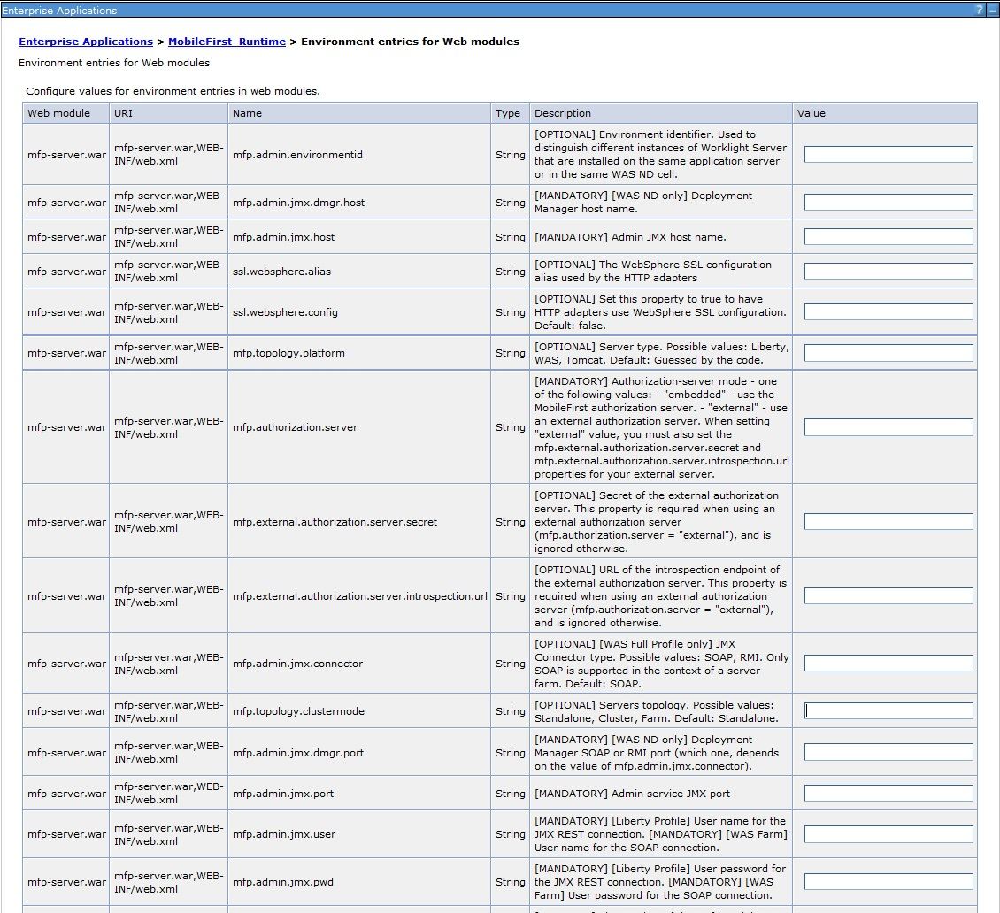

<!-- NLS_CHARSET=UTF-8 -->
## Visión general
{: #overview }
Considerar su política de restauración y copia de seguridad, optimizar su configuración de servidor de {{ site.data.keys.mf_server }} y aplicar restricciones de acceso y opciones de seguridad. 

#### Ir a
{: #jump-to }

* [Puntos finales del servidor de producción de {{ site.data.keys.mf_server }}](#endpoints-of-the-mobilefirst-server-production-server)
* [Configuración de {{ site.data.keys.mf_server }} para habilitar TLS V1.2](#configuring-mobilefirst-server-to-enable-tls-v12)
* [Configuración de la autenticación de usuario para la administración de {{ site.data.keys.mf_server }}](#configuring-user-authentication-for-mobilefirst-server-administration)
* [Lista de propiedades JNDI de las aplicaciones web de {{ site.data.keys.mf_server }}](#list-of-jndi-properties-of-the-mobilefirst-server-web-applications)
* [Configuración de orígenes de datos](#configuring-data-sources)
* [Configuración de los mecanismos de registro y supervisión](#configuring-logging-and-monitoring-mechanisms)
* [Configuración de varios tiempos de ejecución](#configuring-multiple-runtimes)
* [Configuración de seguimiento de licencias](#configuring-license-tracking)
* [Configuración SSL de WebSphere Application Server y adaptadores HTTP](#websphere-application-server-ssl-configuration-and-http-adapters)

## Puntos finales del servidor de producción de {{ site.data.keys.mf_server }}
{: #endpoints-of-the-mobilefirst-server-production-server }
Puede crear listas blancas y negras para los puntos finales de IBM {{ site.data.keys.mf_server }}.

> **Nota:** La información relativa a los URL expuestos por {{ site.data.keys.product }} se proporcionan como una directriz. Las organizaciones deben asegurarse de que se prueban los URL en una infraestructura de empresa, en función de lo que se ha habilitado en las listas blancas y negras.


| URL de API en `<runtime context root>/api/` | Descripción                               | ¿Sugerencias para la lista blanca?|
|---------------------------------------------|-------------------------------------------|--------------------------|
| /adapterdoc/*	                              | Devuelve la documentación del Swagger del adaptador para el adaptador mencionado| No. Solo utilizado internamente por el administrador y los desarrolladores |
| /adapters/*  | Adaptadores que dan servicio | Sí |
| /az/v1/authorization/* | Autoriza al cliente para que acceda a un ámbito específico | Sí |
| /az/v1/introspection | Hace introspección de la señal de acceso del cliente | No. Esta API solo es para clientes confidenciales. |
| /az/v1/token | Genera una señal de acceso para el cliente | Sí |
| /clientLogProfile/* | Obtiene el perfil de registro del cliente | Sí |
| /directupdate/* | Obtiene el archivo .zip de Direct Update | Sí, si planea utilizar Direct Update |
| /loguploader | Sube los registros de cliente al servidor | Sí |
| /preauth/v1/heartbeat | Acepta señal de monitorización del cliente y anota la hora de la última actividad | Sí |
| /preauth/v1/logout | Cierra la sesión de una comprobación de seguridad | Sí |
| /preauth/v1/preauthorize | Correlaciona y ejecuta comprobaciones de seguridad en un ámbito específico | Sí |
| /reach | Se puede acceder al servidor | No, solo para uso interno |
| /registration/v1/clients/* | API de clientes de servicio de registro | No. Esta API solo es para clientes confidenciales. |
| /registration/v1/self/* | API de registro automático de cliente de servicio de registro | Sí |

## Configuración de {{ site.data.keys.mf_server }} para habilitar TLS V1.2
{: #configuring-mobilefirst-server-to-enable-tls-v12 }
Para que {{ site.data.keys.mf_server }} se comunique con dispositivos que solo soporten Transport Layer Security v1.2 (TLS) V1.2, entre los protocolos SSL, debe completar las siguientes instrucciones.

Los pasos para configurar {{ site.data.keys.mf_server }} para habilitar Transport Layer Security (TLS) V1.2 dependen de como {{ site.data.keys.mf_server }} se conecta con los dispositivos.

* Si {{ site.data.keys.mf_server }} está tras un proxy inverso que desencripta paquetes codificados con SSL desde los dispositivos antes de pasar los paquetes al servidor de aplicaciones, debe habilitar el soporte de TLS V1.2 en su proxy inverso. Si utiliza IBM HTTP Server como su servidor proxy inverso, consulte [Securing IBM HTTP Server](http://www.ibm.com/support/knowledgecenter/SSEQTP_8.5.5/com.ibm.websphere.ihs.doc/ihs/welc6top_securing_ihs_container.html?view=kc) para obtener las instrucciones.
* Si {{ site.data.keys.mf_server }} se comunica directamente con los dispositivos, los pasos para habilitar TLS V1.2 dependen de si su servidor de aplicaciones es Apache Tomcat, perfil de Liberty de WebSphere Application Server o perfil completo de WebSphere Application Server.

### Apache Tomcat
{: #apache-tomcat }
1. Confirme que Java Runtime Environment (JRE) soporta TLS V1.2.
    Asegúrese de que tiene una de las siguientes versiones de JRE:
    * Oracle JRE 1.7.0_75 o posterior
    * Oracle JRE 1.8.0_31 o posterior
2. Edite el archivo **conf/server.xml** y modifique el elemento `Connector` que declara el puerto HTTPS para que el atributo **sslEnabledProtocols** tenga el siguiente valor: `sslEnabledProtocols="TLSv1.2,TLSv1.1,TLSv1,SSLv2Hello"`.

### Perfil de Liberty de WebSphere Application Server
{: #websphere-application-server-liberty-profile }
1. Confirme que Java Runtime Environment (JRE) soporta TLS V1.2. 
    * Si utiliza un Java SDK de IBM, asegúrese de que su Java SDK de IBM está parcheado para la vulnerabilidad de POODLE. Puede encontrar las versiones mínimas de Java SDK de IBM que contienen el parche para su versión de WebSphere Application Server en [Boletín de seguridad: La vulnerabilidad en SSLv3 afecta a IBM WebSphere Application Server (CVE-2014-3566)](http://www.ibm.com/support/docview.wss?uid=swg21687173).

        > **Nota:** Puede utilizar las versiones listadas en el boletín de seguridad o versiones posteriores.
    * Si utiliza un Java SDK de Oracle, asegúrese de que tiene una de las siguientes versiones: 
        * Oracle JRE 1.7.0_75 o posterior
        * Oracle JRE 1.8.0_31 o posterior
2. Si utiliza un Java SDK de IBM, edite el archivo **server.xml**.
    * Añada la siguiente línea: `<ssl id="defaultSSLConfig" keyStoreRef="defaultKeyStore" sslProtocol="SSL_TLSv2"/>`
    * Añada el atributo `sslProtocol="SSL_TLSv2"` a todos los elementos `<ssl>` existentes.

### Perfil completo de WebSphere Application Server
{: #websphere-application-server-full-profile }
1. Confirme que Java Runtime Environment (JRE) soporta TLS V1.2. 

    Asegúrese de que su Java SDK de IBM está parcheado para la vulnerabilidad de POODLE. Puede encontrar las versiones mínimas de Java SDK de IBM que contienen el parche para su versión de WebSphere Application Server en [Boletín de seguridad: La vulnerabilidad en SSLv3 afecta a IBM WebSphere Application Server (CVE-2014-3566)](http://www.ibm.com/support/docview.wss?uid=swg21687173).
    > **Nota:** Puede utilizar las versiones listadas en el boletín de seguridad o versiones posteriores.
2. Inicie la sesión en la consola de WebSphere Application Server y pulse **Seguridad → Certificado SSL y gestión de claves → Configuraciones SSL**.
3. Para cada configuración SSL listada, modifique la configuración para habilitar TLS V1.2.
    * Seleccione una configuración SSL y, a continuación, en **Propiedades adicionales**, pulse los valores de **Calidad de protecciones**.
    * En la lista **Protocolo**, seleccione **SSL_TLSv2**.
    * Pulse **Aplicar** y, a continuación, guarde los cambios.

## Configuración de la autenticación de usuario para la administración de {{ site.data.keys.mf_server }}
{: #configuring-user-authentication-for-mobilefirst-server-administration }
La administración de {{ site.data.keys.mf_server }} requiere autenticación de usuario. Puede configurar la autenticación de usuario y elija un método de autenticación. Por lo tanto, el procedimiento de configuración depende del servidor de aplicaciones web que utilice. 

> **Importante:** Si utiliza un perfil completo de WebSphere Application Server de servidor autónomo, utilice un método de autenticación diferente al método de autenticación de WebSphere simple (SWAM) en la seguridad global. Puede utilizar lightweight third-party authentication (LTPA). Si utiliza SWAM, puede experimentar errores de autenticación inesperados.


Debe configurar la autenticación después de que el instalador despliegue aplicaciones web de administración de {{ site.data.keys.mf_server }} en el servidor de aplicaciones web.


La administración de {{ site.data.keys.mf_server }} tiene definidos los siguientes roles de seguridad de Java Platform, Enterprise Edition (Java EE):

* mfpadmin
* mfpdeployer
* mfpoperator
* mfpmonitor

Debe correlacionar los roles en los correspondientes conjuntos de usuarios. El rol **mfpmonitor** puede ver datos pero no puede cambiarlos. Las tablas siguientes listan los roles y funciones de MobileFirst para servidores de producción.

#### Despliegue
{: #deployment }

|                        | Administrador | Desplegador | Operador    | Supervisor |
|------------------------|---------------|-------------|-------------|------------|
| Rol de seguridad de Java EE. | mfpadmin      | mfpdeployer | mfpoperator | mfpmonitor |
| Desplegar aplicación.  | Sí            | Sí          | No          | No         |
| Desplegar un adaptador. | Sí            | Sí          | No          | No         |

#### Gestión de {{ site.data.keys.mf_server }}
{: #mobilefirst-server-management }

|                            | Administrador | Desplegador | Operador    | Supervisor |
|----------------------------|---------------|-------------|-------------|------------|
| Rol de seguridad de Java EE.| mfpadmin      | mfpdeployer | mfpoperator | mfpmonitor |
| Configurar valores de
tiempo de ejecución.         | Sí            | Sí          | No          | No         |

#### Gestión de aplicaciones
{: #application-management }

|                                     | Administrador | Desplegador | Operador    | Supervisor |
|-------------------------------------|---------------|-------------|-------------|------------|
| Rol de seguridad de Java EE.        | mfpadmin      | mfpdeployer | mfpoperator | mfpmonitor |
| Subir nueva aplicación {{ site.data.keys.product_adj }}. | Sí            | Sí          | No          | No         |
| Eliminar aplicación {{ site.data.keys.product_adj }}.    | Sí            | Sí          | No          | No         |
| Subir nuevo adaptador.  | Sí            | Sí          | No          | No         |
| Eliminar adaptador.     | Sí            | Sí          | No          | No         |
| Activar o desactivar prueba de autenticidad de aplicación en una aplicación. | Sí | Sí | No | No    |
| Cambiar propiedades en los estados de aplicación de {{ site.data.keys.product_adj }}: Activo, Notificación activa e inhabilitado. | Sí | Sí | Sí | No |

Básicamente, todos los roles pueden emitir solicitudes GET, los roles **mfpadmin**, **mfpdeployer** y **mfpmonitor** también pueden emitir solicitudes POST y PUT y los roles **mfpadmin** y **mfpdeployer** también pueden emitir solicitudes DELETE.

#### Solicitudes relacionadas con notificaciones push
{: #requests-related-to-push-notifications }

|                        | Administrador | Desplegador | Operador    | Supervisor |
|------------------------|---------------|-------------|-------------|------------|
| Rol de seguridad de Java EE. | mfpadmin      | mfpdeployer | mfpoperator | mfpmonitor |
| Solicitudes GET {::nomarkdown}<ul><li>Obtener una lista de todos los dispositivos que utilizan notificaciones push para una aplicación</li><li>Obtener los detalles de un dispositivo específico</li><li>Obtener la lista de suscripciones</li><li>Obtener la información de suscripción asociada con un ID de suscripción.</li><li>Obtener los detalles de una configuración GCM</li><li>Obtener los detalles de una configuración APNS</li><li>Obtener la lista de etiquetas definidas por la aplicación</li><li>Obtener los detalles de una etiqueta específica</li></ul>{:/}| Sí          | Sí          | Sí          | Sí          |
| Solicitudes POST y PUT {::nomarkdown}<ul><li>Registrar una aplicación con notificaciones push</li><li>Actualizar un registro de dispositivo push</li><li>Crear una suscripción</li><li>Añadir o actualizar una configuración GCM</li><li>Añadir o actualizar una configuración APNS</li><li>Enviar notificaciones a un dispositivo</li><li>Crear o actualizar una etiqueta</li></ul>{:/} | Sí          | Sí          | Sí          | No         |
| Solicitudes DELETE {::nomarkdown}<ul><li>Suprimir el registro de un dispositivo a notificaciones push</li><li>Suprimir una suscripción</li><li>Anular una suscripción de un dispositivo a una etiqueta</li><li>Suprimir una configuración GCM</li><li>Suprimir una configuración APNS</li><li>Suprimir una etiqueta</li></ul>{:/} | Sí            | Sí          | No          | No         |

#### Inhabilitación
{: #disabling }

|                        | Administrador | Desplegador | Operador    | Supervisor |
|------------------------|---------------|-------------|-------------|------------|
| Rol de seguridad de Java EE. | mfpadmin      | mfpdeployer | mfpoperator | mfpmonitor |
| Inhabilitar el dispositivo específico, marcando el estado como perdido o robado para bloquear el acceso de cualquier aplicación en ese dispositivo. | Sí          | Sí          | Sí          | No        |
| Inhabilitar una aplicación específica, marcando el estado como inhabilitada para bloquear el acceso de esa aplicación en ese dispositivo. | Sí          | Sí          | Sí          | No         |

Si elige utilizar un método de autenticación a través de un repositorio de usuarios como LDAP, puede configurar la administración de {{ site.data.keys.mf_server }} de modo que pueda utilizar usuarios y grupos con el repositorio de usuarios para definir la lista de control de acceso (ACL) de la administración de {{ site.data.keys.mf_server }}. Este procedimiento depende del tipo y la versión del servidor de aplicaciones web que utilice. 

### Configuración del perfil completo de WebSphere Application Server para la administración de {{ site.data.keys.mf_server }}
{: #configuring-websphere-application-server-full-profile-for-mobilefirst-server-administration }
Configure la seguridad correlacionando los roles de Java EE de {{ site.data.keys.mf_server }} en un conjunto de usuarios para las aplicaciones web.

Defina los aspectos básicos de la configuración de usuario en la consola de WebSphere Application Server. El acceso a la consola se realiza normalmente mediante esta dirección: `https://localhost:9043/ibm/console/`

1. Seleccione **Seguridad → Seguridad global**.
2. Seleccione **Asistente de configuración de seguridad** para configurar usuarios.
    Puede gestionar cuentas de usuarios individuales seleccionando **Usuarios y grupos → Gestionar usuarios**.
3. Correlacione los roles **mfpadmin**, **mfpdeployer**, **mfpmonitor** y **mfpoperator** en un conjunto de usuarios.
    * Seleccione **Servidores → Tipos de servidores → Servidores de aplicaciones de WebSphere**.
    * Seleccione el servidor.
    * En el separador **Configuración**, seleccione **Aplicaciones → Aplicaciones empresariales**.
    * Seleccione **MobileFirst_Administration_Service**.
    * En el separador **Configuración**, seleccione **Detalles → Rol de seguridad** para la correlación usuario/grupo.
    * Realice la personalización necesaria.
    * Pulse **Aceptar**.
    * Repita los pasos para correlacionar los roles para la aplicación web de consola. Esta vez seleccione **MobileFirst_Administration_Console**.
    * Pulse **Guardar** para guardar los cambios.

### Configuración del perfil de Liberty de WebSphere Application Server para la administración de {{ site.data.keys.mf_server }}
{: #configuring-websphere-application-server-liberty-profile-for-mobilefirst-server-administration }
En el perfil de Liberty de WebSphere Application Server, puede configurar los roles de **mfpadmin**, **mfpdeployer**, **mfpmonitor** y **mfpoperator** en el archivo de configuración **server.xml** del servidor.

Para configurar los roles de seguridad, debe editar el archivo **server.xml**. En el elemento `<application-bnd>` de cada elemento de `<application>`, cree elementos de `<security-role>`. Cada elemento de `<security-role>` es para cada rol: **mfpadmin**, mfpdeployer, mfpmonitor y mfpoperator. Correlacione los roles con el nombre de grupo de usuarios adecuado, en este ejemplo: **mfpadmingroup**, **mfpdeployergroup**, **mfpmonitorgroup** o **mfpoperatorgroup**. Estos grupos se definen mediante el elemento `<basicRegistry>`. Puede personalizar este elemento o sustituirlo por completo por un elemento `<ldapRegistry>` o un elemento `<safRegistry>`.

A continuación, para mantener buenos tiempos de respuesta con un gran número de aplicaciones instaladas, por ejemplo con 80 aplicaciones, debe configurar una agrupación de conexiones para la base de datos de administration.

1. Edite el archivo **server.xml**. Por ejemplo:

   ```xml
   <security-role name="mfpadmin">
      <group name="mfpadmingroup"/>
   </security-role>
   <security-role name="mfpdeployer">
      <group name="mfpdeployergroup"/>
   </security-role>
   <security-role name="mfpmonitor">
      <group name="mfpmonitorgroup"/>
   </security-role>
   <security-role name="mfpoperator">
      <group name="mfpoperatorgroup"/>
   </security-role>

   <basicRegistry id="mfpadmin">
      <user name="admin" password="admin"/>
      <user name="guest" password="guest"/>
      <user name="demo" password="demo"/>
      <group name="mfpadmingroup">
        <member name="guest"/>
        <member name="demo"/>
      </group>
      <group name="mfpdeployergroup">
        <member name="admin" id="admin"/>
      </group>
      <group name="mfpmonitorgroup"/>
      <group name="mfpoperatorgroup"/>
   </basicRegistry>
   ```

2. Defina el tamaño de **AppCenterPool**:

   ```xml
   <connectionManager id="AppCenterPool" minPoolSize="10" maxPoolSize="40"/>
   ```

3. En el elemento `<dataSource>`, defina una referencia para el gestor de conexiones:

   ```xml
   <dataSource id="MFPADMIN" jndiName="mfpadmin/jdbc/mfpAdminDS" connectionManagerRef="AppCenterPool">
   ...
   </dataSource>
   ```

### Configuración de Apache Tomcat para la administración de {{ site.data.keys.mf_server }}
{: #configuring-apache-tomcat-for-mobilefirst-server-administration }
Debe configurar los roles de seguridad de Java EE para la administración de {{ site.data.keys.mf_server }} en el servidor de aplicaciones web de Apache Tomcat.

1. Si ha instalado la administración de {{ site.data.keys.mf_server }} manualmente, declare los siguientes roles en el archivo **conf/tomcat-users.xml**:

   ```xml
   <role rolename="mfpadmin"/>
   <role rolename="mfpmonitor"/>
   <role rolename="mfpdeployer"/>
   <role rolename="mfpoperator"/>
   ```

2. Añada roles a los usuarios seleccionados, por ejemplo:

   ```xml
   <user name="admin" password="admin" roles="mfpadmin"/>
   ```

3. Puede definir el conjunto de usuarios tal como se describe en la documentación de Apache Tomcat, [Realm Configuration HOW-TO](http://tomcat.apache.org/tomcat-7.0-doc/realm-howto.html).

## Lista de propiedades JNDI de las aplicaciones web de {{ site.data.keys.mf_server }}
{: #list-of-jndi-properties-of-the-mobilefirst-server-web-applications }
Configure las propiedades JNDI para las aplicaciones web de {{ site.data.keys.mf_server }} desplegadas en el servidor de aplicaciones.

* [Configurar propiedades JNDI para aplicaciones web de {{ site.data.keys.mf_server }}](#setting-up-jndi-properties-for-mobilefirst-server-web-applications)
* [Lista de propiedades JNDI para el servicio de administración de {{ site.data.keys.mf_server }}](#list-of-jndi-properties-for-mobilefirst-server-administration-service)
* [Lista de propiedades JNDI para el servicio de Live Update de {{ site.data.keys.mf_server }}](#list-of-jndi-properties-for-mobilefirst-server-live-update-service)
* [Lista de propiedades JNDI para el tiempo de ejecución de {{ site.data.keys.product_adj }}](#list-of-jndi-properties-for-mobilefirst-runtime)
* [Lista de propiedades JNDI para el servicio de envío por push de {{ site.data.keys.mf_server }}](#list-of-jndi-properties-for-mobilefirst-server-push-service)

### Configurar propiedades JNDI para aplicaciones web de {{ site.data.keys.mf_server }}
{: #setting-up-jndi-properties-for-mobilefirst-server-web-applications }
Configurar las propiedades JNDI para configurar las aplicaciones web de {{ site.data.keys.mf_server }} desplegadas en el servidor de aplicaciones.  
Configure las entradas de entorno JNDI de una de las siguientes maneras:

* Configurar las entradas de entorno de servidor. Los pasos para configurar las entradas de entorno de servidor dependen del servidor de aplicaciones que utilice:

    * **WebSphere Application Server:**
        1. En la consola de administración de WebSphere Application Server, vaya a **Aplicaciones → Tipos de aplicaciones → Aplicaciones empresariales de WebSphere → nombre_aplicación → Entradas de entorno para módulos Web**.
        2. En los campos de valor, introduzca los valores adecuados para su entorno de servidor.

        
    * WebSphere Application Server Liberty:

      En **liberty\_install\_dir/usr/servers/serverName**, edite el archivo **server.xml** y declare las propiedades JNDI de la manera siguiente:

      ```xml
      <application id="app_context_root" name="app_context_root" location="app_war_name.war" type="war">
            ...
      </application>
      <jndiEntry jndiName="app_context_root/JNDI_property_name" value="JNDI_property_value" />
      ```

      La raíz de contexto (en el ejemplo anterior: **app\_context\_root**) se conecta entre la entrada JNDI y una aplicación {{ site.data.keys.product_adj }} específica. Si existen varias aplicaciones {{ site.data.keys.product_adj }} en el mismo servidor, puede definir entradas JNDI específicas para cada aplicación utilizando el prefijo de vía de acceso de contexto.

      > **Nota:** Algunas propiedades se definen de forma global en WebSphere Application Server Liberty, sin prefijar el nombre de la propiedad con la raíz de contexto. Para obtener una lista de estas propiedades, consulte [Entradas JNDI globales](../appserver/#global-jndi-entries).


      En el resto de las propiedades JNDI, los nombres deben prefijarse con la raíz de contexto de la aplicación:

       * Para los servicios de Live Update, la raíz de contexto debe ser **/[adminContextRoot]config**. Por ejemplo, si la raíz de contexto del servicio de administración es **/mfpadmin**, la raíz de contexto del servicio de Live Update debe ser **/mfpadminconfig**.
       * Para el servicio push, debe definir la raíz de contexto como **/imfpush**. De lo contrario, los dispositivos cliente no se podrán conectar a la misma, ya que la raíz de contexto está codificada en el SDK.
       * Para la aplicación de servicio de administración de {{ site.data.keys.product_adj }}, los tiempos de ejecución {{ site.data.keys.mf_console }} y {{ site.data.keys.product_adj }}, puede definir la raíz de contexto como desee. Sin embargo, de forma predeterminada es **/mfpadmin** para el servicio de administración de {{ site.data.keys.product_adj }}, **/mfpconsole** para {{ site.data.keys.mf_console }}, y **/mfp** para el tiempo de ejecución de {{ site.data.keys.product_adj }}.

      Por ejemplo:

      ```xml
      <application id="mfpadmin" name="mfpadmin" location="mfp-admin-service.war" type="war">
            ...
      </application>
      <jndiEntry jndiName="mfpadmin/mfp.admin.actions.prepareTimeout" value = "2400000" />
      ```    

    * Apache Tomcat:

      En **tomcat\_install\_dir/conf**, edite el archivo **server.xml** y declare las propiedades JNDI de la manera siguiente:

      ```xml
      <Context docBase="app_context_root" path="/app_context_root">
            <Environment name="JNDI_property_name" override="false" type="java.lang.String" value="JNDI_property_value"/>
      </Context>
      ```

        * El prefijo de vía de acceso de contexto no es necesario ya que las entradas JNDI están definidas en el elemento `<Context>` de una aplicación.
        * `override="false"` es obligatorio.
        * El atributo `type` siempre es `java.lang.String`, a menos que la propiedad lo especifique de forma diferente.

      Por ejemplo:

      ```xml
      <Context docBase="app_context_root" path="/app_context_root">
            <Environment name="mfp.admin.actions.prepareTimeout" override="false" type="java.lang.String" value="2400000"/>
      </Context>
      ```

* Si instala con Ant tasks, también puede establecer los valores de las propiedades JNDI al instalar.

  En **mfp_install_dir/MobileFirstServer/configuration-samples**, edite el archivo XML de configuración para las tareas Ant y declare los valores para las propiedades JNDI utilizando el elemento de propiedad en las siguientes etiquetas:

  * `<installmobilefirstadmin>`, para la administración de {{ site.data.keys.mf_server }}, {{ site.data.keys.mf_console }} y servicios Live Update. Para obtener más información, consulte las tareas [Ant para la instalación de {{ site.data.keys.mf_console }}, artefactos de {{ site.data.keys.mf_server }}, administración de {{ site.data.keys.mf_server }} y servicios Live Update](../installation-reference/#ant-tasks-for-installation-of-mobilefirst-operations-console-mobilefirst-server-artifacts-mobilefirst-server-administration-and-live-update-services).
  * `<installmobilefirstruntime>`, para las propiedades de configuración de tiempo de ejecución de {{ site.data.keys.product_adj }}. Para obtener más información, consulte [Tareas Ant para la instalación de entornos de ejecución de {{ site.data.keys.product_adj }}](../installation-reference/#ant-tasks-for-installation-of-mobilefirst-runtime-environments).
  * `<installmobilefirstpush>`, para la configuración del servicio de envío por push. Para obtener más información, consulte [Tareas Ant para la instalación del servicio de envío por push de {{ site.data.keys.mf_server }}](../installation-reference/#ant-tasks-for-installation-of-mobilefirst-server-push-service).

  Por ejemplo:

  ```xml
  <installmobilefirstadmin ..>
        <property name = "mfp.admin.actions.prepareTimeout" value = "2400000" />
  </installmobilefirstadmin>
  ```

### Lista de propiedades JNDI para el servicio de administración de {{ site.data.keys.mf_server }}
{: #list-of-jndi-properties-for-mobilefirst-server-administration-service }
Cuando configura el servicio de administración de {{ site.data.keys.mf_server }} y {{ site.data.keys.mf_console }} en su servidor de aplicaciones, establece propiedades JNDI obligatorias y opcionales, en particular para Java Management Extensions (JMX).

Se pueden definir las siguientes propiedades en la aplicación web del servicio de administración mfp-admin-service.war.

#### Propiedades JNDI para el servicio de administración: JMX
{: #jndi-properties-for-administration-service-jmx }

| Propiedad                | Opcional/obligatoria  | Descripción | Restricciones|
|--------------------------|-----------------------|-------------|--------------|
| mfp.admin.jmx.connector  | Opcional	             | El tipo de conector de Java Management Extensions (JMX).<br/>Los valores posibles son `SOAP` y `RMI`. El valor predeterminado es SOAP. | Solo WebSphere Application Server. |
| mfp.admin.jmx.host       | Opcional	             | Nombre de host para la conexión REST de JMX. | Solo perfil de Liberty. |
| mfp.admin.jmx.port	      | Opcional	             | Puerto para la conexión REST de JMX.         | Solo perfil de Liberty. |
| mfp.admin.jmx.user       | Obligatorio para el perfil de Liberty y para la granja de servidores de WebSphere Application Server, de lo contrario, opcional.| Nombre de usuario para la conexión REST de JMX. | Perfil de Liberty de WebSphere Application Server: El nombre de usuario para la conexión REST de JMX. <br/><br/>Granja de servidores de WebSphere Application Server: El nombre de usuario para la conexión SOAP.<br/><br/>WebSphere Application Server Network Deployment: El nombre de usuario del administrador de WebSphere si el host virtual correlacionado con la aplicación de administración de {{ site.data.keys.mf_server }} no es el host predeterminado.<br/><br/>Colectividad de Liberty: El nombre de usuario del administrador controlador definido en el elemento `<administrator-role>` del archivo server.xml del controlador de Liberty. |
| mfp.admin.jmx.pwd	| Obligatorio para el perfil de Liberty y para la granja de servidores de WebSphere Application Server, de lo contrario, opcional.| Contraseña de usuario para la conexión REST de JMX. | Perfil de Liberty de WebSphere Application Server: La contraseña de usuario para la conexión REST de JMX. <br/><br/>Granja de servidores de WebSphere Application Server: La contraseña de usuario para la conexión SOAP.<br/><br/>WebSphere Application Server Network Deployment: La contraseña de usuario del administrador de WebSphere si el host virtual correlacionado con la aplicación de administración de servidor de {{ site.data.keys.mf_server }} no es el host predeterminado.<br/><br/>Colectividad de Liberty: La contraseña del administrador controlador definido en el elemento `<administrator-role>` del archivo server.xml del controlador de Liberty. |
| mfp.admin.rmi.registryPort | Opcional | Puerto de registro RMI para la conexión JMX a través de un cortafuegos. | Solo Tomcat. |
| mfp.admin.rmi.serverPort | Opcional | Puerto de servidor RMI para la conexión JMX a través de un cortafuegos. | Solo Tomcat. |
| mfp.admin.jmx.dmgr.host | Obligatorio | Nombre de host del gestor de despliegue. | Solo WebSphere Application Server Network Deployment. |
| mfp.admin.jmx.dmgr.port | Obligatorio | Puerto RMI o SOAP del gestor de despliegue. | Solo WebSphere Application Server Network Deployment. |

#### Propiedades JNDI para el servicio de administración: tiempo de espera
{: #jndi-properties-for-administration-service-timeout }

| Propiedad                | Opcional/obligatoria  | Descripción |
|--------------------------|-----------------------|--------------|
| mfp.admin.actions.prepareTimeout | Opcional | Tiempo de espera en milisegundos para transferir datos desde el servicio de administración hasta el tiempo de ejecución durante una transacción de despliegue. Si no puede alcanzarse el tiempo de ejecución dentro de este tiempo, se produce un error y la transacción de despliegue finaliza.<br/><br/>Valor predeterminado: 1800000 ms (30min) |
| mfp.admin.actions.commitRejectTimeout | Opcional | Tiempo de espera en milisegundos, cuando se establece contacto con un tiempo de ejecución, para confirmar o rechazar una transacción de despliegue. Si no puede alcanzarse el tiempo de ejecución dentro de este tiempo, se produce un error y la transacción de despliegue finaliza.<br/><br/>Valor predeterminado: 120000 ms (2 min) |
| mfp.admin.lockTimeoutInMillis | Opcional |Tiempo de espera en milisegundos para obtener el bloqueo de transacción. Puesto que las transacciones de despliegue se ejecutan secuencialmente, utilizan un bloqueo. Por lo tanto, una transacción debe esperar hasta que una transacción anterior haya finalizado. Este tiempo de espera es el tiempo máximo durante el cual espera una transacción.<br/><br/>Valor predeterminado: 1200000 ms (20 min) |
| mfp.admin.maxLockTimeInMillis | Opcional | El tiempo máximo que puede durar un proceso de bloqueo de transacciones. Puesto que las transacciones de despliegue se ejecutan secuencialmente, utilizan un bloqueo. Si el servidor de aplicaciones falla durante un bloqueo, puede pasar en escasas situaciones que el bloqueo no se libere en el siguiente reinicio del servidor de aplicaciones. En este caso, el bloqueo se libera automáticamente después del tiempo de bloqueo máximo, de modo que el servidor no está bloqueado para siempre. Establezca un tiempo superior a una transacción normal.<br/><br/>Valor predeterminado: 1800000 ms (30min) |

#### Propiedades JNDI para el servicio de administración: registro
{: #jndi-properties-for-administration-service-logging }

| Propiedad                | Opcional/obligatoria  | Descripción |
|--------------------------|-----------------------|--------------|
| mfp.admin.logging.formatjson | Opcional | Establezca esta propiedad en true o habilite el formato bonito (espacio en blanco extra) de los objetos JSON en los mensajes de respuesta y de registro. Establecer esta propiedad es útil cuando depura el servidor. Valor predeterminado: false.|
| mfp.admin.logging.tosystemerror | Opcional | Especifica si todos los mensajes de registro están también dirigidos a System.Error. Establecer esta propiedad es útil cuando depura el servidor. |

#### Propiedades JNDI para el servicio de administración: proxies
{: #jndi-properties-for-administration-service-proxies }

| Propiedad                | Opcional/obligatoria  | Descripción |
|--------------------------|-----------------------|--------------|
| mfp.admin.proxy.port | Opcional | Si el servidor de administración de {{ site.data.keys.product_adj }} está detrás de un cortafuegos o un proxy inverso, esta propiedad especifica la dirección del host. Establezca esta propiedad para permitir que un usuario que está fuera del cortafuegos llegue al servidor de administración de {{ site.data.keys.product_adj }}. Normalmente, esta propiedad es el puerto del proxy, por ejemplo 443. Solo es necesaria si el protocolo de los URI externos e internos es distinto. |
| mfp.admin.proxy.protocol | Opcional | Si el servidor de administración de {{ site.data.keys.product_adj }} está detrás de un cortafuegos o proxy inverso, esta propiedad especifica el protocolo (HTTP o HTTPS). Establezca esta propiedad para permitir que un usuario que está fuera del cortafuegos llegue al servidor de administración de {{ site.data.keys.product_adj }}. Normalmente, esta propiedad se establece en el protocolo del proxy. Por ejemplo, wl.net. Esta propiedad solo es necesaria si el protocolo de los URI externos e internos es distinto. |
| mfp.admin.proxy.scheme | Opcional | Esta propiedad es tan solo un nombre alternativo para mfp.admin.proxy.protocol. |
| mfp.admin.proxy.host | Opcional | Si el servidor de administración de {{ site.data.keys.product_adj }} está detrás de un cortafuegos o un proxy inverso, esta propiedad especifica la dirección del host. Establezca esta propiedad para permitir que un usuario que está fuera del cortafuegos llegue al servidor de administración de {{ site.data.keys.product_adj }}. Normalmente, esta propiedad es la dirección del proxy. |

#### Propiedades JNDI para el servicio de administración: Topologías
{: #jndi-properties-for-administration-service-topologies }

| Propiedad                | Opcional/obligatoria  | Descripción |
|--------------------------|-----------------------|--------------|
| mfp.admin.audit | Opcional. | Establezca esta propiedad en false para inhabilitar la característica de auditoría de {{ site.data.keys.mf_console }}. El valor predeterminado es true. |
| mfp.admin.environmentid | Opcional. | El identificador de entorno para el registro de MBeans. Utilice este identificador diferentes instancias de {{ site.data.keys.mf_server }} estén instaladas en el mismo servidor de aplicaciones. El identificador determina qué servicio de administración, qué consola y qué tiempo de ejecución pertenece a la misma instalación. El servicio de administración gestiona solo los tiempos de ejecución que tienen el mismo identificador de entorno. |
| mfp.admin.serverid | Obligatorio para granjas de servidores y colectividad de Liberty, de lo contrario, opcional. | Granja de servidores: El mismo identificador. Debe ser diferente para cada servidor en de la granja de servidores.<br/><br/> Colectividad de Liberty: El valor debe ser controller. |
| mfp.admin.hsts | Opcional. | Establézcalo en true para habilitar Strict Transport Security de HTTP según la RFC 6797. |
| mfp.topology.platform | Opcional | Tipo de servidor. Valores válidos:{::nomarkdown}<ul><li>Liberty</li><li>WAS</li><li>Tomcat</li></ul>{:/}Si no establece el valor, la aplicación intenta adivinar el tipo de servidor. |
| mfp.topology.clustermode | Opcional | Además del tipo de servidor, especifique aquí la topología del servidor. Valores válidos:{::nomarkdown}<ul><li>Autónomo</li><li>Clúster</li><li>Granja de servidores</li></ul>{:/}El valor predeterminado es Autónomo. |
| mfp.admin.farm.heartbeat | Opcional | Esta propiedad le permite establecer el índice de señal de monitorización, en minutos, utilizado en las topologías de granjas de servidores. El valor predeterminado es 2 minutos. <br/><br/>En una granja de servidores, todos los miembros deben utilizar el mismo índice de señal de monitorización. Si establece o cambia este valor JNDI en un servidor de la granja de servidores, también debe establecer el mismo valor en cada servidor de la granja de servidores. Para obtener más información, consulte [Ciclo de vida de un nodo de granja de servidores](../appserver/#lifecycle-of-a-server-farm-node). |
| mfp.admin.farm.missed.heartbeats.timeout | Opcional | Esta propiedad le permite establecer el número de señales de monitorización perdidas de un miembro de la granja de servidores antes de que el estado del miembro de la granja de servidores se considere fallado o caído. El valor predeterminado es 2. <br/><br/>En una granja de servidores, todos los miembros deben utilizar el mismo valor de señal de monitorización perdida. Si establece o cambia este valor JNDI en un servidor de la granja de servidores, también debe establecer el mismo valor en cada servidor de la granja de servidores. Para obtener más información, consulte [Ciclo de vida de un nodo de granja de servidores](../appserver/#lifecycle-of-a-server-farm-node). |
| mfp.admin.farm.reinitialize | Opcional | Un valor booleano (true o false) para preregistrar o reinicializar el miembro de la granja de servidores. |
| mfp.server.swagger.ui.url | Opcional | Esta propiedad define el URL de la interfaz de usuario Swagger a visualizar en la consola de administración. |

#### Propiedades JNDI para el servicio de administración: Base de datos relacional
{: #jndi-properties-for-administration-service-relational-database }

| Propiedad                | Opcional/obligatoria  | Descripción |
|--------------------------|-----------------------|--------------|
| mfp.admin.db.jndi.name | Opcional | El nombre JNDI de la base de datos. Este parámetro es el mecanismo normal para especificar la base de datos. El valor predeterminado es **java:comp/env/jdbc/mfpAdminDS**. |
| mfp.admin.db.openjpa.ConnectionDriverName | Opcional/Obligatorio de forma condicional | El nombre de completo de la clase de controlador de conexión de base de datos. Solo es obligatorio cuando el origen de datos especificado por la propiedad **mfp.admin.db.jndi.name** no está definido en la configuración de servidor de aplicaciones. |
| mfp.admin.db.openjpa.ConnectionURL | Opcional/Obligatorio de forma condicional | El URL para la conexión de base de datos. Solo es obligatorio cuando el origen de datos especificado por la propiedad **mfp.admin.db.jndi.name** no está definido en la configuración de servidor de aplicaciones. |
| mfp.admin.db.openjpa.ConnectionUserName | Opcional/Obligatorio de forma condicional | El nombre de usuario para la conexión de base de datos. Solo es obligatorio cuando el origen de datos especificado por la propiedad **mfp.admin.db.jndi.name** no está definido en la configuración de servidor de aplicaciones. |
| mfp.admin.db.openjpa.ConnectionPassword | Opcional/Obligatorio de forma condicional | La contraseña para la conexión de base de datos. Solo es obligatorio cuando el origen de datos especificado por la propiedad **mfp.admin.db.jndi.name** no está definido en la configuración de servidor de aplicaciones. |
| mfp.admin.db.openjpa.Log | Opcional | Esta propiedad se pasa a OpenJPA y permite el registro de JPA. Para obtener más información, consulte el [Manual de usuario de OpenJPA de Apache](http://openjpa.apache.org/docs/openjpa-0.9.0-incubating/manual/manual.html). |
| mfp.admin.db.type | Opcional | Esta propiedad define el tipo de base de datos. El valor predeterminado se deduce del URL de conexión. |

#### Propiedades JNDI para el servicio de administración: Licencias
{: #jndi-properties-for-administration-service-licensing }

| Propiedad                | Opcional/obligatoria  | Descripción |
|--------------------------|-----------------------|--------------|
| mfp.admin.license.key.server.host	| {::nomarkdown}<ul><li>Opcional para licencias permanentes</li><li>Obligatoria para licencias de señal</li></ul>{:/} | Nombre de host de Rational License Key Server. |
| mfp.admin.license.key.server.port	| {::nomarkdown}<ul><li>Opcional para licencias permanentes</li><li>Obligatoria para licencias de señal</li></ul>{:/} | Número de puerto de Rational License Key Server. |

#### Propiedades JNDI para el servicio de administración: Configuraciones JNDI
{: #jndi-properties-for-administration-service-jndi-configurations }

| Propiedad                | Opcional/obligatoria  | Descripción |
|--------------------------|-----------------------|--------------|
| mfp.jndi.configuration | Opcional | El nombre de la configuración JNDI si las propiedades JNDI (excepto esta) deben leerse desde un archivo de propiedad inyectado en el archivo WAR. Si no establece esta propiedad, las propiedades JNDI no se leen de un archivo de propiedades. |
| mfp.jndi.file | Opcional | Nombre del archivo que contiene la configuración JNDI si las propiedades JNDI (excepto esta) deben leerse desde un archivo instalado en un servidor web. Si no establece esta propiedad, las propiedades JNDI no se leen de un archivo de propiedades. |

El servicio de administración utiliza el servicio Live Update como instalación auxiliar para almacenar varias configuraciones. Utilice estas propiedades para configurar cómo alcanzar el servicio Live Update.

#### Propiedades JNDI para el servicio de administración: Servicio Live Update
{: #jndi-properties-for-administration-service-live-update-service }

| Propiedad                | Opcional/obligatoria  | Descripción |
|--------------------------|-----------------------|--------------|
| mfp.config.service.url | Opcional El URL del servicio Live Update. El URL predeterminado se deriva del URL del servicio de administración añadiendo configuración a la raíz de contexto del servicio de administración. |
| mfp.config.service.user | Obligatorio | El nombre de usuario que se utiliza para acceder al servicio de Live Update. En una topología de granja de servidores, el nombre de usuario debe ser el mismo para todos los miembros de la granja de servidores.|
| mfp.config.service.password | Obligatorio | La contraseña que se utiliza para acceder al servicio de Live Update. En una topología de granja de servidores, la contraseña debe ser el mismo para todos los miembros de la granja de servidores.|
| mfp.config.service.schema | Opcional | El nombre del esquema que utiliza el servicio Live Update. |

El servicio de administración utiliza un servicio de envío por push como instalación auxiliar para almacenar varios valores push. Utilice estas propiedades para configurar cómo alcanzar el servicio de envío por push. Puesto que el servicio de envío por push está protegido por el modelo de seguridad OAuth, debe establecer varias propiedades para habilitar clientes confidenciales en OAuth.

#### Propiedades JNDI para el servicio de administración: Servicio de envío por push
{: #jndi-properties-for-administration-service-push-service }

| Propiedad                | Opcional/obligatoria  | Descripción |
|--------------------------|-----------------------|--------------|
| mfp.admin.push.url | Opcional | El URL del servicio de envío por push. Si no se especifica la propiedad, el servicio de envío por push se considera inhabilitado. Si la propiedad no se establece adecuadamente, el servicio de administración no puede contactar con el servicio de envío por push y la administración de servicios de envío por push en {{ site.data.keys.mf_console }} no funciona. |
| mfp.admin.authorization.server.url | Opcional | El URL del servidor de autorizaciones OAuth que utiliza el servicio de envío por push. El URL predeterminado se deriva del URL del servicio de administración cambiando la raíz de contexto por la raíz de contexto del primer tiempo de ejecución instalado. Si instala diversos entornos de ejecución, es mejor establecer la propiedad. Si la propiedad no se establece adecuadamente, el servicio de administración no puede contactar con el servicio de envío por push y la administración de servicios de envío por push en {{ site.data.keys.mf_console }} no funciona. |
| mfp.push.authorization.client.id | Opcional/Obligatorio de forma condicional | El identificador del cliente confidencial que gestiona la autorización OAuth para el servicio de envío por push. Obligatorio solo si la propiedad **mfp.admin.push.url** está especificada. |
| mfp.push.authorization.client.secret | Opcional/Obligatorio de forma condicional | El secreto del cliente confidencial que gestiona la autorización OAuth para el servicio de envío por push. Obligatorio solo si la propiedad **mfp.admin.push.url** está especificada. |
| mfp.admin.authorization.client.id | Opcional/Obligatorio de forma condicional | El identificador del cliente confidencial que gestiona la autorización OAuth para el servicio de administración. Obligatorio solo si la propiedad **mfp.admin.push.url** está especificada. |
| mfp.admin.authorization.client.secret | Opcional/Obligatorio de forma condicional | El secreto del cliente confidencial que gestiona la autorización OAuth para el servicio de administración. Obligatorio solo si la propiedad **mfp.admin.push.url** está especificada. |

### Propiedades JNDI para {{ site.data.keys.mf_console }}
{: #jndi-properties-for-mobilefirst-operations-console }
Se pueden definir las siguientes propiedades en la aplicación web (mfp-admin-ui.war) de {{ site.data.keys.mf_console }}.

| Propiedad                | Opcional/obligatoria  | Descripción |
|--------------------------|-----------------------|--------------|
| mfp.admin.endpoint | Opcional | Permite a {{ site.data.keys.mf_console }} localizar el servicio REST de administración de {{ site.data.keys.mf_server }}. Especifique la dirección externa y la raíz de contexto de la aplicación web **mfp-admin-service.war**. En un escenario con un cortafuegos o un proxy inverso protegido, este URI debe ser el URI externo y no el URI interno que se encuentra dentro del LAN local. Por ejemplo, https://wl.net:443/mfpadmin. |
| mfp.admin.global.logout | Opcional | Borra la caché de autenticación de usuario de WebSphere durante el cierre de sesión de la consola. Esta propiedad resulta útil solo para WebSphere Application Server V7. El valor predeterminado es false. |
| mfp.admin.hsts | Opcional | Establezca esta propiedad en true para habilitar [Strict Transport Security](http://www.w3.org/Security/wiki/Strict_Transport_Security) de HTTP según la RFC 6797. Para obtener más información, consulte la página de W3C Strict Transport Security. El valor predeterminado es false. |
| mfp.admin.ui.cors | Opcional | El valor predeterminado es true. Para obtener más información, consulte la página de W3C [Cross-Origin Resource Sharing](http://www.w3.org/TR/cors/). |
| mfp.admin.ui.cors.strictssl | Opcional | Establézcalo en false para permitir situaciones CORS donde {{ site.data.keys.mf_console }} se asegura con SSL (protocolo HTTPS) mientras que el servicio de administración de {{ site.data.keys.mf_server }} no, o a la inversa. Esta propiedad solo surte efecto si la propiedad **mfp.admin.ui.cors** está habilitada. |

### Lista de propiedades JNDI para el servicio de Live Update de {{ site.data.keys.mf_server }}
{: #list-of-jndi-properties-for-mobilefirst-server-live-update-service }
Al configurar el servicio de Live Update de {{ site.data.keys.mf_server }} para su servidor de aplicaciones, puede definir las siguientes propiedades JNDI. La tabla lista las propiedades JNDI para el servicio de Live Update de base de datos relacional de IBM.

| Propiedad | Opcional/obligatoria  | Descripción |
|----------|-----------------------|-------------|
| mfp.db.relational.queryTimeout | Opcional | Tiempo de espera excedido para ejecutar una consulta en RDBMS, en segundos. Un valor de cero implica un tiempo de espera excedido infinito. Un valor negativo significa el valor predeterminado (sin alteración).<br/><br/>En caso de no configurar ningún valor, se utiliza un valor predeterminado. Para obtener más información, consulte [setQueryTimeout](http://docs.oracle.com/javase/7/docs/api/java/sql/Statement.html#setQueryTimeout(int)). |

Para saber cómo definir estas propiedades, consulte [Configurar propiedades JNDI para aplicaciones web de {{ site.data.keys.mf_server }}](#setting-up-jndi-properties-for-mobilefirst-server-web-applications).

### Lista de propiedades JNDI para el tiempo de ejecución de {{ site.data.keys.product_adj }}
{: #list-of-jndi-properties-for-mobilefirst-runtime }
Al configurar el tiempo de ejecución de {{ site.data.keys.mf_server }} para su servidor de aplicaciones, debe definir las propiedades JNDI opcionales u obligatorias.   
La siguiente tabla lista las propiedades de {{ site.data.keys.product_adj }} que están siempre disponibles como entradas JNDI:

| Propiedad | Descripción |
|----------|-------------|
| mfp.admin.jmx.dmgr.host | Obligatoria. El nombre de host del gestor de despliegue. Solo WebSphere Application Server Network Deployment. |
| mfp.admin.jmx.dmgr.port | Obligatoria. El puerto RMI o SOAP del gestor de despliegue. Solo WebSphere Application Server Network Deployment. |
| mfp.admin.jmx.host | Solo Liberty. El nombre de host para la conexión REST de JMX. Para colectividad de Liberty, utilice el nombre de host del controlador. |
| mfp.admin.jmx.port | Solo Liberty. El número de puerto para la conexión REST de JMX. Para colectividad de Liberty, el puerto del conector REST debe ser idéntico al valor del atributo httpsPort declarado en el elemento `<httpEndpoint>`. Este elemento se declara en el archivo server.xml del controlador de Liberty. |
| mfp.admin.jmx.user | Opcional. Granja de servidores de WebSphere Application Server: El nombre de usuario de la conexión SOAP.<br/><br/>Colectividad de Liberty: El nombre de usuario del administrador controlador definido en el elemento `<administrator-role>` del archivo server.xml del controlador de Liberty. |
| mfp.admin.jmx.pwd | Opcional. Granja de servidores de WebSphere Application Server: La contraseña de usuario de la conexión SOAP. <br/><br/>Colectividad de Liberty: La contraseña del administrador controlador definido en el elemento `<administrator-role>` del archivo server.xml del controlador de Liberty. |
| mfp.admin.serverid | Obligatorio para granjas de servidores y colectividad de Liberty, de lo contrario, opcional. <br/><br/>Granja de servidores: El mismo identificador. Debe ser diferente para cada servidor en de la granja de servidores.<br/><br/>Granja de servidores: El identificador de miembro. El identificador debe ser distinto para cada miembro del colectivo. El controlador del valor no se puede utilizar puesto que está reservado para el controlador colectivo. |
| mfp.topology.platform | Opcional. El tipo de servidor. Los valores válidos son:<ul><li>Liberty</li><li>WAS</li><li>Tomcat</li></ul>Si no establece el valor, la aplicación intenta adivinar el tipo de servidor. |
| mfp.topology.clustermode | Opcional. Además del tipo de servidor, especifique aquí la topología del servidor. Valores válidos:<ul><li>Autónomo<li>Clúster</li><li>Granja de servidores</li></ul>El valor predeterminado es Autónomo. |
| mfp.admin.jmx.replica | Opcional. Solo para colectividad de Liberty.<br/><br/>Establezca esta propiedad solo cuando los componentes de administración que gestionen este tiempo de ejecución estén desplegados en controladores Liberty diferentes (réplicas).<br/><br/>Lista de puntos finales de las diferentes réplicas de controlador con la siguiente sintaxis: `replica-1 hostname:replica-1 port, replica-2 hostname:replica-2 port,..., replica-n hostname:replica-n port` |
| mfp.analytics.console.url | Opcional. El URL expuesto por IBM {{ site.data.keys.mf_analytics }} que enlaza con la consola de analíticas. Establezca esta propiedad si desea acceder a la consola de analíticas desde {{ site.data.keys.mf_console }}. Por ejemplo, `http://<hostname>:<port>/analytics/console` |
| mfp.analytics.password | La contraseña que se utiliza si el punto de entrada de datos de IBM {{ site.data.keys.mf_analytics }} está protegido con autenticación básica. |
| mfp.analytics.url | El URL expuesto por IBM {{ site.data.keys.mf_analytics }} que recibe datos analíticos de entrada. Por ejemplo, `http://<hostname>:<port>/analytics-service/rest` |
| mfp.analytics.username | El nombre de usuario que se utiliza si el punto de entrada de datos de IBM {{ site.data.keys.mf_analytics }} está protegido con autenticación básica. |
| mfp.device.decommissionProcessingInterval | Define la frecuencia (en segundos) con la que se ejecuta la tarea de decomisar. Valor predeterminado: 86400, que es un día. |
| mfp.device.decommission.when | El número de días de inactividad después del cual un dispositivo de cliente se decomisa por la tarea de decomisar dispositivo. Valor predeterminado: 90 días. |
| mfp.device.archiveDecommissioned.when | El número de días de inactividad después del cual un dispositivo de cliente decomisado se archiva. <br/><br/>Esta tarea graba los dispositivos de cliente decomisados en un archivo de archivado. Los dispositivos de cliente archivados se graban en un archivo en el directorio **home\devices_archive** de {{ site.data.keys.mf_server }}. El nombre del archivo que contiene la indicación de fecha y hora de cuando se creó el archivo de archivado. Valor predeterminado: 90 días. |
| mfp.licenseTracking.enabled | Un valor utilizado para habilitar o inhabilitar el seguimiento de dispositivo en {{ site.data.keys.product }}.<br/><br/>Por motivos de rendimiento, puede inhabilitar el seguimiento de dispositivo cuando {{ site.data.keys.product }} se ejecuta solo en aplicaciones Business-to-Consumer (B2C). Cuando el seguimiento de dispositivo está inhabilitado, los informes de licencia también están inhabilitados y no se generan métricas de licencia.<br/><br/>Los valores posibles son true (predeterminado) y false. |
| mfp.runtime.temp.folder | Define la carpeta de archivos temporales de tiempo de ejecución. Utiliza la ubicación de la carpeta de archivos temporales predeterminada del contenedor web cuando no está definida. |
| mfp.adapter.invocation.url | El URL a utilizar para invocar procedimientos de adaptador desde dentro de los adaptadores Java o JavaScript invocados utilizando el punto final REST. Si esta propiedad no esta definida, se utilizará el URL de la solicitud en ejecución (es el comportamiento predeterminado). Este valor debe contener el URL completo, incluyendo la raíz de contexto. |
| mfp.authorization.server | Modalidad de servidor de autorizaciones. Puede ser una de las modalidades siguientes:{::nomarkdown}<ul><li>embedded: Utilice el servidor de autorizaciones de {{ site.data.keys.product_adj }}.</li><li>external: Utilice un servidor de autorizaciones externo</li></ul>{:/}. Al establecer este valor, debe establecer también las propiedades **mfp.external.authorization.server.secret** y **mfp.external.authorization.server.introspection.url** de su servidor externo. |
| mfp.external.authorization.server.secret | Secreto del servidor de autorizaciones externo. Esta propiedad es necesaria al utilizar un servidor de autorizaciones externo, es decir, que **mfp.authorization.server** se establece en external y, de lo contrario, se ignora. |
| mfp.external.authorization.server.introspection.url | URL del punto final de introspección del servidor de autorizaciones externo. Esta propiedad es necesaria al utilizar un servidor de autorizaciones externo, es decir, que **mfp.authorization.server** se establece en **external** y, de lo contrario, se ignora. |
| ssl.websphere.config | Utilizada para configurar el almacén de claves de un adaptador HTTP. Cuando se establece en false (predeterminado), da instrucciones al tiempo de ejecución de {{ site.data.keys.product_adj }} para utilizar el almacén de claves de {{ site.data.keys.product_adj }}. Cuando se establece en true, da instrucciones al tiempo de ejecución de {{ site.data.keys.product_adj }} para utilizar la configuración SSL de WebSphere. Para obtener más información, consulte [Configuración SSL de WebSphere Application Server y adaptadores HTTP](#websphere-application-server-ssl-configuration-and-http-adapters). |

### Lista de propiedades JNDI para el servicio de envío por push de {{ site.data.keys.mf_server }}
{: #list-of-jndi-properties-for-mobilefirst-server-push-service }

| Propiedad | Opcional/obligatoria  | Descripción |
|----------|-----------------------|-------------|
| mfp.push.db.type | Opcional | Tipo de base de datos. Valores posibles: DB, CLOUDANT. Predeterminado: DB |
| mfp.push.db.queue.connections | Opcional | Número de hebras en la agrupación de hebras que realiza la operación de base de datos. Predeterminado: 3 |
| mfp.push.db.cloudant.url | Opcional | El URL de cuenta de Cloudant. Cuando esta propiedad está definida, la base de datos de Cloudant se dirigirá a este URL. |
| mfp.push.db.cloudant.dbName | Opcional | El nombre de la base de datos en la cuenta de Cloudant. Debe empezar con una letra minúscula y contener solo letras minúsculas, dígitos y los caracteres _, $ y -. Predeterminado: mfp\_push\_db |
| mfp.push.db.cloudant.username | Opcional | El nombre de usuario de la cuenta de Cloudant, utilizado para almacenar la base de datos. Cuando esta propiedad no está definida, se utiliza una base de datos relacional. |
| mfp.push.db.cloudant.password | Opcional | La contraseña de la cuenta de Cloudant, utilizado para almacenar la base de datos. Esta propiedad debe establecerse cuando se establece mfp.db.cloudant.username. |
| mfp.push.db.cloudant.doc.version | Opcional | La versión del documento de Cloudant. |
| mfp.push.db.cloudant.socketTimeout | Opcional	| Un tiempo de espera excedido para detectar las pérdidas de una conexión de red para Cloudant, en milisegundos. Un valor de cero implica un tiempo de espera excedido infinito. Un valor negativo significa el valor predeterminado (sin alteración). Predeterminado. Consulte [https://github.com/cloudant/java-cloudant#advanced-configuration](https://github.com/cloudant/java-cloudant#advanced-configuration). |
| mfp.push.db.cloudant.connectionTimeout | Opcional	| Un tiempo de espera excedido para establecer una conexión de red para Cloudant, en milisegundos. Un valor de cero implica un tiempo de espera excedido infinito. Un valor negativo significa el valor predeterminado (sin alteración). Predeterminado. Consulte [https://github.com/cloudant/java-cloudant#advanced-configuration](https://github.com/cloudant/java-cloudant#advanced-configuration). |
| mfp.push.db.cloudant.maxConnections | Opcional | Las conexiones máximas del conector de Cloudant. Predeterminado. Consulte [https://github.com/cloudant/java-cloudant#advanced-configuration](https://github.com/cloudant/java-cloudant#advanced-configuration). |
| mfp.push.db.cloudant.ssl.authentication | Opcional | Un valor booleano (true o false) que especifica si la validación de cadena de certificado SSL y la verificación de nombre de host están habilitadas para las conexiones HTTPS con la base de datos de Cloudant. Predeterminado: True |
| mfp.push.db.cloudant.ssl.configuration | Opcional	| (Solo perfil completo WAS) Para conexiones HTTPS con la base de datos de Cloudant: El nombre de una configuración SSL en la configuración de WebSphere Application Server, para utilizarlo cuando no hay una configuración especificada para el host y el puerto. |
| mfp.push.db.cloudant.proxyHost | Opcional	| Host de proxy del conector de Cloudant. Predeterminado: Consulte [https://github.com/cloudant/java-cloudant#advanced-configuration](https://github.com/cloudant/java-cloudant#advanced-configuration). |
| mfp.push.db.cloudant.proxyPort | Opcional	| Puerto de proxy del conector de Cloudant. Predeterminado: Consulte [https://github.com/cloudant/java-cloudant#advanced-configuration](https://github.com/cloudant/java-cloudant#advanced-configuration). |
| mfp.push.services.ext.security | Opcional	| El plugin de extensión de seguridad. |
| mfp.push.security.endpoint | Opcional	| El URL de punto final para el servidor de autorizaciones. |
| mfp.push.security.user | Opcional	| El nombre de usuario para acceder al servidor de autorizaciones. |
| mfp.push.security.password | Opcional	| La contraseña para acceder al servidor de autorizaciones. |
| mfp.push.services.ext.analytics | Opcional | El plugin de extensión de análisis. |
| mfp.push.analytics.endpoint | Opcional | El URL de punto final para el servidor de analíticas. |
| mfp.push.analytics.user | Opcional | El nombre de usuario para acceder al servidor de analíticas. |
| mfp.push.analytics.password | Opcional | La contraseña para acceder al servidor de analíticas. |
| mfp.push.analytics.events.notificationDispatch | Opcional	| El suceso de analítica cuando la notificación está a punto de asignarse. Predeterminado: true |
| mfp.push.internalQueue.maxLength | Opcional | La longitud de la cola que contiene las tareas de notificación antes de asignarlas. Predeterminado: 200000 |
| mfp.push.gcm.proxy.enabled | Opcional	| Muestra si se debe acceder al GCM de Google a través de un proxy. Predeterminado: false |
| mfp.push.gcm.proxy.protocol | Opcional | Puede ser tanto http como https. |
| mfp.push.gcm.proxy.host | Opcional | Host de proxy de GCM. Un valor negativo significa el puerto predeterminado. |
| mfp.push.gcm.proxy.port | Opcional | Puerto de proxy de GCM. Predeterminado: -1 |
| mfp.push.gcm.proxy.user | Opcional | Nombre de usuario proxy, si el proxy requiere autenticación. Un nombre de usuario vacío significa que no hay autenticación. |
| mfp.push.gcm.proxy.password | Opcional | Contraseña de proxy, si el proxy requiere autenticación. |
| mfp.push.gcm.connections | Opcional | Conexiones máximas de Push GCM. Predeterminado: 10 |
| mfp.push.apns.proxy.enabled | Opcional | Muestra si se debe acceder a APN a través de un proxy. Predeterminado: false |
| mfp.push.apns.proxy.type | Opcional | Tipo de proxy de APN. |
| mfp.push.apns.proxy.host | Opcional | Host de proxy de APN. |
| mfp.push.apns.proxy.port | Opcional | Puerto de proxy de APN. Predeterminado: -1 |
| mfp.push.apns.proxy.user | Opcional | Nombre de usuario proxy, si el proxy requiere autenticación. Un nombre de usuario vacío significa que no hay autenticación. |
| mfp.push.apns.proxy.password | Opcional | Contraseña de proxy, si el proxy requiere autenticación. |
| mfp.push.apns.connections | Opcional | Conexiones máximas de Push APN. Predeterminado: 3 |
| mfp.push.apns.connectionIdleTimeout | Opcional | Tiempo de espera excedido de conexión inactiva de APN. Predeterminado: 0 |



<!-- START NON-TRANSLATABLE -->
The following table contains an additional 11 analytics push events that were removed. See RTC defect 112448
| Property | Optional or mandatory | Description |
|----------|-----------------------|-------------|
| mfp.push.db.type | Optional | Database type. Possible values: DB, CLOUDANT. Default: DB |
| mfp.push.db.queue.connections | Optional | Number of threads in the thread pool that does the database operation. Default: 3 |
| mfp.push.db.cloudant.url | Optional | The Cloudant  account URL. When this property is defined, the Cloudant DB will be directed to this URL. |
| mfp.push.db.cloudant.dbName | Optional | The name of the database in the Cloudant account. It must start with a lowercase letter and consist only of lowercase letters, digits, and the characters _, $, and -. Default: mfp\_push\_db |
| mfp.push.db.cloudant.username | Optional | The user name of the Cloudant account, used to store the database. when this property is not defined, a relational database is used. |
| mfp.push.db.cloudant.password | Optional | The password of the Cloudant account, used to store the database. This property must be set when mfp.db.cloudant.username is set. |
| mfp.push.db.cloudant.doc.version | Optional | The Cloudant document version. |
| mfp.push.db.cloudant.socketTimeout | Optional	| A timeout for detecting the loss of a network connection for Cloudant, in milliseconds. A value of zero means an infinite timeout. A negative value means the default (no override). Default. See [https://github.com/cloudant/java-cloudant#advanced-configuration](https://github.com/cloudant/java-cloudant#advanced-configuration). |
| mfp.push.db.cloudant.connectionTimeout | Optional	| A timeout for establishing a network connection for Cloudant, in milliseconds. A value of zero means an infinite timeout. A negative value means the default (no override). Default. See [https://github.com/cloudant/java-cloudant#advanced-configuration](https://github.com/cloudant/java-cloudant#advanced-configuration). |
| mfp.push.db.cloudant.maxConnections | Optional | The Cloudant connector's max connections. Default. See [https://github.com/cloudant/java-cloudant#advanced-configuration](https://github.com/cloudant/java-cloudant#advanced-configuration). |
| mfp.push.db.cloudant.ssl.authentication | Optional | A Boolean value (true or false) that specifies whether the SSL certificate chain validation and host name verification are enabled for HTTPS connections to the Cloudant database. Default: True |
| mfp.push.db.cloudant.ssl.configuration | Optional	| (WAS Full Profile only) For HTTPS connections to the Cloudant database: The name of an SSL configuration in the WebSphere  Application Server configuration, to use when no configuration is specified for the host and port. |
| mfp.push.db.cloudant.proxyHost | Optional	| Cloudant connector's proxy host. Default: See [https://github.com/cloudant/java-cloudant#advanced-configuration](https://github.com/cloudant/java-cloudant#advanced-configuration). |
| mfp.push.db.cloudant.proxyPort | Optional	| Cloudant connector's proxy port. Default: See [https://github.com/cloudant/java-cloudant#advanced-configuration](https://github.com/cloudant/java-cloudant#advanced-configuration). |
| mfp.push.services.ext.security | Optional	| The security extension plugin. |
| mfp.push.security.endpoint | Optional	| The endpoint URL for the authorization server. |
| mfp.push.security.user | Optional	| The username to access the authorization server. |
| mfp.push.security.password | Optional	| The password to access the authorization server. |
| mfp.push.services.ext.analytics | Optional | The analytics extension plugin. |
| mfp.push.analytics.endpoint | Optional | The endpoint URL for the analytics server. |
| mfp.push.analytics.user | Optional | The username to access the analytics server. |
| mfp.push.analytics.password | Optional | The password to access the analytics server. |
| mfp.push.analytics.events.appCreate | Optional | The analytic event when the application is created. Default: true |
| mfp.push.analytics.events.appDelete | Optional | The analytic event when the application is deleted. Default: true |
| mfp.push.analytics.events.deviceRegister | Optional | The analytic event when the device is registered. Default: true |
| mfp.push.analytics.events.deviceUnregister | Optional	| The analytic event when the device is unregistered. Default: true |
| mfp.push.analytics.events.tagSubscribe | Optional | The analytic event when the device is subscribed to tag. Default: true |
| mfp.push.analytics.events.tagUnsubscribe | Optional | The analytic event when the device is unsubscribed from tag. Default: true |
| mfp.push.analytics.events.notificationSendSuccess | Optional | The analytic event when the notification is sent successfully. Default: true |
| mfp.push.analytics.events.notificationSendFailure | Optional | The analytic event when the notification is failed to send. Default: false |
| mfp.push.analytics.events.inactiveDevicePurge | Optional | The analytic event when the inactive devices are deleted. Default: true |
| mfp.push.analytics.events.msgReqAccepted | Optional | The analytic event when the notification is accepted for delivery. Default: true |
| mfp.push.analytics.events.msgDispatchFailed | Optional | The analytic event when the notification dispatch failed. Default: true |
| mfp.push.analytics.events.notificationDispatch | Optional	| The analytic event when the notification is about to be dispatched. Default: true |
| mfp.push.internalQueue.maxLength | Optional | The length of the queue which holds the notification tasks before dispatch. Default: 200000 |
| mfp.push.gcm.proxy.enabled | Optional	| Shows whether Google GCM must be accessed through a proxy. Default: false |
| mfp.push.gcm.proxy.protocol | Optional | Can be either http or https. |
| mfp.push.gcm.proxy.host | Optional | GCM proxy host. Negative value means default port. |
| mfp.push.gcm.proxy.port | Optional | GCM proxy port. Default: -1 |
| mfp.push.gcm.proxy.user | Optional | Proxy user name, if the proxy requires authentication. Empty user name means no authentication. |
| mfp.push.gcm.proxy.password | Optional | Proxy password, if the proxy requires authentication. |
| mfp.push.gcm.connections | Optional | Push GCM max connections. Default : 10 |
| mfp.push.apns.proxy.enabled | Optional | Shows whether APNs must be accessed through a proxy. Default: false |
| mfp.push.apns.proxy.type | Optional | APNs proxy type. |
| mfp.push.apns.proxy.host | Optional | APNs proxy host. |
| mfp.push.apns.proxy.port | Optional | APNs proxy port. Default: -1 |
| mfp.push.apns.proxy.user | Optional | Proxy user name, if the proxy requires authentication. Empty user name means no authentication. |
| mfp.push.apns.proxy.password | Optional | Proxy password, if the proxy requires authentication. |
| mfp.push.apns.connections | Optional | Push APNs max connections. Default : 3 |
| mfp.push.apns.connectionIdleTimeout | Optional | APNs Idle Connection Timeout. Default : 0 |
<!-- END NON-TRANSLATABLE -->


## Configuración de orígenes de datos
{: #configuring-data-sources }
Descubrimiento de algunos detalles de configuración de origen de datos pertenecientes a las bases de datos soportadas.

* [Gestión del tamaño del registro de transacciones de DB2](#managing-the-db2-transaction-log-size)
* [Configuración de migración tras error ininterrumpida de DB2 HADR para orígenes de datos de {{ site.data.keys.mf_server }} y Application Center](#configuring-db2-hadr-seamless-failover-for-mobilefirst-server-and-application-center-data-sources)
* [Manejo de conexiones en punto muerto](#handling-stale-connections)
* [Datos obsoletos tras crear o suprimir aplicaciones de {{ site.data.keys.mf_console }}](#stale-data-after-creating-or-deleting-apps-from-mobilefirst-operations-console)

### Gestión del tamaño del registro de transacciones de DB2
{: #managing-the-db2-transaction-log-size }
Al desplegar una aplicación que tenga al menos 40 MB con la consola de IBM {{ site.data.keys.mf_console }}, es posible que reciba un error transaction log full.

La salida del sistema siguiente es un ejemplo del código de error transaction log full.

```bash
DB2 SQL Error: SQLCODE=-964, SQLSTATE=57011
```

El contenido de cada aplicación se almacena en la base de datos de administración de {{ site.data.keys.product_adj }}.

Los archivos de registro activos están definidos en número por los parámetros de configuración de base de datos **LOGPRIMARY** y **LOGSECOND**, y en tamaño por el parámetro de configuración de base de datos de **LOGFILSIZ**. Una sola transacción no puede utilizar más espacio de registro que **LOGFILSZ** * (**LOGPRIMARY** + **LOGSECOND**) * 4096 KB.

El mandato `DB2 GET DATABASE CONFIGURATION` incluye información sobre el tamaño de archivo de registro, y el número de archivos de registro primarios y secundarios.

Según el tamaño más grande de la aplicación {{ site.data.keys.product_adj }} que esté desplegada, es posible que tenga que aumentar el espacio de registro de DB2.

Utilizando el mandato `DB2 update db cfg`, aumente el parámetro **LOGSECOND**. El espacio no está asignado cuando la base de datos está activada. En su lugar, el espacio se asigna sólo cuando es necesario.

### Configuración de migración tras error ininterrumpida de DB2 HADR para orígenes de datos de {{ site.data.keys.mf_server }} y Application Center
{: #configuring-db2-hadr-seamless-failover-for-mobilefirst-server-and-application-center-data-sources }
Debe habilitar la migración tras error ininterrumpida con el perfil de Liberty de WebSphere Application Server y WebSphere Application Server. Con esta característica, puede gestionar una excepción cuando falla una base de datos y el controlador JDBC de DB2 la reencamina.

> **Nota:** La migración tras error de DB2 HADR no está soportada en Apache Tomcat.

De forma predeterminada con DB2 HADR, cuando el controlador JDBC de DB2 realiza una redirección de cliente tras detectar que una base de datos ha fallado durante el primer intento de reutilización de una conexión existente, el controlador activa **com.ibm.db2.jcc.am.ClientRerouteException**, con **ERRORCODE=-4498** y **SQLSTATE=08506**. WebSphere Application Server correlaciona esta excepción con **com.ibm.websphere.ce.cm.StaleConnectionException** antes de que la reciba la aplicación.

En este caso, la aplicación tendrá que tomar la excepción y volver a ejecutar la transacción. Los entornos de ejecución de {{ site.data.keys.product_adj }} y Application Center no gestionan la excepción pero se basan en una característica llamada migración tras error ininterrumpida. Para habilitar esta característica, debe establecer la propiedad JDBC **enableSeamlessFailover** en "1".

#### Configuración del perfil de Liberty de WebSphere Application Server
{: #websphere-application-server-liberty-profile-configuration }
Debe editar el archivo **server.xml** y añadir la propiedad **enableSeamlessFailover** al elemento **properties.db2.jcc** de los orígenes de datos de {{ site.data.keys.product_adj }} y Application Center. Por ejemplo:

```xml
<dataSource jndiName="jdbc/WorklightAdminDS" transactional="false">
  <jdbcDriver libraryRef="DB2Lib"/>
  <properties.db2.jcc databaseName="WLADMIN"  currentSchema="WLADMSC"
                      serverName="db2server" portNumber="50000"
                      enableSeamlessFailover= "1"
                      user="worklight" password="worklight"/>
</dataSource>
```

#### Configuración de WebSphere Application Server
{: #websphere-application-server-configuration }
Desde la consola de administración de WebSphere Application Server para cada origen de datos de {{ site.data.keys.product_adj }} y Application Center:

1. Vaya a **Recursos → JDBC → Orígenes de datos → DataSource name**.
2. Seleccione **Nuevo** y añada la siguiente propiedad personalizada o actualice los valores si la propiedad ya existe: `enableSeamlessFailover : 1`
3. Pulse **Aplicar**.
4. Guarde su configuración.

Para obtener más información sobre cómo configurar una conexión con una base de datos DB2 habilitada para HADR, consulte [Configuración de una conexión a una base de datos DB2 habilitada para HADR](https://www.ibm.com/support/knowledgecenter/SSAW57_8.5.5/com.ibm.websphere.nd.multiplatform.doc/ae/tdat_db2_hadr.html?cp=SSAW57_8.5.5%2F3-3-6-3-3-0-7-3&lang=en).

### Manejo de conexiones en punto muerto
{: #handling-stale-connections }
Configure su servidor de aplicaciones para evitar problemas de tiempo de espera excedido de base de datos.

Una **StaleConnectionException** es una excepción generada por el código de conexión de base de datos de perfil de servidor de aplicaciones Java cuando un controlador JDBC devuelve un error irrecuperable desde una solicitud de conexión u operación. **StaleConnectionException** surge cuando el proveedor de base de datos emite una excepción para indicar que una conexión actual en la agrupación de conexiones ya no es válida. Esta excepción puede suceder por muchas razones. La causa más habitual de **StaleConnectionException** es debida a las conexiones recuperadas desde agrupación de conexión de base de datos y averiguar que la conexión ha expirado o se ha descartado por no utilizarla durante mucho tiempo.

Puede configurar su servidor de aplicaciones para evitar esta excepción.

#### Configuración de Apache Tomcat
{: #apache-tomcat-configuration }
**MySQL**  
La base de datos MySQL cierra sus conexiones tras un periodo de no actividad en una conexión. Este tiempo de espera excedido viene definido por la variable de sistema llamada **wait_timeout**. El valor predeterminado es 28000 segundos (8 horas).

Cuando una aplicación intenta conectarse con la base de datos después de que MySQL cierre la conexión, se genera la siguiente excepción:

```xml
com.mysql.jdbc.exceptions.jdbc4.MySQLNonTransientConnectionException: No operations allowed after statement closed.
```

Edite los archivos **server.xml** y **context.xml** y, para cada elemento `<Resource>` añada las siguientes propiedades:

* **testOnBorrow="true"**
* **validationQuery="select 1"**

Por ejemplo:

```xml
<Resource name="jdbc/AppCenterDS"
  type="javax.sql.DataSource"
  driverClassName="com.mysql.jdbc.Driver"
  ...
  testOnBorrow="true"
  validationQuery="select 1"
/>
```

#### Configuración del perfil de Liberty de WebSphere Application Server
{: #websphere-application-server-liberty-profile-configuration-1 }
Edite el archivo **server.xml** y, para cada elemento `<dataSource>` (bases de datos de tiempo de ejecución y de Application Center) añada un elemento `<connectionManager>` con la propiedad agedTimeout:

```xml
<connectionManager agedTimeout="timeout_value"/>
```

El valor de tiempo de espera depende, principalmente, de la cantidad de conexiones abiertas en paralelo pero también del número máximo y mínimo de conexiones en la agrupación. Por lo tanto, debe ajustar los diferentes atributos **connectionManager** para identificar los valores más apropiados. Para obtener más información sobre el elemento **connectionManager**, consulte [Liberty: Elementos de configuración en el archivo **server.xml**](https://www.ibm.com/support/knowledgecenter/SSD28V_8.5.5/com.ibm.websphere.wlp.core.doc/autodita/rwlp_metatype_core.html).

> **Nota:** MySQL junto con el perfil de Liberty de WebSphere Application Server o el perfil completo de WebSphere Application Server no está clasificado como una configuración soportada. Para obtener más información, consulte [WebSphere Application Server Support Statement](http://www.ibm.com/support/docview.wss?uid=swg27004311). Utilice IBM DB2 u otra base de datos soportada por WebSphere Application Server para que se beneficie de una configuración que está totalmente soportada por IBM Support.


### Datos obsoletos tras crear o suprimir aplicaciones de {{ site.data.keys.mf_console }}
{: #stale-data-after-creating-or-deleting-apps-from-mobilefirst-operations-console }
En un servidor de aplicaciones Tomcat 8, si utiliza una base de datos MySQL algunas llamadas de {{ site.data.keys.mf_console }} a servicios devuelven un error 404.

En un servidor de aplicaciones Tomcat 8, si trabaja con una base de datos MySQL, cuando utilice {{ site.data.keys.mf_console }} para suprimir una aplicación o añadir una nueva e intentar actualizar la consola un par de veces, es posible que vea datos obsoletos. Por ejemplo, es posible que los usuarios vean una aplicación ya suprimida en la lista.

Para evitar este problema, cambie el nivel de aislamiento a **READ_COMMITTED** en el origen de datos o en el sistema de gestión de bases de datos.

Para conocer el significado de **READ_COMMITTED**, consulte la [documentación MySQL](http://www.ibm.com/doc/refman/5.7/en/innodb-transaction-isolation-levels.html?view=kc) en [http://dev.mysql.com/doc/refman/5.7/en/innodb-transaction-isolation-levels.html](http://dev.mysql.com/doc/refman/5.7/en/innodb-transaction-isolation-levels.html).

* Para cambiar el nivel de aislamiento a **READ_COMMITTED** en el origen de datos, modifique el archivo de configuración de Tomcat **server.xml**: En la sección **<Resource name="jdbc/mfpAdminDS" .../>** añada el atributo **defaultTransactionIsolation="READ_COMMITTED"**.
* Para cambiar el nivel de aislamiento a **READ_COMMITTED** de forma global en el sistema de gestión de bases de datos, consulte la [Página SET TRANSACTION Syntax](http://dev.mysql.com/doc/refman/5.7/en/set-transaction.html) de la documentación de MySQL en [http://dev.mysql.com/doc/refman/5.7/en/set-transaction.html](http://dev.mysql.com/doc/refman/5.7/en/set-transaction.html).

#### Configuración del perfil completo de WebSphere Application Server
{: #websphere-application-server-full-profile-configuration }
**DB2 u Oracle**  
Para minimizar los problemas de conexión en punto muerto, compruebe la configuración de las agrupaciones de conexiones en cada origen de datos en la consola de administración de WebSphere Application Server.

1. Inicie sesión en la consola de administración de WebSphere Application Server.
2. Seleccione **Recursos → Proveedores JDBC → proveedor_jdbc_base_de_datos → Orígenes de datos → su_origen_datos → Propiedades de agrupación de conexiones**.
3. Establezca el valor de **Conexiones mínimas** en 0.
4. Establezca el valor de **Tiempo de recopilación** para que sea menor que el valor de **Tiempo de espera no utilizado**.
5. Asegúrese de que la propiedad **Política de depuración** se establece en **EntirePool (predeterminado)**.

Para obtener más información, consulte [Valores de agrupación de conexiones](https://www.ibm.com/support/knowledgecenter/SSAW57_8.5.5/com.ibm.websphere.nd.doc/ae/udat_conpoolset.html).

**MySQL**  

1. Inicie sesión en la consola de administración de WebSphere Application Server.
2. Seleccione **Recursos → JDBC → Orígenes de datos**.
3. Para cada origen de datos de MySQL:
    * Pulse el origen de datos.
    * Seleccione las propiedades de **Agrupación de conexiones** en **Propiedades adicionales**.
    * Modifique el valor de la propiedad **Tiempo de espera superado**. El valor debe ser inferior a la variable de sistema **wait_timeout** de MySQL para que las conexiones se depuren antes de que MySQL las cierre. 
    * Pulse **Aceptar**.

> **Nota:** MySQL junto con el perfil de Liberty de WebSphere Application Server o el perfil completo de WebSphere Application Server no está clasificado como una configuración soportada. Para obtener más información, consulte [WebSphere Application Server Support Statement](http://www.ibm.com/support/docview.wss?uid=swg27004311). Utilice IBM DB2 u otra base de datos soportada por WebSphere Application Server para que se beneficie de una configuración que está totalmente soportada por IBM Support.


## Configuración de los mecanismos de registro y supervisión
{: #configuring-logging-and-monitoring-mechanisms }
{{ site.data.keys.product }} informa de errores, avisos y mensajes informativos en un archivo de registro. El mecanismo de registro subyacente varía en función del servidor de aplicaciones.

### {{ site.data.keys.mf_server }}
{: #mobilefirst-server }
{{ site.data.keys.product }} ({{ site.data.keys.mf_server }} para abreviar) utiliza el paquete estándar de java.util.logging. De forma predeterminada, todos los registros de {{ site.data.keys.product_adj }} van a los archivos de registro del servidor de aplicaciones. Puede controlar el registro de {{ site.data.keys.mf_server }} utilizando las herramientas estándar disponibles en cada servidor de aplicaciones. Por ejemplo, si desea activar el registro de rastreo en WebSphere Application Server Liberty, añada un elemento de rastreo al archivo server.xml. Para activar el registro de rastreo en WebSphere Application Server, utilice la pantalla de registro en la consola para habilitar el rastreo de registros de {{ site.data.keys.product_adj }}.

Todos los registros de {{ site.data.keys.product_adj }} empiezan con **com.ibm.mfp**.  
Los registros de Application Center empiezan con **com.ibm.puremeap**.

Para obtener más información sobre los modelos de registro de cada servidor de aplicaciones, incluyendo la ubicación de los archivos de registro, consulte la documentación del servidor de aplicaciones correspondiente, como se muestra en la siguiente tabla. 

| Servidor de aplicaciones | Ubicación de la documentación |
| -------------------|---------------------------|
| Apache Tomcat	     | [http://tomcat.apache.org/tomcat-7.0-doc/logging.html#Using_java.util.logging_(default)](http://tomcat.apache.org/tomcat-7.0-doc/logging.html#Using_java.util.logging_(default)) |
| Perfil completo de WebSphere Application Server versión 8.5 | 	[http://ibm.biz/knowctr#SSEQTP_8.5.5/com.ibm.websphere.base.doc/ae/ttrb_trcover.html](http://ibm.biz/knowctr#SSEQTP_8.5.5/com.ibm.websphere.base.doc/ae/ttrb_trcover.html) |
| Perfil de Liberty de WebSphere Application Server versión 8.5 | 	[http://ibm.biz/knowctr#SSEQTP_8.5.5/com.ibm.websphere.wlp.doc/ae/rwlp_logging.html?cp=SSEQTP_8.5.5%2F1-16-0-0](http://ibm.biz/knowctr#SSEQTP_8.5.5/com.ibm.websphere.wlp.doc/ae/rwlp_logging.html?cp=SSEQTP_8.5.5%2F1-16-0-0) |

### Correlaciones a nivel de registro
{: #log-level-mappings }
{{ site.data.keys.mf_server }} utiliza la API de **java.util.logging**. Los niveles de registro se correlacionan con los siguientes niveles:

* WL.Logger.debug: FINE
* WL.Logger.info: INFO
* WL.Logger.warn: WARNING
* WL.Logger.error: SEVERE

### Herramientas de supervisión de registro
{: #log-monitoring-tools }
Para Apache Tomcat, puede utilizar [IBM Operations Analytics - Log Analysis](http://www.ibm.com/software/products/en/ibm-operations-analytics---log-analysis) u otras herramientas de supervisión de archivos de registro estándar del sector para supervisar los registros y resaltar errores y avisos.

Para WebSphere Application Server, utilice los recursos de visualización de registros descritos en IBM Knowledge Center. Los URL están listados en la tabla de la sección {{ site.data.keys.mf_server }} de esta página.

### Conectividad de fondo
{: #back-end-connectivity }
Para habilitar el rastreo para supervisar la conectividad de fondo, consulte la documentación de su plataforma de servidor de aplicaciones específica en la tabla de la sección {{ site.data.keys.mf_server }} de esta página. Utilice el paquete **com.ibm.mfp.server.js.adapter** y establezca el nivel de registro en **FINEST**.

### Registro de auditoría para operaciones de administración
{: #audit-log-for-administration-operations }
{{ site.data.keys.mf_console }} almacena un registro de auditoría para iniciar y cerrar sesión y para todas las operaciones de administración, como el despliegue de aplicaciones o adaptadores o el bloqueo de aplicaciones. Puede inhabilitar el registro de auditoría estableciendo la propiedad JNDI **mfp.admin.audit** en false en la aplicación web del servicio de administración de {{ site.data.keys.product_adj }} (**mfp-admin-service.war**).

Cuando el registro de auditoría está habilitado, puede descargarlo de {{ site.data.keys.mf_console }} pulsando el enlace de **Registro de auditoría** en el pie de página.

### Problemas de inicio de sesión y autenticación
{: #login-and-authentication-issues }
Para diagnosticar problemas de inicio de sesión y autenticación, habilite el paquete **com.ibm.mfp.server.security** para rastrear y establezca el nivel de registro en **FINEST**.

## Configuración de varios tiempos de ejecución
{: #configuring-multiple-runtimes }
Puede configurar {{ site.data.keys.mf_server }} con varios tiempos de ejecución, creando una diferenciación visual entre "tipos" de aplicación en {{ site.data.keys.mf_console }}.

> **Nota:** En una instancia de servidor de Mobile Foundation creada por el servicio Mobile Foundation Bluemix no se soportan varios tiempos de ejecución. En el servicio de Bluemix, debe crear varias instancias de servicio en su lugar.


#### Ir a
{: #jump-to-1 }
* [Configuración de varios tiempos de ejecución en el perfil de Liberty de WebSphere](#configuring-multiple-runtimes-in-websphere-liberty-profile)
* [Registro de aplicaciones y despliegue de adaptadores en tiempos de ejecución diferentes](#registering-applications-and-deploying-adapters-to-different-runtimes)
* [Exportación e importación de configuraciones de tiempos de ejecución](#exporting-and-importing-runtime-configurations)

### Configuración de varios tiempos de ejecución en el perfil de Liberty de WebSphere
{: #configuring-multiple-runtimes-in-websphere-liberty-profile }

1. Abra el archivo **server.xml** del servidor de aplicaciones. Normalmente ubicado en la carpeta **[servidor-aplicaciones]/usr/servers/server-name/**. Por ejemplo, con {{ site.data.keys.mf_dev_kit }}, el archivo se puede encontrar en **[carpeta-instalación]/mfp-server/usrs/servers/mfp/server.xml**.

2. Añada un segundo elemento `application`:

   ```xml
   <application id="second-runtime" name="second-runtime" location="mfp-server.war" type="war">
        <classloader delegation="parentLast">
            </classloader>
   </application>
   ```

3. Añada un segundo conjunto de entradas JNDI:

   ```xml
   <jndiEntry jndiName="second-runtime/mfp.analytics.url" value='"http://localhost:9080/analytics-service/rest"'/>
   <jndiEntry jndiName="second-runtime/mfp.analytics.console.url" value='"http://localhost:9080/analytics/console"'/>
   <jndiEntry jndiName="second-runtime/mfp.analytics.username" value='"admin"'/>
   <jndiEntry jndiName="second-runtime/mfp.analytics.password" value='"admin"'/>
   <jndiEntry jndiName="second-runtime/mfp.authorization.server" value='"embedded"'/>
   ```

4. Añada un segundo elemento `dataSource`:

   ```xml
   <dataSource jndiName="second-runtime/jdbc/mfpDS" transactional="false">
        <jdbcDriver libraryRef="DerbyLib"/>
        <properties.derby.embedded databaseName="${wlp.install.dir}/databases/second-runtime" user='"MFPDATA"'/>
   </dataSource>
   ```

    > **Nota:**
    >
    > * Asegúrese de que `dataSource` apunta a un esquema de base de datos diferente.
    > * Asegúrese de que ha creado [otra instancia de base de datos](../databases) para el nuevo tiempo de ejecución.
    > * En el entorno de desarrollo, añada `createDatabase="create"` en el elemento hijo de `properties.derby.embedded`.

5. Reinicie el servidor de aplicaciones.

### Registro de aplicaciones y despliegue de adaptadores en tiempos de ejecución diferentes
{: #registering-applications-and-deploying-adapters-to-different-runtimes }
Cuando {{ site.data.keys.mf_server }} se configura con varios tiempos de ejecución, el registro de aplicaciones y el despliegue de adaptadores es ligeramente diferente.

* [Registro y despliegue desde {{ site.data.keys.mf_console }}](#registering-and-deploying-from-the-mobilefirst-operations-console)
* [Registro y despliegue desde la línea de mandatos](#registering-and-deploying-from-the-command-line)

#### Registro y despliegue desde {{ site.data.keys.mf_console }}
{: #registering-and-deploying-from-the-mobilefirst-operations-console }
Al realizar estas acciones en {{ site.data.keys.mf_console }}, ahora debe seleccionar el tiempo de ejecución en el que registrar o desplegar.


#### Registro y despliegue desde la línea de mandatos
{: #registering-and-deploying-from-the-command-line }
Al realizar estas acciones utilizando la herramienta de línea de mandatos **mfpdev**, ahora debe añadir el nombre del tiempo de ejecución en el que registrar o desplegar.

Para registrar una aplicación: `mfpdev app register <server-name> <runtime-name>`.  

```bash
mfpdev app register local second-runtime
```

Para desplegar un adaptador: `mfpdev adapter deploy <server-name> <runtime-name>`.  

```bash
mfpdev adapter deploy local second-runtime
```

* **local** es el nombre de la definición de servidor predeterminada en {{ site.data.keys.mf_cli }}. Sustituya *local* con el nombre de definición de servidor en el que debe registrar o desplegar.
* **runtime-name** es el nombre del tiempo de ejecución en el que registrar o desplegar.

> Para saber más utilice los mandatos help de CLI:
>
> * `mfpdev help server add`
> * `mfpdev help app register`
> * `mfpdev help adapter deploy`

## Exportación e importación de configuraciones de tiempos de ejecución
{: #exporting-and-importing-runtime-configurations }
Puede exportar una configuración de tiempo de ejecución e importarla en otro {{ site.data.keys.mf_server }} utilizando la API REST del **servicio de administración** de {{ site.data.keys.mf_server }}.

Por ejemplo, puede configurar una configuración de tiempo de ejecución en un entorno de desarrollo, exportar su configuración e importarla a un entorno de pruebas para una configuración rápida y, a continuación, acabar de configurarla para las necesidades específicas del entorno de pruebas.

> Descubra todas las API REST [en la referencia de API](http://www.ibm.com/support/knowledgecenter/SSHS8R_8.0.0/com.ibm.worklight.apiref.doc/apiref/c_restapi_oview.html).


## Configuración de seguimiento de licencias
{: #configuring-license-tracking }
El seguimiento de licencias está habilitado de forma predeterminada. Lea los siguientes temas para saber cómo puede configurar el seguimiento de licencias. Para obtener más información sobre el seguimiento de licencias, consulte [Seguimiento de licencia](../../../administering-apps/license-tracking).

* [Configuración del seguimiento de licencias para dispositivos de cliente y dispositivos dirigibles](#configuring-license-tracking-for-client-device-and-addressable-device)
* [Configuración de archivos de registro de IBM License Metric Tool](#configuring-ibm-license-metric-tool-log-files)

### Configuración del seguimiento de licencias para dispositivos de cliente y dispositivos dirigibles
{: #configuring-license-tracking-for-client-device-and-addressable-device }
El seguimiento de licencia para dispositivos cliente y dispositivos dirigibles está habilitada de forma predeterminada. Los informes de licencia están disponibles en {{ site.data.keys.mf_console }}. Puede especificar las siguientes propiedades JNDI para cambiar los valores predeterminados para el seguimiento de licencia.

> **Nota:** Si tiene un contrato que defina la utilización de licencias de señales, consulte también [Instalación y configuración para la gestión de licencias de señal](../token-licensing).


Puede especificar las siguientes propiedades JNDI para cambiar los valores predeterminados para el seguimiento de licencia.

**mfp.device.decommission.when**  
El número de días de inactividad después del cual un dispositivo se decomisa por la tarea de decomisar dispositivo. Los informes de licencia no hacen recuento de los dispositivos decomisados como dispositivos activos. El valor predeterminado para la propiedad es 90 días. No establezca un valor inferior a 30 días si su software está licenciado por dispositivo de cliente o por dispositivo dirigible o los informes de licencia no serán suficientes para probar la conformidad.

**mfp.device.archiveDecommissioned.when**  
Un valor, en días, que define cuando se colocan los dispositivos decomisados en un archivo de archivado cuando se ejecuta la tarea de decomisar. Los dispositivos archivados se graban en un archivo en el directorio **home\devices_archive** de IBM {{ site.data.keys.mf_server }}. El nombre del archivo que contiene la indicación de fecha y hora de cuando se creó el archivo de archivado. El valor predeterminado es 90 días. 

**mfp.device.decommissionProcessingInterval**  
Define la frecuencia (en segundos) con la que se ejecuta la tarea de decomisar. Valor predeterminado: 86400, que es un día. La tarea de decomisar realiza las siguientes acciones:

* Decomisa los dispositivos inactivos, con base en el valor **mfp.device.decommission.when**.
* Opcionalmente, archiva dispositivos decomisados antiguos, con base en el valor de **mfp.device.archiveDecommissioned.when**.
* Genera el informe de seguimiento de licencia.

**mfp.licenseTracking.enabled**  
Un valor utilizado para habilitar o inhabilitar el seguimiento de licencia en {{ site.data.keys.product }}. De forma predeterminada, el seguimiento de licencia está habilitado. Por motivos de rendimiento, puede inhabilitar este distintivo cuando {{ site.data.keys.product }} no está licenciado por el dispositivo de cliente o el dispositivo dirigible. Cuando el seguimiento de dispositivo está inhabilitado, los informes de licencia también están inhabilitados y no se generan métricas de licencia. En ese caso, solo se generan informes para recuento de aplicaciones de IBM License Metric Tool.

Para obtener más información sobre cómo especificar propiedades JNDI, consulte [Lista de propiedades JNDI para el tiempo de ejecución de {{ site.data.keys.product_adj }}](#list-of-jndi-properties-for-mobilefirst-runtime).

### Configuración de archivos de registro de IBM License Metric Tool
{: #configuring-ibm-license-metric-tool-log-files }
{{ site.data.keys.product }} genera archivos de IBM Software License Metric Tag (SLMT). Las versiones de IBM License Metric Tool que soportan IBM Software License Metric Tag pueden generar informes de consumo de licencia. Lea esto para comprender cómo configurar la ubicación y el tamaño máximo de los archivos generados.

De forma predeterminada, los archivos de IBM Software License Metric Tag se encuentran en los siguientes directorios:

* En Windows: **%ProgramFiles%\ibm\common\slm**
* En sistemas operativos UNIX y similares a UNIX: **/var/ibm/common/slm**

Si no se puede escribir en los directorios, los archivos se crean en el directorio de registro del servidor de aplicaciones que se ejecuta en el entorno de ejecución de {{ site.data.keys.product_adj }}.

Puede configurar la ubicación y la gestión de los archivos con las siguientes propiedades:

* **license.metric.logger.output.dir**: Ubicación de los archivos IBM Software License Metric Tag
* **license.metric.logger.file.size**: Tamaño máximo de un archivo SLMT antes de llevar a cabo una rotación. El tamaño predeterminado es 1 MB. 
* **license.metric.logger.file.number**: Número máximo de archivos de archivado SLMT a mantener en rotación. El número predeterminado es 10.

Para cambiar los valores predeterminados, debe crear un archivo de propiedades Java con el formato **key=value**, y proporcionar la vía de acceso al archivo de propiedades a través de la propiedad JVM **license_metric_logger_configuration**.

Para obtener más información sobre los informes de IBM License Metric Tool, consulte [Integración con IBM License Metric Tool](../../../administering-apps/license-tracking/#integration-with-ibm-license-metric-tool).

## Configuración SSL de WebSphere Application Server y adaptadores HTTP
{: #websphere-application-server-ssl-configuration-and-http-adapters }
Al establecer una propiedad, puede permitir que los adaptadores HTTP se beneficien de la configuración SSL de WebSphere.

De forma predeterminada, los adaptadores HTTP no utilizan SSL de WebSphere concatenando el almacén de confianza de Java Runtime Environment (JRE) con el almacén de claves de {{ site.data.keys.mf_server }}, descrito en [Configuración del almacén de claves de {{ site.data.keys.mf_server }}](../../../authentication-and-security/configuring-the-mobilefirst-server-keystore). Consulte también [Configuración SSL entre adaptadores y servidores de fondo utilizando certificados autofirmados](../../../administering-apps/deployment/#configuring-ssl-between-adapters-and-back-end-servers-by-using-self-signed-certificates).

Para tener adaptadores HTTP utilice la configuración SSL de WebSphere, establezca la propiedad JNDI **ssl.websphere.config** en true. El valor tiene los siguientes efectos por orden de precedencia:

1. Los adaptadores que se ejecutan en WebSphere utilizan el almacén de claves de WebSphere y no el de {{ site.data.keys.mf_server }}.
2. Si la propiedad **ssl.websphere.alias** está definida, el adaptador utiliza la configuración SSL asociada con el alias como se establece en esta propiedad.
