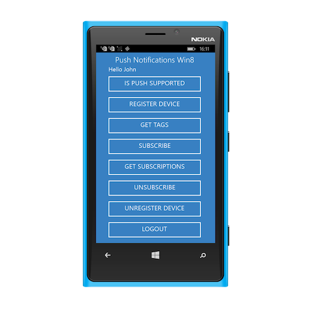

<!-- NLS_CHARSET=UTF-8 -->
## Visión general
{: #overview }
La API de notificaciones que {{ site.data.keys.product_adj }} proporciona sirve para registrar y anular el registro de dispositivos y suscribir y anular la suscripción a etiquetas. En esta guía de aprendizaje, aprenderá a manejar el envío de notificaciones en aplicaciones nativas Windows 8.1 Universal y Windows 10 UWP mediante C#.

**Requisitos previos: **

* Asegúrese de haber leído las siguientes guías de aprendizaje:
	* [Visión general de notificaciones push](../../)
    * [Configuración del entorno de desarrollo de {{ site.data.keys.product_adj }}](../../../installation-configuration/#installing-a-development-environment)
    * [Adición de {{ site.data.keys.product_adj }} SDK a aplicaciones Windows](../../../application-development/sdk/windows-8-10)
* {{ site.data.keys.mf_server }} para ejecutar localmente, o un remotamente ejecutando {{ site.data.keys.mf_server }}.
* {{ site.data.keys.mf_cli }} instalado en la estación de trabajo del desarrollador

#### Ir a:
{: #jump-to }
* [Configuración de notificaciones](#notifications-configuration)
* [API de notificaciones](#notifications-api)
* [Manejo de una notificación push](#handling-a-push-notification)

## Configuración de notificaciones
{: #notifications-configuration }
Cree un nuevo proyecto Visual Studio o utilice uno existente.  
Si {{ site.data.keys.product_adj }} Native Windows SDK todavía no está presente en el proyecto, siga las instrucciones en la guía de aprendizaje [Adición de {{ site.data.keys.product_adj }} SDK para aplicaciones Windows](../../../application-development/sdk/windows-8-10).

### Añadir el SDK de push
{: #adding-the-push-sdk }
1. Seleccione Herramientas → NuGet Package Manager → Package Manager Console.
2. Elija el proyecto en el que desea instalar el componente push de {{ site.data.keys.product_adj }}.
3. Añada el SDK de push de {{ site.data.keys.product_adj }} ejecutando el mandato **Install-Package IBM.MobileFirstPlatformFoundationPush**.

## Requisito previo de configuración de WNS
{: pre-requisite-wns-configuration }
1. Asegúrese de que la aplicación tiene la funcionalidad de notificación Toast. Esta funcionalidad se habilita en Package.appxmanifest.
2. Asegúrese de que `Package Identity Name` y `Publisher` se actualicen con los valores registrados con WNS.
3. (Opcional) Suprima el archivo TemporaryKey.pfx.

## API de notificaciones
{: #notifications-api }
### Instancia de MFPPush
{: #mfppush-instance }
Todas las llamadas de API se deben realizar en una instancia de `MFPPush`.  Esto se puede realizar creando una variable como, por ejemplo, `private MFPPush PushClient = MFPPush.GetInstance();` y, a continuación, llamando a `PushClient.methodName()` a lo largo de la clase.

Otra posibilidad es llamar a `MFPPush.GetInstance().methodName()` para cada instancia en la que necesita acceder a los métodos de API de push.

### Manejadores de desafíos
{: #challenge-handlers }
Si el ámbito de `push.mobileclient` está correlacionado con la **comprobación de seguridad**, debe asegurarse de que existen **manejadores de desafíos** coincidentes registrados antes de utilizar las API de push.

> Aprenda más sobre los manejadores de desafíos en la guía de aprendizaje de [validación de credenciales](../../../authentication-and-security/credentials-validation/ios).

### Lado del cliente
{: #client-side }

| Métodos de C Sharp                                                                                                | Descripción                                                             |
|--------------------------------------------------------------------------------------------------------------|-------------------------------------------------------------------------|
| [`Initialize()`](#initialization)                                                                            | Inicia MFPPush con el contexto proporcionado.                               |
| [`IsPushSupported()`](#is-push-supported)                                                                    | Indica si el dispositivo da soporte a notificaciones push.                             |
| [`RegisterDevice(JObject options)`](#register-device--send-device-token)                  | Registra el dispositivo con el servicio de notificaciones push.               |
| [`GetTags()`](#get-tags)                                | Recupera las etiquetas disponibles en una instancia del servicio de notificaciones push. |
| [`Subscribe(String[] Tags)`](#subscribe)     | Suscribe el dispositivo para las etiquetas especificadas.                          |
| [`GetSubscriptions()`](#get-subscriptions)              | Recupera todas las etiquetas a las que el dispositivo está actualmente suscrito.               |
| [`Unsubscribe(String[] Tags)`](#unsubscribe) | Anula la suscripción de una o varias etiquetas.                                  |
| [`UnregisterDevice()`](#unregister)                     | Anula el registro del dispositivo del servicio notificaciones push.              |

#### Inicialización
{: #initialization }
La inicialización es necesaria para que la aplicación de cliente se conecte al servicio MFPPush.

* Primero se debe llamar al método `Initialize` antes de utilizar cualquier otra API MFPPush.
* Registra la función de retorno de llamada para manejar las notificaciones push recibidas.

```csharp
MFPPush.GetInstance().Initialize();
```

#### Está push soportado
{: #is-push-supported }
Comprueba si el dispositivo da soporte a las notificaciones push.

```csharp
Boolean isSupported = MFPPush.GetInstance().IsPushSupported();

if (isSupported ) {
    // Push is supported
} else {
    // Push is not supported
}
```

#### Registrar el dispositivo y enviar una señal de dispositivo
{: #register-device--send-device-token }
Registre el dispositivo para el servicio de notificaciones push.

```csharp
JObject Options = new JObject();
MFPPushMessageResponse Response = await MFPPush.GetInstance().RegisterDevice(Options);         
if (Response.Success == true)
{
    // Successfully registered
} else {
    // Registration failed with error
}
```

#### Obtener etiquetas
{: #get-tags }
Recupere todas las etiquetas disponibles desde el servicio de notificaciones push.

```csharp
MFPPushMessageResponse Response = await MFPPush.GetInstance().GetTags();
if (Response.Success == true)
{
    Message = new MessageDialog("Avalibale Tags: " + Response.ResponseJSON["tagNames"]);
} else{
    Message = new MessageDialog("Failed to get Tags list");
}
```

#### Suscribir
{: #subscribe }
Suscriba las etiquetas deseadas.

```csharp
string[] Tags = ["Tag1" , "Tag2"];

// Get subscription tag
MFPPushMessageResponse Response = await MFPPush.GetInstance().Subscribe(Tags);
if (Response.Success == true)
{
    //successfully subscribed to push tag
}
else
{
    //failed to subscribe to push tags
}
```

#### Obtener suscripciones
{: #get-subscriptions }
Recupere las etiquetas a las que el dispositivo está actualmente suscrito.

```csharp
MFPPushMessageResponse Response = await MFPPush.GetInstance().GetSubscriptions();
if (Response.Success == true)
{
    Message = new MessageDialog("Avalibale Tags: " + Response.ResponseJSON["tagNames"]);
}
else
{
    Message = new MessageDialog("Failed to get subcription list...");
}
```

#### Anular la suscripción
{: #unsubscribe }
Anule la suscripción de etiquetas.

```csharp
string[] Tags = ["Tag1" , "Tag2"];

// unsubscribe tag
MFPPushMessageResponse Response = await MFPPush.GetInstance().Unsubscribe(Tags);
if (Response.Success == true)
{
    //succes
}
else
{
    //failed to subscribe to tags
}
```

#### Anular el registro
{: #unregister }
Anule el registro del dispositivo de una instancia de servicio de notificaciones push.

```csharp
MFPPushMessageResponse Response = await MFPPush.GetInstance().UnregisterDevice();         
if (Response.Success == true)
{
    // Successfully registered
} else {
    // Registration failed with error
}
```

## Manejar una notificación push
{: #handling-a-push-notification }
Con el propósito de manejar una notificación push será necesario configurar un `MFPPushNotificationListener`.  Esto se puede lograr implementando el siguiente método.

1. Cree una clase utilizando la interfaz de tipo MFPPushNotificationListener

   ```csharp
   internal class NotificationListner : MFPPushNotificationListener
   {
        public async void onReceive(String properties, String payload)
   {
        // Handle push notification here      
   }
   }
   ```

2. Establezca la clase que debe hacer de escucha llamando a `MFPPush.GetInstance().listen(new NotificationListner())`
3. En el método onReceive recibirá la notificación push y podrá manejarla para el comportamiento que desee.




## Servicio de notificaciones push de Windows Universal
{: #windows-universal-push-notifications-service }
No es necesario abrir un puerto específico en su configuración de servidor.

WNS utiliza solicitudes http o https estándar.


## Aplicación de ejemplo
{: #sample-application }
[Pulse para descargar](https://github.com/MobileFirst-Platform-Developer-Center/PushNotificationsWin8/tree/release80) el proyecto de Windows 8.1 Universal.  
[Pulse para descargar](https://github.com/MobileFirst-Platform-Developer-Center/PushNotificationsWin8/tree/release80) el proyecto de Windows 10 UWP.

### Uso de ejemplo
{: #sample-usage }
Siga el archivo README.md de ejemplo para obtener instrucciones.
