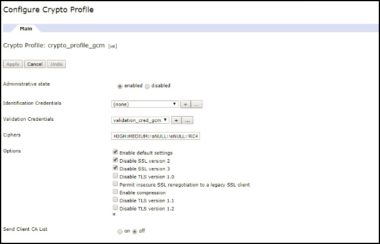
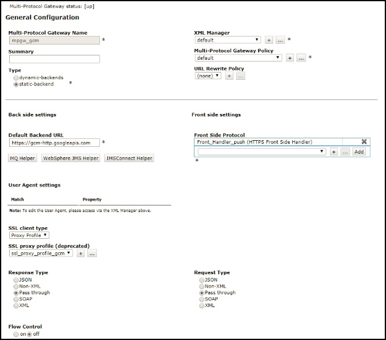
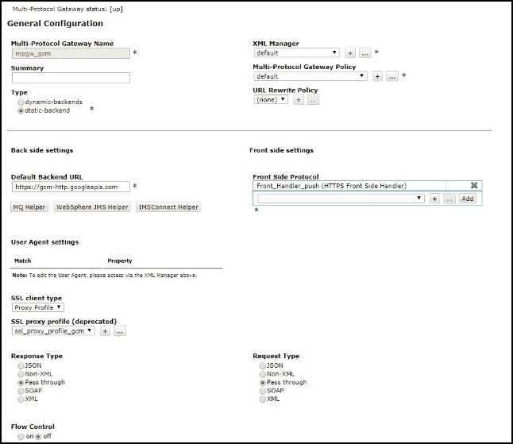

<!-- NLS_CHARSET=UTF-8 -->
## Visión general
{: #overview }
Las notificaciones permiten que un dispositivo móvil reciba mensajes de tipo "push" que se envían desde un servidor.  
Las notificaciones se reciben independientemente de si la aplicación actualmente se está ejecutando en un primer plano o en un segundo plano.  

{{ site.data.keys.product_full }} proporciona un conjunto de unificado de métodos de API para enviar notificaciones push o SMS a aplicaciones iOS, Android, Windows 8.1 Universal, Windows 10 UWP y Cordova (iOS, Android). Las notificaciones se envían desde {{ site.data.keys.mf_server }} a la infraestructura de proveedor (Apple, Google, Microsoft, pasarelas SMS) y de allí a los dispositivos pertinentes. El mecanismo de notificación unificado de notificación hace que todo el proceso de comunicación con los usuarios y los dispositivos sea completamente transparente para el desarrollador.

#### Soporte de dispositivo
{: #device-support }
Las notificaciones SMS y push están soportadas por las siguientes plataformas en {{ site.data.keys.product }}:

* iOS 8.x o posterior
* Android 4.x o posterior
* Windows 8.1, Windows 10

#### Ir a:
{: #jump-to }
* [Notificaciones push](#push-notifications)
* [Notificaciones SMS](#sms-notifications)
* [Valores de proxy](#proxy-settings)
* [Guías de aprendizaje con las que continuar](#tutorials-to-follow-next)

## Notificaciones push
{: #push-notifications }
Las notificaciones pueden ser de distintos tipos:

* **Alertas (iOS, Android, Windows)** -  mensaje de texto emergente
* **Sonido (iOS, Android, Windows)** - archivo de sonido que se reproduce cuando se recibe una notificación
* **Identificador (iOS), Mosaico (Windows)** - representación gráfica que permite un breve texto o una imagen
* **Banner (iOS), Toast (Windows)** - mensaje de texto emergente que desaparece en la parte superior de la pantalla del dispositivo
* **Interactiva (iOS 8 y superior)** - botones de acción dentro del banner de una notificación recibida
* **Silenciosa (iOS 8 y superior)** - notificaciones que el usuario no percibe

### Tipos de notificación push
{: #push-notification-types }
#### Notificaciones de etiqueta
{: #tag-notifications }
Las notificaciones de etiqueta son mensajes de notificación dirigidos a todos los dispositivos que están suscritos a una etiqueta concreta.  

Las notificaciones basadas en etiquetas permiten la segmentación de notificaciones en base a temas o áreas de asuntos. Los destinatarios de las notificaciones pueden elegir recibirlas únicamente si tratan sobre un tema o asunto de su interés. Por lo tanto, las notificaciones basadas en etiquetas proporcionan un medio de segmentar los destinatarios. Esta característica permite definir etiquetas y enviar o recibir mensajes por etiquetas. El mensaje únicamente se dirige a los dispositivos que se han suscrito a una etiqueta.

#### Notificaciones de difusión
{: #broadcast-notifications }
Las notificaciones de difusión son una forma de notificaciones push dirigidas a todos los dispositivos suscritos. De forma predeterminada están dirigidas a cualquier aplicación de {{ site.data.keys.product_adj }} habilitada para push mediante una suscripción a la etiqueta reservada `Push.all` (que se crea de forma automática para cada dispositivo). Las notificaciones de difusión se pueden inhabilitar anulando la suscripción desde la etiqueta reservada `Push.all`.

#### Notificaciones de difusión única
{:# unicast-notifications }
Las notificaciones de difusión única, o notificaciones autenticadas de usuario, se protegen con OAuth. Estos mensajes de notificación están destinados a un dispositivo determinado o distintos ID de usuario. La suscripción del ID de usuario en la suscripción de usuarios puede provenir del contexto de seguridad subyacente.

#### Notificaciones interactivas
{: #interactive-notifications }
En las notificaciones interactivas, cuando una notificación llega, los usuarios pueden tomar acciones con relación a la misma sin abrir la aplicación. Cuando llega una notificación interactiva, el dispositivo muestra los botones de la acción junto con el mensaje de notificación. Actualmente, las notificaciones interactivas están soportadas en dispositivos en iOS versión 8 y posterior. Si se envía una notificación interactiva a un dispositivo iOS con una versión anterior a la versión 8, las acciones de la notificación no se visualizarán.

> Aprenda a manejar las [notificaciones interactivas](handling-push-notifications/interactive).

#### Notificaciones silenciosas
{: #silent-notifications }
Las notificaciones silenciosas son notificaciones que no visualizan alertas ni interrumpen al usuario. Cuando llega una notificación silenciosa, la aplicación que se encarga del código lo ejecuta en un segundo plano sin llevar la aplicación a un primer plano. Actualmente, se da soporte a las instalaciones silenciosas en dispositivos iOS a partir de la versión 7. Si se envía una notificación silenciosa a dispositivos iOS con una versión anterior a la 7, si la aplicación se ejecuta en un segundo plano, se ignora la notificación. Si la aplicación se está ejecutando en un primer plano, se invoca al método de llamada de retorno de notificación.

> Aprenda a manejar las [notificaciones silenciosas](handling-push-notifications/silent).

**Nota:** Las notificaciones de difusión única no contienen ninguna etiqueta en la carga útil. El mensaje de notificación puede dirigirse a varios dispositivos o usuarios especificando varios deviceID o userID respectivamente, en el bloque de destino de la API del mensaje POST.

## Notificaciones SMS
{: #sms-notifications }
Para recibir notificaciones SMS, la aplicación primero se debe registrar a una suscripción de notificación SMS. Para suscribirse a notificaciones SMS, el usuario proporciona un número de teléfono móvil y aprueba la suscripción de notificación. Se envía una solicitud de suscripción a {{ site.data.keys.mf_server }} después de la recepción de la aprobación del usuario. Cuando se recupera una notificación desde {{ site.data.keys.mf_console }}, se procesa y envía a través de una pasarela SMS configurada de forma previa.

Consulte la guía de aprendizaje de [Envío de notificaciones](sending-notifications) para configurar la pasarela.

## Valores de proxy
{: #proxy-settings }
Utilice los valores de proxy para establecer el proxy opcional a través de la cual se enviarán notificaciones a APNS y FCM. El proxy se configura mediante las propiedades de configuración **push.apns.proxy.*** y **push.gcm.proxy.***. Para obtener más información, consulte [Lista de propiedades JNDI para el servicio push de {{ site.data.keys.mf_server }}](../installation-configuration/production/server-configuration/#list-of-jndi-properties-for-mobilefirst-server-push-service).

> **Nota:** WNS no tiene soporte de proxy.

### Utilización del DataPower de WebSphere como punto final de notificación de push
{: #proxy-settings-datapower }

Puede configurar DataPower para aceptar solicitudes de notificación desde el servidor de MobileFirst y redirigirlas a FCM, SMS y WNS.

Tenga en cuenta que APN no está soportado.

#### Configuración de MobileFirst Server
{: #proxy-settings-datapower-1 }

En `server.xml` configure la siguiente propiedad JNDI:
```
<jndiEntry jndiName="imfpush/mfp.push.dp.endpoint" value = '"https://host"' />
<jndiEntry jndiName="imfpush/mfp.push.dp.gcm.port" value = '"port"' />
<jndiEntry jndiName="imfpush/mfp.push.dp.wns.port" value = '"port"' />
```

Donde `host` es el nombre de host de DataPower y `port` es el número de puerto donde está configurado el controlador de Frontside de HTTPS para FCM y WNS.

Para SMS, se proporcionarán valores de configuración como parte de la llamada de API REST. No es necesario proporcionar propiedades JNDI.

#### Configuración de DataPower
{: #proxy-settings-datapower-2 }

1. Inicie sesión en el dispositivo de DataPower.
2. Navegue a **Servicios** > **Pasarela multiprotocolo** > **Nueva pasarela multiprotocolo**.
3. Proporcione un nombre con el que pueda identificar la configuración.
4. Seleccione la política de pasarela multiprotocolo del gestor XML como valor predeterminado y la política de reescritura de URL a ninguna.
5. Seleccione el botón de selección **programa de fondo estático** y seleccione cualquiera de las siguientes opciones para **establecer el URL del programa de fondo predeterminado**:
	- Para FCM:	`https://gcm-http.googleapis.com`
	- Para SMS:	`http://<samplegateway>/gateway`
	- Para WNS:	`https://hk2.notify.windows.com`
6. Seleccione el tipo de respuesta, tipo de solicitud como pasar por.

#### Generación de un certificado
{: #proxy-settings-datapower-3 }

Para generar un certificado, elija una de las siguientes opciones:

- Para FCM:
	1. Desde la línea de mandatos, emita `Openssl` para obtener los certificados de FCM.
	2. Ejecute el siguiente mandato:
		```
		openssl s_client -connect gcm-http.googleapis.com:443
		```
	3. Copie los contenidos desde -----BEGIN CERTIFICATE----- hasta -----END CERTIFICATE----- y guárdelos en un archivo con la extensión `.pem`.

- Para SMS, los certificados no son necesarios.
- Para WNS:
	1. Desde la línea de mandatos, utilice `Openssl` para obtener los certificados de WNS.
	2. Ejecute el siguiente mandato:
		```
		openssl s_client -connect https://hk2.notify.windows.com:443
		```
	3. Copie los contenidos desde -----BEGIN CERTIFICATE----- hasta -----END CERTIFICATE----- y guárdelos en un archivo con la extensión `.pem`.

#### Valores de backside
{: #proxy-settings-datapower-4 }


- Para FCM y WNS:

	1. Cree un certificado Crypto:

		a. Navegue a **Objetos** > **Configuración Crypto** y pulse **Certificado Crypto**.

		b. Proporcione un nombre con el que pueda identificar el certificado Crypto.

		c. Pulse **Cargar** para cargar el certificado FCM generado.

		d. Defina el **Alias de contraseña** en ninguno.

		e. Pulse **Generar clave**.
		

	2. Cree una credencial de validación Crypto:

		a. Navegue a **Objetos** > **Configuración Crypto** y pulse **Credencial de validación Crypto**.

		b. Proporcione un nombre único.

		c. Para los certificados, seleccione el certificado Crypto que ha creado en el paso anterior (1).

		d. Como **Modalidad de validación de certificado** seleccione Coincidencia de certificado exacta o emisor inmediato.

		e. Pulse **Aplicar**.
		

	3. Cree una credencial de validación Crypto:

		a. Navegue a **Objetos** > **Configuración Crypto** y pulse **Perfil Crypto**.

		b. Pulse **Añadir**.

		c. Proporcione un nombre único.

		d. Para **Credenciales de validación**, seleccione la credencial de validación creada en el paso anterior (2) del menú desplegable, defina las credenciales de identificación en **ninguna**.

		e. Pulse **Aplicar**.
		

	4. Crear un perfil de proxy SSL:

		a. Navegue a **Objetos** > **Configuración Crypto** >, **Perfil de proxy SSL**.

		b. Elija una de las opciones siguientes:

		- Para SMS, seleccione **Perfil de proxy SSL** como ninguno.
		- Para FCM y WNS con un URL de programa de fondo seguro (HTTPS), complete los siguientes pasos:
			1.	Pulse **Añadir**.

			2.	Proporcione un nombre con el que pueda identificar el perfil de proxy SSL más tarde.

			3.	Seleccione **Dirección SSL** como **Reenvío** en el desplegable.

			4.	Para el perfil Crypto de reenvío (Cliente), seleccione el perfil de Crypto creado en el paso 3.

			5.	Pulse **Aplicar**.
			

	5. En la ventana de la pasarela multiprotocolo, en **Valores de backside**, seleccione **Perfil de proxy** como **Tipo de cliente SSL** y seleccione el perfil de proxy SSL creado en el paso 4 

- Para SMS, los valores de backside no son necesarios.

#### Valores de frontside
{: #proxy-settings-datapower-5 }

- Para FCM, WNS y SMS:


	1. Cree un par clave-certificado con el nombre de host de DataPower como valor de nombre común:

		a. Navegue a **Administración** > **Varios** y pulse **Herramientas Crypto**.

		b. Especifique el nombre de host del DataPower como valor del nombre común.

		c. Seleccione **Exportar clave privada** si planea exportar la clave privada más adelante y pulse en **Generar clave**.
		

	2. Cree una credencial de identificación Crypto:

		a. Navegue a **Objetos** > **Configuración Crypto** y pulse **Credencial de identificación Crypto**.

		b. Pulse **Añadir**.

		c. Proporcione un nombre único.

		d. Para la clave y el certificado Crypto, seleccione la clave y el certificado generados en el paso anterior (1) del recuadro de lista.

		e. Pulse **Aplicar**.
		

	3. Cree un perfil Crypto:

		a. Navegue a **Objetos** > **Configuración Crypto** y pulse **Perfil Crypto**.

		b. Pulse **Añadir**.

		c. Proporcione un nombre único.

		d. Como credenciales de identificación seleccione la credencial de identificación creada en el paso anterior (2) del recuadro de lista. Defina las credenciales de validación en ninguna.

		e. Pulse **Aplicar**.
		

	4. Crear un perfil de proxy SSL:

		a. Navegue a **Objetos** > **Configuración Crypto** >, **Perfil de proxy SSL**.

		b. Pulse **Añadir**.

		c. Proporcione un nombre único.

		d. Seleccione la dirección SSL como **Inversa** en el recuadro de lista.

		e. Para el perfil Crypto inverso (servidor), seleccione el perfil de Crypto creado en el paso anterior (3).  

		f. Pulse **Aplicar**.
		

	5. Cree un controlador de Frontside de HTTPS:

		a. Navegue a **Objetos** > **Controladores de protocolo** > **controlador de Frontside de HTTPS**.

		b. Pulse **Añadir**.

		c. Proporcione un nombre único.

		d. Para **Dirección IP local**, seleccione el alias correcto o déjelo en el valor predeterminado (0.0.0.0).

		e. Proporcione un puerto disponible.

		f. Para **Versiones y métodos permitidos** seleccione HTTP 1.0, HTTP 1.1, método POST, método GET , URL con ?, URL con #, URL con ..

		g. Seleccione **Perfil proxy** como tipo de servidor SSL.

		h. Para el perfil de proxy SSL (en desuso), seleccione el perfil creado en el paso anterior(4).

		i. Pulse **Aplicar**.
		

	6. En la página Configurar la pasarela multiprotocolo en **Valores de frontside**, seleccione el controlador de Frontside de https como **Protocolo FrontSide**, creado en el paso 5, y pulse **Aplicar**.

	

	El certificado que está utilizando el DataPower en los valores de Frontside, es uno autofirmado. A menos que el certificado se añada al almacén de claves del JRE utilizado por Mobilefirst, las conexiones con DataPower fallarán.

	Para añadir un certificado autofirmado al almacén de claves del JRE, siga las instrucciones del documento: [IBM Worklight Server and self-signed certificates](https://www.ibm.com/support/knowledgecenter/SSZH4A_5.0.5/com.ibm.worklight.help.doc/admin/t_ibm_worklight_server_and_self-signed_certificates.html).


## Guías de aprendizaje con las que continuar
{: #tutorials-to-follow-next }
Siga a través de la siguiente configuración necesaria del lado del servidor y del lado del cliente para poder enviar y recibir notificaciones push:
