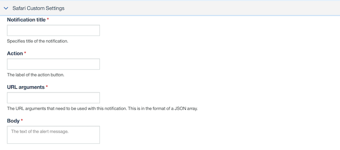

<!-- NLS_CHARSET=UTF-8 -->

Enviar notificaciones a las plataformas web es similar a enviar notificaciones a las plataformas móviles. Consulte [aquí]({{ site.baseurl }}/tutorials/en/foundation/8.0/notifications/sending-notifications/), para obtener más información. 

* En el separador **Enviar notificaciones**, verá una nueva opción para la selección **Plataforma**. 
* Puede seleccionar *Móvil* o *Web*.

En el menú desplegable **Enviar a**, tiene nuevas opciones, tales como
**Chrome**, **Firefox** y **Safari** en función de la plataforma configurada. Cada plataforma incluye una sección de valores personalizados asociada, según lo requiere la plataforma. También puede dirigir una notificación a **Todas** las plataformas, **Dispositivos por etiquetas**, **Dispositivos por ID de usuario** o a un **Dispositivo individual**.

### Valores personalizados de Chrome

Los siguientes son algunos de los valores específicos de Chrome.

- **Título de notificación**: Especifica el título de la notificación. 
- **URL de icono de notificación**: El URL que se ha de establecer para la notificación push web. 
- **Tiempo de vida**: Notifica a FCM la validez del mensaje.

### Valores personalizados de Chrome

Los siguientes son algunos de los valores específicos de Firefox.
- **Título de notificación**: Especifica el título de la notificación. 
- **URL de icono de notificación**: El URL que se ha de establecer para la notificación web push.

### Valores personalizados de Safari 

Los siguientes son algunos de los valores específicos de Safari.
- **Título de notificación**: Especifica el título de la notificación. 
- **Acción**: La etiqueta del botón de acción. 
- **Argumentos de URL**: Los argumentos de URL que se han de utilizar con esta notificación. El formato es una matriz JSON. 
- **Cuerpo**: El cuerpo de la notificación.

El envío de notificaciones basadas en *Etiqueta*, *ID de dispositivo* e *ID de usuario* es similar al de las plataformas móviles. 
