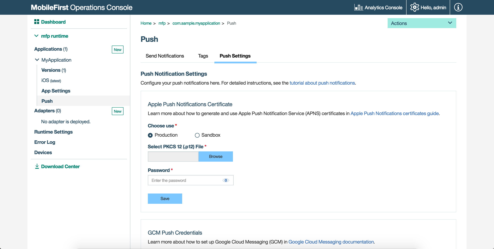
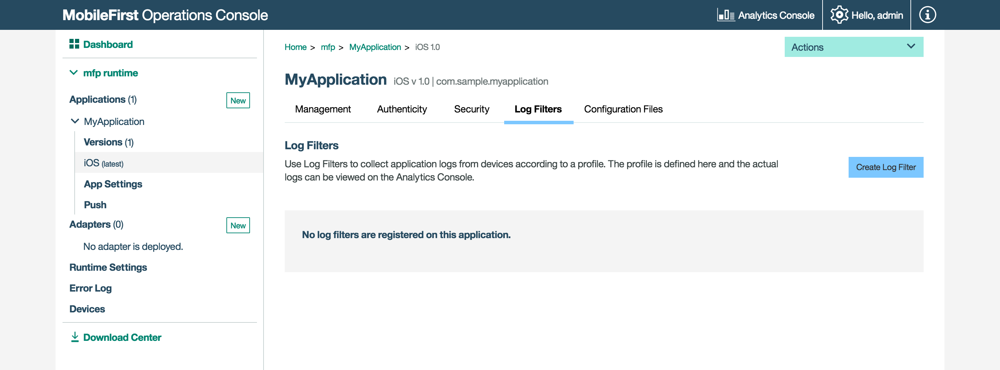

<!-- NLS_CHARSET=UTF-8 -->
## Visión general
{: #overview }
{{site.data.keys.mf_console_full }} es una interfaz de usuario web que simplifica los flujos de trabajo tanto a los desarrolladores como a los administradores para crear, supervisar, proteger y administrar adaptadores y aplicaciones.


#### Como desarrollador permite
{: #as-a-developer }
* Desarrollar aplicaciones para cualquier entorno y registrarlos para {{site.data.keys.mf_server }}.
* Ver de forma global todos los adaptadores y las aplicaciones desplegadas.
Consulte el Panel de control.

* Gestionar y configurar aplicaciones registradas, incluida Direct Update, la inhabilitación remota y los parámetros de seguridad para la autenticación de usuarios y la autenticación de aplicaciones.

* Configurar las notificaciones push desplegando certificados, creando códigos de notificación y enviando notificaciones.

* Crear y desplegar adaptadores.

* Descargar ejemplos.


#### Como un administrador de tecnología de información permite 
{: #as-an-it-administrator }
* Supervisar distintos servicios.

* Buscar dispositivos que accedan a {{site.data.keys.mf_server }} y gestionar sus derechos de acceso.

* Actualizar configuraciones de adaptador de forma dinámica.

* Ajustar configuraciones de registradores de cliente mediante perfiles de registro.

* Seguir la utilización de las licencias de producto.


#### Ir a:
{: #jump-to }
* [Acceso a la consola](#accessing-the-console)
* [Navegación en la consola](#navigating-the-console)

## Acceso a la consola
{: #accessing-the-console }
Se puede acceder a {{site.data.keys.mf_console }} de diversas maneras:


### Desde {{site.data.keys.mf_server }} instalado de forma local
{: #from-a-locally-installed-mobilefirst-server }
#### Navegador de escritorio
{: #desktop-browser }
Desde el navegador que desee, cargue el URL [http://localhost:9080/mfpconsole](http://localhost:9080/mfpconsole).
El nombre de usuario y la contraseña son *admin/admin*.

#### Línea de mandatos
{: #command-line }
Desde la ventana de **línea de mandatos**, con {{site.data.keys.mf_cli }} instalado, ejecute el mandato: `mfpdev server console`.

### Desde un {{site.data.keys.mf_server }} instalado de forma remota 
{: #from-a-remotely-installed-mobilefirst-server }
#### Navegador de escritorio
{: #desktop-browser-remote }
Desde el navegador que desee, cargue el URL `http://host-servidor:número-puerto-servidor/mfpconsole`.  
El servidor host puede ser un servidor del propio cliente, o el servicio IBM Bluemix, IBM [Mobile Foundation](../../../bluemix/).

#### Línea de mandatos
{: #command-line-remote }
Desde la ventana de **línea de mandatos**, con {{site.data.keys.mf_cli }} instalado,
 

1. Añada una definición de servidor remoto:

    *Modalidad interactiva*  
    Ejecute el mandato: `mfpdev server add` y siga las instrucciones de la pantalla.


    *Modalidad directa
*  
    Ejecute el mandato con la siguiente estructura: `mfpdev server add [nombre-servidor] --URL [URL-servidor-remoto] --login [nombre-usuario-admin] --password [contraseña-admin] --contextroot [nombre-servicio-admin]`.
Por ejemplo: 

   ```bash
   mfpdev server add MyRemoteServer http://my-remote-host:9080/ --login TheAdmin --password ThePassword --contextroot mfpadmin
   ```

2. Ejecute el mandato: `mfpdev server console MyRemoteServer`.

> Obtenga más información sobre los mandatos de la interfaz de línea de mandatos en la guía de aprendizaje [Utilización de la interfaz de línea de mandatos para gestionar artefactos de {{site.data.keys.product_adj }}](../../../application-development/using-mobilefirst-cli-to-manage-mobilefirst-artifacts/).
## Navegación en la consola
{: #navigating-the-console }
### Panel de control
{: #dashboard }
El Panel de control proporciona una visión general de los proyectos desplegados.


#### Desplegable Acciones
{: #actions-dropdown }
El desplegable proporciona un acceso rápido a las distintas acciones de la consola.


### Valores de tiempo de ejecución
{: #runtime-settings }
Edite las propiedades de tiempo de ejecución, las variables de la seguridad global, el almacén de claves y los clientes confidenciales.


### Registro de errores
{: #error-log }
El registro de errores muestra una lista de las operaciones de gestión con errores que se iniciaron desde {{site.data.keys.mf_console }} o desde la línea de mandatos, en el entorno de tiempo de ejecución actual.
Utilice el archivo de registro para ver el efecto de la anomalía en los servidores.


> Para obtener más información, consulte el tema sobre el registro de errores de operaciones en entornos de tiempo de ejecución en la documentación de usuario.


### Dispositivos
{: #devices }
Los administradores pueden buscar dispositivos que acceden a {{site.data.keys.mf_server }} y gestionar derechos de acceso.
  
Se pueden buscar dispositivos utilizando el ID de usuario o un nombre descriptivo.
El ID de usuario es el identificador que se utilizó al iniciar una sesión.
  
El nombre descriptivo es el que se asoció al dispositivo para distinguirlo de otros dispositivos que comparten el ID de usuario.
 

> Para obtener más información, consulte el tema sobre la gestión del acceso a dispositivos en la documentación de usuario.


### Aplicaciones
{: #applications }
#### Registro de aplicaciones
{: #registering-applications }
Proporcione valores de aplicación básicos y descargue código de inicio.  


#### Gestión de aplicaciones
{: #managing-applications }
Gestione y configure las aplicaciones registradas utilizando [Direct Update](../../../application-development/direct-update/), la inhabilitación remota, [la autenticidad de aplicaciones](../../../authentication-and-security/application-authenticity/) y [establezca parámetros de seguridad](../../../authentication-and-security/).


#### Autenticación y seguridad
{: #authentication-and-security }
Configure los parámetros de seguridad de las aplicaciones como, por ejemplo, el valor de la caducidad de las señales, correlacione elementos de ámbito con comprobaciones de seguridad, defina ámbitos de aplicación obligatorios y configure opciones de comprobación de seguridad.


> [Obtenga más información](../../../authentication-and-security/) sobre la infraestructura de seguridad de {{site.data.keys.product_adj }}.


#### Valores de aplicación
{: #application-settings }
Configure el nombre para mostrar de la aplicación en la consola así como el tipo de aplicación y sus licencias.


#### Notificaciones
{: #notifications }
Configure las [notificaciones push](../../../notifications/) y los parámetros relacionados como, por ejemplo, los detalles de GCM y certificados, defina códigos, así cómo enviar notificaciones a dispositivos.




### Adaptadores
{: #adapters }
#### Creación de adaptadores
{: #creating-adapters }
[Registre un adaptador](../../../adapters/) y descargue el código de inicio, así como actualizar un adaptador de forma directa actualizando sus propiedades sin necesidad de volver a construir y desplegar el artefacto adaptador.


#### Propiedades de adaptador
{: #adapter-properties }
Después de que se haya desplegado un adaptador, puede configurarse en la consola.


### Registros de cliente
{: #client-logs }
Los administradores pueden utilizar los perfiles de registro para ajustar las configuraciones del registrador de cliente como, por ejemplo, el nivel de registro y los filtros del paquete de registro, para cualquier combinación de sistema operativo, versión de sistema operativo, aplicación, versión de aplicación y modelo de dispositivo.


Cuando un administrador crea un perfil de configuración, la configuración del registro se concatena con las llamadas de API de respuestas como, por ejemplo, `WLResourceRequest`, y se aplica automáticamente.


> Para obtener más información, consulte el tema sobre la configuración de la captura de registro en el lado del cliente en la documentación del usuario.




### Seguimiento de licencia
{: #license-tracking }
Esta funcionalidad es accesible desde los botones de configuración de la parte superior.


Los términos de la licencia varían en función de la edición (Enterprise o Consumer) de {{site.data.keys.product }} que se utilice.
De forma predeterminada, el seguimiento de licencia está habilitado y se siguen las métricas pertinentes para la política de licencias como, por ejemplo, para dispositivos de cliente activos y aplicaciones instaladas.
Esta información ayuda a determinar si el uso actual de {{site.data.keys.product }} está dentro de los niveles autorizados de la licencia y puede evitar posibles incumplimientos de la licencia.


Mediante el seguimiento de los dispositivos de cliente y la determinación de si estos están activos, los administradores pueden decomisionar dispositivos a los que el servicio no debería estar accediendo.
Esta situación puede darse, por ejemplo, si un empleado ha dejado la empresa. 

> Para obtener más información, consulte el tema sobre el seguimiento de licencia en la documentación de usuario.


### Descargas  
{: #downloads }
Para situaciones donde la conectividad de Internet no está disponible, puede descargar una instantánea de distintos artefactos de desarrollo de {{site.data.keys.product }} desde el centro de descargas en {{site.data.keys.mf_console }}.


