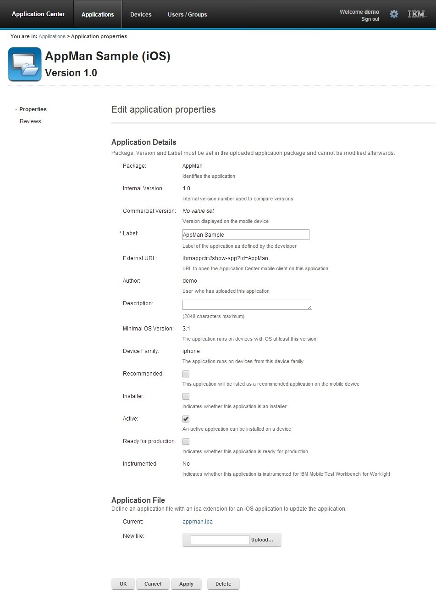

<!-- NLS_CHARSET=UTF-8 -->
## Présentation
{: #overview }
La console Application Center vous permet de gérer le référentiel Application Center et vos applications.

La console Application Center est une application Web permettant de gérer le référentiel Application Center. Le référentiel Application Center est l'emplacement où vous centralisez les applications mobiles qui peuvent être installées sur des appareils mobiles.

Utilisez la console Application Center pour les opérations suivantes :

* Transférer des applications écrites pour ces systèmes d'exploitation : Android, iOS, Windows 8 (modules Windows Store uniquement), Windows Phone 8 ou Windows 10 Universal.
* Gérer plusieurs versions différentes d'applications mobiles.
* Examiner les commentaires des testeurs d'applications mobiles.
* Définir les utilisateurs qui ont le droit de répertorier et d'installer une application sur les appareils mobiles.
* Suivre quelles applications sont installées sur quels appareils.

> **Remarques :**
>
> * Seuls les utilisateurs disposant du rôle d'administrateur peuvent se connecter à la console Application Center.
> * Support multiculturel : l'interface utilisateur de la console Application Center n'a pas été traduite.

#### Accéder à
{: #jump-to }
* [Démarrage de la console Application Center](#starting-the-application-center-console)
* [Traitement des incidents liés à une page de connexion endommagée (Apache Tomcat)](#troubleshooting-a-corrupted-login-page-apache-tomcat)
* [Traitement des incidents liés à une page de connexion endommagée (navigateurs Safari)](#troubleshooting-a-corrupted-login-page-in-safari-browsers)
* [Gestion des applications](#application-management)
* [Ajout d'une application mobile](#adding-a-mobile-application)
* [Ajout d'une application à partir d'un magasin d'applications public](#adding-an-application-from-a-public-app-store)
* [Propriétés d'application](#application-properties)
* [Edition des propriétés de l'application](#editing-application-properties)
* [Mise à niveau d'une application mobile dans {{ site.data.keys.mf_server }} et Application Center](#upgrading-a-mobile-application-in-mobilefirst-server-and-the-application-center)
* [Téléchargement d'un fichier d'application](#downloading-an-application-file)

Dans la console Application Center, vous pouvez voir des commentaires envoyés par les utilisateurs sur les versions d'applications mobiles.

* [Gestion des utilisateurs et des groupes](#user-and-group-management)
* [Contrôle d'accès](#access-control)
* [Gestion du contrôle d'accès](#managing-access-control)
* [Gestion des appareils](#device-management)
* [Jetons d'inscription d'application dans Windows 8 Universal](#application-enrollment-tokens-in-windows-8-universal)
* [Déconnexion de la console Application Center](#signing-out-of-the-application-center-console)

## Démarrage de la console Application Center
{: #starting-the-application-center-console }
Vous pouvez démarrer Application Center dans votre navigateur Web et vous connecter si vous disposez du rôle d'administrateur.

1. Démarrez une session de navigateur Web sur votre bureau.
2. Contactez votre administrateur système pour obtenir l'adresse et le port du serveur sur lequel Application Center est installé.
3. Entrez l'URL suivante : `http://server/appcenterconsole`
4. Où **server** est l'adresse et le port du serveur sur lequel Application Center est installé : `http://localhost:9080/appcenterconsole`

Connectez-vous à la console Application Center. Contactez votre administrateur système pour obtenir vos données d'identification afin que vous puissiez vous connecter à la console Application Center.

> **Remarque :** seuls les utilisateurs disposant du rôle d'administrateur peuvent se connecter à la console Application Center.

## Traitement des incidents liés à une page de connexion endommagée (Apache Tomcat)
{: #troubleshooting-a-corrupted-login-page-apache-tomcat }
Vous pouvez récupérer d'une page de connexion endommagée de la console Application Center lorsqu'Application Center s'exécute dans Apache Tomcat.

Lorsqu'Application Center s'exécute dans Apache Tomcat, l'utilisation d'un nom d'utilisateur ou d'un mot de passe incorrect peut endommager la page de connexion de la console Application Center.

Lorsque vous tentez de vous connecter à la console avec un nom d'utilisateur incorrect ou un mot de passe incorrect, un message d'erreur s'affiche. Lorsque vous corrigez le nom d'utilisateur ou le mot de passe, au lieu d'une connexion réussie, vous recevez l'un des deux messages d'erreur suivants, en fonction de votre navigateur Web.

* Le même message d'erreur que précédemment
* Le message **La connexion a été réinitialisée**
* Le message **Délai de connexion dépassé**

Ce comportement est lié à la gestion par Apache Tomcat du servlet j_security_check. Ce comportement est spécifique d'Apache Tomcat et ne se produit dans aucun des profils de WebSphere Application Server.

La solution de contournement consiste à cliquer sur le bouton d'actualisation du navigateur pour actualiser la page Web après un échec de connexion. Ensuite, entrez les données d'identification correctes.

## Traitement des incidents liés à une page de connexion endommagée dans les navigateurs Safari
{: #troubleshooting-a-corrupted-login-page-in-safari-browsers }
Vous pouvez récupérer d'une page de connexion endommagée de la console Application Center lorsque vous utilisez le navigateur Safari.

Lorsque la console Application Center est ouverte dans un navigateur Safari, vous devrez peut-être ouvrir un autre écran. Lorsque vous revenez à la console, vous pouvez voir la page de connexion. Même si vous entrez les détails de connexion corrects, le message suivant qui apparaît n'indique pas une connexion réussie : **HTTP Status 404 - appcenterconsole/j_security_check.**

Ce comportement est lié à un problème de mise en cache dans le navigateur Safari.

La solution de contournement consiste à déclencher un rechargement forcé lorsque vous voyez la page de connexion sans données d'identification entrées ou auto-complétées. Voici comment déclencher un rechargement forcé :

* Sur un ordinateur Mac, appuyez sur Maj + le bouton **Actualiser**.
* Sur un appareil iPad ou iPhone : cliquez deux fois sur le bouton d'actualisation ou nettoyez le cache en fermant Safari. Pour cela, cliquez deux fois sur le bouton principal, puis effectuez un balayage vers le haut de la fenêtre Safari.

## Gestion des applications
{: #application-management }
Vous pouvez utiliser Application Management (gestion des applications) pour ajouter de nouvelles applications et versions et pour gérer ces applications.  
Application Center vous permet d'ajouter de nouvelles applications et de nouvelles versions et de gérer ces applications.

Cliquez sur **Applications** pour accéder à Application Management.

### Application Center installé sur le profil Liberty de WebSphere Application Server ou sur Apache Tomcat
{: #application-center-installed-on-websphere-application-server-liberty-profile-or-on-apache-tomcat }
Les installations d'Application Center sur ces serveurs d'applications, lors de l'installation d'{{ site.data.keys.product_full }} avec le module IBM Installation Manager, comportent deux utilisateurs définis que vous pouvez utiliser pour commencer.

* Utilisateur avec l'ID de connexion **demo** et le mot de passe **demo**
* Utilisateur avec l'ID de connexion **appcenteradmin** et le mot de passe **admin**

### Profil complet de WebSphere Application Server
{: #websphere-application-server-full-profile }
Si vous avez installé le profil complet Application Center sur WebSphere Application Server, un utilisateur nommé appcenteradmin est créé par défaut avec le mot de passe indiqué par le programme d'installation.

## Ajout d'une application mobile
{: #adding-a-mobile-application }
Vous pouvez ajouter des applications au référentiel sur le serveur à l'aide de la console Application Center. Ces applications peuvent ensuite être installées sur des appareils mobiles à l'aide du client mobile.

Dans la vue Applications, vous pouvez ajouter des applications à Application Center. Initialement, la liste des applications est vide et vous devez télécharger un fichier d'application. Les fichiers d'application sont décrits dans cette procédure.

Pour ajouter une application afin de la rendre disponible pour l'installation sur des appareils mobiles, procédez comme suit :

1. Cliquez sur **Add Application**.
2. Cliquez sur **Upload**.
3. Sélectionnez le fichier d'application à télécharger dans le référentiel Application Center.

   ### Android
   {: #android }
   L'extension du nom de fichier de l'application est **.apk**.

   ### iOS
   {: #ios }
   L'extension du nom de fichier de l'application est **.ipa** pour les applications iOS normales.

   ### Windows Phone 8
   {: #windows-phone-8 }
   L'extension du nom de fichier de l'application est **.xap**. L'application doit être signée avec un compte de société. Le jeton d'inscription de l'application pour ce compte de société doit être mis à la disposition des appareils Windows Phone 8 pour que l'application puisse être installée sur les appareils. Voir [Jetons d'inscription d'application dans Windows 8 Universal](#application-enrollment-tokens-in-windows-8-universal) pour plus de détails.

   ### Windows 8
   {: #windows-8 }
   L'application est fournie sous forme de module Windows Store. L'extension de fichier est **.appx**.

   Les modules .appx de Windows Store peuvent dépendre d'un ou plusieurs modules d'applications de bibliothèque de composants Windows, également appelés modules d'"infrastructure". Les applications hybrides MobileFirst pour Windows 8 dépendent du module d'infrastructure Microsoft.WinJS. Lorsque vous utilisez Microsoft Visual Studio pour générer le module d'application, les modules de dépendances sont également générés et préparés en tant que fichiers .appx distincts. Pour installer correctement ces applications à l'aide du client mobile, vous devez télécharger le module d'application .appx et tout autre module de dépendance sur le serveur Application Center. Lorsque vous téléchargez un module de dépendance, il apparaît comme inactif dans la console Application Center. Ce comportement est attendu, de sorte que le module d'infrastructure ne s'affiche pas comme une application installable dans le client. Plus tard, lorsqu'un utilisateur installe une application, le client mobile vérifie si la dépendance est déjà installée sur l'appareil. Si le module de dépendance n'est pas installé, le client extrait automatiquement le module de dépendance du serveur Application Center et l'installe sur l'appareil. Pour plus d'informations sur les dépendances, consultez [Dépendances](http://msdn.microsoft.com/library/windows/apps/hh464929.aspx#dependencies) dans la documentation du développeur Windows sur les modules et le déploiement des applications.

   ### Windows 10 universal
   {: windows-10-universal}
   L'extension du nom de fichier de l'application est **.appx**.
   

4. Cliquez sur **Next** pour accéder aux propriétés afin de configurer la définition de l'application.
5. Configurez les propriétés pour définir l'application. Voir [Propriétés d'application](#application-properties) pour plus d'informations sur la définition des valeurs de propriété.
6. Cliquez sur **Finish**.

## Ajout d'une application à partir d'un magasin d'applications public
{: #adding-an-application-from-a-public-app-store }
Application Center prend en charge l'ajout au catalogue d'applications disponibles dans des magasins d'applications tiers, tels que Google Play ou Apple iTunes.

Les applications provenant de magasins d'applications tiers apparaissent dans le catalogue Application Center comme n'importe quelle autre application, mais les utilisateurs sont dirigés vers le magasin d'applications public correspondant pour installer l'application. Vous ajoutez une application à partir d'un magasin d'applications public dans la console au même endroit où vous ajoutez une application qui a été créée dans votre propre entreprise. Voir [Ajout d'une application mobile](#adding-a-mobile-application).

> **Remarque :** actuellement, Application Center ne prend en charge que Google Play et Apple iTunes. Windows Phone Store et Windows Store ne sont pas encore pris en charge.

Au lieu du fichier exécutable d'application, vous devez fournir une URL vers le magasin d'applications tiers où l'application est stockée. Pour trouver le lien d'application correct plus facilement, la console fournit des liens directs dans la page **Add an application** vers les sites de magasins d'applications tiers pris en charge.

L'adresse de Google Play Store est [https://play.google.com/store/apps](https://play.google.com/store/apps).

L'adresse d'Apple iTunes Store est [https://linkmaker.itunes.apple.com/](https://linkmaker.itunes.apple.com/). Utilisez le site linkmaker plutôt que le site iTunes, car vous pouvez rechercher sur ce site toutes sortes d'éléments iTunes, y compris des chansons, des podcasts et d'autres éléments pris en charge par Apple. Seule la sélection d'applications iOS vous fournit des liens compatibles pour créer des liens d'application.

1. Cliquez sur l'URL du magasin d'applications public que vous souhaitez consulter.
2. Copiez l'URL de l'application du magasin d'applications tiers dans la zone de texte **Application URL** de la page **Add an application** de la console Application Center.
    * **Google Play :**
        * Sélectionnez une application dans le magasin.
        * Cliquez sur la page de détails de l'application.
        * Copiez l'adresse URL de la barre d'adresse.
    * **Apple iTunes :**
        * Lorsque la liste d'éléments est renvoyée dans le résultat de la recherche, sélectionnez l'élément souhaité.

        * En bas de l'application sélectionnée, cliquez sur **Direct Link** pour ouvrir la page des détails de l'application.

        * Copiez l'adresse URL de la barre d'adresse.

          **Remarque :** ne copiez pas le **Lien direct** dans Application Center. Ce **Lien direct** est une URL avec redirection, vous en aurez besoin pour obtenir l'URL cible de redirection.

3. Lorsque le lien d'application se trouve dans la zone **Application URL** de la console, cliquez sur **Next** pour valider la création du lien d'application.
    * Si la validation échoue, un message d'erreur s'affiche dans la page **Add an application**. Vous pouvez essayer un autre lien ou annuler la tentative de création du lien en cours.
    * Si la validation est réussie, cette action permet d'afficher les propriétés de l'application. Vous pouvez ensuite modifier la description d'application dans les propriétés d'application avant de passer à l'étape suivante.

    

4. Cliquez sur **Done** pour créer le lien de l'application.

    Cette action met l'application à la disposition de la version correspondante du client mobile Application Center. Une petite icône de lien apparaît sur l'icône de l'application pour indiquer que cette application est stockée dans un magasin public d'applications et diffère d'une application binaire.

    

## Propriétés d'application
{: #application-properties }
Les applications disposent de leurs propres ensembles de propriétés, qui dépendent du système d'exploitation de l'appareil mobile et ne peuvent pas être modifiés. Les applications ont également une propriété commune et des propriétés modifiables.

Les valeurs des zones suivantes sont extraites de l'application et vous ne pouvez pas les modifier.

* **Package**.
* **Internal Version**.
* **Commercial Version**.
* **Label**.
* **External URL**. Cette propriété est prise en charge pour les applications exécutées sur Android, iOS et Windows Phone 8.

### Propriétés des applications Android
{: #properties-of-android-applications }
Pour plus d'informations sur les propriétés suivantes, consultez la documentation du SDK Android.

* **Package** est le nom du module de l'application ; attribut **package** de l'élément manifest dans le fichier manifeste de l'application.
* **Internal Version** est l'identification de la version interne de l'application ; attribut **android:versionCode** de l'élément **manifest** dans le fichier manifeste de l'application.
* **Commercial Version** est la version publiée de l'application.
* **Label** est le libellé de l'application ; **android:label attribute** de l'élément application dans le fichier **manifest** de l'application.
* **External URL** est une URL que vous pouvez utiliser pour que le client mobile Application Center démarre automatiquement dans la vue Details de la dernière version de l'application en cours.

### Propriétés des applications iOS
{: #properties-of-ios-applications }
Pour plus d'informations sur les propriétés suivantes, consultez la documentation du SDK iOS.

* **Package** est l'identifiant de la société et le nom du produit ; clé **CFBundleIdentifier**.
* **Internal Version** est le numéro de génération de l'application ; clé **CFBundleVersion** de l'application.
* **Commercial Version** est la version publiée de l'application.
* **Label** est le libellé de l'application ; clé **CFBundleDisplayName** de l'application.
* **External URL** est une URL que vous pouvez utiliser pour que le client mobile Application Center démarre automatiquement dans la vue Details de la dernière version de l'application en cours.

### Propriétés des applications Windows Phone 8
{: #properties-of-windows-phone-8-applications }
Pour plus d'informations sur les propriétés suivantes, consultez la documentation Windows Phone.

* **Package** est l'identificateur de produit de l'application ; attribut **ProductID** de l'élément App dans le fichier manifeste de l'application.
* **Internal Version** est l'identification de la version de l'application ; attribut **Version** de l'élément App dans le fichier manifeste de l'application.
* **Commercial Version**, comme la version interne, est la version de l'application.
* **Label**() est le titre de l'application ; attribut **Title** de l'élément **App** dans le fichier manifeste de l'application.
* **Vendor** est le fournisseur qui a créé l'application ; attribut **Publisher** de l'élément **App** dans le fichier manifeste de l'application.
* **External URL** est une URL que vous pouvez utiliser pour que le client mobile Application Center démarre automatiquement dans la vue Details de la dernière version de l'application en cours.
* **Commercial Version**, comme **Internal Version**, est la version de l'application.

### Propriétés des applications Windows Store
{: #properties-of-windows-store-applications }
Pour plus d'informations sur les propriétés suivantes, consultez la documentation Windows Store sur le développement d'applications.

* **Package** est l'identificateur de produit de l'application ; attribut de nom **Package** dans le fichier manifeste de l'application.
* **Internal Version** est l'identification de la version de l'application ; attribut **Version** dans le fichier manifeste de l'application.
* **Commercial Version**, comme **Internal Version**, est la version de l'application.
* **Label** est le titre de l'application ; attribut de nom d'affichage **Package** dans le fichier manifeste de l'application.
* **Vendor** est le fournisseur qui a créé l'application ; attribut **Publisher** dans le fichier manifeste de l'application.

### Propriétés des applications Windows 10 Universal
{: #properties-of-windows-10-universal-applications}

* **Package** est l'identificateur de produit de l'application ; attribut de nom **Package** dans le fichier manifeste de l'application.
* **Internal Version** est l'identification de la version de l'application ; attribut **Version** dans le fichier manifeste de l'application.
* **Commercial Version**, comme **Internal Version**, est la version de l'application.
* **Label** est le titre de l'application ; attribut de nom d'affichage **Package** dans le fichier manifeste de l'application.
* **Vendor** est le fournisseur qui a créé l'application. L'attribut **Publisher** dans le fichier manifeste de l'application

### Propriété commune : Author
{: #common-property-author }
La zone **Author** est en lecture seule. Elle affiche l'attribut **username** de l'utilisateur qui télécharge l'application.

### Propriétés modifiables
{: #editable-properties }
Vous pouvez modifier les zones suivantes :

**Description**  
Cette zone permet de décrire l'application pour l'utilisateur mobile.

**Recommended**  
Sélectionnez **Recommended** pour indiquer que vous encourager les utilisateurs à installer cette application. Les applications recommandées apparaissent comme une liste spéciale dans le client mobile.

**Installer**  
Pour l'administrateur uniquement : cette propriété indique que l'application est utilisée pour installer d'autres applications sur l'appareil mobile et envoyer des commentaires sur une application à partir de l'appareil mobile vers Application Center. Habituellement, une seule application est qualifiée d'**Installer** et est appelée client mobile. Cette application est documentée dans [Client mobile](../mobile-client).

**Active**  
Sélectionnez Active pour indiquer qu'une application peut être installée sur un appareil mobile.

* Si vous ne sélectionnez pas **Active**, l'utilisateur mobile ne voit pas l'application dans la liste des applications disponibles qui est affichée sur l'appareil et l'application est inactive.
* Dans la liste des applications disponibles dans la Gestion des applications, si **Show inactive** est sélectionné, l'application est désactivée. Si **Show inactive** n'est pas sélectionné, l'application n'apparaît pas dans la liste des applications disponibles.

**Ready for production**  
Sélectionnez **Ready for production** pour indiquer qu'une application est prête à être déployée dans un environnement de production et qu'elle doit donc être gérée par Tivoli Endpoint Manager via son magasin d'applications. Les applications pour lesquelles cette propriété est sélectionnée sont les seules qui sont signalées dans Tivoli Endpoint Manager.

## Edition des propriétés d'une application
{: #editing-application-properties }
Vous pouvez modifier les propriétés d'une application dans la liste des applications téléchargées.  
Pour modifier les propriétés d'une application téléchargée :

1. Sélectionnez **Applications** pour afficher la liste des applications téléchargées : Available Applications.
2. Cliquez sur la version de l'application pour modifier les propriétés : Application Details.
3. Modifiez les propriétés modifiables souhaitées. Voir [Propriétés d'application](#application-properties) pour plus de détails sur ces propriétés. Le nom du fichier d'application en cours est affiché après les propriétés.

    > **Important :** Si vous souhaitez mettre à jour le fichier, il doit appartenir au même module et avoir le même numéro de version. Si l'une de ces propriétés n'est pas identique, vous devez revenir à la liste des applications et ajouter la nouvelle version en premier.

4. Cliquez sur **OK** pour enregistrer vos modifications et revenir aux applications disponibles ou sur **Apply** pour enregistrer et conserver les détails d'application ouverts.

## Mise à niveau d'une application mobile dans {{ site.data.keys.mf_server }} et Application Center
{: #upgrading-a-mobile-application-in-mobilefirst-server-and-the-application-center }

> Cette possibilité n'est prise en charge que pour Android, iOS et Windows Phone et n'est pas prise en charge actuellement pour Windows 10 Universal, Blackberry ou Windows 8 Universal.

Vous pouvez facilement mettre à niveau les applications mobiles déployées à l'aide d'une combinaison de {{ site.data.keys.mf_console }} et Application Center.

Le client mobile Application Center doit être installé sur l'appareil mobile. L'application HelloWorld doit être installée sur l'appareil mobile et doit se connecter à {{ site.data.keys.mf_server }} lorsque l'application est en cours d'exécution.

Vous pouvez utiliser cette procédure pour mettre à jour les applications Android, iOS et Windows Phone qui ont été déployées sur {{ site.data.keys.mf_server }} et également dans Application Center. Dans cette tâche, l'application HelloWorld version 1.0 est déjà déployée sur {{ site.data.keys.mf_server }} et dans Application Center.

La version 2.0 de HelloWorld est disponible et vous souhaitez que les utilisateurs de la version 1.0 passent à la version ultérieure. Pour déployer la nouvelle version de l'application :

1. Déployez HelloWorld 2.0 dans Application Center. Voir [Ajout d'une application mobile](#adding-a-mobile-application).
2. Dans la page Application Details, copiez le paramètre de l'URL externe.

    

3. Lorsque l'URL externe est copiée dans le presse-papiers, ouvrez {{ site.data.keys.mf_console }}.
4. Remplacez la règle d'accès de Hello World version 1.0 par "Access Disabled".
5. Collez l'URL externe dans la zone d'URL.

    Exécution du client : lorsqu'un appareil mobile se connecte à {{ site.data.keys.mf_server }} pour tenter de lancer HelloWorld version 1.0, l'utilisateur de l'appareil est invité à mettre à niveau la version de l'application.

    

6. Cliquez sur **Upgrade** pour ouvrir le client Application Center. Lorsque les détails de connexion sont correctement remplis, vous accédez directement à la page Details de HelloWorld version 2.0.

    

## Téléchargement d'un fichier d'application
{: #downloading-an-application-file }
Vous pouvez télécharger le fichier d'une application enregistrée dans Application Center.

1. Sélectionnez **Applications** pour afficher la liste des applications téléchargées : **Available Applications**.
2. Appuyez sur la version de l'application sous **Application Details**.
3. Appuyez sur le nom du fichier dans la section "Application File".

## Affichage des révisions d'une application
{: #viewing-application-reviews }
Dans la console Application Center, vous pouvez voir des commentaires envoyés par les utilisateurs sur les versions d'applications mobiles.

Les utilisateurs d'applications mobiles peuvent rédiger une revue comprenant une note et un commentaire, et soumettre la revue via le client Application Center. Les revues sont disponibles dans la console et le client Application Center. Les revues individuelles sont toujours associées à une version particulière d'une application.

Pour visualiser des revues d'utilisateurs mobiles ou de testeurs au sujet d'une version d'application :

1. Sélectionnez **Applications** pour afficher la liste des applications téléchargées : **Available Applications**.
2. Sélectionnez la version de l'application.
3. Dans le menu, sélectionnez **Reviews**.

    

    L'évaluation est la moyenne des évaluations de toutes les revues enregistrées. Elle se compose d'une à cinq étoiles, où une étoile représente le plus faible niveau d'appréciation et cinq étoiles représentent le plus haut niveau d'appréciation. Le client ne peut pas envoyer une évaluation équivalente à zéro étoile.

    L'évaluation moyenne donne une indication de la façon dont l'application répond à son utilisation prévue.

4. Cliquez sur les deux têtes de flèche  pour développer le commentaire qui fait partie de la revue et pour afficher les détails de l'appareil mobile où la revue est générée.

    Par exemple, le commentaire peut donner la raison de la soumission de la revue, comme un échec d'installation.
    Pour supprimer la revue, cliquez sur l'icône corbeille à droite de la revue que vous souhaitez supprimer.

## Gestion des utilisateurs et des groupes
{: #user-and-group-management }
Vous pouvez utiliser des utilisateurs et des groupes pour définir qui a accès à certaines fonctionnalités Application Center, telles que l'installation d'applications sur des appareils mobiles.  
Utilisez des utilisateurs et des groupes pour la définition des listes de contrôle d'accès (ACL).

### Gestion des utilisateurs enregistrés
{: #managing-registered-users }
Pour gérer les utilisateurs enregistrés, cliquez sur l'onglet **Users/Groups** et sélectionnez **Registered users**. Vous obtenez une liste des utilisateurs enregistrés Application Center qui comprend :

* Les utilisateurs de client mobile
* Les utilisateurs de la console
* Les membres de groupe local
* Les membres d'une liste de contrôle d'accès

Si Application Center est connecté à un référentiel LDAP, vous ne pouvez pas modifier les noms d'affichage des utilisateurs. Si le référentiel n'est pas LDAP, vous pouvez modifier un nom d'affichage d'utilisateur en le sélectionnant et en le modifiant.

Pour enregistrer de nouveaux utilisateurs, cliquez sur **Register User**, entrez le nom de connexion et le nom d'affichage, et cliquez sur **OK**.  
Pour désenregistrer un utilisateur, cliquez sur l'icône de corbeille en regard du nom d'utilisateur.

* Suppression de commentaires donnés par l'utilisateur
* Suppression de l'utilisateur des listes de contrôle d'accès
* Suppression de l'utilisateur des groupes locaux

> **Remarque :** lorsque vous annulez l'enregistrement d'un utilisateur, ce dernier n'est pas supprimé du serveur d'applications ni du référentiel LDAP.

### Gestion des groupes locaux
{: #managing-local-groups }
Pour gérer les groupes locaux, cliquez sur l'onglet **Users/Groups** et sélectionnez **User group**.  
Pour créer un groupe local, cliquez sur **Create group**. Entrez le nom du nouveau groupe, puis cliquez sur **OK**.

Si Application Center est connecté à un référentiel LDAP, la recherche inclut les groupes locaux ainsi que les groupes définis dans le référentiel LDAP. Si le référentiel n'est pas LDAP, seuls les groupes locaux sont disponibles pour la recherche.

Pour supprimer un groupe, cliquez sur l'icône de corbeille en regard du nom du groupe. Le groupe est également supprimé des listes de contrôle d'accès.  
Pour ajouter ou supprimer des membres d'un groupe, cliquez sur le lien **Edit members** du groupe.

Pour ajouter un nouveau membre, recherchez l'utilisateur en entrant le nom d'affichage de l'utilisateur, sélectionnez l'utilisateur, puis cliquez sur **Add**.

Si Application Center est connecté à un référentiel LDAP, la recherche de l'utilisateur est effectuée dans le référentiel LDAP. Si le référentiel n'est pas LDAP, la recherche est effectuée dans la liste des utilisateurs enregistrés.

Pour supprimer un membre d'un groupe, cliquez sur l'icône de croix à droite du nom d'utilisateur.

## Contrôle des accès
{: #access-control }
Vous pouvez décider si l'installation d'une application sur des appareils mobiles est ouverte à tous les utilisateurs ou si vous souhaitez limiter la possibilité d'installer une application.

L'installation d'applications sur un appareil mobile peut être limitée à des utilisateurs spécifiques ou disponible à tous les utilisateurs.

Le contrôle d'accès est défini au niveau de l'application et non pas au niveau de la version.

Par défaut, une fois l'application téléchargée, un utilisateur a le droit d'installer l'application sur un appareil mobile.

Le contrôle d'accès en cours pour une application est affiché dans Available Applications pour chaque application. Le statut accès non restreint ou restreint pour l'installation est présenté sous la forme d'un lien vers la page de modification du contrôle d'accès.

Les droits d'installation portent uniquement sur l'installation de l'application sur l'appareil mobile. Si le contrôle d'accès n'est pas activé, tous les utilisateurs ont accès à l'application.

## Gestion du contrôle d'accès
{: #managing-access-control }
Vous pouvez ajouter ou supprimer des utilisateurs ou des groupes pour installer une application sur des appareils mobiles.  
Vous pouvez modifier le contrôle d'accès :

1. Dans Application Management sous Available Applications, cliquez sur l'état non restreint ou restreint de l'installation d'une application.

    

2. Sélectionnez **Access control enabled** pour activer le contrôle d'accès.
3. Ajoutez des utilisateurs ou des groupes à la liste d'accès.

Pour ajouter un utilisateur ou un groupe, entrez un nom, sélectionnez l'entrée dans les entrées correspondantes trouvées et cliquez sur **Add**.

Si Application Center est connecté à un référentiel LDAP, vous pouvez rechercher des utilisateurs et des groupes dans le référentiel ainsi que des groupes définis localement. Si le référentiel n'est pas LDAP, vous pouvez rechercher uniquement les groupes locaux et les utilisateurs enregistrés. Les groupes locaux sont exclusivement définis dans l'onglet **Users/Groups**. Lorsque vous utilisez le registre fédéré de profil Liberty, vous ne pouvez rechercher que les utilisateurs en utilisant le nom de connexion ; le résultat est limité à un maximum de 15 utilisateurs et 15 groupes (au lieu de 50 utilisateurs et 50 groupes).

Pour enregistrer un utilisateur tout en l'ajoutant à la liste d'accès, entrez son nom et cliquez sur **Add**. Vous devez spécifier le nom de connexion et le nom d'affichage de l'utilisateur.

Pour ajouter tous les utilisateurs d'une application, cliquez sur **Add users from application** et sélectionnez l'application appropriée.  
Pour supprimer l'accès d'un utilisateur ou d'un groupe, cliquez sur l'icône de croix à droite du nom.

## Gestion des appareils
{: #device-management }
Vous pouvez visualiser les appareils connectés à Application Center et leurs propriétés à partir du client mobile Application Center.

**Device Management** affiche sous **Registered Devices** la liste des appareils connectés à Application Center au moins une fois à partir du client mobile Application Center.

### Propriétés d'un appareil
{: #device-properties }
Cliquez sur un appareil dans la liste des appareils pour afficher les propriétés de l'appareil ou les applications installées sur cet appareil.

Sélectionnez **Properties** pour afficher les propriétés d'un appareil.

**Name**  
Nom de l'appareil. Vous pouvez modifier cette propriété.

> **Remarque :** sous iOS, l'utilisateur peut définir ce nom dans les paramètres de l'appareil dans Settings > General > Information > Name. Le même nom apparaît dans iTunes.

**User Name**  
Nom du premier utilisateur connecté à l'appareil.

**Manufacturer**  
Fabricant de l'appareil.

**Model**  
Identificateur du modèle.

**Operating System**  
Système d'exploitation de l'appareil mobile.

**Unique identifier**  
Identificateur unique de l'appareil mobile.

Si vous modifiez le nom de l'appareil, cliquez sur **OK** pour sauvegarder le nom et revenir à Registered Devices ou sur **Apply** pour sauvegarder et conserver la fenêtre Edit Device Properties ouverte.

### Applications installées sur un appareil
{: #applications-installed-on-device }
Sélectionnez **Applications installed on device** pour dresser la liste de toutes les applications installées sur l'appareil.

## Jetons d'inscription d'application dans Windows 8 Universal
{: #application-enrollment-tokens-in-windows-8-universal }
Le système d'exploitation Windows 8 Universal exige que les utilisateurs inscrivent chaque appareil auprès de la société pour qu'ils puissent installer les applications de la société sur leurs appareils. Une façon d'enregistrer les appareils consiste à utiliser un jeton d'inscription d'application.

Les jetons d'inscription d'application vous permettent d'installer des applications de société sur un appareil Windows 8 Universal. Vous devez d'abord installer le jeton d'inscription pour une société spécifiée sur l'appareil pour inscrire l'appareil auprès de la société. Ensuite, vous pouvez installer des applications créées et signées par la société correspondante.
Application Center simplifie la livraison du jeton d'inscription. En tant qu'administrateur du catalogue Application Center, vous pouvez gérer les jetons d'inscription à partir de la console Application Center. Une fois que les jetons d'inscription sont déclarés dans la console Application Center, ils sont disponibles pour permettre aux utilisateurs Application Center pour inscrire leurs appareils.

L'interface des jetons d'inscription disponible à partir de la console Application Center dans la vue Settings vous permet de gérer les jetons d'inscription d'application pour Windows 8 Universal en les enregistrant, en les actualisant ou en les supprimant.

### Gestion des jetons d'inscription d'application
{: #managing-application-enrollment-tokens }
En tant qu'administrateur Application Center, vous pouvez accéder à la liste des jetons enregistrés en cliquant sur l'icône représentant une roue dentée dans l'en-tête de l'écran pour afficher les paramètres Application Center. Sélectionnez ensuite **Enrollment Tokens** pour afficher la liste des jetons enregistré.

Pour inscrire un appareil, l'utilisateur de l'appareil doit télécharger et installer le fichier jeton avant d'installer le client mobile Application Center. Le client mobile est aussi une application de la société. Par conséquent, l'appareil doit être inscrit pour que le client mobile puisse être installé.

Les jetons enregistrés sont disponibles sur la page d'amorçage à l'adresse `http://hostname:portnumber/applicationcenter/installers.html`, où **hostname** est le nom d'hôte du serveur hébergeant Application Center et **portnumber** est le numéro de port correspondant.

Pour enregistrer un jeton dans la console Application Center, cliquez sur **Upload Token** et sélectionnez un fichier jeton. . L'extension du fichier jeton est aetx.  
Pour mettre à jour l'objet de certificat d'un jeton, sélectionnez le nom du jeton dans la liste, modifiez la valeur et cliquez sur OK.  
Pour supprimer un jeton, cliquez sur l'icône de corbeille à droite du jeton dans la liste.

## Déconnexion de la console Application Center
{: #signing-out-of-the-application-center-console }
Pour des raisons de sécurité, vous devez vous déconnecter de la console quand vous avez terminé vos tâches d'administration.

Pour vous déconnecter de la connexion sécurisée à la console Application Center.  
Pour vous déconnecter de la console Application Center, cliquez sur **Sign out** en regard du message de bienvenue affiché dans la bannière de chaque page.
