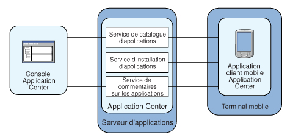

<!-- NLS_CHARSET=UTF-8 -->
## Présentation
{: #overview }
Découvrez {{ site.data.keys.mf_app_center_full }} : ses fonctionnalités, les différents composants et caractéristiques et comment utiliser la console et le client.

La vente d'appareils mobiles dépasse maintenant celle d'ordinateurs personnels. Par conséquent, les applications mobiles deviennent
des enjeux critiques pour les entreprises.  
Application Center est un outil qui facilite le partage des applications mobiles dans une organisation.

Vous pouvez utiliser Application Center comme magasin d'applications d'entreprise. Avec Application Center, vous pouvez cibler certaines applications
mobiles pour des groupes particuliers d'utilisateurs dans l'entreprise.

Une équipe de développement peut également utiliser Application Center au cours de la phase de développement d'une application afin de partager des
applications avec des testeurs, des concepteurs ou des responsables dans l'entreprise. Dans ce scénario, la collaboration entre toutes les personnes impliquées dans le processus de développement est facilitée.

> Vous pouvez également consulter [le tutoriel Application Center](app-center-tutorial).

#### Accéder à
{: #jump-to }
* [Concept Application Center](#concept-of-application-center)
* [Exigences spécifiques de plateforme](#specific-platform-requirements)
* [Architecture générale](#general-architecture)
* [Informations préliminaires](#preliminary-information)
* [Que faire ensuite ?](#whats-next)

## Concept Application Center
{: #concept-of-application-center }
Application Center peut être utilisé comme un magasin d'applications d'entreprise et est un moyen de partager des informations entre les différents membres de l'équipe au sein d'une société.

Le concept Application Center est similaire au concept de l'App Store public d'Apple ou d'Android Market, sauf qu'il vise uniquement l'usage privé au sein d'une société.

En utilisant Application Center, les utilisateurs de la même société ou organisation téléchargent des applications vers des téléphones mobiles ou des tablettes à partir d'un seul emplacement qui sert de référentiel d'applications mobiles.

Application Center cible les applications mobiles qui sont installées sur l'appareil même. Ces applications peuvent être des applications natives qui sont générées à l'aide du SDK de l'appareil ou des applications hybrides qui mélangent du contenu natif et Web. Application Center ne cible pas les applications Web mobiles ; ces applications sont livrées au navigateur Web de l'appareil mobile via une URL comme un site Web.

Dans la version actuelle, Application Center prend en charge les applications créées pour les plateformes Google Android, Apple iOS, Windows Phone 8, Windows 8 et Windows 10.

Pour Windows Phone, seul le format de fichier de module d'application Windows Phone (.xap) est pris en charge actuellement. Nous prenons également en charge le format de fichier de module d'application Windows 10 UWP (.appx). Pour Windows Store (applications de bureau), le format de fichier du module d'application (.appx) est pris en charge.

Windows Phone 7 et Windows RT et BlackBerry OS ne sont pas pris en charge par la version actuelle d'Application Center.

Application Center gère les applications mobiles. Il prend en charge tout type d'applications Android, iOS, Windows Phone 8, Windows 8 ou Windows 10, y compris les applications qui créées sur {{ site.data.keys.product }}.

Vous pouvez utiliser Application Center dans le cadre du processus de développement d'une application. Un scénario type dans Application Center est une équipe qui crée une application mobile. L'équipe de développement crée une version d'une application Android, iOS, Windows Phone, Windows 8 ou Windows 10 UWP. L'équipe de développement souhaite que cette nouvelle version soit examinée et testée par l'équipe étendue. Un développeur accède à la console Application Center et télécharge la nouvelle version de l'application sur Application Center. Dans le cadre de ce processus, le développeur peut entrer une description de la version de l'application. Par exemple, la description peut mentionner les éléments que l'équipe de développement a ajoutés ou corrigés par rapport à la version précédente. La nouvelle version de l'application est alors mise à la disposition des autres membres de l'équipe.

Une autre personne, par exemple un testeur bêta, peut lancer l'application d'installation Application Center, le client mobile, pour localiser cette nouvelle version d'une application mobile dans la liste des applications disponibles et l'installer sur son appareil mobile. Après avoir testé la nouvelle version, le testeur bêta peut évaluer l'application et envoyer des commentaires. Les commentaires sont visibles pour le développeur à partir de la console Application Center.

Application Center est un moyen pratique de partager des applications mobiles au sein d'une société ou d'un groupe ; il s'agit d'un moyen de partager des informations entre les membres d'une équipe.

## Exigences spécifiques de plateforme
{: #specific-platform-requirements }
Différents systèmes d'exploitation imposent des exigences spécifiques pour le déploiement, l'installation ou l'utilisation d'applications sur les appareils mobiles appropriés.

### Android
{: #android }
L'appareil mobile doit être configuré pour l'installation à partir de sources inconnues. La bascule correspondante se trouve dans les paramètres Android. Voir [User Opt-in for apps from unknown sources for details](http://developer.android.com/distribute/open.html#unknown-sources).  

Dans Application Center, les applications ont un numéro de version interne et un numéro de version commerciale. Le numéro de version interne est utilisé pour distinguer la version la plus récente alors que la version commerciale n'est utilisée que comme chaîne d'affichage informative. Pour les applications Android, la version interne est android:[versionCode](http://developer.android.com/guide/topics/manifest/manifest-element.html#vcode) provenant du manifeste d'application et doit être un entier.

### iOS
{: #ios }
Toutes les applications qui sont gérées via Application Center doivent être conditionnées pour la "distribution ad hoc". Avec un compte de développeur iOS, vous pouvez partager votre application avec un maximum de 100 appareils iOS. Avec un compte d'entreprise iOS, vous pouvez partager votre application interne avec un nombre illimité d'appareils iOS. Voir [iOS Developer Program](https://developer.apple.com/programs/ios/distribute.html) et [iOS Enterprise Program](https://developer.apple.com/programs/ios/enterprise/) pour plus de détails.
Dans Application Center, les applications ont un numéro de version interne et un numéro de version commerciale. Le numéro de version interne est utilisé pour distinguer la version la plus récente alors que la version commerciale n'est utilisée que comme chaîne d'affichage informative. Pour les applications iOS, la version interne est le CFBundleVersion du manifeste d'application **Info.plist**. Le numéro de version doit être au format suivant : `a`, ou `a.b`, ou `a.b.c`, où `a`, `b`, `c` sont des entiers non négatifs et `a` n'est pas `0`.

### Windows Phone 8
{: #windows-phone-8 }
Les applications ne sont pas installées à partir de Windows Store, mais à partir d'Application Center, qui agit comme ce que la documentation Microsoft appelle un concentrateur d'entreprise (**Company Hub**). Voir [Company app distribution for Windows Phone](http://msdn.microsoft.com/en-us/library/windowsphone/develop/jj206943%28v=vs.105%29.aspx) pour plus de détails.
Pour utiliser un concentrateur d'entreprise, Windows Phone vous demande d'enregistrer un compte de société auprès de Microsoft et de signer toutes les applications, y compris le client Application Center, avec le certificat de société. Seules les applications signées peuvent être gérées via Application Center.

Vous devez inscrire tous les appareils mobiles à l'aide d'un jeton d'inscription de l'application associé à votre compte de société.

Application Center vous aide à inscrire des appareils par le biais de fonctions pour distribuer le jeton d'inscription de l'application. Pour plus d'informations, voir [Jetons d'inscription d'application dans Windows 8 Universal](appcenter-console/#application-enrollment-tokens-in-windows-8-universal).

Application Center prend en charge la distribution des applications telles que les fichiers de module d'application Windows Phone (.xap) pour Microsoft Windows Phone 8.0 et Microsoft Windows Phone 8.1. Avec Microsoft Windows Phone 8.1, Microsoft a introduit un nouveau format universel sous forme de fichiers de module d'application (.appx) pour Windows Phone. Actuellement, Application Center ne prend pas en charge la distribution de fichiers de module d'applications (.appx) pour Microsoft Windows Phone 8.1, mais est limité aux fichiers de module d'application Windows Phone (.xap) uniquement.

Dans Application Center, les applications ne comportent qu'un seul numéro de version. Le numéro de version est utilisé pour distinguer la version la plus récente. Pour les applications Windows Phone 8, le numéro de version se trouve dans la zone **Version** du fichier **WMAppManifest.xml**. Le numéro de version doit être au format suivant : `a.b.c.d` où `a`, `b`, `c`, `d` sont des entiers non négatifs.

### Windows 8
{: #windows-8 }
Le client mobile Application Center est fourni sous la forme d'un fichier exécutable de bureau normal (.exe). Utilisez-le pour installer sur l'appareil des applications Windows Store, qui sont préparées sous forme de fichiers .appx.
L'installation d'un fichier de type appx sur votre appareil sans utiliser Windows Store s'appelle chargement indépendant (sideloading) d'une application. Pour effectuer un chargement indépendant d'une application, vous devez respecter les prérequis énoncés dans [Prepare to sideload apps](http://technet.microsoft.com/fr-fr/library/dn613842.aspx). La mise à jour de Windows 8.1 simplifie les prérequis pour le chargement indépendant (sideloading). Pour plus d'informations, voir [Sideloading store apps to Windows 8.1 devices](http://blogs.msdn.com/b/micham/archive/2014/05/30/sideloading-store-apps-to-windows-8-1-devices.aspx).

Les fichiers de type .exe ne peuvent pas être exécutés sur des tablettes basées sur ARM ; Application Center ne prend donc pas en charge Windows RT ; seuls Windows 8 et Windows 8.1 sont pris en charge.

L'utilisateur d'appareil nécessite des droits d'administrateur sur l'appareil pour exécuter le client Application Center.

Application Center ne fournit aucun moyen prédéfini de distribuer le client mobile.

Dans Application Center, les applications ne comportent qu'un seul numéro de version. Le numéro de version est utilisé pour distinguer la version la plus récente. Pour les applications Windows 8, le numéro de version se trouve dans la zone Version du fichier AppxManifest.xml. Ce numéro de version doit être au format suivant : a.b.c.d, où a, b, c, d sont des entiers non négatifs.

### Windows 10 UWP
{:  #windows-10-uwp}

Application Center envoie le projet du client Windows 10 UWP pour installer l'application UWP. Vous pouvez ouvrir le projet dans Visual Studio et créer un fichier binaire (par exemple : **.appx**) for distribution. Application Center ne fournit pas de méthode prédéfinie pour distribuer le client mobile.

Dans Application Center, les applications ne comportent qu'un seul numéro de version. Le numéro de version est utilisé pour distinguer la version la plus récente. Pour les applications Windows 10 UWP, le numéro de version se trouve dans la zone _**Version**_ du fichier **Package.appxmanifest**. Ce numéro de version doit être au format suivant : a.b.c.d, où a, b, c, d sont des entiers non négatifs.


## Architecture générale
{: #general-architecture }
Application Center se compose de ces éléments principaux : un composant côté serveur, un référentiel, une console d'administration et une application client mobile.

### Composant côté serveur
{: #server-side-component }
Le composant côté serveur est une application Java™ Enterprise qui doit être déployée sur un serveur d'applications Web tel qu'IBM WebSphere ou Apache Tomcat.

Le composant côté serveur est constitué d'une console d'administration et d'une application mobile. Cette application mobile installe les applications mobiles disponibles pour le composant côté client.

La console Web et l'application d'installation communiquent via les services REST avec le composant serveur.

Plusieurs services composent le composant côté serveur d'Application Center ; par exemple, un service qui répertorie les applications disponibles, un service qui fournit les fichiers binaires d'application à l'appareil mobile ou un service qui enregistre les commentaires et les évaluations.

### Référentiel
{: #repository }
Base de données qui stocke des informations telles que quelle application est installée sur quels appareils, les commentaires en retour sur les applications et les fichiers binaires de l'application mobile. L'application Application Center est associée à la base de données lorsque vous configurez Application Center pour un serveur d'applications Web particulier et une base de données prise en charge.

### Console d'administration
{: #administration-console }
Console Web dans laquelle les administrateurs peuvent gérer les applications, les droits d'accès des utilisateurs pour l'installation d'applications, les commentaires des utilisateurs sur les applications mobiles et des détails sur les applications installées sur des appareils. Voir [Console Application Center](appcenter-console).

### Application de client mobile
{: #mobile-client-application }
Vous utilisez le client mobile pour installer des applications sur un appareil mobile et pour envoyer des commentaires sur une application au serveur. Voir [Client mobile](mobile-client).

La figure suivante présente un aperçu de l'architecture.



À partir de la console Application Center, vous pouvez effectuer les actions suivantes :

* Télécharger différentes versions d'applications mobiles.
* Supprimer les applications indésirables.
* Contrôler l'accès aux applications : chaque application est associée à la liste des personnes qui peuvent installer l'application.
* Afficher les commentaires des utilisateurs de mobiles concernant une application.
* Obtenir des informations sur les applications installées sur un appareil.
* Désactiver une application de sorte qu'elle ne soit pas visible dans les applications disponibles pour le téléchargement.

Dans le client mobile, vous pouvez effectuer les actions suivantes :

* Répertorier les applications mobiles disponibles.
* Installer une nouvelle application sur un appareil.
* Envoyer des commentaires sur une application.

Application Center prend en charge les applications pour les appareils Android, iOS, Windows Phone 8 et Windows 8. Par conséquent, le client mobile est disponible en versions distinctes pour Android, iOS, Windows Phone 8 et Windows 8.

Les clients mobiles Android, iOS et Windows Phone 8 sont générés sur {{ site.data.keys.product }}. Pour savoir comment configurer le composant côté serveur Application Center sur différents serveurs d'applications Java après l'installation du produit et comment générer des applications {{ site.data.keys.product_adj }} pour le client Application Center, reportez-vous à [Configuration Application Center après l'installation](../installation-configuration/production/appcenter).

## Informations préliminaires
{: #preliminary-information }
Pour utiliser Application Center, vous devez configurer les paramètres de sécurité, démarrer le serveur d'applications Web où {{ site.data.keys.product }} est installé, démarrer la console Application Center et vous connecter.

Lorsque vous installez {{ site.data.keys.product }}, Application Center est automatiquement installé sur le serveur d'applications spécifié.

Si vous installez Application Center dans le profil Liberty de WebSphere Application Server, le serveur est créé dans **installation-directory/server**.

Une fois l'installation terminée, vous devez configurer les paramètres de sécurité pour les applications. Consultez [Configuration de l'authentification des utilisateurs pour Application Center](../installation-configuration/production/appcenter#configuring-user-authentication-for-application-center) ou, si vous utilisez l'authentification LDAP, consultez [Gestion des utilisateurs avec LDAP](../installation-configuration/production/appcenter/#managing-users-with-ldap).

### Exemple : démarrage du serveur et de la console Application Center sur le profil Liberty
{: #example-starting-the-server-and-the-application-center-console-on-liberty-profile}

1. Démarrez le serveur Liberty à l'aide de la commande **server** qui se trouve dans le répertoire **installation-directory/server/wlp/bin**.

   ```bash
   server start worklightServer
   ```

2. Lorsque le serveur est en cours d'exécution, démarrez la console Application Center en entrant cette adresse dans votre navigateur : `http://localhost:9080/appcenterconsole/`
3. Connectez-vous. Par défaut, deux utilisateurs sont définis pour l'installation d'Application Center sur le profil Liberty d'Apache Tomcat ou de WebSphere Application Server :
    * **demo** avec le mot de passe **demo**
    * **appcenteradmin** avec le mot de passe **admin**

### Informations complémentaires
{: #for-more-information }
Pour utiliser la console Application Center, reportez-vous à [Console Application Center](appcenter-console).

Pour installer et exécuter le client mobile sur les systèmes d'exploitation suivants, consultez :

* Android : voir [Installation du client sur un appareil mobile Android](mobile-client/#installing-an-application-on-an-android-device).
* Système d'exploitation iOS : voir [Installation du client sur un appareil mobile iOS](mobile-client/#installing-an-application-on-an-ios-device).
* Windows Phone 8 : voir [Installation du client sur Windows 8 Universal](mobile-client/#installing-the-client-on-a-windows-phone-8-universal-mobile-device).
* Windows 8 : le client mobile Windows 8 n'est pas destiné à être déployé dans Application Center pour une distribution ultérieure. Voir [Microsoft Windows 8 : génération du projet](preparations/#microsoft-windows-8-building-the-project).
* Windows 10 UWP : voir [Installation du client Windows 10 UWP sur un appareil Windows 10](mobile-client/#installing-windows-10-uwp-client-on-windows-10-device).

## Que faire ensuite ?
{: #whats-next }
Consultez ces rubriques pour utiliser le client mobile Application Center, envoyer des notifications aux applications installées, en savoir plus sur la console Application Center, l'outil de ligne de commande, le client mobile et le réglage des niveaux de journalisation.
