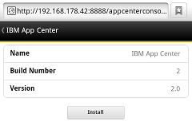
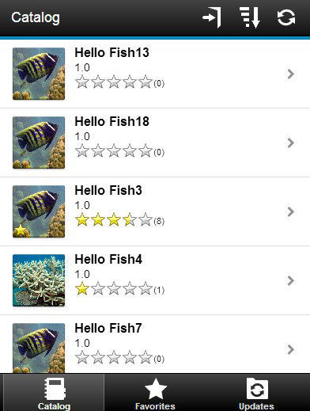
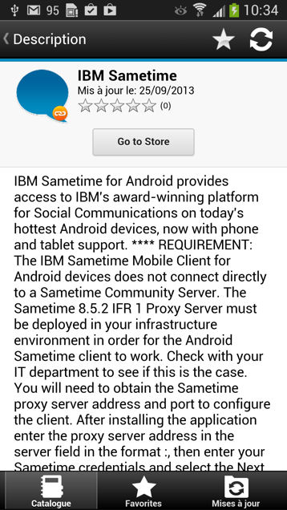

<!-- NLS_CHARSET=UTF-8 -->
## Présentation
{: #overview }
Vous pouvez installer des applications sur votre appareil mobile avec le client mobile Application Center.

Le client mobile Application Center est l'application qui s'exécute sur votre appareil Android, iOS, Windows Phone ou Windows. Seul Windows Phone 8 est pris en charge par la version actuelle d'Application Center. Vous utilisez le client mobile pour répertorier le catalogue d'applications disponibles dans Application Center. Vous pouvez installer ces applications sur votre appareil. Le client mobile est parfois appelé programme d'installation d'Application Center. Cette application doit être présente sur votre appareil si vous souhaitez installer sur votre appareil des applications à partir de votre référentiel d'applications privé.

### Prérequis
{: #prerequisites }
Votre administrateur système doit vous fournir un nom d'utilisateur et un mot de passe pour que vous puissiez télécharger et installer le client mobile. Le nom d'utilisateur et le mot de passe sont requis chaque fois que vous démarrez le client mobile sur votre appareil. Pour les applications Windows Store, le nom d'utilisateur et le mot de passe sont requis pour le client mobile uniquement au moment de l'exécution. Pour des raisons de sécurité, ne diffusez pas ces données d'identification. Ces données d'identification sont identiques à celles utilisées pour se connecter à la console Application Center.

#### Accéder à
{: #jump-to }
* [Installation du client sur un appareil mobile Android](#installing-the-client-on-an-android-mobile-device)
* [Installation du client sur un appareil mobile iOS](#installing-the-client-on-an-ios-mobile-device)
* [Installation du client sur un appareil mobile Windows Phone 8 Universal](#installing-the-client-on-a-windows-phone-8-universal-mobile-device)
* [Installation du client Windows 10 UWP sur un appareil Windows 10](#installing-windows-10-uwp-client-on-windows-10-device)
* [Installation d'une application Windows 10 UWP et ajout de commentaires](#installing-a-windows-10-uwp-application-and-adding-review-comments)
* [Vue de connexion](#the-login-view)
* [Vues dans le client Application Center](#views-in-the-application-center-client)
* [Installation d'une application sur un appareil Android](#installing-an-application-on-an-android-device)
* [Installation d'une application sur un appareil iOS](#installing-an-application-on-an-ios-device)
* [Installation d'une application sur un appareil Windows Phone](#installing-an-application-on-a-windows-phone-device)
* [Installation d'une application Windows Store sur un appareil Windows](#installing-a-windows-store-application-on-a-windows-device)
* [Installation d'applications par le biais de magasins d'applications publics](#installing-applications-through-public-app-stores)
* [Suppression d'une application installée](#removing-an-installed-application)
* [Affichage des détails d'une version d'application spécifique](#showing-details-of-a-specific-application-version)
* [Mise à jour d'une application](#updating-an-application)
* [Mise à niveau automatique du client Application Center](#upgrading-the-application-center-client-automatically)
* [Rétablissement d'une application installée](#reverting-an-installed-application)
* [Marquage ou désélection d'une application favorite](#marking-or-unmarking-a-favorite-app)
* [Soumission d'une revue d'une application installée](#submitting-a-review-for-an-installed-application)
* [Affichage des revues](#viewing-reviews)

## Installation du client sur un appareil mobile Android
{: #installing-the-client-on-an-android-mobile-device }
Vous pouvez installer le client mobile ou toute application signée portant l'indicateur d'installation sur votre appareil mobile Android en saisissant l'URL d'accès dans votre navigateur, en saisissant vos données d'identification et en effectuant les étapes requises.

1. Démarrez le navigateur sur votre appareil mobile.
2. Entrez l'URL d'accès suivante dans la zone de texte de l'adresse : `http://hostname:portnumber/applicationcenter/installers.html`

    Où hostname est l'adresse du serveur et portnumber est le numéro du port où Application Center est installé. Votre administrateur système peut fournir ces informations.

    Application Center fournit également une autre URL pour installer le client sur un appareil mobile : `http://hostname:portnumber/applicationcenter/inst.html`. La page de cette URL fonctionne mieux avec certains navigateurs Web mobiles plus anciens ou non standard. Si la page installers.html ne fonctionne pas sur votre appareil mobile, vous pouvez utiliser inst.html. Cette page est fournie en anglais seulement et n'est pas traduite.

    Si vous tentez d'ouvrir la page avec HTTPS et d'utiliser des certificats auto-signés, les anciens navigateurs Android ne peuvent pas ouvrir cette page. Dans ce cas, vous devez utiliser un certificat non auto-signé ou utiliser un autre navigateur sur l'appareil Android, tel que Firefox, Chrome ou Opera. Dans Android 4 et versions ultérieures, le navigateur Android affiche un avertissement de sécurité concernant le certificat SSL, mais vous permet d'accéder au site Web après confirmation que vous consentez à une connexion non sécurisée.

3. Entrez votre nom d'utilisateur et votre mot de passe. Lorsque votre nom d'utilisateur et votre mot de passe sont validés, la liste des applications d'installation compatibles de votre appareil s'affiche dans le navigateur. Normalement, une seule application, le client mobile, apparaît dans cette liste.

4. Si le serveur Web utilise un certificat d'AC auto-signé, installez le certificat au moins une fois sur l'appareil. L'administrateur Application Center doit fournir le certificat ; voir [Gestion et installation de certificats d'AC auto-signés dans un environnement de test Application Center](../../installation-configuration/production/appcenter/#managing-and-installing-self-signed-ca-certificates-in-an-application-center-test-environment) pour plus de détails.
    * Appuyez sur l'onglet **SSL-Certificate** et sélectionnez le certificat.
    * Appuyez sur **Install**. Vous devez effectuer cette opération une seule fois pour l'appareil. Vous pouvez vérifier si le certificat est installé en accédant à **Settings → Security → Trusted Credentials → User on the device**. Cette vue affiche les certificats SSL que l'utilisateur a installés sur l'appareil. Si le certificat d'AC auto-signé n'est pas installé sur l'appareil, le système d'exploitation Android vous empêche de télécharger le client mobile dans les étapes suivantes.

    Pour que vous puissiez voir le client mobile dans la liste des applications disponibles, l'administrateur Application Center doit installer l'application du client mobile. L'administrateur télécharge le client mobile dans Application Center et définit la propriété **Installer** sur **true**. Voir [Propriétés d'application](../appcenter-console/#application-properties).

    

5. Sélectionnez un élément dans la liste pour afficher les détails de l'application. Généralement, ces informations incluent le nom de l'application et son numéro de version.

    

6. Appuyez sur **Install Now** pour télécharger le client mobile. Sur les nouveaux appareils Android, le système peut demander à Chrome l'accès aux fichiers de support sur l'appareil. Répondez oui. Un avertissement concernant les fichiers potentiellement dangereux peut être affiché. Sélectionnez l'option permettant de conserver le fichier APK.

7. Lancez les applications **Android Download**. Sélectionnez le programme d'installation du client Application Center.
8. Sélectionnez le programme d'installation du client Application Center. Vous pouvez voir l'accès accordé à l'application lorsque vous choisissez de l'installer.

    

9. Sélectionnez **Install** pour installer le client mobile.
10. Lorsque l'application est installée, sélectionnez **Open** pour ouvrir le client mobile ou **Done** pour fermer l'application Downloads.

Le fichier APK peut échouer pour l'une des raisons suivantes :

* L'appareil ne dispose pas de suffisamment de mémoire.
* Le certificat SSL du serveur n'est pas connu de l'appareil.

La première fois que vous installez une application via Downloads, vous pouvez recevoir une demande pour confirmer si Google doit vérifier régulièrement l'activité de l'appareil à des fins de sécurité. Vous pouvez accepter ou refuser Le client Application Center n'est pas affecté par votre choix.

L'installation peut être bloquée pour l'une des raisons suivantes :

* L'appareil ne permet pas l'installation à partir de sources inconnues. Accédez à **Settings → Security** sur l'appareil et activez **Unknown sources (Allow installation from unknown sources)**.
* La même application est déjà installée sur l'appareil, mais elle a été signée par un autre certificat. Dans ce cas, vous devez supprimer l'application avant de l'installer sur l'appareil avec un autre certificat signé.

## Installation du client sur un appareil mobile iOS
{: #installing-the-client-on-an-ios-mobile-device }
Vous pouvez installer le client mobile ou toute application signée portant l'indicateur d'installation sur votre appareil mobile iOS en saisissant l'URL d'accès dans votre navigateur, en saisissant vos données d'identification et en effectuant les étapes requises.

> **Important :** pour installer des applications sur des appareils iOS, vous devez d'abord configurer le serveur Application Center avec SSL. Voir [Configuration de Secure Sockets Layer (SSL)](../../installation-configuration/production/appcenter/#configuring-secure-sockets-layer-ssl).

La propriété JNDI **ibm.appcenter.ios.plist.onetimeurl** des services IBM Application Center contrôle si les URL uniques sont utilisées lorsque le client mobile est installé sur un appareil mobile iOS. Définissez cette propriété sur false pour une sécurité maximale. Lorsque vous définissez cette propriété sur false, les utilisateurs doivent entrer leurs données d'identification plusieurs fois lorsqu'ils installent le client mobile : une fois lorsqu'ils sélectionnent le client et une fois lorsqu'ils installent le client.

Lorsque vous définissez la propriété sur true, les utilisateurs n'entrent leurs données d'identification qu'une seule fois. Une URL de téléchargement temporaire avec un hachage cryptographique est générée lorsque l'utilisateur entre ses données d'identification. Cette URL de téléchargement temporaire est valide pendant 1 heure et ne nécessite aucune authentification supplémentaire. Cette solution est un compromis entre sécurité et ergonomie.

Les étapes pour spécifier la propriété JNDI **ibm.appcenter.ios.plist.onetimeurl** sont similaires à celles de la propriété **ibm.appcenter.proxy.host**. Voir [Définition du noeud final des ressources d'application](../../installation-configuration/production/appcenter/#defining-the-endpoint-of-the-application-resources).

L'installation du client mobile sur un appareil iOS est semblable à une installation sur Android, mais avec quelques différences. Le programme d'installation démarre automatiquement après le téléchargement. Les données d'identification de nom d'utilisateur et de mot de passe sont requises pour presque toutes les étapes d'installation.

1. Démarrez le navigateur sur votre appareil mobile.
2. Entrez l'URL d'accès suivante dans la zone d'adresse : `http://hostname:portnumber/applicationcenter/installers.html`

    Où hostname est l'adresse du serveur et portnumber est le numéro du port où Application Center est installé. Votre administrateur système peut fournir ces informations.

    Application Center fournit également une autre URL pour installer le client sur un appareil mobile : `http://hostname:portnumber/applicationcenter/inst.html`. La page de cette URL fonctionne mieux avec certains navigateurs Web mobiles plus anciens ou non standard. Si la page **installers.html** ne fonctionne pas sur votre appareil mobile, vous pouvez utiliser **inst.html**. Cette page est fournie en anglais seulement et n'est pas traduite.

    Si vous ouvrez la page avec HTTPS et utilisez des certificats auto-signés, le navigateur affiche un avertissement de sécurité concernant le certificat SSL, mais vous pouvez accéder au site Web après confirmation que vous consentez à une connexion non sécurisée.

3. Entrez votre nom d'utilisateur et votre mot de passe. Consultez les [prérequis du client mobile](../preparations).

    Lorsque votre nom d'utilisateur et votre mot de passe sont validés, la liste des applications d'installation compatibles de votre appareil s'affiche dans le navigateur. Normalement, une seule application, le client mobile, apparaît dans cette liste.

    Si vous ouvrez la page avec https :
    * Si le serveur Web utilise un certificat SSL authentifié par une autorité de certification approuvée, passez à l'étape 5.
    * Si le serveur Web utilise un certificat d'AC auto-signé, passez à l'étape 4.

4. Si le serveur Web utilise un certificat d'AC auto-signé, installez le certificat au moins une fois sur l'appareil.

    L'administrateur Application Center fournit le certificat. Voir [Gestion et installation de certificats d'AC auto-signés dans un environnement de test d'Application Center](../../installation-configuration/production/appcenter/#managing-and-installing-self-signed-ca-certificates-in-an-application-center-test-environment) pour plus de détails.

    * Appuyez sur l'onglet SSL-Certificate et sélectionnez le certificat.
    * Appuyez sur Install. Vous n'effectuez cette action qu'une seule fois pour l'appareil. Vous pouvez vérifier si le certificat est installé en accédant à **Settings → General → Profiles on the device**. Cette vue affiche les certificats SSL que l'utilisateur a installés sur l'appareil. Si le certificat d'AC auto-signé n'est pas installé sur l'appareil, le système d'exploitation iOS vous empêche de télécharger le client mobile dans les étapes suivantes.

    Pour que vous puissiez voir le client mobile dans la liste des applications disponibles, l'administrateur Application Center doit installer l'application du client mobile. L'administrateur télécharge le client mobile dans Application Center et définit la propriété Installer sur true. Voir [Propriétés d'application](../appcenter-console/#application-properties).

5. Appuyez sur l'onglet **Installers** et sélectionnez un élément dans la liste pour afficher les détails de l'application.
6. Appuyez sur **Install** pour télécharger le client mobile.
7. Saisissez vos données d'identification pour autoriser la transaction de téléchargement.
8. Pour autoriser le téléchargement, appuyez sur **Install**.

    

9. Entrez vos données d'identification pour autoriser l'installation.
10. Fermez le navigateur.

    L'icône d'application s'affiche sur l'écran d'accueil et vous pouvez surveiller la progression de téléchargement sur cet écran.

> **Remarque :** l'installation d'une application sur un appareil nécessite un profil de mise à disposition qui permet à l'application d'être installée sur l'appareil sélectionné. Si vous essayez accidentellement d'installer une application qui n'est pas valide pour votre appareil, certaines versions d'iOS pourraient tenter d'installer l'application dans une boucle sans fin sans jamais réussir ni indiquer d'erreur. L'icône de l'application qui montre la progression de l'installation apparaît sur l'écran d'accueil, mais, en raison de la boucle sans fin, il est difficile de supprimer cette icône d'application pour arrêter la boucle sans fin. Une solution de contournement consiste à mettre l'appareil en mode Avion. Dans ce mode, la boucle sans fin est arrêtée et vous pouvez supprimer l'icône de l'application en suivant les étapes normales de suppression d'applications sur des appareils iOS.

L'installation peut être bloquée pour l'une des raisons suivantes :

* Le profil de mise à disposition de l'application n'est pas valide pour l'appareil. L'application doit être signée avec un profil de mise à disposition différent.
* L'appareil n'a aucun accès aux serveurs Apple pour confirmer la validité du profil de mise à disposition.
* Le certificat SSL du serveur n'est pas connu de l'appareil.

En général, les applications iOS ne peuvent être installées sur l'appareil que si elles sont signées avec un profil de mise à disposition. Voir [Importation et génération du projet (Android, iOS, Windows Phone)](../preparations/#importing-and-building-the-project-android-ios-windows-phone).

Depuis iOS 9, lorsqu'une application de société est ouverte, selon le type de profil de mise à disposition, un message Untrusted Enterprise Developer peut s'afficher. Ce message explique que le profil de mise à disposition n'est pas encore approuvé sur cet appareil. Dans ce cas, l'application ne s'ouvre pas, sauf si la confiance est établie pour ce profil de mise à disposition. L'établissement de la confiance doit être effectué une seule fois par profil de mise à disposition.

Pour établir la confiance d'un profil de mise à disposition après l'installation de l'application :

#### Jusqu'à iOS 9.1
{: #until-ios-91 }
1. Accédez à **Settings → General → Profiles**. Sous l'en-tête **Enterprise apps**, vous pouvez voir le profil de mise à disposition de l'application.
2. Appuyez sur le profil et confirmez la confiance.

#### A partir d'iOS 9.2
{: #since-ios-92 }
1. Accédez à **Settings → General → Profiles → Device Management or Profiles &amp; Device Management**. Sous l'en-tête **Enterprise apps**, vous pouvez voir le profil de mise à disposition de l'application.
2. Appuyez sur le profil et confirmez la confiance.

Une fois la confiance confirmée, aucune application utilisant ce profil de mise à disposition ne présente le message Untrusted Enterprise Developer. Pour plus d'informations, voir le site Web d'Apple à l'adresse [https://support.apple.com/en-us/HT204460](https://support.apple.com/en-us/HT204460).

## Installation du client sur un appareil mobile Windows Phone 8 Universal
{: #installing-the-client-on-a-windows-phone-8-universal-mobile-device }
Vous pouvez installer le client mobile ou toute application signée portant l'indicateur d'installation sur Windows 8 Universal en saisissant l'URL d'accès dans votre navigateur, en saisissant vos données d'identification et en effectuant les étapes requises. Le compte de société doit être préinstallé sur votre appareil mobile.

Avant d'installer des applications publiées par votre société, vous devez ajouter le compte de la société à votre appareil mobile. Vous devez télécharger un jeton d'inscription de l'application (AET) sur votre appareil Windows Phone. Le jeton AET doit déjà être présent sur {{ site.data.keys.mf_server }}. Il est téléchargé vers {{ site.data.keys.mf_server }} à l'aide de la console Application Center. Voir [Jetons d'inscription d'application dans Windows 8 Universal](../appcenter-console/#application-enrollment-tokens-in-windows-8-universal) pour plus de détails.

1. Démarrez le navigateur sur votre appareil mobile.
2. Entrez l'URL d'accès suivante dans la zone de texte de l'adresse : `http://hostname:portnumber/applicationcenter/installers.html`.

    Où **hostname** est l'adresse du serveur et **portnumber** est le numéro du port où Application Center est installé. Votre administrateur système peut fournir ces informations.

    Application Center fournit également une autre URL pour installer le client sur un appareil mobile : `http://hostname:portnumber/applicationcenter/inst.html`. La page de cette URL fonctionne mieux avec certains navigateurs Web mobiles plus anciens ou non standard. Si la page **installers.html** ne fonctionne pas sur votre appareil mobile, vous pouvez utiliser **inst.html**. Cette page est fournie en anglais seulement et n'est pas traduite.

3. Entrez vos données d'identification pour autoriser l'accès au serveur. Sur la partie inférieure de l'écran, une barre d'outils contient un onglet **Installers** et un onglet **Tokens**.

    

4. Appuyez sur **Tokens** et sélectionnez un jeton d'inscription d'application dans la liste des jetons disponibles pour afficher les détails du jeton.

    

5. Appuyez sur **Add** pour télécharger le jeton d'inscription de l'application.
6. Appuyez sur **Add** pour ajouter le compte de la société.

    

    Windows Phone 8 ne fournit aucun commentaire sur l'ajout du compte de société.

7. Appuyez sur l'icône Retour pour revenir aux détails du jeton d'inscription d'application.
8. Appuyez sur **Installers** et sélectionnez l'application de client mobile dans la liste des applications disponibles. Les détails de l'application sont affichés.
9. Appuyez sur **Install** pour télécharger l'application sélectionnée.

    

10. Appuyez sur **Install** pour installer l'application.

    

    Windows 8 Universal ne fournit aucun commentaires en retour sur l'installation de l'application.

> **Astuce :** lorsque vous installez une application de société sur un appareil, cet appareil doit se connecter au serveur Microsoft pour vérifier la signature de l'application. Parfois, le serveur Microsoft ne répond pas. Dans ce cas, vous pouvez recommencer l'installation quelques minutes plus tard. Reportez-vous à la section Installation d'une application sur un appareil Windows Phone pour connaître les messages d'erreur possibles.

Lorsque l'installation est terminée, l'application de client mobile doit être disponible dans votre liste d'applications dans Windows Phone.

## Installation du client Windows 10 UWP sur un appareil Windows 10
{: #installing-windows-10-uwp-client-on-windows-10-device }

Vous pouvez installer le client mobile ou une application signée avec l'indicateur du programme d'installation sous Windows 10 en entrant l'URL d'accès dans votre navigateur et vos données d'identification et en suivant la procédure requise.

1. Démarrez le navigateur sur votre appareil mobile.

2. Entrez l'URL d'accès ci-dessous dans la zone de texte de l'adresse : `http://hostname:portnumber/applicationcenter/installers.html?os=Windows`. Où `hostname` est l'adresse du serveur et `portnumber` est le numéro du port où Application Center est installé. Votre administrateur système peut fournir ces informations.

    Application Center fournit également une autre URL pour installer le client sur un appareil mobile : `http://hostname:portnumber/applicationcenter/inst.html?os=Windows`. La page de cette URL fonctionne mieux avec certains navigateurs Web mobiles plus anciens ou non standard. Si la page *installers.html* ne fonctionne pas sur votre appareil mobile, vous pouvez utiliser *inst.html*. Cette page est fournie en anglais seulement et n'est pas traduite.

3.  Entrez vos données d'identification pour autoriser l'accès au serveur.

    

4.  Sélectionnez un élément dans la liste des applications disponibles pour afficher les détails d'une application.

    

5.  Appuyez sur **Install** pour télécharger et installer le client mobile.

    

> **Remarque :** Pour répertorier les applications Windows 10 UWP, vous devez transmettre la chaîne de requête `os=Windows`

## Installation d'une application Windows 10 UWP et ajout de commentaires
{:  #installing-a-windows-10-uwp-application-and-adding-review-comments}

1. Connectez-vous à Application Center.

    

2. Sélectionnez l'application à installer dans la liste des applications disponibles dans le catalogue.

    

3. Appuyez sur **Install** pour télécharger et installer l'application.

    

4. Donnez un avis sur l'application en indiquant une notre et en ajoutant des commentaires.

    

## Vue de connexion
{: #the-login-view }
Dans la vue de connexion, vous pouvez accéder aux zones requises pour vous connecter au serveur afin d'afficher la liste des applications disponibles pour votre appareil.  
Utilisez la vue de Connexion pour saisir vos données d'identification afin de vous connecter au serveur d'Application Center pour afficher la liste des applications disponibles pour votre appareil.

La vue de connexion affiche toutes les zones obligatoires d'informations requises pour se connecter au serveur.  
Lorsque l'application est démarrée, la page de connexion s'affiche. Les données d'identification de connexion sont requises pour se connecter au serveur.

Sur les appareils iOS, les données d'identification sont enregistrées dans la chaîne de certificats. Après vous être connecté au serveur d'Application Center, lorsque vous démarrez l'application ultérieurement, la page de connexion ne s'affiche pas et les données d'identification précédentes sont utilisées. Si la connexion échoue, la vue de connexion s'affiche.

#### Nom d'utilisateur et mot de passe
{: #user-name-and-password }
Entrez vos données d'identification pour accéder au serveur. Ils sont identiques aux nom d'utilisateur et mot de passe accordés par votre administrateur système pour le téléchargement et l'installation du client mobile.

#### Adresse du serveur Application Center
{: #application-center-server-address }
L'adresse du serveur Application Center se compose des éléments suivants :

* Nom d'hôte ou adresse IP.
* Port, optionnel si le port par défaut est utilisé.
* Contexte, optionnel si Application Center est installé à la racine du serveur.

Sur un téléphone, une zone est disponible pour chaque partie de l'adresse.

Sur une tablette, une zone unique contenant une adresse d'exemple préformatée s'affiche. Utilisez-la comme modèle pour entrer l'adresse correcte du serveur afin d'éviter les erreurs de formatage. Consultez [Préparatifs pour l'utilisation du client mobile](../preparations) pour des informations sur le préremplissage des parties de l'adresse, ou codez l'adresse et masquez les zones associées.

#### Secure Socket Layer (SSL)
{: #secure-socket-layer-ssl }
Le protocole SSL est obligatoire sur les appareils iOS. Par conséquent, cette option n'est pas affichée dans la vue de connexion.
Sur les autres systèmes d'exploitation pris en charge, sélectionnez SSL afin d'activer le protocole SSL pour les communications sur le réseau. Si vous appuyez à nouveau sur cette zone lorsque SSL est sélectionné, SSL s'éteint.

La sélection SSL est disponible pour les cas où le serveur d'Application Center est configuré pour s'exécuter sur une connexion SSL. La sélection de SSL lorsque le serveur n'est pas configuré pour gérer une couche SSL vous empêche de vous connecter au serveur. Votre administrateur système peut vous indiquer si Application Center s'exécute sur une connexion SSL.

### Connexion au serveur
{: #connecting-to-the-server }
Pour vous connecter au serveur :

1.Entrez votre nom d'utilisateur et votre mot de passe.
2. Entrez l'adresse du serveur d'Application Center.
3. Si votre configuration d'Application Center s'exécute sur le protocole SSL, sélectionnez **SSL**.
4. Appuyez sur **Log in** pour vous connecter au serveur.

Si cette connexion aboutit, le nom d'utilisateur et l'adresse du serveur sont enregistrés pour remplir les zones lorsque vous démarrez le client par la suite.

## Vues dans le client Application Center
{: #views-in-the-application-center-client }
Le client fournit des vues adaptées aux différentes tâches que vous souhaitez effectuer.  
Après une connexion réussie, vous pouvez choisir parmi ces vues.

Utilisez ces vues pour communiquer avec un serveur pour envoyer ou récupérer des informations sur les applications ou pour gérer les applications se trouvant sur votre appareil.

L'écran d'accueil du client Windows 8 affiche jusqu'à six applications dans chaque catégorie. Sur le client Windows 8, si vous souhaitez afficher la liste complète des applications dans une catégorie, cliquez sur le titre de la catégorie.

Voici la description des différentes vues :

* **Catalog**. Cette vue montre les applications qui peuvent être installées sur un appareil.
* **Favorites**. Cette vue affiche la liste des applications que vous avez marquées comme favorites.
* **Updates**. Cette vue affiche toutes les applications que vous avez marquées comme favorites et dont une version ultérieure à celle installée sur l'appareil est disponible dans Application Center, le cas échéant.

Lorsque vous démarrez le client mobile pour la première fois, il ouvre la vue de connexion pour que vous puissiez entrer votre nom d'utilisateur, votre mot de passe et l'adresse du serveur d'Application Center. Ces informations sont obligatoires.

### Affichages sur différents types d'appareil
{: #displays-on-different-device-types }
La présentation des vues est spécifique à l'environnement Android, iOS, Windows Phone ou Windows 8, même si les fonctions courantes que vous pouvez effectuer dans les vues sont les mêmes pour tous les systèmes d'exploitation. Des types d'appareils différents peuvent avoir des affichages de page différents. Sur votre téléphone, une liste s'affiche. Sur une tablette, une grille d'applications est utilisée.

### Fonctions des vues
{: #features-of-the-views }
Sur une tablette Android ou iOS, vous pouvez trier les listes en appuyant sur l'un des critères de tri.  
Sur un téléphone Windows Phone, Android ou iOS, les critères de tri sont disponibles via le bouton de tri.  
Sur le client Windows 8, vous pouvez trier la liste des applications dans une catégorie. Pour trier les applications, faites un choix dans la liste des critères de tri de la zone **Sort By**.

Les applications marquées comme favorites sont indiquées par une étoile qui est superposée sur l'icône de l'application.

L'évaluation moyenne de la dernière version d'une application est affichée à l'aide d'un nombre d'étoiles et du nombre d'évaluations reçues. Consultez [Préparatifs pour l'utilisation du client mobile](../preparations) pour savoir comment afficher l'évaluation de toutes les versions de l'application au lieu de la dernière version uniquement.

Appuyez sur une application dans la liste pour ouvrir la vue Details de la dernière version installée de cette application.

Pour actualiser la vue, appuyez sur le bouton d'actualisation :  ou, sur Windows 8, .

Pour revenir à la page de connexion :

* Dans les applications Android, iOS et Windows Phone, appuyez sur le bouton de déconnexion : 
* Dans la version Windows 8 du client, appuyez sur le bouton de déconnexion : 

### Vue de détails
{: #the-details-view }
La sélection d'une application dans la vue Catalog, Favorites ou Updates ouvre la vue Details où vous pouvez voir les détails des propriétés de l'application. Les détails de la version de l'application s'affichent dans cette vue.

Sur les clients Android, iOS et Windows Phone, les détails suivants de la version de l'application s'affichent :

* Nom de l'application.
* Version commerciale : version publiée de l'application.
* Version interne : sur Android, l'identification de la version interne de l'application ; sur iOS, le numéro de génération de l'application. Consultez [Propriétés d'application](../appcenter-console/#application-properties) pour plus de détails techniques sur cette propriété sur tous les systèmes d'exploitation.
* Date de mise à jour.
* Taille approximative du fichier d'application.
* Evaluation de la version et nombre d'évaluations reçues.
* Description de l'application.

Sur le client Windows 8, les détails suivants de la version de l'application sont affichés :

* Nom d'application.
* Version.
* Nom du fournisseur.
* Date de mise à jour.
* Evaluation de la version et nombre d'évaluations reçues.
* Revues existantes de la version actuelle ou de toutes les versions de l'application en cours.

Vous pouvez effectuer les actions suivantes dans cette vue.

* Installer, mettre à niveau, rétromigrer ou désinstaller une version d'application.
* Annuler l'opération en cours (si disponible).
* Évaluer la version de l'application si elle est installée sur l'appareil.
* Répertorier les revues de cette version ou de toutes les versions de l'application.
* Afficher les détails d'une version précédente.
* Sélectionner ou désélectionner l'application comme application favorite.
* Actualiser la vue avec les dernières modifications du serveur d'Application Center.

## Installation d'une application sur un appareil Android
{: #installing-an-application-on-an-android-device }
Dans la vue **Details**, vous pouvez installer une application sur votre appareil Android.  
Dans la vue Details, si une version précédente de l'application n'est pas installée, vous pouvez installer cette version de l'application sur votre appareil Android.

1. Dans la vue **Details**, appuyez sur **Install**.

    L'application est téléchargée. Vous pouvez appuyer sur **Cancel** dans la vue **Details** à tout moment pendant le téléchargement pour annuler le téléchargement. (Le bouton **Cancel** n'apparaît que pendant les étapes d'installation.) Si vous laissez le téléchargement se terminer, vous verrez les droits qui sont accordés à l'application.

    

2. Appuyez sur **Install** pour confirmer l'installation de l'application ou sur **Cancel** pour annuler l'installation.

    Selon l'action effectuée, l'application est installée ou non. Lorsque l'application est installée, elle est également marquée comme application favorite.

    Si vous avez sélectionné **Cancel**, dans le panneau de confirmation des droits d'application, vous pouvez appuyer sur **Cancel** dans la vue **Details** à tout moment pour informer l'application que l'installation a été annulée. Le bouton **Cancel** apparaît dans la vue Details uniquement pendant les étapes d'installation.

## Installation d'une application sur un appareil iOS
{: #installing-an-application-on-an-ios-device }
Dans la vue **Details**, vous pouvez installer une version d'application sur votre appareil mobile iOS.

> **Important :** pour installer des applications sur des appareils iOS, vous devez d'abord configurer le serveur Application Center avec SSL. Voir [Configuration de Secure Sockets Layer (SSL)](../../installation-configuration/production/appcenter/#configuring-secure-sockets-layer-ssl).

1. Dans la vue **Details**, appuyez sur **Install**. Vous êtes invité à confirmer le téléchargement et l'installation de la version de l'application.
2. Appuyez sur **Install** pour confirmer le téléchargement et l'installation de la version de l'application ou sur **Cancel** pour annuler l'installation.

    

    Selon l'action effectuée, l'application est installée ou non. Lorsque l'application est installée, elle est également marquée comme application favorite.

    L'installation d'une application sur un appareil nécessite un profil de mise à disposition qui permet à l'application d'être installée sur l'appareil sélectionné. Si vous tentez accidentellement d'installer une application qui n'est pas valide pour votre appareil, IOS 6 (obsolète) ou une version antérieure émet un message d'erreur.

Contrairement au client Android, une fois l'installation terminée, le libellé du bouton **Install** de la vue **Details** ne devient pas **Uninstall**. iOS ne contient pas de bouton **Uninstall**. Il est seulement possible de désinstaller des applications via l'écran d'accueil.

Certaines versions d'iOS 7 peuvent tenter d'installer l'application dans une boucle sans fin sans jamais réussir ni indiquer d'erreur. L'icône de l'application qui montre la progression de l'installation apparaît sur l'écran d'accueil, mais, en raison de la boucle sans fin, il est difficile de supprimer cette icône d'application pour arrêter la boucle sans fin. Une solution de contournement consiste à mettre l'appareil en mode Avion. Dans ce mode, la boucle sans fin est arrêtée et vous pouvez supprimer l'icône de l'application en suivant les étapes normales de suppression d'applications sur des appareils iOS.

Une fois l'application installée sur l'appareil, vous pouvez l'ouvrir.

En général, les applications iOS ne peuvent être installées sur l'appareil que si elles sont signées avec un profil de mise à disposition. Voir [Importation et génération du projet (Android, iOS, Windows Phone)](../preparations/#importing-and-building-the-project-android-ios-windows-phone).

Depuis iOS 9, lorsqu'une application de société est ouverte, selon le type de profil de mise à disposition, un message Untrusted Enterprise Developer peut s'afficher. Ce message explique que le profil de mise à disposition n'est pas encore approuvé sur cet appareil. Dans ce cas, l'application ne s'ouvre pas, sauf si la confiance est établie pour ce profil de mise à disposition. L'établissement de la confiance doit être effectué une seule fois par profil de mise à disposition.

Pour établir la confiance d'un profil de mise à disposition après l'installation de l'application :

#### Jusqu'à iOS 9.1
{: #until-ios-91-app }
1. Accédez à **Settings → General → Profiles**. Sous l'en-tête **Enterprise apps**, vous pouvez voir le profil de mise à disposition de l'application.
2. Appuyez sur le profil et confirmez la confiance.

#### A partir d'iOS 9.2
{: #since-ios-92-app }
1. Accédez à **Settings → General → Profiles → Device Management or Profiles &amp; Device Management**. Sous l'en-tête **Enterprise apps**, vous pouvez voir le profil de mise à disposition de l'application.
2. Appuyez sur le profil et confirmez la confiance.

Une fois la confiance confirmée, aucune application utilisant ce profil de mise à disposition ne présente le message Untrusted Enterprise Developer. Pour plus d'informations, voir le site Web d'Apple à l'adresse [https://support.apple.com/en-us/HT204460](https://support.apple.com/en-us/HT204460).

## Installation d'une application sur un appareil Windows Phone
{: #installing-an-application-on-a-windows-phone-device }
Dans la vue **Details**, vous pouvez installer une application de société sur votre appareil Windows Phone.  
La vue **Details** de l'application sélectionnée affiche des informations sur l'application que vous souhaitez installer.

1. Dans la vue **Details**, appuyez sur **Install**. L'application est téléchargée et installée. Vous pouvez appuyer sur **Cancel** à tout moment pendant le téléchargement de l'application pour annuler l'activité. Le bouton **Cancel** apparaît uniquement pendant l'étape de téléchargement du processus d'installation.

    Au début du processus d'installation, vous êtes invité à confirmer si vous souhaitez ajouter l'application de la société aux applications installées sur votre appareil mobile.

2. Appuyez sur **Install** pour confirmer l'installation de l'application ou sur **Cancel** pour annuler l'installation. L'application est marquée comme une application favorite.

    

> **Astuce :** lorsque vous installez une application de société sur un appareil, cet appareil doit se connecter au serveur Microsoft pour vérifier la signature de l'application. Parfois, le serveur Microsoft ne répond pas. Dans ce cas, vous pouvez recommencer l'installation quelques minutes plus tard.

Les messages d'erreur possibles sont :

* **Il y a un problème avec cette application de société. Contactez l'assistance technique de votre société pour obtenir de l'aide.**

    Vous utilisez probablement un fichier de module d'application Windows Phone (.xap) non signé. Vous devez signer des fichiers de module d'application (.xap) avant de les utiliser dans Application Center. Ce message peut également se produire si le serveur Microsoft ne répond pas et la signature de l'application de société ne peut pas être validée. Dans ce cas, retentez l'installation quelques minutes plus tard.

* **Avant d'installer cette application, vous devez ajouter ... compte de société.**

    Le fichier de module d'application Windows Phone (.xap) est signé, mais l'appareil n'est pas inscrit pour les applications de société. Vous devez d'abord installer sur l'appareil le jeton d'inscription de l'application de la société.

* **Nous n'avons pas pu contacter le compte de société pour vérifier que vous pouvez installer cette application. ...**

    Soit le compte de société est arrivé à expiration ou bloqué, soit le serveur Microsoft ne répond pas temporairement. Assurez-vous que votre appareil est connecté à Internet et au serveur Microsoft, puis réessayez.

> **Remarque :** si un appareil est enregistré sur plusieurs comptes de société, le système d'exploitation Windows Phone peut afficher un compte de société incorrect dans le message **Would you like to install application from company name?**. Ce message est hors du contrôle d'Application Center. Cette situation est un problème d'affichage uniquement et n'affecte pas la fonctionnalité.

Selon l'action effectuée, l'application est installée ou non.

> **Astuce :** le processus d'installation ne fonctionne pas si le certificat PFX utilisé pour signer dans le code le fichier de module d'application (.xap) de l'application que vous souhaitez installer est périmé. Le système d'exploitation Windows Phone renvoie une erreur avec **HRESULT 0x81030110**. Lorsque vous renouvelez votre certificat PFX, vous devez à nouveau signer dans le code avec ce nouveau certificat toutes les applications déployées dans votre catalogue Application Center.
>
Lorsque vous renouvelez votre certificat PFX de signature dans le code, vous devez également renouveler le jeton d'inscription et le déployer sur la console Application Center. Les appareils doivent également être réinscrits dans le compte de la société avec ce nouveau jeton. Les utilisateurs d'appareils inscrits avec un jeton expiré ne peuvent pas installer d'applications.

Dans Windows Phone 8.1, si le client Application Center n'est pas signé dans le code (par exemple, lorsque vous le déboguez dans Visual Studio), vous ne pouvez pas installer d'application en utilisant ce client non signé. Dans ce cas, le système d'exploitation Windows Phone renvoie une erreur avec **HRESULT 0x800703F0**. Avant d'installer des applications dans Windows Phone 8.1, vous devez signer dans le code le fichier de module d'application (.xap) du client.

## Installation d'une application Windows Store sur un appareil Windows
{: #installing-a-windows-store-application-on-a-windows-device }
Utilisez le chargement indépendant (sideloading) pour installer des applications Windows Store via Application Center.

Vous devez vérifier que votre configuration satisfait aux conditions préalables de chargement indépendant (sideloading) d'application, décrites dans la page Prepare to Sideload Apps.  
L'utilisateur d'appareil nécessite des droits d'administrateur sur l'appareil pour exécuter le client Application Center.

L'installation des modules APPX via Application Center se fait par un processus appelé chargement indépendant (sideloading). Dans le cadre de la mise à jour de Windows 8.1, le chargement indépendant (sideloading) est activé pour tous les appareils Windows 8.1 Pro qui font partie d'un domaine Active Directory, ce qui correspond au comportement actuel de Windows 8.1 Enterprise. Si vous utilisez l'une de ces versions de produit et que l'appareil fait partie d'un domaine Active Directory, ne vous préoccupez pas des clés de chargement indépendant (sideloading) ou de l'activation de chargement indépendant (sideloading).

Lorsque vous développez une application Windows Store, Microsoft Visual Studio génère automatiquement un certificat auto-signé et l'utilise pour signer dans le code le module d'application. Pour pouvoir installer l'application ultérieurement à l'aide d'Application Center, vous devez importer ce certificat dans le magasin "Trusted Root Certification Authorities" de la "machine locale". L'importation du certificat est une procédure manuelle.

> **Remarque :** l'installation manuelle d'un certificat n'est requise que pour la phase de développement, car la signature dans le code APPX repose sur un certificat auto-signé généré par Microsoft Visual Studio. En production, votre fichier APPX doit être signé par un certificat authentique acheté auprès d'une autorité de certification racine reconnue.

La première étape de cette procédure vous indique comment installer le certificat avant d'installer l'application via Application Center.

1. Importez ce certificat dans le magasin "Trusted Root Certification Authorities" de la "machine locale".
    * Après avoir généré un fichier APPX à l'aide de Visual Studio, placez ce fichier dans votre système de fichiers. Dans le dossier du fichier APPX, vous pouvez voir un fichier de certificat (.cer) contenant le certificat auto-signé que vous devez importer.
    
    * Pour ouvrir le certificat, cliquez deux fois sur le fichier CER.
    * Cliquez sur l'option d'installation d'un certificat.
        
    * Sélectionnez "Local Machine" et cliquez sur **Next**.
        
    * Sélectionnez "Place all certificate in the following store" puis parcourez pour sélectionner "Trusted Root Certification Authorities".
        
    * Cliquez sur **Next**, puis sur **Finish**. L'importation réussie du certificat doit être confirmée.

Les étapes suivantes décrivent comment effectuer l'installation d'une application Windows Store sur un appareil Windows à l'aide d'Application Center.

1. Connectez-vous au client mobile Application Center pour les applications Windows Store.
2. Sélectionnez l'application que vous souhaitez installer pour accéder à ses détails.

    

3. Pour installer l'application, appuyez sur **Install**. Si l'application est déjà installée et que d'autres versions sont disponibles, vous pouvez décider de mettre à jour vers une version ultérieure ou de revenir à une version précédente.

## Installation d'applications par le biais de magasins d'applications publics
{: #installing-applications-through-public-app-stores }
Vous pouvez vous connecter à partir du client mobile à des applications stockées dans des magasins d'applications publics pris en charge et installer ces applications sur votre appareil compatible en suivant la procédure normale du magasin d'applications public.

L'administrateur d'Application Center peut créer des liens vers des applications sélectionnées stockées dans des magasins d'applications publics pris en charge et les mettre à la disposition des utilisateurs du client mobile d'Application Center sur les systèmes d'exploitation qui correspondent à ces applications. Voir [Ajout d'une application à partir d'un magasin d'applications public](../appcenter-console/#adding-an-application-from-a-public-app-store). Vous pouvez installer ces applications via le client mobile sur votre appareil compatible.

Les liens vers des applications Android stockées dans Google Play et vers des applications iOS stockées dans Apple iTunes sont répertoriés dans la liste des applications de l'appareil avec les fichiers binaires des applications privées créées dans votre société.

1. Sélectionnez une application stockée dans un magasin d'applications public dans la liste des applications pour afficher les détails de l'application. Au lieu de l'option Install, vous voyez l'option Go to Store.
2. Appuyez sur **Go to Store** pour ouvrir Google Play ou Apple iTunes.

    **Android**
    

    **iOS**
    

3. Suivez la procédure habituelle du magasin d'applications public pour installer l'application.

## Suppression d'une application installée
{: #removing-an-installed-application }
Vous pouvez supprimer une application installée sur votre appareil mobile.

1. Démarrez la procédure de suppression valide pour le système d'exploitation de votre appareil.
    * **Android** : reportez-vous à la procédure de l'étape 2.
    * **iOS** : vous pouvez supprimer des applications uniquement à partir de l'écran d'accueil d'iOS, et non via le client Application Center. Utilisez la procédure iOS normale pour supprimer une application.
    * **Windows Phone** : vous pouvez supprimer des applications uniquement à partir de l'écran d'accueil de Windows Phone, et non via le client Application Center. Utilisez la procédure Windows Phone normale pour supprimer une application.
    * **Windows Store** : vous pouvez supprimer des applications du client mobile Application Center ou de l'écran d'accueil de Windows.
2. **Android uniquement** : supprimer une application d'un appareil Android.
    * Dans la vue **Details** d'une version de l'application, appuyez sur **Uninstall**. Le bouton **Uninstall** apparaît dans la vue **Details** uniquement lorsqu'une version de l'application est installée. Vous devez confirmer la désinstallation de la version de l'application.
        * Appuyez sur **Uninstall** pour désinstaller la version de l'application ou sur **Cancel** pour notifier l'application que la commande de désinstallation a été annulée.

## Affichage des détails d'une version d'application spécifique
{: #showing-details-of-a-specific-application-version }
Vous pouvez afficher les détails de la version sélectionnée d'une application en suivant la procédure appropriée pour un téléphone ou une tablette Android ou iOS, un appareil Windows Phone ou un appareil Windows.

1. Affichez les détails d'une version d'application spécifique sur un appareil mobile en sélectionnant la procédure appropriée pour votre appareil.
    * Téléphone Windows Phone, Android ou iOS : voir l'étape 2.
    * Appareil Windows : voir l'étape 3.
    * Tablette : voir l'étape 4.
2. **Windows Phone, Android, iOS uniquement** : affichez les détails d'une version d'application spécifique sur un téléphone Windows Phone, Android ou iOS.
    * Appuyez sur **Select a version** pour accéder à la vue de la liste des versions.
    
    * Appuyez sur la version appropriée de l'application. La vue **Details** est mise à jour et affiche les détails de la version de l'application sélectionnée.
3. Windows uniquement : affichez les détails d'une version d'application Windows Store spécifique sur un appareil Windows. Si plusieurs versions sont disponibles pour l'application Windows Store, vous pouvez sélectionner la version que vous souhaitez installer.
    * Appuyez sur la version appropriée de l'application. La vue **Details** est mise à jour et affiche les détails de la version de l'application sélectionnée.
4. Tablettes uniquement : affichez les détails d'une version d'application spécifique sur une tablette.
    * Appuyez sur **Select version**.
    * Dans le menu, sélectionnez la version appropriée de l'application. La vue **Details** est mise à jour et affiche les détails de la version de l'application sélectionnée.

## Mise à jour d'une application
{: #updating-an-application }
Suivez cette procédure pour que les dernières versions des applications favorites et recommandées soient disponibles sur votre appareil. Les applications marquées comme favorites et ayant une version mise à jour sont répertoriées dans la vue **Updates**. Les applications marquées comme recommandées par l'administrateur du serveur d'Application Center sont également répertoriées dans la vue **Updates**, même si elles ne sont pas des favorites.

Si une version plus récente d'une application installée est disponible sur le serveur, elle est répertoriée sous **Update or Recommended**.

1. Dans la vue **Updates**, accédez à la vue **Details**.
2. Dans la vue **Details**, sélectionnez une nouvelle version de l'application ou utilisez la dernière version disponible.
3. **Android et Windows 8 Universal** : sur les appareils Android et Windows 8 Universal, appuyez sur **Update**.
4. **iOS uniquement** : sur les appareils iOS, appuyez sur **Install latest**.
5. Suivez la procédure d'installation de l'application appropriée.
    * [Installation d'une application sur un appareil Android](#installing-an-application-on-an-android-device)
    * [Installation d'une application sur un appareil iOS](#installing-an-application-on-an-ios-device)
    * [Installation d'une application sur un appareil Windows Phone](#installing-an-application-on-a-windows-phone-device)
    * [Installation d'une application Windows Store sur un appareil Windows](#installing-a-windows-store-application-on-a-windows-device)

## Mise à niveau automatique du client Application Center
{: #upgrading-the-application-center-client-automatically }
Vous pouvez activer la détection automatique de nouvelles versions de l'application client. Ensuite, vous pouvez choisir de télécharger ou d'installer la nouvelle version sur votre appareil mobile. Cette fonctionnalité est prise en charge pour iOS, Android et Windows Phone.

Les nouvelles versions de l'application client mobile disponibles sur le serveur d'Application Center peuvent être détectées automatiquement. Lorsque cette fonctionnalité est activée, une version plus récente de l'application, si elle existe, peut être détectée au démarrage ou chaque fois que la vue Available applications est actualisée.

Si une version ultérieure de l'application est détectée, il vous est demandé de télécharger et d'installer la version ultérieure.

La mise à niveau automatique de l'application client d'Application Center est activée par défaut avec la propriété **appCenterAutoUpgrade** définie sur **true**. Cette propriété se trouve dans le projet {{ site.data.keys.product_full }} d'Application Center : **IBMAppCenter/apps/AppCenter/common/js/appcenter/config.json**.

Si vous souhaitez désactiver la mise à niveau automatique, vous devez définir cette propriété sur false et régénérer le projet pour les plateformes requises.

1. Lorsqu'une version ultérieure du client est détectée, appuyez sur **OK** pour lancer la séquence de téléchargement et d'installation.

    

2. Appuyez sur **Install** pour installer la version ultérieure de l'application.

    

3. Appuyez sur **Open** pour démarrer l'application mise à jour.

    

Vous devez vous connecter à la version mise à jour de l'application pour l'exécuter.

**Remarque :** pour mettre à niveau le client Application Center, les conditions suivantes s'appliquent :

1. Le nouveau client Application Center doit utiliser le même nom de module ou d'identificateur de bundle que l'ancien client.
2. Sur iOS, le nouveau client Application Center doit être signé avec le même profil de mise à disposition que l'ancien client.
3. Sur Android, le nouveau client Application Center doit avoir la même signature que l'ancien client.
4. Sous Windows Phone, le nouveau client Application Center doit être signé avec le même compte de société que l'ancien client.

## Rétablissement d'une application installée
{: #reverting-an-installed-application }
Vous pouvez rétablir la version d'une application installée si une version antérieure existe sur le serveur.

Pour remplacer la version actuellement installée d'une application par une version antérieure, dans la vue **Catalog**, **Updates** ou **Favorites**, accédez à la vue Details. Dans la vue **Details**, sélectionnez une version antérieure. Voir [Affichage des détails d'une version d'application spécifique](#showing-details-of-a-specific-application-version) pour des informations sur l'affichage des détails d'une version d'application spécifique sur un appareil mobile.

### Sur Android
{: #on-android }
Si la version installée du système d'exploitation Android est antérieure à 4.2.2, appuyez sur **Revert**.  
Si la version installée du système d'exploitation Android est 4.2.2 ou ultérieure, vous devez désinstaller la version actuelle avant d'installer la version antérieure.

Suivez ensuite la procédure décrite dans [Installation d'une application sur un appareil Android](#installing-an-application-on-an-android-device).

### Sous iOS
{: #on-ios }
Utilisez la procédure normale du système d'exploitation pour supprimer l'application.  
Appuyez sur **Install** pour installer la version antérieure de l'application. Suivez la procédure décrite dans [Installation d'une application sur un appareil iOS](#installing-an-application-on-an-ios-device).

### Sous Windows Phone
{: #on-windows-phone }
Appuyez sur **Revert**. Suivez la procédure décrite dans [Installation d'une application sur un appareil Windows Phone ](#installing-an-application-on-a-windows-phone-device).

## Marquage ou désélection d'une application favorite
{: #marking-or-unmarking-a-favorite-app }
Marquez vos applications préférées ou désélectionnez une application pour la supprimer de la liste des favoris.

Une application marquée comme favorite sur votre appareil indique que cette application vous intéresse. Cette application est ensuite répertoriée dans la liste des applications favorites pour faciliter sa localisation. Cette application est affichée sur chaque appareil qui vous appartient et qui est compatible avec l'application. Si une version ultérieure de l'application est disponible dans Application Center, l'application est répertoriée dans la vue **Updates**.

Pour marquer ou désélectionner une application comme application favorite, appuyez sur l'icône Favorites  dans l'en-tête de la vue **Details**.  

Une application installée est automatiquement marquée comme application favorite.

## Soumission d'une revue d'une application installée
{: #submitting-a-review-for-an-installed-application }
Vous pouvez noter une version d'application installée sur votre appareil mobile ; la revue doit inclure une évaluation et un commentaire. Vous ne pouvez soumettre une revue d'une version d'application que si cette version est installée sur votre appareil mobile.

1. Dans la vue **Details**, commencez votre revue.
    * Sur les téléphones et tablettes iOS, appuyez sur **Review version X**.
    * Sur les téléphones et tablettes Android, appuyez sur **Review version X**.
2. Entrez un nombre d'étoiles non nul.

    Sur les appareils mobiles dotés d'écrans tactiles, appuyez sur 1 à 5 étoiles pour représenter votre évaluation d'approbation de la version de l'application. Une étoile représente le plus faible niveau d'appréciation et cinq étoiles représentent le plus haut niveau d'appréciation.

3. Entrez un commentaire sur cette version de l'application.
4. Appuyez sur **Submit** pour envoyer votre commentaire à Application Center.

## Affichage des revues
{: #viewing-reviews }
Vous pouvez consulter les revues d'une version spécifique d'une application ou de toutes les versions d'une application.  

Les revues sont affichées en ordre décroissant à partir de la revue la plus récente. Si le nombre de revues remplit plusieurs écrans, appuyez sur **Load more** pour afficher d'autres revues. Sur les appareils Android, iOS et Windows Phone, les détails de la revue sont visibles dans la liste.

### Affichage des revues d'une version spécifique
{: #viewing-reviews-of-a-specific-version }
La vue **Details** affiche toujours les détails d'une version spécifique. Sur un téléphone, les révisions concernent cette version.  
Dans la vue **Details** d'une version d'application :

* Sur un téléphone Windows Phone, Android ou iOS, appuyez sur **View Reviews** pour accéder à la vue des revues.
* Sur une tablette, appuyez sur **Reviews** xx, où xx est la version affichée de l'application.

### Affichage des revues de toutes les versions d'une application
{: #viewing-reviews-of-all-versions-of-an-application }
Dans la vue **Details** d'une version d'application :

* Sur un téléphone Windows Phone, Android ou iOS, appuyez sur **View Reviews** pour accéder à la vue **Reviews**. Appuyez ensuite sur l'icône des paramètres. Appuyez sur **All versions** et confirmez la sélection.
* Sur une tablette, appuyez sur **All Reviews**.
