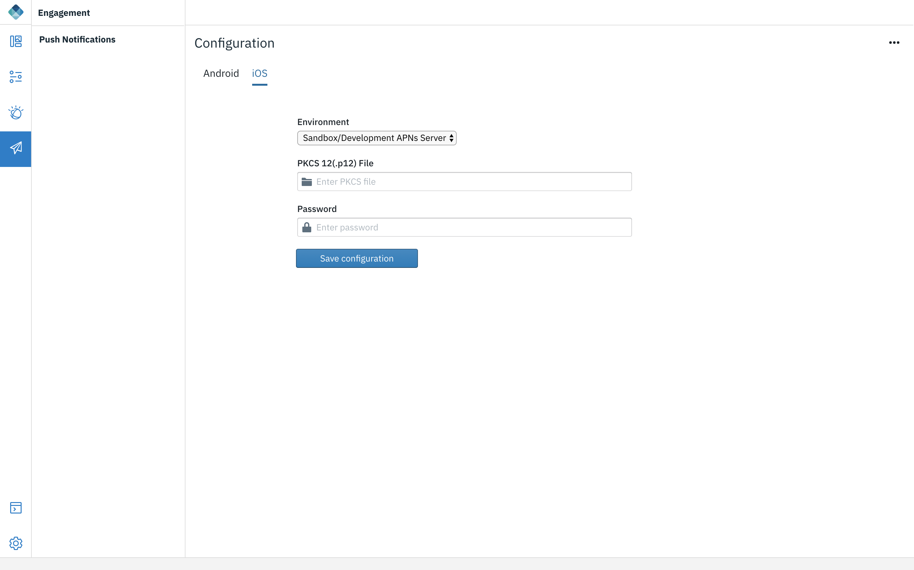

<!-- NLS_CHARSET=UTF-8 -->
## Présentation
{: #digital-app-builder-interface }

L'interface de Digital App Builder se compose des éléments suivants dans le panneau de navigation de gauche :

* **Plan de travail** : affiche ou masque les détails des pages.
* **Données** : vous aide à ajouter un jeu de données en se connectant à une source de données existante ou à créer une source de données pour un microservice à l'aide d'un document OpenAPI. 
* **Watson** : comprend les composants Reconnaissance d'image et Agent conversationnel (Watson Assistant) pour la configuration d'une instance existante ou la création d'une nouvelle instance. 
* **Engagement** : augmentez l'engagement de vos utilisateurs pour l'application en ajoutant des services de notifications push.
* **Console** : affiche la console qui permet de visualiser les activités et le code pour chaque composant. 
* **Paramètres** : affiche les Détails de l'application, les informations sur le Serveur, les Plug-in et les paramètres Réparer le projet (comme Régénérer les dépendances, Régénérer les plateformes, Réinitialiser les données d'identification IBM Cloud).

### Plan de travail
{: #workbench }

Le plan de travail vous aide à concevoir les pages. Il est composé de trois zones de travail :

1. **Pages/Contrôles** : Cette zone affiche le nom des pages créées par défaut. Utilisez le signe **+** pour créer une page. Cliquez sur l'icône **Contrôles** pour afficher les contrôles qui vous permettent d'ajouter une fonctionnalité à une page dans une application. Vous pouvez faire glisser et déposer les contrôles à partir de la palette Contrôles vers le canevas d'une page. Chaque contrôle dispose d'un jeu de propriétés et d'actions.

    Voici la liste des contrôles disponibles :
    * **De base** : vous pouvez faire glisser et déposer ces contrôles de base (Bouton, En-tête, Image et Etiquette) dans le canevas et configurer les propriétés et les actions.

        

        * **Bouton** : les boutons ont une propriété d'étiquetage. L'onglet Action vous permet d'indiquer la page à laquelle l'utilisateur accède lorsqu'il clique sur le bouton.
        * **En-tête** : vous permet d'ajouter un texte d'en-tête à l'application, comme un titre de page.
        * **Image** : vous permet de transférer une image locale ou d'indiquer l'URL d'une image.
        * **Etiquette** : vous permet d'ajouter du texte statique au corps de page. 
    * **Lié aux données** : vous permet de vous connecter à un jeu de données et d'agir sur les entités de ce dernier. Comprend deux composants : **Liste** et **Etiquette connectée**

        

        * **Liste** : créez une page, puis faites glisser et déposez le composant Liste. Ajoutez le **Titre de la liste**, choisissez le type de liste, ajoutez du contenu et sélectionnez le jeu de données à utiliser.

    * **Connexion** : comprend le contrôle **Formulaire de connexion**. Faites glisser et déposez le formulaire de connexion sur la page.
 
        Le contrôle Formulaire de connexion vous permet de créer une page de connexion afin que votre application connecte l'utilisateur au serveur Mobile Foundation. Le serveur Mobile Foundation fournit une infrastructure de sécurité pour authentifier les utilisateurs et offre ce contexte de sécurité pour accéder aux jeux de données. Pour plus d'informations, cliquez [ici](https://mobilefirstplatform.ibmcloud.com/tutorials/en/foundation/8.0/authentication-and-security/creating-a-security-check/).

        

        Pour activer le formulaire de connexion, procédez comme suit :

        1. Apportez les modifications suivantes au serveur Mobile Foundation :
            * Déployez un adaptateur de contrôle de sécurité qui admet le nom d'utilisateur et le mot de passe en entrée. Vous pouvez utiliser l'adaptateur exemple fourni [ici](https://github.com/MobileFirst-Platform-Developer-Center/SecurityCheckAdapters/tree/release80).
            * Dans mfpconsole, accédez à l'onglet de sécurité de l'application sous les portées d'application obligatoires et ajoutez la définition de sécurité créée ci-dessus en tant qu'élément de portée.
        2. Effectuez la configuration suivante dans votre application avec le générateur.
            * Ajoutez le contrôle **Formulaire de connexion** à une page du canevas.
            * Sur l'onglet **Propriétés**, indiquez le **Nom du contrôle de sécurité** et la page d'arrivée **A la réussite de la connexion**.
            * Exécutez l'application.
    * **IA** : vous permet d'ajouter les fonctions d'intelligence artificielle de Watson à votre application.

        * **Watson Chat** : fournit une interface complète de dialogue en ligne qui peut être basée sur le service Watson Assistant d'IBM Cloud. 

            

            * Dans la section des propriétés, sélectionnez le service Watson Assistant configuré et choisissez l'espace de travail auquel vous souhaitez vous connecter. Pour définir et entraîner une conversation de dialogue en ligne, voir [Agent conversationnel](#chatbot) sous Watson.

        * **Watson Visual Recognition** : ce contrôle permet de prendre une photo et de la faire identifier par le service Watson Visual Recognition.
         
            
 
            *  Dans la section des propriétés, sélectionnez le service Visual Recognition configuré et le modèle de classification. Pour définir et entraîner ce service avec vos propres images, voir [Reconnaissance d'image](#image-recognition) sous Watson.

2. Section **Canevas** : cette zone comprend le canal en cours sélectionné, le nom de la page en cours, la bascule conception/code et le canevas.

    * Icône **Canal** : affiche le canal en cours sélectionné. Vous pouvez ajouter des canaux supplémentaires en sélectionnant les canaux requis dans la section Plateformes sous **Paramètres > Application > Détails de l'application**.
    * Nom de la page en cours : affiche le nom de la page de canevas. Lorsque vous passez d'une page à l'autre, le nom de la page en cours est mis à jour pour refléter la page sélectionnée.
    * **Conception/Code** : cette option permet d'éditer le code dans la vue de l'éditeur de code, d'afficher à nouveau la conception et de déboguer d'éventuelles erreurs. Dans le canevas, passez de la Conception au Code pour afficher le code du fichier dans l'éditeur de projet. Lorsque vous passez de la Conception au Code, l'écran contextuel suivant apparaît :

        

        **AVERTISSEMENT** : Lorsque vous cliquez sur **Créer**, une version modifiable de votre application est créée en local. Toutes les modifications effectuées dans la version modifiable ne sont pas reflétées dans l'application d'origine et inversement. L'explorateur de projet contenant tous les fichiers de projet pour l'application apparaît.

    * **Canevas** : au centre de cette section se trouve le canevas qui affiche soit la conception, soit le code. Vous pouvez faire glisser et déposer les contrôles et créer l'application.

3. **Propriétés/Actions** : l'onglet des propriétés et des actions se trouve sur le côté droit. Lorsqu'un contrôle est placé dans le canevas, vous pouvez éditer et modifier les propriétés du contrôle et connecter un contrôle à une action associée à effectuer.

### Données
{: #dataset-integration}

Les étapes ci-après permettent de créer un jeu de données pour un microservice. Une fois le jeu de données créé, vous pouvez connecter les contrôlées liés aux données dans votre application.

#### Création d'un jeu de données

1. A partir de la page d'arrivée de Digital App Builder, ouvrez n'importe quelle application existante ou créez-en une.
2. Cliquez sur **Données** dans le panneau de gauche.

    

3. Cliquez sur **Ajouter un nouveau jeu de données**. La fenêtre Ajouter un jeu de données s'ouvre.

    

4. Créez un jeu de données. Vous pouvez le créer à partir d'une source existante (par défaut) ou créer une source de données pour un microservice à l'aide d'un document OpenAPI.
    * **Créer à partir d'une source de données existante** (par défaut) : remplit la liste déroulante avec toutes les sources de données (adaptateurs) à partir de l'instance configurée du serveur Mobile Foundation. 
    * **Créer une source de données pour un microservice à l'aide du doc OpenAPI** : cette option vous permet de créer une source de données à partir d'un fichier de document de spécification Open API (Swagger json/yml), puis de créer un jeu de données à partir de cette source de données.

#### Créer un jeu de données à partir d'une source de données existante

1. Sélectionnez la source de données pour laquelle vous souhaitez créer le jeu de données.
2. Cette opération remplira les entités disponibles dans la source de données. Sélectionnez l'entité à créer.
3. Donnez un nom au jeu de données et cliquez sur le bouton **Ajouter**. Le jeu de données est alors ajouté et vous pouvez voir les attributs et actions qui lui sont associés.

    

4. Vous pouvez masquer certains attributs et actions en fonction de ce que vous souhaitez faire avec le jeu de données.
5. Vous pouvez également éditer les étiquette d'affichage des attributs.
6. Vous pouvez tester n'importe quelle action GET en indiquant les attributs obligatoires puis en cliquant sur le bouton **Exécuter cette action** associé. Pour ce faire, vous devez avoir spécifié le nom et le mot de passe du client confidentiel dans l'onglet **Paramètres**.

#### Créer une source de données pour un microservice à l'aide d'un fichier swagger

1. Sélectionnez le fichier **json/yml** pour lequel vous souhaitez créer une source de données et cliquez sur **Générer**.
2. Un adaptateur est alors créé. Il s'agit d'un artefact de configuration sur le serveur MF que vous pouvez réutiliser et déployer sur l'instance du serveur Mobile Foundation.
3. Sélectionnez l'entité pour laquelle vous souhaitez définir la source de données.
4. Donnez un nom au jeu de données et cliquez sur le bouton **Ajouter**.
5. Le jeu de données est alors ajouté et vous pouvez voir les attributs et actions qui lui sont associés.

Vous pouvez maintenant lier ce jeu de données à n'importe quel contrôle lié aux données.

### Watson
{: #integrating-with-watson-services}

Digital App Builder permet de configurer l'application de telle sorte qu'elle se connecte aux différents services Watson mis à disposition sur IBM Cloud.

#### Agent conversationnel
{: #chatbot }

Les agents conversationnels reposent sur le service Watson Assistant d'IBM Cloud. Créez une instance Watson Assistant sur IBM Cloud. Pour plus d'informations, cliquez [ici](https://cloud.ibm.com/catalog/services/watson-assistant-formerly-conversation).

Une fois la configuration effectuée, vous pouvez créer un nouvel **espace de travail**. L'espace de travail est un ensemble de conversations qui constituent un agent conversationnel. Après avoir créé l'espace de travail, commencez à créer les dialogues. Indiquez un ensemble de questions liés à une intention, ainsi qu'un ensemble de réponses pour cette intention. Watson Assistant utilise Natural Language Understand pour interpréter l'intention en fonction des exemples de questions que vous avez indiqués. Il peut ensuite tenter d'interpréter la question posée par un utilisateur dans différents styles et la mapper à l'intention.

Pour activer un agent conversationnel dans votre application, procédez comme suit :

1. Cliquez sur **Watson**, puis sur **Agent conversationnel**. L'écran **Utiliser Watson Assistant** s'affiche.

    

2. Cliquez sur **Se connecter** pour vous connecter à votre instance Watson Assistant.

    

3. Entrez les détails de la **Clé d'API** et précisez l'**URL** de votre instance Watson Assistant. 
4. Donnez un **Nom** à l'agent conversationnel, puis cliquez sur **Se connecter**. Le tableau de bord du service de dialogue en ligne associé au **Nom** donné s'affiche.

    

5. Ajoutez un espace de travail en cliquant sur **Ajouter un espace de travail**. L'option contextuelle **Créer un modèle** s'affiche.

    

6. Entrez le **Nom de l'espace de travail** et la **Description de l'espace de travail**, puis cliquez sur **Créer**. Trois espaces de travail **Conversation** sont alors créés (Bienvenue, Aucune correspondance trouvée et Nouvelle conversation).

    

7. Cliquez sur **Nouvelle conversation** pour entraîner le nouveau modèle d'agent conversationnel. 

    

8. Ajoutez des questions et des réponses sous la forme d'un fichier CSV ou de questions/réponses individuelles. Par exemple, indiquez **Ajouter une instruction de l'utilisateur** pour Si l'utilisateur a l'intention de demander, puis **Ajouter une réponse du bot** pour **Alors, le bot doit répondre par**. Vous pouvez également transférer des questions et des réponses à l'agent conversationnel.
9. Cliquez sur **Sauvegarder**.
10. Cliquez sur l'icône Agent conversationnel en bas à droite pour tester l'agent conversationnel.

    

#### Reconnaissance d'image 
{: #image-recognition }

La fonction de reconnaissance d'image s'appuie sur le service Watson Visual Recognition d'IBM Cloud. Créez une instance Watson Visual Recognition sur IBM Cloud. Pour plus d'informations, cliquez [ici](https://cloud.ibm.com/catalog/services/visual-recognition).

Une fois la configuration effectuée, vous pouvez créer un modèle et y ajouter des classes. Vous pouvez faire glisser et déposer des images dans le générateur, puis entraîner vos modèles sur ces images. Une fois l'entraînement terminé, vous pouvez télécharger le modèle CoreML ou utiliser le modèle dans un contrôle d'intelligence artificielle de votre application.

Pour activer un service Visual Recognition dans votre application, procédez comme suit :

1. Cliquez sur **Watson**, puis sur **Reconnaissance d'image**. L'écran **Utiliser Watson Visual Recognition** s'affiche.

    

2. Cliquez sur **Se connecter** pour vous connecter à votre instance Watson Visual Recognition.

    

3. Entrez les détails de la **Clé d'API** et précisez  l'**URL** de votre instance Watson Visual Recognition. 
4. Donnez un **Nom** à l'instance de reconnaissance d'image, puis cliquez sur **Se connecter**. Le tableau de bord du modèle s'affiche.

    

5. Cliquez sur **Ajouter un nouveau modèle** pour créer un modèle. La fenêtre contextuelle **Créer un modèle** s'affiche.

    

6. Entrez le **Nom du modèle** et cliquez sur **Créer**. Les classes de ce modèle et une classe **Négatif** s'affichent.

    

7. Cliquez sur **Ajouter une nouvelle classe**. Une fenêtre contextuelle apparaît et vous permet d'indiquer le nom de la nouvelle classe.

    

8. Entrez le **Nom de la classe** pour la nouvelle classe, puis cliquez sur **Créer**. L'espace de travail vous permettant d'ajouter des images pour entraîner le modèle apparaît.

    

9. Ajoutez les images au modèle en les faisant glisser et les déposant dans l'espace de travail ou cliquez sur le bouton Parcourir pour accéder aux images.

10. Vous pouvez revenir à votre espace de travail après avoir ajouté les images et le tester en cliquant sur **Tester le modèle**.

    

11. Dans la section **Essayer votre modèle**, ajoutez une image. Les résultats s'affichent.

### Engagement
{: #engagement}

Vous pouvez ajouter des notifications push à votre application et renforcez l'engagement des utilisateurs.

Pour ajouter des notifications push à votre application, procédez comme suit :

1. Sélectionnez **Engagement**. La liste des services disponibles s'affiche. Actuellement, seuls les services Notifications push sont disponibles.

    

2. Dans **Notifications push**, cliquez sur **Se connecter**. La boîte de dialogue **Se connecter à l'instance de notification push** apparaît.

    

3. Entrez le **Nom**, la **Clé d'API**, l'**ID global unique de l'application** et la **Clé secrète du client**, sélectionnez la **Région**, puis cliquez sur **Se connecter**.
4. Le nom saisi ci-dessus est ajouté à la page, sous Engagement.
5. Configurez la notification push pour Android en indiquant la **Clé secrète d'API** et l'**ID d'émetteur**, puis cliquez sur **Sauvegarder la configuration**.

    

6. Accédez à l'onglet iOS et indiquez les détails de configuration de la configuration push : sélectionnez l'**Environnement**, saisissez le fichier .p12 avec son chemin et entrez le **Mot de passe**, puis cliquez sur **Sauvegarder la configuration**.

    

7.  
    a. Pour Android, copiez `google-services.json` (téléchargez-le à partir de votre projet Firebase) dans le dossier `<path_to_app>/ionic/platforms/android/app`.
    b. Pour iOS, ouvrez le projet xcode `<path_to_app>/ionic/platforms/ios/<app>.xcodeproj` et activez la fonctionnalité de notification push. Pour plus de détails, voir [https://help.apple.com/xcode/mac/current/#/devdfd3d04a1](https://help.apple.com/xcode/mac/current/#/devdfd3d04a1).

### Console
{: #console }

La console permet de visualiser le code de chaque composant. Elle affiche également les informations sur les différentes activités et erreurs.

### Paramètres
{: #settings}

Cette section vous permet de gérer les paramètres de l'application et de rectifier d'éventuelles erreurs pendant le processus de construction. Elle est composée des onglets **Détails de l'application**, **Serveur**, **Plug-in** et **Réparer le projet**.

#### Détails de l'application
{: #app-details}

L'onglet Détails de l'application affiche des informations sur votre application : **Icône de l'application**, **Nom**, **Emplacement** de stockage des fichiers, **Projet/ID de bundle** fourni à la création de l'application, **Plateformes** (canaux) sélectionnées et **Service** activé.

Vous pouvez modifier l'**Icône de l'application** en cliquant sur l'icône et en transférant une nouvelle icône.

Vous pouvez ajouter/retirer des plateformes supplémentaires en cochant/désélectionnant la case associée.

Cliquez sur **Sauvegarder** pour mettre à jour les modifications.

#### Serveur
{: #server }

L'onglet Serveur indique les **Détails du serveur** en cours d'utilisation. Vous pouvez éditer ces informations en cliquant sur le lien **Editer**. Vous pouvez ajouter ou modifier l'autorisation du client confidentiel.

L'onglet Serveur affiche également les **Serveurs récents**.

Vous pouvez aussi ajouter un nouveau serveur en cliquant sur le bouton **Connecter un nouveau +**, en indiquant les détails dans la fenêtre contextuelle **Se connecter à un nouveau serveur**, puis en cliquant sur **Se connecter**.

#### Plug-in
{: #plugins}

L'onglet Plug-in affiche la liste des plug-in disponibles dans Digital App Builder. Vous pouvez effectuer les actions suivantes :

* **Installer un nouveau** : vous pouvez installer de nouveaux plug-in en cliquant sur ce bouton. La boîte de dialogue **Nouveau plug-in** s'ouvre. Entrez le **Nom du plug-in**, la **Version** (facultatif) et, s'il s'agit d'un **Plug-in local**, activez la bascule du nom, pointez vers l'emplacement et cliquez sur **Installer**.

* Dans la liste des plug-in déjà installés, vous pouvez éditer la version et réinstaller le plug-in ou désinstaller un plug-in en cliquant sur le lien associé.

#### Réparer le projet
{: #repair-project}

L'onglet Réparer le projet vous permet de corriger des problèmes en cliquant sur les options appropriées.

* **Régénérer les dépendances** : si le projet instable, vous pouvez tenter de régénérer les dépendances.
* **Régénérer les plateformes** : si vous détectez dans la console des erreurs liées aux plateformes, essayez de régénérer les plateformes. Si vous avez apporté des modifications aux canaux ou si vous avez ajouté des canaux, utilisez cette option.
* **Réinitialiser les données d'identification IBM Cloud pour le serveur Playground** : vous pouvez réinitialiser les données d'identification IBM Cloud informations d'authentification employées pour la connexion au serveur Playground. La réinitialisation du cache des données d'identification efface également toutes vos applications sur le serveur Playground. **CETTE OPERATION EST IRREVERSIBLE.**

 
