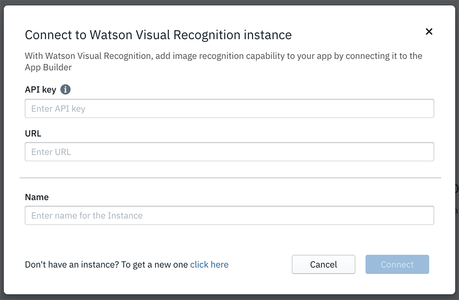

<!-- NLS_CHARSET=UTF-8 -->
## Watson Visual Recognition
{: #dab-watson-vr }

La fonction de reconnaissance d'image s'appuie sur le service Watson Visual Recognition d'IBM Cloud. Créez une instance Watson Visual Recognition sur IBM Cloud. Pour plus d'informations, cliquez [ici](https://cloud.ibm.com/catalog/services/visual-recognition).

Une fois la configuration effectuée, vous pouvez créer un modèle et y ajouter des classes. Vous pouvez faire glisser et déposer des images dans le générateur, puis entraîner vos modèles sur ces images. Une fois l'entraînement terminé, vous pouvez télécharger le modèle CoreML ou utiliser le modèle dans un contrôle d'intelligence artificielle de votre application.

Pour activer un service Visual Recognition dans votre application, procédez comme suit :

1. Cliquez sur **Watson**, puis sur **Reconnaissance d'image**. L'écran **Utiliser Watson Visual Recognition** s'affiche.

    

2. Cliquez sur **Se connecter** pour vous connecter à votre instance Watson Visual Recognition.

    

3. Entrez les détails de la **Clé d'API** et précisez  l'**URL** de votre instance Watson Visual Recognition. 
4. Donnez un **Nom** à l'instance de reconnaissance d'image, puis cliquez sur **Se connecter**. Le tableau de bord du modèle s'affiche.

    

5. Cliquez sur **Ajouter un nouveau modèle** pour créer un modèle. La fenêtre contextuelle **Créer un modèle** s'affiche.

    

6. Entrez le **Nom du modèle** et cliquez sur **Créer**. Les classes de ce modèle et une classe **Négatif** s'affichent.

    

7. Cliquez sur **Ajouter une nouvelle classe**. Une fenêtre contextuelle apparaît et vous permet d'indiquer le nom de la nouvelle classe.

    

8. Entrez le **Nom de la classe** pour la nouvelle classe, puis cliquez sur **Créer**. L'espace de travail vous permettant d'ajouter des images pour entraîner le modèle apparaît.

    

9. Ajoutez les images au modèle en les faisant glisser et les déposant dans l'espace de travail ou cliquez sur le bouton Parcourir pour accéder aux images.

10. Vous pouvez revenir à votre espace de travail après avoir ajouté les images et le tester en cliquant sur **Tester le modèle**.

    

11. Dans la section **Essayer votre modèle**, ajoutez une image. Les résultats s'affichent.

