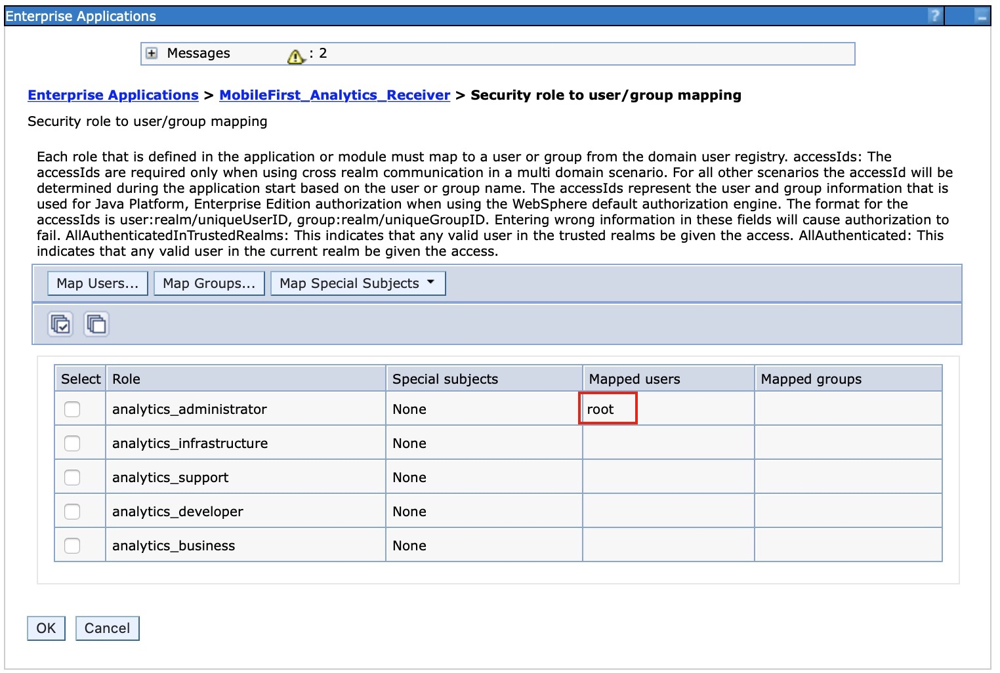

<!-- NLS_CHARSET=UTF-8 -->
## Présentation
{: #overview }
{{ site.data.keys.mf_analytics_receiver_server }} est implémenté et livré sous la forme d'un fichier archive d'application Web (WAR) de norme Java EE. Par conséquent, il peut être installé sur l'un des serveurs d'applications pris en charge suivants : WebSphere Application Server, WebSphere Application Server Liberty ou Apache Tomcat (fichiers WAR uniquement).

#### Aller à
{: #jump-to }

* [Configuration système requise](#system-requirements)
* [Remarques sur la capacité](#capacity-considerations)
* [Installation de {{ site.data.keys.mf_analytics_receiver }} sur WebSphere Application Server Liberty](#installing-mobilefirst-analytics-receiver-on-websphere-application-server-liberty)
* [Installation de {{ site.data.keys.mf_analytics_receiver }} sur Tomcat](#installing-mobilefirst-analytics-receiver-on-tomcat)
* [Installation de {{ site.data.keys.mf_analytics_receiver }} sur WebSphere Application Server](#installing-mobilefirst-analytics-receiver-on-websphere-application-server)
* [Installation de {{ site.data.keys.mf_analytics_receiver }} à l'aide de tâches Ant](#installing-mobilefirst-analytics-receiver-with-ant-tasks)

## Configuration système requise
{: #system-requirements }

### Systèmes d'exploitation
{: #operating-systems }
* CentOS/RHEL 6.x/7.x
* Oracle Enterprise Linux 6/7 avec noyau RHEL seulement
* Ubuntu 12.04/14.04
* SLES 11/12
* OpenSuSE 13.2
* Windows Server 2012/R2
* Debian 7

### Machines virtuelles Java
{: #jvm }
* Oracle JVM 1.7u55+
* Oracle JVM 1.8u20+
* IcedTea OpenJDK 1.7.0.55+

### Matériel
{: #hardware }
* Mémoire RAM : plus la quantité de mémoire RAM est élevée, mieux c'est.
Toutefois, ne dépassez pas 64 Go par noeud. 32 Go et 16 Go sont des valeurs acceptables. Une quantité inférieure à 8 Go nécessite que le cluster contienne de nombreux petits noeuds, et une quantité égale à 64 Go est inutile et problématique en raison de la façon dont Java utilise la mémoire pour les pointeurs.
* Disque : utilisez des disques SSD si possible, ou des disques traditionnels à rotation rapide dans une configuration RAID 0 si vous ne pouvez pas utiliser de disques SSD.
* Unité centrale : en général, l'unité centrale n'est pas à l'origine du goulot d'étranglement des performances. Utilisez des systèmes de 2 à 8 coeurs.
* Réseau : lorsqu'une extension horizontale est nécessaire, vous devez utiliser un centre de données rapide et fiable dont les vitesses prises en charge sont comprises entre 1 GbE et 10 GbE.

### Configuration matérielle
{: #hardware-configuration }
* Fournissez à votre machine virtuelle Java une taille suffisante pour mettre à l'échelle la file d'attente en mémoire avec une taille de 10000 (c'est-à-dire, un Xmx minimum de 6 Go).
* Si vous utilisez un système BSD ou Linux, assurez-vous que le planificateur d'E-S de votre système d'exploitation est **deadline** ou **noop**, et non **cfq**.

## Remarques sur la capacité
{: #capacity-considerations }
La question de la capacité est essentielle. De combien de mémoire RAM avez-vous besoin ? De combien d'espace disque ? De combien de noeuds ? La réponse est toujours subjective.

IBM {{ site.data.keys.mf_analytics_receiver }} ne nécessite pas d'espace disque dans la mesure où il reçoit simplement des journaux depuis des applications mobiles et les transmet au serveur d'analyse, sans stocker les données d'événements.

## Installation de {{ site.data.keys.mf_analytics_receiver }} sur WebSphere Application Server Liberty
{: #installing-mobilefirst-analytics-receiver-on-websphere-application-server-liberty }
Assurez-vous de disposer du fichier WAR {{ site.data.keys.mf_analytics_receiver }}. Pour plus d'informations sur les artefacts d'installation, voir [Installation de {{ site.data.keys.mf_server }} sur un serveur d'applications](../../prod-env/appserver). Le fichier **analytics-receiver.war** se trouve dans le dossier `<mf_server_install_dir>\analyticsreceiver`. Pour plus d'informations sur le téléchargement et l'installation de WebSphere Application Server Liberty, voir l'article [About WebSphere Liberty](https://developer.ibm.com/wasdev/websphere-liberty/) sur le site IBM developerWorks.

1. Créez un serveur en exécutant la commande suivante dans votre dossier `./wlp/bin` :

   ```bash
   ./server create <nom_serveur>
   ```

2. Installez les fonctions en exécutant la commande suivante dans votre dossier `./bin`.

   ```bash
   ./featureManager install jsp-2.2 ssl-1.0 appSecurity-1.0 localConnector-1.0
   ```

3. Ajoutez le fichier **analytics-receiver.war** au dossier `./usr/servers/<serverName>/apps` du serveur Liberty.
4. Remplacez le contenu de la balise **<featureManager>** du fichier `./usr/servers/<serverName>/server.xml` par le contenu suivant :

   ```xml
   <featureManager>
        <feature>jsp-2.2</feature>
        <feature>ssl-1.0</feature>
        <feature>appSecurity-1.0</feature>
        <feature>localConnector-1.0</feature>
   </featureManager>
   ```

5. Configurez **analytics-receiver.war** en tant qu'application avec la sécurité basée sur les rôles dans le fichier `server.xml`. L'exemple ci-dessous crée un registre d'utilisateurs de base codé en dur et affecte un utilisateur à chaque rôle d'analyse.

   ```xml
   <application id="analytics-receiver" name="analytics-receiver" location="analytics-receiver.war" type="war">
        <application-bnd>
            <security-role name="analytics_administrator">
                <user name="admin"/>
            </security-role>
            <security-role name="analytics_infrastructure">
                <user name="infrastructure"/>
            </security-role>
            <security-role name="analytics_support">
                <user name="support"/>
            </security-role>
            <security-role name="analytics_developer">
                <user name="developer"/>
            </security-role>
            <security-role name="analytics_business">
                <user name="business"/>
            </security-role>
        </application-bnd>
   </application>

   <basicRegistry id="worklight" realm="worklightRealm">
        <user name="business" password="demo"/>
        <user name="developer" password="demo"/>
        <user name="support" password="demo"/>
        <user name="infrastructure" password="demo"/>
        <user name="admin" password="admin"/>
   </basicRegistry>
   ```

   > Pour plus d'informations sur la configuration d'autres types de registre d'utilisateurs, par exemple LDAP, voir [Configuration d'un registre d'utilisateurs pour Liberty](http://ibm.biz/knowctr#SSAW57_8.5.5/com.ibm.websphere.wlp.nd.iseries.doc/ae/twlp_sec_registries.html) dans la documentation du produit WebSphere Application Server.

6. Démarrez le serveur Liberty en exécutant la commande suivante dans votre dossier **bin** :

   ```bash
   ./server start <nom_serveur>
   ```

7. Vérifiez le service en appelant l'URL de santé

   ```bash
   http://localhost:9080/analytics-receiver/rest/data/health
   ```

Pour plus d'informations sur l'administration de WebSphere Application Server Liberty, voir la rubrique [Administration de Liberty depuis la ligne de commande](http://ibm.biz/knowctr#SSAW57_8.5.5/com.ibm.websphere.wlp.nd.multiplatform.doc/ae/twlp_admin_script.html) dans la documentation du produit WebSphere Application Server.

## Installation de {{ site.data.keys.mf_analytics_receiver }} sur Tomcat
{: #installing-mobilefirst-analytics-receiver-on-tomcat }
Assurez-vous de disposer des fichiers WAR de {{ site.data.keys.mf_analytics_receiver }}. Pour plus d'informations sur les artefacts d'installation, voir [Installation de {{ site.data.keys.mf_server }} sur un serveur d'applications](../../prod-env/appserver). Le fichier **analytics-receiver.war** se trouve dans le dossier `<mf_server_install_dir>\analyticsreceiver`. Pour plus d'informations sur le téléchargement et l'installation de Tomcat, voir [Apache Tomcat](http://tomcat.apache.org/). Assurez-vous de télécharger la version qui prend en charge Java 7 ou version ultérieure. Pour savoir quelles versions de Tomcat prennent en charge Java 7, voir [Apache Tomcat Versions](http://tomcat.apache.org/whichversion.html).

1. Ajoutez le fichier **analytics-receiver.war** au dossier `webapps` de Tomcat.
2. Supprimez la mise en commentaire de la section suivante dans le fichier `conf/server.xml` qui est présente dans toutes les nouvelles archives Tomcat téléchargées.

   ```xml
   <Valve className="org.apache.catalina.authenticator.SingleSignOn"/>
   ```

3. Déclarez les deux fichiers war dans le fichier `conf/server.xml` et définissez un registre d'utilisateurs.

   ```xml
   <Context docBase ="analytics-receiver-service" path ="/analytics-receiver"></Context>
   <Realm className ="org.apache.catalina.realm.MemoryRealm"/>
   ```

   L'implémentation **MemoryRealm** reconnaît les utilisateurs qui sont définis dans le fichier `conf/tomcat-users.xml`. Pour plus d'informations sur les autres options disponibles, voir [Apache Tomcat Realm Configuration HOW-TO](http://tomcat.apache.org/tomcat-7.0-doc/realm-howto.html).

4. Ajoutez les sections ci-dessous dans le fichier `conf/tomcat-users.xml` afin de configurer une implémentation **MemoryRealm**.
    * Ajoutez les rôles de sécurité.

      ```xml
      <role rolename="analytics_administrator"/>
      <role rolename="analytics_infrastructure"/>
      <role rolename="analytics_support"/>
      <role rolename="analytics_developer"/>
      <role rolename="analytics_business"/>
      ```
    * Ajoutez quelques utilisateurs avec les rôles de votre choix.

      ```xml
      <user name="admin" password="admin" roles="analytics_administrator"/>
      <user name="support" password="demo" roles="analytics_support"/>
      <user name="business" password="demo" roles="analytics_business"/>
      <user name="developer" password="demo" roles="analytics_developer"/>
      <user name="infrastructure" password="demo" roles="analytics_infrastructure"/>
      ```    
    * Démarrez votre serveur Tomcat et vérifiez le service en appelant l'URL de santé.

      ```text
      http://localhost:8080/analytics-receiver/rest/data/health
      ```

    Pour plus d'informations sur le démarrage du serveur Tomcat, voir le site officiel de Tomcat, par exemple [Apache Tomcat 7](http://tomcat.apache.org/tomcat-7.0-doc/introduction.html) pour Tomcat 7.0.

## Installation de {{ site.data.keys.mf_analytics_receiver }} sur WebSphere Application Server
{: #installing-mobilefirst-analytics-receiver-on-websphere-application-server }
Pour plus d'informations sur les étapes d'installation initiale permettant d'acquérir les artefacts d'installation (fichiers JAR et EAR), voir [Installation de {{ site.data.keys.mf_server }} sur un serveur d'applications](../../prod-env/appserver). Le fichier **analytics-receiver.war** se trouve dans le dossier `<mf_server_install_dir>\analyticsreceiver`. 

Les étapes ci-après expliquent comment installer et exécuter le fichier EAR d'Analytics sur WebSphere Application Server. Si vous installez les fichiers WAR individuels sur WebSphere Application Server, suivez uniquement les étapes 2 à 7 concernant le fichier WAR **analytics-receiver** après le déploiement. 

1. Déployez le fichier sur le serveur d'applications, mais ne le démarrez pas. Pour plus d'informations sur l'installation d'un fichier EAR sur WebSphere Application Server, voir la rubrique [Installation de fichiers d'application d'entreprise à l'aide de la console](http://ibm.biz/knowctr#SSAW57_8.5.5/com.ibm.websphere.nd.multiplatform.doc/ae/trun_app_instwiz.html) dans la documentation du produit WebSphere Application Server.

2. Sélectionnez l'application **MobileFirst Analytics Receiver** dans la liste **Applications d'entreprise**.

    

3. Cliquez sur **Chargement de classes et détection de mise à jour**.

    

4. Définissez l'ordre de chargement des classes **Parent en dernier**.

    

5. Cliquez sur **Mappage rôle de sécurité-utilisateur/groupe** pour mapper l'utilisateur admin.

    

6. Cliquez sur **Gestion des modules**.

    

7. Sélectionnez le module **analytics-receiver** et définissez l'ordre de chargeur de classe sur **Parent en dernier**.

    

8. Activez la **sécurité administrative** et la **sécurité des applications** dans la console d'administration WebSphere Application Server :
    * Connectez-vous à la console d'administration de WebSphere Application Server.
    * Dans le menu **Sécurité > Sécurité globale**, vérifiez que les options **Activer la sécurité administrative** et **Activer la sécurité des applications** sont toutes les deux sélectionnées.
    > **Remarque** : La sécurité des applications ne peut être sélectionnée que si la **Sécurité administrative** est activée.
    * Cliquez sur **OK** et sauvegardez les modifications.

9. Pour que le service d'analyse soit accessible via la documentation Swagger, procédez comme suit :
    * Cliquez sur **Serveurs > Types de serveurs > Serveurs d'applications WebSphere** et choisissez dans la liste de serveurs le serveur sur lequel le service d'analyse est déployé.
    * Sous **Infrastructure du serveur**, cliquez sur **Java** puis sélectionnez **Gestion des processus et Java > Définition des processus > Machine virtuelle Java > Propriétés personnalisées**.
      - Définissez la propriété personnalisée suivante<br/>
        **Nom de la propriété :** *com.ibm.ws.classloader.strict*<br/>
        **Valeur :** *true*

10. Démarrez l'application {{ site.data.keys.mf_analytics_receiver }} et vérifiez que l'URL de santé est accessible dans le navigateur : `http://<hostname>:<port>/analytics-receiver/rest/data/health`.

## Installation de {{ site.data.keys.mf_analytics_receiver }} à l'aide de tâches Ant
{: #installing-mobilefirst-analytics-receiver-with-ant-tasks }
Assurez-vous de disposer des fichiers WAR et de configuration nécessaires : **analytics-receiver.war**. Pour plus d'informations sur les artefacts d'installation, voir [Installation de {{ site.data.keys.mf_server }} sur un serveur d'applications](../../prod-env/appserver). Le fichier **analytics-receiver.war** se trouve dans `MobileFirst_Platform_Server\AnalyticsReceiver`.

Vous devez exécuter la tâche Ant sur l'ordinateur sur lequel est installé le serveur d'applications ou le gestionnaire de déploiement réseau pour WebSphere Application Server Network Deployment. Si vous souhaitez démarrer la tâche Ant depuis un ordinateur sur lequel {{ site.data.keys.mf_server }} n'est pas installé, vous devez copier le fichier `\<mf_server_install_dir\>/MobileFirstServer/mfp-ant-deployer.jar` sur cet ordinateur.

> **Remarque** : **mf_server_install_dir** désigne le répertoire dans lequel vous avez installé {{ site.data.keys.mf_server }}.

1. Editez le script Ant que vous utiliserez ultérieurement pour déployer les fichiers WAR {{ site.data.keys.mf_analytics_receiver }}.
    * Prenez connaissance des exemples de fichier de configuration dans [Exemples de fichier de configuration pour {{ site.data.keys.mf_analytics_receiver }}](../../installation-reference/#sample-configuration-files-for-mobilefirst-analytics).
    * Remplacez les marques de réservation par les propriétés au début du fichier.

    > **Remarque :** Les caractères spéciaux suivants doit être associés à des caractères d'échappement lorsqu'ils sont utilisés dans des valeurs des scripts XML Ant :
    >
    > * Le symbole du dollar ($) doit être écrit sous la forme $$, sauf si vous voulez référencer explicitement une variable Ant via la syntaxe ${variable}, comme décrit dans la section [Properties](http://ant.apache.org/manual/properties.html) du manuel Apache Ant.
    > * Le caractère perluète (&) doit être écrit sous la forme &amp;, sauf si vous voulez référencer explicitement une entité XML.
    > * Les guillemets (") doivent être écrits sous la forme &quot;, sauf s'ils se trouvent dans une chaîne placée entre apostrophes.

2. Pour déployer le fichier WAR, exécutez la commande suivante :
   ```bash
   ant -f configure-appServer-analytics-receiver.xml install
   ```
    Vous pouvez trouver la commande Ant dans `mf_server_install_dir/shortcuts`. Celle-ci installe un noeud de {{ site.data.keys.mf_analytics_receiver }} sur le serveur ou sur chaque membre d'un cluster si vous procédez à l'installation sur WebSphere Application Server Network Deployment.
3. Sauvegardez le fichier Ant. Vous en aurez peut-être besoin plus tard pour appliquer un groupe de correctifs ou effectuer une mise à niveau.
    Si vous ne voulez pas sauvegarder les mots de passe, vous pouvez les remplacer par `************` (12 astérisques) pour une invite interactive.
