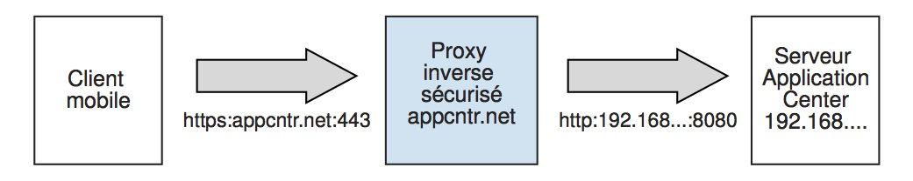

<!-- NLS_CHARSET=UTF-8 -->
## Présentation
{: #overview }
Vous installez Application Center dans le cadre de l'installation de {{ site.data.keys.mf_server }}.
Vous pouvez l'installer de différentes façons :

* Installation avec IBM Installation Manager
* Installation à l'aide de tâches Ant
* Installation manuelle

Si vous le souhaitez, vous pouvez créer la base de données de votre choix avant d'installer {{ site.data.keys.mf_server }} avec Application Center.  
Après avoir installé Application Center sur le serveur d'applications Web de votre choix, vous devez effectuer d'autres tâches de configuration. Pour plus d'informations, voir la section Configuration d'Application Center après son installation ci-dessous. Si vous avez choisi l'installation manuelle dans le programme d'installation, voir la documentation du serveur de votre choix.

> **Remarque :** si vous prévoyez d'installer des applications sur des appareils iOS via Application Center, vous devez d'abord configurer le serveur d'Application Center avec SSL.

Pour la liste des fichiers et des outils installés, voir [Structure de distribution de {{ site.data.keys.mf_server }}](../installation-manager/#distribution-structure-of-mobilefirst-server).

#### Aller à
{: #jump-to }

* [Installation d'Application Center avec IBM Installation Manager](#installing-application-center-with-ibm-installation-manager)
* [Installation d'Application Center à l'aide de tâches Ant](#installing-the-application-center-with-ant-tasks)
* [Installation manuelle d'Application Center](#manually-installing-application-center)
* [Configuration d'Application Center après son installation](#configuring-application-center-after-installation)

## Installation d'Application Center avec IBM Installation Manager
{: #installing-application-center-with-ibm-installation-manager }
Avec IBM Installation Manager, vous pouvez installer Application Center, créer sa base de données et procéder à son déploiement sur un serveur d'applications.  
Avant de commencer, vérifiez que l'utilisateur qui exécute IBM Installation Manager dispose des privilèges décrits dans [Configuration requise pour le système de fichiers](../prod-env/appserver/#file-system-prerequisites).

Pour installer IBM Application Center avec IBM Installation Manager, procédez comme suit.

1. Facultatif : vous pouvez créer manuellement des bases de données pour Application Center, comme décrit dans [Création optionnelle de bases de données](#optional-creation-of-databases) ci-dessous. IBM Installation Manager peut créer les bases de données d'Application Center pour vous avec les paramètres par défaut.
2. Exécutez IBM Installation Manager comme décrit dans [Exécution d'IBM Installation Manager](../installation-manager).
3. Sélectionnez **Oui** en réponse à la question **Installer IBM Application Center**.

#### Aller à
{: #jump-to-1 }
* [Création optionnelle de bases de données](#optional-creation-of-databases)
* [Installation d'Application Center dans WebSphere Application Server Network Deployment](#installing-application-center-in-websphere-application-server-network-deployment)
* [Finalisation de l'installation](#completing-the-installation)
* [ID de connexion et mots de passe par défaut créés par IBM Installation Manager pour Application Center](#default-logins-and-passwords-created-by-ibm-installation-manager-for-the-application-center)

### Création optionnelle de bases de données
{: #optional-creation-of-databases }
Si vous voulez activer l'option permettant d'installer Application Center lorsque vous exécutez le programme d'installation de {{ site.data.keys.mf_server }}, vous devez disposer de certains droits d'accès à la base de données permettant de créer les tables requises par Application Center.

Si vos données d'identification pour l'administration de la base de données sont suffisantes et si vous entrez le nom d'utilisateur et le mot de passe de l'administrateur dans le programme d'installation lorsque vous y êtes invité, le programme d'installation peut créer les bases de données pour vous. Sinon, vous devez demander à votre administrateur de base de données de créer la base de données requise. Celle-ci doit être créée avant le lancement du programme d'installation de {{ site.data.keys.mf_server }}.

Les rubriques ci-dessous décrivent la procédure pour les systèmes de gestion de base de données pris en charge.

#### Aller à
{: #jump-to-2 }

* [Création de la base de données DB2 pour Application Center](#creating-the-db2-database-for-application-center)
* [Création de la base de données MySQL pour Application Center](#creating-the-mysql-database-for-application-center)
* [Création de la base de données Oracle pour Application Center](#creating-the-oracle-database-for-application-center)

#### Création de la base de données DB2 pour Application Center
{: #creating-the-db2-database-for-application-center }
Au cours de l'installation d'IBM MobileFirst Foundation, le programme d'installation peut créer la base de données d'Application Center pour vous.

Le programme d'installation peut créer la base de données d'Application Center pour vous si vous entrez le nom et le mot de passe d'un compte utilisateur sur le serveur de base de données qui dispose du privilège DB2 SYSADM ou SYSCTRL, et si le compte est accessible via SSH. Sinon, l'administrateur de base de données peut créer la base de données d'Application Center pour vous. Pour plus d'informations, voir la documentation utilisateur de la [solution DB2](http://ibm.biz/knowctr#SSEPGG_9.7.0/com.ibm.db2.luw.admin.sec.doc/doc/c0055206.html).

Lorsque vous créez la base de données manuellement, vous pouvez remplacer le nom de la base de données (ici, APPCNTR) et le mot de passe par un nom de base de données et un mot de passe de votre choix.

> **Important :** vous pouvez nommer votre base de données et votre utilisateur différemment, ou définir un autre mot de passe ; toutefois, veillez à entrer le nom de base de données, le nom d'utilisateur et le mot de passe appropriés correctement au cours de la configuration de la base de données DB2. Un nom de base de données DB2 ne peut pas comporter plus de 8 caractères, quelle que soit la plateforme, et les noms d'utilisateur DB2 ainsi que les mots de passe DB2 ne peuvent pas comporter plus de 8 caractères sur les systèmes UNIX et Linux, et 30 caractères sur les systèmes Windows.

1. Créez un utilisateur système, par exemple **wluser** dans un groupe d'administrateurs DB2 tel que **DB2USERS**, à l'aide des commandes appropriées à votre système d'exploitation. Associez-lui un mot de passe, par exemple **wluser**. Si vous voulez que plusieurs instances d'IBM {{ site.data.keys.mf_server }} se connectent à la même base de données, utilisez un nom d'utilisateur différent pour chaque connexion. Chaque utilisateur de base de données possède un schéma par défaut distinct. Pour plus d'informations sur les utilisateurs de base de données, voir la documentation DB2 ainsi que la documentation de votre système d'exploitation.

2. Ouvrez un processeur de ligne de commande DB2 en tant qu'utilisateur disposant des droits **SYSADM** ou **SYSCTRL** :

    * Sur les systèmes Windows, cliquez sur **Démarrer → IBM DB2 → Command Line Processor**
    * Sur les systèmes Linux et UNIX, accédez à **~/sqllib/bin** et entrez `./db2`.
    * Entrez des instructions de gestionnaire de base de données et SQL similaires à l'exemple suivant afin de créer la base de données d'Application Center en remplaçant le nom d'utilisateur **wluser** par les noms d'utilisateur de votre choix :

      ```bash
      CREATE DATABASE APPCNTR COLLATE USING SYSTEM PAGESIZE 32768
      CONNECT TO APPCNTR
      GRANT CONNECT ON DATABASE TO USER wluser
      DISCONNECT APPCNTR
      QUIT
      ```

3. Le programme d'installation peut créer les objets et les tables de base de données pour Application Center dans un schéma spécifique. Ainsi, vous pouvez utiliser la même base de données pour Application Center et pour un projet MobileFirst. Si les droits IMPLICIT\_SCHEMA sont accordés à l'utilisateur créé à l'étape 1 (valeur par défaut dans le script de création de base de données à l'étape 2), aucune intervention n'est requise. Si l'utilisateur ne dispose pas des droits IMPLICIT\_SCHEMA, vous devez créer un SCHEMA pour les objets et les tables de base de données d'Application Center.

#### Création de la base de données MySQL pour Application Center
{: #creating-the-mysql-database-for-application-center }
Au cours de l'installation de MobileFirst, le programme d'installation peut créer la base de données d'Application Center pour vous.

Le programme d'installation peut créer la base de données pour vous si vous entrez le nom et le mot de passe du compte du superutilisateur. Pour plus d'informations, voir [Securing the Initial MySQL Accounts](http://dev.mysql.com/doc/refman/5.1/en/default-privileges.html) sur votre serveur de base de données MySQL. Votre administrateur de base de données peut également créer les bases de données pour vous. Lorsque vous créez la base de données manuellement, vous pouvez remplacer le nom de la base de données (ici, APPCNTR) et le mot de passe par un nom de base de données et un mot de passe de votre choix. Notez que les noms de base de données MySQL sont sensibles à la casse sous UNIX.

1. Démarrez l'outil de ligne de commande MySQL.
2. Entrez les commandes suivantes :

   ```bash
   CREATE DATABASE APPCNTR CHARACTER SET utf8 COLLATE utf8_general_ci;
   GRANT ALL PRIVILEGES ON APPCNTR.* TO 'worklight'@'Worklight-host' IDENTIFIED BY 'password';
   GRANT ALL PRIVILEGES ON APPCNTR.* TO 'worklight'@'localhost' IDENTIFIED BY 'password';
   FLUSH PRIVILEGES;
   ```

   Ici, vous devez remplacer **hôte-Worklight** par le nom de l'hôte sur lequel s'exécute IBM MobileFirst Foundation.

#### Création de la base de données Oracle pour Application Center
{: #creating-the-oracle-database-for-application-center }
Au cours de l'installation, le programme d'installation peut créer pour vous la base de données d'Application Center (sauf si le type de base de données est Oracle 12c) ou l'utilisateur et le schéma dans une base de données existante.

Le programme d'installation peut créer la base de données (sauf si le type de base de données est Oracle 12c) ou l'utilisateur et le schéma dans une base de données existante, si vous entrez le nom et le mot de passe de l'administrateur Oracle sur le serveur de base de données et si le compte est accessible via SSH. Sinon, l'administrateur de base de données peut créer la base de données ou l'utilisateur et le schéma pour vous. Lorsque vous créez la base de données ou l'utilisateur manuellement, vous pouvez utiliser les noms de base de données, les noms d'utilisateur et un mot de passe de votre choix. Notez que les minuscules dans les noms d'utilisateur Oracle peuvent générer des problèmes.

1. Si vous ne disposez pas encore d'une base de données nommée **ORCL**, utilisez l'assistant de configuration de base de données Oracle (DBCA) et suivez les étapes qu'il présente afin de créer une base de données à usage général nommée **ORCL**:
    * Utilisez un nom de base de données global de type **ORCL\_votre\_domaine** et l'identificateur système (SID) **ORCL**.
    * Dans l'onglet **Custom Scripts** de l'étape **Database Content**, n'exécutez pas les scripts SQL car vous devez d'abord créer un compte utilisateur.
    * Dans l'onglet **Character Sets** de l'étape **Initialization Parameters**, sélectionnez **Use Unicode (AL32UTF8) character set and UTF8 - Unicode 3.0 UTF-8 national character set**.
    * Terminez la procédure en acceptant les valeurs par défaut.
2. Créez un utilisateur de base de données en utilisant **Oracle Database Control** ou l'interpréteur de ligne de commande **Oracle SQLPlu**.
    * Avec **Oracle Database Control** :
        * Connectez-vous en tant que **SYSDBA**.
        * Accédez à la page **Users** : cliquez sur **Server**, puis sur **Users** dans la section **Security**.
        * Créez un utilisateur, par exemple **APPCENTER**. Si vous voulez que plusieurs instances d'IBM {{ site.data.keys.mf_server }} se connectent à la base de données à usage général que vous avez créée à l'étape 1, utilisez un nom d'utilisateur différent pour chaque connexion. Chaque utilisateur de base de données possède un schéma par défaut distinct.
        * Affectez les attributs suivants :
            * Profile: **DEFAULT**
            * Authentication: **password**
            * Default tablespace: **USERS**
            * Temporary tablespace: **TEMP**
            * Status: **Unlocked**
            * Add system privilege: **CREATE SESSION**
            * Add system privilege: **CREATE SEQUENCE**
            * Add system privilege: **CREATE TABLE**
            * Add quota: **Unlimited for tablespace USERS**
    * Avec l'interpréteur de ligne de commande **Oracle SQLPlus** :  
    Les commandes de l'exemple suivant créent un utilisateur nommé APPCENTER pour la base de données :

        ```bash
        CONNECT SYSTEM/<mot_de_passe_SYSTEM>@ORCL
        CREATE USER APPCENTER IDENTIFIED BY password DEFAULT TABLESPACE USERS QUOTA UNLIMITED ON USERS;
        GRANT CREATE SESSION, CREATE SEQUENCE, CREATE TABLE TO APPCENTER;
        DISCONNECT;
        ```

### Installation d'Application Center dans WebSphere Application Server Network Deployment
{: #installing-application-center-in-websphere-application-server-network-deployment }
Pour installer Application Center sur un ensemble de serveurs WebSphere Application Server Network Deployment, exécutez IBM Installation Manager sur la machine sur laquelle s'exécute le gestionnaire de déploiement.

1. Lorsqu'IBM Installation Manager vous invite à spécifier le type de base de données, sélectionnez une option autre qu'**Apache Derby**. IBM MobileFirst Foundation prend en charge Apache Derby en mode imbriqué seulement et ce choix n'est pas compatible avec un déploiement via WebSphere Application Server Network Deployment.
2. Dans le panneau du programme d'installation dans lequel vous spécifiez le répertoire d'installation de WebSphere Application Server, sélectionnez le profil de gestionnaire de déploiement.

    > **Attention :** il ne faut pas sélectionner un profil de serveur d'applications, puis un serveur géré unique. Sinon, le gestionnaire de déploiement remplace la configuration du serveur, que vous procédiez à l'installation sur la machine sur laquelle s'exécute le gestionnaire de déploiement ou sur une autre machine.
3. Sélectionnez la portée requise selon l'emplacement auquel Application Center doit être installé. Le tableau suivant répertorie les portées disponibles :

    | Portée	 | Explication |
    |--------|-------------|
    | Cellule	 | Installe Application Center sur tous les serveurs d'applications de la cellule. |
    | Cluster| Installe Application Center sur tous les serveurs d'applications du cluster spécifié. |
    | Noeud   | (sauf clusters) Installe Application Center sur tous les serveurs d'applications du noeud spécifié qui ne sont pas dans un cluster. |
    | Serveur | Installe Application Center sur le serveur spécifié, qui n'est pas dans un cluster. |

4. Redémarrez les serveurs cible en suivant la procédure décrite dans [Finalisation de l'installation](#completing-the-installation) ci-dessous.

L'installation n'a pas d'effet hors de l'ensemble de serveurs qui se trouvent dans la portée spécifiée. Les fournisseurs JDBC et les sources de données JDBC sont définis avec la portée spécifiée. Le nom des entités dont la portée est la cellule (les applications et, pour DB2, l'alias d'authentification) comportent un suffixe qui les rend uniques. Par conséquent, vous pouvez installer Application Center dans différentes configurations, et même différentes versions d'Application Center, dans différents clusters de la même cellule.

> **Remarque :** Etant donné que le pilote JDBC n'est installé que sur l'ensemble spécifié de serveurs d'applications, il se peut que le bouton Tester la connexion pour les sources de données JDBC dans la console d'administration WebSphere Application Server du gestionnaire de déploiement ne fonctionne pas.

Si vous utilisez un serveur HTTP frontal, vous devez aussi configurer l'adresse URL publique.

### Finalisation de l'installation
{: #completing-the-installation }
Une fois l'installation terminée, dans certains cas, vous devez redémarrer le serveur d'applications Web.  
Vous devez le redémarrer dans les circonstances suivantes :

* Lorsque vous utilisez WebSphere Application Server avec une base de données de type DB2.
* Lorsque vous utilisez WebSphere Application Server et que vous l'avez ouvert sans avoir activé la sécurité des applications avant d'installer IBM MobileFirst Application Center ou {{ site.data.keys.mf_server }}.

Le programme d'installation de MobileFirst doit activer la sécurité des applications de WebSphere Application Server (si elle ne l'est pas) pour l'installation d'Application Center. Ensuite, pour que cette activation soit prise en compte, vous devez redémarrer le serveur d'applications une fois l'installation de {{ site.data.keys.mf_server }} terminée.

* Lorsque vous utilisez WebSphere Application Server Liberty ou Apache Tomcat.
* Après avoir procédé à une mise à niveau depuis une version précédente de {{ site.data.keys.mf_server }}.

Si vous utilisez WebSphere Application Server Network Deployment et avez choisi une installation via le gestionnaire de déploiement :

* Vous devez redémarrer les serveurs qui s'exécutaient lors de l'installation et sur lesquels sont installées les applications Web de {{ site.data.keys.mf_server }}.

Pour redémarrer ces serveurs par le biais de la console du gestionnaire de déploiement, sélectionnez **Applications → Types d'application → Applications d'entreprise WebSphere → IBM_Application\_Center\_Services → Etat de l'application spécifique à la cible**.

* Il n'est pas nécessaire de redémarrer le gestionnaire de déploiement ni les agents de noeud.

> **Remarque :** Application Center seulement est installé sur le serveur d'applications.

### ID de connexion et mots de passe par défaut créés par IBM Installation Manager pour Application Center
{: #default-logins-and-passwords-created-by-ibm-installation-manager-for-the-application-center }
IBM Installation Manager crée les ID de connexion par défaut pour Application Center selon votre serveur d'applications. Vous pouvez les utiliser afin de tester Application Center.

#### Profil complet de WebSphere Application Server
{: #websphere-application-server-full-profile }
L'ID de connexion **appcenteradmin** est créé avec un mot de passe qui est généré et affiché au cours de l'installation.

Tous les utilisateurs authentifiés dans le superdomaine de l'application sont également autorisés à accéder au rôle **appcenteradmin**. Il n'est pas recommandé d'utiliser cet ID de connexion dans un environnement de production, notamment si WebSphere Application Server est configuré avec un domaine de sécurité unique.

Pour plus d'informations sur la modification de ces ID de connexion, voir [Configuration des rôles de sécurité Java EE dans le profil complet de WebSphere Application Server](#configuring-the-java-ee-security-roles-on-websphere-application-server-full-profile).

#### Profil Liberty de WebSphere Application Server
{: #websphere-application-server-liberty-profile }
* L'ID de connexion demo est créé dans l'élément basicRegistry avec le mot de passe demo.
* L'ID de connexion appcenteradmin est créé dans l'élémet basicRegistry avec le mot de passe admin.

Pour plus d'informations sur la modification de ces ID de connexion, voir [Configuration des rôles de sécurité Java EE dans le profil Liberty de WebSphere Application Server](#configuring-the-java-ee-security-roles-on-websphere-application-server-liberty-profile).

#### Apache Tomcat
{: #apache-tomcat }
* L'ID de connexion demo est créé avec le mot de passe demo.
* L'ID de connexion guest est créé avec le mot de passe guest.
* L'ID de connexion appcenteradmin est créé avec le mot de passe admin.

Pour plus d'informations sur la modification de ces ID de connexion, voir [Configuration des rôles de sécurité Java EE sur Apache Tomcat](#configuring-the-java-ee-security-roles-on-apache-tomcat).

## Installation d'Application Center à l'aide de tâches Ant
{: #installing-the-application-center-with-ant-tasks }
Découvrez les tâches Ant que vous pouvez utiliser pour installer Application Center.

#### Aller à
{: #jump-to-3 }

* [Création et configuration de la base de données pour Application Center à l'aide de tâches Ant](#creating-and-configuring-the-database-for-application-center-with-ant-tasks)
* [Déploiement des services et de la console Application Center à l'aide de tâches Ant](#deploying-the-application-center-console-and-services-with-ant-tasks)

### Création et configuration de la base de données pour Application Center à l'aide de tâches Ant
{: #creating-and-configuring-the-database-for-application-center-with-ant-tasks }
Si vous n'avez pas créé la base de données manuellement, vous pouvez utiliser des tâches Ant afin de créer et de configurer votre base de données pour Application Center. Si votre base de données existe déjà, il est possible de n'effectuer que les étapes de configuration à l'aide de tâches Ant.

Avant de commencer, vérifiez qu'un système de gestion de base de données (SGBD) est installé et exécuté sur un serveur de base de données, sur le même ordinateur ou un autre.

Les tâches Ant pour Application Center se trouvent dans le répertoire **ApplicationCenter/configuration-samples** de la distribution {{ site.data.keys.mf_server }}.

Si vous voulez lancer la tâche Ant depuis un ordinateur sur lequel {{ site.data.keys.mf_server }} n'est pas installé, vous devez copier les fichiers suivants sur cet ordinateur :

* La bibliothèque **rép\_install\_serveur\_mf/MobileFirstServer/mfp-ant-deployer.jar**
* Le répertoire contenant les fichiers binaires du programme aapt depuis le package Android SDK platform-tools : **rép\_install\_serveur\_mf/ApplicationCenter/tools/android-sdk**
* Les exemples de fichier Ant qui se trouvent dans **rép\_install\_serveur\_mf/ApplicationCenter/configuration-samples**

> **Remarque :** la marque de réservation **rép\_install\_serveur\_mf** représente le répertoire dans lequel vous avez installé {{ site.data.keys.mf_server }}.

Si vous n'avez pas créé votre base de données manuellement comme décrit dans [Création optionnelle des bases de données](#optional-creation-of-databases), suivez les étapes 1 à 3 ci-dessous.
Si votre base de données existe déjà, il suffit de créer les tables de base de données. Suivez les étapes 4 à 7 ci-dessous.

1. Copiez l'exemple de fichier Ant correspondant à votre système de gestion de base de données. Le format de nom des fichiers permettant de créer une base de données est le suivant :

    ```bash
    create-appcenter-database-<dbms>.xml
    ```

2. Editez le fichier Ant et remplacez les marques de réservation par les propriétés au début du fichier.
3. Exécutez les commandes suivantes pour créer la base de données d'Application Center :

    ```bash
    ant -f create-appcenter-database-<dbms>.xml databases
    ```

    La commande Ant se trouve dans **rép\_install\_serveur\_mf/shortcuts**.

    Si la base de données existe déjà, il suffit de créer les tables de base de données en effectuant les étapes suivantes :

4. Copiez l'exemple de fichier Ant correspondant à votre serveur d'applications et à votre système de gestion de base de données. Le format de nom des fichiers permettant de configurer une base de données existante est le suivant :

    ```bash
    configure-appcenter-<serveurApp>-<dbms>.xml
    ```

5. Editez le fichier Ant et remplacez les marques de réservation par les propriétés au début du fichier.
6. Exécutez les commandes suivantes pour configurer la base de données :

    ```bash
    ant -f configure-appcenter-<serveurApp>-<dbms>.xml databases
    ```

    La commande Ant se trouve dans **rép\_install\_serveur\_mf/shortcuts**.

7. Sauvegardez le fichier Ant. Vous en aurez peut-être besoin plus tard pour appliquer un groupe de correctifs ou effectuer une mise à niveau.

Si vous ne voulez pas sauvegarder les mots de passe, vous pouvez les remplacer par "************" (12 astérisques) pour une invite interactive.

### Déploiement des services et de la console Application Center à l'aide de tâches
Ant
{: #deploying-the-application-center-console-and-services-with-ant-tasks }
Utilisez des tâches Ant pour déployer les services et la console Application Center sur un serveur d'applications et configurer les sources de données, les propriétés et les pilotes de base de données qui sont utilisés par Application Center.

Avant de commencer 

* Suivez la procédure décrite à la section [Création et configuration de la base de données pour Application Center à l'aide de tâches Ant](#creating-and-configuring-the-database-for-application-center-with-ant-tasks).
* Vous devez exécuter la tâche Ant sur l'ordinateur sur lequel est installé le serveur d'applications ou le gestionnaire de déploiement réseau pour WebSphere Application Server Network Deployment. Si vous voulez lancer la tâche Ant depuis un ordinateur sur lequel {{ site.data.keys.mf_server }} n'est pas installé, vous devez copier les fichiers et les répertoires suivants sur cet ordinateur :

    * La bibliothèque **rép\_install\_serveur\_mf/MobileFirstServer/mfp-ant-deployer.jar**
    * Les applications Web (fichiers WAR et EAR) qui se trouvent dans **rép\_install\_serveur_mf/ApplicationCenter/console**
    * Le répertoire contenant les fichiers binaires du programme aapt depuis le package Android SDK platform-tools : **rép\_install\_serveur\_mf/ApplicationCenter/tools/android-sdk**
    * Les exemples de fichier Ant qui se trouvent dans **rép\_install\_serveur\_mf/ApplicationCenter/configuration-samples**

> **Remarque :** la marque de réservation rép_install_serveur_mf** représente le répertoire dans lequel vous avez installé {{ site.data.keys.mf_server }}.

1. Copiez le fichier Ant correspondant à votre serveur d'applications et à votre système de gestion de base de données. Le format de nom des fichiers permettant de configurer Application Center est le suivant :

    ```bash
    configure-appcenter-<serveurApp>-<dbms>.xml
    ```

2. Editez le fichier Ant et remplacez les marques de réservation par les propriétés au début du fichier.
3. Exécutez la commande suivante pour déployer les services et la console Application Center sur un serveur d'applications :

    ```bash
    ant -f configure-appcenter-<serveurApp>-<dbms>.xml install
    ```

    La commande Ant se trouve dans **rép\_install\_serveur\_mf/shortcuts**.

    > **Remarque :** avec ces fichiers Ant, vous pouvez effectuer les actions présentées ci-dessous.
    >
    > * Désinstaller Application Center, avec la cible **uninstall**.
    > * Mettre à jour Application Center, avec la cible **minimal-update**, afin d'appliquer un groupe de correctifs.

4. Sauvegardez le fichier Ant. Vous en aurez peut-être besoin plus tard pour appliquer un groupe de correctifs ou effectuer une mise à niveau. Si vous ne voulez pas sauvegarder les mots de passe, vous pouvez les remplacer par "************" (12 astérisques) pour une invite interactive.
5. Si vous avez procédé à l'installation sur le profil Liberty de WebSphere Application Server ou sur Apache Tomcat, vérifiez que le programme aapt est exécutable pour tous les utilisateurs. Si nécessaire, vous devez définir les droits utilisateur appropriés. Par exemple, sur les systèmes UNIX et Linux :

    ```bash
    chmod a+x mf_server_install_dir/ApplicationCenter/tools/android-sdk/*/aapt*
    ```

## Installation manuelle d'Application Center
{: #manually-installing-application-center }
Une reconfiguration est nécessaire pour que {{ site.data.keys.mf_server }} puisse utiliser une base de données ou un schéma différent de celle ou de celui qui a été spécifié au cours de son installation. Elle dépend du type de base de données ainsi que du serveur d'applications.

Sur les serveurs d'applications autres qu'Apache Tomcat, vous pouvez déployer Application Center à partir de deux fichiers WAR ou d'un fichier EAR.

> **Restriction :** que vous installiez Application Center avec IBM Installation Manager dans le cadre de l'installation de {{ site.data.keys.mf_server }} ou manuellement, gardez à l'esprit que la "distribution des mises à jour" d'Application Center n'est pas prise en charge. En d'autres termes, vous ne pouvez pas installer deux versions d'Application Center (par exemple la version 5.0.6 et la version 6.0.0) utilisant la même base de données.

#### Aller à
{: #jump-to-4 }

* [Configuration manuelle de la base de données DB2 pour Application Center](#configuring-the-db2-database-manually-for-application-center)
* [Configuration manuelle de la base de données Apache Derby pour Application Center](#configuring-the-apache-derby-database-manually-for-application-center)
* [Configuration manuelle de la base de données MySQL pour Application Center](#configuring-the-mysql-database-manually-for-application-center)
* [Configuration manuelle de la base de données Oracle pour Application Center](#configuring-the-oracle-database-manually-for-application-center)
* [Déploiement manuel des fichiers WAR d'Application Center et configuration manuelle du serveur d'applications](#deploying-the-application-center-war-files-and-configuring-the-application-server-manually)
* [Déploiement manuel du fichier EAR d'Application Center et configuration manuelle du serveur d'applications](#deploying-the-application-center-ear-file-and-configuring-the-application-server-manually)

### Configuration manuelle de la base de données DB2 pour Application Center
{: #configuring-the-db2-database-manually-for-application-center }
Vous configurez la base de données DB2 manuellement en créant la base de données et les tables de base de données, puis en configurant le serveur d'applications approprié en vue de l'utilisation de cette configuration de base de données.

1. Créez la base de données. Cette étape est décrite à la section [Création de la base de données DB2 pour Application Center](#creating-the-db2-database-for-application-center).
2. Créez les tables dans la base de données. Cette étape est décrite à la section
[Configuration manuelle de votre base de données DB2 pour Application Center](#setting-up-your-db2-database-manually-for-application-center).
3. Procédez à la configuration propre au serveur d'applications conformément à la liste ci-après.

#### Aller à
{: #jump-to-5 }

* [Configuration manuelle de votre base de données DB2 pour Application Center](#setting-up-your-db2-database-manually-for-application-center)
* [Configuration manuelle du profil Liberty pour DB2 pour Application Center](#configuring-liberty-profile-for-db2-manually-for-application-center)
* [Configuration manuelle de WebSphere Application Server pour DB2 pour Application Center](#configuring-websphere-application-server-for-db2-manually-for-application-center)
* [Configuration manuelle d'Apache Tomcat pour DB2 pour Application Center](#configuring-apache-tomcat-for-db2-manually-for-application-center)

##### Configuration manuelle de votre base de données DB2 pour Application Center
{: #setting-up-your-db2-database-manually-for-application-center }
Configurez votre base de données DB2 pour Application Center en créant le schéma de base de données.

1. Créez un utilisateur système, **worklight**, dans un groupe d'administrateurs DB2 tel que **DB2USERS**, à l'aide des commandes appropriées à votre système d'exploitation. Associez-lui le mot de passe **worklight**. Pour plus d'informations, voir la documentation DB2 ainsi que la documentation de votre système d'exploitation.

> **Important :** vous pouvez nommer votre utilisateur différemment, ou définir un autre mot de passe ; toutefois, veillez à entrer le nom d'utilisateur et le mot de passe appropriés correctement au cours de la configuration de la base de données DB2. Les noms d'utilisateur DB2 ainsi que les mots de passe DB2 ne peuvent pas comporter plus de 8 caractères sur les systèmes UNIX et Linux, et 30 caractères sur les systèmes Windows.

2. Ouvrez un processeur de ligne de commande DB2 en tant qu'utilisateur disposant des droits **SYSADM** ou **SYSCTRL** :
    * Sur les systèmes Windows, cliquez sur **Démarrer → IBM DB2 → Command Line Processor**.
    * Sur les systèmes Linux et UNIX, accédez à **~/sqllib/bin** et entrez `./db2`.

3. Entrez les instructions SQL et de gestionnaire de base de données suivantes afin de créer une base de données nommée **APPCNTR** :

   ```bash
   CREATE DATABASE APPCNTR COLLATE USING SYSTEM PAGESIZE 32768
   CONNECT TO APPCNTR
   GRANT CONNECT ON DATABASE TO USER worklight
   QUIT
   ```

4. Exécutez DB2 à l'aide des commandes ci-dessous afin de créer les tables **APPCNTR** dans un schéma nommé **APPSCHM** (vous pouvez changer le nom du schéma). Vous pouvez exécuter cette commande sur une base de données existante dont la taille de page est compatible avec celle définie à l'étape 3.

   ```bash
   db2 CONNECT TO APPCNTR
   db2 SET CURRENT SCHEMA = 'APPSCHM'
   db2 -vf rép_install_produit/ApplicationCenter/databases/create-appcenter-db2.sql -t
   ```

##### Configuration manuelle du profil Liberty pour DB2 pour Application Center
{: #configuring-liberty-profile-for-db2-manually-for-application-center }
Vous pouvez configurer et définir manuellement votre base de données DB2 pour Application Center avec le profil Liberty de WebSphere Application Server.  
Terminez la procédure de configuration de la base de données DB2 avant de continuer.

1. Ajoutez le fichier JAR du pilote JDBC DB2 dans le répertoire **$LIBERTY\_HOME/wlp/usr/shared/resources/db2**.

    Si ce répertoire n'existe pas, créez-le. Vous pouvez extraire le fichier de l'une des façons suivantes :
    * Téléchargez-le depuis la page [DB2 JDBC Driver Versions and Downloads](http://www.ibm.com/support/docview.wss?uid=swg21363866).
    * Procédez à son extraction depuis le répertoire **rép\_install\_db2/java** sur le serveur DB2.

2. Configurez la source de données dans le fichier **$LIBERTY_HOME/wlp/usr/servers/serveurWorklight/server.xml** comme suit :

   Dans ce chemin, vous pouvez remplacer **serveurWorklight** par le nom de votre serveur.

   ```xml
   <library id="DB2Lib">
        <fileset dir="${shared.resource.dir}/db2" includes="*.jar"/>
   </library>

   <!-- Déclaration de la base de données IBM Application Center. -->
   <dataSource jndiName="jdbc/AppCenterDS" transactional="false">
      <jdbcDriver libraryRef="DB2Lib"/>
      <properties.db2.jcc databaseName="APPCNTR"  currentSchema="APPSCHM"
            serverName="serveurdb2" portNumber="50000"
            user="worklight" password="worklight"/>
   </dataSource>
   ```

   La marque de réservation **worklight** après **user=** correspond au nom de l'utilisateur système disposant de l'accès **CONNECT** à la base de données **APPCNTR** que vous avez créée précédemment.  

   La marque de réservation **worklight** après **password=** correspond au mot de passe de cet utilisateur. Si vous avez défini un autre nom d'utilisateur et/ou un autre mot de passe, remplacez **worklight** en conséquence. De plus, remplacez **serveurdb2** par le nom d'hôte de votre serveur DB2 (par exemple **localhost** s'il se trouve sur le même ordinateur).

   Les noms d'utilisateur DB2 ainsi que les mots de passe DB2 ne peuvent pas comporter plus de 8 caractères sur les systèmes UNIX et Linux, et 30 caractères sur les systèmes Windows.

3. Vous pouvez chiffrer le mot de passe de la base de données à l'aide du programme securityUtility qui se trouve dans **rép\_install\_liberty/bin**.

##### Configuration manuelle de WebSphere Application Server pour DB2 pour Application Center
{: #configuring-websphere-application-server-for-db2-manually-for-application-center }
Vous pouvez configurer et définir votre base de données DB2 manuellement pour Application Center avec WebSphere Application Server.

1. Identifiez un répertoire adapté pour le fichier JAR du pilote JDBC dans le répertoire d'installation de WebSphere Application Server.
    * Pour un serveur autonome, vous pouvez utiliser un répertoire tel que **rép\_install\_was/optionalLibraries/IBM/Worklight/db2**.
    * Pour le déploiement dans une cellule WebSphere Application Server ND, utilisez **rép\_install\_was/profiles/nom-profil/config/cells/nom-cellule/Worklight/db2**.
    * Pour le déploiement dans un cluster WebSphere Application Server ND, utilisez **rép\_install\_was/profiles/nom-profil/config/cells/nom-cellule/clusters/nom-cluster/Worklight/db2**.
    * Pour le déploiement sur un noeud WebSphere Application Server ND, utilisez **rép\_install\_was/profiles/nom-profil/config/cells/nom-cellule/nodes/nom-noeud/Worklight/db2**.
    * Pour le déploiement sur un serveur WebSphere Application Server ND, utilisez **rép\_install\_was/profiles/nom-profil/config/cells/nom-cellule/nodes/nom-noeud/servers/nom-serveur/Worklight/db2**.

    Si ce répertoire n'existe pas, créez-le.

2. Ajoutez le fichier JAR du pilote JDBC DB2 et ses fichiers de licence associés, le cas échéant, dans le répertoire que vous avez identifié à l'étape 1.  
    Vous pouvez extraire le fichier de pilote de l'une des façons suivantes :
    * Téléchargez-le depuis la page [DB2 JDBC Driver Versions and Downloads](http://www.ibm.com/support/docview.wss?uid=swg21363866).
    * Procédez à son extraction depuis le répertoire **rép\_install\_db2/java** sur le serveur DB2.

3. Dans la console WebSphere Application Server, sélectionnez **Ressources → JDBC → Fournisseurs JDBC**.  
    * Sélectionnez la portée appropriée dans la zone de liste déroulante **Portée**.
    * Cliquez sur **Nouveau**.
    * Dans la zone **Type de base de données**, définissez **DB2**.
    * Dans la zone **Type de fournisseur**, définissez **DB2 Using IBM JCC Driver** (DB2 utilisant le pilote JCC IBM).
    * Dans la zone **Type d'implémentation**, définissez **Source de données du pool de connexions**.
    * Dans la zone **Nom**, définissez **DB2 Using IBM JCC Driver** (DB2 utilisant le pilote JCC IBM).
    * Cliquez sur **Suivant**.
    * Ajoutez au chemin d'accès aux classes l'ensemble de fichiers JAR qui se trouvent dans le répertoire que vous avez identifié à l'étape 1 en remplaçant **rép\_install\_was/profiles/nom-profil** par la référence de variable WebSphere Application Server `${USER_INSTALL_ROOT}`.
    * Ne définissez pas **Chemin d'accès aux bibliothèques natives**.
    * Cliquez sur **Suivant**.
    * Cliquez sur **Terminer**.
    * Le fournisseur JDBC est créé.
    * Cliquez sur **Sauvegarder**.

4. Créez une source de données pour la base de données d'Application Center :
    * Sélectionnez **Ressources → JDBC → Sources de données**.
    * Sélectionnez la portée appropriée dans la zone de liste déroulante **Portée**.
    * Cliquez sur **Nouveau** pour créer une source de données.
    * Dans la zone **Nom de la source de données**, indiquez **Base de données d'Application Center**.
    * Dans la zone **Nom JNDI**, indiquez **jdbc/AppCenterDS**.
    * Cliquez sur **Suivant**.
    * Entrez des propriétés pour la source de données, par exemple :
        * **Type de pilote** : 4
        * **Nom de la base de données** : APPCNTR
        * **Nom du serveur** : localhost
        * **Numéro de port** : 50000 (valeur par défaut)
    * Cliquez sur **Suivant**.
    * Créez les données d'authentification JAAS-J2C en spécifiant le nom d'utilisateur et le mot de passe DB2 comme propriétés. Si nécessaire, revenez à l'assistant de création de source de données en répétant les étapes 4.a à 4.h.
    * Sélectionnez l'alias d'authentification que vous avez créé dans la zone de liste déroulante **Alias d'authentification géré par composant** (et non dans la zone de liste déroulante **Alias d'authentification géré par conteneur**).
    * Cliquez sur **Suivant**, puis sur **Terminer**.
    * Cliquez sur **Sauvegarder**.
    * Dans **Ressources → JDBC → Sources de données**, sélectionnez la nouvelle source de données.
    * Cliquez sur **Propriétés de la source de données WebSphere Application Server**.
    * Sélectionnez la case à cocher **Source de données non transactionnelle**.
    * Cliquez sur **OK**.
    * Cliquez sur **Sauvegarder**.
    * Cliquez sur **Propriétés personnalisées** pour la source de données, sélectionnez la propriété **currentSchema**, puis définissez comme valeur le schéma utilisé pour créer les tables d'Application Center (APPSCHM dans cet exemple).
5. Testez la connexion à la source de données en sélectionnant **Source de données**, puis en cliquant sur **Tester la connexion**.

Laissez la case à cocher **Utiliser cette source de données dans la persistance CMP** sélectionnée.

##### Configuration manuelle d'Apache Tomcat pour DB2 pour Application Center
{: #configuring-apache-tomcat-for-db2-manually-for-application-center }
Si vous voulez configurer et définir votre base de données DB2 manuellement pour Application Center avec un serveur Apache Tomcat, suivez la procédure ci-dessous.  
Avant de continuer, terminez la procédure de configuration de la base de données DB2.

1. Ajoutez le fichier JAR du pilote JDBC DB2.

    Vous pouvez extraire ce fichier JAR de plusieurs façons :
    * Téléchargez-le depuis la page [DB2 JDBC Driver Versions and Downloads](http://www.ibm.com/support/docview.wss?uid=swg21363866).
    * Procédez à son extraction depuis le répertoire **rép\_install\_db2/java** sur le serveur DB2 dans **$TOMCAT_HOME/lib**.

2. Préparez une instruction XML qui définit la source de données, conformément à l'exemple de code ci-dessous.

   ```xml
   <Resource auth="Container"
            driverClassName="com.ibm.db2.jcc.DB2Driver"
            name="jdbc/AppCenterDS"
            username="worklight"
            password="password"
            type="javax.sql.DataSource"
            url="jdbc:db2://server:50000/APPCNTR:currentSchema=APPSCHM;"/>
   ```

   Le paramètre **worklight** après **username=** correspond au nom de l'utilisateur système disposant de l'accès "CONNECT" à la base de données **APPCNTR** que vous avez créée précédemment. Le paramètre **mot_de_passe** après **password=** correspond au mot de passe de cet utilisateur. Si vous avez défini un autre nom d'utilisateur et/ou un autre mot de passe, remplacez ces entrées en conséquence.

   DB2 impose des limites relatives à la longueur des noms d'utilisateur et des mots de passe.
    * Pour les systèmes UNIX et Linux : 8 caractères
    * Pour les systèmes Windows : 30 caractères

3. Insérez cette instruction dans le fichier server.xml, comme indiqué à la section [Configuration manuelle d'Apache Tomcat pour Application Center](#configuring-apache-tomcat-for-application-center-manually).

### Configuration manuelle de la base de données Apache Derby pour Application Center
{: #configuring-the-apache-derby-database-manually-for-application-center }
Vous configurez la base de données Apache Derby manuellement en créant la base de données et les tables de base de données, puis en configurant le serveur d'applications approprié en vue de l'utilisation de cette configuration de base de données.

1. Créez la base de données et ses tables. Cette étape est décrite à la section [Configuration manuelle de votre base de données Apache Derby pour Application Center](#setting-up-your-apache-derby-database-manually-for-application-center).
2. Configurez le serveur d'applications en vue de l'utilisation de cette configuration de base de données. Accédez à l'une des rubriques ci-après.

#### Aller à
{: #jump-to-6 }

* [Configuration manuelle de votre base de données Apache Derby pour Application Center](#setting-up-your-apache-derby-database-manually-for-application-center)
* [Configuration manuelle du profil Liberty pour Derby pour Application Center](#configuring-liberty-profile-for-derby-manually-for-application-center)
* [Configuration manuelle de WebSphere Application Server pour Derby pour Application Center](#configuring-websphere-application-server-for-derby-manually-for-application-center)
* [Configuration manuelle d'Apache Tomcat pour Derby pour Application Center](#configuring-apache-tomcat-for-derby-manually-for-application-center)

##### Configuration manuelle de votre base de données Apache Derby pour Application Center
{: #setting-up-your-apache-derby-database-manually-for-application-center }
Configurez votre base de données Apache Derby pour Application Center en créant le schéma de base de données.

1. A l'emplacement auquel vous voulez créer la base de données, exécutez **ij.bat** sur les systèmes Windows et **ij.sh** sur les systèmes UNIX et Linux.

   > **Remarque :** le programme ij est intégré à Apache Derby. S'il n'est pas installé, vous pouvez le télécharger depuis la page [Apache Derby: Downloads](http://db.apache.org/derby/derby_downloads).

   Pour prendre connaissance des versions prises en charge d'Apache Derby, voir [Configuration requise](../../../product-overview/requirements).  
   Le script affiche le numéro de version d'ij.

2. A l'invite de commande, entrez les commandes suivantes :

   ```bash
   connect 'jdbc:derby:APPCNTR;user=APPCENTER;create=true';
   run '<rép_install_produit>/ApplicationCenter/databases/create-appcenter-derby.sql';
   quit;
   ```

##### Configuration manuelle du profil Liberty pour Derby pour Application Center
{: #configuring-liberty-profile-for-derby-manually-for-application-center }
Si vous voulez configurer et définir votre base de données Apache Derby manuellement pour Application Center avec le profil Liberty de WebSphere Application Server, suivez la procédure ci-dessous. Terminez la procédure de configuration de la base de données Apache Derby avant de continuer.

Configurez la source de données dans le fichier $LIBERTY_HOME/usr/servers/serveurWorklight/server.xml (dans ce chemin, vous pouvez remplacer serveurWorklight par le nom de votre serveur) comme suit :

```xml
<!-- Déclaration des fichiers jar pour l'accès Derby via JDBC. -->
<library id="derbyLib">
  <fileset dir="C:/Drivers/derby" includes="derby.jar" />
</library>

<!-- Déclaration de la base de données IBM Application Center. -->
<dataSource jndiName="jdbc/AppCenterDS" transactional="false" statementCacheSize="10">
  <jdbcDriver libraryRef="derbyLib"
              javax.sql.ConnectionPoolDataSource="org.apache.derby.jdbc.EmbeddedConnectionPoolDataSource40"/>
  <properties.derby.embedded databaseName="DERBY_DATABASES_DIR/APPCNTR" user="APPCENTER"
                             shutdownDatabase="false" connectionAttributes="upgrade=true"/>
  <connectionManager connectionTimeout="180"
                     maxPoolSize="10" minPoolSize="1"
                     reapTime="180" maxIdleTime="1800"
                     agedTimeout="7200" purgePolicy="EntirePool"/>
</dataSource>
```

##### Configuration manuelle de WebSphere Application Server pour Derby pour Application Center
{: #configuring-websphere-application-server-for-derby-manually-for-application-center }
Vous pouvez configurer et définir votre base de données Apache Derby manuellement pour Application Center avec WebSphere Application Server. Terminez la procédure de configuration de la base de données Apache Derby avant de continuer.

1. Identifiez un répertoire adapté pour le fichier JAR du pilote JDBC dans le répertoire d'installation de WebSphere Application Server. Si ce répertoire n'existe pas, créez-le.
    * Pour un serveur autonome, vous pouvez utiliser un répertoire tel que **rép\_install\_was/optionalLibraries/IBM/Worklight/derby**.
    * Pour le déploiement dans une cellule WebSphere Application Server ND, utilisez **rép\_install\_was/profiles/nom-profil/config/cells/nom-cellule/Worklight/derby**.
    * Pour le déploiement dans un cluster WebSphere Application Server ND, utilisez **rép\_install\_was/profiles/nom-profil/config/cells/nom-cellule/clusters/nom-cluster/Worklight/derby**.
    * Pour le déploiement d'un noeud WebSphere Application Server ND, utilisez **rép\_install\_was/profiles/nom-profil/config/cells/nom-cellule/nodes/nom-noeud/Worklight/derby**.
    * Pour le déploiement sur un serveur WebSphere Application Server ND, utilisez **rép\_install\_was/profiles/nom-profil/config/cells/nom-cellule/nodes/nom-noeud/servers/nom-serveur/Worklight/derby**.
2. Ajoutez le fichier JAR **Derby** **rép\_install\_produit/ApplicationCenter/tools/lib/derby.jar** dans le répertoire identifié à l'étape 1.
3. Configurez le fournisseur JDBC.
    * Dans la console WebSphere Application Server, sélectionnez **Ressources → JDBC → Fournisseurs JDBC**.
    * Sélectionnez la portée appropriée dans la zone de liste déroulante **Portée**.
    * Cliquez sur **Nouveau**.
    * Dans la zone **Type de base de données**, indiquez **Défini par l'utilisateur**.
    * Comme **nom d'implémentation de classe**, indiquez **org.apache.derby.jdbc.EmbeddedConnectionPoolDataSource40**.
    * Dans la zone **Nom**, indiquez **Worklight - Fournisseur JDBC Derby**.
    * Dans la zone **Description**, indiquez **Fournisseur JDBC Derby pour Worklight**.
    * Cliquez sur **Suivant**.
    * Ajoutez au **chemin d'accès aux classes** le fichier JAR qui se trouve dans le répertoire identifié à l'étape 1 en remplaçant **rép\_install\_was/profiles/nom-profil** par la référence de variable WebSphere Application Server **${USER\_INSTALL\_ROOT}**.
    * Cliquez sur **Terminer**.
4. Créez la source de données pour la base de données **Worklight**.
    * Dans la console WebSphere Application Server, sélectionnez **Ressources → JDBC → Sources de données**.
    * Sélectionnez la portée appropriée dans la zone de liste déroulante **Portée**.
    * Cliquez sur **Nouveau**.
    * Dans la zone **Nom de la source de données**, indiquez **Base de données d'Application Center**.
    * Dans la zone **Nom JNDI**, indiquez **jdbc/AppCenterDS**.
    * Cliquez sur **Suivant**.
    * Sélectionnez le fournisseur JDBC existant nommé **Worklight - Fournisseur JDBC Derby**.
    * Cliquez sur **Suivant**.
    * Cliquez sur **Suivant**.
    * Cliquez sur **Terminer**.
    * Cliquez sur **Sauvegarder**.
    * Dans la table, cliquez sur la source de données **Base de données d'Application Center** que vous avez créée.
    * Sous **Propriétés supplémentaires**, cliquez sur **Propriétés personnalisées**.
    * Cliquez sur **nom_base_de_données**.
    * Dans la zone **Valeur**, indiquez le chemin d'accès à la base de données **APPCNTR** qui a été créée à l'étape [Configuration manuelle de votre base de données Apache Derby pour Application Center](#setting-up-your-apache-derby-database-manually-for-application-center).
    * Cliquez sur **OK**.
    * Cliquez sur **Sauvegarder**.
    * En haut de la page, cliquez sur **Base de données d'Application Center**.
    * Sous **Propriétés supplémentaires**, cliquez sur **Propriétés de la source de données WebSphere Application Server**.
    * Sélectionnez **Source de données non transactionnelle**.
    * Cliquez sur **OK**.
    * Cliquez sur **Sauvegarder**.
    * Dans la table, sélectionnez la source de données **Base de données d'Application Center** que vous avez créée.
    * Facultatif : uniquement si vous ne vous trouvez pas dans une console WebSphere Application Server Deployment Manager, cliquez sur **Tester la connexion**.

##### Configuration manuelle d'Apache Tomcat pour Derby pour Application Center
{: #configuring-apache-tomcat-for-derby-manually-for-application-center }
Vous pouvez configurer et définir votre base de données Apache Derby manuellement pour Application Center avec le serveur d'applications Apache Tomcat. Terminez la procédure de configuration de la base de données Apache Derby avant de continuer.

1. Ajoutez le fichier JAR **Derby** **rép\_install\_produit/ApplicationCenter/tools/lib/derby.jar** dans le répertoire **$TOMCAT\_HOME/lib**.
2. Préparez une instruction XML qui définit la source de données, conformément à l'exemple de code ci-dessous.

   ```xml
   <Resource auth="Container"
            driverClassName="org.apache.derby.jdbc.EmbeddedDriver"
            name="jdbc/AppCenterDS"
            username="APPCENTER"
            password=""
            type="javax.sql.DataSource"
            url="jdbc:derby:DERBY_DATABASES_DIR/APPCNTR"/>
   ```

3. Insérez cette instruction dans le fichier **server.xml**, comme indiqué à la section [Configuration manuelle d'Apache Tomcat pour Application Center](#configuring-apache-tomcat-for-application-center-manually).

### Configuration manuelle de la base de données MySQL pour Application Center
{: #configuring-the-mysql-database-manually-for-application-center }
Vous configurez la base de données MySQL manuellement en créant la base de données et les tables de base de données, puis en configurant le serveur d'applications approprié en vue de l'utilisation de cette configuration de base de données.

1. Créez la base de données. Cette étape est décrite à la section [Création de la base de données MySQL pour Application Center](#creating-the-mysql-database-for-application-center).
2. Créez les tables dans la base de données. Cette étape est décrite à la section [Configuration manuelle de votre base de données MySQL pour Application Center](#setting-up-your-mysql-database-manually-for-application-center).
3. Procédez à la configuration propre au serveur d'applications conformément à la liste ci-après.

#### Aller à
{: #jump-to-7 }

* [Configuration manuelle de votre base de données MySQL pour Application Center](#setting-up-your-mysql-database-manually-for-application-center)
* [Configuration manuelle du profil Liberty pour MySQL pour Application Center](#configuring-liberty-profile-for-mysql-manually-for-application-center)
* [Configuration manuelle de WebSphere Application Server pour MySQL pour Application Center](#configuring-websphere-application-server-for-mysql-manually-for-application-center)
* [Configuration manuelle d'Apache Tomcat pour MySQL pour Application Center](#configuring-apache-tomcat-for-mysql-manually-for-application-center)

##### Configuration manuelle de votre base de données MySQL pour Application Center
{: #setting-up-your-mysql-database-manually-for-application-center }
Suivez la procédure ci-dessous pour configurer votre base de données MySQL.

1. Créez le schéma de base de données.
    * Exécutez un client de ligne de commande MySQL avec l'option `-u root`.
    * Entrez les commandes suivantes :

   ```bash
   CREATE DATABASE APPCNTR CHARACTER SET utf8 COLLATE utf8_general_ci;
   GRANT ALL PRIVILEGES ON APPCNTR.* TO 'worklight'@'Worklight-host'IDENTIFIED BY 'worklight';
   GRANT ALL PRIVILEGES ON APPCNTR.* TO 'worklight'@'localhost' IDENTIFIED BY 'worklight';
   FLUSH PRIVILEGES;

   USE APPCNTR;
   SOURCE rép_install_produit/ApplicationCenter/databases/create-appcenter-mysql.sql;
   ```

   Où **worklight** avant l'arobase (@) correspond au nom d'utilisateur, **worklight** après `IDENTIFIED BY` correspond au mot de passe de cet utilisateur, et **hôte-worklight** correspond au nom de l'hôte sur lequel s'exécute IBM MobileFirst Foundation.

2. Ajoutez la propriété suivante à votre fichier d'options MySQL : max_allowed_packet=256M.  
    Pour plus d'informations sur les fichiers d'options, voir la documentation MySQL sur le site MySQL.

3. Ajoutez la propriété suivante à votre fichier d'options MySQL : innodb_log_file_size = 250M.  
    Pour plus d'informations sur la propriété innodb_log_file_size, voir la section innodb_log_file_size dans la documentation MySQL.

##### Configuration manuelle du profil Liberty pour MySQL pour Application Center
{: #configuring-liberty-profile-for-mysql-manually-for-application-center }
Si vous voulez configurer et définir votre base de données MySQL manuellement pour Application Center avec le profil Liberty de WebSphere Application Server, suivez la procédure ci-dessous. Terminez la procédure de configuration de la base de données MySQL avant de continuer.

> **Remarque :** la base de données MySQL combinée au profil Liberty ou complet de WebSphere Application Server ne constitue pas une configuration prise en charge. Pour plus d'informations, voir [WebSphere Application Server Support Statement](http://www.ibm.com/support/docview.wss?uid=swg27004311). Vous pouvez utiliser IBM DB2 ou une autre base de données prise en charge par WebSphere Application Server pour bénéficier d'une configuration entièrement prise en charge par le support IBM.

1. Ajoutez le fichier JAR du pilote JDBC MySQL à **$LIBERTY_HOME/wlp/usr/shared/resources/mysql**. Si ce répertoire n'existe pas, créez-le.
2. Configurez la source de données dans le fichier **$LIBERTY_HOME/usr/servers/serveurWorklight/server.xml** (dans ce chemin, vous pouvez remplacer **serveurWorklight** par le nom de votre serveur) comme suit :

   ```xml
   <!-- Déclaration des fichiers jar pour l'accès MySQL via JDBC. -->
   <library id="MySQLLib">
      <fileset dir="${shared.resource.dir}/mysql" includes="*.jar"/>
   </library>

   <!-- Déclaration de la base de données IBM Application Center. -->
   <dataSource jndiName="jdbc/AppCenterDS" transactional="false">
      <jdbcDriver libraryRef="MySQLLib"/>
   <properties databaseName="APPCNTR"
              serverName="mysqlserver" portNumber="3306"
              user="worklight" password="worklight"/>
   </dataSource>
   ```

   Où **worklight** après **user=** correspond au nom d'utilisateur, **worklight** après **password=** correspond au mot de passe de cet utilisateur et **monserveursql** correspond au nom d'hôte de votre serveur MySQL (par exemple, localhost s'il se trouve sur la même machine).

3. Vous pouvez chiffrer le mot de passe de la base de données à l'aide du programme securityUtility qui se trouve dans `<liberty_install_dir>/bin`.

##### Configuration manuelle de WebSphere Application Server pour MySQL pour Application Center
{: #configuring-websphere-application-server-for-mysql-manually-for-application-center }
Si vous voulez configurer et définir votre base de données MySQL manuellement pour Application Center avec WebSphere Application Server, suivez la procédure ci-dessous. Terminez la procédure de configuration de la base de données MySQL avant de continuer.

> **Remarque :** la base de données MySQL combinée au profil Liberty ou complet de WebSphere Application Server ne constitue pas une configuration prise en charge. Pour plus d'informations, voir [WebSphere Application Server Support Statement](http://www.ibm.com/support/docview.wss?uid=swg27004311). Il est recommandé d'utiliser IBM DB2 ou une autre base de données prise en charge par WebSphere Application Server pour bénéficier d'une configuration entièrement prise en charge par le support IBM.

1. Identifiez un répertoire adapté pour le fichier JAR du pilote JDBC dans le répertoire d'installation de WebSphere Application Server.
    * Pour un serveur autonome, vous pouvez utiliser un répertoire tel que **REP\_INSTALL\_WAS/optionalLibraries/IBM/Worklight/mysql**.
    * Pour le déploiement dans une cellule WebSphere Application Server ND, utilisez **REP\_INSTALL\_WAS/profiles/nom-profil/config/cells/nom-cellule/Worklight/mysql**.
    * Pour le déploiement dans un cluster WebSphere Application Server ND, utilisez **REP\_INSTALL\_WAS/profiles/nom-profil/config/cells/nom-cellule/clusters/nom-cluster/Worklight/mysql**.
    * Pour le déploiement sur un noeud WebSphere Application Server ND, utilisez **REP\_INSTALL\_WAS/profiles/nom-profil/config/cells/nom-cellule/nodes/nom-noeud/Worklight/mysql**.
    * Pour le déploiement sur un serveur WebSphere Application Server ND, utilisez **REP\_INSTALL\_WAS/profiles/nom-profil/config/cells/nom-cellule/nodes/nom-noeud/servers/nom-serveur/Worklight/mysql**.

    Si ce répertoire n'existe pas, créez-le.

2. Ajoutez le fichier JAR du pilote JDBC MySQL depuis la page [Download Connector/J](http://dev.mysql.com/downloads/connector/j/) dans le répertoire identifié à l'étape 1.
3. Configurez le fournisseur JDBC :
    * Dans la console WebSphere Application Server, sélectionnez **Ressources → JDBC → Fournisseurs JDBC**.
    * Sélectionnez la portée appropriée dans la zone de liste déroulante **Portée**.
    * Cliquez sur **Nouveau**.
    * Créez un **fournisseur JDBC** nommé **MySQL**.
    * Dans la zone **Type de base de données**, indiquez **Défini par l'utilisateur**.
    * Dans la zone **Portée**, définissez **Cellule**.
    * Dans la zone **Classe d'implémentation**, définissez **com.mysql.jdbc.jdbc2.optional.MysqlConnectionPoolDataSource**.
    * Ajoutez au **chemin d'accès aux classes de base de données** le **fichier JAR** qui se trouve dans le répertoire identifié à l'étape 1 en remplaçant **REP\_INSTALL\_WAS/profiles/nom-profil** par la référence de variable WebSphere Application Server **${USER_INSTALL_ROOT}**.
    * Sauvegardez vos modifications.
4. Créez une source de données pour la base de données d'IBM Application Center :
    * Sélectionnez **Ressources → JDBC → Sources de données**.
    * Sélectionnez la portée appropriée dans la zone de liste déroulante **Portée**.
    * Cliquez sur **Nouveau** pour créer une source de données.
    * Entrez le nom de votre choix (par exemple, Base de données d'Application Center).
    * Dans la zone **Nom JNDI**, indiquez **jdbc/AppCenterDS**.
    * Utilisez le fournisseur JDBC MySQL existant défini à l'étape précédente.
    * Dans la zone **Portée**, définissez **Nouveau**.
    * Dans l'onglet **Configuration**, sélectionnez **Source de données non transactionnelle**.
    * Cliquez sur **Suivant** plusieurs fois en conservant tous les autres paramètres par défaut.
    * Sauvegardez vos modifications.
5. Définissez les propriétés personnalisées de la nouvelle source de données.
    * Sélectionnez la nouvelle source de données.
    * Cliquez sur **Propriétés personnalisées**.
    Définissez les propriétés suivantes :

    ```xml
    portNumber = 3306
    relaxAutoCommit=true
    databaseName = APPCNTR
    serverName = nom d'hôte du serveur MySQL
    user = nom d'utilisateur du serveur MySQL
    password = mot de passe associé au nom d'utilisateur
    ```

6. Définissez les propriétés personnalisées de WebSphere Application Server pour la nouvelle source de données.
    * Dans **Ressources → JDBC → Sources de données**, sélectionnez la **nouvelle source de données**.
    * Cliquez sur **Propriétés de la source de données WebSphere Application Server**.
    * Sélectionnez **Source de données non transactionnelle**.
    * Cliquez sur **OK**.
    * Cliquez sur **Sauvegarder**.

##### Configuration manuelle d'Apache Tomcat pour MySQL pour Application Center
{: #configuring-apache-tomcat-for-mysql-manually-for-application-center }
Si vous voulez configurer et définir votre base de données MySQL manuellement pour Application Center avec le serveur Apache Tomcat, suivez la procédure ci-dessous. Terminez la procédure de configuration de la base de données MySQL avant de continuer.

1. Ajoutez le fichier JAR MySQL Connector/J dans le répertoire **$TOMCAT_HOME/lib**.
2. Préparez une instruction XML qui définit la source de données, conformément à l'exemple de code ci-dessous. Insérez cette instruction dans le fichier server.xml, comme indiqué à la section [Configuration manuelle d'Apache Tomcat pour Application Center](#configuring-apache-tomcat-for-application-center-manually).

```xml
<Resource name="jdbc/AppCenterDS"
            auth="Container"
            type="javax.sql.DataSource"
            maxActive="100"
            maxIdle="30"
            maxWait="10000"
            username="worklight"
            password="worklight"
            driverClassName="com.mysql.jdbc.Driver"
            url="jdbc:mysql://server:3306/APPCNTR"/>
```

### Configuration manuelle de la base de données Oracle pour Application Center
{: #configuring-the-oracle-database-manually-for-application-center }
Vous configurez la base de données Oracle manuellement en créant la base de données et les tables de base de données, puis en configurant le serveur d'applications approprié en vue de l'utilisation de cette configuration de base de données.

1. Créez la base de données. Cette étape est décrite à la section [Création de la base de données Oracle pour Application Center](#creating-the-oracle-database-for-application-center).
2. Créez les tables dans la base de données. Cette étape est décrite à la section [Configuration manuelle de votre base de données Oracle pour Application Center](#setting-up-your-oracle-database-manually-for-application-center).
3. Procédez à la configuration propre au serveur d'applications conformément à la liste ci-après.

#### Aller à
{: #jump-to-8 }

* [Configuration manuelle de votre base de données Oracle pour Application Center](#setting-up-your-oracle-database-manually-for-application-center)
* [Configuration manuelle du profil Liberty pour Oracle pour Application Center](#configuring-liberty-profile-for-oracle-manually-for-application-center)
* [Configuration manuelle de WebSphere Application Server pour Oracle pour Application Center](#configuring-websphere-application-server-for-oracle-manually-for-application-center)
* [Configuration manuelle d'Apache Tomcat pour Oracle pour Application Center](#configuring-apache-tomcat-for-oracle-manually-for-application-center)

##### Configuration manuelle de votre base de données Oracle pour Application Center
{: #setting-up-your-oracle-database-manually-for-application-center }
Suivez la procédure ci-dessous pour configurer votre base de données Oracle.

1. Assurez-vous de disposer d'au moins une base de données Oracle.

    Dans la plupart des installations Oracle, la base de données par défaut possède l'identificateur système (SID ou nom) ORCL. Pour de meilleurs résultats, spécifiez **Unicode (AL32UTF8)** comme jeu de caractères pour la base de données.

    Si l'installation Oracle se trouve sur un ordinateur UNIX ou Linux, assurez-vous que la base de données est démarrée au redémarrage de l'installation Oracle. A cette fin, veillez à ce que la ligne dans /etc/oratab qui correspond à la base de données se termine par la lettre Y, et non la lettre N.

2. Créez l'utilisateur APPCENTER à l'aide d'Oracle Database Control ou de l'interpréteur de ligne de commande Oracle SQLPlus.
    * Afin de créer l'utilisateur pour la base de données/le schéma d'Application Center, avec Oracle Database Control, procédez comme suit :
        * Connectez-vous en tant que **SYSDBA**.
        * Accédez à la page Users.
        * Cliquez sur **Server**, puis sur **Users** dans la section Security.
        * Créez un utilisateur nommé **APPCENTER** avec les attributs suivants :

      ```bash
      Profile: DEFAULT
      Authentication: password
      Default tablespace: USERS
      Temporary tablespace: TEMP
      Status: Unlocked
      Add system privilege: CREATE SESSION
      Add system privilege: CREATE SEQUENCE
      Add system privilege: CREATE TABLE
      Add quota: Unlimited for tablespace USERS
      ```
    * Pour créer l'utilisateur à l'aide d'Oracle SQLPlus, entrez les commandes suivantes :

      ```bash
      CONNECT SYSTEM/<mot_de_passe_SYSTEM>@ORCL
      CREATE USER APPCENTER IDENTIFIED BY password DEFAULT TABLESPACE USERS QUOTA UNLIMITED ON USERS;
      GRANT CREATE SESSION, CREATE SEQUENCE, CREATE TABLE TO APPCENTER;
      DISCONNECT;
      ```

3. Créez les tables pour la base de données d'Application Center :
    * A l'aide de l'interpréteur de ligne de commande Oracle SQLPlus, créez les tables pour la base de données d'Application Center en exécutant le fichier **create-appcenter-oracle.sql** :

   ```bash
   CONNECT APPCENTER/mot_de_passe_APPCENTER@ORCL
   @rép_install_produit/ApplicationCenter/databases/create-appcenter-oracle.sql
   DISCONNECT;
   ```

4. Téléchargez et configurez le pilote JDBC Oracle :
    * Téléchargez le pilote JDBC depuis la page du site Web d'Oracle [Oracle: JDBC, SQLJ, Oracle JPublisher and Universal Connection Pool (UCP)](http://www.oracle.com/technetwork/database/features/jdbc/index-091264.html).
    * Assurez-vous que le pilote JDBC Oracle se trouve dans le chemin de système. Le fichier de pilote est **ojdbc6.jar**.

##### Configuration manuelle du profil Liberty pour Oracle pour Application Center
{: #configuring-liberty-profile-for-oracle-manually-for-application-center }
Vous pouvez configurer et définir manuellement votre base de données Oracle pour Application Center avec le profil Liberty de WebSphere Application Server en ajoutant le fichier JAR du pilote JDBC Oracle. Avant de continuer, configurez la base de données Oracle.

1. Ajoutez le fichier JAR du pilote JDBC Oracle dans le répertoire **$LIBERTY_HOME/wlp/usr/shared/resources/oracle**. Si ce répertoire n'existe pas, créez-le.
2. Si vous utilisez l'interface JNDI, configurez les sources de données dans le fichier **$LIBERTY_HOME/wlp/usr/servers/serveurMobileFirst/server.xml** conformément à l'exemple de code JNDI suivant :

   **Remarque :** dans ce chemin, vous pouvez remplacer serveurMobileFirst par le nom de votre serveur.

   ```xml
   <!-- Déclaration des fichiers jar pour l'accès Oracle via JDBC. -->
   <library id="OracleLib">
      <fileset dir="${shared.resource.dir}/oracle" includes="*.jar"/>
   </library>

   <!-- Déclaration de la base de données IBM Application Center. -->
   <dataSource jndiName="jdbc/AppCenterDS" transactional="false">
      <jdbcDriver libraryRef="OracleLib"/>
      <properties.oracle driverType="thin"
                         serverName="serveuro" portNumber="1521"
                         databaseName="ORCL"
                         user="APPCENTER" password="mot_de_passe_APPCENTER"/>
   </dataSource>
   ```

   Où :
    * **APPCENTER** après **user=** est le nom d'utilisateur,
    * **mot_de_passe_APPCENTER** après **password=** est le mot de passe de cet utilisateur et
    * **serveuro** est le nom d'hôte de votre serveur Oracle (par exemple localhost s'il se trouve sur la même machine).

    > **Remarque :** pour plus d'informations sur la connexion du serveur Liberty à la base de données Oracle avec un nom de service ou avec une adresse URL, voir la section **properties.oracle** dans la [documentation de WebSphere Application Server Liberty Core 8.5.5](http://www-01.ibm.com/support/knowledgecenter/SSD28V_8.5.5/com.ibm.websphere.wlp.core.doc/autodita/rwlp_metatype_core.html?cp=SSD28V_8.5.5%2F1-5-0).

3. Vous pouvez chiffrer le mot de passe de la base de données à l'aide du programme securityUtility qui se trouve dans **rép\_install\_liberty/bin**.

##### Configuration manuelle de WebSphere Application Server pour Oracle pour Application Center
{: #configuring-websphere-application-server-for-oracle-manually-for-application-center }
Si vous voulez configurer et définir votre base de données Oracle manuellement pour Application Center avec WebSphere Application Server, suivez la procédure ci-dessous. Terminez la procédure de configuration de la base de données Oracle avant de continuer.

1. Identifiez un répertoire adapté pour le fichier JAR du pilote JDBC dans le répertoire d'installation de WebSphere Application Server.
    * Pour un serveur autonome, vous pouvez utiliser un répertoire tel que REP_INSTALL_WAS/optionalLibraries/IBM/Worklight/oracle.
    * Pour le déploiement dans une cellule WebSphere Application Server ND, utilisez **REP\_INSTALL\_WAS/profiles/nom-profil/config/cells/nom-cellule/Worklight/oracle**.
    * Pour le déploiement dans un cluster WebSphere Application Server ND, utilisez **REP\_INSTALL\_WAS/profiles/nom-profil/config/cells/nom-cellule/clusters/nom-cluster/Worklight/oracle**.
    * Pour le déploiement sur un noeud WebSphere Application Server ND, utilisez **REP\_INSTALL\_WAS/profiles/nom-profil/config/cells/nom-cellule/nodes/nom-noeud/Worklight/oracle**.
    * Pour le déploiement sur un serveur WebSphere Application Server ND, utilisez **REP\_INSTALL\_WAS/profiles/nom-profil/config/cells/nom-cellule/nodes/nom-noeud/servers/nom-serveur/Worklight/oracle**.

    Si ce répertoire n'existe pas, créez-le.

2. Ajoutez le fichier**ojdbc6.jar** téléchargé depuis la page [JDBC and Universal Connection Pool (UCP)](http://www.oracle.com/technetwork/database/features/jdbc/index-091264.html) dans le répertoire identifié à l'étape 1.
3. Configurez le fournisseur JDBC :
    * Dans la console WebSphere Application Server, sélectionnez **Ressources → JDBC → Fournisseurs JDBC**.
    * Sélectionnez la portée appropriée dans la zone de liste déroulante **Portée**.
    * Cliquez sur **Nouveau**.
    * Renseignez les zones **Fournisseur JDBC** conformément au tableau suivant :

        | Zone | Valeur |
        |-------|-------|
        | Type de base de données | Oracle |
        | Type de fournisseur | Pilote JDBC Oracle |
        | Type d'implémentation | Source de données du pool de connexions |
        | Nom | Pilote JDBC Oracle |
    * Cliquez sur **Suivant**.
    * Ajoutez au **chemin d'accès aux classes** le fichier JAR qui se trouve dans le répertoire identifié à l'étape 1 en remplaçant **REP\_INSTALL\_WAS/profiles/nom-profil** par la référence de variable WebSphere Application Server **${USER_INSTALL_ROOT}**.
    * Cliquez sur **Suivant**.

    Le fournisseur JDBC est créé.

4. Créez une source de données pour la base de données Worklight :
    * Sélectionnez **Ressources → JDBC → Sources de données**.
    * Sélectionnez la portée appropriée dans la zone de liste déroulante **Portée**.
    * Cliquez sur **Nouveau**.
    * Dans la zone **Nom de la source de données**, indiquez **Source de données du pilote JDBC Oracle**.
    * Dans la zone **Nom JNDI**, indiquez **jdbc/AppCenterDS**.
    * Cliquez sur **Suivant**.
    * Cliquez sur **Sélectionner un fournisseur JDBC existant** et sélectionnez **Pilote JDBC Oracle** dans la liste.
    * Cliquez sur **Suivant**.
    * Dans la zone de valeur **URL**, indiquez **jdbc:oracle:thin:@serveuro:1521:ORCL**, où **serveuro** correspond au nom d'hôte de votre serveur Oracle (par exemple **localhost** s'il se trouve sur la même machine).
    * Cliquez sur **Suivant** deux fois.
    * Sélectionnez **Ressources → JDBC → Sources de données → Source de données du pilote JDBC Oracle → Propriétés personnalisées**.
    * Associez **oracleLogPackageName** à la valeur **oracle.jdbc.driver**.
    * Définissez **user = APPCENTER**.
    * Définissez **password = mot_de_passe_APPCENTER**.
    * Cliquez sur **OK** et sauvegardez les modifications.
    * Dans **Ressources → JDBC → Sources de données**, sélectionnez la nouvelle source de données.
    * Cliquez sur **Propriétés de la source de données WebSphere Application Server**.
    * Sélectionnez la case à cocher **Source de données non transactionnelle**.
    * Cliquez sur **OK**.
    * Cliquez sur **Sauvegarder**.

##### Configuration manuelle d'Apache Tomcat pour Oracle pour Application Center
{: #configuring-apache-tomcat-for-oracle-manually-for-application-center }
Si vous voulez configurer et définir votre base de données Oracle manuellement pour Application Center avec le serveur Apache Tomcat, suivez la procédure ci-dessous. Terminez la procédure de configuration de la base de données Oracle avant de continuer.

1. Ajoutez le fichier JAR du pilote JDBC Oracle dans le répertoire **$TOMCAT_HOME/lib**.
2. Préparez une instruction XML qui définit la source de données, conformément à l'exemple de code ci-dessous. Insérez cette instruction dans le fichier server.xml, comme indiqué à la section [Configuration manuelle d'Apache Tomcat pour Application Center](#configuring-apache-tomcat-for-application-center-manually).

```xml
<Resource name="jdbc/AppCenterDS"
        auth="Container"
        type="javax.sql.DataSource"
        driverClassName="oracle.jdbc.driver.OracleDriver"
        url="jdbc:oracle:thin:@oserver:1521:ORCL"
        username="APPCENTER"
        password="mot_de_passe_APPCENTER"/>
```

Où **APPCENTER** après **username=** correspond au nom de l'utilisateur système disposant de l'accès "CONNECT" à la base de données **APPCNTR** que vous avez créée précédemment et **mot_de_passe_APPCENTER** après password= correspond au mot de passe de cet utilisateur. Si vous avez défini un autre nom d'utilisateur et/ou un autre mot de passe, remplacez ces valeurs en conséquence.

### Déploiement manuel des fichiers WAR d'Application Center et configuration manuelle du serveur d'applications
{: #deploying-the-application-center-war-files-and-configuring-the-application-server-manually }
La procédure permettant de déployer manuellement les fichiers WAR d'Application Center sur un serveur d'applications dépend du type de serveur d'applications configuré.  
Ces instructions de déploiement manuel supposent que
vous connaissez bien votre serveur d'applications.

> **Remarque :** il est recommandé d'utiliser le programme d'installation de {{ site.data.keys.mf_server }} pour installer Application Center plutôt que de procéder à une installation manuelle, à éviter autant que possible.

Si vous préférez procéder à une installation manuelle, suivez les étapes ci-dessous afin de configurer votre serveur d'applications pour Application Center. Vous devez déployer les fichiers appcenterconsole.war et applicationcenter.war dans Application Center. Ils se trouvent dans le répertoire **rép\_install\_produit/ApplicationCenter/console**.

#### Aller à
{: #jump-to-9 }

* [Configuration manuelle du profil Liberty pour Application Center](#configuring-the-liberty-profile-for-application-center-manually)
* [Configuration manuelle de WebSphere Application Server pour Application Center](#configuring-websphere-application-server-for-application-center-manually)
* [Configuration manuelle d'Apache Tomcat pour Application Center](#configuring-apache-tomcat-for-application-center-manually)

##### Configuration manuelle du profil Liberty pour Application Center
{: #configuring-the-liberty-profile-for-application-center-manually }
Afin de pouvoir configurer le profil Liberty de WebSphere Application Server manuellement pour Application Center, vous devez modifier le fichier **server.xml**.  
En plus des modifications à apporter aux bases de données décrites à la section [Installation manuelle d'Application Center](#manually-installing-application-center), vous devez apporter les modifications ci-après dans le fichier **server.xml**.

1. Assurez-vous que l'élément `<featureManager>` contient au moins les éléments `<feature>` suivants :

   ```xml
   <feature>jdbc-4.0</feature>
   <feature>appSecurity-2.0</feature>
   <feature>servlet-3.0</feature>
   <feature>usr:MFPDecoderFeature-1.0</feature>
   ```

2. Ajoutez les déclarations suivantes pour Application Center :

   ```xml
   <!-- Répertoire incluant les fichiers binaires du programme 'aapt', provenant du package d'outils
         de plateforme du kit SDK Android. -->
   <jndiEntry jndiName="android.aapt.dir" value="rép_install_produit/ApplicationCenter/tools/android-sdk"/>
   <!-- Déclaration de l'application Application Center Console. -->
   <application id="appcenterconsole"
                 name="appcenterconsole"
                 location="appcenterconsole.war"
                 type="war">
      <application-bnd>
        <security-role name="appcenteradmin">
          <group name="appcentergroup"/>
        </security-role>
      </application-bnd>
      <classloader delegation="parentLast">
      </classloader>
   </application>

   <!-- Déclaration de l'application IBM Application Center Services. -->
   <application id="applicationcenter"
                 name="applicationcenter"
                 location="applicationcenter.war"
                 type="war">
      <application-bnd>
        <security-role name="appcenteradmin">
          <group name="appcentergroup"/>
        </security-role>
      </application-bnd>
      <classloader delegation="parentLast">           
      </classloader>
   </application>

   <!-- Déclaration du registre d'utilisateurs pour IBM Application Center. -->
   <basicRegistry id="applicationcenter-registry"
                   realm="ApplicationCenter">
      <!-- Les utilisateurs définis ici sont membres du groupe "appcentergroup", ont donc
           le rôle "appcenteradmin" et peuvent par conséquent effectuer des tâches
           d'administration via la console Application Center Console. -->
      <user name="appcenteradmin" password="admin"/>
      <user name="demo" password="demo"/>
      <group name="appcentergroup">
        <member name="appcenteradmin"/>
        <member name="demo"/>
      </group>
   </basicRegistry>
   ```

   Les groupes et les utilisateurs qui sont définis dans `basicRegistry` sont des exemples d'ID de connexion que vous pouvez utiliser pour tester Application Center. De même, les groupes qui sont définis dans `<security-role name="appcenteradmin">` pour la console Application Center et le service Application Center sont des exemples. Pour plus d'informations sur la modification de ces groupes, voir
[Configuration des rôles de sécurité Java EE dans le
profil Liberty de WebSphere Application Server](#configuring-the-java-ee-security-roles-on-websphere-application-server-liberty-profile).

3. Si la base de données est une base de données Oracle, ajoutez l'attribut **commonLibraryRef** au chargeur de classe de l'application de service Application Center.

   ```xml
   ...
   <classloader delegation="parentLast"  commonLibraryRef="OracleLib">
   ...
   ```

   Le nom de la référence de bibliothèque (`OracleLib` dans cet exemple) doit être l'ID de la bibliothèque contenant le fichier JAR JDBC. Cet ID est déclaré dans la procédure décrite dans [Configuration manuelle du profil Liberty pour Oracle pour Application Center](#configuring-liberty-profile-for-oracle-manually-for-application-center).

4. Copiez les fichiers WAR d'Application Center sur votre serveur Liberty.
    * Sur les systèmes UNIX et Linux :

      ```bash
      mkdir -p LIBERTY_HOME/wlp/usr/servers/nom_serveur/apps
      cp rép_install_produit/ApplicationCenter/console/*.war LIBERTY_HOME/wlp/usr/servers/nom_serveur/apps/
      ```
    * Sur les systèmes Windows :

      ```bash
      mmkdir LIBERTY_HOME\wlp\usr\servers\nom_serveur\apps
      copy /B rép_install_produit\ApplicationCenter\console\appcenterconsole.war
      LIBERTY_HOME\wlp\usr\servers\nom_serveur\apps\appcenterconsole.war
      copy /B rép_install_produit\ApplicationCenter\console\applicationcenter.war
      LIBERTY_HOME\wlp\usr\servers\nom_serveur\apps\applicationcenter.war
      ```

5. Copiez la fonction utilisateur de décodage de mot de passe.
    * Sur les systèmes UNIX et Linux :

      ```bash
      mkdir -p LIBERTY_HOME/wlp/usr/extension/lib/features
  cp product_install_dir/features/com.ibm.websphere.crypto_1.0.0.jar LIBERTY_HOME/wlp/usr/extension/lib/
  cp product_install_dir/features/MFPDecoderFeature-1.0.mf LIBERTY_HOME/wlp/usr/extension/lib/features/
      ```
    * Sur les systèmes Windows :

      ```bash
      mkdir LIBERTY_HOME\wlp\usr\extension\lib
      copy /B product_install_dir\features\com.ibm.websphere.crypto_1.0.0.jar  
      LIBERTY_HOME\wlp\usr\extension\lib\com.ibm.websphere.crypto_1.0.0.jar
      mkdir LIBERTY_HOME\wlp\usr\extension\lib\features
      copy /B rép_install_produit\features\MFPDecoderFeature-1.0.mf  
      LIBERTY_HOME\wlp\usr\extension\lib\features\MFPDecoderFeature-1.0.mf
      ```

6. Démarrez le serveur Liberty.

##### Configuration manuelle de WebSphere Application Server pour Application Center
{: #configuring-websphere-application-server-for-application-center-manually }
Afin de configurer WebSphere Application Server pour Application Center manuellement, vous devez configurer des variables, des propriétés personnalisées et des règles de chargement de classe. Vérifiez qu'un profil WebSphere
Application Server existe.

1. Connectez-vous à la console d'administration WebSphere Application Server pour votre serveur IBM MobileFirst Server.
2. Activez la sécurité des applications.
    * Sélectionnez **Sécurité → Sécurité globale**.
    * Assurez-vous que l'option **Activer la sécurité administrative** est sélectionnée. La sécurité des applications ne peut
être activée que si la sécurité administrative est activée.
    * Assurez-vous que l'option **Activer la sécurité des applications** est sélectionnée.
    * Cliquez sur **OK**.
    * Sauvegardez les modifications.

    Pour plus d'informations, voir
[Activation de la sécurité](http://ibm.biz/knowctr#SSEQTP_7.0.0/com.ibm.websphere.base.doc/info/aes/ae/tsec_csec2.html).

3. Créez le fournisseur et la source de données JDBC pour Application Center. Voir la section appropriée dans
[Installation manuelle d'Application Center](#manually-installing-application-center).
4. Installez le fichier WAR de la console Application Center.
    * Selon votre version de WebSphere Application Server, sélectionnez l'une des options suivantes :
        * **Applications → Nouveau → Nouvelle application d'entreprise**
        * **Applications → Nouvelle application → Nouvelle application d'entreprise**
    * Accédez au répertoire d'installation de {{ site.data.keys.mf_server }}
**rép\_install\_serveur_mf/ApplicationCenter/console**.
    * Sélectionnez **appcenterconsole.war** et cliquez sur **Suivant**.
    * Dans la page **Comment voulez-vous installer l'application ?**, cliquez sur **Détaillé**, puis cliquez
sur **Suivant**.
    * Dans la page **Avertissements concernant la sécurité de l'application**, cliquez sur **Continuer**.
    * Cliquez sur **Suivant** jusqu'à ce que vous parveniez à la page "Mappage des racines de contexte des modules Web".
    * Dans la zone **Racine du contexte**, entrez **/appcenterconsole**.
    * Cliquez sur **Suivant** jusqu'à ce que vous parveniez à la page "Mappage des rôles de sécurité vers les utilisateurs ou
groupes".
    * Sélectionnez tous les rôles, cliquez sur **Mapper des objets spéciaux** et sélectionnez **Tous authentifiés dans
le superdomaine de l'application**.
    * Cliquez sur **Suivant** jusqu'à ce que vous parveniez à la page Récapitulatif.
    * Cliquez sur **Terminer** et sauvegardez la configuration.

5. Configurez les règles de chargeur de classe, puis démarrez l'application :
    * Sélectionnez **Applications → Types d'application → Applications d'entreprise WebSphere**.
    * Dans la liste des applications, cliquez sur **appcenterconsole\_war**.
    * Dans la section **Propriétés du détail**, cliquez sur le lien **Chargement de classes et détection de mise à
jour**.
    * Dans la sous-fenêtre **Ordre du chargeur de classes**, cliquez sur **Classes chargées en premier avec un chargeur
de classe local (dernier parent)**.
    * Cliquez sur **OK**.
    * Dans la section **Modules**, cliquez sur **Gestion des modules**.
    * Dans la liste des modules, cliquez sur **ApplicationCenterConsole**.
    * Dans la sous-fenêtre **Ordre du chargeur de classes**, cliquez sur **Classes chargées en premier avec un chargeur de classe local (dernier parent)**.
    * Cliquez sur **OK** deux fois.
    * Cliquez sur **Sauvegarder**.
    * Sélectionnez **appcenterconsole_war** et cliquez sur Démarrer.

6. Installez le fichier WAR pour les services Application Center.
    * Selon votre version de WebSphere Application Server, sélectionnez l'une des options suivantes :
        * **Applications → Nouveau → Nouvelle application d'entreprise**
        * **Applications → Nouvelle application → Nouvelle application d'entreprise**
    * Accédez au répertoire d'installation de {{ site.data.keys.mf_server }}
**rép\_install\_serveur_mf/ApplicationCenter/console**.
    * Sélectionnez **applicationcenter.war** et cliquez sur **Suivant**.
    * Dans la page **Comment voulez-vous installer l'application ?**, cliquez sur **Détaillé**, puis cliquez
sur **Suivant**.
    * Dans la page **Avertissements concernant la sécurité de l'application**, cliquez sur **Continuer**.
    * Cliquez sur **Suivant** jusqu'à ce que vous parveniez à la page "Mappage des références de ressources vers les ressources".
    * Cliquez sur **Navigateur** et sélectionnez la source de données dont le nom JNDI est **jdbc/AppCenterDS**.
    * Cliquez sur **Appliquer**.
    * Dans la zone **Racine du contexte**, entrez **/applicationcenter**.
    * Cliquez sur **Suivant** jusqu'à ce que vous parveniez à la page "Mappage des rôles de sécurité vers les utilisateurs ou
groupes".
    * Sélectionnez **tous les rôles**, cliquez sur **Mapper des objets spéciaux** et sélectionnez **Tous authentifiés dans le superdomaine de l'application**.
    * Cliquez sur **Suivant** jusqu'à ce que vous parveniez à la page **Récapitulatif**.
    * Cliquez sur **Terminer** et sauvegardez la configuration.

7. Répétez l'étape 5.
    * Sélectionnez **applicationcenter.war** dans la liste des applications aux sous-étapes b et k.
    * Sélectionnez **ApplicationCenterServices** à la sous-étape g.

8. Prenez connaissance de la règle de chargeur de classe du serveur : selon votre version de WebSphere Application Server, sélectionnez **Serveurs   Types de serveurs   Serveurs d'applications ou Serveurs   Types de serveurs   Serveur d'applications WebSphere**, puis sélectionnez le serveur.
    * Si la règle de chargeur de classe est **Plusieurs**, ne faites rien.
    * Si la règle de chargeur de classe est **Un seul** et si **Mode de chargement des classes** a pour
valeur **Classes chargées en premier avec un chargeur de classe local (dernier parent)**, ne faites rien.
    * Si **Règle du chargeur de classes** a pour valeur **Un seul** et si **Mode de chargement
des classes** a pour valeur **Classes chargées en premier avec un chargeur de classes parent**, dans la zone **Règle
du chargeur de classes**, définissez **Plusieurs** et associez la **règle du chargeur de classes** de
toutes les applications autres que MobileFirst à **Classes chargées en premier avec un chargeur de classes parent**.

9. Sauvegardez la configuration.

10. Configurez une entrée d'environnement JNDI afin d'indiquer le répertoire contenant les fichiers binaires du programme aapt depuis le package Android SDK platform-tools.
    * Identifiez un répertoire adapté pour les fichiers binaires appt dans le répertoire d'installation de WebSphere Application Server.
        * Pour un serveur autonome, vous pouvez utiliser un répertoire tel que
**REP\_INSTALL\_WAS/optionalLibraries/IBM/mobilefirst/android-sdk**.
        * Pour le déploiement dans une cellule WebSphere Application Server Network Deployment, utilisez
**REP\_INSTALL\_WAS/profiles/nom-profil/config/cells/nom-cellule/mobilefirst/android-sdk**.
        * Pour le déploiement dans un cluster WebSphere Application Server Network Deployment, utilisez
**REP\_INSTALL\_WAS/profiles/nom-profil/config/cells/nom-cellule/clusters/nom-cluster/mobilefirst/android-sdk**.
        * Pour le déploiement sur un noeud WebSphere Application Server Network Deployment, utilisez
**REP\_INSTALL\_WAS/profiles/nom-profil/config/cells/nom-cellule/nodes/nom-noeud/mobilefirst/android-sdk**.
        * Pour le déploiement sur un serveur WebSphere Application Server Network Deployment, utilisez
**REP\_INSTALL\_WAS/profiles/nom-profil/config/cells/nom-cellule/nodes/nom-noeud/servers/nom-serveur/mobilefirst/android-sdk**.
    * Copiez le répertoire **rép\_install\_produit/ApplicationCenter/tools/android-sdk** dans le répertoire que vous avez
identifié à la sous-étape a.
    * Pour WebSphere Application Server Network Deployment, sélectionnez **Administration du système → Noeuds**, sélectionnez les
noeuds, puis cliquez sur **Synchronisation complète**.
    * Configurez l'entrée d'environnement (propriété JNDI) android.aapt.dir et comme valeur, définissez le répertoire que vous avez identifié à la sous-étape a. Le profil **REP\_INSTALL\_WAS/profiles/nom-profil** est remplacé par la référence de variable WebSphere Application Server **${USER\_INSTALL\_ROOT}**.

A présent, vous pouvez accéder à Application Center à l'adresse `http://<server>:<port>/appcenterconsole`, où server correspond au nom d'hôte de votre serveur et port au numéro de port (par défaut 908).

##### Configuration manuelle d'Apache Tomcat pour Application Center
{: #configuring-apache-tomcat-for-application-center-manually }
Afin de configurer Apache Tomcat pour Application Center manuellement, vous devez copier les fichiers JAR et WAR dans Tomcat, ajouter des pilotes de base de données, éditer le fichier **server.xml**, puis démarrer Tomcat.

1. Ajoutez les pilotes de base de données dans le répertoire lib de Tomcat. Voir les instructions relatives au système de gestion de base de données approprié dans [Installation manuelle d'Application Center](#manually-installing-application-center).
2. Editez **rép\_install\_tomcat/conf/server.xml**.
    * Supprimez la mise en commentaire de l'élément suivant, qui est au départ mis en commentaire : `<Valve className="org.apache.catalina.authenticator.SingleSignOn" />`.
    * Déclarez les applications des services et de la console Application Center ainsi qu'un registre d'utilisateurs :

      ```xml
      <!-- Declare the IBM Application Center Console application. -->
      <Context path="/appcenterconsole" docBase="appcenterconsole">

          <!-- Define the AppCenter services endpoint in order for the AppCenter
               console to be able to invoke the REST service.
               You need to enable this property if the server is behind a reverse
               proxy or if the context root of the Application Center Services
               application is different from '/applicationcenter'. -->
          <!-- <Environment name="ibm.appcenter.services.endpoint"
                            value="http://proxy-host:proxy-port/applicationcenter"
                            type="java.lang.String" override="false"/>
          -->

      </Context>

      <!-- Declare the IBM Application Center Services application. -->
      <Context path="/applicationcenter" docBase="applicationcenter">
          <!-- The directory with binaries of the 'aapt' program, from
               the Android SDK's platform-tools package. -->
          <Environment name="android.aapt.dir"
                       value="rép_install_produit/ApplicationCenter/tools/android-sdk"
                       type="java.lang.String" override="false"/>
          <!-- The protocol of the application resources URI.
               This property is optional. It is only needed if the protocol
               of the external and internal URI are different. -->
          <!-- <Environment name="ibm.appcenter.proxy.protocol"
                            value="http" type="java.lang.String" override="false"/>
          -->

          <!-- The host name of the application resources URI. -->
          <!-- <Environment name="ibm.appcenter.proxy.host"
                            value="proxy-host"
                            type="java.lang.String" override="false"/>
          -->

          <!-- The port of the application resources URI.
               This property is optional. -->
          <!-- <Environment name="ibm.appcenter.proxy.port"
                            value="proxy-port"
                            type="java.lang.Integer" override="false"/> -->

          <!-- Declare the IBM Application Center Services database. -->
          <!-- <Resource name="jdbc/AppCenterDS" type="javax.sql.DataSource" ... -->

      </Context>

      <!-- Declare the user registry for the IBM Application Center.
             The MemoryRealm recognizes the users defined in conf/tomcat-users.xml.
             For other choices, see Apache Tomcat's "Realm Configuration HOW-TO"
             http://tomcat.apache.org/tomcat-7.0-doc/realm-howto.html . -->
      <Realm className="org.apache.catalina.realm.MemoryRealm"/>
      ```

    En remplissant l'élément `<Resource>` comme décrit dans l'une des sections suivantes :

    * [Configuration manuelle d'Apache Tomcat pour DB2 pour Application Center](#configuring-apache-tomcat-for-db2-manually-for-application-center)
    * [Configuration manuelle d'Apache Tomcat pour Derby pour Application Center](#configuring-apache-tomcat-for-derby-manually-for-application-center)
    * [Configuration manuelle d'Apache Tomcat pour MySQL pour Application Center](#configuring-apache-tomcat-for-mysql-manually-for-application-center)
    * [Configuration manuelle d'Apache Tomcat pour Oracle pour Application Center](#configuring-apache-tomcat-for-oracle-manually-for-application-center)

3. Copiez les fichiers WAR d'Application Center dans Tomcat.
    * Sur les systèmes UNIX et Linux :

      ```bash
      cp rép_install_produit/ApplicationCenter/console/*.war TOMCAT_HOME/webapps/
      ```
    * Sur les systèmes Windows :

      ```bash
      copy /B rép_install_produit\ApplicationCenter\console\appcenterconsole.war rép_install_tomcat\webapps\appcenterconsole.war
      copy /B rép_install_produit\ApplicationCenter\console\applicationcenter.war rép_install_tomcat\webapps\applicationcenter.war
      ```

4. Démarrez Tomcat.

### Déploiement manuel du fichier EAR d'Application Center et configuration manuelle du serveur d'applications
{: #deploying-the-application-center-ear-file-and-configuring-the-application-server-manually }
Au lieu de suivre la procédure du programme d'installation de {{ site.data.keys.mf_server }}, vous pouvez suivre la procédure de déploiement manuel
du fichier EAR d'Application Center et configurer manuellement votre serveur d'applications WebSphere. Ces instructions de déploiement manuel supposent que
vous connaissez bien votre serveur d'applications.

La procédure permettant de déployer manuellement le fichier EAR d'Application Center sur un serveur d'applications dépend du type de serveur
d'applications. Le déploiement manuel n'est pris en charge que pour le profil Liberty de WebSphere Application Server et WebSphere Application
Server.

> **Astuce :** il est plus fiable d'installer Application Center par le biais du programme d'installation de
{{ site.data.keys.mf_server }} que manuellement. Par conséquent, autant que possible, utilisez le programme d'installation de
{{ site.data.keys.mf_server }}. Toutefois, si vous préférez suivre la procédure d'installation manuelle, déployez le fichier **appcentercenter.ear** qui se trouve dans le répertoire **rép\_install\_produit/ApplicationCenter/console**.

#### Configuration manuelle du profil Liberty pour Application Center
{: #configuring-the-liberty-profile-for-application-center-manually-1 }
Après avoir déployé le fichier EAR d'Application Center, afin de pouvoir configurer le profil Liberty de WebSphere Application Server manuellement pour Application Center, vous devez modifier le fichier server.xml.

En plus des modifications à apporter aux bases de données décrites à la section [Installation manuelle d'Application Center](#manually-installing-application-center), vous devez apporter les modifications ci-après dans le fichier **server.xml**.

1. Assurez-vous que l'élément `<featureManager>` contient au moins les éléments `<feature>` suivants :

   ```xml
   <feature>jdbc-4.0</feature>
   <feature>appSecurity-2.0</feature>
   <feature>servlet-3.0</feature>
   <feature>usr:MFPDecoderFeature-1.0</feature>
   ```

2. Ajoutez les déclarations suivantes pour Application Center :

   ```xml
   <!-- Répertoire incluant les fichiers binaires du programme 'aapt', provenant du package d'outils de plateforme du kit SDK Android. -->
   <jndiEntry jndiName="android.aapt.dir" value="rép_install_produit/ApplicationCenter/tools/android-sdk"/>

   <!-- Déclaration de l'application IBM Application Center. -->
   <application id="applicationcenter"
                 name="applicationcenter"
                 location="applicationcenter.ear"
                 type="ear">
      <application-bnd>
        <security-role name="appcenteradmin">
          <group name="appcentergroup"/>
        </security-role>
      </application-bnd>
      <classloader delegation="parentLast">           
      </classloader>
   </application>

   <!-- Déclaration du registre d'utilisateurs pour IBM Application Center. -->
   <basicRegistry id="applicationcenter-registry"
                   realm="ApplicationCenter">
      <!-- Les utilisateurs définis ici sont membres du groupe "appcentergroup", ont donc
           le rôle "appcenteradmin" et peuvent par conséquent effectuer des tâches
           d'administration via la console Application Center Console. -->
      <user name="appcenteradmin" password="admin"/>
      <user name="demo" password="demo"/>
      <group name="appcentergroup">
        <member name="appcenteradmin"/>
        <member name="demo"/>
      </group>
   </basicRegistry>
   ```

   Les groupes et les utilisateurs qui sont définis dans l'élément **basicRegistry** sont des exemples d'ID de connexion que vous pouvez utiliser pour tester Application Center. De même, les groupes qui sont définis dans l'élément `<security-role name="appcenteradmin">` sont des exemples. Pour plus d'informations sur la modification de ces groupes, voir
[Configuration des rôles de sécurité Java EE dans le
profil Liberty de WebSphere Application Server](#configuring-the-java-ee-security-roles-on-websphere-application-server-liberty-profile).

3. Si la base de données est une base de données Oracle, ajoutez l'attribut **commonLibraryRef** au chargeur de classe de
l'application Application Center.

   ```xml
   ...
   <classloader delegation="parentLast"  commonLibraryRef="OracleLib">
   ...
   ```

   Le nom de la référence de bibliothèque (**OracleLib** dans cet exemple) doit être l'ID de la bibliothèque contenant le fichier JAR JDBC. Cet ID est déclaré dans la procédure décrite dans [Configuration manuelle du profil Liberty pour Oracle pour Application Center](#configuring-liberty-profile-for-oracle-manually-for-application-center).

4. Copiez les fichiers EAR d'Application Center sur votre serveur Liberty.
    * Sur les systèmes UNIX et Linux :

       ```bash
       mkdir -p LIBERTY_HOME/wlp/usr/servers/nom_serveur/apps
       cp rép_install_produit/ApplicationCenter/console/*.ear LIBERTY_HOME/wlp/usr/servers/nom_serveur/apps/
       ```

    * Sur les systèmes Windows :

       ```bash
       mkdir LIBERTY_HOME\wlp\usr\servers\server_name\apps
       copy /B rép_install_produit\ApplicationCenter\console\applicationcenter.ear
       LIBERTY_HOME\wlp\usr\servers\nom_serveur\apps\applicationcenter.ear
       ```

5. Copiez la fonction utilisateur de décodage de mot de passe.
    * Sur les systèmes UNIX et Linux :

      ```bash
      mkdir -p LIBERTY_HOME/wlp/usr/extension/lib/features
  cp product_install_dir/features/com.ibm.websphere.crypto_1.0.0.jar LIBERTY_HOME/wlp/usr/extension/lib/
  cp product_install_dir/features/MFPDecoderFeature-1.0.mf LIBERTY_HOME/wlp/usr/extension/lib/features/
      ```
    * Sur les systèmes Windows :

      ```bash
      mkdir LIBERTY_HOME\wlp\usr\extension\lib
      copy /B product_install_dir\features\com.ibm.websphere.crypto_1.0.0.jar  
      LIBERTY_HOME\wlp\usr\extension\lib\com.ibm.websphere.crypto_1.0.0.jar
      mkdir LIBERTY_HOME\wlp\usr\extension\lib\features
      copy /B rép_install_produit\features\MFPDecoderFeature-1.0.mf  
      LIBERTY_HOME\wlp\usr\extension\lib\features\MFPDecoderFeature-1.0.mf
      ```

6. Démarrez le serveur Liberty.

#### Configuration manuelle de WebSphere Application Server pour Application Center
{: #configuring-websphere-application-server-for-application-center-manually-1 }
Après avoir déployé le fichier EAR d'Application Center, afin de pouvoir configurer le profil WebSphere Application Server manuellement pour
Application Center, vous devez configurer des variables, des propriétés personnalisées et des règles de chargeur de classe. Vérifiez qu'un profil WebSphere
Application Server existe.

1. Connectez-vous à la console d'administration WebSphere Application Server pour votre serveur IBM MobileFirst Server.
2. Activez la sécurité des applications.
    * Sélectionnez **Sécurité → Sécurité globale**.
    * Assurez-vous que l'option **Activer la sécurité administrative** est sélectionnée. La sécurité des applications ne peut
être activée que si la sécurité administrative est activée.
    * Assurez-vous que l'option **Activer la sécurité des applications** est sélectionnée.
    * Cliquez sur **OK**.
    * Sauvegardez les modifications.

    Pour plus d'informations, voir
[Activation de la sécurité](http://ibm.biz/knowctr#SSEQTP_7.0.0/com.ibm.websphere.base.doc/info/aes/ae/tsec_csec2.html).

3. Créez le fournisseur et la source de données JDBC pour Application Center. Voir la section appropriée dans
[Installation manuelle d'Application Center](#manually-installing-application-center).
4. Installez le fichier WAR de la console Application Center.
    * Selon votre version de WebSphere Application Server, sélectionnez l'une des options suivantes :
        * **Applications → Nouveau → Nouvelle application d'entreprise**
        * **Applications → Nouvelle application → Nouvelle application d'entreprise**
    * Accédez au répertoire d'installation de {{ site.data.keys.mf_server }}
**rép\_install\_serveur_mf/ApplicationCenter/console**.
    * Sélectionnez **appcenterconsole.war** et cliquez sur **Suivant**.
    * Dans la page **Comment voulez-vous installer l'application ?**, cliquez sur **Détaillé**, puis cliquez
sur **Suivant**.
    * Dans la page **Avertissements concernant la sécurité de l'application**, cliquez sur **Continuer**.
    * Cliquez sur **Suivant** jusqu'à ce que vous parveniez à la page "Mappage des racines de contexte des modules Web".
    * Dans la zone **Racine du contexte**, entrez **/appcenterconsole**.
    * Cliquez sur **Suivant** jusqu'à ce que vous parveniez à la page "Mappage des rôles de sécurité vers les utilisateurs ou
groupes".
    * Sélectionnez tous les rôles, cliquez sur **Mapper des objets spéciaux** et sélectionnez **Tous authentifiés dans
le superdomaine de l'application**.
    * Cliquez sur **Suivant** jusqu'à ce que vous parveniez à la page Récapitulatif.
    * Cliquez sur **Terminer** et sauvegardez la configuration.

5. Configurez les règles de chargeur de classe, puis démarrez l'application :
    * Sélectionnez **Applications → Types d'application → Applications d'entreprise WebSphere**.
    * Dans la liste des applications, cliquez sur **AppCenterEAR**.
    * Dans la section **Propriétés du détail**, cliquez sur le lien **Chargement de classes et détection de mise à
jour**.
    * Dans la sous-fenêtre **Ordre du chargeur de classes**, cliquez sur **Classes chargées en premier avec un chargeur
de classe local (dernier parent)**.
    * Cliquez sur **OK**.
    * Dans la section **Modules**, cliquez sur **Gestion des modules**.
    * Dans la liste des modules, cliquez sur **ApplicationCenterConsole**.
    * Dans la sous-fenêtre **Ordre du chargeur de classes**, cliquez sur **Classes chargées en premier avec un chargeur
de classe local (dernier parent)**.
    * Cliquez sur **OK**.
    * Dans la liste des modules, cliquez sur **ApplicationCenterServices**.
    * Dans la sous-fenêtre **Ordre du chargeur de classes**, cliquez sur **Classes chargées en premier avec un chargeur
de classe local (dernier parent)**.
    * Cliquez sur **OK** deux fois.
    * Cliquez sur **Sauvegarder**.
    * Sélectionnez **appcenterconsoleEAR** et cliquez sur **Démarrer**.
6. Prenez connaissance de la règle de chargeur de classe du serveur :

    Selon votre version de WebSphere Application Server, sélectionnez
**Serveurs   Types de serveurs   Serveurs d'applications ou Serveurs   Types de serveurs   Serveur d'applications WebSphere**, puis
sélectionnez le serveur.
        * Si la règle de chargeur de classe est **Plusieurs**, ne faites rien.
        * Si la règle de chargeur de classe est **Un seul** et si **Mode de chargement des classes** a pour
valeur **Classes chargées en premier avec un chargeur de classe local (dernier parent)**, ne faites rien.
        * Si **Règle du chargeur de classes** a pour valeur **Un seul** et si **Mode de chargement
des classes** a pour valeur **Classes chargées en premier avec un chargeur de classes parent**, dans la zone **Règle
du chargeur de classes**, définissez **Plusieurs** et associez la **règle du chargeur de classes** de
toutes les applications autres que MobileFirst à **Classes chargées en premier avec un chargeur de classes parent**.

7. Sauvegardez la configuration.
8. Configurez une entrée d'environnement JNDI pour indiquer le répertoire contenant les fichiers binaires du programme **aapt**
depuis le package Android SDK **platform-tools**.
    * Identifiez un répertoire adapté pour les fichiers binaires appt dans le répertoire d'installation de WebSphere Application Server.
        * Pour un serveur autonome, vous pouvez utiliser un répertoire tel que
**REP\_INSTALL\_WAS/optionalLibraries/IBM/mobilefirst/android-sdk**.
        * Pour le déploiement dans une cellule WebSphere Application Server Network Deployment, utilisez
**REP\_INSTALL\_WAS/profiles/nom-profil/config/cells/nom-cellule/mobilefirst/android-sdk**.
        * Pour le déploiement dans un cluster WebSphere Application Server Network Deployment, utilisez
**REP\_INSTALL\_WAS/profiles/nom-profil/config/cells/nom-cellule/clusters/nom-cluster/mobilefirst/android-sdk**.
        * Pour le déploiement sur un noeud WebSphere Application Server Network Deployment, utilisez
**REP\_INSTALL\_WAS/profiles/nom-profil/config/cells/nom-cellule/nodes/nom-noeud/mobilefirst/android-sdk**.
        * Pour le déploiement sur un serveur WebSphere Application Server Network Deployment, utilisez
**REP\_INSTALL\_WAS/profiles/nom-profil/config/cells/nom-cellule/nodes/nom-noeud/servers/nom-serveur/mobilefirst/android-sdk**.
    * Copiez le répertoire **rép\_install\_produit/ApplicationCenter/tools/android-sdk** dans le répertoire que vous avez
identifié à la sous-étape a.
    * Pour WebSphere Application Server Network Deployment, sélectionnez **Administration du système → Noeuds**, sélectionnez les
noeuds, puis cliquez sur **Synchronisation complète**.
    * Configurez l'entrée d'environnement (propriété JNDI) **android.aapt.dir** et comme valeur, définissez le répertoire que
vous avez identifié à la
sous-étape a. Le profil **REP\_INSTALL\_WAS/profiles/nom-profil** est remplacé par la référence de variable WebSphere Application Server
**${USER\_INSTALL\_ROOT}**.

    A présent, vous pouvez accéder à Application Center à l'adresse `http://<server>:<port>/appcenterconsole`, où server correspond au nom d'hôte de votre serveur et port au numéro de port (par défaut 908).

## Configuration d'Application Center après son installation
{: #configuring-application-center-after-installation }
Après avoir installé Application Center sur le serveur d'applications Web de votre choix, vous devez effectuer des tâches de configuration.

#### Aller à
{: #jump-to-10 }
* [Configuration de l'authentification d'utilisateur pour Application Center](#configuring-user-authentication-for-application-center)
* [Gestion des utilisateurs avec LDAP](#managing-users-with-ldap)
* [Configuration des propriétés du pilote JDBC DB2 dans WebSphere Application Server](#configuring-properties-of-db2-jdbc-driver-in-websphere-application-server)
* [Gestion de la taille du journal des transactions DB2](#managing-the-db2-transaction-log-size)
* [Définition du noeud final des ressources d'application](#defining-the-endpoint-of-the-application-resources)
* [Configuration du protocole SSL (Secure Sockets Layer)](#configuring-secure-sockets-layer-ssl)
* [Propriétés JNDI pour Application Center](#jndi-properties-for-application-center)
* [Configuration de WebSphere Application Server pour la prise en charge d'applications dans des magasins d'applications publics](#configuring-websphere-application-server-to-support-applications-in-public-app-stores)

### Configuration de l'authentification d'utilisateur pour Application Center
{: #configuring-user-authentication-for-application-center }
Vous configurez l'authentification d'utilisateur et choisissez une méthode d'authentification. La procédure de configuration dépend du serveur d'applications Web que vous utilisez. **Application Center requiert l'authentification des utilisateurs**.

Vous devez effectuer des étapes de configuration après le déploiement d'applications Web Application Center sur le serveur d'applications Web par le programme d'installation.
Deux rôles de sécurité Java™ Platform, Enterprise Edition (Java EE) sont définis pour Application Center :  

* Le rôle **appcenteruser** représente un utilisateur ordinaire d'Application Center qui peut installer des applications mobiles depuis le catalogue sur un appareil mobile lui appartenant.
* Le rôle **appcenteradmin** représente un utilisateur qui peut effectuer des tâches administratives dans la console Application Center.

Vous devez mapper les rôles aux ensembles d'utilisateurs correspondants.


Si vous choisissez d'utiliser une méthode d'authentification via un référentiel d'utilisateurs tel que LDAP, vous pouvez configurer Application Center de sorte que vous puissiez vous servir d'utilisateurs et de groupes en conjonction avec le référentiel d'utilisateurs afin de définir la liste de contrôle d'accès d'Application Center. Cette procédure est conditionnée par le type et la version du serveur d'applications Web que vous utilisez. Voir [Gestion des utilisateurs avec LDAP](#managing-users-with-ldap) pour des informations sur l'utilisation de LDAP en conjonction avec Application Center.

Après avoir configuré l'authentification des utilisateurs d'Application Center, qui inclut la configuration de LDAP si vous prévoyez de l'utiliser, vous pouvez, si nécessaire, définir le noeud final des ressources d'application. Vous devez ensuite générer le client mobile d'Application Center. Celui-ci est utilisé pour installer des applications sur des appareils mobiles. Voir [Préparatifs pour l'utilisation du client mobile](../../../appcenter/preparations/) pour apprendre à générer le client mobile d'Application Center.

#### Aller à
{: #jump-to-11 }
* [Configuration des rôles de sécurité Java EE dans le profil complet de WebSphere Application Server](#configuring-the-java-ee-security-roles-on-websphere-application-server-full-profile)
* [Configuration des rôles de sécurité Java EE dans le profil Liberty de WebSphere Application Server](#configuring-the-java-ee-security-roles-on-websphere-application-server-liberty-profile)
* [Configuration des rôles de sécurité Java EE sur Apache Tomcat](#configuring-the-java-ee-security-roles-on-apache-tomcat)

##### Configuration des rôles de sécurité Java EE dans le profil complet de WebSphere Application Server
{: #configuring-the-java-ee-security-roles-on-websphere-application-server-full-profile }
Configurez la sécurité en mappant les rôles Java. EE d'Application Center à un ensemble d'utilisateurs pour les deux applications Web.

Vous définissez les concepts de base de la configuration utilisateur dans la console WebSphere Application Server. En général, l'adresse suivante permet d'accéder à la console : `https://localhost:9043/ibm/console/`.

1. Sélectionnez **Sécurité → Sécurité globale**.
2. Sélectionnez **Assistant de configuration des paramètres de sécurité** pour configurer des utilisateurs.  
    Vous pouvez gérer des comptes utilisateur individuels en sélectionnant **Utilisateurs et groupes → Gérer les utilisateurs**.

3. Si vous avez déployé des fichiers WAR, mappez les rôles **appcenteruser** et **appcenteradmin** à un ensemble d'utilisateurs comme suit :
    * Sélectionnez **Serveurs → Types de serveurs → Serveurs d'applications WebSphere**.
    * Sélectionnez le serveur.
    * Dans l'onglet Configuration, sélectionnez **Applications → Applications d'entreprise**.

        
    * Sélectionnez **IBM\_Application\_Center\_Services**.
    * Dans l'onglet Configuration, sélectionnez **Détails → Mappage rôle de sécurité-utilisateur/groupe**.
            
    * Effectuez la personnalisation nécessaire.
    * Cliquez sur **OK**.
    * Répétez les étapes permettant de mapper les rôles pour l'application Web de console ; sélectionnez **IBM\_Application\_Center\_Console**.
    * Cliquez sur **Sauvegarder** pour sauvegarder les modifications.

4. Si vous avez déployé un fichier EAR, mappez les rôles appcenteruser et appcenteradmin à un ensemble d'utilisateurs comme suit :
    * Sélectionnez **Applications → Types d'application → Serveurs d'applications WebSphere**.
    * Cliquez sur **AppCenterEAR**.
    * Dans la section **Propriétés du détail**, cliquez sur **Mappage rôle de sécurité-utilisateur/groupe**.
    * Effectuez une personnalisation si nécessaire.
    * Cliquez sur **OK**.
    * Cliquez sur **Sauvegarder**.    

##### Configuration des rôles de sécurité Java EE dans le profil Liberty de WebSphere Application Server
{: #configuring-the-java-ee-security-roles-on-websphere-application-server-liberty-profile }
Configurez les rôles de sécurité Java™ EE d'Application Center ainsi que la source de données dans le fichier **server.xml**.

Pour configurer les rôles de sécurité, vous devez éditer le fichier **server.xml**. Dans l'élément `<application-bnd>` de chaque élément `<application>`, créez deux éléments `<security-role>`. Un premier élément `<security-role>` pour le rôle **appcenteruser** et un deuxième pour le rôle **appcenteradmin**. Mappez les rôles au nom de groupe d'utilisateurs approprié **appcenterusergroup** ou **appcenteradmingroup**. Ces groupes sont définis via l'élément `<basicRegistry>`. Vous pouvez personnaliser cet élément ou le remplacer entièrement par un élément `<ldapRegistry>` ou un élément `<safRegistry>`.

Ensuite, pour garantir des temps de réponse satisfaisants même si de nombreuses applications sont installées, par exemple 80, configurez un pool de connexions pour la base de données d'Application Center.

1. Editez le fichier **server.xml**. Exemple :

   ```xml
   <security-role name="appcenteradmin">
      <group name="appcenteradmingroup"/>
   </security-role>
   <security-role name="appcenteruser">
      <group name="appcenterusergroup"/>
   </security-role>
   ```

   Vous devez inclure cet exemple à l'emplacement suivant :  

   * Si vous avez déployé des fichiers WAR, dans l'élément `<application-bnd>` de chaque élément `<application>` : applications **appcenterconsole** et **applicationcenter**.
   * Si vous avez déployé un fichier EAR, dans l'élément `<application-bnd>` de l'application **applicationcenter**.

   Remplacez les éléments `<security-role>` ayant été créés au cours de l'installation à des fins de test.

   ```xml
   <basicRegistry id="appcenter">
      <user name="admin" password="admin"/>
      <user name="guest" password="guest"/>
      <user name="demo" password="demo"/>
      <group name="appcenterusergroup">
        <member name="guest"/>
        <member name="demo"/>
      </group>
      <group name="appcenteradmingroup">
        <member name="admin" id="admin"/>
      </group>
   </basicRegistry>
   ```

   Cet exemple présente une définition d'utilisateurs et de groupes dans l'élément`basicRegistry` de WebSphere Application Server Liberty. Pour plus d'informations sur la configuration d'un registre d'utilisateurs pour le profil Liberty de WebSphere Application Server, voir [Configuration d'un registre d'utilisateurs pour le profil Liberty](http://www-01.ibm.com/support/knowledgecenter/SSD28V_8.5.5/com.ibm.websphere.wlp.core.doc/ae/twlp_sec_registries.html).

2. Editez le fichier **server.xml** afin de définir la taille `AppCenterPool`.

   ```xml
   <connectionManager id="AppCenterPool" minPoolSize="10" maxPoolSize="40"/>
   ```

3. Dans l'élément `<dataSource>`, définissez une référence au gestionnaire de connexions :

   ```xml
   <dataSource id="APPCNTR" jndiName="jdbc/AppCenterDS" connectionManagerRef="AppCenterPool">
   ...
   </dataSource>
   ```

##### Configuration des rôles de sécurité Java EE sur Apache Tomcat
{: #configuring-the-java-ee-security-roles-on-apache-tomcat }
Vous devez configurer les rôles de sécurité Java™ EE pour Application Center sur le serveur d'applications Web Apache Tomcat.

1. Sur le serveur d'applications Web Apache Tomcat, vous configurez les rôles **appcenteruser** et **appcenteradmin** dans le fichier **conf/tomcat-users.xml**. L'installation crée les utilisateurs suivants :

   ```xml
   <user username="appcenteradmin" password="admin" roles="appcenteradmin"/>
   <user username="demo" password="demo" roles="appcenteradmin"/>
   <user username="guest" password="guest" roles="appcenteradmin"/>
   ```

2. Vous pouvez définir l'ensemble d'utilisateurs comme décrit dans la documentation d'Apache Tomcat [Realm Configuration HOW-TO](http://tomcat.apache.org/tomcat-7.0-doc/realm-howto.html).

### Gestion des utilisateurs avec LDAP
{: #managing-users-with-ldap }
Utilisez le registre Lightweight Directory Access Protocol (LDAP) pour gérer les utilisateurs.

LDAP permet de centraliser la gestion des utilisateurs pour plusieurs applications Web sur un serveur LDAP qui gère un registre d'utilisateurs. Vous pouvez l'utiliser au lieu de spécifier les utilisateurs un par un pour les rôles de sécurité **appcenteradmin** et **appcenteruser**.

Si vous prévoyez d'utiliser un registre LDAP avec Application Center, vous devez configurer votre serveur WebSphere Application Center ou Apache Tomcat en vue de l'utilisation d'un registre LDAP pour l'authentification des utilisateurs.

La configuration d'Application Center pour LDAP permet, en plus d'authentifier les utilisateurs, d'utiliser LDAP pour définir les utilisateurs et les groupes pouvant installer des applications mobiles par le biais d'Application Center. Pour définir ces utilisateurs et groupes, vous vous servez d'une liste de contrôle d'accès.

A partir d'IBM Worklight version 6.0, utilisez les entrées d'environnement JNDI pour définir des propriétés de configuration LDAP.

Les utilisateurs expérimentés peuvent configurer les serveurs d'applications en vue de l'utilisation de l'authentification LDAP à l'aide des méthodes présentées dans les éditions antérieures à IBM Worklight version 6.0.

#### Aller à
{: #jump-to-12 }
* [LDAP avec WebSphere Application Server version 8.x](#ldap-with-websphere-application-server-v8x)
* [LDAP avec le profil Liberty](#ldap-with-liberty-profile)
* [LDAP avec Apache Tomcat](#ldap-with-apache-tomcat)

##### LDAP avec WebSphere Application Server version 8.x
{: #ldap-with-websphere-application-server-v8x }
L'authentification LDAP repose sur la configuration de référentiel fédéré. La configuration de la gestion de la liste de contrôle d'accès d'Application Center utilise l'API Virtual Member Manager.

Vous devez configurer LDAP en fonction de la configuration de référentiel fédéré. Le registre LDAP autonome n'est pas pris en charge.

Plusieurs référentiels différents, LDAP et autres, peuvent être configurés dans le référentiel fédéré.

Pour des informations sur la configuration de référentiels fédérés, voir la documentation utilisateur de [WebSphere Application Server version 8.0](http://ibm.biz/knowctr#/SSEQTP_8.0.0/as_ditamaps/welcome_base.html) ou [WebSphere Application Server version 8.5](http://ibm.biz/knowctr#SSEQTP_8.5.5/as_ditamaps/was855_welcome_base_dist_iseries.html), selon votre version.

##### Configuration d'Application Center pour la gestion de la liste de contrôle d'accès avec LDAP
{: #configuration-of-the-application-center-for-acl-management-with-ldap }
Certains détails de configuration de la gestion de la liste de contrôle d'accès sont propres à Application Center car ce dernier utilise l'API Virtual Member Manager (VMM).

Application Center se réfère aux attributs VMM suivants pour les utilisateurs :

* **uid** représente le nom de connexion de l'utilisateur.
* **sn** représente le nom complet de l'utilisateur.
* Pour les groupes, Application Center se réfère uniquement à l'attribut VMM **cn**.

Si des attributs VMM ne sont pas identiques dans LDAP, vous devez mapper les attributs VMM aux attributs LDAP correspondants.

* [Configuration de l'authentification LDAP pour WebSphere Application Server version 8.x](#configuring-ldap-authentication-for-websphere-application-server-v8x)
* [Configuration de la gestion de la liste de contrôle d'accès LDAP pour WebSphere Application Server version 8.x](#configuring-ldap-acl-management-for-websphere-application-server-v8x)

##### Configuration de l'authentification LDAP pour WebSphere Application Server version 8.x
{: #configuring-ldap-authentication-for-websphere-application-server-v8x }
Vous pouvez configurer LDAP en fonction de la configuration de référentiel fédéré seulement. Cette procédure explique comment utiliser LDAP afin de définir les rôles appcenteradmin et appcenteruser dans WebSphere Application Server version 8.x.

1. Connectez-vous à la console WebSphere Application Server.
2. Sélectionnez **Sécurité → Sécurité globale** et vérifiez que la sécurité administrative et la sécurité des applications sont activées.
3. Dans la section "Référentiel de comptes utilisateur", sélectionnez **Référentiels fédérés**.
4. Cliquez sur **Configurer**.
5. Ajoutez un référentiel et configurez-le.
    * Cliquez sur **Ajouter une entrée de base au domaine**.
    * Spécifiez un **nom distinctif d'entrée de base identifiant de manière unique les entrées dans le domaine** et cliquez sur **Ajouter un référentiel**.
    * Sélectionnez **Référentiel LDAP**.
    * Attribuez un nom au référentiel et entrez les valeurs requises pour la connexion à votre serveur LDAP.
    * Sous **Propriétés supplémentaires**, cliquez sur **Types d'entité LDAP**.
    * Configurez les propriétés **Group**, **OrgContainer** et **PersonAccount**. Ces détails de configuration dépendent de votre serveur LDAP.
6. Sauvegardez la configuration, déconnectez-vous, puis redémarrez le serveur.
7. Si vous avez déployé des fichiers WAR, dans la console WebSphere Application Server, mappez les rôles de sécurité à des utilisateurs et des groupes.
    * Dans l'onglet **Configuration**, sélectionnez **Applications → Applications d'entreprise WebSphere**.
    * Sélectionnez **IBM_Application_Center_Services**.
    * Dans l'onglet **Configuration**, sélectionnez **Détails → Mappage rôle de sécurité-utilisateur/groupe**.
    * Pour les rôles **appcenteradmin** et **appcenteruser**, sélectionnez **Mapper des groupes**. Cette sélection vous permet de choisir des utilisateurs et des groupes dans le référentiel d'utilisateurs WebSphere, notamment des utilisateurs et des groupes LDAP. Les utilisateurs sélectionnés peuvent accéder à Application Center en tant qu'**appcenteradmin** ou **appcenteruser**. Vous pouvez également mapper les rôles aux **sujets spéciaux** .Tous authentifiés dans le superdomaine de l'application. pour accorder l'accès à Application Center à tous les utilisateurs dans le référentiel d'utilisateurs WebSphere, notamment à tous les utilisateurs enregistrés dans le registre LDAP.
8. Répétez l'étape 7 pour **IBM_Application_Center_Console**.

    Veillez à sélectionner **IBM_Application_Center_Console** à l'étape 7.b à la place d'**IBM_Application_Center_Services**.

9. Si vous avez déployé un fichier EAR, dans la console WebSphere Application Server, mappez les rôles de sécurité à des utilisateurs et des groupes.
    * Sélectionnez **Applications → Types d'application → Applications d'entreprise WebSphere**.
    * Dans la liste des applications, cliquez sur **AppCenterEAR**.
    * Dans la section **Propriétés du détail**, cliquez sur **Mappage rôle de sécurité-utilisateur/groupe**.
    * Pour les rôles **appcenteradmin** et **appcenteruser**, sélectionnez **Mapper des groupes** ou **Mapper des utilisateurs** afin de sélectionner des utilisateurs ou des groupes dans le référentiel d'utilisateurs WebSphere, notamment des utilisateurs et des groupes LDAP.

    Les utilisateurs sélectionnés peuvent accéder à Application Center en tant qu'**appcenteradmin** ou **appcenteruser**. Vous pouvez également mapper les rôles aux **sujets spéciaux** .Tous authentifiés dans le superdomaine de l'application. pour accorder l'accès à Application Center à tous les utilisateurs dans le référentiel d'utilisateurs WebSphere, notamment à tous les utilisateurs enregistrés dans le registre LDAP.

10. Cliquez sur **Sauvegarder** pour sauvegarder vos modifications.

##### Configuration de la gestion de la liste de contrôle d'accès LDAP pour WebSphere Application Server version 8.x
{: #configuring-ldap-acl-management-for-websphere-application-server-v8x }
Pour configurer la liste de contrôle d'accès avec LDAP, vous définissez trois propriétés : **uid**, **sn** et **cn**. Celles-ci permettent l'identification du nom de connexion et du nom complet des utilisateurs ainsi que du nom des groupes d'utilisateurs dans Application Center. Ensuite, vous activez la gestion de la liste de contrôle d'accès avec VMM. Vous pouvez configurer LDAP en fonction de la configuration de référentiel fédéré seulement.

1. Connectez-vous à la console WebSphere Application Server.
2. Sélectionnez **Sécurité → Sécurité globale**.
3. Dans la section **Référentiel de comptes utilisateur**, sélectionnez **Configurer**.
4. Sélectionnez votre entrée de référentiel LDAP.
5. Sous **Propriétés supplémentaires**, sélectionnez **Attributs LDAP** (WebSphere Application Server version 8.0) ou **Mappage entre noms de propriété des référentiels fédérés et attributs LDAP** (WebSphere Application Server version 8.5).
6. Sélectionnez **Ajouter → Pris en charge**.
7. Entrez les valeurs de propriété suivantes :
    * Pour **Nom**, entrez votre attribut de connexion LDAP.
    * Pour **Nom de la propriété**, entrez **uid**.
    * Pour **Types d'entité**, entrez le type d'entité LDAP.
    * Cliquez sur **OK**.

    

8. Sélectionnez **Ajouter → Pris en charge**.
    * Pour **Nom**, entrez votre attribut LDAP pour le nom d'utilisateur complet.
    * Pour **Nom de la propriété**, entrez **sn**.
    * Pour **Types d'entité**, entrez le type d'entité LDAP.
    * Cliquez sur **OK**.

    

9. Sélectionnez **Ajouter → Pris en charge** pour configurer un nom de groupe.
    * Pour **Nom**, entrez l'attribut LDAP de votre nom de groupe.
    * Pour **Nom de la propriété**, entrez **cn**.
    * Pour **Types d'entité**, entrez le type d'entité LDAP.
    * Cliquez sur **OK**.

10. Activez la gestion de la liste de contrôle d'accès (ACL) avec LDAP :
    * Sélectionnez **Serveurs → Types de serveurs → Serveurs d'applications WebSphere**.
    * Sélectionnez le serveur d'applications approprié.  
        Dans un environnement en cluster, vous devez configurer tous les serveurs dans le cluster de la même façon.
    * Dans l'onglet **Configuration**, sous **Infrastructure du serveur**, cliquez sur l'onglet
**Gestion des processus et Java** et sélectionnez **Définition des processus**.
    * Dans l'onglet **Configuration**, sous **Propriétés supplémentaires**, sélectionnez **Machine
virtuelle Java**.
    * Dans l'onglet **Configuration**, sous **Propriétés supplémentaires**, sélectionnez **Propriétés
personnalisées**.
    * Entrez les paires propriété-valeur requises dans le formulaire. Pour chaque paire, cliquez sur **Nouveau**,
entrez la propriété et sa valeur, puis cliquez sur **OK**.  
        Paires propriété-valeur :
        * ibm.appcenter.ldap.vmm.active = true
        * ibm.appcenter.ldap.active = true
        * ibm.appcenter.ldap.cache.expiration.seconds = délai_en_secondes
    * Entrez le délai en secondes avant l'expiration du cache LDAP. Si vous n'entrez pas de valeur, la valeur par défaut est 86400, c'est-à-dire
24 heures.

    Les changements apportés aux utilisateurs et aux groupes sur le serveur LDAP deviennent visibles dans Application Center après un certain temps, qui est spécifié par **ibm.appcenter.ldap.cache.expiration.seconds**. Application Center gère un cache de données LDAP et les changements deviennent visibles après expiration du cache seulement. Par défaut, le délai est de 24 heures. Si vous ne voulez pas attendre l'expiration du
cache après avoir apporté des changements à des utilisateurs et à des groupes, vous pouvez appeler la commande suivante pour effacer le cache de données
LDAP :

    ```xml
    acdeploytool.sh -clearLdapCache -s urlserveur -c contexte -u utilisateur -p motdepasse
    ```

    Voir [Utilisation de l'outil autonome pour effacer le cache LDAP](../../../appcenter/command-line/#using-the-stand-alone-tool-to-clear-the-ldap-cache) pour des détails.

La figure ci-dessous illustre un exemple de propriétés personnalisées avec les paramètres appropriés.


**Etapes suivantes**  

1. Sauvegardez la configuration et redémarrez le serveur.
2. Pour utiliser l'API VMM, vous devez affecter le rôle **IdMgrReader** aux utilisateurs qui exécutent le code VMM ou aux propriétaires de groupe de ces utilisateurs. Vous devez affecter ce rôle à tous les utilisateurs et groupes qui disposent du rôle **appcenteruser** ou **appcenteradmin**.
3. Dans le répertoire **was\_home\bin**, où **was_home** est le répertoire de base de votre serveur WebSphere Application Server, exécutez la commande **wsadmin**.
4. Une fois connecté avec l'ID de l'administrateur de WebSphere Application Server, exécutez la commande suivante :

    ```bash
    $AdminTask mapIdMgrGroupToRole {-roleName IdMgrReader -groupId votre_ID_groupe_LDAP}
    ```

5. Exécutez la même commande pour tous les groupes mappés aux rôles **appcenteruser** et **appcenteradmin**. Pour
les utilisateurs individuels qui n'appartiennent pas à un groupe, exécutez la commande suivante :

    ```bash
    $AdminTask mapIdMgrUserToRole {-roleName IdMgrReader -userId votre_ID_utilisateur_LDAP}
    ```

    Vous pouvez affecter les rôles du sujet spécial "Tous authentifiés dans le
superdomaine de l'application" pour appcenteruser et
appcenteradmin. Si vous choisissez d'affecter ce sujet spécial, IdMgrReader doit être configuré comme suit :

    ```bash
    $AdminTask mapIdMgrGroupToRole {-roleName IdMgrReader -groupId ALLAUTHENTICATED}
    ```

6. Entrez **exit** pour mettre fin à **wsadmin**.

##### LDAP avec le profil Liberty
{: #ldap-with-liberty-profile }
Servez-vous de LDAP pour authentifier les utilisateurs et désigner les utilisateurs et les groupes pouvant installer des applications mobiles avec
Application Center à l'aide de l'environnement JNDI.

L'utilisation de LDAP avec le profil Liberty requiert la configuration de l'authentification LDAP et de la gestion de la liste de contrôle d'accès
(ACL)
LDAP.

* [Configuration de l'authentification LDAP pour le profil Liberty](#configuring-ldap-authentication-for-the-liberty-profile)
* [Configuration de la gestion de la liste de contrôle d'accès (ACL) LDAP (profil Liberty)](#configuring-ldap-acl-management-liberty-profile)

##### Configuration de l'authentification LDAP pour le profil Liberty
{: #configuring-ldap-authentication-for-the-liberty-profile }
Vous pouvez configurer l'authentification LDAP des utilisateurs et des groupes dans le fichier **server.xml** en définissant un registre
LDAP ou, depuis WebSphere
Application Server, profil Liberty version 8.5.5, un registre fédéré qui utilise plusieurs registres LDAP. Ensuite, vous mappez des utilisateurs et des
groupes à des rôles Application Center. La configuration du mappage est identique pour l'authentification LDAP et pour l'authentification de base.

1. Pour ouvrir le fichier descripteur **server.xml**, entrez **{server.config.dir}/server.xml**.
2. Insérez une ou plusieurs définitions de registre LDAP après l'élément `<httpEndpoint>`. Exemple pour le registre LDAP :

   ```xml
   <ldapRegistry baseDN="o=ibm.com" host="employees.com" id="Employees"
                  ldapType="IBM Tivoli Directory Server" port="389" realm="AppCenterLdap"
                  recursiveSearch="true">
      <idsFilters
          groupFilter="(&amp;(cn=%v)(|(objectclass=groupOfNames)(objectclass=groupOfUniqueNames))) " id="Employees"
          userFilter="(&amp;(emailAddress=%v)(objectclass=ibmPerson))"
          groupMemberIdMap="ibm-allGroups:member;ibm-allGroups:uniqueMember"
          userIdMap="*:emailAddress"/>
   </ldapRegistry>
   ```

   Pour des informations sur les paramètres qui sont utilisés dans cet exemple, voir la
documentation utilisateur de [WebSphere Application Server
version 8.5](http://ibm.biz/knowctr#SSEQTP_8.5.5/as_ditamaps/was855_welcome_base_dist_iseries.html).

3. Insérez une définition de rôle de sécurité après chaque définition d'application Application Center.

   * Si vous avez déployé des fichiers WAR : **applicationcenter** et **appcenterconsole**
   * Si vous avez déployé un fichier EAR : **applicationcenter**

   **Noms de groupe uniques dans LDAP**  
   Cet exemple de code indique comment utiliser les noms de groupe **ldapGroupForAppcenteruser** et **ldapGroupForAppcenteradmin** lorsqu'ils existent et sont uniques dans LDAP.

   ```xml
   <application-bnd>
         <security-role name="appcenteruser" id="appcenteruser">
           <group name="ldapGroupForAppcenteruser" />
         </security-role>
         <security-role name="appcenteradmin" id="appcenteradmin">
           <group name="ldapGroupForAppcenteradmin" />
         </security-role>
   </application-bnd>
   ```

   **Noms de groupe non uniques dans LDAP**  
   Cet exemple de code indique comment coder le mappage lorsque les noms de groupe ne sont pas uniques dans LDAP. Les groupes doivent être spécifiés avec l'attribut **access-id**. L'attribut **access-id** doit faire référence au nom de domaine qui est utilisé pour spécifier le domaine LDAP. Dans cet exemple de code, le nom de domaine est **AppCenterLdap**. Le reste de l'attribut **access-id** spécifie l'un des groupes LDAP nommé **ldapGroup** de façon à le rendre unique.

   ```xml
   <application-bnd>
         <security-role name="appcenteruser" id="appcenteruser">
           <group name="ldapGroup"
                  id="ldapGroup"
                  access-id="group:AppCenterLdap/CN=ldapGroup,OU=myorg,
                             DC=mydomain,DC=AD,DC=myco,DC=com"/>
         </security-role>
         ...
   </application-bnd>
   ```

   Si applicable, utilisez un code similaire pour mapper le rôle **appcenteradmin**.

##### Configuration de la gestion de la liste de contrôle d'accès LDAP (profil Liberty)
{: #configuring-ldap-acl-management-liberty-profile }
Vous activez la gestion de la liste de contrôle d'accès après avoir configuré LDAP et mappé des utilisateurs et des groupes à des rôles Application Center. Le type simple d'authentification LDAP seulement est pris en charge.

Pour que vous puissiez définir des entrées JNDI, la fonction suivante doit être définie dans le fichier **server.xml** :

```xml
<feature>jndi-1.0</feature>
```

Ajoutez une entrée pour chaque propriété dans la section `<server>` du fichier **server.xml**. Sa syntaxe doit être la suivante :

```xml
<jndiEntry jndiName="nom_propriété_JNDI" value="valeur_propriété"/>
```

Où :

* **nom\_propriété\_JNDI** est le nom de la propriété que vous ajoutez.
* **valeur\_propriété** est la valeur de la propriété que vous ajoutez.

| Propriété | Description |
|----------|-------------|
| ibm.appcenter.ldap.active | Définissez la valeur true pour activer LDAP et la valeur false pour désactiver LDAP. |
| ibm.appcenter.ldap.federated.active | Depuis WebSphere Application Server, profil Liberty, version 8.5.5, définissez la valeur true pour activer l'utilisation du registre fédéré et la valeur false pour désactiver l'utilisation du registre fédéré (valeur par défaut). |
| ibm.appcenter.ldap.connectionURL | Adresse URL de connexion à LDAP. |
| ibm.appcenter.ldap.user.base | Base de recherche des utilisateurs. |
| ibm.appcenter.ldap.user.loginName | Attribut de connexion LDAP. |
| ibm.appcenter.ldap.user.displayName | Attribut LDAP pour le nom d'utilisateur à afficher, par exemple le nom complet d'une personne. |
| ibm.appcenter.ldap.group.base | Base de recherche des groupes. |
| ibm.appcenter.ldap.group.name | Attribut LDAP pour le nom de groupe. |
| ibm.appcenter.ldap.group.uniquemember | Attribut LDAP identifiant les membres d'un groupe. |
| ibm.appcenter.ldap.user.groupmembership | Attribut LDAP identifiant les groupes auxquels appartient un utilisateur. |
| ibm.appcenter.ldap.group.nesting | Gestion des groupes imbriqués : si les groupes imbriqués ne sont pas gérés, définissez la valeur false. |
| ibm.appcenter.ldap.user.filter |  Filtre de recherche d'utilisateur LDAP pour l'attribut de nom de connexion d'utilisateur. Utilisez %v comme marque de réservation pour l'attribut de nom de connexion. Cette propriété n'est requise que lorsque des utilisateurs et des groupes LDAP sont définis dans une même sous-arborescence, c'est-à-dire lorsque les propriétés **ibm.appcenter.ldap.user.base** et **ibm.appcenter.ldap.group.base** possèdent la même valeur. |
| ibm.appcenter.ldap.displayName.filter | Filtre de recherche d'utilisateur LDAP pour l'attribut de nom d'affichage d'utilisateur. Utilisez %v comme marque de réservation pour l'attribut de nom d'affichage. Cette propriété n'est requise que lorsque des utilisateurs et des groupes LDAP sont définis dans une même sous-arborescence, c'est-à-dire lorsque les propriétés **ibm.appcenter.ldap.user.base** et **ibm.appcenter.ldap.group.base** possèdent la même valeur. |
| ibm.appcenter.ldap.group.filter | Filtre de recherche de groupe LDAP. Utilisez %v comme marque de réservation pour l'attribut de groupe. Cette propriété n'est requise que lorsque des utilisateurs et des groupes LDAP sont définis dans une même sous-arborescence, c'est-à-dire lorsque les propriétés **ibm.appcenter.ldap.user.base** et **ibm.appcenter.ldap.group.base** possèdent la même valeur. |
| ibm.appcenter.ldap.security.sasl | Valeur du mécanisme d'authentification de sécurité lorsque le mécanisme d'authentification SASL externe LDAP est requis pour la liaison au serveur LDAP. Elle dépend du serveur LDAP ; en général, il s'agit de "EXTERNAL". |
| ibm.appcenter.ldap.security.binddn | Propriété identifiant le nom distinctif de l'utilisateur autorisé à effectuer des recherches dans l'annuaire LDAP. Utilisez-la seulement si la liaison de sécurité est requise. |
| ibm.appcenter.ldap.security.bindpwd | Propriété identifiant le mot de passe de l'utilisateur autorisé à effectuer des recherches dans l'annuaire LDAP. Utilisez-la seulement si la liaison de sécurité est requise. Le mot de passe peut être codé avec l'outil "securityUtility" du profil Liberty. Exécutez l'outil, puis définissez le mot de passe codé généré par l'outil comme valeur de cette propriété. Les types de codage pris en charge sont xor et aes. Editez le fichier server.xml du profil Liberty pour vérifier si le chargeur de classe est activé en vue du chargement du fichier JAR permettant de décoder le mot de passe. |
| ibm.appcenter.ldap.cache.expiration.seconds | Délai en secondes avant l'expiration du cache LDAP. Si vous n'entrez pas de valeur, la valeur par défaut est 86400, c'est-à-dire 24 heures. Les changements apportés aux utilisateurs et aux groupes sur le serveur LDAP deviennent visibles dans Application Center après un certain temps, qui est spécifié par **ibm.appcenter.ldap.cache.expiration.seconds**. Application Center gère un cache de données LDAP et les changements deviennent visibles après expiration du cache seulement. Par défaut, le délai est de 24 heures. Si vous ne voulez pas attendre l'expiration du cache après avoir apporté des changements à des utilisateurs et à des groupes, vous pouvez appeler la commande suivante pour effacer le cache de données LDAP : `acdeploytool.sh -clearLdapCache -s urlserveur -c contexte -u utilisateur -p motdepasse` Voir [Utilisation de l'outil autonome pour effacer le cache LDAP](../../../appcenter/command-line/#using-the-stand-alone-tool-to-clear-the-ldap-cache) pour des détails. |
| ibm.appcenter.ldap.referral | Propriété indiquant si les référenceurs sont pris en charge par l'API JNDI. Si aucune valeur n'est spécifiée, l'API JNDI ne gère pas les référenceurs LDAP. Les valeurs possibles sont : {::nomarkdown}<ul><li>ignore : ignore les référenceurs trouvés sur le serveur LDAP.</li><li>follow : suit automatiquement tout référenceur trouvé sur le serveur LDAP.</li><li>throw : émet une exception pour chaque référenceur trouvé sur le serveur LDAP.</li></ul>{:/} |

Voir [Propriétés JNDI pour Application Center](#jndi-properties-for-application-center) pour la liste complète des propriétés LDAP que vous pouvez définir.

**Exemple de définition de propriétés pour la gestion de la liste de contrôle d'accès avec LDAP**  
Cet exemple présente les valeurs définies pour les propriétés dans le fichier server.xml requis pour la gestion de la liste de contrôle d'accès avec LDAP.

```xml
<jndiEntry jndiName="ibm.appcenter.ldap.active" value="true"/>
<jndiEntry jndiName="ibm.appcenter.ldap.connectionURL" value="ldap://employees.com:636"/>
<jndiEntry jndiName="ibm.appcenter.ldap.user.loginName" value="uid"/>
<jndiEntry jndiName="ibm.appcenter.ldap.user.base" value="dc=ibm,dc=com"/>
<jndiEntry jndiName="ibm.appcenter.ldap.group.base" value="dc=ibm,dc=com"/>
<jndiEntry jndiName="ibm.appcenter.ldap.user.displayName" value="sn"/>
<jndiEntry jndiName="ibm.appcenter.ldap.group.name" value="cn"/>
<jndiEntry jndiName="ibm.appcenter.ldap.group.uniquemember" value="uniqueMember"/>
<jndiEntry jndiName="ibm.appcenter.ldap.user.groupmembership" value="ibm-allGroups"/>
<jndiEntry jndiName="ibm.appcenter.ldap.cache.expiration.seconds" value="43200"/>
<jndiEntry jndiName="ibm.appcenter.ldap.security.sasl" value='"EXTERNAL"'/>
<jndiEntry jndiName="ibm.appcenter.ldap.referral" value='"follow"'/>
<jndiEntry jndiName="ibm.appcenter.ldap.user.filter" value='"(&amp;(uid=%v)(objectclass=inetOrgPerson))"'/>
<jndiEntry jndiName="ibm.appcenter.ldap.user.displayName.filter" value='"(&amp;(cn=%v)(objectclass=inetOrgPerson))"'/>
<jndiEntry jndiName="ibm.appcenter.ldap.group.filter" value='"(&amp;(cn=%v)(|(objectclass=groupOfNames)(objectclass=groupOfUniqueNames)))"'/>
```

#### LDAP avec Apache Tomcat
{: #ldap-with-apache-tomcat }
Configurez le serveur d'applications Apache Tomcat pour l'authentification LDAP ainsi que la sécurité (Java™ Platform, Enterprise Edition) dans le fichier web.xml d'Application Center.

Pour configurer la gestion de la liste de contrôle d'accès d'Application Center, configurez LDAP pour l'authentification d'utilisateur, mappez les rôles Java™ EE d'Application Center aux rôles LDAP, et configurez les propriétés d'Application Center pour l'authentification LDAP. Le type simple d'authentification LDAP seulement est pris en charge.

* [Configuration de l'authentification LDAP (Apache Tomcat)](#configuration-of-ldap-authentication-apache-tomcat)
* [Configuration de la gestion de la liste de contrôle d'accès LDAP (Apache Tomcat)](#configuring-ldap-acl-management-apache-tomcat)

##### Configuration de l'authentification LDAP (Apache Tomcat)
{: #configuration-of-ldap-authentication-apache-tomcat }
Définissez les utilisateurs pouvant accéder à la console Application Center ainsi que les utilisateurs pouvant se connecter avec le client mobile en mappant des rôles Java™ Platform, Enterprise Edition à des rôles LDAP.

Pour configurer la gestion de la liste de contrôle d'accès d'Application Center, procédez comme suit :

* Configurez LDAP pour l'authentification d'utilisateur.
* Mappez les rôles Java Platform, Enterprise Edition (Java EE) d'Application Center aux rôles LDAP.
* Configurez les propriétés d'Application Center pour l'authentification LDAP.

**Restriction :** le type simple d'authentification LDAP seulement est pris en charge.

Vous configurez le serveur Apache Tomcat pour l'authentification LDAP ainsi que la sécurité (Java™ Platform, Enterprise Edition) dans le fichier web.xml de l'application Web des services Application Center (**applicationcenter.war**) et de l'application Web de la console Application Center (**appcenterconsole.war**).

**Authentification d'utilisateur LDAP**  
Vous devez configurer un élément **JNDIRealm** dans le fichier **server.xml** de l'élément `<Host>`. Pour plus d'informations sur la configuration d'un domaine, voir la page The Realm Component sur le site Web d'Apache Tomcat.

**Exemple de configuration sur Apache Tomcat pour l'authentification avec un serveur LDAP**  
Cet exemple indique comment configurer l'authentification d'utilisateur sur un serveur Apache Tomcat en procédant à une comparaison avec l'autorisation de ces utilisateurs sur un serveur activé pour l'authentification LDAP.

```xml
<Host appBase="webapps" autoDeploy="true" name="localhost" unpackWARs="true">
 ...
<Realm className="org.apache.catalina.realm.JNDIRealm"
       connectionURL="ldap://bluepages.ibm.com:389"
       userSubtree="true"
       userBase="ou=bluepages,o=ibm.com"
       userSearch="(emailAddress={0})"
       roleBase="ou=ibmgroups,o=ibm.com"
       roleName="cn"
       roleSubtree="true"
       roleSearch="(uniqueMember={0})"
       allRolesMode="authOnly"
       commonRole="appcenter"/>
 ...
</Host>
```

La valeur de **connectionURL** est l'adresse URL LDAP de votre serveur LDAP.

Les attributs **userSubtree**, **userBase** et **userSearch** indiquent comment utiliser le nom attribué à Application Center dans le formulaire de connexion (dans la boîte de message du navigateur) pour rechercher une entrée d'utilisateur LDAP.

Dans l'exemple, la définition de **userSearch** spécifie que le nom d'utilisateur est utilisé pour rechercher l'adresse électronique d'une entrée d'utilisateur LDAP.

La base ou la portée de la recherche est définie par la valeur de l'attribut **userBase**. Dans LDAP, une arborescence d'informations est définie ; la base utilisateur indique un noeud dans cette arborescence.

Définissez la valeur true pour **userSubtree** ; si vous définissez la valeur **false**, la recherche s'exécute seulement dans les noeuds enfant directs de la base utilisateur. Il est important que la recherche pénètre la sous-arborescence et ne s'arrête pas au premier niveau.

Pour l'authentification, vous définissez les attributs **userSubtree**, **userBase** et **userSearch** seulement. Application Center utilise également des rôles de sécurité Java EE. Par conséquent, vous devez mapper des attributs LDAP à des rôles Java EE. Les attributs suivants sont utilisés pour le mappage d'attributs LDAP à des rôles de sécurité :

* **roleBase**
* **roleName**
* **roleSubtree**
* **roleSearch**

Dans cet exemple, la valeur de l'attribut **roleSearch** permet de rechercher toutes les entrées LDAP dont l'attribut **uniqueMember** a pour valeur le **nom distinctif** de l'utilisateur authentifié.

* L'attribut **roleBase** spécifie un noeud dans l'arborescence LDAP sous lequel les rôles sont définis.
* L'attribut **roleSubtree** indique si la recherche LDAP doit être effectuée dans la sous-arborescence entière, dont la racine est définie par la valeur de **roleBase**, ou dans les noeuds enfant directs seulement.
* L'attribut **roleName** définit le nom de l'attribut LDAP.
* L'attribut **allRolesMode** indique que vous pouvez utiliser l'astérisque (\*) comme valeur de **role-name** dans le fichier **web.xml**. Cet attribut est facultatif.
* L'attribut **commonRole** ajoute un rôle qui est partagé par tous les utilisateurs authentifiés. Cet attribut est facultatif.

**Mappage des rôles Java EE d'Application Center à des rôles LDAP**  
Après avoir défini la demande LDAP pour les rôles Java EE, vous devez changer le fichier **web.xml** de l'application Web des services Application Center (**applicationcenter.war**) et de l'application Web de la console Application Center (**appcenterconsole.war**) pour mapper les rôles Java EE d'**appcenteradmin** et **appcenteruser** aux rôles LDAP.

Les exemples ci-dessous, où les utilisateurs LDAP possèdent des rôles LDAP, appelés **MonAdminLdap** et **MonUtilisateurLdap**, indiquent où et comment changer le fichier web.xml. Remplacez les noms **MonAdminLdap** et **MonUtilisateurLdap** par les rôles définis dans votre instance LDAP. Modifiez les fichiers suivants :

* **rép\_install\_tomcat/webapps/appcenterconsole/WEB-INF/web.xml**
* **rép\_install\_tomcat/webapps/applicationcenter/WEB-INF/web.xml**

**L'élément security-role-ref dans le servlet JAX_RS**  

```xml
<servlet>
    <servlet-name>...</servlet-name>
    <servlet-class>...</servlet-class>
        <init-param>
            ...		
        </init-param>
       <load-on-startup>1</load-on-startup>
       <security-role-ref>
           <role-name>appcenteradmin</role-name>
           <role-link>MyLdapAdmin</role-link>
       </security-role-ref>
       <security-role-ref>
           <role-name>appcenteruser</role-name>
           <role-link>MyLdapUser</role-link>
       </security-role-ref>
</servlet>
```

**L'élément security-role**  

```xml
<security-role>
    <role-name>MyLdapAdmin</role-name>
</security-role>
<security-role>
    <role-name>MyLdapUser</role-name>
</security-role>
```

**L'élément auth-constraint**  
Après avoir édité les éléments **security-role-ref** et **security-role**, vous pouvez utiliser les rôles qui sont définis dans les éléments **auth-constraint** afin de protéger les ressources Web. Editez-les pour l'élément **appcenteradminConstraint** dans le fichier **web.xml** d'**appcenterconsole** et d'**applicationcenter**, et pour l'élément **appcenteruserConstraint** dans le fichier **web.xml** d'**appcenterconsole**.

```xml
<security-constraint>
        <display-name>appcenteradminConstraint</display-name>
        <web-resource-collection>
            ...
        </web-resource-collection>
        <auth-constraint>
            <role-name>MyLdapAdmin</role-name>
        </auth-constraint>
        <user-data-constraint>
            ...
        </user-data-constraint>
</security-constraint>
```

et

```xml
<security-constraint>
        <display-name>appcenteruserConstraint</display-name>
        <web-resource-collection>
            ...
        </web-resource-collection>
        <auth-constraint>
            <role-name>MyLdapUser</role-name>
        </auth-constraint>
        <user-data-constraint>
            ...
        </user-data-constraint>
</security-constraint>
```

#### Configuration de la gestion de la liste de contrôle d'accès LDAP (Apache Tomcat)
{: #configuring-ldap-acl-management-apache-tomcat }
Utilisez LDAP pour définir les utilisateurs et les groupes pouvant installer des applications mobiles avec Application Center en définissant les propriétés LDAP d'Application Center par le biais de JNDI.

Pour configurer la gestion de la liste de contrôle d'accès LDAP d'Application Center, ajoutez une entrée pour chaque propriété dans la section `<context>` de l'application IBM Application Center Services dans le fichier server.xml. Sa syntaxe doit être la suivante :

```xml
<Environment name="nom_propriété_JNDI" value="valeur_propriété" type="type_propriété" override="false"/>
```

Où :

* **nom\_propriété\_JNDI** est le nom de la propriété que vous ajoutez.
* **valeur\_propriété** est la valeur de la propriété que vous ajoutez.

| Propriété | Description |
|----------|-------------|
| ibm.appcenter.ldap.active | Définissez la valeur true pour activer LDAP et la valeur false pour désactiver LDAP. |
| ibm.appcenter.ldap.federated.active | Depuis WebSphere Application Server, profil Liberty, version 8.5.5, définissez la valeur true pour activer l'utilisation du registre fédéré et la valeur false pour désactiver l'utilisation du registre fédéré (valeur par défaut). |
| ibm.appcenter.ldap.connectionURL | Adresse URL de connexion à LDAP. |
| ibm.appcenter.ldap.user.base | Base de recherche des utilisateurs. |
| ibm.appcenter.ldap.user.loginName | Attribut de connexion LDAP. |
| ibm.appcenter.ldap.user.displayName | Attribut LDAP pour le nom d'utilisateur à afficher, par exemple le nom complet d'une personne. |
| ibm.appcenter.ldap.group.base | Base de recherche des groupes. |
| ibm.appcenter.ldap.group.name | Attribut LDAP pour le nom de groupe. |
| ibm.appcenter.ldap.group.uniquemember | Attribut LDAP identifiant les membres d'un groupe. |
| ibm.appcenter.ldap.user.groupmembership | Attribut LDAP identifiant les groupes auxquels appartient un utilisateur. |
| ibm.appcenter.ldap.group.nesting | Gestion des groupes imbriqués : si les groupes imbriqués ne sont pas gérés, définissez la valeur false. |
| ibm.appcenter.ldap.user.filter |  Filtre de recherche d'utilisateur LDAP pour l'attribut de nom de connexion d'utilisateur. Utilisez %v comme marque de réservation pour l'attribut de nom de connexion. Cette propriété n'est requise que lorsque des utilisateurs et des groupes LDAP sont définis dans une même sous-arborescence, c'est-à-dire lorsque les propriétés **ibm.appcenter.ldap.user.base** et **ibm.appcenter.ldap.group.base** possèdent la même valeur. |
| ibm.appcenter.ldap.displayName.filter | Filtre de recherche d'utilisateur LDAP pour l'attribut de nom d'affichage d'utilisateur. Utilisez %v comme marque de réservation pour l'attribut de nom d'affichage. Cette propriété n'est requise que lorsque des utilisateurs et des groupes LDAP sont définis dans une même sous-arborescence, c'est-à-dire lorsque les propriétés **ibm.appcenter.ldap.user.base** et **ibm.appcenter.ldap.group.base** possèdent la même valeur. |
| ibm.appcenter.ldap.group.filter | Filtre de recherche de groupe LDAP. Utilisez %v comme marque de réservation pour l'attribut de groupe. Cette propriété n'est requise que lorsque des utilisateurs et des groupes LDAP sont définis dans une même sous-arborescence, c'est-à-dire lorsque les propriétés **ibm.appcenter.ldap.user.base** et **ibm.appcenter.ldap.group.base** possèdent la même valeur. |
| ibm.appcenter.ldap.security.sasl | Valeur du mécanisme d'authentification de sécurité lorsque le mécanisme d'authentification SASL externe LDAP est requis pour la liaison au serveur LDAP. Elle dépend du serveur LDAP ; en général, il s'agit de "EXTERNAL". |
| ibm.appcenter.ldap.security.binddn | Propriété identifiant le nom distinctif de l'utilisateur autorisé à effectuer des recherches dans l'annuaire LDAP. Utilisez-la seulement si la liaison de sécurité est requise. |
| ibm.appcenter.ldap.security.bindpwd | Propriété identifiant le mot de passe de l'utilisateur autorisé à effectuer des recherches dans l'annuaire LDAP. Utilisez-la seulement si la liaison de sécurité est requise. Le mot de passe peut être codé avec l'outil "securityUtility" du profil Liberty. Exécutez l'outil, puis définissez le mot de passe codé généré par l'outil comme valeur de cette propriété. Les types de codage pris en charge sont xor et aes. Editez le fichier server.xml du profil Liberty pour vérifier si le chargeur de classe est activé en vue du chargement du fichier JAR permettant de décoder le mot de passe. |
| ibm.appcenter.ldap.cache.expiration.seconds | Délai en secondes avant l'expiration du cache LDAP. Si vous n'entrez pas de valeur, la valeur par défaut est 86400, c'est-à-dire 24 heures. Les changements apportés aux utilisateurs et aux groupes sur le serveur LDAP deviennent visibles dans Application Center après un certain temps, qui est spécifié par **ibm.appcenter.ldap.cache.expiration.seconds**. Application Center gère un cache de données LDAP et les changements deviennent visibles après expiration du cache seulement. Par défaut, le délai est de 24 heures. Si vous ne voulez pas attendre l'expiration du cache après avoir apporté des changements à des utilisateurs et à des groupes, vous pouvez appeler la commande suivante pour effacer le cache de données LDAP : `acdeploytool.sh -clearLdapCache -s urlserveur -c contexte -u utilisateur -p motdepasse` Voir [Utilisation de l'outil autonome pour effacer le cache LDAP](../../../appcenter/command-line/#using-the-stand-alone-tool-to-clear-the-ldap-cache) pour des détails. |
| ibm.appcenter.ldap.referral | Propriété indiquant si les référenceurs sont pris en charge par l'API JNDI. Si aucune valeur n'est spécifiée, l'API JNDI ne gère pas les référenceurs LDAP. Les valeurs possibles sont : {::nomarkdown}<ul><li>ignore : ignore les référenceurs trouvés sur le serveur LDAP.</li><li>follow : suit automatiquement tout référenceur trouvé sur le serveur LDAP.</li><li>throw : émet une exception pour chaque référenceur trouvé sur le serveur LDAP.</li></ul>{:/} |

Voir [Propriétés JNDI pour Application Center](#jndi-properties-for-application-center) pour la liste complète des propriétés LDAP que vous pouvez définir.

L'exemple présente les propriétés définies dans le fichier **server.xml**.

```xml
<Environment name="ibm.appcenter.ldap.active" value="true" type="java.lang.String" override="false"/>
<Environment name="ibm.appcenter.ldap.connectionURL" value="ldaps://employees.com:636" type="java.lang.String" override="false"/>
<Environment name="ibm.appcenter.ldap.user.base" value="dc=ibm,dc=com" type="java.lang.String" override="false"/>
<Environment name="ibm.appcenter.ldap.user.loginName" value="uid" type="java.lang.String" override="false"/>
<Environment name="ibm.appcenter.ldap.user.displayName" value="cn" type="java.lang.String" override="false"/>
<Environment name="ibm.appcenter.ldap.user.groupmembership" value="ibm-allGroups" type="java.lang.String" override="false"/>
<Environment name="ibm.appcenter.ldap.group.base" value="dc=ibm,dc=com" type="java.lang.String" override="false"/>
<Environment name="ibm.appcenter.ldap.group.name" value="cn" type="java.lang.String" override="false"/>
<Environment name="ibm.appcenter.ldap.group.uniquemember" value="uniquemember" type="java.lang.String" override="false"/>
<Environment name="ibm.appcenter.ldap.cache.expiration.seconds" value="43200" type="java.lang.String" override="false"/>
<Environment name="ibm.appcenter.ldap.security.sasl" value="EXTERNAL" type="java.lang.String" override="false"/>
<Environment name="ibm.appcenter.ldap.security.referral" value="follow" type="java.lang.String" override="false"/>
<Environment name="ibm.appcenter.ldap.user.filter" value="(&amp;(uid=%v)(objectclass=inetOrgPerson))" type="java.lang.String" override="false"/>
<Environment name="ibm.appcenter.ldap.user.displayName.filter" value="(&amp;(cn=%v)(objectclass=inetOrgPerson))" type="java.lang.String" override="false"/>
<Environment name="ibm.appcenter.ldap.group.filter" value="(&amp;(cn=%v)(|(objectclass=groupOfNames)(objectclass=groupOfUniqueNames)))" type="java.lang.String" override="false"/>
```

### Configuration des propriétés du pilote JDBC DB2 dans WebSphere Application Server
{: #configuring-properties-of-db2-jdbc-driver-in-websphere-application-server }
Ajoutez des propriétés personnalisées JDBC pour éviter que des exceptions DB2 soient émises depuis un serveur WebSphere Application Server utilisant la base de données IBM DB2.

Lorsque vous utilisez WebSphere Application Server avec une base de données IBM DB2, l'exception suivante peut être émise :

```bash
Invalid operation: result set is closed. ERRORCODE=-4470, SQLSTATE=null
```

Pour éviter ce type d'exception, vous devez ajouter des propriétés personnalisées dans WebSphere Application Server au niveau de la source de données d'Application Center.

1. Connectez-vous à la console d'administration WebSphere Application Server.
2. Sélectionnez **Ressources → JDBC → Sources de données → Nom de la source de donnes Application Center → Propriétés personnalisées** et cliquez sur **Nouveau**.
3. Dans la zone **Nom**, entrez **allowNextOnExhaustedResultSet**.
4. Dans la zone **Valeur**, entrez **1**. 
5. Remplacez le type par **java.lang.Integer**.
6. Cliquez sur **OK**.
7. Cliquez sur **Nouveau**.
8. Dans la zone **Nom**, entrez **resultSetHoldability**.
9. Dans la zone **Valeur**, entrez **1**. 
10. Remplacez le type par **java.lang.Integer**.
11. Cliquez sur **OK** et sauvegardez vos modifications.

### Gestion de la taille du journal des transactions DB2
{: #managing-the-db2-transaction-log-size }
Lorsque vous téléchargez une application dont la taille est 40 Mo au moins avec la console IBM MobileFirst Foundation Application Center, il se peut que vous receviez une erreur indiquant que le journal des transactions est plein.

La sortie système suivante est un exemple de code d'erreur indiquant que **le journal des transactions est plein** :

```bash
DB2 SQL Error: SQLCODE=-964, SQLSTATE=57011
```

Le contenu de chaque application est stocké dans la base de données d'Application Center.

Le nombre de fichiers journaux actifs est défini par les paramètres de configuration de base de données **LOGPRIMARY** et **LOGSECOND** et leur taille est définie par le paramètre de configuration de base de données LOGFILSIZ. Une transaction unique ne peut pas utiliser plus d'espace journal que **LOGFILSIZ * (LOGPRIMARY + LOGSECOND) * 4096 Ko**.

La commande `DB2 GET DATABASE CONFIGURATION` inclut des informations sur la taille de fichier journal et le nombre de fichiers journaux principaux et secondaires.

Selon la taille de la plus grande application MobileFirst déployée, il peut être nécessaire d'augmenter l'espace journal DB2.

Utilisez la commande `DB2 update db cfg` pour augmenter la valeur du paramètre **LOGSECOND**. Aucun espace n'est alloué lorsque la base de données est activée. En effet, l'espace est alloué en fonction des besoins.

### Définition du noeud final des ressources d'application
{: #defining-the-endpoint-of-the-application-resources }
Lorsque vous ajoutez une application mobile depuis la console Application Center, le composant côté serveur crée des URI (Uniform Resource Identifier) pour les ressources d'application (package et icônes). Le client mobile utilise ces URI pour gérer les applications sur votre appareil.

Pour gérer les applications sur votre appareil, la console Application Center doit être capable de localiser les services REST d'Application Center et de générer le nombre requis d'URI permettant au client mobile de trouver les services REST d'Application Center.

Par défaut, le protocole d'URI, le nom d'hôte et le port sont les mêmes que ceux définis sur le serveur d'applications Web utilisé pour accéder à la console Application Center ; la racine de contexte des services REST d'Application Center est **applicationcenter**. Lorsque la racine de contexte des services REST d'Application Center est modifiée ou lorsque l'URI interne du serveur d'applications Web est différent de l'URI externe pouvant être utilisé par le client mobile, vous devez définir le noeud final accessible en externe (protocole, nom d'hôte et port) des ressources d'application en configurant le serveur d'applications Web. (Par exemple, un pare-feu ou un proxy inverse sécurisé utilisant la redirection HTTP peut être à l'origine de la séparation des URI interne et externe.)

La figure ci-dessous illustre une configuration avec un proxy inverse sécurisé masquant l'adresse interne (192.168...). Le client mobile doit utiliser l'adresse externe (**appcntr.net**).



#### Propriétés du noeud final
{: #endpoint-properties }

| Nom de la propriété | Objectif | Exemple |
|---------------|---------|---------|
| ibm.appcenter.services.endpoint | Cette propriété permet à la console Application Center de localiser les services REST d'Application Center. La valeur de cette propriété doit être spécifiée comme adresse externe et racine de contexte de l'application Web applicationcenter.war. Vous pouvez utiliser l'astérisque (\*) comme caractère générique afin de spécifier que les services REST d'Application Center utilisent la même
valeur que la console Application Center. Par exemple, *://*:*/appcenter signifie que les mêmes protocole, hôte et port que ceux de la console Application Center doivent être utilisés, mais qu'appcenter doit être utilisé comme racine de contexte. Cette propriété doit être spécifiée pour l'application de console Application Center. | https://appcntr.net:443/applicationcenter |
| ibm.appcenter.proxy.protocol | Cette propriété spécifie le protocole requis pour les applications externes pour la connexion à Application Center. | https |
| ibm.appcenter.proxy.host | Cette propriété spécifie le nom d'hôte requis pour les applications externes pour la connexion à Application Center. | appcntr.net |
| ibm.appcenter.proxy.port | Cette propriété spécifie le port requis pour les applications externes pour la connexion à Application Center. | 443 |

#### Aller à
{: #jump-to-13 }
* [Configuration du noeud final des ressources d'application (profil complet)](#configuring-the-endpoint-of-application-resources-full-profile)
* [Configuration du noeud final des ressources d'application (profil Liberty)](#configuring-the-endpoint-of-the-application-resources-liberty-profile)
* [Configuration du noeud final des ressources d'application (Apache Tomcat)](#configuring-the-endpoint-of-the-application-resources-apache-tomcat)

#### Configuration du noeud final des ressources d'application (profil complet)
{: #configuring-the-endpoint-of-application-resources-full-profile }
Pour le profil complet de WebSphere Application Server, configurez le noeud final des ressources d'application dans les entrées d'environnement de l'application des services d'Application Center et de l'application de la console Application Center. La procédure varie selon que vous avez déployé des fichiers WAR ou un fichier EAR.

##### Si vous avez déployé des fichiers WAR :
{: #if-you-deployed-war-files }
Suivez la procédure ci-dessous si vous devez changer le protocole d'URI, le nom d'hôte et le port utilisés par le client mobile pour gérer les applications sur votre appareil. Depuis IBM Worklight version 6.0, vous utilisez des entrées d'environnement JNDI.

Pour la liste complète des propriétés JNDI, voir [Propriétés JNDI pour Application Center](#jndi-properties-for-application-center).

1. Connectez-vous à la console WebSphere Application Server.
2. Sélectionnez **Applications → Types d'application → Applications d'entreprise WebSphere**.
3. Cliquez sur **IBM Application Center Services**.
4. Dans la section **Propriétés du module Web**, sélectionnez **Entrées d'environnement pour les modules Web**.
5. Affectez les valeurs appropriées pour les entrées d'environnement suivantes :
    * Pour **ibm.appcenter.proxy.host**, affectez le nom d'hôte.
    * Pour **ibm.appcenter.proxy.port**, affectez le numéro de port.
    * Pour **ibm.appcenter.proxy.protocol**, affectez le protocole externe.
    * Cliquez sur **OK** et sauvegardez la configuration.
6. Sélectionnez **Applications → Types d'application → Applications d'entreprise WebSphere**.
7. Cliquez sur **IBM Application Center Console**.
8. Dans la section **Propriétés du module Web**, sélectionnez **Entrées d'environnement pour les modules Web**.
9. Pour **ibm.appcenter.services.endpoint**, affectez l'URI complet des services REST d'Application Center (l'URI du fichier **applicationcenter.war**).
    * Dans un scénario avec un pare-feu ou un proxy inverse sécurisé, cet URI doit être l'URI externe et non l'URI interne au réseau local.
    * Vous pouvez utiliser l'astérisque (\*) comme caractère générique afin de spécifier que les services REST d'Application Center utilisent la même valeur que la console Application Center.

    Par exemple, `*://*:*/appcenter` signifie que les mêmes protocole, hôte et port que ceux de la console Application Center doivent être utilisés, mais qu'appcenter doit être utilisé comme racine de contexte.
10. Cliquez sur **OK** et sauvegardez la configuration.

##### Si vous avez déployé un fichier EAR :
{: #if-you-deployed-an-ear-file }

1. Connectez-vous à la console WebSphere Application Server.
2. Sélectionnez **Applications → Types d'application → Applications d'entreprise WebSphere**.
3. Cliquez sur **AppCenterEAR**.
4. Dans la section **Propriétés du module Web**, sélectionnez **Entrées d'environnement pour les modules Web**.
5. Affectez les valeurs appropriées pour les entrées d'environnement suivantes :
    * Pour **ibm.appcenter.proxy.host**, affectez le nom d'hôte.
    * Pour **ibm.appcenter.proxy.port**, affectez le numéro de port.
    * Pour **ibm.appcenter.proxy.protocol**, affectez le protocole externe.
6. Pour **ibm.appcenter.services.endpoint**, affectez l'URI complet des services REST d'Application Center (l'URI du fichier **applicationcenter.war**).
    * Dans un scénario avec un pare-feu ou un proxy inverse sécurisé, cet URI doit être l'URI externe et non l'URI interne au réseau local.
    * Vous pouvez utiliser l'astérisque (\*) comme caractère générique afin de spécifier que les services REST d'Application Center utilisent la même valeur que la console Application Center.

    Par exemple, `*://*:*/appcenter` signifie que les mêmes protocole, hôte et port que ceux de la console Application Center doivent être utilisés, mais qu'appcenter doit être utilisé comme racine de contexte.
7. Cliquez sur OK et sauvegardez la configuration.

#### Configuration du noeud final des ressources d'application (profil Liberty)
{: #configuring-the-endpoint-of-the-application-resources-liberty-profile }
Pour le profil Liberty, configurez le noeud final des ressources d'application par le biais de l'environnement JNDI.

A partir d'IBM Worklight version 6.0, suivez la procédure ci-dessous si vous devez changer le protocole d'URI, le nom d'hôte et le port utilisés par le client Application Center pour gérer les applications sur votre appareil.

Editez le fichier **server.xml**. Pour que vous puissiez définir des entrées JNDI, l'élément `<feature>` doit être défini correctement dans le fichier **server.xml** :

```xml
<feature>jndi-1.0</feature>
```

Ajoutez une entrée pour chaque propriété dans la section `<server>` du fichier **server.xml**. Sa syntaxe doit être la suivante :

```xml
<jndiEntry jndiName="nom_propriété_JNDI" value="valeur_propriété"/>
```

Où :

* **nom\_propriété\_JNDI** est le nom de la propriété que vous ajoutez.
* **valeur\_propriété** est la valeur de la propriété que vous ajoutez.

| Propriété | Description |
|----------|-------------|
| ibm.appcenter.services.endpoint | URI des services REST d'Application Center. Dans un scénario avec un pare-feu ou un proxy inverse sécurisé, cet URI doit être l'URI externe et non l'URI interne au réseau local. |
| ibm.appcenter.proxy.protocol	| Protocole de l'URI des ressources d'application. Cette propriété est facultative. Elle n'est requise que si le protocole de l'URI externe et le protocole de l'URI interne sont différents. |
| ibm.appcenter.proxy.host | Nom d'hôte de l'URI des ressources d'application. |
| ibm.appcenter.proxy.port | Port de l'URI des ressources d'application. Cette propriété est facultative. Elle n'est requise que si le protocole de l'URI externe et le protocole de l'URI interne sont différents. |

Pour la liste complète des propriétés LDAP que vous pouvez définir, voir [Propriétés JNDI pour Application Center](#jndi-properties-for-application-center).

##### Exemple de définition de propriétés pour la configuration du noeud final
{: #example-of-setting-properties-for-configuring-the-endpoint }
Cet exemple présente les paramètres des propriétés dans le fichier **server.xml** requis pour la configuration du noeud final des ressources d'application.

```xml
<jndiEntry jndiName="ibm.appcenter.services.endpoint" value=" https://appcntr.net:443/applicationcenter" />
<jndiEntry jndiName="ibm.appcenter.proxy.protocol" value="https" />
<jndiEntry jndiName="ibm.appcenter.proxy.host" value="appcntr.net" />
<jndiEntry jndiName="ibm.appcenter.proxy.port"  value=" 443"/>
```

Vous pouvez utiliser l'astérisque (\*) comme caractère générique afin de spécifier que les services REST d'Application Center utilisent la même
valeur que la console Application Center. Par exemple, `*://*:*/appcenter` signifie que les mêmes protocole, hôte et port que ceux de la console Application Center doivent être utilisés, mais qu'**appcenter** doit être utilisé comme racine de contexte.

#### Configuration du noeud final des ressources d'application (Apache Tomcat)
{: #configuring-the-endpoint-of-the-application-resources-apache-tomcat }
Pour le serveur Apache Tomcat, configurez le noeud final des ressources d'application dans le fichier **server.xml**.

A partir d'IBM Worklight version 6.0, suivez la procédure ci-dessous si vous devez changer le protocole d'URI, le nom d'hôte et le port utilisés par le client Application Center pour gérer les applications sur votre appareil.

Editez le fichier **server.xml** dans le répertoire conf de votre installation Apache Tomcat.  
Ajoutez une entrée pour chaque propriété dans la section `<context>` de l'application correspondante. Sa syntaxe doit être la suivante :

```xml
<Environment name="nom_propriété_JNDI" value="valeur_propriété" type="type_propriété" override="false"/>
```

Où :

* **nom\_propriété\_JNDI** est le nom de la propriété que vous ajoutez.
* **valeur\_propriété** est la valeur de la propriété que vous ajoutez.
* **type\_propriété** est le type de la propriété que vous ajoutez.

| Propriété | Type | Description |
|----------|------|-------------|
| ibm.appcenter.services.endpoint | java.lang.String | URL des services REST d'Application Center (applicationcenter.war). Dans un scénario avec un pare-feu ou un proxy inverse sécurisé, cet URI doit être l'URI externe et non l'URI interne au réseau local. |
| ibm.appcenter.proxy.protocol | java.lang.String | Protocole de l'URI des ressources d'application. Cette propriété est facultative. Elle n'est requise que si le protocole de l'URI externe et le protocole de l'URI interne sont différents. |
| ibm.appcenter.proxy.host | java.lang.String | Nom d'hôte de l'URI des ressources d'application. |
| ibm.appcenter.proxy.port | java.lang.Integer | Port de l'URI des ressources d'application. Cette propriété est facultative. Elle n'est requise que si le protocole de l'URI externe et le protocole de l'URI interne sont différents. |

Pour la liste complète des propriétés JNDI que vous pouvez définir, voir [Propriétés JNDI pour Application Center](#jndi-properties-for-application-center).

##### Exemple de définition des propriétés du fichier server.xml pour la configuration du noeud final
{: #example-of-setting-serverxml-properties-for-configuring-the-endpoint }
Cet exemple présente les paramètres des propriétés dans le fichier **server.xml** requis pour la configuration du noeud final des ressources d'application.

Dans la section `<context>` de l'application de console Application Center :

```xml
<Environment name="ibm.appcenter.services.endpoint" value="https://appcntr.net:443/applicationcenter" type="java.lang.String" override="false"/>
```

Vous pouvez utiliser l'astérisque (\*) comme caractère générique afin de spécifier que les services REST d'Application Center utilisent la même
valeur que la console Application Center. Par exemple, `*://*:*/appcenter` signifie que les mêmes protocole, hôte et port que ceux de la console Application Center doivent être utilisés, mais qu'appcenter doit être utilisé comme racine de contexte.

Dans la section `<context>` de l'application de services Application Center :

```xml
<Environment name="ibm.appcenter.services.endpoint" value="https://appcntr.net:443/applicationcenter" type="java.lang.String" override="false"/>
<Environment name="ibm.appcenter.proxy.protocol" value="https" type="java.lang.String" override="false"/>
<Environment name="ibm.appcenter.proxy.host" value="appcntr.net" type="java.lang.String" override="false"/>
<Environment name="ibm.appcenter.proxy.port"  value="443" type="java.lang.Integer" override="false"/>
```

### Configuration de Secure Sockets Layer (SSL)
{: #configuring-secure-sockets-layer-ssl }
Apprenez à configurer SSL pour Application Center sur les serveurs d'applications pris en charge et découvrez les limitations de la vérification de certificat sur les systèmes d'exploitation mobiles.

Vous pouvez configurer Application Center avec ou sans SSL, **sauf** si vous prévoyez d'installer des applications sur des appareils iOS. Pour les applications iOS, vous devez configurer le serveur Application Center avec SSL.

SSL transmet des données sur le réseau via un canal sécurisé. Vous devez acheter un certificat SSL officiel auprès d'une autorité de certification SSL. Le certificat SSL doit être compatible avec Android et iOS. Les certificats autosignés ne fonctionnent pas avec Application Center.

Lorsque le client accède au serveur via SSL, il vérifie le serveur à l'aide du certificat SSL. Si l'adresse du serveur correspond à l'adresse indiquée dans le certificat SSL, le client accepte la connexion. Pour que la vérification réussisse, le client doit connaître le certificat racine de l'autorité de certification. De nombreux certificats racine sont préinstallés sur les appareils Android et iOS. La liste exacte des certificats racine préinstallés varie d'une version de système d'exploitation mobile à l'autre.

Pour plus d'information sur les certificats pris en charge sur les versions mobiles du système d'exploitation, consultez l'autorité de certification SSL.

Si la vérification de certificat SSL échoue, un navigateur Web standard demande confirmation avant de prendre contact avec un site non sécurisé. Le même comportement est appliqué lorsque vous utilisez un certificat autosigné qui n'a pas été acheté auprès d'une autorité de certification. Lorsque des applications mobiles sont installées, ce contrôle n'est pas effectué par un navigateur Web standard, mais par des appels du système d'exploitation.

Certaines versions des systèmes d'exploitation Android, iOS et Windows Phone ne prennent pas en charge cette boîte de dialogue de confirmation dans les appels système. Il est donc essentiel d'éviter les certificats autosignés ou les certificats SSL non adaptés aux systèmes d'exploitation mobiles. Sur les systèmes Android, iOS et Windows Phone, vous pouvez installer un certificat de l'autorité de certification autosigné sur l'appareil afin de permettre à ce dernier de gérer les appels système relatifs à ce certificat autosigné. Cette pratique n'est pas appropriée si Application Center se trouve dans un environnement de production, mais peut être adaptée pour la période de test. Pour des détails, voir [Gestion et installation de certificats de l'autorité de certification autosignés dans un environnement de test Application Center](#managing-and-installing-self-signed-ca-certificates-in-an-application-center-test-environment) ci-dessous.

#### Aller à
{: #jump-to-14 }
* [Configuration de SSL pour le profil complet de WebSphere Application Server](#configuring-ssl-for-websphere-application-server-full-profile)
* [Configuration de SSL pour le profil Liberty](#configuring-ssl-for-liberty-profile)
* [Configuration de SSL pour Apache Tomcat](#configuring-ssl-for-apache-tomcat)
* [Gestion et installation de certificats de l'autorité de certification autosignés dans un environnement de test Application Center](#managing-and-installing-self-signed-ca-certificates-in-an-application-center-test-environment)

##### Configuration de SSL pour le profil complet de WebSphere Application Server
{: #configuring-ssl-for-websphere-application-server-full-profile }
Demandez un certificat SSL (Secure Sockets Layer) et traitez les documents reçus afin de les importer dans le magasin de clés.  
Suivez la procédure ci-dessous pour demander un certificat SSL et l'importer, ainsi que le certificat de chaîne, dans votre magasin de clés.

1. Créez une demande auprès d'une autorité de certification ; dans la console d'administration WebSphere, sélectionnez **Sécurité → Certificat SSL et gestion des clés → Magasins de clés et certificats → magasin_clés → Demandes de certificat personnel → Nouveau**, où **magasin_clés** identifie votre magasin de clés.

    La demande est envoyée à l'autorité de certification.

2. Lorsque vous recevez le certificat SSL, importez-le, ainsi que le certificat de chaîne correspondant, dans votre magasin de clés en suivant les instructions fournies par l'autorité de certification. Dans la console d'administration WebSphere, vous trouverez l'option correspondante dans **Sécurité → Certificat SSL et gestion des clés → Gérer les configurations de sécurité des noeuds finals → paramètres_SSL_noeud → Magasins de clés et certificats → magasin_clés → Certificats personnels → certificat → Recevoir un certificat de l'autorité de certification**.

    Où :  
    * **paramètres_SSL_noeud** correspond aux paramètres SSL des noeuds dans votre configuration.
    * **magasin_clés** identifie votre magasin de clés.
    * **certificat** identifie le certificat que vous avez reçu.

3. Créez une configuration SSL. Voir les instructions dans la documentation utilisateur correspondant à la version du profil complet de WebSphere Application Server qui prend en charge vos applications.

Vous trouverez des détails de configuration dans la console d'administration WebSphere dans **Sécurité → Certificat SSL et gestion des clés → Gérer les configurations de sécurité des noeuds finals → Configuration SSL**.

##### Configuration SSL pour le profil Liberty
{: #configuring-ssl-for-liberty-profile }
Créez un magasin de clés, importez le certificat SSL (Secure Socket Layer), puis éditez le fichier server.xml pour configurer SSL dans le profil Liberty.  
Suivez les étapes de la procédure ci-dessous pour configurer SSL dans le profil Liberty.

1. Créez un magasin de clés pour votre serveur Web ; utilisez **securityUtility** avec l'option **createSSLCertificate**. Voir [Activation de la communication SSL pour le profil Liberty](http://www-01.ibm.com/support/knowledgecenter/SSAW57_8.5.5/com.ibm.websphere.wlp.nd.doc/ae/twlp_sec_ssl.html?cp=SSAW57_8.5.5%2F1-3-11-0-4-1-0) pour plus d'informations.
2. Importez le certificat SSL et le certificat de chaîne correspondant dans votre magasin de clés en suivant les instructions fournies par l'autorité de certification.
3. Activez la fonction Liberty ssl-1.0 dans le fichier **server.xml**.

   ```xml
   <featureManager>
      <feature>ssl-1.0</feature>
   </featureManager>
   ```

4. Ajoutez l'entrée d'objet de service de magasin de clés dans le fichier server.xml. L'élément **keyStore** est appelé **defaultKeyStore** et contient le mot de passe du magasin de clés. Exemple :

   ```xml
   <keyStore id="defaultKeyStore" location="/chemin/myKeyStore.p12"
          password="monMotdePasse" type="PKCS12"/>
   ```

5. Assurez-vous que la valeur de l'élément **httpEndpoint** dans le fichier **server.xml** définit l'attribut httpsPort. Exemple :

   ```xml
   <httpEndpoint id="defaultHttpEndpoint” host="*" httpPort="9080” httpsPort="9443" >
   ```

6. Redémarrez le serveur Web. A présent, vous pouvez accéder au serveur Web via `https://monserveur:9443/...`

##### Configuration de SSL pour Apache Tomcat
{: #configuring-ssl-for-apache-tomcat }
Créez un magasin de clés, importez le certificat SSL (Secure Socket Layer) et éditez le fichier **conf/server.xml** afin de définir un connecteur pour SSL sur Apache Tomcat.
Suivez les étapes de la procédure ci-dessous pour configurer SSL sur Apache Tomcat. Voir [SSL Configuration HOW-TO](http://tomcat.apache.org/tomcat-7.0-doc/ssl-howto.html) pour plus de détails et des exemples de configuration de SSL sur Apache Tomcat.

1. Créez un magasin de clés pour votre serveur Web. Pour ce faire, vous pouvez utiliser la commande Java™ **keytool**.

   ```bash
   keytool -genkey -alias tomcat -keyalg RSA -keystore /chemin/keystore.jks
   ```

2. Importez le certificat SSL et le certificat de chaîne correspondant dans votre magasin de clés en suivant les instructions fournies par l'autorité de certification.
3. Editez le fichier **conf/server.xml** afin de définir un connecteur pour utiliser SSL. Ce connecteur doit désigner votre magasin de clés.

   ```xml
   <Connector port="8443" protocol="HTTP/1.1" SSLEnabled="true"
               maxThreads="150" scheme="https" secure="true"
               clientAuth="false" sslProtocol="TLS"
               keystoreFile="/chemin/keystore.jks"
               keystorePass="monMotdePasse" />
   ```

4. Redémarrez le serveur Web. A présent, vous pouvez accéder au serveur Web via `https://monserveur:8443/...`

##### Gestion et installation de certificats de l'autorité de certification autosignés dans un environnement de test Application Center
{: #managing-and-installing-self-signed-ca-certificates-in-an-application-center-test-environment }
Utilisez des certificats de l'autorité de certification autosignés dans des environnements de test afin d'installer des applications avec Application Center sur un appareil mobile depuis un serveur sécurisé.

**Téléchargement ou suppression d'un certificat**  
Lorsque vous installez le client mobile Application Center depuis OTA (la page d'amorçage), l'utilisateur de l'appareil doit télécharger et installer le fichier de l'autorité de certification autosigné avant l'installation du client mobile Application Center.

Lorsque vous utilisez Application Center pour une installation de test, il se peut que l'administrateur ne dispose pas d'un véritable certificat SSL (Secure Sockets Layer). Il est recommandé d'utiliser un certificat de l'autorité de certification autosigné. De tels certificats fonctionnent s'ils sont installés sur l'appareil comme certificat racine.
En tant qu'administrateur, vous pouvez distribuer facilement les certificats de l'autorité de certification autosignés aux appareils.

La procédure ci-dessous concerne principalement les environnements iOS et Android. La prise en charge des certificats X.509 est fournie par les plateformes mobiles individuelles et non par IBM MobileFirst Foundation. Pour plus d'informations sur les exigences propres aux certificats X.509, voir la documentation de chaque plateforme mobile.

Gestion des certificats autosignés : dans le cadre de votre rôle d'administrateur d'Application Center, vous pouvez accéder à la liste des certificats de l'autorité de certification autosignés enregistrés afin de télécharger ou de supprimer des certificats.

1. Pour afficher les paramètres d'Application Center, cliquez sur l'icône représentant un engrenage.
2. Pour afficher la liste des certificats enregistrés, sélectionnez **Self Signed Certificates**.
3. Téléchargez ou supprimez un certificat.
    * Pour télécharger un certificat de l'autorité de certification autosigné, dans la console Application Center, cliquez sur **Upload a certificate** et sélectionnez un fichier certificat.

    **Remarque :** le fichier certificat doit être au format PEM. Les suffixes de nom de fichier classiques pour ce type de fichier sont **.pem, .key, .cer, .cert**. Le certificat doit être autosigné, c'est-à-dire que les valeurs des zones **Emetteur** et **Objet** doivent être identiques. De plus, le certificat doit être un certificat de l'autorité de certification, c'est-à-dire que son extension X509 appelée **BasicConstraint** doit avoir pour valeur **CA:TRUE**.

* Pour supprimer un certificat, cliquez sur l'icône représentant une poubelle à droite du nom de fichier certificat dans la liste.

**Installation d'un certificat de l'autorité de certification autosigné sur un appareil**  
Les certificats de l'autorité de certification autosignés enregistrés sont disponibles depuis la page d'amorçage à l'adresse `http://nomhôte:numéroport/appcenterconsole/installers.html`.

Où :

* **nomhôte** est le nom du serveur qui héberge la console Application Center.
* **numéroport** est le numéro de port correspondant.

1. Cliquez sur l'onglet **Certificats SSL**.
2. Pour afficher les détails d'un certificat, sélectionnez le certificat enregistré approprié.
3. Pour télécharger et installer le certificat sur l'appareil, cliquez sur **Installer**.

### Propriétés JNDI pour Application Center
{: #jndi-properties-for-application-center }
Vous pouvez configurer des propriétés JNDI pour Application Center.

| Propriété | Description |
|----------|-------------|
| appcenter.database.type | Type de base de données, requis seulement lorsque la base de données n'est pas spécifiée dans appcenter.jndi.name. |
| appcenter.jndi.name | Nom JNDI de la base de données. Ce paramètre constitue le mécanisme standard pour spécifier la base de données. La valeur par défaut est java:comp/env/jdbc/AppCenterDS. |
| appcenter.openjpa.ConnectionDriverName | Nom de classe qualifié complet de la classe de pilote de connexion à la base de données. Cette propriété n'est requise que si la base de données n'est pas spécifiée dans appcenter.jndi.name. |
| appcenter.openjpa.ConnectionPassword | Mot de passe de connexion à la base de données. Ne définissez cette propriété que si la base de données n'est pas spécifiée dans appcenter.jndi.name. |
| appcenter.openjpa.ConnectionURL | Adresse URL de la classe de pilote de connexion à la base de données. Ne définissez cette propriété que si la base de données n'est pas spécifiée dans appcenter.jndi.name. |
| appcenter.openjpa.ConnectionUserName | Nom d'utilisateur pour la connexion à la base de données. Ne définissez cette propriété que si la base de données n'est pas spécifiée dans appcenter.jndi.name. |
| ibm.appcenter.apns.p12.certificate.isDevelopmentCertificate | Associez cette propriété à la valeur true afin d'indiquer si le certificat qui permet à Application Center d'envoyer des notifications push sur les mises à jour des applications iOS est un certificat de développement. Associez la propriété à la valeur **false** si le certificat n'est pas un certificat de développement. Voir [Configuration du serveur Application Center pour la connexion à Apple Push Notification Services](../../../appcenter/push-notifications/#apns). |
| ibm.appcenter.apns.p12.certificate.location | Chemin d'accès au fichier du certificat de développement permettant à Application Center d'envoyer des notifications push sur les mises à jour des applications iOS. Exemple : **/Users/un_utilisateur/un_répertoire/apache-tomcat/conf/AppCenter_apns_dev_cert.p12**. Voir [Configuration du serveur Application Center pour la connexion à Apple Push Notification Services](../../../appcenter/push-notifications/#apns). |
| ibm.appcenter.apns.p12.certificate.password | Mot de passe du certificat qui permet à Application Center d'envoyer des notifications push concernant les mises à jour des applications iOS. Voir [Configuration du serveur Application Center pour la connexion à Apple Push Notification Services](../../../appcenter/push-notifications/#apns). |
| ibm.appcenter.forceUpgradeDBTo60 | La conception de la base de données a été changée dans IBM Worklight version 6.0. La base de données est mise à jour automatiquement lorsque l'application Web Application Center démarre. Si vous voulez réappliquer cette mise à jour, vous pouvez associer ce paramètre à la valeur **true** et redémarrer l'application Web. Vous pouvez réassocier ce paramètre à la valeur **false** ultérieurement. |
| ibm.appcenter.gcm.signature.googleapikey | Clé d'API Google permettant à Application Center d'envoyer des notifications push sur les mises à jour des applications Android. Exemple : AIxaScCHg0VSGdgfOZKtzDJ44-oi0muUasMZvAs. Voir [Configuration du serveur Application Center pour la connexion à Google Cloud Messaging](../../../appcenter/push-notifications/#gcm). |
| ibm.appcenter.ios.plist.onetimeur | Indique si les adresses URL stockées dans les manifestes plist iOS utilisent le mécanisme d'adresse URL à usage unique sans données d'identification. Si vous associez cette propriété à la valeur true, le niveau de sécurité est moyen car les adresses URL à usage unique sont générées à l'aide d'un mécanisme de chiffrement de sorte que personne ne puisse deviner l'adresse URL, mais la connexion de l'utilisateur n'est pas requise. L'association de cette propriété à false permet de garantir une sécurité maximale car l'utilisateur doit se connecter pour chaque adresse URL. Toutefois, le fait de demander à l'utilisateur de se connecter plusieurs fois lorsque vous installez une application iOS peut dégrader l'acquis utilisateur. Voir [Installation du client sur un appareil mobile iOS](../../../appcenter/mobile-client/#installing-the-client-on-an-ios-mobile-device). |
| ibm.appcenter.ldap.active | Indique si Application Center est configuré pour LDAP. Associez cette propriété à la valeur true pour activer LDAP et à la valeur false pour désactiver LDAP. Voir [Gestion des utilisateurs avec LDAP](#managing-users-with-ldap). |
| ibm.appcenter.ldap.cache.expiration.seconds | Application Center gère un cache de données LDAP et les changements deviennent visibles après expiration du cache seulement. Spécifiez le nombre de secondes pendant lequel une entrée dans le cache LDAP est valide. Associez cette propriété à une valeur supérieure à 3600 (1 heure) afin de réduire la quantité de demandes LDAP. Si vous n'entrez pas de valeur, la valeur par défaut est 86400, c'est-à-dire 24 heures. Si vous devez effacer le cache des données LDAP manuellement, entrez la commande suivante : `acdeploytool.sh -clearLdapCache -s urlserveur -c contexte -u utilisateur -p motdepasse`. Voir [Utilisation de l'outil autonome pour effacer le cache LDAP](../../../appcenter/command-line/#using-the-stand-alone-tool-to-clear-the-ldap-cache). |
| ibm.appcenter.ldap.connectionURL | Adresse URL permettant d'accéder au serveur LDAP lorsqu'aucun VMM (Virtuel Member Manager) n'est utilisé. Voir [Configuration de la gestion de la liste de contrôle d'accès LDAP (profil Liberty)](#configuring-ldap-acl-management-liberty-profile) et [Configuration de la gestion de la liste de contrôle d'accès LDAP (Apache Tomcat)](#configuring-ldap-acl-management-apache-tomcat). |
| ibm.appcenter.ldap.federated.active | Indique si Application Center est configuré pour LDAP avec des référentiels fédérés. A partir de WebSphere Application Server, profil Liberty, version 8.5.5., associez cette propriété à la valeur true pour activer l'utilisation du registre fédéré. Associez cette propriété à la valeur false pour désactiver l'utilisation du registre fédéré (paramètre par défaut). Voir [Gestion des utilisateurs avec LDAP](#managing-users-with-ldap). |
| ibm.appcenter.ldap.group.base | Base de recherche permettant de rechercher des groupes lorsque vous utilisez LDAP sans Virtual Member Manager (VMM). Voir [Configuration de la gestion de la liste de contrôle d'accès LDAP (profil Liberty)](#configuring-ldap-acl-management-liberty-profile) et [Configuration de la gestion de la liste de contrôle d'accès LDAP (Apache Tomcat)](#configuring-ldap-acl-management-apache-tomcat). |
| ibm.appcenter.ldap.group.filter | Filtre de recherche de groupe LDAP. Utilisez **%v** comme marque de réservation pour l'attribut de groupe. Cette propriété n'est requise que lorsque des utilisateurs et des groupes LDAP sont définis dans une même sous-arborescence, c'est-à-dire lorsque les propriétés **ibm.appcenter.ldap.user.base** et **ibm.appcenter.ldap.group.base** possèdent la même valeur. |
| ibm.appcenter.ldap.group.name | Attribut de nom de groupe lorsque vous utilisez LDAP sans Virtual Member Manager (VMM). Voir [Configuration de la gestion de la liste de contrôle d'accès LDAP (profil Liberty)](#configuring-ldap-acl-management-liberty-profile) et [Configuration de la gestion de la liste de contrôle d'accès LDAP (Apache Tomcat)](#configuring-ldap-acl-management-apache-tomcat). |
| ibm.appcenter.ldap.group.nesting | Indique si LDAP contient des groupes imbriqués (c'est-à-dire des groupes dans des groupes) lorsque vous utilisez LDAP sans Virtual Member Manager (VMM). L'association de cette propriété à false accélère l'accès LDAP car les groupes ne sont pas recherchés de manière récursive. Voir [Configuration de la gestion de la liste de contrôle d'accès LDAP (profil Liberty)](#configuring-ldap-acl-management-liberty-profile) et [Configuration de la gestion de la liste de contrôle d'accès LDAP (Apache Tomcat)](#configuring-ldap-acl-management-apache-tomcat). |
| ibm.appcenter.ldap.group.uniquemember | Spécifie les membres d'un groupe lorsque vous utilisez LDAP sans Virtual Member Manager (VMM). Cette propriété est le contraire de la propriété ibm.appcenter.ldap.user.groupmembership. Voir [Configuration de la gestion de la liste de contrôle d'accès LDAP (profil Liberty)](#configuring-ldap-acl-management-liberty-profile) et [Configuration de la gestion de la liste de contrôle d'accès LDAP (Apache Tomcat)](#configuring-ldap-acl-management-apache-tomcat). |
| ibm.appcenter.ldap.referral | Indique si les référenceurs sont pris en charge par l'API JNDI. Si aucune valeur n'est spécifiée, l'API JNDI ne gère pas les référenceurs LDAP. Valeurs possibles :{::nomarkdown}<ul><li>ignore : ignore les référenceurs trouvés sur le serveur LDAP.</li><li>follow : suit automatiquement tout référenceur trouvé sur le serveur LDAP.</li><li>throw : émet une exception pour chaque référenceur trouvé sur le serveur LDAP.</li></ul>{:/} |
| ibm.appcenter.ldap.security.binddn | Nom distinctif de l'utilisateur autorisé à effectuer des recherches dans l'annuaire LDAP. Utilisez-la seulement si la liaison de sécurité est requise. |
| ibm.appcenter.ldap.security.bindpwd | Mot de passe de l'utilisateur autorisé à effectuer des recherches dans l'annuaire LDAP. Utilisez cette propriété uniquement si la liaison de sécurité est requise.<br><br>Le mot de passe peut être codé avec l'outil securityUtility du profil Liberty. Exécutez l'outil, puis définissez le mot de passe codé généré par l'outil comme valeur de cette propriété.<br><br>Editez le fichier server.xml du profil Liberty pour vérifier si le chargeur de classe est activé en vue du chargement du fichier JAR permettant de décoder le mot de passe.<br><br>Voir [Configuration de la gestion de liste de contrôle d'accès LDAP (Apache Tomcat)](#configuring-ldap-acl-management-apache-tomcat). |
| ibm.appcenter.ldap.security.sasl | Spécifie le mécanisme d'authentification de sécurité lorsque le mécanisme d'authentification SASL externe LDAP est requis pour la liaison au serveur LDAP. La valeur dépend du serveur LDAP ; en général, il s'agit de "EXTERNAL". Lorsque cette propriété est définie, l'authentification de sécurité est requise pour la connexion à LDAP sans Virtual Member Manager (VMM). Voir [Configuration de la gestion de la liste de contrôle d'accès LDAP (profil Liberty)](#configuring-ldap-acl-management-liberty-profile) et [Configuration de la gestion de la liste de contrôle d'accès LDAP (Apache Tomcat)](#configuring-ldap-acl-management-apache-tomcat). |
| ibm.appcenter.ldap.user.base | Base de recherche permettant de rechercher des utilisateurs lorsque vous utilisez LDAP sans Virtual Member Manager (VMM). Voir [Configuration de la gestion de la liste de contrôle d'accès LDAP (profil Liberty)](#configuring-ldap-acl-management-liberty-profile) et [Configuration de la gestion de la liste de contrôle d'accès LDAP (Apache Tomcat)](#configuring-ldap-acl-management-apache-tomcat). |
| ibm.appcenter.ldap.user.displayName | Attribut de nom d'affichage, tel que le nom réel de l'utilisateur, lorsque vous utilisez LDAP sans Virtual Member Manager (VMM). Voir [Configuration de la gestion de la liste de contrôle d'accès LDAP (profil Liberty)](#configuring-ldap-acl-management-liberty-profile) et [Configuration de la gestion de la liste de contrôle d'accès LDAP (Apache Tomcat)](#configuring-ldap-acl-management-apache-tomcat). |
| ibm.appcenter.ldap.displayName.filter | Filtre de recherche d'utilisateur LDAP pour l'attribut ibm.appcenter.ldap.user.displayName. Utilisez %v comme marque de réservation pour l'attribut de nom d'affichage.<br><br>Cette propriété n'est requise que lorsque des utilisateurs et des groupes LDAP sont définis dans une même sous-arborescence, c'est-à-dire lorsque les propriétés ibm.appcenter.ldap.user.base et ibm.appcenter.ldap.group.base possèdent la même valeur. |
| ibm.appcenter.ldap.user.filter | Filtre de recherche d'utilisateur LDAP pour l'attribut ibm.appcenter.ldap.user.loginName. Utilisez **%v** comme marque de réservation pour l'attribut de nom de connexion.<br><br>Cette propriété n'est requise que lorsque des utilisateurs et des groupes LDAP sont définis dans une même sous-arborescence, c'est-à-dire lorsque les propriétés ibm.appcenter.ldap.user.base et ibm.appcenter.ldap.group.base possèdent la même valeur. |
| ibm.appcenter.ldap.user.groupmembership | Spécifie les groupes d'un membre lorsque vous utilisez LDAP sans Virtual Member Manager (VMM). Cette propriété est le contraire de la propriété ibm.appcenter.ldap.group.uniquemember. Elle est facultative, mais si elle est spécifiée, l'accès LDAP est plus rapide. Voir [Configuration de la gestion de la liste de contrôle d'accès LDAP (profil Liberty)](#configuring-ldap-acl-management-liberty-profile) et [Configuration de la gestion de la liste de contrôle d'accès LDAP (Apache Tomcat)](#configuring-ldap-acl-management-apache-tomcat). |
| ibm.appcenter.ldap.user.loginName | Attribut de nom de connexion lorsque vous utilisez LDAP sans Virtual Member Manager (VMM). Voir [Configuration de la gestion de la liste de contrôle d'accès LDAP (profil Liberty)](#configuring-ldap-acl-management-liberty-profile) et [Configuration de la gestion de la liste de contrôle d'accès LDAP (Apache Tomcat)](#configuring-ldap-acl-management-apache-tomcat). |
| ibm.appcenter.ldap.vmm.active | Associez cette propriété à la valeur true pour spécifier que LDAP est utilisé via Virtual Member Manager (VMM), ou à la valeur false dans les autres cas. Voir [Configuration de la gestion de la liste de contrôle d'accès LDAP pour WebSphere Application Server version 8.x](#configuring-ldap-acl-management-for-websphere-application-server-v8x). |
| ibm.appcenter.ldap.vmm.adminpwd | Mot de passe lorsque LDAP est utilisé via Virtual Member Manager (VMM). Voir [Configuration de la gestion de la liste de contrôle d'accès LDAP pour WebSphere Application Server version 8.x](#configuring-ldap-acl-management-for-websphere-application-server-v8x). |
| ibm.appcenter.ldap.vmm.adminuser | Utilisateur lorsque LDAP est utilisé via Virtual Member Manager (VMM). Voir [Configuration de la gestion de la liste de contrôle d'accès LDAP pour WebSphere Application Server version 8.x](#configuring-ldap-acl-management-for-websphere-application-server-v8x). |
| ibm.appcenter.logging.formatjson | Cette propriété n'a d'effet que si ibm.appcenter.logging.tosystemerror a pour valeur true. Si elle est activée, elle formate les réponses JSON dans des messages de journalisation qui sont dirigés vers System.Error. La définition de cette propriété est utile lorsque vous déboguez le serveur. |
| ibm.appcenter.logging.tosystemerror | Indique que tous les messages de journalisation sont également redirigés vers System.Error. La définition de cette propriété est utile lorsque vous déboguez le serveur. |
| ibm.appcenter.openjpa.Log | Cette propriété est transmise à OpenJPA et active la journalisation JPA. Pour des détails, voir [Apache OpenJPA User's Guide](http://openjpa.apache.org/builds/1.2.2/apache-openjpa-1.2.2/docs/manual/manual.html). |
| ibm.appcenter.proxy.host | Si le serveur Application Center se trouve derrière un pare-feu ou un proxy inverse, cette propriété spécifie l'adresse de l'hôte. La définition de cette propriété permet à un utilisateur à l'extérieur du pare-feu d'accéder au serveur Application Center. En général, cette propriété correspond à l'adresse du proxy. Voir [Définition du noeud final des ressources d'application](#defining-the-endpoint-of-the-application-resources). |
| ibm.appcenter.proxy.port | Si le serveur Application Center se trouve derrière un pare-feu ou un proxy inverse, cette propriété spécifie l'adresse de l'hôte. La définition de cette propriété permet à un utilisateur à l'extérieur du pare-feu d'accéder au serveur Application Center. En général, cette propriété correspond au port du proxy, par exemple 443. Elle n'est requise que si le protocole de l'URI externe et le protocole de l'URI interne sont différents. Voir [Définition du noeud final des ressources d'application](#defining-the-endpoint-of-the-application-resources). |
| ibm.appcenter.proxy.protocol | Si le serveur Application Center se trouve derrière un pare-feu ou un proxy inverse, cette propriété spécifie le protocole (http ou https). La définition de cette propriété permet à un utilisateur à l'extérieur du pare-feu d'accéder au serveur Application Center. En général, cette propriété correspond au protocole du proxy. Exemple : appcntr.net. Elle n'est requise que si le protocole de l'URI externe et le protocole de l'URI interne sont différents. Voir [Définition du noeud final des ressources d'application](#defining-the-endpoint-of-the-application-resources). |
| ibm.appcenter.proxy.scheme | Cette propriété est simplement un autre nom pour ibm.appcenter.proxy.protocol. |
| ibm.appcenter.push.schedule.period.amount | Spécifie le planning d'envoi de notifications push des mises à jour d'application. Si des applications sont modifiées fréquemment sur le serveur, définissez cette propriété afin d'envoyer des lots de notifications. Par exemple, envoyez toutes les notifications émises au cours de l'heure précédente au lieu d'envoyer chaque notification individuellement. |
| ibm.appcenter.push.schedule.period.unit | Spécifie l'unité pour le planning lorsque vous envoyez des notifications push des mises à jour d'application. |
| ibm.appcenter.services.endpoint | Active la console Application Center afin de localiser les services REST d'Application Center. Spécifiez l'adresse externe et la racine de contexte de l'application Web applicationcenter.war. Dans un scénario avec un pare-feu ou un proxy inverse sécurisé, cet URI doit être l'URI externe et non l'URI interne au réseau local. Exemple : https://appcntr.net:443/applicationcenter. Voir [Définition du noeud final des ressources d'application](#defining-the-endpoint-of-the-application-resources). |
| ibm.appcenter.services.iconCacheMaxAge | Spécifie le nombre de secondes pendant lequel les icônes en cache restent valides pour la console Application Center et le client. Les icônes d'application changent rarement ; c'est pourquoi elles sont mises en cache. Spécifiez des valeurs supérieures à 600 (10 minutes) afin de réduire la quantité de données transférées pour les icônes. |
| mfp.jndi.configuration | Facultatif. Si la configuration JNDI est injectée dans les fichiers WAR ou fournie en tant que bibliothèque partagée, la valeur de cette propriété est le nom de la configuration JNDI. Vous pouvez aussi spécifier cette valeur comme propriété système. |
| mfp.jndi.file | Facultatif. Si la configuration JNDI est stockée sous forme de fichier externe, la valeur de cette propriété est le chemin d'accès à un fichier qui décrit la configuration JNDI. Vous pouvez aussi spécifier cette valeur comme propriété système. |

### Configuration de WebSphere Application Server pour la prise en charge d'applications dans des magasins d'applications publics
{: #configuring-websphere-application-server-to-support-applications-in-public-app-stores }
Configurez le profil complet et le profil Liberty de WebSphere Application Server avant d'accéder à des magasins d'applications publics via des liens d'application en raison de l'utilisation de connexions SSL.

La contrainte imposée par l'utilisation de connexions SSL est la suivante : les certificats racine des magasins d'applications publics doivent exister dans le magasin de clés de confiance WebSphere pour que vous puissiez utiliser des liens d'application afin d'accéder à ces magasins publics. La configuration requise s'applique au profil complet ainsi qu'au profil Liberty de WebSphere Application Server.

Vous devez importer le certificat racine de Google Play dans le magasin de clés de confiance WebSphere pour pouvoir utiliser des liens d'application vers Google Play.  
Vous devez importer le certificat racine d'Apple iTunes dans le magasin de clés de confiance WebSphere pour pouvoir utiliser des liens d'application vers iTunes.

#### Aller à
{: #jump-to-15 }
* [Configuration de WebSphere Application Server pour la prise en charge d'applications dans Google Play](#configuring-websphere-application-server-to-support-applications-in-google-play)
* [Configuration de WebSphere Application Server pour la prise en charge d'applications dans Apple iTunes](#configuring-websphere-application-server-to-support-applications-in-apple-itunes)
* [Configuration du profil Liberty lorsqu'IBM JDK est utilisé](#configuring-liberty-profile-when-ibm-jdk-is-used)

#### Configuration de WebSphere Application Server pour la prise en charge d'applications dans Google Play
{: #configuring-websphere-application-server-to-support-applications-in-google-play }
Configurez WebSphere Application Server pour activer des liens dans la console Application Center permettant d'accéder à des applications dans Google Play.

Suivez la procédure ci-dessous pour importer le certificat racine de Google Play dans le magasin de clés de confiance WebSphere. Vous devez importer ce certificat pour qu'Application Center prenne en charge les liens vers les applications stockées dans Google Play.

1. Connectez-vous à la console WebSphere Application Server et sélectionnez **Sécurité → Certificat SSL et gestion des clés → Magasins de clés et certificats → NodeDefaultTrustStore → Certificats de signataire**.
2. Cliquez sur **Extraire d'un port**.
3. Dans la zone **Hôte**, entrez **play.google.com**.
4. Dans la zone **Port**, entrez **443**.
5. Dans la zone **Alias**, entrez **play.google.com**.
6. Cliquez sur **Récupérer les informations du signataire**.
7. Cliquez sur **OK** et sauvegardez la configuration.

#### Configuration de WebSphere Application Server pour la prise en charge d'applications dans Apple iTunes
{: #configuring-websphere-application-server-to-support-applications-in-apple-itunes }
Configurez WebSphere Application Server pour activer des liens dans la console Application Center permettant d'accéder à des applications dans Apple iTunes.

Suivez la procédure ci-dessous pour importer le certificat racine d'Apple iTunes dans le magasin de clés de confiance WebSphere. Vous devez importer ce certificat pour qu'Application Center prenne en charge les liens vers les applications stockées dans iTunes.

1. Connectez-vous à la console WebSphere Application Server et sélectionnez **Sécurité → Certificat SSL et gestion des clés → Magasins de clés et certificats → NodeDefaultTrustStore → Certificats de signataire**.
2. Cliquez sur **Extraire d'un port**.
3. Dans la zone **Hôte**, entrez **itunes.apple.com**.
4. Dans la zone **Port**, entrez 443.
5. Dans la zone **Alias**, entrez **itunes.apple.com**.
6. Cliquez sur **Récupérer les informations du signataire**.
7. Cliquez sur **OK** et sauvegardez la configuration.

#### Configuration du profil Liberty lorsqu'IBM JDK est utilisé
{: #configuring-liberty-profile-when-ibm-jdk-is-used }
Configurez le profil Liberty en vue de l'utilisation des fabriques de sockets JSSE par défaut à la place des fabriques de sockets SSL de WebSphere Application Server lorsqu'IBM JDK est utilisé.

Le but est de configurer les fabriques SSL d'IBM JDK pour qu'elles soient compatibles avec le profil Liberty. Cette configuration n'est requise que si IBM JDK est utilisé. Elle ne s'applique pas si vous utilisez Oracle JDK. Par défaut, IBM JDK utilise les fabriques de sockets SSL de WebSphere Application Server. Celles-ci ne sont pas prises en charge par le profil Liberty.

##### Exception lors de l'utilisation des fabriques de sockets SSL de WebSphere Application Server
{: #exception-when-websphere-application-server-ssl-socket-factories-are-used }
Si vous utilisez le logiciel IBM JDK de WebSphere Application Server, l'exception ci-dessous peut être émise car ce logiciel JDK utilise des fabriques de sockets SSL qui ne sont pas prises en charge par le profil Liberty. Si tel est le cas, respectez les exigences décrites dans [Conseils pour le traitement des incidents](http://www.ibm.com/support/knowledgecenter/SSD28V_8.5.5/com.ibm.websphere.wlp.core.doc/ae/rwlp_trouble.html?view=kc).

```bash
java.net.SocketException: java.lang.ClassNotFoundException: Cannot find the specified class com.ibm.websphere.ssl.protocol.SSLSocketFactory
      at javax.net.ssl.DefaultSSLSocketFactory.a(SSLSocketFactory.java:11)
      at javax.net.ssl.DefaultSSLSocketFactory.createSocket(SSLSocketFactory.java:6)
      at com.ibm.net.ssl.www2.protocol.https.c.afterConnect(c.java:161)
      at com.ibm.net.ssl.www2.protocol.https.d.connect(d.java:36)
      at sun.net.www.protocol.http.HttpURLConnection.getInputStream(HttpURLConnection.java:1184)
      at java.net.HttpURLConnection.getResponseCode(HttpURLConnection.java:390)
      at com.ibm.net.ssl.www2.protocol.https.b.getResponseCode(b.java:75)
      at com.ibm.ws.jmx.connector.client.rest.internal.RESTMBeanServerConnection.loadJMXServerInfo(RESTMBeanServerConnection.java:142)
      at com.ibm.ws.jmx.connector.client.rest.internal.RESTMBeanServerConnection.<init>(RESTMBeanServerConnection.java:114)
      at com.ibm.ws.jmx.connector.client.rest.internal.Connector.connect(Connector.java:315)
      at com.ibm.ws.jmx.connector.client.rest.internal.Connector.connect(Connector.java:103)
```
